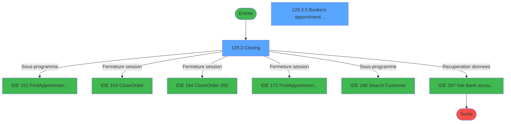
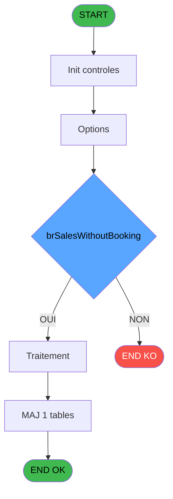
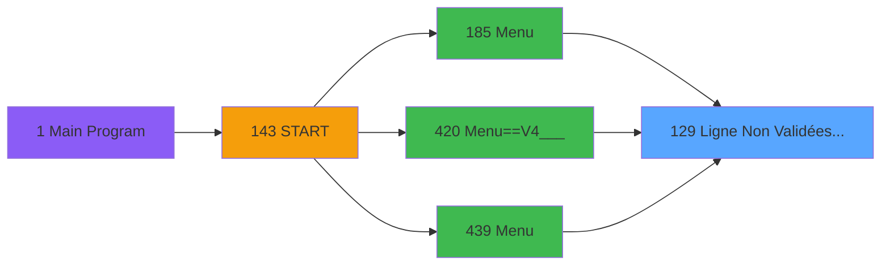
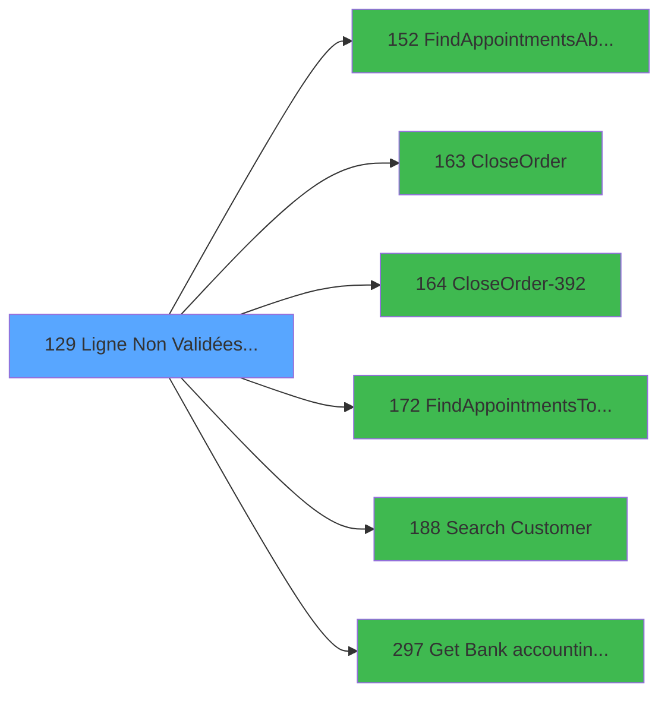

# PVE IDE 129 - Ligne Non Validées & Edit Book

> **Analyse**: Phases 1-4 2026-02-03 09:36 -> 09:36 (18s) | Assemblage 09:36
> **Pipeline**: V7.2 Enrichi
> **Structure**: 4 onglets (Resume | Ecrans | Donnees | Connexions)

<!-- TAB:Resume -->

## 1. FICHE D'IDENTITE

| Attribut | Valeur |
|----------|--------|
| Projet | PVE |
| IDE Position | 129 |
| Nom Programme | Ligne Non Validées & Edit Book |
| Fichier source | `Prg_129.xml` |
| Domaine metier | General |
| Taches | 10 (2 ecrans visibles) |
| Tables modifiees | 1 |
| Programmes appeles | 6 |

## 2. DESCRIPTION FONCTIONNELLE

**Ligne Non Validées & Edit Book** assure la gestion complete de ce processus, accessible depuis [Menu==V4___ (IDE 420)](PVE-IDE-420.md), [Menu (IDE 439)](PVE-IDE-439.md), [Menu (IDE 185)](PVE-IDE-185.md).

Le flux de traitement s'organise en **3 blocs fonctionnels** :

- **Validation** (5 taches) : controles et verifications de coherence
- **Traitement** (3 taches) : traitements metier divers
- **Impression** (2 taches) : generation de tickets et documents

**Donnees modifiees** : 1 tables en ecriture (Table_1548).

**Logique metier** : 2 regles identifiees couvrant conditions metier.

Detail : phases du traitement

#### Phase 1 : Validation (5 taches)

- **129** - Ligne Fact Non Validées & Edit
- **129.1** - Count Article non validé&Editi **[[ECRAN]](#ecran-t2)**
- **129.2** - Count Article non validé&Editi **[[ECRAN]](#ecran-t3)**
- **129.3.4** - Count Article non validé&Editi **[[ECRAN]](#ecran-t8)**
- **129.4** - Count Article non validé&Editi **[[ECRAN]](#ecran-t10)**

#### Phase 2 : Traitement (3 taches)

- **129.3** - Closing **[[ECRAN]](#ecran-t4)**
- **129.3.1** - Count **[[ECRAN]](#ecran-t5)**
- **129.3.5** - Booker's appointments list **[[ECRAN]](#ecran-t9)**

Delegue a : [FindAppointmentsAbsentPOS (IDE 152)](PVE-IDE-152.md), [CloseOrder (IDE 163)](PVE-IDE-163.md), [CloseOrder-392 (IDE 164)](PVE-IDE-164.md), [FindAppointmentsToClose (IDE 172)](PVE-IDE-172.md), [Search Customer (IDE 188)](PVE-IDE-188.md), [Get Bank accounting date (IDE 297)](PVE-IDE-297.md)

#### Phase 3 : Impression (2 taches)

- **129.3.2** - Print **[[ECRAN]](#ecran-t6)**
- **129.3.3** - Print **[[ECRAN]](#ecran-t7)**

#### Tables impactees

| Table | Operations | Role metier |
|-------|-----------|-------------|
| Table_1548 | **W** (1 usages) |  |

## 3. BLOCS FONCTIONNELS

### 3.1 Validation (5 taches)

Controles de coherence : 5 taches verifient les donnees et conditions.

---

#### 129 - Ligne Fact Non Validées & Edit

**Role** : Verification : Ligne Fact Non Validées & Edit.

4 sous-taches directes

| Tache | Nom | Bloc |
|-------|-----|------|
| [129.1](#t2) | Count Article non validé&Editi **[[ECRAN]](#ecran-t2)** | Validation |
| [129.2](#t3) | Count Article non validé&Editi **[[ECRAN]](#ecran-t3)** | Validation |
| [129.3.4](#t8) | Count Article non validé&Editi **[[ECRAN]](#ecran-t8)** | Validation |
| [129.4](#t10) | Count Article non validé&Editi **[[ECRAN]](#ecran-t10)** | Validation |

---

#### 129.1 - Count Article non validé&Editi [[ECRAN]](#ecran-t2)

**Role** : Verification : Count Article non validé&Editi.
**Ecran** : 120 x 195 DLU | [Voir mockup](#ecran-t2)
**Variables liees** : V (V.DateAccounting)

---

#### 129.2 - Count Article non validé&Editi [[ECRAN]](#ecran-t3)

**Role** : Verification : Count Article non validé&Editi.
**Ecran** : 120 x 195 DLU | [Voir mockup](#ecran-t3)
**Variables liees** : V (V.DateAccounting)

---

#### 129.3.4 - Count Article non validé&Editi [[ECRAN]](#ecran-t8)

**Role** : Verification : Count Article non validé&Editi.
**Ecran** : 120 x 195 DLU | [Voir mockup](#ecran-t8)
**Variables liees** : V (V.DateAccounting)

---

#### 129.4 - Count Article non validé&Editi [[ECRAN]](#ecran-t10)

**Role** : Verification : Count Article non validé&Editi.
**Ecran** : 120 x 195 DLU | [Voir mockup](#ecran-t10)
**Variables liees** : V (V.DateAccounting)

### 3.2 Traitement (3 taches)

Traitements internes.

---

#### 129.3 - Closing [[ECRAN]](#ecran-t4)

**Role** : Traitement : Closing.
**Ecran** : 390 x 137 DLU (Type6) | [Voir mockup](#ecran-t4)
**Delegue a** : [FindAppointmentsAbsentPOS (IDE 152)](PVE-IDE-152.md), [CloseOrder (IDE 163)](PVE-IDE-163.md), [CloseOrder-392 (IDE 164)](PVE-IDE-164.md)

---

#### 129.3.1 - Count [[ECRAN]](#ecran-t5)

**Role** : Traitement : Count.
**Ecran** : 2551 x 195 DLU | [Voir mockup](#ecran-t5)
**Variables liees** : V (V.DateAccounting)
**Delegue a** : [FindAppointmentsAbsentPOS (IDE 152)](PVE-IDE-152.md), [CloseOrder (IDE 163)](PVE-IDE-163.md), [CloseOrder-392 (IDE 164)](PVE-IDE-164.md)

---

#### 129.3.5 - Booker's appointments list [[ECRAN]](#ecran-t9)

**Role** : Traitement : Booker's appointments list.
**Ecran** : 1714 x 248 DLU (Type6) | [Voir mockup](#ecran-t9)
**Variables liees** : U (NbrAppointments)
**Delegue a** : [FindAppointmentsAbsentPOS (IDE 152)](PVE-IDE-152.md), [CloseOrder (IDE 163)](PVE-IDE-163.md), [CloseOrder-392 (IDE 164)](PVE-IDE-164.md)

### 3.3 Impression (2 taches)

Generation des documents et tickets.

---

#### 129.3.2 - Print [[ECRAN]](#ecran-t6)

**Role** : Generation du document : Print.
**Ecran** : 2551 x 195 DLU | [Voir mockup](#ecran-t6)
**Variables liees** : E (v. Print ?)

---

#### 129.3.3 - Print [[ECRAN]](#ecran-t7)

**Role** : Generation du document : Print.
**Ecran** : 832 x 195 DLU | [Voir mockup](#ecran-t7)
**Variables liees** : E (v. Print ?)

## 5. REGLES METIER

2 regles identifiees:

### Autres (2 regles)

#### [RM-001] Si P.o.Nbre Enregistrement [A]>1 alors Trim(Str(P.o.Nbre Enregistrement [A] sinon '10P'))&'  sales are not committed.',Trim(Str(P.o.Nbre Enregistrement [A],'10P'))&' sale is not committed.')

| Element | Detail |
|---------|--------|
| **Condition** | `P.o.Nbre Enregistrement [A]>1` |
| **Si vrai** | Trim(Str(P.o.Nbre Enregistrement [A] |
| **Si faux** | '10P'))&'  sales are not committed.',Trim(Str(P.o.Nbre Enregistrement [A],'10P'))&' sale is not committed.') |
| **Variables** | A (P.o.Nbre Enregistrement) |
| **Expression source** | Expression 3 : `IF(P.o.Nbre Enregistrement [A]>1,Trim(Str(P.o.Nbre Enregistr` |
| **Exemple** | Si P.o.Nbre Enregistrement [A]>1 → Trim(Str(P.o.Nbre Enregistrement [A] |

#### [RM-002] Si v.NbrePrepaidIns [J]>1 alors Trim(Str(v.NbrePrepaidIns [J] sinon '10P'))&'  are PREPAID insurances.',Trim(Str(v.NbrePrepaidIns [J],'10P'))&' is PREPAID insurance')

| Element | Detail |
|---------|--------|
| **Condition** | `v.NbrePrepaidIns [J]>1` |
| **Si vrai** | Trim(Str(v.NbrePrepaidIns [J] |
| **Si faux** | '10P'))&'  are PREPAID insurances.',Trim(Str(v.NbrePrepaidIns [J],'10P'))&' is PREPAID insurance') |
| **Variables** | J (v.NbrePrepaidIns) |
| **Expression source** | Expression 4 : `IF(v.NbrePrepaidIns [J]>1,Trim(Str(v.NbrePrepaidIns [J],'10P` |
| **Exemple** | Si v.NbrePrepaidIns [J]>1 → Trim(Str(v.NbrePrepaidIns [J] |

## 6. CONTEXTE

- **Appele par**: [Menu==V4___ (IDE 420)](PVE-IDE-420.md), [Menu (IDE 439)](PVE-IDE-439.md), [Menu (IDE 185)](PVE-IDE-185.md)
- **Appelle**: 6 programmes | **Tables**: 2 (W:1 R:1 L:0) | **Taches**: 10 | **Expressions**: 16

<!-- TAB:Ecrans -->

## 8. ECRANS

### 8.1 Forms visibles (2 / 10)

| # | Position | Tache | Nom | Type | Largeur | Hauteur | Bloc |
|---|----------|-------|-----|------|---------|---------|------|
| 1 | 129.3 | 129.3 | Closing | Type6 | 390 | 137 | Traitement |
| 2 | 129.3.5 | 129.3.5 | Booker's appointments list | Type6 | 1714 | 248 | Traitement |

### 8.2 Mockups Ecrans

---

#### 129.3 - Closing
**Tache** : [129.3](#t4) | **Type** : Type6 | **Dimensions** : 390 x 137 DLU
**Bloc** : Traitement | **Titre IDE** : Closing

<!-- FORM-DATA:
{
    "width":  390,
    "vFactor":  8,
    "type":  "Type6",
    "hFactor":  4,
    "controls":  [
                     {
                         "x":  35,
                         "type":  "label",
                         "var":  "",
                         "y":  15,
                         "w":  320,
                         "fmt":  "",
                         "name":  "",
                         "h":  9,
                         "color":  "182",
                         "text":  "x sales are not committed",
                         "parent":  null
                     },
                     {
                         "x":  59,
                         "type":  "label",
                         "var":  "",
                         "y":  39,
                         "w":  42,
                         "fmt":  "",
                         "name":  "",
                         "h":  9,
                         "color":  "182",
                         "text":  "Options :",
                         "parent":  null
                     },
                     {
                         "x":  109,
                         "type":  "listbox",
                         "var":  "",
                         "y":  39,
                         "w":  171,
                         "fmt":  "",
                         "name":  "ListBoxFilter",
                         "h":  48,
                         "color":  "",
                         "text":  "1,2,3",
                         "parent":  null
                     },
                     {
                         "x":  24,
                         "type":  "button",
                         "var":  "",
                         "y":  102,
                         "w":  109,
                         "fmt":  "\u0026Print",
                         "name":  "Print",
                         "h":  24,
                         "color":  "",
                         "text":  "",
                         "parent":  null
                     },
                     {
                         "x":  141,
                         "type":  "button",
                         "var":  "",
                         "y":  102,
                         "w":  109,
                         "fmt":  "\u0026Select customer",
                         "name":  "SelectCustomer",
                         "h":  24,
                         "color":  "",
                         "text":  "",
                         "parent":  null
                     },
                     {
                         "x":  258,
                         "type":  "button",
                         "var":  "",
                         "y":  102,
                         "w":  109,
                         "fmt":  "\u0026Continue",
                         "name":  "Continue",
                         "h":  24,
                         "color":  "",
                         "text":  "",
                         "parent":  null
                     }
                 ],
    "taskId":  "129.3",
    "height":  137
}
-->

<strong>Boutons : 3 boutons</strong>

| Bouton | Pos (x,y) | Action |
|--------|-----------|--------|
| Print | 24,102 | Lance l'impression |
| Select customer | 141,102 | Ouvre la selection |
| Continue | 258,102 | Bouton fonctionnel |

---

#### 129.3.5 - Booker's appointments list
**Tache** : [129.3.5](#t9) | **Type** : Type6 | **Dimensions** : 1714 x 248 DLU
**Bloc** : Traitement | **Titre IDE** : Booker's appointments list

<!-- FORM-DATA:
{
    "width":  1714,
    "vFactor":  8,
    "type":  "Type6",
    "hFactor":  8,
    "controls":  [
                     {
                         "x":  1,
                         "type":  "label",
                         "var":  "",
                         "y":  2,
                         "w":  1706,
                         "fmt":  "",
                         "name":  "",
                         "h":  42,
                         "color":  "182",
                         "text":  "",
                         "parent":  null
                     },
                     {
                         "x":  10,
                         "type":  "label",
                         "var":  "",
                         "y":  15,
                         "w":  1596,
                         "fmt":  "",
                         "name":  "",
                         "h":  14,
                         "color":  "186",
                         "text":  "BOOKING ITEMS",
                         "parent":  1
                     },
                     {
                         "x":  0,
                         "type":  "table",
                         "var":  "",
                         "name":  "",
                         "titleH":  12,
                         "color":  "6",
                         "w":  1658,
                         "y":  46,
                         "fmt":  "",
                         "parent":  null,
                         "text":  "",
                         "rowH":  24,
                         "h":  168,
                         "cols":  [
                                      {
                                          "title":  "Booking ID",
                                          "layer":  1,
                                          "w":  181
                                      },
                                      {
                                          "title":  "Customer",
                                          "layer":  2,
                                          "w":  411
                                      },
                                      {
                                          "title":  "Description",
                                          "layer":  3,
                                          "w":  321
                                      },
                                      {
                                          "title":  "Start date",
                                          "layer":  4,
                                          "w":  140
                                      },
                                      {
                                          "title":  "Start time",
                                          "layer":  5,
                                          "w":  117
                                      },
                                      {
                                          "title":  "End date",
                                          "layer":  6,
                                          "w":  136
                                      },
                                      {
                                          "title":  "End time",
                                          "layer":  7,
                                          "w":  105
                                      }
                                  ],
                         "rows":  7
                     },
                     {
                         "x":  1614,
                         "type":  "image",
                         "var":  "",
                         "y":  6,
                         "w":  96,
                         "fmt":  "",
                         "name":  "",
                         "h":  37,
                         "color":  "",
                         "text":  "",
                         "parent":  3
                     },
                     {
                         "x":  6,
                         "type":  "edit",
                         "var":  "",
                         "y":  61,
                         "w":  158,
                         "fmt":  "30",
                         "name":  "package_id_out",
                         "h":  17,
                         "color":  "6",
                         "text":  "",
                         "parent":  4
                     },
                     {
                         "x":  187,
                         "type":  "edit",
                         "var":  "",
                         "y":  61,
                         "w":  390,
                         "fmt":  "",
                         "name":  "CustomerFullName",
                         "h":  17,
                         "color":  "6",
                         "text":  "",
                         "parent":  4
                     },
                     {
                         "x":  597,
                         "type":  "edit",
                         "var":  "",
                         "y":  61,
                         "w":  305,
                         "fmt":  "",
                         "name":  "description",
                         "h":  17,
                         "color":  "6",
                         "text":  "",
                         "parent":  4
                     },
                     {
                         "x":  918,
                         "type":  "edit",
                         "var":  "",
                         "y":  61,
                         "w":  126,
                         "fmt":  "##/##/####Z",
                         "name":  "Date",
                         "h":  17,
                         "color":  "6",
                         "text":  "",
                         "parent":  4
                     },
                     {
                         "x":  1059,
                         "type":  "edit",
                         "var":  "",
                         "y":  61,
                         "w":  86,
                         "fmt":  "HH:MMZ",
                         "name":  "Heure",
                         "h":  17,
                         "color":  "6",
                         "text":  "",
                         "parent":  4
                     },
                     {
                         "x":  1176,
                         "type":  "edit",
                         "var":  "",
                         "y":  61,
                         "w":  122,
                         "fmt":  "##/##/####Z",
                         "name":  "DateFin",
                         "h":  17,
                         "color":  "6",
                         "text":  "",
                         "parent":  4
                     },
                     {
                         "x":  1312,
                         "type":  "edit",
                         "var":  "",
                         "y":  61,
                         "w":  93,
                         "fmt":  "HH:MMZ",
                         "name":  "HeureFin",
                         "h":  17,
                         "color":  "6",
                         "text":  "",
                         "parent":  4
                     },
                     {
                         "x":  1654,
                         "type":  "button",
                         "var":  "",
                         "y":  46,
                         "w":  56,
                         "fmt":  "ñ",
                         "name":  "UP",
                         "h":  84,
                         "color":  "",
                         "text":  "",
                         "parent":  null
                     },
                     {
                         "x":  1654,
                         "type":  "button",
                         "var":  "",
                         "y":  130,
                         "w":  56,
                         "fmt":  "ò",
                         "name":  "DOWN",
                         "h":  84,
                         "color":  "",
                         "text":  "",
                         "parent":  null
                     },
                     {
                         "x":  1570,
                         "type":  "button",
                         "var":  "",
                         "y":  219,
                         "w":  140,
                         "fmt":  "\u0026Exit",
                         "name":  "Exit",
                         "h":  27,
                         "color":  "",
                         "text":  "",
                         "parent":  null
                     }
                 ],
    "taskId":  "129.3.5",
    "height":  248
}
-->

<strong>Champs : 7 champs</strong>

| Pos (x,y) | Nom | Variable | Type |
|-----------|-----|----------|------|
| 6,61 | package_id_out | - | edit |
| 187,61 | CustomerFullName | - | edit |
| 597,61 | description | - | edit |
| 918,61 | Date | - | edit |
| 1059,61 | Heure | - | edit |
| 1176,61 | DateFin | - | edit |
| 1312,61 | HeureFin | - | edit |

<strong>Boutons : 3 boutons</strong>

| Bouton | Pos (x,y) | Action |
|--------|-----------|--------|
| ñ | 1654,46 | Bouton fonctionnel |
| ò | 1654,130 | Bouton fonctionnel |
| Exit | 1570,219 | Quitte le programme |

## 9. NAVIGATION

### 9.1 Enchainement des ecrans

**Detail par enchainement :**

| Depuis | Action | Vers | Retour |
|--------|--------|------|--------|
| Closing | Sous-programme | [FindAppointmentsAbsentPOS (IDE 152)](PVE-IDE-152.md) | Retour ecran |
| Closing | Fermeture session | [CloseOrder (IDE 163)](PVE-IDE-163.md) | Retour ecran |
| Closing | Fermeture session | [CloseOrder-392 (IDE 164)](PVE-IDE-164.md) | Retour ecran |
| Closing | Fermeture session | [FindAppointmentsToClose (IDE 172)](PVE-IDE-172.md) | Retour ecran |
| Closing | Sous-programme | [Search Customer (IDE 188)](PVE-IDE-188.md) | Retour ecran |
| Closing | Recuperation donnees | [Get Bank accounting date (IDE 297)](PVE-IDE-297.md) | Retour ecran |

### 9.3 Structure hierarchique (10 taches)

| Position | Tache | Type | Dimensions | Bloc |
|----------|-------|------|------------|------|
| **129.1** | [**Ligne Fact Non Validées & Edit** (129)](#t1) | - | - | Validation |
| 129.1.1 | [Count Article non validé&Editi (129.1)](#t2) [mockup](#ecran-t2) | - | 120x195 | |
| 129.1.2 | [Count Article non validé&Editi (129.2)](#t3) [mockup](#ecran-t3) | - | 120x195 | |
| 129.1.3 | [Count Article non validé&Editi (129.3.4)](#t8) [mockup](#ecran-t8) | - | 120x195 | |
| 129.1.4 | [Count Article non validé&Editi (129.4)](#t10) [mockup](#ecran-t10) | - | 120x195 | |
| **129.2** | [**Closing** (129.3)](#t4) [mockup](#ecran-t4) | Type6 | 390x137 | Traitement |
| 129.2.1 | [Count (129.3.1)](#t5) [mockup](#ecran-t5) | - | 2551x195 | |
| 129.2.2 | [Booker's appointments list (129.3.5)](#t9) [mockup](#ecran-t9) | Type6 | 1714x248 | |
| **129.3** | [**Print** (129.3.2)](#t6) [mockup](#ecran-t6) | - | 2551x195 | Impression |
| 129.3.1 | [Print (129.3.3)](#t7) [mockup](#ecran-t7) | - | 832x195 | |

### 9.4 Algorigramme

> **Legende**: Vert = START/END OK | Rouge = END KO | Bleu = Decisions
> *Algorigramme auto-genere. Utiliser `/algorigramme` pour une synthese metier detaillee.*

<!-- TAB:Donnees -->

## 10. TABLES

### Tables utilisees (2)

| ID | Nom | Description | Type | R | W | L | Usages |
|----|-----|-------------|------|---|---|---|--------|
| 382 | pv_discount_reasons |  | DB | R |   |   | 2 |
| 1548 | Table_1548 |  | MEM |   | **W** |   | 1 |

### Colonnes par table (1 / 2 tables avec colonnes identifiees)

Table 382 - pv_discount_reasons (R) - 2 usages

| Lettre | Variable | Acces | Type |
|--------|----------|-------|------|
| A | TextNbrEnregistrement | R | Unicode |
| B | TextNbrPrepaid | R | Unicode |
| C | ItemFilters | R | Numeric |
| D | date__start_ | R | Alpha |
| E | date__end_ | R | Alpha |
| F | cat | R | Numeric |
| G | sub_cat | R | Numeric |
| H | sub_sub_cat | R | Numeric |
| I | description | R | Unicode |
| J | price | R | Numeric |
| K | discount | R | Numeric |
| L | discount_reason | R | Numeric |
| M | payer_xcust_id | R | Numeric |
| N | payment_type | R | Unicode |
| O | validated__ | R | Logical |
| P | comment | R | Unicode |
| Q | date_create | R | Alpha |
| R | time_create | R | Alpha |
| S | user_create | R | Unicode |
| T | pv_service | R | Unicode |
| U | cpk_quantity | R | Numeric |
| V | cpk_unit_price | R | Numeric |
| W | cpk_vat | R | Numeric |
| X | cpk_article | R | Unicode |
| Y | lieu_vente | R | Unicode |
| Z | vendeur | R | Unicode |
| BA | cpk_montant_prepaid | R | Numeric |
| BB | ExistCustomer? | R | Logical |
| BC | NbrResultFiltred | R | Numeric |

Table 1548 - Table_1548 (**W**) - 1 usages

*Table utilisee uniquement en Link ou aucune colonne Real identifiee dans le DataView.*

## 11. VARIABLES

### 11.1 Parametres entrants (3)

Variables recues du programme appelant ([Menu==V4___ (IDE 420)](PVE-IDE-420.md)).

| Lettre | Nom | Type | Usage dans |
|--------|-----|------|-----------|
| A | P.o.Nbre Enregistrement | Numeric | 4x parametre entrant |
| C | P.o.CustomerSelected | Logical | - |
| D | P.o.Continuer ? | Logical | - |

### 11.2 Variables de session (21)

Variables persistantes pendant toute la session.

| Lettre | Nom | Type | Usage dans |
|--------|-----|------|-----------|
| E | v. Print ? | Numeric | - |
| F | v.Amount Format | Alpha | 1x session |
| G | v.Amount Format sans Z | Alpha | - |
| H | v.Decimal | Numeric | - |
| I | v.NbrSalesWithoutBooking | Numeric | 2x session |
| J | v.NbrePrepaidIns | Numeric | 2x session |
| K | v.textNbrSales | Unicode | 1x session |
| L | v.textNbrPrepaid | Unicode | - |
| M | V.LibEtCustomer | Alpha | - |
| N | V.RoomNumber | Alpha | - |
| O | V.RechercheClubMedPass | Alpha | - |
| P | V.DebutSejour | Date | - |
| Q | V.FinSejour | Date | - |
| R | v.Qualite | Alpha | - |
| S | V.clauseWhereBase | Alpha | - |
| T | V.clauseWhere | Alpha | - |
| V | V.DateAccounting | Date | - |
| W | V.DateDebut | Date | - |
| X | V.TimeDebut | Time | - |
| Y | V.DateFin | Date | - |
| Z | V.TimeFin | Time | - |

### 11.3 Autres (7)

Variables diverses.

| Lettre | Nom | Type | Usage dans |
|--------|-----|------|-----------|
| B | P;i.Service | Alpha | - |
| U | NbrAppointments | Numeric | - |
| BA | BtnContinue | Alpha | - |
| BB | ExistCustomer? | Logical | - |
| BC | NbrResultFiltred | Numeric | - |
| BD | gm_nom | Unicode | - |
| BE | gm_prenom | Unicode | - |

Toutes les 31 variables (liste complete)

| Cat | Lettre | Nom Variable | Type |
|-----|--------|--------------|------|
| P0 | **A** | P.o.Nbre Enregistrement | Numeric |
| P0 | **C** | P.o.CustomerSelected | Logical |
| P0 | **D** | P.o.Continuer ? | Logical |
| V. | **E** | v. Print ? | Numeric |
| V. | **F** | v.Amount Format | Alpha |
| V. | **G** | v.Amount Format sans Z | Alpha |
| V. | **H** | v.Decimal | Numeric |
| V. | **I** | v.NbrSalesWithoutBooking | Numeric |
| V. | **J** | v.NbrePrepaidIns | Numeric |
| V. | **K** | v.textNbrSales | Unicode |
| V. | **L** | v.textNbrPrepaid | Unicode |
| V. | **M** | V.LibEtCustomer | Alpha |
| V. | **N** | V.RoomNumber | Alpha |
| V. | **O** | V.RechercheClubMedPass | Alpha |
| V. | **P** | V.DebutSejour | Date |
| V. | **Q** | V.FinSejour | Date |
| V. | **R** | v.Qualite | Alpha |
| V. | **S** | V.clauseWhereBase | Alpha |
| V. | **T** | V.clauseWhere | Alpha |
| V. | **V** | V.DateAccounting | Date |
| V. | **W** | V.DateDebut | Date |
| V. | **X** | V.TimeDebut | Time |
| V. | **Y** | V.DateFin | Date |
| V. | **Z** | V.TimeFin | Time |
| Autre | **B** | P;i.Service | Alpha |
| Autre | **U** | NbrAppointments | Numeric |
| Autre | **BA** | BtnContinue | Alpha |
| Autre | **BB** | ExistCustomer? | Logical |
| Autre | **BC** | NbrResultFiltred | Numeric |
| Autre | **BD** | gm_nom | Unicode |
| Autre | **BE** | gm_prenom | Unicode |

## 12. EXPRESSIONS

**16 / 16 expressions decodees (100%)**

### 12.1 Repartition par type

| Type | Expressions | Regles |
|------|-------------|--------|
| CALCULATION | 1 | 0 |
| CONDITION | 7 | 2 |
| CONSTANTE | 1 | 0 |
| OTHER | 2 | 0 |
| REFERENCE_VG | 1 | 0 |
| CAST_LOGIQUE | 3 | 0 |
| FORMAT | 1 | 0 |

### 12.2 Expressions cles par type

#### CALCULATION (1 expressions)

| Type | IDE | Expression | Regle |
|------|-----|------------|-------|
| CALCULATION | 10 | `Left (Trim (v.Amount Format [F]),Len (Trim (v.Amount Format [F]))-1)` | - |

#### CONDITION (7 expressions)

| Type | IDE | Expression | Regle |
|------|-----|------------|-------|
| CONDITION | 4 | `IF(v.NbrePrepaidIns [J]>1,Trim(Str(v.NbrePrepaidIns [J],'10P'))&'  are PREPAID insurances.',Trim(Str(v.NbrePrepaidIns [J],'10P'))&' is PREPAID insurance')` | [RM-002](#rm-RM-002) |
| CONDITION | 3 | `IF(P.o.Nbre Enregistrement [A]>1,Trim(Str(P.o.Nbre Enregistrement [A],'10P'))&'  sales are not committed.',Trim(Str(P.o.Nbre Enregistrement [A],'10P'))&' sale is not committed.')` | [RM-001](#rm-RM-001) |
| CONDITION | 6 | `v.NbrePrepaidIns [J] >= 1` | - |
| CONDITION | 8 | `v.NbrSalesWithoutBooking [I] > 0` | - |
| CONDITION | 5 | `P.o.Nbre Enregistrement [A] >= 1` | - |
| ... | | *+2 autres* | |

#### CONSTANTE (1 expressions)

| Type | IDE | Expression | Regle |
|------|-----|------------|-------|
| CONSTANTE | 16 | `'None are Prepaid insurances'` | - |

#### OTHER (2 expressions)

| Type | IDE | Expression | Regle |
|------|-----|------------|-------|
| OTHER | 11 | `GetParam ('DECIMALNUMBER')` | - |
| OTHER | 9 | `GetParam ('AMOUNTFORMAT')` | - |

#### REFERENCE_VG (1 expressions)

| Type | IDE | Expression | Regle |
|------|-----|------------|-------|
| REFERENCE_VG | 12 | `VG65` | - |

#### CAST_LOGIQUE (3 expressions)

| Type | IDE | Expression | Regle |
|------|-----|------------|-------|
| CAST_LOGIQUE | 15 | `VG114 AND GetParam('RENTAL')='TRUE'LOG` | - |
| CAST_LOGIQUE | 14 | `'TRUE'LOG` | - |
| CAST_LOGIQUE | 13 | `'FALSE'LOG` | - |

#### FORMAT (1 expressions)

| Type | IDE | Expression | Regle |
|------|-----|------------|-------|
| FORMAT | 7 | `Trim(v.textNbrSales [K]) & ' of which ' & Trim(Str(v.NbrSalesWithoutBooking [I],'10')) & ' without booking'` | - |

<!-- TAB:Connexions -->

## 13. GRAPHE D'APPELS

### 13.1 Chaine depuis Main (Callers)

Main -> ... -> [Menu==V4___ (IDE 420)](PVE-IDE-420.md) -> **Ligne Non Validées & Edit Book (IDE 129)**

Main -> ... -> [Menu (IDE 439)](PVE-IDE-439.md) -> **Ligne Non Validées & Edit Book (IDE 129)**

Main -> ... -> [Menu (IDE 185)](PVE-IDE-185.md) -> **Ligne Non Validées & Edit Book (IDE 129)**

### 13.2 Callers

| IDE | Nom Programme | Nb Appels |
|-----|---------------|-----------|
| [420](PVE-IDE-420.md) | Menu==V4___ | 2 |
| [439](PVE-IDE-439.md) | Menu | 2 |
| [185](PVE-IDE-185.md) | Menu | 1 |

### 13.3 Callees (programmes appeles)

### 13.4 Detail Callees avec contexte

| IDE | Nom Programme | Appels | Contexte |
|-----|---------------|--------|----------|
| [152](PVE-IDE-152.md) | FindAppointmentsAbsentPOS | 1 | Sous-programme |
| [163](PVE-IDE-163.md) | CloseOrder | 1 | Fermeture session |
| [164](PVE-IDE-164.md) | CloseOrder-392 | 1 | Fermeture session |
| [172](PVE-IDE-172.md) | FindAppointmentsToClose | 1 | Fermeture session |
| [188](PVE-IDE-188.md) | Search Customer | 1 | Sous-programme |
| [297](PVE-IDE-297.md) | Get Bank accounting date | 1 | Recuperation donnees |

## 14. RECOMMANDATIONS MIGRATION

### 14.1 Profil du programme

| Metrique | Valeur | Impact migration |
|----------|--------|-----------------|
| Lignes de logique | 255 | Taille moyenne |
| Expressions | 16 | Peu de logique |
| Tables WRITE | 1 | Impact faible |
| Sous-programmes | 6 | Dependances moderees |
| Ecrans visibles | 2 | Quelques ecrans |
| Code desactive | 1.2% (3 / 255) | Code sain |
| Regles metier | 2 | Quelques regles a preserver |

### 14.2 Plan de migration par bloc

#### Validation (5 taches: 4 ecrans, 1 traitement)

- **Strategie** : FluentValidation avec validators specifiques.
- Chaque tache de validation -> un validator injectable

#### Traitement (3 taches: 3 ecrans, 0 traitement)

- **Strategie** : 3 composant(s) UI (Razor/React) avec formulaires et validation.
- 6 sous-programme(s) a migrer ou a reutiliser depuis les services existants.
- Decomposer les taches en services unitaires testables.

#### Impression (2 taches: 2 ecrans, 0 traitement)

- **Strategie** : Templates HTML -> PDF via wkhtmltopdf ou Puppeteer.
- `PrintService` injectable avec choix imprimante

### 14.3 Dependances critiques

| Dependance | Type | Appels | Impact |
|------------|------|--------|--------|
| Table_1548 | Table WRITE (Memory) | 1x | Schema + repository |
| [FindAppointmentsToClose (IDE 172)](PVE-IDE-172.md) | Sous-programme | 1x | Normale - Fermeture session |
| [Search Customer (IDE 188)](PVE-IDE-188.md) | Sous-programme | 1x | Normale - Sous-programme |
| [Get Bank accounting date (IDE 297)](PVE-IDE-297.md) | Sous-programme | 1x | Normale - Recuperation donnees |
| [FindAppointmentsAbsentPOS (IDE 152)](PVE-IDE-152.md) | Sous-programme | 1x | Normale - Sous-programme |
| [CloseOrder (IDE 163)](PVE-IDE-163.md) | Sous-programme | 1x | Normale - Fermeture session |
| [CloseOrder-392 (IDE 164)](PVE-IDE-164.md) | Sous-programme | 1x | Normale - Fermeture session |

---
*Spec DETAILED generee par Pipeline V7.2 - 2026-02-03 09:36*
