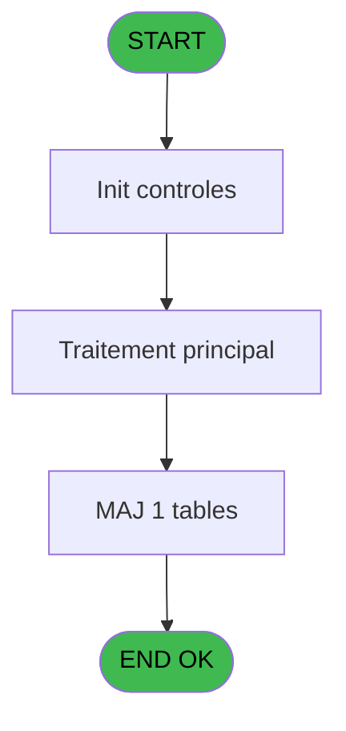
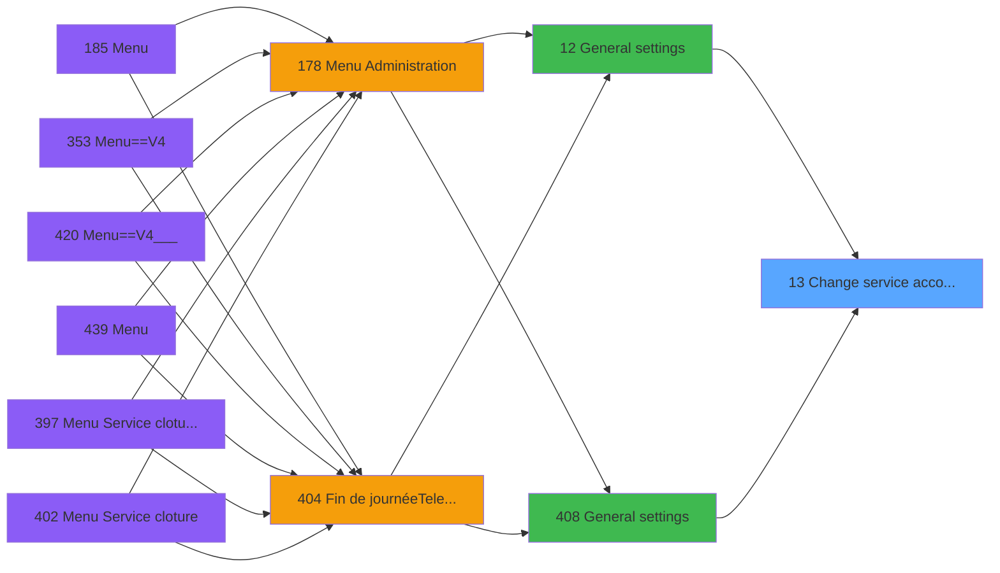

# PVE IDE 13 - Change service accounting date

> **Analyse**: Phases 1-4 2026-02-03 01:01 -> 01:01 (39s) | Assemblage 01:01
> **Pipeline**: V7.2 Enrichi
> **Structure**: 4 onglets (Resume | Ecrans | Donnees | Connexions)

<!-- TAB:Resume -->

## 1. FICHE D'IDENTITE

| Attribut | Valeur |
|----------|--------|
| Projet | PVE |
| IDE Position | 13 |
| Nom Programme | Change service accounting date |
| Fichier source | `Prg_13.xml` |
| Domaine metier | Change |
| Taches | 1 (1 ecrans visibles) |
| Tables modifiees | 1 |
| Programmes appeles | 0 |

## 2. DESCRIPTION FONCTIONNELLE

**Change service accounting date** assure la gestion complete de ce processus, accessible depuis [General settings (IDE 12)](PVE-IDE-12.md), [General settings (IDE 408)](PVE-IDE-408.md).

Le flux de traitement s'organise en **1 blocs fonctionnels** :

- **Traitement** (1 tache) : traitements metier divers

**Donnees modifiees** : 1 tables en ecriture (pv_credit_card).

## 3. BLOCS FONCTIONNELS

### 3.1 Traitement (1 tache)

Traitements internes.

---

#### 13 - Service accounting date [[ECRAN]](#ecran-t1)

**Role** : Traitement : Service accounting date.
**Ecran** : 307 x 115 DLU (MDI) | [Voir mockup](#ecran-t1)
**Variables liees** : A (P.Service), C (v.accounting date)

## 5. REGLES METIER

*(Aucune regle metier identifiee)*

## 6. CONTEXTE

- **Appele par**: [General settings (IDE 12)](PVE-IDE-12.md), [General settings (IDE 408)](PVE-IDE-408.md)
- **Appelle**: 0 programmes | **Tables**: 1 (W:1 R:0 L:0) | **Taches**: 1 | **Expressions**: 6

<!-- TAB:Ecrans -->

## 8. ECRANS

### 8.1 Forms visibles (1 / 1)

| # | Position | Tache | Nom | Type | Largeur | Hauteur | Bloc |
|---|----------|-------|-----|------|---------|---------|------|
| 1 | 13 | 13 | Service accounting date | MDI | 307 | 115 | Traitement |

### 8.2 Mockups Ecrans

---

#### 13 - Service accounting date
**Tache** : [13](#t1) | **Type** : MDI | **Dimensions** : 307 x 115 DLU
**Bloc** : Traitement | **Titre IDE** : Service accounting date

<!-- FORM-DATA:
{
    "width":  307,
    "vFactor":  8,
    "type":  "MDI",
    "hFactor":  4,
    "controls":  [
                     {
                         "x":  40,
                         "type":  "label",
                         "var":  "",
                         "y":  57,
                         "w":  136,
                         "fmt":  "",
                         "name":  "",
                         "h":  14,
                         "color":  "183",
                         "text":  "Service accounting date",
                         "parent":  null
                     },
                     {
                         "x":  0,
                         "type":  "label",
                         "var":  "",
                         "y":  0,
                         "w":  307,
                         "fmt":  "",
                         "name":  "",
                         "h":  41,
                         "color":  "182",
                         "text":  "",
                         "parent":  null
                     },
                     {
                         "x":  24,
                         "type":  "label",
                         "var":  "",
                         "y":  10,
                         "w":  225,
                         "fmt":  "",
                         "name":  "",
                         "h":  22,
                         "color":  "186",
                         "text":  "Manually initialize or change the accounting date",
                         "parent":  3
                     },
                     {
                         "x":  0,
                         "type":  "label",
                         "var":  "",
                         "y":  86,
                         "w":  307,
                         "fmt":  "",
                         "name":  "",
                         "h":  29,
                         "color":  "183",
                         "text":  "",
                         "parent":  null
                     },
                     {
                         "x":  180,
                         "type":  "edit",
                         "var":  "",
                         "y":  57,
                         "w":  77,
                         "fmt":  "",
                         "name":  "",
                         "h":  14,
                         "color":  "110",
                         "text":  "",
                         "parent":  null
                     },
                     {
                         "x":  152,
                         "type":  "button",
                         "var":  "",
                         "y":  91,
                         "w":  77,
                         "fmt":  "\u0026Ok",
                         "name":  "",
                         "h":  24,
                         "color":  "",
                         "text":  "",
                         "parent":  null
                     },
                     {
                         "x":  228,
                         "type":  "button",
                         "var":  "",
                         "y":  91,
                         "w":  77,
                         "fmt":  "\u0026Cancel",
                         "name":  "",
                         "h":  24,
                         "color":  "",
                         "text":  "",
                         "parent":  null
                     },
                     {
                         "x":  258,
                         "type":  "image",
                         "var":  "",
                         "y":  3,
                         "w":  48,
                         "fmt":  "",
                         "name":  "",
                         "h":  37,
                         "color":  "",
                         "text":  "",
                         "parent":  5
                     }
                 ],
    "taskId":  "13",
    "height":  115
}
-->

<strong>Champs : 1 champs</strong>

| Pos (x,y) | Nom | Variable | Type |
|-----------|-----|----------|------|
| 180,57 | (sans nom) | - | edit |

<strong>Boutons : 2 boutons</strong>

| Bouton | Pos (x,y) | Action |
|--------|-----------|--------|
| Ok | 152,91 | Valide la saisie et enregistre |
| Cancel | 228,91 | Annule et retour au menu |

## 9. NAVIGATION

Ecran unique: **Service accounting date**

### 9.3 Structure hierarchique (1 tache)

| Position | Tache | Type | Dimensions | Bloc |
|----------|-------|------|------------|------|
| **13.1** | [**Service accounting date** (13)](#t1) [mockup](#ecran-t1) | MDI | 307x115 | Traitement |

### 9.4 Algorigramme

> **Legende**: Vert = START/END OK | Rouge = END KO | Bleu = Decisions
> *Algorigramme auto-genere. Utiliser `/algorigramme` pour une synthese metier detaillee.*

<!-- TAB:Donnees -->

## 10. TABLES

### Tables utilisees (1)

| ID | Nom | Description | Type | R | W | L | Usages |
|----|-----|-------------|------|---|---|---|--------|
| 374 | pv_credit_card |  | DB |   | **W** |   | 1 |

### Colonnes par table (1 / 1 tables avec colonnes identifiees)

Table 374 - pv_credit_card (**W**) - 1 usages

| Lettre | Variable | Acces | Type |
|--------|----------|-------|------|
| A | P.Service | W | Unicode |
| B | v.confirmation | W | Numeric |
| C | v.accounting date | W | Date |

## 11. VARIABLES

### 11.1 Parametres entrants (1)

Variables recues du programme appelant ([General settings (IDE 12)](PVE-IDE-12.md)).

| Lettre | Nom | Type | Usage dans |
|--------|-----|------|-----------|
| A | P.Service | Unicode | 1x parametre entrant |

### 11.2 Variables de session (2)

Variables persistantes pendant toute la session.

| Lettre | Nom | Type | Usage dans |
|--------|-----|------|-----------|
| B | v.confirmation | Numeric | 2x session |
| C | v.accounting date | Date | - |

## 12. EXPRESSIONS

**6 / 6 expressions decodees (100%)**

### 12.1 Repartition par type

| Type | Expressions | Regles |
|------|-------------|--------|
| CONSTANTE | 1 | 0 |
| OTHER | 3 | 0 |
| CONDITION | 2 | 0 |

### 12.2 Expressions cles par type

#### CONSTANTE (1 expressions)

| Type | IDE | Expression | Regle |
|------|-----|------------|-------|
| CONSTANTE | 1 | `'C'` | - |

#### OTHER (3 expressions)

| Type | IDE | Expression | Regle |
|------|-----|------------|-------|
| OTHER | 6 | `[F]` | - |
| OTHER | 3 | `[E]` | - |
| OTHER | 2 | `P.Service [A]` | - |

#### CONDITION (2 expressions)

| Type | IDE | Expression | Regle |
|------|-----|------------|-------|
| CONDITION | 5 | `v.confirmation [B]<>6` | - |
| CONDITION | 4 | `v.confirmation [B]=6` | - |

<!-- TAB:Connexions -->

## 13. GRAPHE D'APPELS

### 13.1 Chaine depuis Main (Callers)

Main -> ... -> [General settings (IDE 12)](PVE-IDE-12.md) -> **Change service accounting date (IDE 13)**

Main -> ... -> [General settings (IDE 408)](PVE-IDE-408.md) -> **Change service accounting date (IDE 13)**

### 13.2 Callers

| IDE | Nom Programme | Nb Appels |
|-----|---------------|-----------|
| [12](PVE-IDE-12.md) | General settings | 1 |
| [408](PVE-IDE-408.md) | General settings | 1 |

### 13.3 Callees (programmes appeles)

### 13.4 Detail Callees avec contexte

| IDE | Nom Programme | Appels | Contexte |
|-----|---------------|--------|----------|
| - | (aucun) | - | - |

## 14. RECOMMANDATIONS MIGRATION

### 14.1 Profil du programme

| Metrique | Valeur | Impact migration |
|----------|--------|-----------------|
| Lignes de logique | 13 | Programme compact |
| Expressions | 6 | Peu de logique |
| Tables WRITE | 1 | Impact faible |
| Sous-programmes | 0 | Peu de dependances |
| Ecrans visibles | 1 | Ecran unique ou traitement batch |
| Code desactive | 0% (0 / 13) | Code sain |
| Regles metier | 0 | Pas de regle identifiee |

### 14.2 Plan de migration par bloc

#### Traitement (1 tache: 1 ecran, 0 traitement)

- **Strategie** : 1 composant(s) UI (Razor/React) avec formulaires et validation.
- Decomposer les taches en services unitaires testables.

### 14.3 Dependances critiques

| Dependance | Type | Appels | Impact |
|------------|------|--------|--------|
| pv_credit_card | Table WRITE (Database) | 1x | Schema + repository |

---
*Spec DETAILED generee par Pipeline V7.2 - 2026-02-03 01:01*
