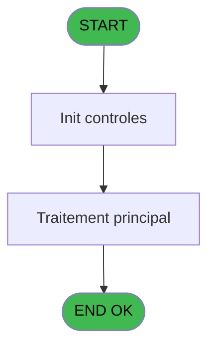
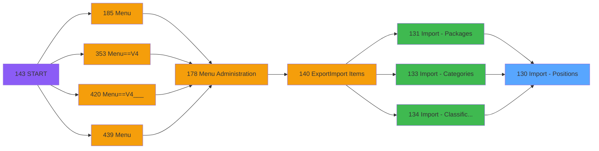

# PVE IDE 130 - Import - Positions

> **Analyse**: Phases 1-4 2026-02-03 09:36 -> 09:36 (17s) | Assemblage 09:36
> **Pipeline**: V7.2 Enrichi
> **Structure**: 4 onglets (Resume | Ecrans | Donnees | Connexions)

<!-- TAB:Resume -->

## 1. FICHE D'IDENTITE

| Attribut | Valeur |
|----------|--------|
| Projet | PVE |
| IDE Position | 130 |
| Nom Programme | Import - Positions |
| Fichier source | `Prg_130.xml` |
| Domaine metier | General |
| Taches | 1 (0 ecrans visibles) |
| Tables modifiees | 0 |
| Programmes appeles | 0 |

## 2. DESCRIPTION FONCTIONNELLE

**Import - Positions** assure la gestion complete de ce processus, accessible depuis [Import - Packages (IDE 131)](PVE-IDE-131.md), [Import - Categories (IDE 133)](PVE-IDE-133.md), [Import - Classifications (IDE 134)](PVE-IDE-134.md).

Le flux de traitement s'organise en **1 blocs fonctionnels** :

- **Traitement** (1 tache) : traitements metier divers

## 3. BLOCS FONCTIONNELS

### 3.1 Traitement (1 tache)

Traitements internes.

---

#### 130 - Import - Positions

**Role** : Traitement : Import - Positions.

## 5. REGLES METIER

*(Aucune regle metier identifiee)*

## 6. CONTEXTE

- **Appele par**: [Import - Packages (IDE 131)](PVE-IDE-131.md), [Import - Categories (IDE 133)](PVE-IDE-133.md), [Import - Classifications (IDE 134)](PVE-IDE-134.md)
- **Appelle**: 0 programmes | **Tables**: 0 (W:0 R:0 L:0) | **Taches**: 1 | **Expressions**: 28

<!-- TAB:Ecrans -->

## 8. ECRANS

*(Programme sans ecran visible)*

## 9. NAVIGATION

### 9.3 Structure hierarchique (1 tache)

| Position | Tache | Type | Dimensions | Bloc |
|----------|-------|------|------------|------|
| **130.1** | [**Import - Positions** (130)](#t1) | MDI | - | Traitement |

### 9.4 Algorigramme

> **Legende**: Vert = START/END OK | Rouge = END KO | Bleu = Decisions
> *Algorigramme auto-genere. Utiliser `/algorigramme` pour une synthese metier detaillee.*

<!-- TAB:Donnees -->

## 10. TABLES

### Tables utilisees (0)

| ID | Nom | Description | Type | R | W | L | Usages |
|----|-----|-------------|------|---|---|---|--------|

### Colonnes par table (0 / 0 tables avec colonnes identifiees)

## 11. VARIABLES

### 11.1 Parametres entrants (23)

Variables recues du programme appelant ([Import - Packages (IDE 131)](PVE-IDE-131.md)).

| Lettre | Nom | Type | Usage dans |
|--------|-----|------|-----------|
| A | P. Ascii | Alpha | 2x parametre entrant |
| B | P. C ou P ou D | Alpha | 2x parametre entrant |
| C | P. Position 1 | Numeric | [130](#t1) |
| D | P. Position 2 | Numeric | [130](#t1) |
| E | P. Position 3 | Numeric | [130](#t1) |
| F | P. Position 4 | Numeric | [130](#t1) |
| G | P. Position 5 | Numeric | [130](#t1) |
| H | P. Position 6 | Numeric | [130](#t1) |
| I | P. Position 7 | Numeric | [130](#t1) |
| J | P. Position 8 | Numeric | [130](#t1) |
| K | P. Position 9 | Numeric | [130](#t1) |
| L | P. Position 10 | Numeric | [130](#t1) |
| M | P. Position 11 | Numeric | [130](#t1) |
| N | P. Position 12 | Numeric | [130](#t1) |
| O | P. Position 13 | Numeric | [130](#t1) |
| P | P. Position 14 | Numeric | [130](#t1) |
| Q | P. Position 15 | Numeric | [130](#t1) |
| R | P. Position 16 | Numeric | [130](#t1) |
| S | P. Position 17 | Numeric | [130](#t1) |
| T | P. Position 18 | Numeric | [130](#t1) |
| U | P. Position 19 | Numeric | [130](#t1) |
| V | P. Position 20 | Numeric | [130](#t1) |
| W | P. Position 21 | Numeric | [130](#t1) |

### 11.2 Autres (1)

Variables diverses.

| Lettre | Nom | Type | Usage dans |
|--------|-----|------|-----------|
| X | L Traité | Logical | 20x refs |

Toutes les 24 variables (liste complete)

| Cat | Lettre | Nom Variable | Type |
|-----|--------|--------------|------|
| P0 | **A** | P. Ascii | Alpha |
| P0 | **B** | P. C ou P ou D | Alpha |
| P0 | **C** | P. Position 1 | Numeric |
| P0 | **D** | P. Position 2 | Numeric |
| P0 | **E** | P. Position 3 | Numeric |
| P0 | **F** | P. Position 4 | Numeric |
| P0 | **G** | P. Position 5 | Numeric |
| P0 | **H** | P. Position 6 | Numeric |
| P0 | **I** | P. Position 7 | Numeric |
| P0 | **J** | P. Position 8 | Numeric |
| P0 | **K** | P. Position 9 | Numeric |
| P0 | **L** | P. Position 10 | Numeric |
| P0 | **M** | P. Position 11 | Numeric |
| P0 | **N** | P. Position 12 | Numeric |
| P0 | **O** | P. Position 13 | Numeric |
| P0 | **P** | P. Position 14 | Numeric |
| P0 | **Q** | P. Position 15 | Numeric |
| P0 | **R** | P. Position 16 | Numeric |
| P0 | **S** | P. Position 17 | Numeric |
| P0 | **T** | P. Position 18 | Numeric |
| P0 | **U** | P. Position 19 | Numeric |
| P0 | **V** | P. Position 20 | Numeric |
| P0 | **W** | P. Position 21 | Numeric |
| Autre | **X** | L Traité | Logical |

## 12. EXPRESSIONS

**28 / 28 expressions decodees (100%)**

### 12.1 Repartition par type

| Type | Expressions | Regles |
|------|-------------|--------|
| CAST_LOGIQUE | 2 | 0 |
| CONDITION | 25 | 0 |
| OTHER | 1 | 0 |

### 12.2 Expressions cles par type

#### CAST_LOGIQUE (2 expressions)

| Type | IDE | Expression | Regle |
|------|-----|------------|-------|
| CAST_LOGIQUE | 3 | `'TRUE'LOG` | - |
| CAST_LOGIQUE | 1 | `'FALSE'LOG` | - |

#### CONDITION (25 expressions)

| Type | IDE | Expression | Regle |
|------|-----|------------|-------|
| CONDITION | 20 | `P. Position 14 [P]=0 AND NOT (L Traité [X])` | - |
| CONDITION | 21 | `P. Position 15 [Q]=0 AND NOT (L Traité [X])` | - |
| CONDITION | 22 | `P. Position 16 [R]=0 AND NOT (L Traité [X])` | - |
| CONDITION | 17 | `P. Position 11 [M]=0 AND NOT (L Traité [X])` | - |
| CONDITION | 18 | `P. Position 12 [N]=0 AND NOT (L Traité [X])` | - |
| ... | | *+20 autres* | |

#### OTHER (1 expressions)

| Type | IDE | Expression | Regle |
|------|-----|------------|-------|
| OTHER | 4 | `Counter (0)` | - |

### 12.3 Toutes les expressions (28)

Voir les 28 expressions

#### CAST_LOGIQUE (2)

| IDE | Expression Decodee |
|-----|-------------------|
| 1 | `'FALSE'LOG` |
| 3 | `'TRUE'LOG` |

#### CONDITION (25)

| IDE | Expression Decodee |
|-----|-------------------|
| 2 | `MID (P. Ascii [A],Counter (0),1)=';'` |
| 5 | `P. Position 1 [C]=0` |
| 6 | `P. Position 2 [D]=0 AND NOT (L Traité [X])` |
| 7 | `P. Position 3 [E]=0 AND NOT (L Traité [X])` |
| 8 | `P. Position 4 [F]=0 AND NOT (L Traité [X])` |
| 9 | `P. Position 5 [G]=0 AND NOT (L Traité [X])` |
| 10 | `P. C ou P ou D [B]='P' OR P. C ou P ou D [B]='D' OR P. C ou P ou D [B]='C'` |
| 11 | `P. Position 6 [H]=0 AND NOT (L Traité [X])` |
| 12 | `P. Position 7 [I]=0 AND NOT (L Traité [X])` |
| 13 | `P. C ou P ou D [B]='P'` |
| 14 | `P. Position 8 [J]=0 AND NOT (L Traité [X])` |
| 15 | `P. Position 9 [K]=0 AND NOT (L Traité [X])` |
| 16 | `P. Position 10 [L]=0 AND NOT (L Traité [X])` |
| 17 | `P. Position 11 [M]=0 AND NOT (L Traité [X])` |
| 18 | `P. Position 12 [N]=0 AND NOT (L Traité [X])` |
| 19 | `P. Position 13 [O]=0 AND NOT (L Traité [X])` |
| 20 | `P. Position 14 [P]=0 AND NOT (L Traité [X])` |
| 21 | `P. Position 15 [Q]=0 AND NOT (L Traité [X])` |
| 22 | `P. Position 16 [R]=0 AND NOT (L Traité [X])` |
| 23 | `P. Position 17 [S]=0 AND NOT (L Traité [X])` |
| 24 | `P. Position 18 [T]=0 AND NOT (L Traité [X])` |
| 25 | `P. Position 19 [U]=0 AND NOT (L Traité [X])` |
| 26 | `P. Position 20 [V]=0 AND NOT (L Traité [X])` |
| 27 | `P. Position 21 [W]=0 AND NOT (L Traité [X])` |
| 28 | `Counter (0)=Len (Trim (P. Ascii [A]))` |

#### OTHER (1)

| IDE | Expression Decodee |
|-----|-------------------|
| 4 | `Counter (0)` |

<!-- TAB:Connexions -->

## 13. GRAPHE D'APPELS

### 13.1 Chaine depuis Main (Callers)

Main -> ... -> [Import - Packages (IDE 131)](PVE-IDE-131.md) -> **Import - Positions (IDE 130)**

Main -> ... -> [Import - Categories (IDE 133)](PVE-IDE-133.md) -> **Import - Positions (IDE 130)**

Main -> ... -> [Import - Classifications (IDE 134)](PVE-IDE-134.md) -> **Import - Positions (IDE 130)**

### 13.2 Callers

| IDE | Nom Programme | Nb Appels |
|-----|---------------|-----------|
| [131](PVE-IDE-131.md) | Import - Packages | 1 |
| [133](PVE-IDE-133.md) | Import - Categories | 1 |
| [134](PVE-IDE-134.md) | Import - Classifications | 1 |

### 13.3 Callees (programmes appeles)

### 13.4 Detail Callees avec contexte

| IDE | Nom Programme | Appels | Contexte |
|-----|---------------|--------|----------|
| - | (aucun) | - | - |

## 14. RECOMMANDATIONS MIGRATION

### 14.1 Profil du programme

| Metrique | Valeur | Impact migration |
|----------|--------|-----------------|
| Lignes de logique | 141 | Programme compact |
| Expressions | 28 | Peu de logique |
| Tables WRITE | 0 | Impact faible |
| Sous-programmes | 0 | Peu de dependances |
| Ecrans visibles | 0 | Ecran unique ou traitement batch |
| Code desactive | 0% (0 / 141) | Code sain |
| Regles metier | 0 | Pas de regle identifiee |

### 14.2 Plan de migration par bloc

#### Traitement (1 tache: 0 ecran, 1 traitement)

- **Strategie** : 1 service(s) backend injectable(s) (Domain Services).
- Decomposer les taches en services unitaires testables.

### 14.3 Dependances critiques

| Dependance | Type | Appels | Impact |
|------------|------|--------|--------|

---
*Spec DETAILED generee par Pipeline V7.2 - 2026-02-03 09:36*
