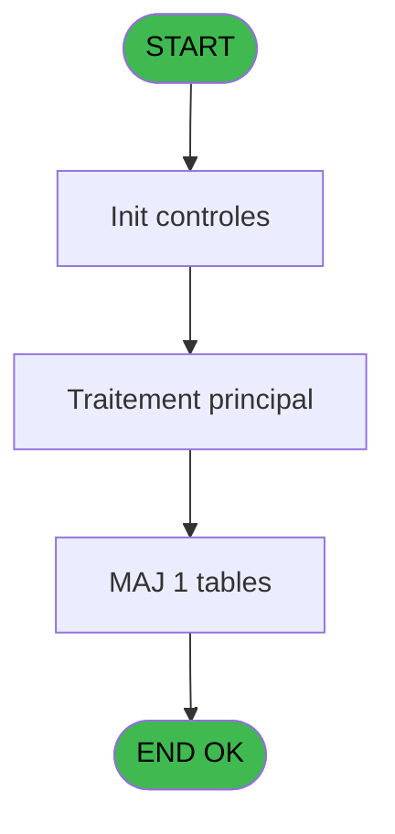
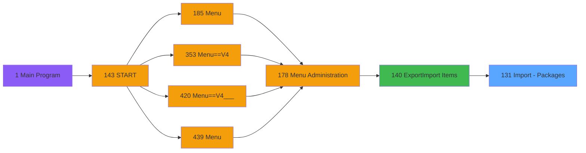

# PVE IDE 131 - Import - Packages

> **Analyse**: Phases 1-4 2026-02-03 09:36 -> 09:37 (18s) | Assemblage 09:37
> **Pipeline**: V7.2 Enrichi
> **Structure**: 4 onglets (Resume | Ecrans | Donnees | Connexions)

<!-- TAB:Resume -->

## 1. FICHE D'IDENTITE

| Attribut | Valeur |
|----------|--------|
| Projet | PVE |
| IDE Position | 131 |
| Nom Programme | Import - Packages |
| Fichier source | `Prg_131.xml` |
| Domaine metier | General |
| Taches | 2 (0 ecrans visibles) |
| Tables modifiees | 1 |
| Programmes appeles | 1 |

## 2. DESCRIPTION FONCTIONNELLE

**Import - Packages** assure la gestion complete de ce processus, accessible depuis [Export/Import Items (IDE 140)](PVE-IDE-140.md).

Le flux de traitement s'organise en **1 blocs fonctionnels** :

- **Traitement** (2 taches) : traitements metier divers

**Donnees modifiees** : 1 tables en ecriture (Temp_service_cash).

## 3. BLOCS FONCTIONNELS

### 3.1 Traitement (2 taches)

Traitements internes.

---

#### 131 - Import - Packages

**Role** : Traitement : Import - Packages.
**Delegue a** : [Import - Positions (IDE 130)](PVE-IDE-130.md)

---

#### 131.1 - Mise à jour Package

**Role** : Traitement : Mise à jour Package.
**Delegue a** : [Import - Positions (IDE 130)](PVE-IDE-130.md)

## 5. REGLES METIER

*(Aucune regle metier identifiee)*

## 6. CONTEXTE

- **Appele par**: [Export/Import Items (IDE 140)](PVE-IDE-140.md)
- **Appelle**: 1 programmes | **Tables**: 1 (W:1 R:0 L:0) | **Taches**: 2 | **Expressions**: 13

<!-- TAB:Ecrans -->

## 8. ECRANS

*(Programme sans ecran visible)*

## 9. NAVIGATION

### 9.3 Structure hierarchique (2 taches)

| Position | Tache | Type | Dimensions | Bloc |
|----------|-------|------|------------|------|
| **131.1** | [**Import - Packages** (131)](#t1) | MDI | - | Traitement |
| 131.1.1 | [Mise à jour Package (131.1)](#t2) | MDI | - | |

### 9.4 Algorigramme

> **Legende**: Vert = START/END OK | Rouge = END KO | Bleu = Decisions
> *Algorigramme auto-genere. Utiliser `/algorigramme` pour une synthese metier detaillee.*

<!-- TAB:Donnees -->

## 10. TABLES

### Tables utilisees (1)

| ID | Nom | Description | Type | R | W | L | Usages |
|----|-----|-------------|------|---|---|---|--------|
| 759 | Temp_service_cash | Services / filieres | DB |   | **W** |   | 1 |

### Colonnes par table (0 / 1 tables avec colonnes identifiees)

Table 759 - Temp_service_cash (**W**) - 1 usages

*Table utilisee uniquement en Link ou aucune colonne Real identifiee dans le DataView.*

## 11. VARIABLES

### 11.1 Parametres entrants (2)

Variables recues du programme appelant ([Export/Import Items (IDE 140)](PVE-IDE-140.md)).

| Lettre | Nom | Type | Usage dans |
|--------|-----|------|-----------|
| A | P. Nom Fichier CSV | Alpha | 1x parametre entrant |
| B | P. LastCategorieID | Numeric | - |

### 11.2 Variables de session (8)

Variables persistantes pendant toute la session.

| Lettre | Nom | Type | Usage dans |
|--------|-----|------|-----------|
| C | V Ascii | Alpha | 8x session |
| L | V Position 1 | Numeric | 2x session |
| M | V Position 2 | Numeric | 2x session |
| N | V Position 3 | Numeric | 2x session |
| O | V Position 4 | Numeric | 2x session |
| P | V Position 5 | Numeric | 2x session |
| Q | V Position 6 | Numeric | 2x session |
| R | V Position 7 | Numeric | 2x session |

### 11.3 Autres (8)

Variables diverses.

| Lettre | Nom | Type | Usage dans |
|--------|-----|------|-----------|
| D | IProductCategory | Numeric | - |
| E | IProductSCategory | Numeric | - |
| F | IProductProdId | Numeric | - |
| G | IProductIeme | Numeric | - |
| H | IDetailCategory | Numeric | - |
| I | IDetailSCategory | Numeric | - |
| J | IDetailProdId | Numeric | - |
| K | IDetailProdQuantity | Numeric | - |

Toutes les 18 variables (liste complete)

| Cat | Lettre | Nom Variable | Type |
|-----|--------|--------------|------|
| P0 | **A** | P. Nom Fichier CSV | Alpha |
| P0 | **B** | P. LastCategorieID | Numeric |
| V. | **C** | V Ascii | Alpha |
| V. | **L** | V Position 1 | Numeric |
| V. | **M** | V Position 2 | Numeric |
| V. | **N** | V Position 3 | Numeric |
| V. | **O** | V Position 4 | Numeric |
| V. | **P** | V Position 5 | Numeric |
| V. | **Q** | V Position 6 | Numeric |
| V. | **R** | V Position 7 | Numeric |
| Autre | **D** | IProductCategory | Numeric |
| Autre | **E** | IProductSCategory | Numeric |
| Autre | **F** | IProductProdId | Numeric |
| Autre | **G** | IProductIeme | Numeric |
| Autre | **H** | IDetailCategory | Numeric |
| Autre | **I** | IDetailSCategory | Numeric |
| Autre | **J** | IDetailProdId | Numeric |
| Autre | **K** | IDetailProdQuantity | Numeric |

## 12. EXPRESSIONS

**13 / 13 expressions decodees (100%)**

### 12.1 Repartition par type

| Type | Expressions | Regles |
|------|-------------|--------|
| CALCULATION | 8 | 0 |
| CONSTANTE | 2 | 0 |
| OTHER | 2 | 0 |
| CONDITION | 1 | 0 |

### 12.2 Expressions cles par type

#### CALCULATION (8 expressions)

| Type | IDE | Expression | Regle |
|------|-----|------------|-------|
| CALCULATION | 9 | `Val (MID (V Ascii [C],V Position 5 [P]+1,V Position 6 [Q]-V Position 5 [P]-1),'2P0')` | - |
| CALCULATION | 8 | `Val (MID (V Ascii [C],V Position 4 [O]+1,V Position 5 [P]-V Position 4 [O]-1),'2P0')` | - |
| CALCULATION | 11 | `Val (MID (V Ascii [C],V Position 7 [R]+1,10),'6.3')` | - |
| CALCULATION | 10 | `Val (MID (V Ascii [C],V Position 6 [Q]+1,V Position 7 [R]-V Position 6 [Q]-1),'2P0')` | - |
| CALCULATION | 5 | `Val (MID (V Ascii [C],V Position 1 [L]+1,V Position 2 [M]-V Position 1 [L]-1),'2P0')` | - |
| ... | | *+3 autres* | |

#### CONSTANTE (2 expressions)

| Type | IDE | Expression | Regle |
|------|-----|------------|-------|
| CONSTANTE | 12 | `'D'` | - |
| CONSTANTE | 2 | `0` | - |

#### OTHER (2 expressions)

| Type | IDE | Expression | Regle |
|------|-----|------------|-------|
| OTHER | 13 | `EOF (0,1)` | - |
| OTHER | 1 | `P. Nom Fichier CSV [A]` | - |

#### CONDITION (1 expressions)

| Type | IDE | Expression | Regle |
|------|-----|------------|-------|
| CONDITION | 3 | `Counter (0)>1` | - |

<!-- TAB:Connexions -->

## 13. GRAPHE D'APPELS

### 13.1 Chaine depuis Main (Callers)

Main -> ... -> [Export/Import Items (IDE 140)](PVE-IDE-140.md) -> **Import - Packages (IDE 131)**

### 13.2 Callers

| IDE | Nom Programme | Nb Appels |
|-----|---------------|-----------|
| [140](PVE-IDE-140.md) | Export/Import Items | 1 |

### 13.3 Callees (programmes appeles)

### 13.4 Detail Callees avec contexte

| IDE | Nom Programme | Appels | Contexte |
|-----|---------------|--------|----------|
| [130](PVE-IDE-130.md) | Import - Positions | 1 | Sous-programme |

## 14. RECOMMANDATIONS MIGRATION

### 14.1 Profil du programme

| Metrique | Valeur | Impact migration |
|----------|--------|-----------------|
| Lignes de logique | 52 | Programme compact |
| Expressions | 13 | Peu de logique |
| Tables WRITE | 1 | Impact faible |
| Sous-programmes | 1 | Peu de dependances |
| Ecrans visibles | 0 | Ecran unique ou traitement batch |
| Code desactive | 0% (0 / 52) | Code sain |
| Regles metier | 0 | Pas de regle identifiee |

### 14.2 Plan de migration par bloc

#### Traitement (2 taches: 0 ecran, 2 traitements)

- **Strategie** : 2 service(s) backend injectable(s) (Domain Services).
- 1 sous-programme(s) a migrer ou a reutiliser depuis les services existants.
- Decomposer les taches en services unitaires testables.

### 14.3 Dependances critiques

| Dependance | Type | Appels | Impact |
|------------|------|--------|--------|
| Temp_service_cash | Table WRITE (Database) | 1x | Schema + repository |
| [Import - Positions (IDE 130)](PVE-IDE-130.md) | Sous-programme | 1x | Normale - Sous-programme |

---
*Spec DETAILED generee par Pipeline V7.2 - 2026-02-03 09:37*
