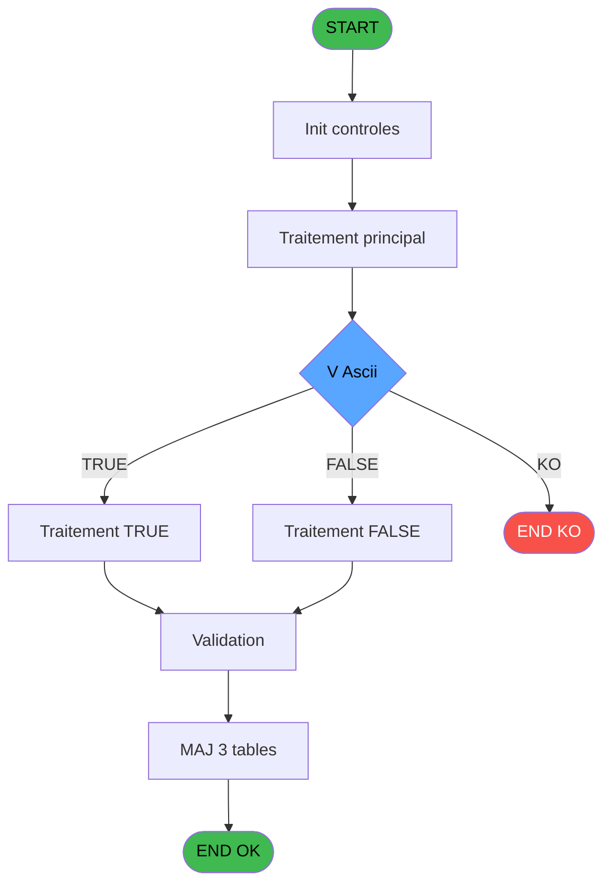
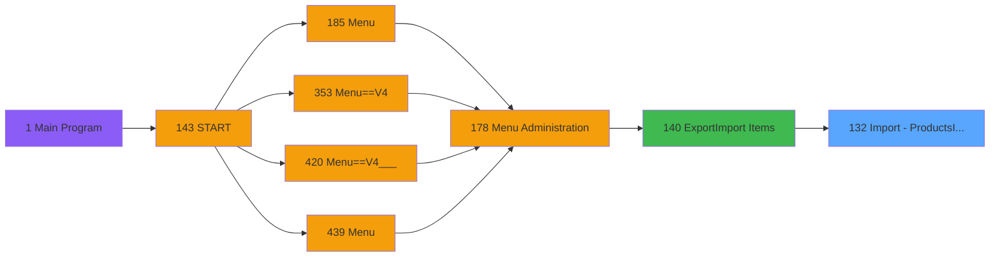

# PVE IDE 132 - Import - ProductsIO(Admin)

> **Analyse**: Phases 1-4 2026-02-03 09:37 -> 09:37 (18s) | Assemblage 09:37
> **Pipeline**: V7.2 Enrichi
> **Structure**: 4 onglets (Resume | Ecrans | Donnees | Connexions)

<!-- TAB:Resume -->

## 1. FICHE D'IDENTITE

| Attribut | Valeur |
|----------|--------|
| Projet | PVE |
| IDE Position | 132 |
| Nom Programme | Import - ProductsIO(Admin) |
| Fichier source | `Prg_132.xml` |
| Domaine metier | General |
| Taches | 11 (0 ecrans visibles) |
| Tables modifiees | 3 |
| Programmes appeles | 1 |

## 2. DESCRIPTION FONCTIONNELLE

**Import - ProductsIO(Admin)** assure la gestion complete de ce processus, accessible depuis [Export/Import Items (IDE 140)](PVE-IDE-140.md).

Le flux de traitement s'organise en **4 blocs fonctionnels** :

- **Consultation** (5 taches) : ecrans de recherche, selection et consultation
- **Traitement** (4 taches) : traitements metier divers
- **Creation** (1 tache) : insertion d'enregistrements en base (mouvements, prestations)
- **Calcul** (1 tache) : calculs de montants, stocks ou compteurs

**Donnees modifiees** : 3 tables en ecriture (comptes_recette__cre, articles_________art, pv_sellers).

**Logique metier** : 1 regles identifiees couvrant conditions metier.

Detail : phases du traitement

#### Phase 1 : Traitement (4 taches)

- **132** - Import - Products * **[[ECRAN]](#ecran-t1)**
- **132.1** - Mise à jour Product (OLD) **[[ECRAN]](#ecran-t2)**
- **132.1.6** - Search CodeArtcile déjà Utilsé
- **132.3** - Mise à jour Product **[[ECRAN]](#ecran-t11)**

Delegue a : [Trace Modification package (IDE 229)](PVE-IDE-229.md)

#### Phase 2 : Consultation (5 taches)

- **132.1.1** - Recherche Existence
- **132.1.3** - Recherche Existence Article
- **132.1.4** - Recherche Trous
- **132.1.4.1** - Recherche Article +1
- **132.2** - Recherche Borne Min/Max

#### Phase 3 : Calcul (1 tache)

- **132.1.2** - Creation Compte Recette

#### Phase 4 : Creation (1 tache)

- **132.1.5** - Creation Article **[[ECRAN]](#ecran-t8)**

#### Tables impactees

| Table | Operations | Role metier |
|-------|-----------|-------------|
| articles_________art | R/**W** (4 usages) | Articles et stock |
| pv_sellers | **W** (2 usages) |  |
| comptes_recette__cre | R/**W** (2 usages) | Comptes GM (generaux) |

## 3. BLOCS FONCTIONNELS

### 3.1 Traitement (4 taches)

Traitements internes.

---

#### 132 - Import - Products * [[ECRAN]](#ecran-t1)

**Role** : Traitement : Import - Products *.
**Ecran** : 1384 x 43 DLU (MDI) | [Voir mockup](#ecran-t1)

3 sous-taches directes

| Tache | Nom | Bloc |
|-------|-----|------|
| [132.1](#t2) | Mise à jour Product (OLD) **[[ECRAN]](#ecran-t2)** | Traitement |
| [132.1.6](#t9) | Search CodeArtcile déjà Utilsé | Traitement |
| [132.3](#t11) | Mise à jour Product **[[ECRAN]](#ecran-t11)** | Traitement |

**Delegue a** : [Trace Modification package (IDE 229)](PVE-IDE-229.md)

---

#### 132.1 - Mise à jour Product (OLD) [[ECRAN]](#ecran-t2)

**Role** : Traitement : Mise à jour Product (OLD).
**Ecran** : 706 x 455 DLU (MDI) | [Voir mockup](#ecran-t2)
**Variables liees** : BD (v. OGEC Product Nature)
**Delegue a** : [Trace Modification package (IDE 229)](PVE-IDE-229.md)

---

#### 132.1.6 - Search CodeArtcile déjà Utilsé

**Role** : Traitement : Search CodeArtcile déjà Utilsé.
**Delegue a** : [Trace Modification package (IDE 229)](PVE-IDE-229.md)

---

#### 132.3 - Mise à jour Product [[ECRAN]](#ecran-t11)

**Role** : Traitement : Mise à jour Product.
**Ecran** : 706 x 455 DLU (MDI) | [Voir mockup](#ecran-t11)
**Variables liees** : BD (v. OGEC Product Nature)
**Delegue a** : [Trace Modification package (IDE 229)](PVE-IDE-229.md)

### 3.2 Consultation (5 taches)

Ecrans de recherche et consultation.

---

#### 132.1.1 - Recherche Existence

**Role** : Traitement : Recherche Existence.

---

#### 132.1.3 - Recherche Existence Article

**Role** : Traitement : Recherche Existence Article.
**Variables liees** : D (W0 Borne Min Num Article), E (W0 Borne Max Num Article), K (v.CodeArticle)

---

#### 132.1.4 - Recherche Trous

**Role** : Traitement : Recherche Trous.

---

#### 132.1.4.1 - Recherche Article +1

**Role** : Traitement : Recherche Article +1.
**Variables liees** : D (W0 Borne Min Num Article), E (W0 Borne Max Num Article), K (v.CodeArticle)

---

#### 132.2 - Recherche Borne Min/Max

**Role** : Traitement : Recherche Borne Min/Max.
**Variables liees** : D (W0 Borne Min Num Article), E (W0 Borne Max Num Article)

### 3.3 Calcul (1 tache)

Calculs metier : montants, stocks, compteurs.

---

#### 132.1.2 - Creation Compte Recette

**Role** : Creation d'enregistrement : Creation Compte Recette.

### 3.4 Creation (1 tache)

Insertion de nouveaux enregistrements en base.

---

#### 132.1.5 - Creation Article [[ECRAN]](#ecran-t8)

**Role** : Creation d'enregistrement : Creation Article.
**Ecran** : 542 x 338 DLU | [Voir mockup](#ecran-t8)
**Variables liees** : D (W0 Borne Min Num Article), E (W0 Borne Max Num Article), K (v.CodeArticle)

## 5. REGLES METIER

1 regles identifiees:

### Autres (1 regles)

#### [RM-001] Condition toujours vraie (flag actif)

| Element | Detail |
|---------|--------|
| **Condition** | `StrToken(V Ascii [C]` |
| **Si vrai** | 15 |
| **Si faux** | ';')='Y','TRUE'LOG,'FALSE'LOG) |
| **Variables** | C (V Ascii) |
| **Expression source** | Expression 19 : `IF (StrToken(V Ascii [C],15,';')='Y','TRUE'LOG,'FALSE'LOG)` |
| **Exemple** | Si StrToken(V Ascii [C] → 15. Sinon → ';')='Y','TRUE'LOG,'FALSE'LOG) |

## 6. CONTEXTE

- **Appele par**: [Export/Import Items (IDE 140)](PVE-IDE-140.md)
- **Appelle**: 1 programmes | **Tables**: 5 (W:3 R:3 L:1) | **Taches**: 11 | **Expressions**: 30

<!-- TAB:Ecrans -->

## 8. ECRANS

*(Programme sans ecran visible)*

## 9. NAVIGATION

### 9.3 Structure hierarchique (11 taches)

| Position | Tache | Type | Dimensions | Bloc |
|----------|-------|------|------------|------|
| **132.1** | [**Import - Products *** (132)](#t1) [mockup](#ecran-t1) | MDI | 1384x43 | Traitement |
| 132.1.1 | [Mise à jour Product (OLD) (132.1)](#t2) [mockup](#ecran-t2) | MDI | 706x455 | |
| 132.1.2 | [Search CodeArtcile déjà Utilsé (132.1.6)](#t9) | - | - | |
| 132.1.3 | [Mise à jour Product (132.3)](#t11) [mockup](#ecran-t11) | MDI | 706x455 | |
| **132.2** | [**Recherche Existence** (132.1.1)](#t3) | - | - | Consultation |
| 132.2.1 | [Recherche Existence Article (132.1.3)](#t5) | - | - | |
| 132.2.2 | [Recherche Trous (132.1.4)](#t6) | - | - | |
| 132.2.3 | [Recherche Article +1 (132.1.4.1)](#t7) | - | - | |
| 132.2.4 | [Recherche Borne Min/Max (132.2)](#t10) | - | - | |
| **132.3** | [**Creation Compte Recette** (132.1.2)](#t4) | - | - | Calcul |
| **132.4** | [**Creation Article** (132.1.5)](#t8) [mockup](#ecran-t8) | - | 542x338 | Creation |

### 9.4 Algorigramme

> **Legende**: Vert = START/END OK | Rouge = END KO | Bleu = Decisions
> *Algorigramme auto-genere. Utiliser `/algorigramme` pour une synthese metier detaillee.*

<!-- TAB:Donnees -->

## 10. TABLES

### Tables utilisees (5)

| ID | Nom | Description | Type | R | W | L | Usages |
|----|-----|-------------|------|---|---|---|--------|
| 65 | comptes_recette__cre | Comptes GM (generaux) | DB | R | **W** |   | 2 |
| 67 | tables___________tab |  | DB | R |   |   | 1 |
| 77 | articles_________art | Articles et stock | DB | R | **W** |   | 4 |
| 403 | pv_sellers |  | DB |   | **W** |   | 2 |
| 413 | pv_tva |  | DB |   |   | L | 1 |

### Colonnes par table (2 / 4 tables avec colonnes identifiees)

Table 65 - comptes_recette__cre (R/**W**) - 2 usages

| Lettre | Variable | Acces | Type |
|--------|----------|-------|------|
| F | v Exist Compte de Recette | W | Logical |

Table 67 - tables___________tab (R) - 1 usages

*Table utilisee uniquement en Link ou aucune colonne Real identifiee dans le DataView.*

Table 77 - articles_________art (R/**W**) - 4 usages

*Table utilisee uniquement en Link ou aucune colonne Real identifiee dans le DataView.*

Table 403 - pv_sellers (**W**) - 2 usages

| Lettre | Variable | Acces | Type |
|--------|----------|-------|------|
| A | V.Existe product ? | W | Logical |
| B | v Service | W | Alpha |
| C | v Imputation | W | Numeric |
| D | v S/Imputation | W | Numeric |
| E | v Libelle Imputation | W | Alpha |
| F | v Exist Compte de Recette | W | Logical |
| G | v Exist Article | W | Logical |
| H | v Article déjà utilisé | W | Logical |
| I | v Num Article Trouvé | W | Numeric |
| J | vNumArticle | W | Numeric |
| K | v Libelle Article | W | Alpha |
| L | v Gift Pass | W | Logical |
| M | v NewNumArticle | W | Numeric |
| N | v Creation Possible ? | W | Logical |

## 11. VARIABLES

### 11.1 Parametres entrants (2)

Variables recues du programme appelant ([Export/Import Items (IDE 140)](PVE-IDE-140.md)).

| Lettre | Nom | Type | Usage dans |
|--------|-----|------|-----------|
| A | P. Nom Fichier CSV | Alpha | 1x parametre entrant |
| B | P.LastCategoryID | Numeric | - |

### 11.2 Variables de session (27)

Variables persistantes pendant toute la session.

| Lettre | Nom | Type | Usage dans |
|--------|-----|------|-----------|
| C | V Ascii | Alpha | 26x session |
| G | v.Service | Unicode | - |
| H | v.Cat | Numeric | - |
| I | v.SubCat | Numeric | - |
| J | v.ProdID | Numeric | - |
| K | v.CodeArticle | Unicode | - |
| L | v.Label | Unicode | - |
| M | v.SaleLabel | Unicode | - |
| N | v.PrixAchat | Numeric | - |
| O | v.TVA | Numeric | - |
| P | v.PrixVente | Numeric | - |
| Q | v.Unite | Unicode | - |
| R | v.Quantite | Numeric | - |
| S | v.PurshasingVolume | Numeric | - |
| T | v.UnitPurshasingPrice | Numeric | - |
| U | v.BlockFree | Logical | - |
| V | v.BlockDiscount | Logical | - |
| W | v.NonGereEnStock | Logical | - |
| X | v.Actif | Unicode | - |
| Y | v.NumbersOfDay | Numeric | - |
| Z | v.GiftPass | Logical | - |
| BA | v.SalesPlaceIndependant | Logical | - |
| BB | v.EligibleCreditGO | Logical | - |
| BC | v.RecopieLibelleCommercial | Logical | - |
| BD | v. OGEC Product Nature | Unicode | - |
| BE | v. OGEC Force Ticket | Logical | - |
| BF | v. M&E Price | Numeric | - |

### 11.3 Variables de travail (3)

Variables internes au programme.

| Lettre | Nom | Type | Usage dans |
|--------|-----|------|-----------|
| D | W0 Borne Min Num Article | Numeric | - |
| E | W0 Borne Max Num Article | Numeric | - |
| F | W0 Fin Tache Prématurée | Logical | - |

Toutes les 32 variables (liste complete)

| Cat | Lettre | Nom Variable | Type |
|-----|--------|--------------|------|
| P0 | **A** | P. Nom Fichier CSV | Alpha |
| P0 | **B** | P.LastCategoryID | Numeric |
| W0 | **D** | W0 Borne Min Num Article | Numeric |
| W0 | **E** | W0 Borne Max Num Article | Numeric |
| W0 | **F** | W0 Fin Tache Prématurée | Logical |
| V. | **C** | V Ascii | Alpha |
| V. | **G** | v.Service | Unicode |
| V. | **H** | v.Cat | Numeric |
| V. | **I** | v.SubCat | Numeric |
| V. | **J** | v.ProdID | Numeric |
| V. | **K** | v.CodeArticle | Unicode |
| V. | **L** | v.Label | Unicode |
| V. | **M** | v.SaleLabel | Unicode |
| V. | **N** | v.PrixAchat | Numeric |
| V. | **O** | v.TVA | Numeric |
| V. | **P** | v.PrixVente | Numeric |
| V. | **Q** | v.Unite | Unicode |
| V. | **R** | v.Quantite | Numeric |
| V. | **S** | v.PurshasingVolume | Numeric |
| V. | **T** | v.UnitPurshasingPrice | Numeric |
| V. | **U** | v.BlockFree | Logical |
| V. | **V** | v.BlockDiscount | Logical |
| V. | **W** | v.NonGereEnStock | Logical |
| V. | **X** | v.Actif | Unicode |
| V. | **Y** | v.NumbersOfDay | Numeric |
| V. | **Z** | v.GiftPass | Logical |
| V. | **BA** | v.SalesPlaceIndependant | Logical |
| V. | **BB** | v.EligibleCreditGO | Logical |
| V. | **BC** | v.RecopieLibelleCommercial | Logical |
| V. | **BD** | v. OGEC Product Nature | Unicode |
| V. | **BE** | v. OGEC Force Ticket | Logical |
| V. | **BF** | v. M&E Price | Numeric |

## 12. EXPRESSIONS

**30 / 30 expressions decodees (100%)**

### 12.1 Repartition par type

| Type | Expressions | Regles |
|------|-------------|--------|
| CAST_LOGIQUE | 8 | 5 |
| CONDITION | 2 | 0 |
| OTHER | 5 | 0 |
| STRING | 15 | 0 |

### 12.2 Expressions cles par type

#### CAST_LOGIQUE (8 expressions)

| Type | IDE | Expression | Regle |
|------|-----|------------|-------|
| CAST_LOGIQUE | 19 | `IF (StrToken(V Ascii [C],15,';')='Y','TRUE'LOG,'FALSE'LOG)` | [RM-001](#rm-RM-001) |
| CAST_LOGIQUE | 26 | `IF(StrToken(V Ascii [C],22,';')='Y','TRUE'LOG, 'FALSE'LOG)` | - |
| CAST_LOGIQUE | 27 | `IF(StrToken(V Ascii [C],23,';')='Y','TRUE'LOG, 'FALSE'LOG)` | - |
| CAST_LOGIQUE | 29 | `IF(StrToken(V Ascii [C],25,';')='Y','TRUE'LOG, 'FALSE'LOG)` | - |
| CAST_LOGIQUE | 25 | `IF(StrToken(V Ascii [C],21,';')='Y','TRUE'LOG, 'FALSE'LOG)` | - |
| ... | | *+3 autres* | |

#### CONDITION (2 expressions)

| Type | IDE | Expression | Regle |
|------|-----|------------|-------|
| CONDITION | 2 | `Counter (0)>1` | - |
| CONDITION | 22 | `IF(StrToken(V Ascii [C],18,';')='O','O','N')` | - |

#### OTHER (5 expressions)

| Type | IDE | Expression | Regle |
|------|-----|------------|-------|
| OTHER | 9 | `StrToken(V Ascii [C],5,';')` | - |
| OTHER | 28 | `StrToken(V Ascii [C],24,';')` | - |
| OTHER | 4 | `Counter(0)` | - |
| OTHER | 1 | `P. Nom Fichier CSV [A]` | - |
| OTHER | 3 | `EOF (0,1)` | - |

#### STRING (15 expressions)

| Type | IDE | Expression | Regle |
|------|-----|------------|-------|
| STRING | 16 | `Val(StrToken(V Ascii [C],12,';'),'6.6')` | - |
| STRING | 15 | `Trim(StrToken(V Ascii [C],11,';'))` | - |
| STRING | 14 | `Val(StrToken(V Ascii [C],10,';'),'N12.3C')` | - |
| STRING | 17 | `Val(StrToken(V Ascii [C],13,';'),'N12.3C')` | - |
| STRING | 30 | `Val(StrToken(V Ascii [C],26,';'),'N12.3C')` | - |
| ... | | *+10 autres* | |

### 12.3 Toutes les expressions (30)

Voir les 30 expressions

#### CAST_LOGIQUE (8)

| IDE | Expression Decodee |
|-----|-------------------|
| 19 | `IF (StrToken(V Ascii [C],15,';')='Y','TRUE'LOG,'FALSE'LOG)` |
| 20 | `IF (StrToken(V Ascii [C],16,';')='Y','TRUE'LOG,'FALSE'LOG)` |
| 21 | `IF (StrToken(V Ascii [C],17,';')='Y','TRUE'LOG,'FALSE'LOG)` |
| 24 | `IF (StrToken(V Ascii [C],20,';')='Y','TRUE'LOG,'FALSE'LOG)` |
| 25 | `IF(StrToken(V Ascii [C],21,';')='Y','TRUE'LOG, 'FALSE'LOG)` |
| 26 | `IF(StrToken(V Ascii [C],22,';')='Y','TRUE'LOG, 'FALSE'LOG)` |
| 27 | `IF(StrToken(V Ascii [C],23,';')='Y','TRUE'LOG, 'FALSE'LOG)` |
| 29 | `IF(StrToken(V Ascii [C],25,';')='Y','TRUE'LOG, 'FALSE'LOG)` |

#### CONDITION (2)

| IDE | Expression Decodee |
|-----|-------------------|
| 22 | `IF(StrToken(V Ascii [C],18,';')='O','O','N')` |
| 2 | `Counter (0)>1` |

#### OTHER (5)

| IDE | Expression Decodee |
|-----|-------------------|
| 1 | `P. Nom Fichier CSV [A]` |
| 3 | `EOF (0,1)` |
| 4 | `Counter(0)` |
| 9 | `StrToken(V Ascii [C],5,';')` |
| 28 | `StrToken(V Ascii [C],24,';')` |

#### STRING (15)

| IDE | Expression Decodee |
|-----|-------------------|
| 5 | `Trim(StrToken(V Ascii [C],1,';'))` |
| 6 | `Val(StrToken(V Ascii [C],2,';'),'2')` |
| 7 | `Val(StrToken(V Ascii [C],3,';'),'2')` |
| 8 | `Val(StrToken(V Ascii [C],4,';'),'2')` |
| 10 | `Trim(StrToken(V Ascii [C],6,';'))` |
| 11 | `Trim(StrToken(V Ascii [C],7,';'))` |
| 12 | `Val(StrToken(V Ascii [C],8,';'),'N12.3C')` |
| 13 | `Val(StrToken(V Ascii [C],9,';'),'#2.#')` |
| 14 | `Val(StrToken(V Ascii [C],10,';'),'N12.3C')` |
| 15 | `Trim(StrToken(V Ascii [C],11,';'))` |
| 16 | `Val(StrToken(V Ascii [C],12,';'),'6.6')` |
| 17 | `Val(StrToken(V Ascii [C],13,';'),'N12.3C')` |
| 18 | `Val(StrToken(V Ascii [C],14,';'),'N12.3C')` |
| 23 | `Val(StrToken(V Ascii [C],19,';'),'3.1')` |
| 30 | `Val(StrToken(V Ascii [C],26,';'),'N12.3C')` |

<!-- TAB:Connexions -->

## 13. GRAPHE D'APPELS

### 13.1 Chaine depuis Main (Callers)

Main -> ... -> [Export/Import Items (IDE 140)](PVE-IDE-140.md) -> **Import - ProductsIO(Admin) (IDE 132)**

### 13.2 Callers

| IDE | Nom Programme | Nb Appels |
|-----|---------------|-----------|
| [140](PVE-IDE-140.md) | Export/Import Items | 1 |

### 13.3 Callees (programmes appeles)

### 13.4 Detail Callees avec contexte

| IDE | Nom Programme | Appels | Contexte |
|-----|---------------|--------|----------|
| [229](PVE-IDE-229.md) | Trace Modification package | 2 | Sous-programme |

## 14. RECOMMANDATIONS MIGRATION

### 14.1 Profil du programme

| Metrique | Valeur | Impact migration |
|----------|--------|-----------------|
| Lignes de logique | 360 | Taille moyenne |
| Expressions | 30 | Peu de logique |
| Tables WRITE | 3 | Impact modere |
| Sous-programmes | 1 | Peu de dependances |
| Ecrans visibles | 0 | Ecran unique ou traitement batch |
| Code desactive | 1.7% (6 / 360) | Code sain |
| Regles metier | 1 | Quelques regles a preserver |

### 14.2 Plan de migration par bloc

#### Traitement (4 taches: 3 ecrans, 1 traitement)

- **Strategie** : Orchestrateur avec 3 ecrans (Razor/React) et 1 traitements backend (services).
- Les ecrans deviennent des composants UI, les traitements invisibles deviennent des services injectables.
- 1 sous-programme(s) a migrer ou a reutiliser depuis les services existants.
- Decomposer les taches en services unitaires testables.

#### Consultation (5 taches: 0 ecran, 5 traitements)

- **Strategie** : Composants de recherche/selection en modales.

#### Calcul (1 tache: 0 ecran, 1 traitement)

- **Strategie** : Services de calcul purs (Domain Services).
- Migrer la logique de calcul (stock, compteurs, montants)

#### Creation (1 tache: 1 ecran, 0 traitement)

- **Strategie** : Repository pattern avec Entity Framework Core.
- Insertion via `IRepository<T>.CreateAsync()`

### 14.3 Dependances critiques

| Dependance | Type | Appels | Impact |
|------------|------|--------|--------|
| comptes_recette__cre | Table WRITE (Database) | 1x | Schema + repository |
| articles_________art | Table WRITE (Database) | 1x | Schema + repository |
| pv_sellers | Table WRITE (Database) | 2x | Schema + repository |
| [Trace Modification package (IDE 229)](PVE-IDE-229.md) | Sous-programme | 2x | Haute - Sous-programme |

---
*Spec DETAILED generee par Pipeline V7.2 - 2026-02-03 09:37*
