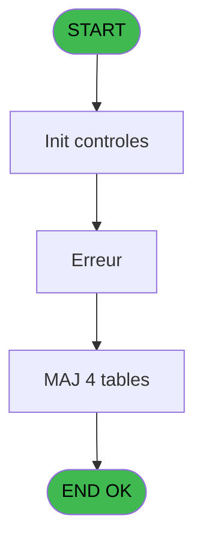
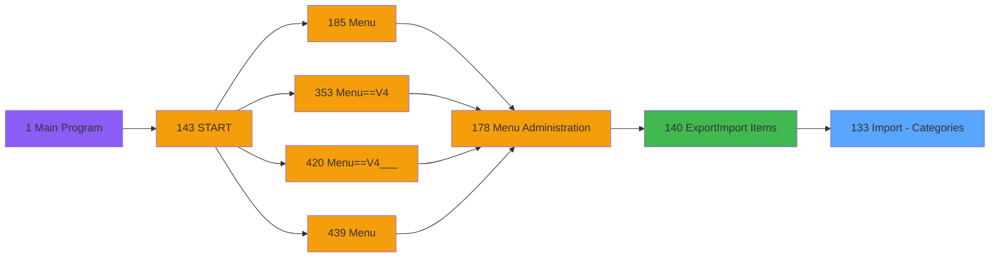
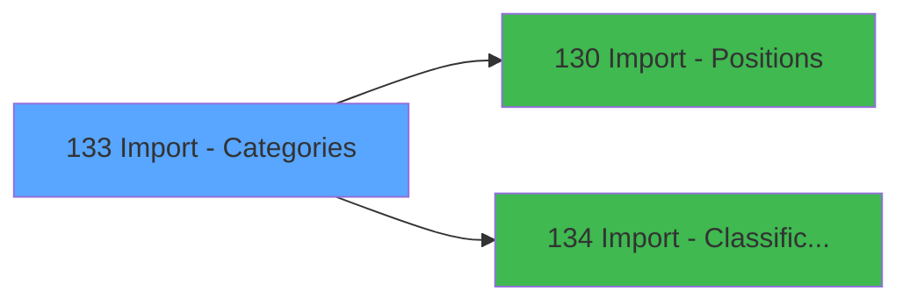

# PVE IDE 133 - Import - Categories

> **Analyse**: Phases 1-4 2026-02-03 09:37 -> 09:38 (18s) | Assemblage 09:38
> **Pipeline**: V7.2 Enrichi
> **Structure**: 4 onglets (Resume | Ecrans | Donnees | Connexions)

<!-- TAB:Resume -->

## 1. FICHE D'IDENTITE

| Attribut | Valeur |
|----------|--------|
| Projet | PVE |
| IDE Position | 133 |
| Nom Programme | Import - Categories |
| Fichier source | `Prg_133.xml` |
| Domaine metier | General |
| Taches | 12 (1 ecrans visibles) |
| Tables modifiees | 4 |
| Programmes appeles | 2 |

## 2. DESCRIPTION FONCTIONNELLE

**Import - Categories** assure la gestion complete de ce processus, accessible depuis [Export/Import Items (IDE 140)](PVE-IDE-140.md).

Le flux de traitement s'organise en **4 blocs fonctionnels** :

- **Consultation** (5 taches) : ecrans de recherche, selection et consultation
- **Traitement** (5 taches) : traitements metier divers
- **Creation** (1 tache) : insertion d'enregistrements en base (mouvements, prestations)
- **Calcul** (1 tache) : calculs de montants, stocks ou compteurs

**Donnees modifiees** : 4 tables en ecriture (comptes_recette__cre, articles_________art, pv_customer_temp, Table_1571).

**Logique metier** : 1 regles identifiees couvrant conditions metier.

Detail : phases du traitement

#### Phase 1 : Traitement (5 taches)

- **133** - Import - Categories
- **133.1** - Mise à jour
- **133.1.4** - Search CodeArtcile déjà Utilsé
- **133.2** - Vérification Classification
- **133.3** - Erreur **[[ECRAN]](#ecran-t11)**

Delegue a : [Import - Positions (IDE 130)](PVE-IDE-130.md), [Import - Classifications (IDE 134)](PVE-IDE-134.md)

#### Phase 2 : Consultation (5 taches)

- **133.1.1** - Recherche Existence
- **133.1.3** - Recherche Existence Article
- **133.1.5** - Recherche Trous
- **133.1.5.1** - Recherche Article +1
- **133.4** - Recherche Borne Min/Max

#### Phase 3 : Calcul (1 tache)

- **133.1.2** - Creation Compte Recette

#### Phase 4 : Creation (1 tache)

- **133.1.6** - Creation Article **[[ECRAN]](#ecran-t9)**

#### Tables impactees

| Table | Operations | Role metier |
|-------|-----------|-------------|
| articles_________art | R/**W** (4 usages) | Articles et stock |
| comptes_recette__cre | R/**W** (2 usages) | Comptes GM (generaux) |
| Table_1571 | **W** (1 usages) |  |
| pv_customer_temp | **W** (1 usages) |  |

## 3. BLOCS FONCTIONNELS

### 3.1 Traitement (5 taches)

Traitements internes.

---

#### 133 - Import - Categories

**Role** : Traitement : Import - Categories.

4 sous-taches directes

| Tache | Nom | Bloc |
|-------|-----|------|
| [133.1](#t2) | Mise à jour | Traitement |
| [133.1.4](#t6) | Search CodeArtcile déjà Utilsé | Traitement |
| [133.2](#t10) | Vérification Classification | Traitement |
| [133.3](#t11) | Erreur **[[ECRAN]](#ecran-t11)** | Traitement |

**Delegue a** : [Import - Positions (IDE 130)](PVE-IDE-130.md), [Import - Classifications (IDE 134)](PVE-IDE-134.md)

---

#### 133.1 - Mise à jour

**Role** : Traitement : Mise à jour.
**Delegue a** : [Import - Positions (IDE 130)](PVE-IDE-130.md), [Import - Classifications (IDE 134)](PVE-IDE-134.md)

---

#### 133.1.4 - Search CodeArtcile déjà Utilsé

**Role** : Traitement : Search CodeArtcile déjà Utilsé.
**Delegue a** : [Import - Positions (IDE 130)](PVE-IDE-130.md), [Import - Classifications (IDE 134)](PVE-IDE-134.md)

---

#### 133.2 - Vérification Classification

**Role** : Traitement : Vérification Classification.
**Variables liees** : C (P Erreur Classification), Q (V.CodeClassification), R (V.LibelleClassification), BF (v Erreur Verif. Classification), BG (v Lien Classification ?)
**Delegue a** : [Import - Positions (IDE 130)](PVE-IDE-130.md), [Import - Classifications (IDE 134)](PVE-IDE-134.md)

---

#### 133.3 - Erreur [[ECRAN]](#ecran-t11)

**Role** : Traitement : Erreur.
**Ecran** : 405 x 123 DLU (Type6) | [Voir mockup](#ecran-t11)
**Variables liees** : C (P Erreur Classification), BF (v Erreur Verif. Classification)
**Delegue a** : [Import - Positions (IDE 130)](PVE-IDE-130.md), [Import - Classifications (IDE 134)](PVE-IDE-134.md)

### 3.2 Consultation (5 taches)

Ecrans de recherche et consultation.

---

#### 133.1.1 - Recherche Existence

**Role** : Traitement : Recherche Existence.

---

#### 133.1.3 - Recherche Existence Article

**Role** : Traitement : Recherche Existence Article.
**Variables liees** : K (V.NumArticle), O (V.LibelleArticle), BJ (BornMinNumArticle), BK (BornMaxNumArticle)

---

#### 133.1.5 - Recherche Trous

**Role** : Traitement : Recherche Trous.

---

#### 133.1.5.1 - Recherche Article +1

**Role** : Traitement : Recherche Article +1.
**Variables liees** : K (V.NumArticle), O (V.LibelleArticle), BJ (BornMinNumArticle), BK (BornMaxNumArticle)

---

#### 133.4 - Recherche Borne Min/Max

**Role** : Traitement : Recherche Borne Min/Max.

### 3.3 Calcul (1 tache)

Calculs metier : montants, stocks, compteurs.

---

#### 133.1.2 - Creation Compte Recette

**Role** : Creation d'enregistrement : Creation Compte Recette.

### 3.4 Creation (1 tache)

Insertion de nouveaux enregistrements en base.

---

#### 133.1.6 - Creation Article [[ECRAN]](#ecran-t9)

**Role** : Creation d'enregistrement : Creation Article.
**Ecran** : 542 x 338 DLU | [Voir mockup](#ecran-t9)
**Variables liees** : K (V.NumArticle), O (V.LibelleArticle), BJ (BornMinNumArticle), BK (BornMaxNumArticle)

## 5. REGLES METIER

1 regles identifiees:

### Autres (1 regles)

#### [RM-001] Condition toujours vraie (flag actif)

| Element | Detail |
|---------|--------|
| **Condition** | `StrToken(V Ascii [F]` |
| **Si vrai** | 14 |
| **Si faux** | ';')='Y','TRUE'LOG,'FALSE'LOG) |
| **Variables** | F (V Ascii) |
| **Expression source** | Expression 33 : `IF(StrToken(V Ascii [F],14,';')='Y','TRUE'LOG,'FALSE'LOG)` |
| **Exemple** | Si StrToken(V Ascii [F] → 14. Sinon → ';')='Y','TRUE'LOG,'FALSE'LOG) |

## 6. CONTEXTE

- **Appele par**: [Export/Import Items (IDE 140)](PVE-IDE-140.md)
- **Appelle**: 2 programmes | **Tables**: 8 (W:4 R:3 L:3) | **Taches**: 12 | **Expressions**: 37

<!-- TAB:Ecrans -->

## 8. ECRANS

### 8.1 Forms visibles (1 / 12)

| # | Position | Tache | Nom | Type | Largeur | Hauteur | Bloc |
|---|----------|-------|-----|------|---------|---------|------|
| 1 | 133.3 | 133.3 | Erreur | Type6 | 405 | 123 | Traitement |

### 8.2 Mockups Ecrans

---

#### 133.3 - Erreur
**Tache** : [133.3](#t11) | **Type** : Type6 | **Dimensions** : 405 x 123 DLU
**Bloc** : Traitement | **Titre IDE** : Erreur

<!-- FORM-DATA:
{
    "width":  405,
    "vFactor":  8,
    "type":  "Type6",
    "hFactor":  4,
    "controls":  [
                     {
                         "x":  4,
                         "type":  "label",
                         "var":  "",
                         "y":  52,
                         "w":  184,
                         "fmt":  "",
                         "name":  "",
                         "h":  12,
                         "color":  "",
                         "text":  "Classification found in the imported file",
                         "parent":  null
                     },
                     {
                         "x":  4,
                         "type":  "label",
                         "var":  "",
                         "y":  69,
                         "w":  184,
                         "fmt":  "",
                         "name":  "",
                         "h":  12,
                         "color":  "",
                         "text":  "Classification found in the Classification File",
                         "parent":  null
                     },
                     {
                         "x":  0,
                         "type":  "label",
                         "var":  "",
                         "y":  1,
                         "w":  405,
                         "fmt":  "",
                         "name":  "",
                         "h":  42,
                         "color":  "182",
                         "text":  "",
                         "parent":  null
                     },
                     {
                         "x":  20,
                         "type":  "label",
                         "var":  "",
                         "y":  17,
                         "w":  329,
                         "fmt":  "",
                         "name":  "",
                         "h":  12,
                         "color":  "186",
                         "text":  "Error Found  : The treatment  can\u0027t be continue",
                         "parent":  7
                     },
                     {
                         "x":  0,
                         "type":  "label",
                         "var":  "",
                         "y":  85,
                         "w":  402,
                         "fmt":  "",
                         "name":  "",
                         "h":  37,
                         "color":  "182",
                         "text":  "",
                         "parent":  null
                     },
                     {
                         "x":  355,
                         "type":  "image",
                         "var":  "",
                         "y":  5,
                         "w":  48,
                         "fmt":  "",
                         "name":  "",
                         "h":  37,
                         "color":  "",
                         "text":  "",
                         "parent":  7
                     },
                     {
                         "x":  204,
                         "type":  "edit",
                         "var":  "",
                         "y":  52,
                         "w":  18,
                         "fmt":  "",
                         "name":  "ICodeClassification_0001",
                         "h":  11,
                         "color":  "110",
                         "text":  "",
                         "parent":  null
                     },
                     {
                         "x":  228,
                         "type":  "edit",
                         "var":  "",
                         "y":  52,
                         "w":  171,
                         "fmt":  "",
                         "name":  "ILibelleClassification_0001",
                         "h":  11,
                         "color":  "110",
                         "text":  "",
                         "parent":  null
                     },
                     {
                         "x":  204,
                         "type":  "edit",
                         "var":  "",
                         "y":  69,
                         "w":  18,
                         "fmt":  "2P0",
                         "name":  "v Code Classif Existant_0001",
                         "h":  11,
                         "color":  "110",
                         "text":  "",
                         "parent":  null
                     },
                     {
                         "x":  228,
                         "type":  "edit",
                         "var":  "",
                         "y":  69,
                         "w":  171,
                         "fmt":  "",
                         "name":  "v Libelle Classif Existan_0001",
                         "h":  11,
                         "color":  "110",
                         "text":  "",
                         "parent":  null
                     },
                     {
                         "x":  331,
                         "type":  "button",
                         "var":  "",
                         "y":  91,
                         "w":  68,
                         "fmt":  "\u0026Exit",
                         "name":  "EXIT",
                         "h":  28,
                         "color":  "",
                         "text":  "",
                         "parent":  null
                     }
                 ],
    "taskId":  "133.3",
    "height":  123
}
-->

<strong>Champs : 4 champs</strong>

| Pos (x,y) | Nom | Variable | Type |
|-----------|-----|----------|------|
| 204,52 | ICodeClassification_0001 | - | edit |
| 228,52 | ILibelleClassification_0001 | - | edit |
| 204,69 | v Code Classif Existant_0001 | - | edit |
| 228,69 | v Libelle Classif Existan_0001 | - | edit |

<strong>Boutons : 1 boutons</strong>

| Bouton | Pos (x,y) | Action |
|--------|-----------|--------|
| Exit | 331,91 | Quitte le programme |

## 9. NAVIGATION

Ecran unique: **Erreur**

### 9.3 Structure hierarchique (12 taches)

| Position | Tache | Type | Dimensions | Bloc |
|----------|-------|------|------------|------|
| **133.1** | [**Import - Categories** (133)](#t1) | MDI | - | Traitement |
| 133.1.1 | [Mise à jour (133.1)](#t2) | MDI | - | |
| 133.1.2 | [Search CodeArtcile déjà Utilsé (133.1.4)](#t6) | - | - | |
| 133.1.3 | [Vérification Classification (133.2)](#t10) | - | - | |
| 133.1.4 | [Erreur (133.3)](#t11) [mockup](#ecran-t11) | Type6 | 405x123 | |
| **133.2** | [**Recherche Existence** (133.1.1)](#t3) | - | - | Consultation |
| 133.2.1 | [Recherche Existence Article (133.1.3)](#t5) | - | - | |
| 133.2.2 | [Recherche Trous (133.1.5)](#t7) | - | - | |
| 133.2.3 | [Recherche Article +1 (133.1.5.1)](#t8) | - | - | |
| 133.2.4 | [Recherche Borne Min/Max (133.4)](#t12) | - | - | |
| **133.3** | [**Creation Compte Recette** (133.1.2)](#t4) | - | - | Calcul |
| **133.4** | [**Creation Article** (133.1.6)](#t9) [mockup](#ecran-t9) | - | 542x338 | Creation |

### 9.4 Algorigramme

> **Legende**: Vert = START/END OK | Rouge = END KO | Bleu = Decisions
> *Algorigramme auto-genere. Utiliser `/algorigramme` pour une synthese metier detaillee.*

<!-- TAB:Donnees -->

## 10. TABLES

### Tables utilisees (8)

| ID | Nom | Description | Type | R | W | L | Usages |
|----|-----|-------------|------|---|---|---|--------|
| 65 | comptes_recette__cre | Comptes GM (generaux) | DB | R | **W** |   | 2 |
| 67 | tables___________tab |  | DB | R |   |   | 1 |
| 77 | articles_________art | Articles et stock | DB | R | **W** |   | 4 |
| 379 | pv_customer_temp |  | DB |   | **W** |   | 1 |
| 380 | pv_day_modes |  | DB |   |   | L | 1 |
| 401 | pv_cust_rentals_histo | Historique / journal | DB |   |   | L | 1 |
| 413 | pv_tva |  | DB |   |   | L | 1 |
| 1571 | Table_1571 |  | MEM |   | **W** |   | 1 |

### Colonnes par table (3 / 5 tables avec colonnes identifiees)

Table 65 - comptes_recette__cre (R/**W**) - 2 usages

| Lettre | Variable | Acces | Type |
|--------|----------|-------|------|
| B | V.ExistCompteRecette? | W | Logical |

Table 67 - tables___________tab (R) - 1 usages

*Table utilisee uniquement en Link ou aucune colonne Real identifiee dans le DataView.*

Table 77 - articles_________art (R/**W**) - 4 usages

*Table utilisee uniquement en Link ou aucune colonne Real identifiee dans le DataView.*

Table 379 - pv_customer_temp (**W**) - 1 usages

| Lettre | Variable | Acces | Type |
|--------|----------|-------|------|
| A | V.Art_TVA | W | Numeric |
| B | V.ExistCompteRecette? | W | Logical |
| C | V.ExistArticle | W | Logical |
| D | V.NumArticleTrouvé | W | Numeric |
| E | V.ArticleDejaUtilise | W | Logical |
| F | V.CreationPossible | W | Logical |
| G | V.NewNumArticle | W | Numeric |

Table 1571 - Table_1571 (**W**) - 1 usages

| Lettre | Variable | Acces | Type |
|--------|----------|-------|------|
| B | P Executer Maj Table ? | W | Logical |

## 11. VARIABLES

### 11.1 Parametres entrants (4)

Variables recues du programme appelant ([Export/Import Items (IDE 140)](PVE-IDE-140.md)).

| Lettre | Nom | Type | Usage dans |
|--------|-----|------|-----------|
| A | P. Nom Fichier CSV | Alpha | 1x parametre entrant |
| B | P Executer Maj Table ? | Logical | 2x parametre entrant |
| C | P Erreur Classification | Logical | - |
| D | P LastCategorieID | Numeric | - |

### 11.2 Variables de session (30)

Variables persistantes pendant toute la session.

| Lettre | Nom | Type | Usage dans |
|--------|-----|------|-----------|
| F | V Ascii | Alpha | 25x session |
| G | V.Cat | Numeric | - |
| H | V.CatLabel | Alpha | - |
| I | V.SubCat | Numeric | - |
| J | V.SubCatLabel | Alpha | - |
| K | V.NumArticle | Numeric | - |
| L | V.LibelleImputation | Unicode | - |
| M | V.Imputation | Numeric | - |
| N | V.SousImputation | Numeric | - |
| O | V.LibelleArticle | Unicode | - |
| P | V.ActionType | Alpha | - |
| Q | V.CodeClassification | Numeric | - |
| R | V.LibelleClassification | Alpha | - |
| S | V.MaximumAgeOfGratuity | Numeric | - |
| T | V.ContientAlcool | Logical | - |
| U | V. Actif | Logical | - |
| V | V. M&E Only | Logical | 2x session |
| W | V. M&E disc percent | Numeric | 2x session |
| X | V.IdMatosID | Numeric | 2x session |
| Y | V Position 1 | Numeric | 2x session |
| Z | V Position 2 | Numeric | 2x session |
| BA | V Position 3 | Numeric | - |
| BB | V Position 4 | Numeric | - |
| BC | V Position 5 | Numeric | - |
| BD | V Position 6 | Numeric | - |
| BE | V Position 7 | Numeric | - |
| BF | v Erreur Verif. Classification | Logical | - |
| BG | v Lien Classification ? | Logical | - |
| BH | v Code Classif Existant | Numeric | - |
| BI | v Libellé Classif Existant | Alpha | - |

### 11.3 Autres (4)

Variables diverses.

| Lettre | Nom | Type | Usage dans |
|--------|-----|------|-----------|
| E | Fichier Classification CSV | Alpha | - |
| BJ | BornMinNumArticle | Numeric | - |
| BK | BornMaxNumArticle | Numeric | - |
| BL | FinTachePrematurée | Logical | - |

Toutes les 38 variables (liste complete)

| Cat | Lettre | Nom Variable | Type |
|-----|--------|--------------|------|
| P0 | **A** | P. Nom Fichier CSV | Alpha |
| P0 | **B** | P Executer Maj Table ? | Logical |
| P0 | **C** | P Erreur Classification | Logical |
| P0 | **D** | P LastCategorieID | Numeric |
| V. | **F** | V Ascii | Alpha |
| V. | **G** | V.Cat | Numeric |
| V. | **H** | V.CatLabel | Alpha |
| V. | **I** | V.SubCat | Numeric |
| V. | **J** | V.SubCatLabel | Alpha |
| V. | **K** | V.NumArticle | Numeric |
| V. | **L** | V.LibelleImputation | Unicode |
| V. | **M** | V.Imputation | Numeric |
| V. | **N** | V.SousImputation | Numeric |
| V. | **O** | V.LibelleArticle | Unicode |
| V. | **P** | V.ActionType | Alpha |
| V. | **Q** | V.CodeClassification | Numeric |
| V. | **R** | V.LibelleClassification | Alpha |
| V. | **S** | V.MaximumAgeOfGratuity | Numeric |
| V. | **T** | V.ContientAlcool | Logical |
| V. | **U** | V. Actif | Logical |
| V. | **V** | V. M&E Only | Logical |
| V. | **W** | V. M&E disc percent | Numeric |
| V. | **X** | V.IdMatosID | Numeric |
| V. | **Y** | V Position 1 | Numeric |
| V. | **Z** | V Position 2 | Numeric |
| V. | **BA** | V Position 3 | Numeric |
| V. | **BB** | V Position 4 | Numeric |
| V. | **BC** | V Position 5 | Numeric |
| V. | **BD** | V Position 6 | Numeric |
| V. | **BE** | V Position 7 | Numeric |
| V. | **BF** | v Erreur Verif. Classification | Logical |
| V. | **BG** | v Lien Classification ? | Logical |
| V. | **BH** | v Code Classif Existant | Numeric |
| V. | **BI** | v Libellé Classif Existant | Alpha |
| Autre | **E** | Fichier Classification CSV | Alpha |
| Autre | **BJ** | BornMinNumArticle | Numeric |
| Autre | **BK** | BornMaxNumArticle | Numeric |
| Autre | **BL** | FinTachePrematurée | Logical |

## 12. EXPRESSIONS

**37 / 37 expressions decodees (100%)**

### 12.1 Repartition par type

| Type | Expressions | Regles |
|------|-------------|--------|
| CALCULATION | 5 | 0 |
| CONCATENATION | 2 | 0 |
| CAST_LOGIQUE | 5 | 5 |
| CONSTANTE | 3 | 0 |
| OTHER | 6 | 0 |
| CONDITION | 1 | 0 |
| STRING | 15 | 0 |

### 12.2 Expressions cles par type

#### CALCULATION (5 expressions)

| Type | IDE | Expression | Regle |
|------|-----|------------|-------|
| CALCULATION | 10 | `MID (V Ascii [F],V Position 2 [Z]+1,[AA]-V Position 2 [Z]-1)` | - |
| CALCULATION | 11 | `Val(MID (V Ascii [F],[AA]+1,[AB]-[AA]-1),'2P0')` | - |
| CALCULATION | 9 | `Val (MID (V Ascii [F],V Position 1 [Y]+1,V Position 2 [Z]-V Position 1 [Y]-1),'6P0')` | - |
| CALCULATION | 5 | `Val (MID (V Ascii [F],1,V. M&E Only [V]-1),'2P0')` | - |
| CALCULATION | 8 | `MID (V Ascii [F],V.IdMatosID [X]+1,V Position 1 [Y]-V.IdMatosID [X]-1)` | - |

#### CONCATENATION (2 expressions)

| Type | IDE | Expression | Regle |
|------|-----|------------|-------|
| CONCATENATION | 7 | `Val (MID (V Ascii [F],V. M&E disc percent [W]+1,V.IdMatosID [X]-V. M&E disc percent [W]-1),'2P0')` | - |
| CONCATENATION | 6 | `MID (V Ascii [F],V. M&E Only [V]+1,V. M&E disc percent [W]-V. M&E Only [V]-1)` | - |

#### CAST_LOGIQUE (5 expressions)

| Type | IDE | Expression | Regle |
|------|-----|------------|-------|
| CAST_LOGIQUE | 33 | `IF(StrToken(V Ascii [F],14,';')='Y','TRUE'LOG,'FALSE'LOG)` | [RM-001](#rm-RM-001) |
| CAST_LOGIQUE | 19 | `'TRUE'LOG` | - |
| CAST_LOGIQUE | 37 | `'TRUE'LOG` | - |
| CAST_LOGIQUE | 35 | `IF(StrToken(V Ascii [F],15,';')='Y','TRUE'LOG,'FALSE'LOG)` | - |
| CAST_LOGIQUE | 15 | `'FALSE'LOG` | - |

#### CONSTANTE (3 expressions)

| Type | IDE | Expression | Regle |
|------|-----|------------|-------|
| CONSTANTE | 13 | `'C'` | - |
| CONSTANTE | 3 | `''` | - |
| CONSTANTE | 2 | `0` | - |

#### OTHER (6 expressions)

| Type | IDE | Expression | Regle |
|------|-----|------------|-------|
| OTHER | 16 | `[AD] AND [AC]` | - |
| OTHER | 17 | `P Executer Maj Table ? [B]` | - |
| OTHER | 18 | `NOT(P Executer Maj Table ? [B])` | - |
| OTHER | 1 | `P. Nom Fichier CSV [A]` | - |
| OTHER | 12 | `StrToken(V Ascii [F],8,';')` | - |
| ... | | *+1 autres* | |

#### CONDITION (1 expressions)

| Type | IDE | Expression | Regle |
|------|-----|------------|-------|
| CONDITION | 4 | `Counter (0)>1` | - |

#### STRING (15 expressions)

| Type | IDE | Expression | Regle |
|------|-----|------------|-------|
| STRING | 30 | `Val(StrToken(V Ascii [F],11,';'),'2P0')` | - |
| STRING | 29 | `Trim(StrToken(V Ascii [F],10,';'))` | - |
| STRING | 28 | `Trim(StrToken(V Ascii [F],9,';'))` | - |
| STRING | 31 | `Trim(StrToken(V Ascii [F],12,';'))` | - |
| STRING | 36 | `Val(StrToken(V Ascii [F],16,';'),'3.2')` | - |
| ... | | *+10 autres* | |

### 12.3 Toutes les expressions (37)

Voir les 37 expressions

#### CALCULATION (5)

| IDE | Expression Decodee |
|-----|-------------------|
| 5 | `Val (MID (V Ascii [F],1,V. M&E Only [V]-1),'2P0')` |
| 8 | `MID (V Ascii [F],V.IdMatosID [X]+1,V Position 1 [Y]-V.IdMatosID [X]-1)` |
| 9 | `Val (MID (V Ascii [F],V Position 1 [Y]+1,V Position 2 [Z]-V Position 1 [Y]-1),'6P0')` |
| 10 | `MID (V Ascii [F],V Position 2 [Z]+1,[AA]-V Position 2 [Z]-1)` |
| 11 | `Val(MID (V Ascii [F],[AA]+1,[AB]-[AA]-1),'2P0')` |

#### CONCATENATION (2)

| IDE | Expression Decodee |
|-----|-------------------|
| 6 | `MID (V Ascii [F],V. M&E Only [V]+1,V. M&E disc percent [W]-V. M&E Only [V]-1)` |
| 7 | `Val (MID (V Ascii [F],V. M&E disc percent [W]+1,V.IdMatosID [X]-V. M&E disc percent [W]-1),'2P0')` |

#### CAST_LOGIQUE (5)

| IDE | Expression Decodee |
|-----|-------------------|
| 33 | `IF(StrToken(V Ascii [F],14,';')='Y','TRUE'LOG,'FALSE'LOG)` |
| 35 | `IF(StrToken(V Ascii [F],15,';')='Y','TRUE'LOG,'FALSE'LOG)` |
| 15 | `'FALSE'LOG` |
| 19 | `'TRUE'LOG` |
| 37 | `'TRUE'LOG` |

#### CONSTANTE (3)

| IDE | Expression Decodee |
|-----|-------------------|
| 2 | `0` |
| 3 | `''` |
| 13 | `'C'` |

#### OTHER (6)

| IDE | Expression Decodee |
|-----|-------------------|
| 1 | `P. Nom Fichier CSV [A]` |
| 12 | `StrToken(V Ascii [F],8,';')` |
| 14 | `EOF (0,1) OR [AI]` |
| 16 | `[AD] AND [AC]` |
| 17 | `P Executer Maj Table ? [B]` |
| 18 | `NOT(P Executer Maj Table ? [B])` |

#### CONDITION (1)

| IDE | Expression Decodee |
|-----|-------------------|
| 4 | `Counter (0)>1` |

#### STRING (15)

| IDE | Expression Decodee |
|-----|-------------------|
| 20 | `Val(StrToken(V Ascii [F],1,';'),'2')` |
| 21 | `Trim(StrToken(V Ascii [F],2,';'))` |
| 22 | `Val(StrToken(V Ascii [F],3,';'),'2')` |
| 23 | `Trim(StrToken(V Ascii [F],4,';'))` |
| 24 | `Val(StrToken(V Ascii [F],5,';'),'6P0')` |
| 25 | `Trim(StrToken(V Ascii [F],6,';'))` |
| 26 | `Val(StrToken(V Ascii [F],7,';'),'10')` |
| 27 | `Val(StrToken(V Ascii [F],8,';'),'3P0Z0')` |
| 28 | `Trim(StrToken(V Ascii [F],9,';'))` |
| 29 | `Trim(StrToken(V Ascii [F],10,';'))` |
| 30 | `Val(StrToken(V Ascii [F],11,';'),'2P0')` |
| 31 | `Trim(StrToken(V Ascii [F],12,';'))` |
| 32 | `Val(Trim(StrToken(V Ascii [F],13,';')),'2')` |
| 34 | `Val(StrToken(V Ascii [F],17,';'),'2P0')` |
| 36 | `Val(StrToken(V Ascii [F],16,';'),'3.2')` |

<!-- TAB:Connexions -->

## 13. GRAPHE D'APPELS

### 13.1 Chaine depuis Main (Callers)

Main -> ... -> [Export/Import Items (IDE 140)](PVE-IDE-140.md) -> **Import - Categories (IDE 133)**

### 13.2 Callers

| IDE | Nom Programme | Nb Appels |
|-----|---------------|-----------|
| [140](PVE-IDE-140.md) | Export/Import Items | 2 |

### 13.3 Callees (programmes appeles)

### 13.4 Detail Callees avec contexte

| IDE | Nom Programme | Appels | Contexte |
|-----|---------------|--------|----------|
| [130](PVE-IDE-130.md) | Import - Positions | 1 | Sous-programme |
| [134](PVE-IDE-134.md) | Import - Classifications | 1 | Sous-programme |

## 14. RECOMMANDATIONS MIGRATION

### 14.1 Profil du programme

| Metrique | Valeur | Impact migration |
|----------|--------|-----------------|
| Lignes de logique | 267 | Taille moyenne |
| Expressions | 37 | Peu de logique |
| Tables WRITE | 4 | Impact modere |
| Sous-programmes | 2 | Peu de dependances |
| Ecrans visibles | 1 | Ecran unique ou traitement batch |
| Code desactive | 4.1% (11 / 267) | Code sain |
| Regles metier | 1 | Quelques regles a preserver |

### 14.2 Plan de migration par bloc

#### Traitement (5 taches: 1 ecran, 4 traitements)

- **Strategie** : Orchestrateur avec 1 ecrans (Razor/React) et 4 traitements backend (services).
- Les ecrans deviennent des composants UI, les traitements invisibles deviennent des services injectables.
- 2 sous-programme(s) a migrer ou a reutiliser depuis les services existants.
- Decomposer les taches en services unitaires testables.

#### Consultation (5 taches: 0 ecran, 5 traitements)

- **Strategie** : Composants de recherche/selection en modales.

#### Calcul (1 tache: 0 ecran, 1 traitement)

- **Strategie** : Services de calcul purs (Domain Services).
- Migrer la logique de calcul (stock, compteurs, montants)

#### Creation (1 tache: 1 ecran, 0 traitement)

- **Strategie** : Repository pattern avec Entity Framework Core.
- Insertion via `IRepository<T>.CreateAsync()`

### 14.3 Dependances critiques

| Dependance | Type | Appels | Impact |
|------------|------|--------|--------|
| comptes_recette__cre | Table WRITE (Database) | 1x | Schema + repository |
| articles_________art | Table WRITE (Database) | 1x | Schema + repository |
| pv_customer_temp | Table WRITE (Database) | 1x | Schema + repository |
| Table_1571 | Table WRITE (Memory) | 1x | Schema + repository |
| [Import - Classifications (IDE 134)](PVE-IDE-134.md) | Sous-programme | 1x | Normale - Sous-programme |
| [Import - Positions (IDE 130)](PVE-IDE-130.md) | Sous-programme | 1x | Normale - Sous-programme |

---
*Spec DETAILED generee par Pipeline V7.2 - 2026-02-03 09:38*
