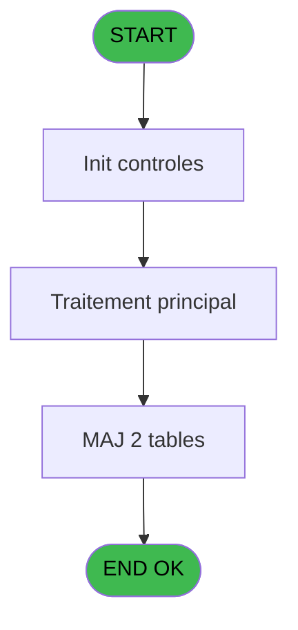
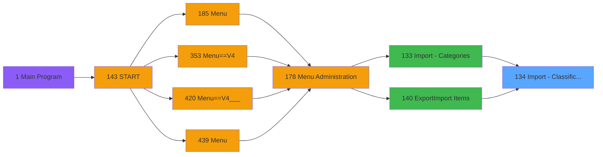

# PVE IDE 134 - Import - Classifications

> **Analyse**: Phases 1-4 2026-02-03 09:38 -> 09:38 (18s) | Assemblage 09:38
> **Pipeline**: V7.2 Enrichi
> **Structure**: 4 onglets (Resume | Ecrans | Donnees | Connexions)

<!-- TAB:Resume -->

## 1. FICHE D'IDENTITE

| Attribut | Valeur |
|----------|--------|
| Projet | PVE |
| IDE Position | 134 |
| Nom Programme | Import - Classifications |
| Fichier source | `Prg_134.xml` |
| Domaine metier | General |
| Taches | 3 (0 ecrans visibles) |
| Tables modifiees | 2 |
| Programmes appeles | 1 |

## 2. DESCRIPTION FONCTIONNELLE

**Import - Classifications** assure la gestion complete de ce processus, accessible depuis [Import - Categories (IDE 133)](PVE-IDE-133.md), [Export/Import Items (IDE 140)](PVE-IDE-140.md).

Le flux de traitement s'organise en **1 blocs fonctionnels** :

- **Traitement** (3 taches) : traitements metier divers

**Donnees modifiees** : 2 tables en ecriture (pv_day_modes, Table_1571).

## 3. BLOCS FONCTIONNELS

### 3.1 Traitement (3 taches)

Traitements internes.

---

#### 134 - Import - Classifications [[ECRAN]](#ecran-t1)

**Role** : Traitement : Import - Classifications.
**Ecran** : 602 x 103 DLU (MDI) | [Voir mockup](#ecran-t1)
**Delegue a** : [Import - Positions (IDE 130)](PVE-IDE-130.md)

---

#### 134.1 - Mise à jour - SQL table

**Role** : Traitement : Mise à jour - SQL table.
**Variables liees** : B (P.ToMemeoryTable ?)
**Delegue a** : [Import - Positions (IDE 130)](PVE-IDE-130.md)

---

#### 134.2 - Mise à jour - Memory table

**Role** : Traitement : Mise à jour - Memory table.
**Variables liees** : B (P.ToMemeoryTable ?)
**Delegue a** : [Import - Positions (IDE 130)](PVE-IDE-130.md)

## 5. REGLES METIER

*(Aucune regle metier identifiee)*

## 6. CONTEXTE

- **Appele par**: [Import - Categories (IDE 133)](PVE-IDE-133.md), [Export/Import Items (IDE 140)](PVE-IDE-140.md)
- **Appelle**: 1 programmes | **Tables**: 2 (W:2 R:0 L:0) | **Taches**: 3 | **Expressions**: 11

<!-- TAB:Ecrans -->

## 8. ECRANS

*(Programme sans ecran visible)*

## 9. NAVIGATION

### 9.3 Structure hierarchique (3 taches)

| Position | Tache | Type | Dimensions | Bloc |
|----------|-------|------|------------|------|
| **134.1** | [**Import - Classifications** (134)](#t1) [mockup](#ecran-t1) | MDI | 602x103 | Traitement |
| 134.1.1 | [Mise à jour - SQL table (134.1)](#t2) | MDI | - | |
| 134.1.2 | [Mise à jour - Memory table (134.2)](#t3) | MDI | - | |

### 9.4 Algorigramme

> **Legende**: Vert = START/END OK | Rouge = END KO | Bleu = Decisions
> *Algorigramme auto-genere. Utiliser `/algorigramme` pour une synthese metier detaillee.*

<!-- TAB:Donnees -->

## 10. TABLES

### Tables utilisees (2)

| ID | Nom | Description | Type | R | W | L | Usages |
|----|-----|-------------|------|---|---|---|--------|
| 380 | pv_day_modes |  | DB |   | **W** |   | 1 |
| 1571 | Table_1571 |  | MEM |   | **W** |   | 1 |

### Colonnes par table (1 / 2 tables avec colonnes identifiees)

Table 380 - pv_day_modes (**W**) - 1 usages

*Table utilisee uniquement en Link ou aucune colonne Real identifiee dans le DataView.*

Table 1571 - Table_1571 (**W**) - 1 usages

| Lettre | Variable | Acces | Type |
|--------|----------|-------|------|
| B | P.ToMemeoryTable ? | W | Logical |

## 11. VARIABLES

### 11.1 Parametres entrants (2)

Variables recues du programme appelant ([Import - Categories (IDE 133)](PVE-IDE-133.md)).

| Lettre | Nom | Type | Usage dans |
|--------|-----|------|-----------|
| A | P. Nom Fichier CSV | Alpha | 1x parametre entrant |
| B | P.ToMemeoryTable ? | Logical | 2x parametre entrant |

### 11.2 Variables de session (2)

Variables persistantes pendant toute la session.

| Lettre | Nom | Type | Usage dans |
|--------|-----|------|-----------|
| C | V Ascii | Alpha | 2x session |
| F | V Position 1 | Numeric | 2x session |

### 11.3 Autres (2)

Variables diverses.

| Lettre | Nom | Type | Usage dans |
|--------|-----|------|-----------|
| D | ICodeClassification | Numeric | - |
| E | ILibelleClassification | Alpha | - |

## 12. EXPRESSIONS

**11 / 11 expressions decodees (100%)**

### 12.1 Repartition par type

| Type | Expressions | Regles |
|------|-------------|--------|
| CALCULATION | 2 | 0 |
| CONSTANTE | 3 | 0 |
| OTHER | 5 | 0 |
| CONDITION | 1 | 0 |

### 12.2 Expressions cles par type

#### CALCULATION (2 expressions)

| Type | IDE | Expression | Regle |
|------|-----|------------|-------|
| CALCULATION | 6 | `MID (V Ascii [C],V Position 1 [F]+1,30)` | - |
| CALCULATION | 5 | `Val (MID (V Ascii [C],1,V Position 1 [F]-1),'2P0')` | - |

#### CONSTANTE (3 expressions)

| Type | IDE | Expression | Regle |
|------|-----|------------|-------|
| CONSTANTE | 7 | `'C'` | - |
| CONSTANTE | 3 | `''` | - |
| CONSTANTE | 2 | `0` | - |

#### OTHER (5 expressions)

| Type | IDE | Expression | Regle |
|------|-----|------------|-------|
| OTHER | 10 | `P.ToMemeoryTable ? [B]` | - |
| OTHER | 11 | `DbDel('{1571,3}'DSOURCE,'')` | - |
| OTHER | 9 | `NOT(P.ToMemeoryTable ? [B])` | - |
| OTHER | 1 | `P. Nom Fichier CSV [A]` | - |
| OTHER | 8 | `EOF (0,1)` | - |

#### CONDITION (1 expressions)

| Type | IDE | Expression | Regle |
|------|-----|------------|-------|
| CONDITION | 4 | `Counter (0)>1` | - |

<!-- TAB:Connexions -->

## 13. GRAPHE D'APPELS

### 13.1 Chaine depuis Main (Callers)

Main -> ... -> [Import - Categories (IDE 133)](PVE-IDE-133.md) -> **Import - Classifications (IDE 134)**

Main -> ... -> [Export/Import Items (IDE 140)](PVE-IDE-140.md) -> **Import - Classifications (IDE 134)**

### 13.2 Callers

| IDE | Nom Programme | Nb Appels |
|-----|---------------|-----------|
| [133](PVE-IDE-133.md) | Import - Categories | 1 |
| [140](PVE-IDE-140.md) | Export/Import Items | 1 |

### 13.3 Callees (programmes appeles)

### 13.4 Detail Callees avec contexte

| IDE | Nom Programme | Appels | Contexte |
|-----|---------------|--------|----------|
| [130](PVE-IDE-130.md) | Import - Positions | 1 | Sous-programme |

## 14. RECOMMANDATIONS MIGRATION

### 14.1 Profil du programme

| Metrique | Valeur | Impact migration |
|----------|--------|-----------------|
| Lignes de logique | 35 | Programme compact |
| Expressions | 11 | Peu de logique |
| Tables WRITE | 2 | Impact faible |
| Sous-programmes | 1 | Peu de dependances |
| Ecrans visibles | 0 | Ecran unique ou traitement batch |
| Code desactive | 0% (0 / 35) | Code sain |
| Regles metier | 0 | Pas de regle identifiee |

### 14.2 Plan de migration par bloc

#### Traitement (3 taches: 1 ecran, 2 traitements)

- **Strategie** : Orchestrateur avec 1 ecrans (Razor/React) et 2 traitements backend (services).
- Les ecrans deviennent des composants UI, les traitements invisibles deviennent des services injectables.
- 1 sous-programme(s) a migrer ou a reutiliser depuis les services existants.
- Decomposer les taches en services unitaires testables.

### 14.3 Dependances critiques

| Dependance | Type | Appels | Impact |
|------------|------|--------|--------|
| pv_day_modes | Table WRITE (Database) | 1x | Schema + repository |
| Table_1571 | Table WRITE (Memory) | 1x | Schema + repository |
| [Import - Positions (IDE 130)](PVE-IDE-130.md) | Sous-programme | 1x | Normale - Sous-programme |

---
*Spec DETAILED generee par Pipeline V7.2 - 2026-02-03 09:38*
