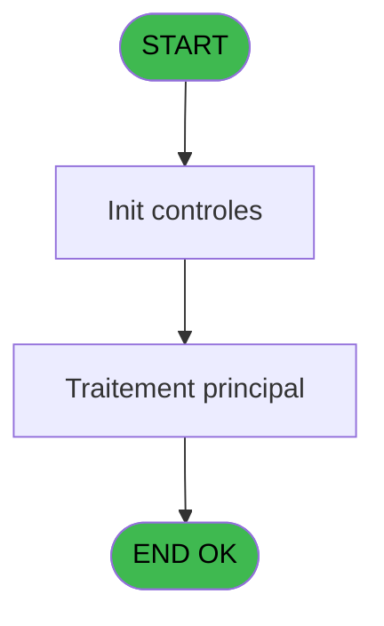
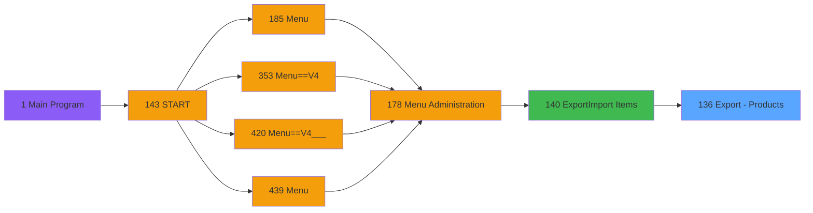

# PVE IDE 136 - Export - Products

> **Analyse**: Phases 1-4 2026-02-03 09:39 -> 09:39 (17s) | Assemblage 09:39
> **Pipeline**: V7.2 Enrichi
> **Structure**: 4 onglets (Resume | Ecrans | Donnees | Connexions)

<!-- TAB:Resume -->

## 1. FICHE D'IDENTITE

| Attribut | Valeur |
|----------|--------|
| Projet | PVE |
| IDE Position | 136 |
| Nom Programme | Export - Products |
| Fichier source | `Prg_136.xml` |
| Domaine metier | General |
| Taches | 1 (0 ecrans visibles) |
| Tables modifiees | 0 |
| Programmes appeles | 0 |

## 2. DESCRIPTION FONCTIONNELLE

**Export - Products** assure la gestion complete de ce processus, accessible depuis [Export/Import Items (IDE 140)](PVE-IDE-140.md).

Le flux de traitement s'organise en **1 blocs fonctionnels** :

- **Traitement** (1 tache) : traitements metier divers

**Logique metier** : 5 regles identifiees couvrant conditions metier.

## 3. BLOCS FONCTIONNELS

### 3.1 Traitement (1 tache)

Traitements internes.

---

#### 136 - Export - Products

**Role** : Traitement : Export - Products.

## 5. REGLES METIER

5 regles identifiees:

### Autres (5 regles)

#### [RM-001] Si [H] alors 'Y' sinon 'N')

| Element | Detail |
|---------|--------|
| **Condition** | `[H]` |
| **Si vrai** | 'Y' |
| **Si faux** | 'N') |
| **Expression source** | Expression 3 : `IF ([H],'Y','N')` |
| **Exemple** | Si [H] → 'Y'. Sinon → 'N') |

#### [RM-002] Si [I] alors 'Y' sinon 'N')

| Element | Detail |
|---------|--------|
| **Condition** | `[I]` |
| **Si vrai** | 'Y' |
| **Si faux** | 'N') |
| **Expression source** | Expression 4 : `IF ([I],'Y','N')` |
| **Exemple** | Si [I] → 'Y'. Sinon → 'N') |

#### [RM-003] Si [M] alors 'Y' sinon 'N')

| Element | Detail |
|---------|--------|
| **Condition** | `[M]` |
| **Si vrai** | 'Y' |
| **Si faux** | 'N') |
| **Expression source** | Expression 5 : `IF ([M],'Y','N')` |
| **Exemple** | Si [M] → 'Y'. Sinon → 'N') |

#### [RM-004] Si [T] alors 'Y' sinon 'N')

| Element | Detail |
|---------|--------|
| **Condition** | `[T]` |
| **Si vrai** | 'Y' |
| **Si faux** | 'N') |
| **Expression source** | Expression 6 : `IF ([T],'Y','N')` |
| **Exemple** | Si [T] → 'Y'. Sinon → 'N') |

#### [RM-005] Si [Y] alors 'Y' sinon 'N')

| Element | Detail |
|---------|--------|
| **Condition** | `[Y]` |
| **Si vrai** | 'Y' |
| **Si faux** | 'N') |
| **Expression source** | Expression 9 : `IF([Y],'Y','N')` |
| **Exemple** | Si [Y] → 'Y'. Sinon → 'N') |

## 6. CONTEXTE

- **Appele par**: [Export/Import Items (IDE 140)](PVE-IDE-140.md)
- **Appelle**: 0 programmes | **Tables**: 1 (W:0 R:1 L:0) | **Taches**: 1 | **Expressions**: 9

<!-- TAB:Ecrans -->

## 8. ECRANS

*(Programme sans ecran visible)*

## 9. NAVIGATION

### 9.3 Structure hierarchique (1 tache)

| Position | Tache | Type | Dimensions | Bloc |
|----------|-------|------|------------|------|
| **136.1** | [**Export - Products** (136)](#t1) | MDI | - | Traitement |

### 9.4 Algorigramme

> **Legende**: Vert = START/END OK | Rouge = END KO | Bleu = Decisions
> *Algorigramme auto-genere. Utiliser `/algorigramme` pour une synthese metier detaillee.*

<!-- TAB:Donnees -->

## 10. TABLES

### Tables utilisees (1)

| ID | Nom | Description | Type | R | W | L | Usages |
|----|-----|-------------|------|---|---|---|--------|
| 403 | pv_sellers |  | DB | R |   |   | 1 |

### Colonnes par table (1 / 1 tables avec colonnes identifiees)

Table 403 - pv_sellers (R) - 1 usages

| Lettre | Variable | Acces | Type |
|--------|----------|-------|------|
| A | P. Nom Fichier CSV | R | Alpha |
| B | V Entete | R | Alpha |

## 11. VARIABLES

### 11.1 Parametres entrants (1)

Variables recues du programme appelant ([Export/Import Items (IDE 140)](PVE-IDE-140.md)).

| Lettre | Nom | Type | Usage dans |
|--------|-----|------|-----------|
| A | P. Nom Fichier CSV | Alpha | 1x parametre entrant |

### 11.2 Variables de session (1)

Variables persistantes pendant toute la session.

| Lettre | Nom | Type | Usage dans |
|--------|-----|------|-----------|
| B | V Entete | Alpha | - |

## 12. EXPRESSIONS

**9 / 9 expressions decodees (100%)**

### 12.1 Repartition par type

| Type | Expressions | Regles |
|------|-------------|--------|
| CONDITION | 6 | 5 |
| CONSTANTE | 1 | 0 |
| OTHER | 2 | 0 |

### 12.2 Expressions cles par type

#### CONDITION (6 expressions)

| Type | IDE | Expression | Regle |
|------|-----|------------|-------|
| CONDITION | 6 | `IF ([T],'Y','N')` | [RM-004](#rm-RM-004) |
| CONDITION | 9 | `IF([Y],'Y','N')` | [RM-005](#rm-RM-005) |
| CONDITION | 5 | `IF ([M],'Y','N')` | [RM-003](#rm-RM-003) |
| CONDITION | 3 | `IF ([H],'Y','N')` | [RM-001](#rm-RM-001) |
| CONDITION | 4 | `IF ([I],'Y','N')` | [RM-002](#rm-RM-002) |
| ... | | *+1 autres* | |

#### CONSTANTE (1 expressions)

| Type | IDE | Expression | Regle |
|------|-----|------------|-------|
| CONSTANTE | 7 | `'Cat;SCat;Ordre;Label;PrixVente;Unite;BlockFree;BlockDiscount;CodeArticle;PrixAchat;Non gere en stock;TVA;Quantite;Decimales;Actif;Numbers of days;Sales place independant;M&E Price;OGEC Product Nature;OGEC Force ticket'` | - |

#### OTHER (2 expressions)

| Type | IDE | Expression | Regle |
|------|-----|------------|-------|
| OTHER | 2 | `GetParam ('SERVICE')` | - |
| OTHER | 1 | `P. Nom Fichier CSV [A]` | - |

<!-- TAB:Connexions -->

## 13. GRAPHE D'APPELS

### 13.1 Chaine depuis Main (Callers)

Main -> ... -> [Export/Import Items (IDE 140)](PVE-IDE-140.md) -> **Export - Products (IDE 136)**

### 13.2 Callers

| IDE | Nom Programme | Nb Appels |
|-----|---------------|-----------|
| [140](PVE-IDE-140.md) | Export/Import Items | 1 |

### 13.3 Callees (programmes appeles)

### 13.4 Detail Callees avec contexte

| IDE | Nom Programme | Appels | Contexte |
|-----|---------------|--------|----------|
| - | (aucun) | - | - |

## 14. RECOMMANDATIONS MIGRATION

### 14.1 Profil du programme

| Metrique | Valeur | Impact migration |
|----------|--------|-----------------|
| Lignes de logique | 31 | Programme compact |
| Expressions | 9 | Peu de logique |
| Tables WRITE | 0 | Impact faible |
| Sous-programmes | 0 | Peu de dependances |
| Ecrans visibles | 0 | Ecran unique ou traitement batch |
| Code desactive | 0% (0 / 31) | Code sain |
| Regles metier | 5 | Quelques regles a preserver |

### 14.2 Plan de migration par bloc

#### Traitement (1 tache: 0 ecran, 1 traitement)

- **Strategie** : 1 service(s) backend injectable(s) (Domain Services).
- Decomposer les taches en services unitaires testables.

### 14.3 Dependances critiques

| Dependance | Type | Appels | Impact |
|------------|------|--------|--------|

---
*Spec DETAILED generee par Pipeline V7.2 - 2026-02-03 09:39*
