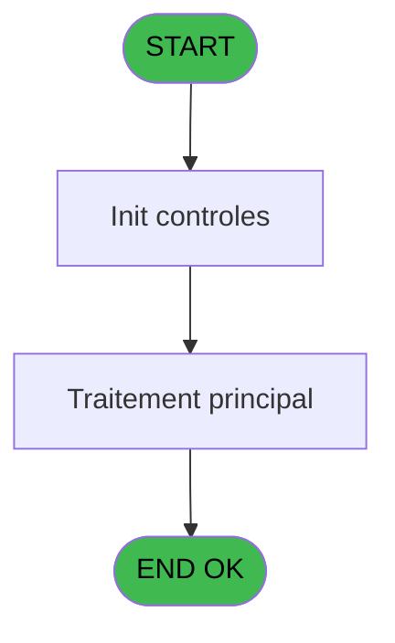
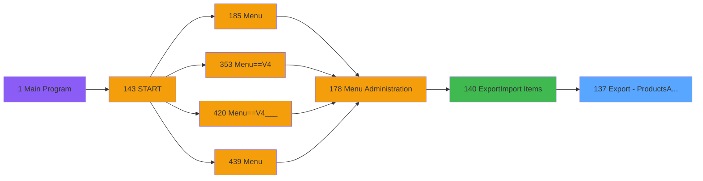

# PVE IDE 137 - Export - Products(Admin)

> **Analyse**: Phases 1-4 2026-02-03 09:39 -> 09:39 (17s) | Assemblage 09:39
> **Pipeline**: V7.2 Enrichi
> **Structure**: 4 onglets (Resume | Ecrans | Donnees | Connexions)

<!-- TAB:Resume -->

## 1. FICHE D'IDENTITE

| Attribut | Valeur |
|----------|--------|
| Projet | PVE |
| IDE Position | 137 |
| Nom Programme | Export - Products(Admin) |
| Fichier source | `Prg_137.xml` |
| Domaine metier | General |
| Taches | 1 (0 ecrans visibles) |
| Tables modifiees | 0 |
| Programmes appeles | 0 |

## 2. DESCRIPTION FONCTIONNELLE

**Export - Products(Admin)** assure la gestion complete de ce processus, accessible depuis [Export/Import Items (IDE 140)](PVE-IDE-140.md).

Le flux de traitement s'organise en **1 blocs fonctionnels** :

- **Traitement** (1 tache) : traitements metier divers

**Logique metier** : 6 regles identifiees couvrant conditions metier.

## 3. BLOCS FONCTIONNELS

### 3.1 Traitement (1 tache)

Traitements internes.

---

#### 137 - Export - Products(Admin)

**Role** : Traitement : Export - Products(Admin).

## 5. REGLES METIER

6 regles identifiees:

### Autres (6 regles)

#### [RM-001] Si [H] alors 'Y' sinon 'N')

| Element | Detail |
|---------|--------|
| **Condition** | `[H]` |
| **Si vrai** | 'Y' |
| **Si faux** | 'N') |
| **Expression source** | Expression 3 : `IF ([H],'Y','N')` |
| **Exemple** | Si [H] → 'Y'. Sinon → 'N') |

#### [RM-002] Si [I] alors 'Y' sinon 'N')

| Element | Detail |
|---------|--------|
| **Condition** | `[I]` |
| **Si vrai** | 'Y' |
| **Si faux** | 'N') |
| **Expression source** | Expression 4 : `IF ([I],'Y','N')` |
| **Exemple** | Si [I] → 'Y'. Sinon → 'N') |

#### [RM-003] Si [M] alors 'Y' sinon 'N')

| Element | Detail |
|---------|--------|
| **Condition** | `[M]` |
| **Si vrai** | 'Y' |
| **Si faux** | 'N') |
| **Expression source** | Expression 5 : `IF ([M],'Y','N')` |
| **Exemple** | Si [M] → 'Y'. Sinon → 'N') |

#### [RM-004] Si [O]<>0 AND [X]<>0 alors Round([X]*[O]/[W] sinon 10,[P]),[L])

| Element | Detail |
|---------|--------|
| **Condition** | `[O]<>0 AND [X]<>0` |
| **Si vrai** | Round([X]*[O]/[W] |
| **Si faux** | 10,[P]),[L]) |
| **Expression source** | Expression 8 : `IF([O]<>0 AND [X]<>0, Round([X]*[O]/[W],10,[P]),[L])` |
| **Exemple** | Si [O]<>0 AND [X]<>0 → Round([X]*[O]/[W]. Sinon → 10,[P]),[L]) |

#### [RM-005] Si [S] alors 'Y' sinon 'N')

| Element | Detail |
|---------|--------|
| **Condition** | `[S]` |
| **Si vrai** | 'Y' |
| **Si faux** | 'N') |
| **Expression source** | Expression 16 : `IF ([S],'Y','N')` |
| **Exemple** | Si [S] → 'Y'. Sinon → 'N') |

#### [RM-006] Si [T] alors 'Y' sinon 'N')

| Element | Detail |
|---------|--------|
| **Condition** | `[T]` |
| **Si vrai** | 'Y' |
| **Si faux** | 'N') |
| **Expression source** | Expression 17 : `IF ([T],'Y','N')` |
| **Exemple** | Si [T] → 'Y'. Sinon → 'N') |

## 6. CONTEXTE

- **Appele par**: [Export/Import Items (IDE 140)](PVE-IDE-140.md)
- **Appelle**: 0 programmes | **Tables**: 4 (W:0 R:1 L:3) | **Taches**: 1 | **Expressions**: 18

<!-- TAB:Ecrans -->

## 8. ECRANS

*(Programme sans ecran visible)*

## 9. NAVIGATION

### 9.3 Structure hierarchique (1 tache)

| Position | Tache | Type | Dimensions | Bloc |
|----------|-------|------|------------|------|
| **137.1** | [**Export - Products(Admin)** (137)](#t1) | MDI | - | Traitement |

### 9.4 Algorigramme

> **Legende**: Vert = START/END OK | Rouge = END KO | Bleu = Decisions
> *Algorigramme auto-genere. Utiliser `/algorigramme` pour une synthese metier detaillee.*

<!-- TAB:Donnees -->

## 10. TABLES

### Tables utilisees (4)

| ID | Nom | Description | Type | R | W | L | Usages |
|----|-----|-------------|------|---|---|---|--------|
| 65 | comptes_recette__cre | Comptes GM (generaux) | DB | R |   |   | 1 |
| 77 | articles_________art | Articles et stock | DB |   |   | L | 1 |
| 403 | pv_sellers |  | DB |   |   | L | 1 |
| 413 | pv_tva |  | DB |   |   | L | 1 |

### Colonnes par table (1 / 1 tables avec colonnes identifiees)

Table 65 - comptes_recette__cre (R) - 1 usages

| Lettre | Variable | Acces | Type |
|--------|----------|-------|------|
| A | P. Nom Fichier CSV | R | Alpha |
| B | V Entete | R | Alpha |
| C | V.UnitPurchasingPrice | R | Numeric |
| D | V Products | R | Unicode |

## 11. VARIABLES

### 11.1 Parametres entrants (1)

Variables recues du programme appelant ([Export/Import Items (IDE 140)](PVE-IDE-140.md)).

| Lettre | Nom | Type | Usage dans |
|--------|-----|------|-----------|
| A | P. Nom Fichier CSV | Alpha | 1x parametre entrant |

### 11.2 Variables de session (3)

Variables persistantes pendant toute la session.

| Lettre | Nom | Type | Usage dans |
|--------|-----|------|-----------|
| B | V Entete | Alpha | 2x session |
| C | V.UnitPurchasingPrice | Numeric | 2x session |
| D | V Products | Unicode | [137](#t1) |

## 12. EXPRESSIONS

**18 / 18 expressions decodees (100%)**

### 12.1 Repartition par type

| Type | Expressions | Regles |
|------|-------------|--------|
| CONDITION | 7 | 6 |
| CONSTANTE | 2 | 0 |
| OTHER | 8 | 0 |
| FORMAT | 1 | 0 |

### 12.2 Expressions cles par type

#### CONDITION (7 expressions)

| Type | IDE | Expression | Regle |
|------|-----|------------|-------|
| CONDITION | 8 | `IF([O]<>0 AND [X]<>0, Round([X]*[O]/[W],10,[P]),[L])` | [RM-004](#rm-RM-004) |
| CONDITION | 16 | `IF ([S],'Y','N')` | [RM-005](#rm-RM-005) |
| CONDITION | 17 | `IF ([T],'Y','N')` | [RM-006](#rm-RM-006) |
| CONDITION | 3 | `IF ([H],'Y','N')` | [RM-001](#rm-RM-001) |
| CONDITION | 4 | `IF ([I],'Y','N')` | [RM-002](#rm-RM-002) |
| ... | | *+2 autres* | |

#### CONSTANTE (2 expressions)

| Type | IDE | Expression | Regle |
|------|-----|------------|-------|
| CONSTANTE | 7 | `'Service;Cat;SCat;Ordre;CodeArticle;Label;Sale Label;PrixAchat;TVA;PrixVente;Unite;Quantite;Purchasing Volume;Unit Purchasing Price;BlockFree;BlockDiscount;Non gere en stock;Actif;Numbers of days;Gift Pass;Sales Place Independant;Eligible au crédit bar;Recopie du libellé commercial;OGEC Product Nature(S Service / P Product);OGEC Force Ticket;M&E Price'` | - |
| CONSTANTE | 6 | `'Cat;SCat;Ordre;Label;PrixVente;Unite;BlockFree;BlockDiscount;CodeArticle;PrixAchat;Non gere en stock;TVA;Quantite;Decimales;Actif;Numbers of days;Service;Imputation;Sous Imputation;Libelle article;NumArticle;Libelle Imputation;Gift Pass;Sales Place Independant'` | - |

#### OTHER (8 expressions)

| Type | IDE | Expression | Regle |
|------|-----|------------|-------|
| OTHER | 13 | `[AD]` | - |
| OTHER | 12 | `V.UnitPurchasingPrice [C]` | - |
| OTHER | 15 | `[E]` | - |
| OTHER | 14 | `[AG]` | - |
| OTHER | 2 | `GetParam ('SERVICE')` | - |
| ... | | *+3 autres* | |

#### FORMAT (1 expressions)

| Type | IDE | Expression | Regle |
|------|-----|------------|-------|
| FORMAT | 9 | `Trim([J])&';'& Trim(Str(V Entete [B],'2P0')) & ';' & Trim(Str(V.UnitPurchasingPrice [C],'2P0')) & ';' & Trim(Str(V Products [D],'2P0'))& ';' & Trim([K]) & ';' & Trim([E]) & ';' & Trim([V])& ';' & Trim(Str([X],'N12.3C'))& ';' & Trim(Str([N],'#2.#'))& ';' & Trim(Str([F],'N12.3C'))& ';' & Trim([G])& ';' & Trim(Str([O],'6.6'))& ';' & Trim(Str([W],'N12.3C'))& ';' & Trim(Str([AS],'N12.3C')) & ';' & IF ([H],'Y','N')& ';' & IF ([I],'Y','N')& ';' &IF ([M],'Y','N')& ';' & Trim([Q])& ';' & Trim(Str([R],'3.1'))& ';' & IF ([S],'Y','N')& ';' & IF([T],'Y','N')& ';' & IF([Y],'Y','N')& ';' & IF([Z],'Y','N')& ';' & Trim([AU])& ';' & IF([AV],'Y','N')& ';' & Str([AW],'N12.3C')` | - |

<!-- TAB:Connexions -->

## 13. GRAPHE D'APPELS

### 13.1 Chaine depuis Main (Callers)

Main -> ... -> [Export/Import Items (IDE 140)](PVE-IDE-140.md) -> **Export - Products(Admin) (IDE 137)**

### 13.2 Callers

| IDE | Nom Programme | Nb Appels |
|-----|---------------|-----------|
| [140](PVE-IDE-140.md) | Export/Import Items | 1 |

### 13.3 Callees (programmes appeles)

### 13.4 Detail Callees avec contexte

| IDE | Nom Programme | Appels | Contexte |
|-----|---------------|--------|----------|
| - | (aucun) | - | - |

## 14. RECOMMANDATIONS MIGRATION

### 14.1 Profil du programme

| Metrique | Valeur | Impact migration |
|----------|--------|-----------------|
| Lignes de logique | 73 | Programme compact |
| Expressions | 18 | Peu de logique |
| Tables WRITE | 0 | Impact faible |
| Sous-programmes | 0 | Peu de dependances |
| Ecrans visibles | 0 | Ecran unique ou traitement batch |
| Code desactive | 2.7% (2 / 73) | Code sain |
| Regles metier | 6 | Quelques regles a preserver |

### 14.2 Plan de migration par bloc

#### Traitement (1 tache: 0 ecran, 1 traitement)

- **Strategie** : 1 service(s) backend injectable(s) (Domain Services).
- Decomposer les taches en services unitaires testables.

### 14.3 Dependances critiques

| Dependance | Type | Appels | Impact |
|------------|------|--------|--------|

---
*Spec DETAILED generee par Pipeline V7.2 - 2026-02-03 09:39*
