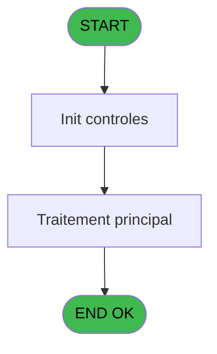
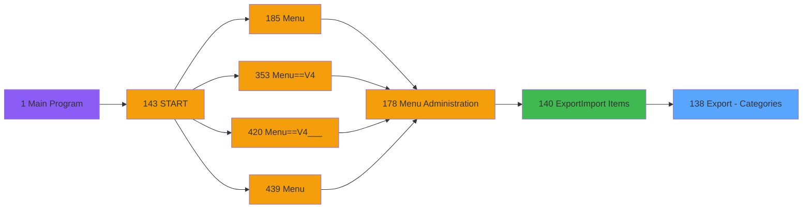

# PVE IDE 138 - Export - Categories

> **Analyse**: Phases 1-4 2026-02-03 09:39 -> 09:40 (18s) | Assemblage 09:40
> **Pipeline**: V7.2 Enrichi
> **Structure**: 4 onglets (Resume | Ecrans | Donnees | Connexions)

<!-- TAB:Resume -->

## 1. FICHE D'IDENTITE

| Attribut | Valeur |
|----------|--------|
| Projet | PVE |
| IDE Position | 138 |
| Nom Programme | Export - Categories |
| Fichier source | `Prg_138.xml` |
| Domaine metier | General |
| Taches | 1 (0 ecrans visibles) |
| Tables modifiees | 0 |
| Programmes appeles | 0 |

## 2. DESCRIPTION FONCTIONNELLE

**Export - Categories** assure la gestion complete de ce processus, accessible depuis [Export/Import Items (IDE 140)](PVE-IDE-140.md).

Le flux de traitement s'organise en **1 blocs fonctionnels** :

- **Traitement** (1 tache) : traitements metier divers

## 3. BLOCS FONCTIONNELS

### 3.1 Traitement (1 tache)

Traitements internes.

---

#### 138 - Export - Categories

**Role** : Traitement : Export - Categories.

## 5. REGLES METIER

*(Aucune regle metier identifiee)*

## 6. CONTEXTE

- **Appele par**: [Export/Import Items (IDE 140)](PVE-IDE-140.md)
- **Appelle**: 0 programmes | **Tables**: 5 (W:0 R:1 L:4) | **Taches**: 1 | **Expressions**: 11

<!-- TAB:Ecrans -->

## 8. ECRANS

*(Programme sans ecran visible)*

## 9. NAVIGATION

### 9.3 Structure hierarchique (1 tache)

| Position | Tache | Type | Dimensions | Bloc |
|----------|-------|------|------------|------|
| **138.1** | [**Export - Categories** (138)](#t1) | MDI | - | Traitement |

### 9.4 Algorigramme

> **Legende**: Vert = START/END OK | Rouge = END KO | Bleu = Decisions
> *Algorigramme auto-genere. Utiliser `/algorigramme` pour une synthese metier detaillee.*

<!-- TAB:Donnees -->

## 10. TABLES

### Tables utilisees (5)

| ID | Nom | Description | Type | R | W | L | Usages |
|----|-----|-------------|------|---|---|---|--------|
| 65 | comptes_recette__cre | Comptes GM (generaux) | DB | R |   |   | 1 |
| 77 | articles_________art | Articles et stock | DB |   |   | L | 1 |
| 379 | pv_customer_temp |  | DB |   |   | L | 1 |
| 380 | pv_day_modes |  | DB |   |   | L | 1 |
| 413 | pv_tva |  | DB |   |   | L | 1 |

### Colonnes par table (1 / 1 tables avec colonnes identifiees)

Table 65 - comptes_recette__cre (R) - 1 usages

| Lettre | Variable | Acces | Type |
|--------|----------|-------|------|
| A | P. Nom Fichier CSV | R | Alpha |
| B | V.S OU R | R | Unicode |
| C | Entete | R | Unicode |
| D | Détails | R | Unicode |

## 11. VARIABLES

### 11.1 Parametres entrants (1)

Variables recues du programme appelant ([Export/Import Items (IDE 140)](PVE-IDE-140.md)).

| Lettre | Nom | Type | Usage dans |
|--------|-----|------|-----------|
| A | P. Nom Fichier CSV | Alpha | 1x parametre entrant |

### 11.2 Variables de session (1)

Variables persistantes pendant toute la session.

| Lettre | Nom | Type | Usage dans |
|--------|-----|------|-----------|
| B | V.S OU R | Unicode | 2x session |

### 11.3 Autres (2)

Variables diverses.

| Lettre | Nom | Type | Usage dans |
|--------|-----|------|-----------|
| C | Entete | Unicode | 1x refs |
| D | Détails | Unicode | 1x refs |

## 12. EXPRESSIONS

**11 / 11 expressions decodees (100%)**

### 12.1 Repartition par type

| Type | Expressions | Regles |
|------|-------------|--------|
| OTHER | 8 | 0 |
| CONDITION | 1 | 0 |
| CONCATENATION | 1 | 0 |
| FORMAT | 1 | 0 |

### 12.2 Expressions cles par type

#### OTHER (8 expressions)

| Type | IDE | Expression | Regle |
|------|-----|------------|-------|
| OTHER | 7 | `[F]` | - |
| OTHER | 5 | `[E]` | - |
| OTHER | 11 | `[G]` | - |
| OTHER | 8 | `[T]` | - |
| OTHER | 2 | `[H]` | - |
| ... | | *+3 autres* | |

#### CONDITION (1 expressions)

| Type | IDE | Expression | Regle |
|------|-----|------------|-------|
| CONDITION | 6 | `[I] = 0` | - |

#### CONCATENATION (1 expressions)

| Type | IDE | Expression | Regle |
|------|-----|------------|-------|
| CONCATENATION | 9 | `'Catcode;CatLib;SCatCode;SCatLib;NumArticle;Libelle Imputation;Imputation;Sous Imputation;Libelle Article;S ou R;Classification;Libelle classification;Age pour gratuité;Contient l''alcool;M&E uniquement;M&E discount percentage;'` | - |

#### FORMAT (1 expressions)

| Type | IDE | Expression | Regle |
|------|-----|------------|-------|
| FORMAT | 10 | `Trim(Str(V.S OU R [B],'2P0'))&';'&Trim([N])&';'&Trim(Str(Entete [C],'2P0'))&';'&Trim(Détails [D])&';'&Trim(Str([F],'6P0'))&';'&Trim([Z])&';'&Trim(Str([T],'10'))&';'&Trim(Str([U],'3P0Z0'))&';'&Trim([V])&';'&Trim([AA])&';'&Trim(Str([P],'10'))&';'&Trim(RepStr([Q],';',' '))&';'&Trim(Str([J],'3'))&';'&IF([K],'Y','N')&';'&IF([AE],'Y','N')&';'&Str([AF],'3.2P0Z')&';'` | - |

<!-- TAB:Connexions -->

## 13. GRAPHE D'APPELS

### 13.1 Chaine depuis Main (Callers)

Main -> ... -> [Export/Import Items (IDE 140)](PVE-IDE-140.md) -> **Export - Categories (IDE 138)**

### 13.2 Callers

| IDE | Nom Programme | Nb Appels |
|-----|---------------|-----------|
| [140](PVE-IDE-140.md) | Export/Import Items | 1 |

### 13.3 Callees (programmes appeles)

### 13.4 Detail Callees avec contexte

| IDE | Nom Programme | Appels | Contexte |
|-----|---------------|--------|----------|
| - | (aucun) | - | - |

## 14. RECOMMANDATIONS MIGRATION

### 14.1 Profil du programme

| Metrique | Valeur | Impact migration |
|----------|--------|-----------------|
| Lignes de logique | 53 | Programme compact |
| Expressions | 11 | Peu de logique |
| Tables WRITE | 0 | Impact faible |
| Sous-programmes | 0 | Peu de dependances |
| Ecrans visibles | 0 | Ecran unique ou traitement batch |
| Code desactive | 3.8% (2 / 53) | Code sain |
| Regles metier | 0 | Pas de regle identifiee |

### 14.2 Plan de migration par bloc

#### Traitement (1 tache: 0 ecran, 1 traitement)

- **Strategie** : 1 service(s) backend injectable(s) (Domain Services).
- Decomposer les taches en services unitaires testables.

### 14.3 Dependances critiques

| Dependance | Type | Appels | Impact |
|------------|------|--------|--------|

---
*Spec DETAILED generee par Pipeline V7.2 - 2026-02-03 09:40*
