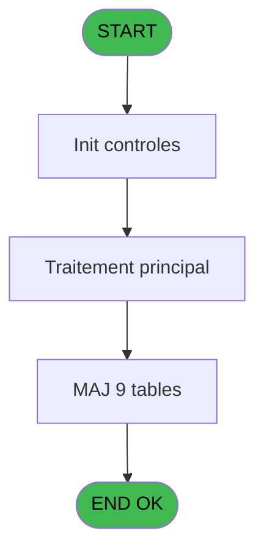
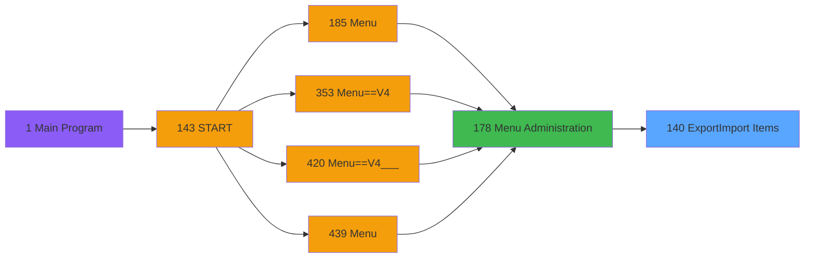
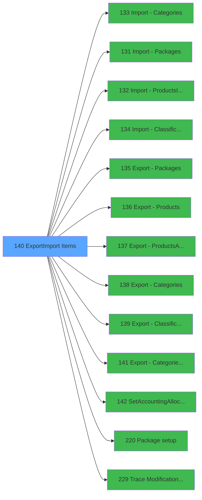

# PVE IDE 140 - Export/Import Items

> **Analyse**: Phases 1-4 2026-02-03 09:40 -> 09:41 (18s) | Assemblage 09:41
> **Pipeline**: V7.2 Enrichi
> **Structure**: 4 onglets (Resume | Ecrans | Donnees | Connexions)

<!-- TAB:Resume -->

## 1. FICHE D'IDENTITE

| Attribut | Valeur |
|----------|--------|
| Projet | PVE |
| IDE Position | 140 |
| Nom Programme | Export/Import Items |
| Fichier source | `Prg_140.xml` |
| Domaine metier | General |
| Taches | 11 (1 ecrans visibles) |
| Tables modifiees | 9 |
| Programmes appeles | 13 |

## 2. DESCRIPTION FONCTIONNELLE

**Export/Import Items** assure la gestion complete de ce processus, accessible depuis [Menu Administration (IDE 178)](PVE-IDE-178.md).

Le flux de traitement s'organise en **2 blocs fonctionnels** :

- **Traitement** (10 taches) : traitements metier divers
- **Calcul** (1 tache) : calculs de montants, stocks ou compteurs

**Donnees modifiees** : 9 tables en ecriture (pv_customer_temp, pv_day_modes, pv_cust_rentals_histo, pv_sellers, pv_tva, Temp_service_cash, pv_mvt_stock_tempo, stat_jour, log_effectif_envoi).

Detail : phases du traitement

#### Phase 1 : Traitement (10 taches)

- **140** - Export/Import Items **[[ECRAN]](#ecran-t1)**
- **140.1** - Delete Categories
- **140.2** - Delete S/Categories
- **140.3** - Delete Products
- **140.4** - Delete Packages
- **140.6** - Delete inventory
- **140.6.1** - Delete inventory line
- **140.7** - Delete S/Categories
- **140.8** - Delete Package Comp
- **140.9** - GetLastCategory

Delegue a : [Import - Categories (IDE 133)](PVE-IDE-133.md), [Import - Packages (IDE 131)](PVE-IDE-131.md), [Import - ProductsIO(Admin) (IDE 132)](PVE-IDE-132.md), [Import - Classifications (IDE 134)](PVE-IDE-134.md), [Export - Packages (IDE 135)](PVE-IDE-135.md), [Export - Products (IDE 136)](PVE-IDE-136.md), [Export - Products(Admin) (IDE 137)](PVE-IDE-137.md), [Export - Categories (IDE 138)](PVE-IDE-138.md), [Export - Classifications (IDE 139)](PVE-IDE-139.md), [Export - Categories_Rental (IDE 141)](PVE-IDE-141.md), [SetAccountingAllocations (IDE 142)](PVE-IDE-142.md), [Package setup (IDE 220)](PVE-IDE-220.md), [Trace Modification package (IDE 229)](PVE-IDE-229.md)

#### Phase 2 : Calcul (1 tache)

- **140.5** - Delete stock movement

#### Tables impactees

| Table | Operations | Role metier |
|-------|-----------|-------------|
| pv_customer_temp | R/**W** (2 usages) |  |
| pv_sellers | **W** (1 usages) |  |
| pv_tva | **W** (1 usages) |  |
| log_effectif_envoi | **W** (1 usages) |  |
| stat_jour | **W** (1 usages) |  |
| pv_cust_rentals_histo | **W** (1 usages) | Historique / journal |
| pv_day_modes | **W** (1 usages) |  |
| Temp_service_cash | **W** (1 usages) | Services / filieres |
| pv_mvt_stock_tempo | **W** (1 usages) | Table temporaire ecran |

## 3. BLOCS FONCTIONNELS

### 3.1 Traitement (10 taches)

Traitements internes.

---

#### 140 - Export/Import Items [[ECRAN]](#ecran-t1)

**Role** : Tache d'orchestration : point d'entree du programme (10 sous-taches). Coordonne l'enchainement des traitements.
**Ecran** : 322 x 198 DLU (MDI) | [Voir mockup](#ecran-t1)

9 sous-taches directes

| Tache | Nom | Bloc |
|-------|-----|------|
| [140.1](#t2) | Delete Categories | Traitement |
| [140.2](#t3) | Delete S/Categories | Traitement |
| [140.3](#t4) | Delete Products | Traitement |
| [140.4](#t5) | Delete Packages | Traitement |
| [140.6](#t7) | Delete inventory | Traitement |
| [140.6.1](#t8) | Delete inventory line | Traitement |
| [140.7](#t9) | Delete S/Categories | Traitement |
| [140.8](#t10) | Delete Package Comp | Traitement |
| [140.9](#t11) | GetLastCategory | Traitement |

**Delegue a** : [Import - Categories (IDE 133)](PVE-IDE-133.md), [Import - Packages (IDE 131)](PVE-IDE-131.md), [Import - ProductsIO(Admin) (IDE 132)](PVE-IDE-132.md)

---

#### 140.1 - Delete Categories

**Role** : Traitement : Delete Categories.
**Variables liees** : E (V Nom Fichier Categories), L (v Erreur Import Categories ?)
**Delegue a** : [Import - Categories (IDE 133)](PVE-IDE-133.md), [Import - Packages (IDE 131)](PVE-IDE-131.md), [Import - ProductsIO(Admin) (IDE 132)](PVE-IDE-132.md)

---

#### 140.2 - Delete S/Categories

**Role** : Traitement : Delete S/Categories.
**Delegue a** : [Import - Categories (IDE 133)](PVE-IDE-133.md), [Import - Packages (IDE 131)](PVE-IDE-131.md), [Import - ProductsIO(Admin) (IDE 132)](PVE-IDE-132.md)

---

#### 140.3 - Delete Products

**Role** : Traitement : Delete Products.
**Variables liees** : F (V Nom Fichier Products)
**Delegue a** : [Import - Categories (IDE 133)](PVE-IDE-133.md), [Import - Packages (IDE 131)](PVE-IDE-131.md), [Import - ProductsIO(Admin) (IDE 132)](PVE-IDE-132.md)

---

#### 140.4 - Delete Packages

**Role** : Traitement : Delete Packages.
**Variables liees** : G (V Nom Fichier Packages)
**Delegue a** : [Import - Categories (IDE 133)](PVE-IDE-133.md), [Import - Packages (IDE 131)](PVE-IDE-131.md), [Import - ProductsIO(Admin) (IDE 132)](PVE-IDE-132.md)

---

#### 140.6 - Delete inventory

**Role** : Traitement : Delete inventory.
**Delegue a** : [Import - Categories (IDE 133)](PVE-IDE-133.md), [Import - Packages (IDE 131)](PVE-IDE-131.md), [Import - ProductsIO(Admin) (IDE 132)](PVE-IDE-132.md)

---

#### 140.6.1 - Delete inventory line

**Role** : Traitement : Delete inventory line.
**Delegue a** : [Import - Categories (IDE 133)](PVE-IDE-133.md), [Import - Packages (IDE 131)](PVE-IDE-131.md), [Import - ProductsIO(Admin) (IDE 132)](PVE-IDE-132.md)

---

#### 140.7 - Delete S/Categories

**Role** : Traitement : Delete S/Categories.
**Delegue a** : [Import - Categories (IDE 133)](PVE-IDE-133.md), [Import - Packages (IDE 131)](PVE-IDE-131.md), [Import - ProductsIO(Admin) (IDE 132)](PVE-IDE-132.md)

---

#### 140.8 - Delete Package Comp

**Role** : Traitement : Delete Package Comp.
**Variables liees** : G (V Nom Fichier Packages)
**Delegue a** : [Import - Categories (IDE 133)](PVE-IDE-133.md), [Import - Packages (IDE 131)](PVE-IDE-131.md), [Import - ProductsIO(Admin) (IDE 132)](PVE-IDE-132.md)

---

#### 140.9 - GetLastCategory

**Role** : Consultation/chargement : GetLastCategory.
**Delegue a** : [Import - Categories (IDE 133)](PVE-IDE-133.md), [Import - Packages (IDE 131)](PVE-IDE-131.md), [Import - ProductsIO(Admin) (IDE 132)](PVE-IDE-132.md)

### 3.2 Calcul (1 tache)

Calculs metier : montants, stocks, compteurs.

---

#### 140.5 - Delete stock movement

**Role** : Calcul : Delete stock movement.

## 5. REGLES METIER

*(Aucune regle metier identifiee)*

## 6. CONTEXTE

- **Appele par**: [Menu Administration (IDE 178)](PVE-IDE-178.md)
- **Appelle**: 13 programmes | **Tables**: 9 (W:9 R:1 L:0) | **Taches**: 11 | **Expressions**: 34

<!-- TAB:Ecrans -->

## 8. ECRANS

### 8.1 Forms visibles (1 / 11)

| # | Position | Tache | Nom | Type | Largeur | Hauteur | Bloc |
|---|----------|-------|-----|------|---------|---------|------|
| 1 | 140 | 140 | Export/Import Items | MDI | 322 | 198 | Traitement |

### 8.2 Mockups Ecrans

---

#### 140 - Export/Import Items
**Tache** : [140](#t1) | **Type** : MDI | **Dimensions** : 322 x 198 DLU
**Bloc** : Traitement | **Titre IDE** : Export/Import Items

<!-- FORM-DATA:
{
    "width":  322,
    "vFactor":  8,
    "type":  "MDI",
    "hFactor":  4,
    "controls":  [
                     {
                         "x":  18,
                         "type":  "label",
                         "var":  "",
                         "y":  60,
                         "w":  142,
                         "fmt":  "",
                         "name":  "",
                         "h":  12,
                         "color":  "183",
                         "text":  "Files to be generated.",
                         "parent":  null
                     },
                     {
                         "x":  16,
                         "type":  "label",
                         "var":  "",
                         "y":  142,
                         "w":  265,
                         "fmt":  "",
                         "name":  "",
                         "h":  12,
                         "color":  "187",
                         "text":  "Confirm the execution of the treatment.",
                         "parent":  null
                     },
                     {
                         "x":  0,
                         "type":  "label",
                         "var":  "",
                         "y":  0,
                         "w":  312,
                         "fmt":  "",
                         "name":  "",
                         "h":  42,
                         "color":  "182",
                         "text":  "",
                         "parent":  null
                     },
                     {
                         "x":  0,
                         "type":  "label",
                         "var":  "",
                         "y":  160,
                         "w":  321,
                         "fmt":  "",
                         "name":  "",
                         "h":  34,
                         "color":  "183",
                         "text":  "",
                         "parent":  null
                     },
                     {
                         "x":  16,
                         "type":  "edit",
                         "var":  "",
                         "y":  73,
                         "w":  277,
                         "fmt":  "",
                         "name":  "",
                         "h":  12,
                         "color":  "110",
                         "text":  "",
                         "parent":  null
                     },
                     {
                         "x":  16,
                         "type":  "edit",
                         "var":  "",
                         "y":  86,
                         "w":  277,
                         "fmt":  "",
                         "name":  "",
                         "h":  12,
                         "color":  "110",
                         "text":  "",
                         "parent":  null
                     },
                     {
                         "x":  16,
                         "type":  "edit",
                         "var":  "",
                         "y":  99,
                         "w":  277,
                         "fmt":  "",
                         "name":  "",
                         "h":  12,
                         "color":  "110",
                         "text":  "",
                         "parent":  null
                     },
                     {
                         "x":  183,
                         "type":  "button",
                         "var":  "",
                         "y":  165,
                         "w":  68,
                         "fmt":  "\u0026Validate",
                         "name":  "VALIDATE",
                         "h":  28,
                         "color":  "",
                         "text":  "",
                         "parent":  null
                     },
                     {
                         "x":  13,
                         "type":  "edit",
                         "var":  "",
                         "y":  12,
                         "w":  244,
                         "fmt":  "50",
                         "name":  "",
                         "h":  10,
                         "color":  "186",
                         "text":  "",
                         "parent":  7
                     },
                     {
                         "x":  13,
                         "type":  "edit",
                         "var":  "",
                         "y":  22,
                         "w":  244,
                         "fmt":  "50",
                         "name":  "",
                         "h":  10,
                         "color":  "186",
                         "text":  "",
                         "parent":  7
                     },
                     {
                         "x":  251,
                         "type":  "button",
                         "var":  "",
                         "y":  165,
                         "w":  68,
                         "fmt":  "\u0026Exit",
                         "name":  "EXIT",
                         "h":  28,
                         "color":  "",
                         "text":  "",
                         "parent":  null
                     },
                     {
                         "x":  262,
                         "type":  "image",
                         "var":  "",
                         "y":  4,
                         "w":  48,
                         "fmt":  "",
                         "name":  "",
                         "h":  37,
                         "color":  "",
                         "text":  "",
                         "parent":  7
                     },
                     {
                         "x":  16,
                         "type":  "edit",
                         "var":  "",
                         "y":  112,
                         "w":  277,
                         "fmt":  "",
                         "name":  "",
                         "h":  12,
                         "color":  "110",
                         "text":  "",
                         "parent":  null
                     }
                 ],
    "taskId":  "140",
    "height":  198
}
-->

<strong>Champs : 6 champs</strong>

| Pos (x,y) | Nom | Variable | Type |
|-----------|-----|----------|------|
| 16,73 | (sans nom) | - | edit |
| 16,86 | (sans nom) | - | edit |
| 16,99 | (sans nom) | - | edit |
| 13,12 | 50 | - | edit |
| 13,22 | 50 | - | edit |
| 16,112 | (sans nom) | - | edit |

<strong>Boutons : 2 boutons</strong>

| Bouton | Pos (x,y) | Action |
|--------|-----------|--------|
| Validate | 183,165 | Valide la saisie et enregistre |
| Exit | 251,165 | Quitte le programme |

## 9. NAVIGATION

Ecran unique: **Export/Import Items**

### 9.3 Structure hierarchique (11 taches)

| Position | Tache | Type | Dimensions | Bloc |
|----------|-------|------|------------|------|
| **140.1** | [**Export/Import Items** (140)](#t1) [mockup](#ecran-t1) | MDI | 322x198 | Traitement |
| 140.1.1 | [Delete Categories (140.1)](#t2) | MDI | - | |
| 140.1.2 | [Delete S/Categories (140.2)](#t3) | MDI | - | |
| 140.1.3 | [Delete Products (140.3)](#t4) | MDI | - | |
| 140.1.4 | [Delete Packages (140.4)](#t5) | MDI | - | |
| 140.1.5 | [Delete inventory (140.6)](#t7) | - | - | |
| 140.1.6 | [Delete inventory line (140.6.1)](#t8) | - | - | |
| 140.1.7 | [Delete S/Categories (140.7)](#t9) | MDI | - | |
| 140.1.8 | [Delete Package Comp (140.8)](#t10) | - | - | |
| 140.1.9 | [GetLastCategory (140.9)](#t11) | - | - | |
| **140.2** | [**Delete stock movement** (140.5)](#t6) | - | - | Calcul |

### 9.4 Algorigramme

> **Legende**: Vert = START/END OK | Rouge = END KO | Bleu = Decisions
> *Algorigramme auto-genere. Utiliser `/algorigramme` pour une synthese metier detaillee.*

<!-- TAB:Donnees -->

## 10. TABLES

### Tables utilisees (9)

| ID | Nom | Description | Type | R | W | L | Usages |
|----|-----|-------------|------|---|---|---|--------|
| 379 | pv_customer_temp |  | DB | R | **W** |   | 2 |
| 380 | pv_day_modes |  | DB |   | **W** |   | 1 |
| 401 | pv_cust_rentals_histo | Historique / journal | DB |   | **W** |   | 1 |
| 403 | pv_sellers |  | DB |   | **W** |   | 1 |
| 413 | pv_tva |  | DB |   | **W** |   | 1 |
| 759 | Temp_service_cash | Services / filieres | DB |   | **W** |   | 1 |
| 762 | pv_mvt_stock_tempo | Table temporaire ecran | DB |   | **W** |   | 1 |
| 796 | stat_jour |  | DB |   | **W** |   | 1 |
| 797 | log_effectif_envoi |  | DB |   | **W** |   | 1 |

### Colonnes par table (0 / 9 tables avec colonnes identifiees)

Table 379 - pv_customer_temp (R/**W**) - 2 usages

*Table utilisee uniquement en Link ou aucune colonne Real identifiee dans le DataView.*

Table 380 - pv_day_modes (**W**) - 1 usages

*Table utilisee uniquement en Link ou aucune colonne Real identifiee dans le DataView.*

Table 401 - pv_cust_rentals_histo (**W**) - 1 usages

*Table utilisee uniquement en Link ou aucune colonne Real identifiee dans le DataView.*

Table 403 - pv_sellers (**W**) - 1 usages

*Table utilisee uniquement en Link ou aucune colonne Real identifiee dans le DataView.*

Table 413 - pv_tva (**W**) - 1 usages

*Table utilisee uniquement en Link ou aucune colonne Real identifiee dans le DataView.*

Table 759 - Temp_service_cash (**W**) - 1 usages

*Table utilisee uniquement en Link ou aucune colonne Real identifiee dans le DataView.*

Table 762 - pv_mvt_stock_tempo (**W**) - 1 usages

*Table utilisee uniquement en Link ou aucune colonne Real identifiee dans le DataView.*

Table 796 - stat_jour (**W**) - 1 usages

*Table utilisee uniquement en Link ou aucune colonne Real identifiee dans le DataView.*

Table 797 - log_effectif_envoi (**W**) - 1 usages

*Table utilisee uniquement en Link ou aucune colonne Real identifiee dans le DataView.*

## 11. VARIABLES

### 11.1 Parametres entrants (1)

Variables recues du programme appelant ([Menu Administration (IDE 178)](PVE-IDE-178.md)).

| Lettre | Nom | Type | Usage dans |
|--------|-----|------|-----------|
| A | P. Ctrlname | Alpha | 4x parametre entrant |

### 11.2 Variables de session (9)

Variables persistantes pendant toute la session.

| Lettre | Nom | Type | Usage dans |
|--------|-----|------|-----------|
| B | V.Directory saisie | Alpha | 3x session |
| C | V.Directory export import | Alpha | [140](#t1) |
| E | V Nom Fichier Categories | Alpha | [140.1](#t2), [140.2](#t3), [140.7](#t9) |
| F | V Nom Fichier Products | Alpha | [140.3](#t4) |
| G | V Nom Fichier Packages | Alpha | [140.4](#t5) |
| H | V Nom Fichier Classifications | Alpha | - |
| K | V.Confirm import | Numeric | [140](#t1) |
| L | v Erreur Import Categories ? | Logical | - |
| M | V.LastCategoryID | Numeric | - |

### 11.3 Autres (3)

Variables diverses.

| Lettre | Nom | Type | Usage dans |
|--------|-----|------|-----------|
| D | Bt.Directory | Alpha | - |
| I | L Erreur | Logical | - |
| J | BP. Validate | Alpha | - |

## 12. EXPRESSIONS

**34 / 34 expressions decodees (100%)**

### 12.1 Repartition par type

| Type | Expressions | Regles |
|------|-------------|--------|
| CALCULATION | 1 | 0 |
| CONSTANTE | 4 | 0 |
| OTHER | 5 | 0 |
| CONDITION | 4 | 0 |
| CAST_LOGIQUE | 8 | 0 |
| FORMAT | 1 | 0 |
| REFERENCE_VG | 1 | 0 |
| NEGATION | 4 | 0 |
| CONCATENATION | 6 | 0 |

### 12.2 Expressions cles par type

#### CALCULATION (1 expressions)

| Type | IDE | Expression | Regle |
|------|-----|------------|-------|
| CALCULATION | 2 | `Left (P. Ctrlname [A],6)&' of the categories, s/categories, '` | - |

#### CONSTANTE (4 expressions)

| Type | IDE | Expression | Regle |
|------|-----|------------|-------|
| CONSTANTE | 19 | `'%club_exportdata%'` | - |
| CONSTANTE | 22 | `'...'` | - |
| CONSTANTE | 3 | `'products and packages detail'` | - |
| CONSTANTE | 16 | `'&Validate'` | - |

#### OTHER (5 expressions)

| Type | IDE | Expression | Regle |
|------|-----|------------|-------|
| OTHER | 25 | `Translate(V.Directory export import [C])` | - |
| OTHER | 33 | `NOT(VG10)` | - |
| OTHER | 18 | `SetCrsr (1)` | - |
| OTHER | 1 | `P. Ctrlname [A]` | - |
| OTHER | 17 | `SetCrsr (2)` | - |

#### CONDITION (4 expressions)

| Type | IDE | Expression | Regle |
|------|-----|------------|-------|
| CONDITION | 26 | `V.Directory saisie [B]<>''` | - |
| CONDITION | 27 | `V.Confirm import [K]=6` | - |
| CONDITION | 4 | `Left (P. Ctrlname [A],6)='EXPORT'` | - |
| CONDITION | 5 | `Left (P. Ctrlname [A],6)='IMPORT'` | - |

#### CAST_LOGIQUE (8 expressions)

| Type | IDE | Expression | Regle |
|------|-----|------------|-------|
| CAST_LOGIQUE | 31 | `GetParam ('RENTAL')='FALSE'LOG` | - |
| CAST_LOGIQUE | 30 | `GetParam ('RENTAL')='TRUE'LOG` | - |
| CAST_LOGIQUE | 23 | `DirDlg('Select a folder',Trim(V.Directory saisie [B]),'FALSE'LOG)` | - |
| CAST_LOGIQUE | 34 | `'FALSE'LOG` | - |
| CAST_LOGIQUE | 15 | `'TRUE'LOG` | - |
| ... | | *+3 autres* | |

#### FORMAT (1 expressions)

| Type | IDE | Expression | Regle |
|------|-----|------------|-------|
| FORMAT | 21 | `'V.Directory export import [C]'FORM` | - |

#### REFERENCE_VG (1 expressions)

| Type | IDE | Expression | Regle |
|------|-----|------------|-------|
| REFERENCE_VG | 32 | `VG65` | - |

#### NEGATION (4 expressions)

| Type | IDE | Expression | Regle |
|------|-----|------------|-------|
| NEGATION | 8 | `NOT (FileExist (Trim (V Nom Fichier Packages [G])))` | - |
| NEGATION | 9 | `NOT (FileExist (Trim (V Nom Fichier Classifi... [H])))` | - |
| NEGATION | 6 | `NOT (FileExist (Trim (V Nom Fichier Categories [E])))` | - |
| NEGATION | 7 | `NOT (FileExist (Trim (V Nom Fichier Products [F])))` | - |

#### CONCATENATION (6 expressions)

| Type | IDE | Expression | Regle |
|------|-----|------------|-------|
| CONCATENATION | 13 | `Trim(V.Directory export import [C])&Trim (GetParam ('SERVICE'))&'_Classifications.csv'` | - |
| CONCATENATION | 20 | `'"' & Trim(V.Directory export import [C]) & '"'` | - |
| CONCATENATION | 24 | `Trim(V.Directory saisie [B])&'\'` | - |
| CONCATENATION | 10 | `Trim(V.Directory export import [C])&Trim (GetParam ('SERVICE'))&'_Categories.csv'` | - |
| CONCATENATION | 11 | `Trim(V.Directory export import [C])&Trim (GetParam ('SERVICE'))&'_Products.csv'` | - |
| ... | | *+1 autres* | |

### 12.3 Toutes les expressions (34)

Voir les 34 expressions

#### CALCULATION (1)

| IDE | Expression Decodee |
|-----|-------------------|
| 2 | `Left (P. Ctrlname [A],6)&' of the categories, s/categories, '` |

#### CONSTANTE (4)

| IDE | Expression Decodee |
|-----|-------------------|
| 3 | `'products and packages detail'` |
| 16 | `'&Validate'` |
| 19 | `'%club_exportdata%'` |
| 22 | `'...'` |

#### OTHER (5)

| IDE | Expression Decodee |
|-----|-------------------|
| 1 | `P. Ctrlname [A]` |
| 17 | `SetCrsr (2)` |
| 18 | `SetCrsr (1)` |
| 25 | `Translate(V.Directory export import [C])` |
| 33 | `NOT(VG10)` |

#### CONDITION (4)

| IDE | Expression Decodee |
|-----|-------------------|
| 4 | `Left (P. Ctrlname [A],6)='EXPORT'` |
| 5 | `Left (P. Ctrlname [A],6)='IMPORT'` |
| 26 | `V.Directory saisie [B]<>''` |
| 27 | `V.Confirm import [K]=6` |

#### CAST_LOGIQUE (8)

| IDE | Expression Decodee |
|-----|-------------------|
| 14 | `'FALSE'LOG` |
| 15 | `'TRUE'LOG` |
| 28 | `'FALSE'LOG` |
| 29 | `NOT(v Erreur Import Catego... [L]) OR GetParam ('RENTAL')='FALSE'LOG` |
| 30 | `GetParam ('RENTAL')='TRUE'LOG` |
| 31 | `GetParam ('RENTAL')='FALSE'LOG` |
| 34 | `'FALSE'LOG` |
| 23 | `DirDlg('Select a folder',Trim(V.Directory saisie [B]),'FALSE'LOG)` |

#### FORMAT (1)

| IDE | Expression Decodee |
|-----|-------------------|
| 21 | `'V.Directory export import [C]'FORM` |

#### REFERENCE_VG (1)

| IDE | Expression Decodee |
|-----|-------------------|
| 32 | `VG65` |

#### NEGATION (4)

| IDE | Expression Decodee |
|-----|-------------------|
| 6 | `NOT (FileExist (Trim (V Nom Fichier Categories [E])))` |
| 7 | `NOT (FileExist (Trim (V Nom Fichier Products [F])))` |
| 8 | `NOT (FileExist (Trim (V Nom Fichier Packages [G])))` |
| 9 | `NOT (FileExist (Trim (V Nom Fichier Classifi... [H])))` |

#### CONCATENATION (6)

| IDE | Expression Decodee |
|-----|-------------------|
| 10 | `Trim(V.Directory export import [C])&Trim (GetParam ('SERVICE'))&'_Categories.csv'` |
| 11 | `Trim(V.Directory export import [C])&Trim (GetParam ('SERVICE'))&'_Products.csv'` |
| 12 | `Trim(V.Directory export import [C])&Trim (GetParam ('SERVICE'))&'_Packages.csv'` |
| 13 | `Trim(V.Directory export import [C])&Trim (GetParam ('SERVICE'))&'_Classifications.csv'` |
| 20 | `'"' & Trim(V.Directory export import [C]) & '"'` |
| 24 | `Trim(V.Directory saisie [B])&'\'` |

<!-- TAB:Connexions -->

## 13. GRAPHE D'APPELS

### 13.1 Chaine depuis Main (Callers)

Main -> ... -> [Menu Administration (IDE 178)](PVE-IDE-178.md) -> **Export/Import Items (IDE 140)**

### 13.2 Callers

| IDE | Nom Programme | Nb Appels |
|-----|---------------|-----------|
| [178](PVE-IDE-178.md) | Menu Administration | 1 |

### 13.3 Callees (programmes appeles)

### 13.4 Detail Callees avec contexte

| IDE | Nom Programme | Appels | Contexte |
|-----|---------------|--------|----------|
| [133](PVE-IDE-133.md) | Import - Categories | 2 | Sous-programme |
| [131](PVE-IDE-131.md) | Import - Packages | 1 | Sous-programme |
| [132](PVE-IDE-132.md) | Import - ProductsIO(Admin) | 1 | Sous-programme |
| [134](PVE-IDE-134.md) | Import - Classifications | 1 | Sous-programme |
| [135](PVE-IDE-135.md) | Export - Packages | 1 | Sous-programme |
| [136](PVE-IDE-136.md) | Export - Products | 1 | Sous-programme |
| [137](PVE-IDE-137.md) | Export - Products(Admin) | 1 | Sous-programme |
| [138](PVE-IDE-138.md) | Export - Categories | 1 | Sous-programme |
| [139](PVE-IDE-139.md) | Export - Classifications | 1 | Sous-programme |
| [141](PVE-IDE-141.md) | Export - Categories_Rental | 1 | Sous-programme |
| [142](PVE-IDE-142.md) | SetAccountingAllocations | 1 | Sous-programme |
| [220](PVE-IDE-220.md) | Package setup | 1 | Sous-programme |
| [229](PVE-IDE-229.md) | Trace Modification package | 1 | Sous-programme |

## 14. RECOMMANDATIONS MIGRATION

### 14.1 Profil du programme

| Metrique | Valeur | Impact migration |
|----------|--------|-----------------|
| Lignes de logique | 143 | Programme compact |
| Expressions | 34 | Peu de logique |
| Tables WRITE | 9 | Fort impact donnees |
| Sous-programmes | 13 | Forte dependance |
| Ecrans visibles | 1 | Ecran unique ou traitement batch |
| Code desactive | 0.7% (1 / 143) | Code sain |
| Regles metier | 0 | Pas de regle identifiee |

### 14.2 Plan de migration par bloc

#### Traitement (10 taches: 1 ecran, 9 traitements)

- **Strategie** : Orchestrateur avec 1 ecrans (Razor/React) et 9 traitements backend (services).
- Les ecrans deviennent des composants UI, les traitements invisibles deviennent des services injectables.
- 13 sous-programme(s) a migrer ou a reutiliser depuis les services existants.
- Decomposer les taches en services unitaires testables.

#### Calcul (1 tache: 0 ecran, 1 traitement)

- **Strategie** : Services de calcul purs (Domain Services).
- Migrer la logique de calcul (stock, compteurs, montants)

### 14.3 Dependances critiques

| Dependance | Type | Appels | Impact |
|------------|------|--------|--------|
| pv_customer_temp | Table WRITE (Database) | 1x | Schema + repository |
| pv_day_modes | Table WRITE (Database) | 1x | Schema + repository |
| pv_cust_rentals_histo | Table WRITE (Database) | 1x | Schema + repository |
| pv_sellers | Table WRITE (Database) | 1x | Schema + repository |
| pv_tva | Table WRITE (Database) | 1x | Schema + repository |
| Temp_service_cash | Table WRITE (Database) | 1x | Schema + repository |
| pv_mvt_stock_tempo | Table WRITE (Database) | 1x | Schema + repository |
| stat_jour | Table WRITE (Database) | 1x | Schema + repository |
| log_effectif_envoi | Table WRITE (Database) | 1x | Schema + repository |
| [Import - Categories (IDE 133)](PVE-IDE-133.md) | Sous-programme | 2x | Haute - Sous-programme |
| [Export - Categories_Rental (IDE 141)](PVE-IDE-141.md) | Sous-programme | 1x | Normale - Sous-programme |
| [Export - Classifications (IDE 139)](PVE-IDE-139.md) | Sous-programme | 1x | Normale - Sous-programme |
| [Export - Categories (IDE 138)](PVE-IDE-138.md) | Sous-programme | 1x | Normale - Sous-programme |
| [Trace Modification package (IDE 229)](PVE-IDE-229.md) | Sous-programme | 1x | Normale - Sous-programme |
| [Package setup (IDE 220)](PVE-IDE-220.md) | Sous-programme | 1x | Normale - Sous-programme |
| [SetAccountingAllocations (IDE 142)](PVE-IDE-142.md) | Sous-programme | 1x | Normale - Sous-programme |
| [Import - Classifications (IDE 134)](PVE-IDE-134.md) | Sous-programme | 1x | Normale - Sous-programme |
| [Import - ProductsIO(Admin) (IDE 132)](PVE-IDE-132.md) | Sous-programme | 1x | Normale - Sous-programme |
| [Import - Packages (IDE 131)](PVE-IDE-131.md) | Sous-programme | 1x | Normale - Sous-programme |

---
*Spec DETAILED generee par Pipeline V7.2 - 2026-02-03 09:41*
