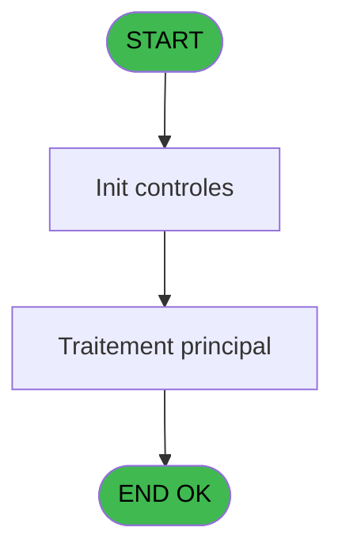
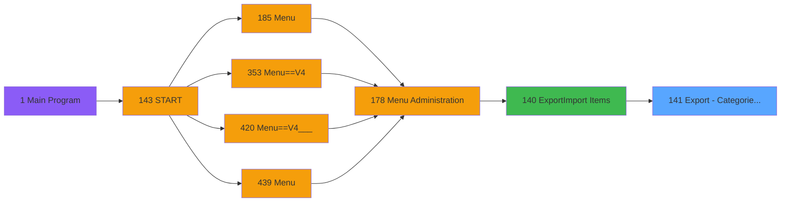

# PVE IDE 141 - Export - Categories_Rental

> **Analyse**: Phases 1-4 2026-02-03 09:41 -> 09:41 (18s) | Assemblage 09:41
> **Pipeline**: V7.2 Enrichi
> **Structure**: 4 onglets (Resume | Ecrans | Donnees | Connexions)

<!-- TAB:Resume -->

## 1. FICHE D'IDENTITE

| Attribut | Valeur |
|----------|--------|
| Projet | PVE |
| IDE Position | 141 |
| Nom Programme | Export - Categories_Rental |
| Fichier source | `Prg_141.xml` |
| Domaine metier | General |
| Taches | 1 (0 ecrans visibles) |
| Tables modifiees | 0 |
| Programmes appeles | 0 |

## 2. DESCRIPTION FONCTIONNELLE

**Export - Categories_Rental** assure la gestion complete de ce processus, accessible depuis [Export/Import Items (IDE 140)](PVE-IDE-140.md).

Le flux de traitement s'organise en **1 blocs fonctionnels** :

- **Traitement** (1 tache) : traitements metier divers

## 3. BLOCS FONCTIONNELS

### 3.1 Traitement (1 tache)

Traitements internes.

---

#### 141 - Export - Categories_Rental

**Role** : Traitement : Export - Categories_Rental.

## 5. REGLES METIER

*(Aucune regle metier identifiee)*

## 6. CONTEXTE

- **Appele par**: [Export/Import Items (IDE 140)](PVE-IDE-140.md)
- **Appelle**: 0 programmes | **Tables**: 7 (W:0 R:1 L:6) | **Taches**: 1 | **Expressions**: 13

<!-- TAB:Ecrans -->

## 8. ECRANS

*(Programme sans ecran visible)*

## 9. NAVIGATION

### 9.3 Structure hierarchique (1 tache)

| Position | Tache | Type | Dimensions | Bloc |
|----------|-------|------|------------|------|
| **141.1** | [**Export - Categories_Rental** (141)](#t1) | MDI | - | Traitement |

### 9.4 Algorigramme

> **Legende**: Vert = START/END OK | Rouge = END KO | Bleu = Decisions
> *Algorigramme auto-genere. Utiliser `/algorigramme` pour une synthese metier detaillee.*

<!-- TAB:Donnees -->

## 10. TABLES

### Tables utilisees (7)

| ID | Nom | Description | Type | R | W | L | Usages |
|----|-----|-------------|------|---|---|---|--------|
| 65 | comptes_recette__cre | Comptes GM (generaux) | DB | R |   |   | 1 |
| 77 | articles_________art | Articles et stock | DB |   |   | L | 1 |
| 379 | pv_customer_temp |  | DB |   |   | L | 1 |
| 380 | pv_day_modes |  | DB |   |   | L | 1 |
| 401 | pv_cust_rentals_histo | Historique / journal | DB |   |   | L | 1 |
| 413 | pv_tva |  | DB |   |   | L | 1 |
| 419 | realise_articles_caution | Articles et stock | DB |   |   | L | 1 |

### Colonnes par table (1 / 1 tables avec colonnes identifiees)

Table 65 - comptes_recette__cre (R) - 1 usages

| Lettre | Variable | Acces | Type |
|--------|----------|-------|------|
| A | P. Nom Fichier CSV | R | Alpha |
| B | S OU R | R | Unicode |
| C | V.Entete | R | Unicode |
| D | V.Details | R | Unicode |

## 11. VARIABLES

### 11.1 Parametres entrants (1)

Variables recues du programme appelant ([Export/Import Items (IDE 140)](PVE-IDE-140.md)).

| Lettre | Nom | Type | Usage dans |
|--------|-----|------|-----------|
| A | P. Nom Fichier CSV | Alpha | 1x parametre entrant |

### 11.2 Variables de session (2)

Variables persistantes pendant toute la session.

| Lettre | Nom | Type | Usage dans |
|--------|-----|------|-----------|
| C | V.Entete | Unicode | 1x session |
| D | V.Details | Unicode | 1x session |

### 11.3 Autres (1)

Variables diverses.

| Lettre | Nom | Type | Usage dans |
|--------|-----|------|-----------|
| B | S OU R | Unicode | 1x refs |

## 12. EXPRESSIONS

**13 / 13 expressions decodees (100%)**

### 12.1 Repartition par type

| Type | Expressions | Regles |
|------|-------------|--------|
| OTHER | 10 | 0 |
| CONCATENATION | 1 | 0 |
| FORMAT | 1 | 0 |
| STRING | 1 | 0 |

### 12.2 Expressions cles par type

#### OTHER (10 expressions)

| Type | IDE | Expression | Regle |
|------|-----|------------|-------|
| OTHER | 7 | `[K]` | - |
| OTHER | 6 | `GetParam ('SERVICE')` | - |
| OTHER | 8 | `[E]` | - |
| OTHER | 10 | `[AB]` | - |
| OTHER | 9 | `[L]` | - |
| ... | | *+5 autres* | |

#### CONCATENATION (1 expressions)

| Type | IDE | Expression | Regle |
|------|-----|------------|-------|
| CONCATENATION | 11 | `'Catcode;CatLib;SCatCode;SCatLib;NumArticle;Libelle Imputation;Imputaion;Sous Imputation;Libelle Article;S ou R;Classification;Libelle classification;Age pour gratuité;Contient l''alcool;M&E uniquement;M&E discount percentage;Type matos id;Auto Rental Generate;Libelle Matos'` | - |

#### FORMAT (1 expressions)

| Type | IDE | Expression | Regle |
|------|-----|------------|-------|
| FORMAT | 12 | `Trim(Str([H],'2P0')) & ';' & Trim([S]) & ';' & Trim(Str([I],'2P0')) & ';' & Trim([J]) & ';' & Trim(Str([L],'6P0')) & ';' & Trim([AH]) & ';' & Trim(Str([AB],'10')) & ';' & Trim(Str([AC],'3P0Z0')) & ';' & Trim([AD]) & ';' & Trim([AI]) & ';' & Trim(Str([U],'10')) & ';' & Trim([V]) & ';' & Trim(Str([O],'3')) & ';' & IF([P],'Y','N') & ';' & IF([AM],'Y','N') & ';'& Str([AN],'3.2P0Z') & ';' & Trim(Str([X],'2P0')) & ';' & IF([G],'Y','N') & ';' & Trim([Y])` | - |

#### STRING (1 expressions)

| Type | IDE | Expression | Regle |
|------|-----|------------|-------|
| STRING | 13 | `Trim([M])` | - |

<!-- TAB:Connexions -->

## 13. GRAPHE D'APPELS

### 13.1 Chaine depuis Main (Callers)

Main -> ... -> [Export/Import Items (IDE 140)](PVE-IDE-140.md) -> **Export - Categories_Rental (IDE 141)**

### 13.2 Callers

| IDE | Nom Programme | Nb Appels |
|-----|---------------|-----------|
| [140](PVE-IDE-140.md) | Export/Import Items | 1 |

### 13.3 Callees (programmes appeles)

### 13.4 Detail Callees avec contexte

| IDE | Nom Programme | Appels | Contexte |
|-----|---------------|--------|----------|
| - | (aucun) | - | - |

## 14. RECOMMANDATIONS MIGRATION

### 14.1 Profil du programme

| Metrique | Valeur | Impact migration |
|----------|--------|-----------------|
| Lignes de logique | 68 | Programme compact |
| Expressions | 13 | Peu de logique |
| Tables WRITE | 0 | Impact faible |
| Sous-programmes | 0 | Peu de dependances |
| Ecrans visibles | 0 | Ecran unique ou traitement batch |
| Code desactive | 2.9% (2 / 68) | Code sain |
| Regles metier | 0 | Pas de regle identifiee |

### 14.2 Plan de migration par bloc

#### Traitement (1 tache: 0 ecran, 1 traitement)

- **Strategie** : 1 service(s) backend injectable(s) (Domain Services).
- Decomposer les taches en services unitaires testables.

### 14.3 Dependances critiques

| Dependance | Type | Appels | Impact |
|------------|------|--------|--------|

---
*Spec DETAILED generee par Pipeline V7.2 - 2026-02-03 09:41*
