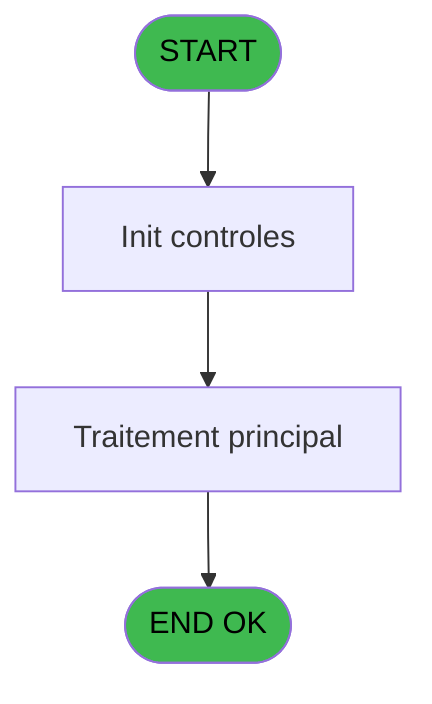
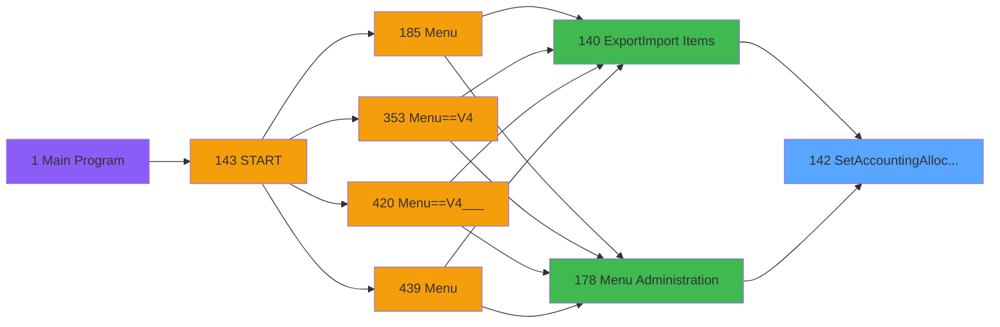
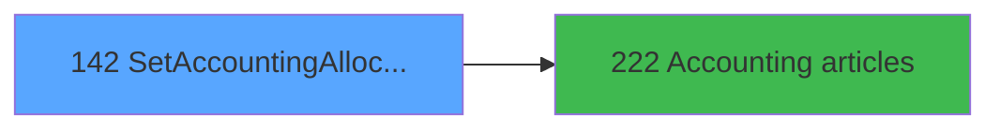

# PVE IDE 142 - SetAccountingAllocations

> **Analyse**: Phases 1-4 2026-02-03 09:41 -> 09:41 (17s) | Assemblage 09:41
> **Pipeline**: V7.2 Enrichi
> **Structure**: 4 onglets (Resume | Ecrans | Donnees | Connexions)

<!-- TAB:Resume -->

## 1. FICHE D'IDENTITE

| Attribut | Valeur |
|----------|--------|
| Projet | PVE |
| IDE Position | 142 |
| Nom Programme | SetAccountingAllocations |
| Fichier source | `Prg_142.xml` |
| Domaine metier | General |
| Taches | 1 (1 ecrans visibles) |
| Tables modifiees | 0 |
| Programmes appeles | 1 |

## 2. DESCRIPTION FONCTIONNELLE

**SetAccountingAllocations** assure la gestion complete de ce processus, accessible depuis [Export/Import Items (IDE 140)](PVE-IDE-140.md), [Menu Administration (IDE 178)](PVE-IDE-178.md).

Le flux de traitement s'organise en **1 blocs fonctionnels** :

- **Traitement** (1 tache) : traitements metier divers

**Logique metier** : 2 regles identifiees couvrant conditions metier.

## 3. BLOCS FONCTIONNELS

### 3.1 Traitement (1 tache)

Traitements internes.

---

#### 142 - SetAccountingAllocations [[ECRAN]](#ecran-t1)

**Role** : Traitement : SetAccountingAllocations.
**Ecran** : 802 x 384 DLU (Type6) | [Voir mockup](#ecran-t1)
**Delegue a** : [   Accounting articles (IDE 222)](PVE-IDE-222.md)

## 5. REGLES METIER

2 regles identifiees:

### Autres (2 regles)

#### [RM-001] Si Stat (0 alors 'M'MODE) sinon 'to &Search mode','to &Modify mode')

| Element | Detail |
|---------|--------|
| **Condition** | `Stat (0` |
| **Si vrai** | 'M'MODE) |
| **Si faux** | 'to &Search mode','to &Modify mode') |
| **Expression source** | Expression 7 : `IF (Stat (0,'M'MODE),'to &Search mode','to &Modify mode')` |
| **Exemple** | Si Stat (0 → 'M'MODE). Sinon → 'to &Search mode','to &Modify mode') |

#### [RM-002] Traitement conditionnel si [X],[N] est a zero

| Element | Detail |
|---------|--------|
| **Condition** | `[X]` |
| **Si vrai** | [N]=0 |
| **Si faux** | 'TRUE'LOG) AND [H] = 0 |
| **Expression source** | Expression 11 : `IF([X],[N]=0,'TRUE'LOG) AND [H] = 0` |
| **Exemple** | Si [X] → [N]=0. Sinon → 'TRUE'LOG) AND [H] = 0 |

## 6. CONTEXTE

- **Appele par**: [Export/Import Items (IDE 140)](PVE-IDE-140.md), [Menu Administration (IDE 178)](PVE-IDE-178.md)
- **Appelle**: 1 programmes | **Tables**: 4 (W:0 R:1 L:3) | **Taches**: 1 | **Expressions**: 11

<!-- TAB:Ecrans -->

## 8. ECRANS

### 8.1 Forms visibles (1 / 1)

| # | Position | Tache | Nom | Type | Largeur | Hauteur | Bloc |
|---|----------|-------|-----|------|---------|---------|------|
| 1 | 142 | 142 | SetAccountingAllocations | Type6 | 802 | 384 | Traitement |

### 8.2 Mockups Ecrans

---

#### 142 - SetAccountingAllocations
**Tache** : [142](#t1) | **Type** : Type6 | **Dimensions** : 802 x 384 DLU
**Bloc** : Traitement | **Titre IDE** : SetAccountingAllocations

<!-- FORM-DATA:
{
    "width":  802,
    "vFactor":  8,
    "type":  "Type6",
    "hFactor":  4,
    "controls":  [
                     {
                         "x":  130,
                         "type":  "label",
                         "var":  "",
                         "y":  53,
                         "w":  46,
                         "fmt":  "",
                         "name":  "",
                         "h":  11,
                         "color":  "183",
                         "text":  "Category",
                         "parent":  null
                     },
                     {
                         "x":  1,
                         "type":  "label",
                         "var":  "",
                         "y":  2,
                         "w":  800,
                         "fmt":  "",
                         "name":  "",
                         "h":  42,
                         "color":  "182",
                         "text":  "",
                         "parent":  null
                     },
                     {
                         "x":  81,
                         "type":  "label",
                         "var":  "",
                         "y":  15,
                         "w":  524,
                         "fmt":  "",
                         "name":  "",
                         "h":  14,
                         "color":  "186",
                         "text":  "Accountings allocations",
                         "parent":  2
                     },
                     {
                         "x":  1,
                         "type":  "table",
                         "var":  "",
                         "name":  "",
                         "titleH":  16,
                         "color":  "110",
                         "w":  767,
                         "y":  91,
                         "fmt":  "",
                         "parent":  null,
                         "text":  "",
                         "rowH":  20,
                         "h":  261,
                         "cols":  [
                                      {
                                          "title":  "Category",
                                          "layer":  1,
                                          "w":  122
                                      },
                                      {
                                          "title":  "Sub category",
                                          "layer":  2,
                                          "w":  122
                                      },
                                      {
                                          "title":  "Article code",
                                          "layer":  3,
                                          "w":  87
                                      },
                                      {
                                          "title":  "Article Label",
                                          "layer":  4,
                                          "w":  112
                                      },
                                      {
                                          "title":  "Imputation",
                                          "layer":  5,
                                          "w":  58
                                      },
                                      {
                                          "title":  "Sub imputation",
                                          "layer":  6,
                                          "w":  78
                                      },
                                      {
                                          "title":  "Imputation label",
                                          "layer":  7,
                                          "w":  183
                                      }
                                  ],
                         "rows":  7
                     },
                     {
                         "x":  1,
                         "type":  "label",
                         "var":  "",
                         "y":  353,
                         "w":  800,
                         "fmt":  "",
                         "name":  "",
                         "h":  29,
                         "color":  "182",
                         "text":  "",
                         "parent":  null
                     },
                     {
                         "x":  5,
                         "type":  "edit",
                         "var":  "",
                         "y":  110,
                         "w":  116,
                         "fmt":  "",
                         "name":  "CatLabel",
                         "h":  14,
                         "color":  "110",
                         "text":  "",
                         "parent":  7
                     },
                     {
                         "x":  127,
                         "type":  "edit",
                         "var":  "",
                         "y":  110,
                         "w":  115,
                         "fmt":  "",
                         "name":  "SCat",
                         "h":  14,
                         "color":  "110",
                         "text":  "",
                         "parent":  7
                     },
                     {
                         "x":  249,
                         "type":  "edit",
                         "var":  "",
                         "y":  110,
                         "w":  77,
                         "fmt":  "6P0Z",
                         "name":  "id_aricle__imputation",
                         "h":  14,
                         "color":  "110",
                         "text":  "",
                         "parent":  7
                     },
                     {
                         "x":  336,
                         "type":  "edit",
                         "var":  "",
                         "y":  110,
                         "w":  106,
                         "fmt":  "",
                         "name":  "art_libelle_article",
                         "h":  14,
                         "color":  "110",
                         "text":  "",
                         "parent":  7
                     },
                     {
                         "x":  448,
                         "type":  "edit",
                         "var":  "",
                         "y":  110,
                         "w":  51,
                         "fmt":  "10Z",
                         "name":  "art_imputation",
                         "h":  14,
                         "color":  "110",
                         "text":  "",
                         "parent":  7
                     },
                     {
                         "x":  506,
                         "type":  "edit",
                         "var":  "",
                         "y":  110,
                         "w":  72,
                         "fmt":  "3P0Z",
                         "name":  "art_sous_imputation",
                         "h":  14,
                         "color":  "110",
                         "text":  "",
                         "parent":  7
                     },
                     {
                         "x":  584,
                         "type":  "edit",
                         "var":  "",
                         "y":  110,
                         "w":  175,
                         "fmt":  "",
                         "name":  "cre_libelle",
                         "h":  14,
                         "color":  "110",
                         "text":  "",
                         "parent":  7
                     },
                     {
                         "x":  5,
                         "type":  "checkbox",
                         "var":  "",
                         "y":  52,
                         "w":  81,
                         "fmt":  "",
                         "name":  "V.EmptyImputation",
                         "h":  12,
                         "color":  "181",
                         "text":  "Empty Imputation",
                         "parent":  null
                     },
                     {
                         "x":  186,
                         "type":  "combobox",
                         "var":  "",
                         "y":  52,
                         "w":  104,
                         "fmt":  "",
                         "name":  "V.FiltreCategory",
                         "h":  12,
                         "color":  "",
                         "text":  "\\ 0",
                         "parent":  null
                     },
                     {
                         "x":  5,
                         "type":  "checkbox",
                         "var":  "",
                         "y":  70,
                         "w":  83,
                         "fmt":  "",
                         "name":  "V.WrongImputation",
                         "h":  12,
                         "color":  "183",
                         "text":  "Wrong Imputation",
                         "parent":  null
                     },
                     {
                         "x":  767,
                         "type":  "button",
                         "var":  "",
                         "y":  91,
                         "w":  32,
                         "fmt":  "ñ",
                         "name":  "",
                         "h":  133,
                         "color":  "",
                         "text":  "",
                         "parent":  null
                     },
                     {
                         "x":  767,
                         "type":  "button",
                         "var":  "",
                         "y":  222,
                         "w":  32,
                         "fmt":  "ò",
                         "name":  "",
                         "h":  131,
                         "color":  "",
                         "text":  "",
                         "parent":  null
                     },
                     {
                         "x":  1,
                         "type":  "button",
                         "var":  "",
                         "y":  357,
                         "w":  99,
                         "fmt":  "\u0026Mode",
                         "name":  "MODE",
                         "h":  24,
                         "color":  "",
                         "text":  "",
                         "parent":  24
                     },
                     {
                         "x":  700,
                         "type":  "button",
                         "var":  "",
                         "y":  357,
                         "w":  99,
                         "fmt":  "\u0026Exit",
                         "name":  "",
                         "h":  24,
                         "color":  "",
                         "text":  "",
                         "parent":  24
                     }
                 ],
    "taskId":  "142",
    "height":  384
}
-->

<strong>Champs : 10 champs</strong>

| Pos (x,y) | Nom | Variable | Type |
|-----------|-----|----------|------|
| 5,110 | CatLabel | - | edit |
| 127,110 | SCat | - | edit |
| 249,110 | id_aricle__imputation | - | edit |
| 336,110 | art_libelle_article | - | edit |
| 448,110 | art_imputation | - | edit |
| 506,110 | art_sous_imputation | - | edit |
| 584,110 | cre_libelle | - | edit |
| 5,52 | V.EmptyImputation | - | checkbox |
| 186,52 | V.FiltreCategory | - | combobox |
| 5,70 | V.WrongImputation | - | checkbox |

<strong>Boutons : 4 boutons</strong>

| Bouton | Pos (x,y) | Action |
|--------|-----------|--------|
| ñ | 767,91 | Bouton fonctionnel |
| ò | 767,222 | Bouton fonctionnel |
| Mode | 1,357 | Bouton fonctionnel |
| Exit | 700,357 | Quitte le programme |

## 9. NAVIGATION

Ecran unique: **SetAccountingAllocations**

### 9.3 Structure hierarchique (1 tache)

| Position | Tache | Type | Dimensions | Bloc |
|----------|-------|------|------------|------|
| **142.1** | [**SetAccountingAllocations** (142)](#t1) [mockup](#ecran-t1) | Type6 | 802x384 | Traitement |

### 9.4 Algorigramme

> **Legende**: Vert = START/END OK | Rouge = END KO | Bleu = Decisions
> *Algorigramme auto-genere. Utiliser `/algorigramme` pour une synthese metier detaillee.*

<!-- TAB:Donnees -->

## 10. TABLES

### Tables utilisees (4)

| ID | Nom | Description | Type | R | W | L | Usages |
|----|-----|-------------|------|---|---|---|--------|
| 65 | comptes_recette__cre | Comptes GM (generaux) | DB | R |   |   | 1 |
| 77 | articles_________art | Articles et stock | DB |   |   | L | 1 |
| 379 | pv_customer_temp |  | DB |   |   | L | 1 |
| 413 | pv_tva |  | DB |   |   | L | 1 |

### Colonnes par table (1 / 1 tables avec colonnes identifiees)

Table 65 - comptes_recette__cre (R) - 1 usages

| Lettre | Variable | Acces | Type |
|--------|----------|-------|------|
| A | ExistArticle | R | Logical |
| B | V.FiltreCategory | R | Numeric |
| C | V.EmptyImputation | R | Logical |
| D | V.WrongImputation | R | Logical |
| E | BtnChangeMode | R | Alpha |

## 11. VARIABLES

### 11.1 Variables de session (3)

Variables persistantes pendant toute la session.

| Lettre | Nom | Type | Usage dans |
|--------|-----|------|-----------|
| B | V.FiltreCategory | Numeric | - |
| C | V.EmptyImputation | Logical | - |
| D | V.WrongImputation | Logical | - |

### 11.2 Autres (2)

Variables diverses.

| Lettre | Nom | Type | Usage dans |
|--------|-----|------|-----------|
| A | ExistArticle | Logical | 1x refs |
| E | BtnChangeMode | Alpha | 1x refs |

## 12. EXPRESSIONS

**11 / 11 expressions decodees (100%)**

### 12.1 Repartition par type

| Type | Expressions | Regles |
|------|-------------|--------|
| CONCATENATION | 1 | 5 |
| CAST_LOGIQUE | 1 | 5 |
| CONDITION | 1 | 0 |
| OTHER | 8 | 0 |

### 12.2 Expressions cles par type

#### CONCATENATION (1 expressions)

| Type | IDE | Expression | Regle |
|------|-----|------------|-------|
| CONCATENATION | 7 | `IF (Stat (0,'M'MODE),'to &Search mode','to &Modify mode')` | [RM-001](#rm-RM-001) |

#### CAST_LOGIQUE (1 expressions)

| Type | IDE | Expression | Regle |
|------|-----|------------|-------|
| CAST_LOGIQUE | 11 | `IF([X],[N]=0,'TRUE'LOG) AND [H] = 0` | [RM-002](#rm-RM-002) |

#### CONDITION (1 expressions)

| Type | IDE | Expression | Regle |
|------|-----|------------|-------|
| CONDITION | 1 | `CndRange([V] <> 0,[V])` | - |

#### OTHER (8 expressions)

| Type | IDE | Expression | Regle |
|------|-----|------------|-------|
| OTHER | 8 | `NOT(Stat (0,'M'MODE))` | - |
| OTHER | 6 | `[O]` | - |
| OTHER | 10 | `Stat (0,'M'MODE)` | - |
| OTHER | 9 | `CtrlGoto('id_aricle__imputation',CurRow(0),0)` | - |
| OTHER | 3 | `GetParam ('SERVICE')` | - |
| ... | | *+3 autres* | |

<!-- TAB:Connexions -->

## 13. GRAPHE D'APPELS

### 13.1 Chaine depuis Main (Callers)

Main -> ... -> [Export/Import Items (IDE 140)](PVE-IDE-140.md) -> **SetAccountingAllocations (IDE 142)**

Main -> ... -> [Menu Administration (IDE 178)](PVE-IDE-178.md) -> **SetAccountingAllocations (IDE 142)**

### 13.2 Callers

| IDE | Nom Programme | Nb Appels |
|-----|---------------|-----------|
| [140](PVE-IDE-140.md) | Export/Import Items | 1 |
| [178](PVE-IDE-178.md) | Menu Administration | 1 |

### 13.3 Callees (programmes appeles)

### 13.4 Detail Callees avec contexte

| IDE | Nom Programme | Appels | Contexte |
|-----|---------------|--------|----------|
| [222](PVE-IDE-222.md) |    Accounting articles | 1 | Sous-programme |

## 14. RECOMMANDATIONS MIGRATION

### 14.1 Profil du programme

| Metrique | Valeur | Impact migration |
|----------|--------|-----------------|
| Lignes de logique | 47 | Programme compact |
| Expressions | 11 | Peu de logique |
| Tables WRITE | 0 | Impact faible |
| Sous-programmes | 1 | Peu de dependances |
| Ecrans visibles | 1 | Ecran unique ou traitement batch |
| Code desactive | 0% (0 / 47) | Code sain |
| Regles metier | 2 | Quelques regles a preserver |

### 14.2 Plan de migration par bloc

#### Traitement (1 tache: 1 ecran, 0 traitement)

- **Strategie** : 1 composant(s) UI (Razor/React) avec formulaires et validation.
- 1 sous-programme(s) a migrer ou a reutiliser depuis les services existants.
- Decomposer les taches en services unitaires testables.

### 14.3 Dependances critiques

| Dependance | Type | Appels | Impact |
|------------|------|--------|--------|
| [   Accounting articles (IDE 222)](PVE-IDE-222.md) | Sous-programme | 1x | Normale - Sous-programme |

---
*Spec DETAILED generee par Pipeline V7.2 - 2026-02-03 09:41*
