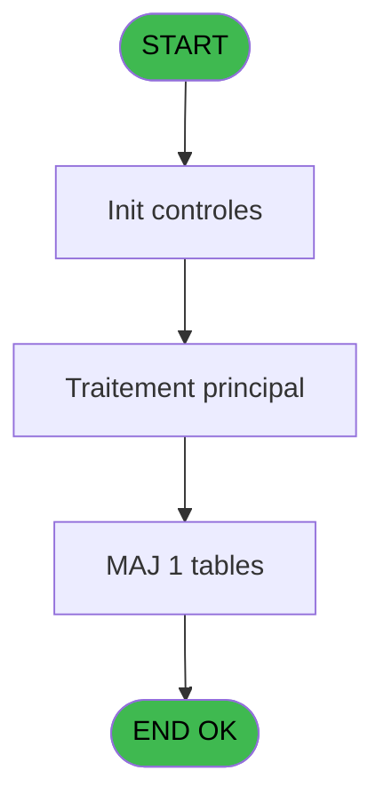
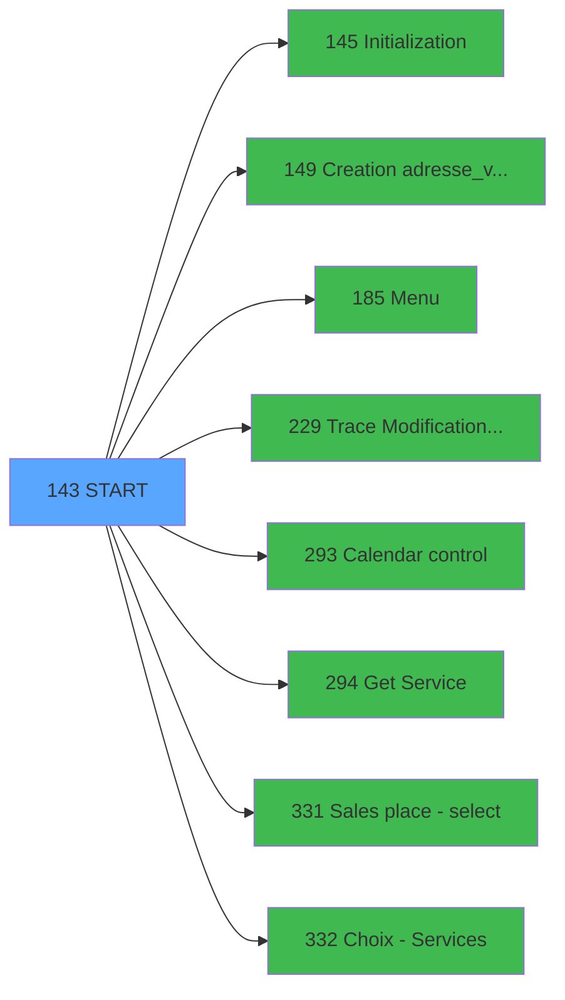

# PVE IDE 143 - START

> **Analyse**: Phases 1-4 2026-02-03 09:42 -> 09:42 (17s) | Assemblage 09:42
> **Pipeline**: V7.2 Enrichi
> **Structure**: 4 onglets (Resume | Ecrans | Donnees | Connexions)

<!-- TAB:Resume -->

## 1. FICHE D'IDENTITE

| Attribut | Valeur |
|----------|--------|
| Projet | PVE |
| IDE Position | 143 |
| Nom Programme | START |
| Fichier source | `Prg_143.xml` |
| Domaine metier | General |
| Taches | 4 (0 ecrans visibles) |
| Tables modifiees | 1 |
| Programmes appeles | 8 |

## 2. DESCRIPTION FONCTIONNELLE

**START** assure la gestion complete de ce processus, accessible depuis [Main Program (IDE 1)](PVE-IDE-1.md).

Le flux de traitement s'organise en **1 blocs fonctionnels** :

- **Traitement** (4 taches) : traitements metier divers

**Donnees modifiees** : 1 tables en ecriture (pv_sellers).

Detail : phases du traitement

#### Phase 1 : Traitement (4 taches)

- **143** - START
- **143.1** - Update Insurance
- **143.2** - Exist place
- **143.3** - Existe vendeur

Delegue a : [Menu (IDE 185)](PVE-IDE-185.md), [Trace Modification package (IDE 229)](PVE-IDE-229.md), [Calendar control (IDE 293)](PVE-IDE-293.md), [Get Service (IDE 294)](PVE-IDE-294.md)

#### Tables impactees

| Table | Operations | Role metier |
|-------|-----------|-------------|
| pv_sellers | **W** (1 usages) |  |

## 3. BLOCS FONCTIONNELS

### 3.1 Traitement (4 taches)

Traitements internes.

---

#### 143 - START

**Role** : Traitement : START.

3 sous-taches directes

| Tache | Nom | Bloc |
|-------|-----|------|
| [143.1](#t2) | Update Insurance | Traitement |
| [143.2](#t3) | Exist place | Traitement |
| [143.3](#t4) | Existe vendeur | Traitement |

**Delegue a** : [Menu (IDE 185)](PVE-IDE-185.md), [Trace Modification package (IDE 229)](PVE-IDE-229.md), [Calendar control (IDE 293)](PVE-IDE-293.md)

---

#### 143.1 - Update Insurance

**Role** : Traitement : Update Insurance.
**Delegue a** : [Menu (IDE 185)](PVE-IDE-185.md), [Trace Modification package (IDE 229)](PVE-IDE-229.md), [Calendar control (IDE 293)](PVE-IDE-293.md)

---

#### 143.2 - Exist place

**Role** : Traitement : Exist place.
**Delegue a** : [Menu (IDE 185)](PVE-IDE-185.md), [Trace Modification package (IDE 229)](PVE-IDE-229.md), [Calendar control (IDE 293)](PVE-IDE-293.md)

---

#### 143.3 - Existe vendeur

**Role** : Traitement : Existe vendeur.
**Delegue a** : [Menu (IDE 185)](PVE-IDE-185.md), [Trace Modification package (IDE 229)](PVE-IDE-229.md), [Calendar control (IDE 293)](PVE-IDE-293.md)

## 5. REGLES METIER

*(Aucune regle metier identifiee)*

## 6. CONTEXTE

- **Appele par**: [Main Program (IDE 1)](PVE-IDE-1.md)
- **Appelle**: 8 programmes | **Tables**: 4 (W:1 R:2 L:1) | **Taches**: 4 | **Expressions**: 14

<!-- TAB:Ecrans -->

## 8. ECRANS

*(Programme sans ecran visible)*

## 9. NAVIGATION

### 9.3 Structure hierarchique (4 taches)

| Position | Tache | Type | Dimensions | Bloc |
|----------|-------|------|------------|------|
| **143.1** | [**START** (143)](#t1) | MDI | - | Traitement |
| 143.1.1 | [Update Insurance (143.1)](#t2) | MDI | - | |
| 143.1.2 | [Exist place (143.2)](#t3) | - | - | |
| 143.1.3 | [Existe vendeur (143.3)](#t4) | - | - | |

### 9.4 Algorigramme

> **Legende**: Vert = START/END OK | Rouge = END KO | Bleu = Decisions
> *Algorigramme auto-genere. Utiliser `/algorigramme` pour une synthese metier detaillee.*

<!-- TAB:Donnees -->

## 10. TABLES

### Tables utilisees (4)

| ID | Nom | Description | Type | R | W | L | Usages |
|----|-----|-------------|------|---|---|---|--------|
| 403 | pv_sellers |  | DB |   | **W** |   | 1 |
| 765 | tranche_age |  | DB | R |   |   | 1 |
| 766 | temp_forfait_ski |  | DB | R |   |   | 1 |
| 767 | code_reduction |  | DB |   |   | L | 2 |

### Colonnes par table (0 / 3 tables avec colonnes identifiees)

Table 403 - pv_sellers (**W**) - 1 usages

*Table utilisee uniquement en Link ou aucune colonne Real identifiee dans le DataView.*

Table 765 - tranche_age (R) - 1 usages

*Table utilisee uniquement en Link ou aucune colonne Real identifiee dans le DataView.*

Table 766 - temp_forfait_ski (R) - 1 usages

*Table utilisee uniquement en Link ou aucune colonne Real identifiee dans le DataView.*

## 11. VARIABLES

### 11.1 Variables de session (4)

Variables persistantes pendant toute la session.

| Lettre | Nom | Type | Usage dans |
|--------|-----|------|-----------|
| A | V Connexion | Logical | 3x session |
| B | V Anomalie Terminal/Service | Logical | - |
| C | V.Saisi lieu vente | Logical | 1x session |
| D | V.ExitSystem | Logical | 1x session |

## 12. EXPRESSIONS

**14 / 14 expressions decodees (100%)**

### 12.1 Repartition par type

| Type | Expressions | Regles |
|------|-------------|--------|
| CONSTANTE | 3 | 0 |
| CAST_LOGIQUE | 2 | 0 |
| OTHER | 7 | 0 |
| REFERENCE_VG | 1 | 0 |
| FORMAT | 1 | 0 |

### 12.2 Expressions cles par type

#### CONSTANTE (3 expressions)

| Type | IDE | Expression | Regle |
|------|-----|------------|-------|
| CONSTANTE | 9 | `'C'` | - |
| CONSTANTE | 6 | `'PV'` | - |
| CONSTANTE | 1 | `'PV'` | - |

#### CAST_LOGIQUE (2 expressions)

| Type | IDE | Expression | Regle |
|------|-----|------------|-------|
| CAST_LOGIQUE | 13 | `'TRUE'LOG` | - |
| CAST_LOGIQUE | 2 | `INIPut ('[MAGIC_ENV]CenterScreenInOnline=Y','FALSE'LOG)` | - |

#### OTHER (7 expressions)

| Type | IDE | Expression | Regle |
|------|-----|------------|-------|
| OTHER | 8 | `GetParam ('SERVICE')` | - |
| OTHER | 11 | `V.ExitSystem [D]` | - |
| OTHER | 14 | `NOT(V Anomalie Terminal/Se... [B]) AND V Connexion [A] AND NOT(VG10)` | - |
| OTHER | 7 | `NOT(V Connexion [A])` | - |
| OTHER | 3 | `V Anomalie Terminal/Se... [B]` | - |
| ... | | *+2 autres* | |

#### REFERENCE_VG (1 expressions)

| Type | IDE | Expression | Regle |
|------|-----|------------|-------|
| REFERENCE_VG | 10 | `VG10` | - |

#### FORMAT (1 expressions)

| Type | IDE | Expression | Regle |
|------|-----|------------|-------|
| FORMAT | 12 | `StrBuild('Terminal @1@ and @2@ Service don''t match. Point of sale will close.', Str(VG105,'3') , VG101)` | - |

<!-- TAB:Connexions -->

## 13. GRAPHE D'APPELS

### 13.1 Chaine depuis Main (Callers)

Main -> ... -> [Main Program (IDE 1)](PVE-IDE-1.md) -> **START (IDE 143)**

### 13.2 Callers

| IDE | Nom Programme | Nb Appels |
|-----|---------------|-----------|
| [1](PVE-IDE-1.md) | Main Program | 1 |

### 13.3 Callees (programmes appeles)

### 13.4 Detail Callees avec contexte

| IDE | Nom Programme | Appels | Contexte |
|-----|---------------|--------|----------|
| [145](PVE-IDE-145.md) | Initialization | 1 | Reinitialisation |
| [149](PVE-IDE-149.md) | Creation adresse_village | 1 | Sous-programme |
| [185](PVE-IDE-185.md) | Menu | 1 | Navigation menu |
| [229](PVE-IDE-229.md) | Trace Modification package | 1 | Sous-programme |
| [293](PVE-IDE-293.md) | Calendar control | 1 | Sous-programme |
| [294](PVE-IDE-294.md) | Get Service | 1 | Recuperation donnees |
| [331](PVE-IDE-331.md) | Sales place - select | 1 | Selection/consultation |
| [332](PVE-IDE-332.md) | Choix - Services | 1 | Selection/consultation |

## 14. RECOMMANDATIONS MIGRATION

### 14.1 Profil du programme

| Metrique | Valeur | Impact migration |
|----------|--------|-----------------|
| Lignes de logique | 91 | Programme compact |
| Expressions | 14 | Peu de logique |
| Tables WRITE | 1 | Impact faible |
| Sous-programmes | 8 | Dependances moderees |
| Ecrans visibles | 0 | Ecran unique ou traitement batch |
| Code desactive | 1.1% (1 / 91) | Code sain |
| Regles metier | 0 | Pas de regle identifiee |

### 14.2 Plan de migration par bloc

#### Traitement (4 taches: 0 ecran, 4 traitements)

- **Strategie** : 4 service(s) backend injectable(s) (Domain Services).
- 8 sous-programme(s) a migrer ou a reutiliser depuis les services existants.
- Decomposer les taches en services unitaires testables.

### 14.3 Dependances critiques

| Dependance | Type | Appels | Impact |
|------------|------|--------|--------|
| pv_sellers | Table WRITE (Database) | 1x | Schema + repository |
| [Get Service (IDE 294)](PVE-IDE-294.md) | Sous-programme | 1x | Normale - Recuperation donnees |
| [Calendar control (IDE 293)](PVE-IDE-293.md) | Sous-programme | 1x | Normale - Sous-programme |
| [Choix - Services (IDE 332)](PVE-IDE-332.md) | Sous-programme | 1x | Normale - Selection/consultation |
| [Sales place - select (IDE 331)](PVE-IDE-331.md) | Sous-programme | 1x | Normale - Selection/consultation |
| [Creation adresse_village (IDE 149)](PVE-IDE-149.md) | Sous-programme | 1x | Normale - Sous-programme |
| [Initialization (IDE 145)](PVE-IDE-145.md) | Sous-programme | 1x | Normale - Reinitialisation |
| [Trace Modification package (IDE 229)](PVE-IDE-229.md) | Sous-programme | 1x | Normale - Sous-programme |
| [Menu (IDE 185)](PVE-IDE-185.md) | Sous-programme | 1x | Normale - Navigation menu |

---
*Spec DETAILED generee par Pipeline V7.2 - 2026-02-03 09:42*
