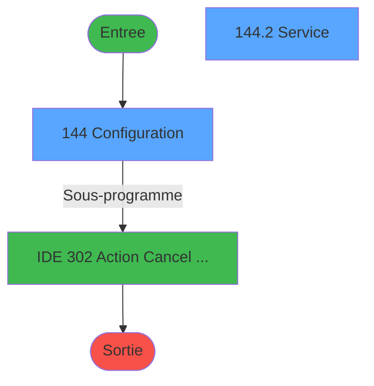
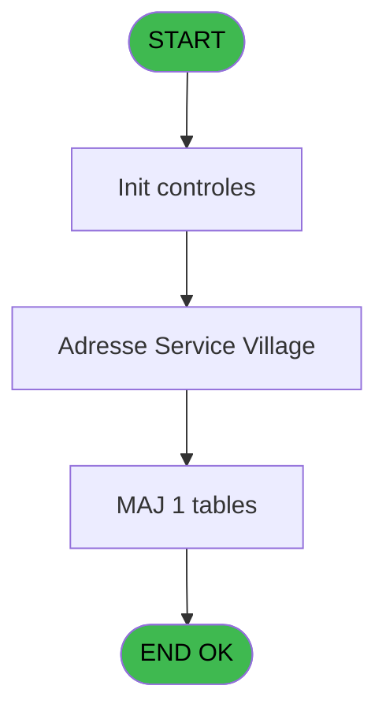
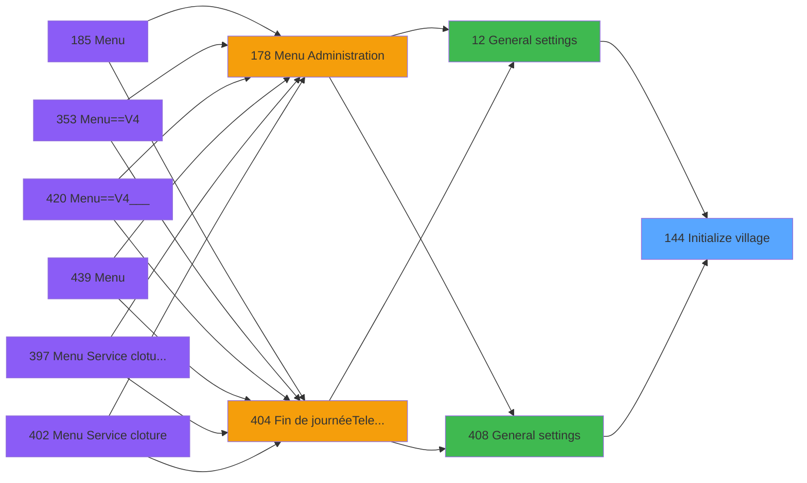
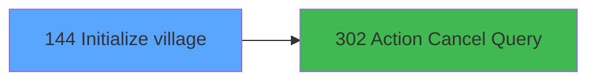

# PVE IDE 144 - Initialize village

> **Analyse**: Phases 1-4 2026-02-03 09:42 -> 09:42 (18s) | Assemblage 09:42
> **Pipeline**: V7.2 Enrichi
> **Structure**: 4 onglets (Resume | Ecrans | Donnees | Connexions)

<!-- TAB:Resume -->

## 1. FICHE D'IDENTITE

| Attribut | Valeur |
|----------|--------|
| Projet | PVE |
| IDE Position | 144 |
| Nom Programme | Initialize village |
| Fichier source | `Prg_144.xml` |
| Domaine metier | General |
| Taches | 3 (2 ecrans visibles) |
| Tables modifiees | 1 |
| Programmes appeles | 1 |

## 2. DESCRIPTION FONCTIONNELLE

**Initialize village** assure la gestion complete de ce processus, accessible depuis [General settings (IDE 12)](PVE-IDE-12.md), [General settings (IDE 408)](PVE-IDE-408.md).

Le flux de traitement s'organise en **1 blocs fonctionnels** :

- **Traitement** (3 taches) : traitements metier divers

**Donnees modifiees** : 1 tables en ecriture (pv_budget).

## 3. BLOCS FONCTIONNELS

### 3.1 Traitement (3 taches)

Traitements internes.

---

#### 144 - Configuration [[ECRAN]](#ecran-t1)

**Role** : Traitement : Configuration.
**Ecran** : 485 x 316 DLU (MDI) | [Voir mockup](#ecran-t1)
**Delegue a** : [Action Cancel Query (IDE 302)](PVE-IDE-302.md)

---

#### 144.1 - PARAMETERS

**Role** : Traitement : PARAMETERS.
**Delegue a** : [Action Cancel Query (IDE 302)](PVE-IDE-302.md)

---

#### 144.2 - Service [[ECRAN]](#ecran-t3)

**Role** : Traitement : Service.
**Ecran** : 476 x 272 DLU (MDI) | [Voir mockup](#ecran-t3)
**Variables liees** : A (P.Service), B (V adresse service village), C (CHG_REASON_v Service), D (CHG_PRV_v Service)
**Delegue a** : [Action Cancel Query (IDE 302)](PVE-IDE-302.md)

## 5. REGLES METIER

*(Aucune regle metier identifiee)*

## 6. CONTEXTE

- **Appele par**: [General settings (IDE 12)](PVE-IDE-12.md), [General settings (IDE 408)](PVE-IDE-408.md)
- **Appelle**: 1 programmes | **Tables**: 5 (W:1 R:2 L:3) | **Taches**: 3 | **Expressions**: 2

<!-- TAB:Ecrans -->

## 8. ECRANS

### 8.1 Forms visibles (2 / 3)

| # | Position | Tache | Nom | Type | Largeur | Hauteur | Bloc |
|---|----------|-------|-----|------|---------|---------|------|
| 1 | 144 | 144 | Configuration | MDI | 485 | 316 | Traitement |
| 2 | 144.2 | 144.2 | Service | MDI | 476 | 272 | Traitement |

### 8.2 Mockups Ecrans

---

#### 144 - Configuration
**Tache** : [144](#t1) | **Type** : MDI | **Dimensions** : 485 x 316 DLU
**Bloc** : Traitement | **Titre IDE** : Configuration

<!-- FORM-DATA:
{
    "width":  485,
    "vFactor":  8,
    "type":  "MDI",
    "hFactor":  4,
    "controls":  [
                     {
                         "x":  72,
                         "type":  "label",
                         "var":  "",
                         "y":  45,
                         "w":  110,
                         "fmt":  "",
                         "name":  "",
                         "h":  12,
                         "color":  "183",
                         "text":  "Village Identification",
                         "parent":  null
                     },
                     {
                         "x":  368,
                         "type":  "label",
                         "var":  "",
                         "y":  46,
                         "w":  100,
                         "fmt":  "",
                         "name":  "",
                         "h":  12,
                         "color":  "183",
                         "text":  "Invoice Header",
                         "parent":  null
                     },
                     {
                         "x":  14,
                         "type":  "label",
                         "var":  "",
                         "y":  63,
                         "w":  50,
                         "fmt":  "",
                         "name":  "",
                         "h":  12,
                         "color":  "184",
                         "text":  "Club Med",
                         "parent":  null
                     },
                     {
                         "x":  14,
                         "type":  "label",
                         "var":  "",
                         "y":  76,
                         "w":  50,
                         "fmt":  "",
                         "name":  "",
                         "h":  12,
                         "color":  "184",
                         "text":  "Village",
                         "parent":  null
                     },
                     {
                         "x":  14,
                         "type":  "label",
                         "var":  "",
                         "y":  89,
                         "w":  50,
                         "fmt":  "",
                         "name":  "",
                         "h":  12,
                         "color":  "184",
                         "text":  "Adress 1",
                         "parent":  null
                     },
                     {
                         "x":  14,
                         "type":  "label",
                         "var":  "",
                         "y":  102,
                         "w":  50,
                         "fmt":  "",
                         "name":  "",
                         "h":  12,
                         "color":  "184",
                         "text":  "Adress 2",
                         "parent":  null
                     },
                     {
                         "x":  14,
                         "type":  "label",
                         "var":  "",
                         "y":  115,
                         "w":  50,
                         "fmt":  "",
                         "name":  "",
                         "h":  12,
                         "color":  "184",
                         "text":  "Adress 3",
                         "parent":  null
                     },
                     {
                         "x":  14,
                         "type":  "label",
                         "var":  "",
                         "y":  128,
                         "w":  50,
                         "fmt":  "",
                         "name":  "",
                         "h":  12,
                         "color":  "184",
                         "text":  "Zip City",
                         "parent":  null
                     },
                     {
                         "x":  14,
                         "type":  "label",
                         "var":  "",
                         "y":  141,
                         "w":  50,
                         "fmt":  "",
                         "name":  "",
                         "h":  12,
                         "color":  "184",
                         "text":  "Phone",
                         "parent":  null
                     },
                     {
                         "x":  14,
                         "type":  "label",
                         "var":  "",
                         "y":  154,
                         "w":  50,
                         "fmt":  "",
                         "name":  "",
                         "h":  12,
                         "color":  "184",
                         "text":  "Fax",
                         "parent":  null
                     },
                     {
                         "x":  14,
                         "type":  "label",
                         "var":  "",
                         "y":  167,
                         "w":  50,
                         "fmt":  "",
                         "name":  "",
                         "h":  12,
                         "color":  "184",
                         "text":  "Siret",
                         "parent":  null
                     },
                     {
                         "x":  14,
                         "type":  "label",
                         "var":  "",
                         "y":  180,
                         "w":  50,
                         "fmt":  "",
                         "name":  "",
                         "h":  12,
                         "color":  "184",
                         "text":  "Vat number",
                         "parent":  null
                     },
                     {
                         "x":  14,
                         "type":  "label",
                         "var":  "",
                         "y":  193,
                         "w":  50,
                         "fmt":  "",
                         "name":  "",
                         "h":  12,
                         "color":  "184",
                         "text":  "Email",
                         "parent":  null
                     },
                     {
                         "x":  0,
                         "type":  "line",
                         "var":  "",
                         "y":  209,
                         "w":  484,
                         "fmt":  "",
                         "name":  "",
                         "h":  0,
                         "color":  "63",
                         "text":  "",
                         "parent":  null
                     },
                     {
                         "x":  290,
                         "type":  "label",
                         "var":  "",
                         "y":  213,
                         "w":  180,
                         "fmt":  "",
                         "name":  "",
                         "h":  12,
                         "color":  "183",
                         "text":  "Invoice parameters",
                         "parent":  null
                     },
                     {
                         "x":  14,
                         "type":  "label",
                         "var":  "",
                         "y":  227,
                         "w":  50,
                         "fmt":  "",
                         "name":  "",
                         "h":  12,
                         "color":  "183",
                         "text":  "Vat value",
                         "parent":  null
                     },
                     {
                         "x":  14,
                         "type":  "label",
                         "var":  "",
                         "y":  240,
                         "w":  50,
                         "fmt":  "",
                         "name":  "",
                         "h":  12,
                         "color":  "184",
                         "text":  "Currency",
                         "parent":  null
                     },
                     {
                         "x":  14,
                         "type":  "label",
                         "var":  "",
                         "y":  253,
                         "w":  50,
                         "fmt":  "",
                         "name":  "",
                         "h":  12,
                         "color":  "184",
                         "text":  "Décimal",
                         "parent":  null
                     },
                     {
                         "x":  14,
                         "type":  "label",
                         "var":  "",
                         "y":  266,
                         "w":  50,
                         "fmt":  "",
                         "name":  "",
                         "h":  12,
                         "color":  "183",
                         "text":  "Insurance",
                         "parent":  null
                     },
                     {
                         "x":  0,
                         "type":  "label",
                         "var":  "",
                         "y":  0,
                         "w":  484,
                         "fmt":  "",
                         "name":  "",
                         "h":  41,
                         "color":  "182",
                         "text":  "",
                         "parent":  null
                     },
                     {
                         "x":  14,
                         "type":  "label",
                         "var":  "",
                         "y":  15,
                         "w":  134,
                         "fmt":  "",
                         "name":  "",
                         "h":  10,
                         "color":  "186",
                         "text":  "Village Configuration",
                         "parent":  36
                     },
                     {
                         "x":  0,
                         "type":  "label",
                         "var":  "",
                         "y":  282,
                         "w":  484,
                         "fmt":  "",
                         "name":  "",
                         "h":  33,
                         "color":  "183",
                         "text":  "",
                         "parent":  null
                     },
                     {
                         "x":  156,
                         "type":  "edit",
                         "var":  "",
                         "y":  15,
                         "w":  23,
                         "fmt":  "",
                         "name":  "",
                         "h":  10,
                         "color":  "62",
                         "text":  "",
                         "parent":  39
                     },
                     {
                         "x":  70,
                         "type":  "edit",
                         "var":  "",
                         "y":  63,
                         "w":  400,
                         "fmt":  "",
                         "name":  "",
                         "h":  12,
                         "color":  "189",
                         "text":  "",
                         "parent":  null
                     },
                     {
                         "x":  70,
                         "type":  "edit",
                         "var":  "",
                         "y":  76,
                         "w":  400,
                         "fmt":  "",
                         "name":  "",
                         "h":  12,
                         "color":  "189",
                         "text":  "",
                         "parent":  null
                     },
                     {
                         "x":  70,
                         "type":  "edit",
                         "var":  "",
                         "y":  89,
                         "w":  400,
                         "fmt":  "",
                         "name":  "",
                         "h":  12,
                         "color":  "189",
                         "text":  "",
                         "parent":  null
                     },
                     {
                         "x":  70,
                         "type":  "edit",
                         "var":  "",
                         "y":  102,
                         "w":  400,
                         "fmt":  "",
                         "name":  "",
                         "h":  12,
                         "color":  "189",
                         "text":  "",
                         "parent":  null
                     },
                     {
                         "x":  70,
                         "type":  "edit",
                         "var":  "",
                         "y":  115,
                         "w":  400,
                         "fmt":  "",
                         "name":  "",
                         "h":  12,
                         "color":  "189",
                         "text":  "",
                         "parent":  null
                     },
                     {
                         "x":  70,
                         "type":  "edit",
                         "var":  "",
                         "y":  128,
                         "w":  400,
                         "fmt":  "",
                         "name":  "",
                         "h":  12,
                         "color":  "189",
                         "text":  "",
                         "parent":  null
                     },
                     {
                         "x":  70,
                         "type":  "edit",
                         "var":  "",
                         "y":  141,
                         "w":  400,
                         "fmt":  "",
                         "name":  "",
                         "h":  12,
                         "color":  "189",
                         "text":  "",
                         "parent":  null
                     },
                     {
                         "x":  70,
                         "type":  "edit",
                         "var":  "",
                         "y":  154,
                         "w":  400,
                         "fmt":  "",
                         "name":  "",
                         "h":  12,
                         "color":  "189",
                         "text":  "",
                         "parent":  null
                     },
                     {
                         "x":  70,
                         "type":  "edit",
                         "var":  "",
                         "y":  167,
                         "w":  400,
                         "fmt":  "",
                         "name":  "",
                         "h":  12,
                         "color":  "189",
                         "text":  "",
                         "parent":  null
                     },
                     {
                         "x":  70,
                         "type":  "edit",
                         "var":  "",
                         "y":  193,
                         "w":  400,
                         "fmt":  "",
                         "name":  "",
                         "h":  12,
                         "color":  "189",
                         "text":  "",
                         "parent":  null
                     },
                     {
                         "x":  70,
                         "type":  "edit",
                         "var":  "",
                         "y":  180,
                         "w":  400,
                         "fmt":  "",
                         "name":  "",
                         "h":  12,
                         "color":  "189",
                         "text":  "",
                         "parent":  null
                     },
                     {
                         "x":  70,
                         "type":  "edit",
                         "var":  "",
                         "y":  227,
                         "w":  400,
                         "fmt":  "2.2Z",
                         "name":  "",
                         "h":  12,
                         "color":  "189",
                         "text":  "",
                         "parent":  null
                     },
                     {
                         "x":  70,
                         "type":  "edit",
                         "var":  "",
                         "y":  266,
                         "w":  400,
                         "fmt":  "",
                         "name":  "",
                         "h":  12,
                         "color":  "189",
                         "text":  "",
                         "parent":  null
                     },
                     {
                         "x":  70,
                         "type":  "edit",
                         "var":  "",
                         "y":  240,
                         "w":  400,
                         "fmt":  "",
                         "name":  "",
                         "h":  12,
                         "color":  "189",
                         "text":  "",
                         "parent":  null
                     },
                     {
                         "x":  70,
                         "type":  "edit",
                         "var":  "",
                         "y":  253,
                         "w":  400,
                         "fmt":  "",
                         "name":  "",
                         "h":  12,
                         "color":  "189",
                         "text":  "",
                         "parent":  null
                     },
                     {
                         "x":  284,
                         "type":  "button",
                         "var":  "",
                         "y":  287,
                         "w":  101,
                         "fmt":  "Validate",
                         "name":  "",
                         "h":  28,
                         "color":  "",
                         "text":  "",
                         "parent":  null
                     },
                     {
                         "x":  384,
                         "type":  "button",
                         "var":  "",
                         "y":  287,
                         "w":  100,
                         "fmt":  "Exit",
                         "name":  "",
                         "h":  28,
                         "color":  "",
                         "text":  "",
                         "parent":  null
                     },
                     {
                         "x":  434,
                         "type":  "image",
                         "var":  "",
                         "y":  4,
                         "w":  48,
                         "fmt":  "",
                         "name":  "",
                         "h":  36,
                         "color":  "",
                         "text":  "",
                         "parent":  36
                     },
                     {
                         "x":  1,
                         "type":  "button",
                         "var":  "",
                         "y":  287,
                         "w":  100,
                         "fmt":  "Service / \\Address",
                         "name":  "V adresse service village",
                         "h":  28,
                         "color":  "",
                         "text":  "",
                         "parent":  null
                     }
                 ],
    "taskId":  "144",
    "height":  316
}
-->

<strong>Champs : 16 champs</strong>

| Pos (x,y) | Nom | Variable | Type |
|-----------|-----|----------|------|
| 156,15 | (sans nom) | - | edit |
| 70,63 | (sans nom) | - | edit |
| 70,76 | (sans nom) | - | edit |
| 70,89 | (sans nom) | - | edit |
| 70,102 | (sans nom) | - | edit |
| 70,115 | (sans nom) | - | edit |
| 70,128 | (sans nom) | - | edit |
| 70,141 | (sans nom) | - | edit |
| 70,154 | (sans nom) | - | edit |
| 70,167 | (sans nom) | - | edit |
| 70,193 | (sans nom) | - | edit |
| 70,180 | (sans nom) | - | edit |
| 70,227 | 2.2Z | - | edit |
| 70,266 | (sans nom) | - | edit |
| 70,240 | (sans nom) | - | edit |
| 70,253 | (sans nom) | - | edit |

<strong>Boutons : 3 boutons</strong>

| Bouton | Pos (x,y) | Action |
|--------|-----------|--------|
| Validate | 284,287 | Valide la saisie et enregistre |
| Exit | 384,287 | Quitte le programme |
| Service / \Address | 1,287 | Ajoute un element |

---

#### 144.2 - Service
**Tache** : [144.2](#t3) | **Type** : MDI | **Dimensions** : 476 x 272 DLU
**Bloc** : Traitement | **Titre IDE** : Service

<!-- FORM-DATA:
{
    "width":  476,
    "vFactor":  8,
    "type":  "MDI",
    "hFactor":  4,
    "controls":  [
                     {
                         "x":  72,
                         "type":  "label",
                         "var":  "",
                         "y":  45,
                         "w":  170,
                         "fmt":  "",
                         "name":  "",
                         "h":  12,
                         "color":  "183",
                         "text":  "Service/ Village  Identification",
                         "parent":  null
                     },
                     {
                         "x":  7,
                         "type":  "label",
                         "var":  "",
                         "y":  65,
                         "w":  50,
                         "fmt":  "",
                         "name":  "",
                         "h":  12,
                         "color":  "184",
                         "text":  "Service",
                         "parent":  null
                     },
                     {
                         "x":  7,
                         "type":  "label",
                         "var":  "",
                         "y":  84,
                         "w":  50,
                         "fmt":  "",
                         "name":  "",
                         "h":  12,
                         "color":  "184",
                         "text":  "Club Med",
                         "parent":  null
                     },
                     {
                         "x":  7,
                         "type":  "label",
                         "var":  "",
                         "y":  97,
                         "w":  50,
                         "fmt":  "",
                         "name":  "",
                         "h":  12,
                         "color":  "184",
                         "text":  "Village",
                         "parent":  null
                     },
                     {
                         "x":  7,
                         "type":  "label",
                         "var":  "",
                         "y":  110,
                         "w":  50,
                         "fmt":  "",
                         "name":  "",
                         "h":  12,
                         "color":  "184",
                         "text":  "Adress 1",
                         "parent":  null
                     },
                     {
                         "x":  7,
                         "type":  "label",
                         "var":  "",
                         "y":  123,
                         "w":  50,
                         "fmt":  "",
                         "name":  "",
                         "h":  12,
                         "color":  "184",
                         "text":  "Adress 2",
                         "parent":  null
                     },
                     {
                         "x":  7,
                         "type":  "label",
                         "var":  "",
                         "y":  136,
                         "w":  50,
                         "fmt":  "",
                         "name":  "",
                         "h":  12,
                         "color":  "184",
                         "text":  "Adress 3",
                         "parent":  null
                     },
                     {
                         "x":  7,
                         "type":  "label",
                         "var":  "",
                         "y":  149,
                         "w":  50,
                         "fmt":  "",
                         "name":  "",
                         "h":  12,
                         "color":  "184",
                         "text":  "Zip City",
                         "parent":  null
                     },
                     {
                         "x":  7,
                         "type":  "label",
                         "var":  "",
                         "y":  162,
                         "w":  50,
                         "fmt":  "",
                         "name":  "",
                         "h":  12,
                         "color":  "184",
                         "text":  "Phone",
                         "parent":  null
                     },
                     {
                         "x":  7,
                         "type":  "label",
                         "var":  "",
                         "y":  175,
                         "w":  50,
                         "fmt":  "",
                         "name":  "",
                         "h":  12,
                         "color":  "184",
                         "text":  "Fax",
                         "parent":  null
                     },
                     {
                         "x":  7,
                         "type":  "label",
                         "var":  "",
                         "y":  188,
                         "w":  50,
                         "fmt":  "",
                         "name":  "",
                         "h":  12,
                         "color":  "184",
                         "text":  "Siret",
                         "parent":  null
                     },
                     {
                         "x":  7,
                         "type":  "label",
                         "var":  "",
                         "y":  201,
                         "w":  50,
                         "fmt":  "",
                         "name":  "",
                         "h":  12,
                         "color":  "184",
                         "text":  "Vat number",
                         "parent":  null
                     },
                     {
                         "x":  7,
                         "type":  "label",
                         "var":  "",
                         "y":  214,
                         "w":  50,
                         "fmt":  "",
                         "name":  "",
                         "h":  12,
                         "color":  "184",
                         "text":  "Email",
                         "parent":  null
                     },
                     {
                         "x":  2,
                         "type":  "line",
                         "var":  "",
                         "y":  234,
                         "w":  471,
                         "fmt":  "",
                         "name":  "",
                         "h":  0,
                         "color":  "",
                         "text":  "",
                         "parent":  null
                     },
                     {
                         "x":  0,
                         "type":  "label",
                         "var":  "",
                         "y":  0,
                         "w":  475,
                         "fmt":  "",
                         "name":  "",
                         "h":  41,
                         "color":  "182",
                         "text":  "",
                         "parent":  null
                     },
                     {
                         "x":  14,
                         "type":  "label",
                         "var":  "",
                         "y":  15,
                         "w":  180,
                         "fmt":  "",
                         "name":  "",
                         "h":  10,
                         "color":  "186",
                         "text":  "Service / Village Configuration",
                         "parent":  28
                     },
                     {
                         "x":  156,
                         "type":  "edit",
                         "var":  "",
                         "y":  15,
                         "w":  23,
                         "fmt":  "",
                         "name":  "",
                         "h":  10,
                         "color":  "62",
                         "text":  "",
                         "parent":  null
                     },
                     {
                         "x":  426,
                         "type":  "image",
                         "var":  "",
                         "y":  4,
                         "w":  48,
                         "fmt":  "",
                         "name":  "",
                         "h":  36,
                         "color":  "",
                         "text":  "",
                         "parent":  28
                     },
                     {
                         "x":  63,
                         "type":  "combobox",
                         "var":  "",
                         "y":  65,
                         "w":  76,
                         "fmt":  "",
                         "name":  "v Service",
                         "h":  15,
                         "color":  "",
                         "text":  "\\",
                         "parent":  null
                     },
                     {
                         "x":  144,
                         "type":  "edit",
                         "var":  "",
                         "y":  65,
                         "w":  230,
                         "fmt":  "",
                         "name":  "tab_libelle20",
                         "h":  14,
                         "color":  "183",
                         "text":  "",
                         "parent":  null
                     },
                     {
                         "x":  63,
                         "type":  "edit",
                         "var":  "",
                         "y":  84,
                         "w":  400,
                         "fmt":  "",
                         "name":  "club",
                         "h":  12,
                         "color":  "189",
                         "text":  "",
                         "parent":  null
                     },
                     {
                         "x":  63,
                         "type":  "edit",
                         "var":  "",
                         "y":  97,
                         "w":  400,
                         "fmt":  "",
                         "name":  "tab_nom_interne_code",
                         "h":  12,
                         "color":  "189",
                         "text":  "",
                         "parent":  null
                     },
                     {
                         "x":  63,
                         "type":  "edit",
                         "var":  "",
                         "y":  110,
                         "w":  400,
                         "fmt":  "",
                         "name":  "adress_1",
                         "h":  12,
                         "color":  "189",
                         "text":  "",
                         "parent":  null
                     },
                     {
                         "x":  63,
                         "type":  "edit",
                         "var":  "",
                         "y":  123,
                         "w":  400,
                         "fmt":  "",
                         "name":  "adress_2",
                         "h":  12,
                         "color":  "189",
                         "text":  "",
                         "parent":  null
                     },
                     {
                         "x":  63,
                         "type":  "edit",
                         "var":  "",
                         "y":  136,
                         "w":  400,
                         "fmt":  "",
                         "name":  "adress_3",
                         "h":  12,
                         "color":  "189",
                         "text":  "",
                         "parent":  null
                     },
                     {
                         "x":  63,
                         "type":  "edit",
                         "var":  "",
                         "y":  149,
                         "w":  400,
                         "fmt":  "",
                         "name":  "zip_city",
                         "h":  12,
                         "color":  "189",
                         "text":  "",
                         "parent":  null
                     },
                     {
                         "x":  63,
                         "type":  "edit",
                         "var":  "",
                         "y":  162,
                         "w":  400,
                         "fmt":  "",
                         "name":  "phone",
                         "h":  12,
                         "color":  "189",
                         "text":  "",
                         "parent":  null
                     },
                     {
                         "x":  63,
                         "type":  "edit",
                         "var":  "",
                         "y":  175,
                         "w":  400,
                         "fmt":  "",
                         "name":  "fax",
                         "h":  12,
                         "color":  "189",
                         "text":  "",
                         "parent":  null
                     },
                     {
                         "x":  63,
                         "type":  "edit",
                         "var":  "",
                         "y":  188,
                         "w":  400,
                         "fmt":  "",
                         "name":  "siret",
                         "h":  12,
                         "color":  "189",
                         "text":  "",
                         "parent":  null
                     },
                     {
                         "x":  63,
                         "type":  "edit",
                         "var":  "",
                         "y":  201,
                         "w":  400,
                         "fmt":  "",
                         "name":  "tva_number",
                         "h":  12,
                         "color":  "189",
                         "text":  "",
                         "parent":  null
                     },
                     {
                         "x":  63,
                         "type":  "edit",
                         "var":  "",
                         "y":  214,
                         "w":  400,
                         "fmt":  "",
                         "name":  "email",
                         "h":  12,
                         "color":  "189",
                         "text":  "",
                         "parent":  null
                     },
                     {
                         "x":  370,
                         "type":  "button",
                         "var":  "",
                         "y":  241,
                         "w":  96,
                         "fmt":  "Exit",
                         "name":  "",
                         "h":  24,
                         "color":  "",
                         "text":  "",
                         "parent":  null
                     },
                     {
                         "x":  6,
                         "type":  "button",
                         "var":  "",
                         "y":  241,
                         "w":  96,
                         "fmt":  "\u0026Modify mode",
                         "name":  "",
                         "h":  24,
                         "color":  "",
                         "text":  "",
                         "parent":  null
                     },
                     {
                         "x":  106,
                         "type":  "button",
                         "var":  "",
                         "y":  241,
                         "w":  96,
                         "fmt":  "Cancel",
                         "name":  "b Cancel",
                         "h":  24,
                         "color":  "",
                         "text":  "",
                         "parent":  null
                     }
                 ],
    "taskId":  "144.2",
    "height":  272
}
-->

<strong>Champs : 14 champs</strong>

| Pos (x,y) | Nom | Variable | Type |
|-----------|-----|----------|------|
| 156,15 | (sans nom) | - | edit |
| 63,65 | v Service | - | combobox |
| 144,65 | tab_libelle20 | - | edit |
| 63,84 | club | - | edit |
| 63,97 | tab_nom_interne_code | - | edit |
| 63,110 | adress_1 | - | edit |
| 63,123 | adress_2 | - | edit |
| 63,136 | adress_3 | - | edit |
| 63,149 | zip_city | - | edit |
| 63,162 | phone | - | edit |
| 63,175 | fax | - | edit |
| 63,188 | siret | - | edit |
| 63,201 | tva_number | - | edit |
| 63,214 | email | - | edit |

<strong>Boutons : 3 boutons</strong>

| Bouton | Pos (x,y) | Action |
|--------|-----------|--------|
| Exit | 370,241 | Quitte le programme |
| Modify mode | 6,241 | Modifie l'element |
| Cancel | 106,241 | Appel [Action Cancel Query (IDE 302)](PVE-IDE-302.md) |

## 9. NAVIGATION

### 9.1 Enchainement des ecrans

**Detail par enchainement :**

| Depuis | Action | Vers | Retour |
|--------|--------|------|--------|
| Configuration | Sous-programme | [Action Cancel Query (IDE 302)](PVE-IDE-302.md) | Retour ecran |

### 9.3 Structure hierarchique (3 taches)

| Position | Tache | Type | Dimensions | Bloc |
|----------|-------|------|------------|------|
| **144.1** | [**Configuration** (144)](#t1) [mockup](#ecran-t1) | MDI | 485x316 | Traitement |
| 144.1.1 | [PARAMETERS (144.1)](#t2) | MDI | - | |
| 144.1.2 | [Service (144.2)](#t3) [mockup](#ecran-t3) | MDI | 476x272 | |

### 9.4 Algorigramme

> **Legende**: Vert = START/END OK | Rouge = END KO | Bleu = Decisions
> *Algorigramme auto-genere. Utiliser `/algorigramme` pour une synthese metier detaillee.*

<!-- TAB:Donnees -->

## 10. TABLES

### Tables utilisees (5)

| ID | Nom | Description | Type | R | W | L | Usages |
|----|-----|-------------|------|---|---|---|--------|
| 67 | tables___________tab |  | DB | R |   |   | 1 |
| 69 | initialisation___ini |  | DB |   |   | L | 1 |
| 372 | pv_budget |  | DB |   | **W** | L | 2 |
| 740 | pv_stock_movements | Articles et stock | DB | R |   |   | 1 |
| 1490 | Table_1490 |  | MEM |   |   | L | 1 |

### Colonnes par table (2 / 3 tables avec colonnes identifiees)

Table 67 - tables___________tab (R) - 1 usages

| Lettre | Variable | Acces | Type |
|--------|----------|-------|------|
| A | v Service | R | Alpha |
| B | b Cancel | R | Alpha |
| C | CHG_REASON_v Service | R | Numeric |
| D | CHG_PRV_v Service | R | Alpha |

Table 372 - pv_budget (**W**/L) - 2 usages

| Lettre | Variable | Acces | Type |
|--------|----------|-------|------|
| A | P.Service | W | Unicode |
| B | V adresse service village | W | Alpha |

Table 740 - pv_stock_movements (R) - 1 usages

*Table utilisee uniquement en Link ou aucune colonne Real identifiee dans le DataView.*

## 11. VARIABLES

### 11.1 Parametres entrants (1)

Variables recues du programme appelant ([General settings (IDE 12)](PVE-IDE-12.md)).

| Lettre | Nom | Type | Usage dans |
|--------|-----|------|-----------|
| A | P.Service | Unicode | - |

### 11.2 Variables de session (1)

Variables persistantes pendant toute la session.

| Lettre | Nom | Type | Usage dans |
|--------|-----|------|-----------|
| B | V adresse service village | Alpha | - |

### 11.3 Autres (2)

Variables diverses.

| Lettre | Nom | Type | Usage dans |
|--------|-----|------|-----------|
| C | CHG_REASON_v Service | Numeric | - |
| D | CHG_PRV_v Service | Alpha | - |

## 12. EXPRESSIONS

**2 / 2 expressions decodees (100%)**

### 12.1 Repartition par type

| Type | Expressions | Regles |
|------|-------------|--------|
| REFERENCE_VG | 1 | 0 |
| CAST_LOGIQUE | 1 | 0 |

### 12.2 Expressions cles par type

#### REFERENCE_VG (1 expressions)

| Type | IDE | Expression | Regle |
|------|-----|------------|-------|
| REFERENCE_VG | 1 | `VG9` | - |

#### CAST_LOGIQUE (1 expressions)

| Type | IDE | Expression | Regle |
|------|-----|------------|-------|
| CAST_LOGIQUE | 2 | `'FALSE'LOG` | - |

<!-- TAB:Connexions -->

## 13. GRAPHE D'APPELS

### 13.1 Chaine depuis Main (Callers)

Main -> ... -> [General settings (IDE 12)](PVE-IDE-12.md) -> **Initialize village (IDE 144)**

Main -> ... -> [General settings (IDE 408)](PVE-IDE-408.md) -> **Initialize village (IDE 144)**

### 13.2 Callers

| IDE | Nom Programme | Nb Appels |
|-----|---------------|-----------|
| [12](PVE-IDE-12.md) | General settings | 1 |
| [408](PVE-IDE-408.md) | General settings | 1 |

### 13.3 Callees (programmes appeles)

### 13.4 Detail Callees avec contexte

| IDE | Nom Programme | Appels | Contexte |
|-----|---------------|--------|----------|
| [302](PVE-IDE-302.md) | Action Cancel Query | 1 | Sous-programme |

## 14. RECOMMANDATIONS MIGRATION

### 14.1 Profil du programme

| Metrique | Valeur | Impact migration |
|----------|--------|-----------------|
| Lignes de logique | 104 | Programme compact |
| Expressions | 2 | Peu de logique |
| Tables WRITE | 1 | Impact faible |
| Sous-programmes | 1 | Peu de dependances |
| Ecrans visibles | 2 | Quelques ecrans |
| Code desactive | 12.5% (13 / 104) | A verifier |
| Regles metier | 0 | Pas de regle identifiee |

### 14.2 Plan de migration par bloc

#### Traitement (3 taches: 2 ecrans, 1 traitement)

- **Strategie** : Orchestrateur avec 2 ecrans (Razor/React) et 1 traitements backend (services).
- Les ecrans deviennent des composants UI, les traitements invisibles deviennent des services injectables.
- 1 sous-programme(s) a migrer ou a reutiliser depuis les services existants.
- Decomposer les taches en services unitaires testables.

### 14.3 Dependances critiques

| Dependance | Type | Appels | Impact |
|------------|------|--------|--------|
| pv_budget | Table WRITE (Database) | 1x | Schema + repository |
| [Action Cancel Query (IDE 302)](PVE-IDE-302.md) | Sous-programme | 1x | Normale - Sous-programme |

---
*Spec DETAILED generee par Pipeline V7.2 - 2026-02-03 09:42*
