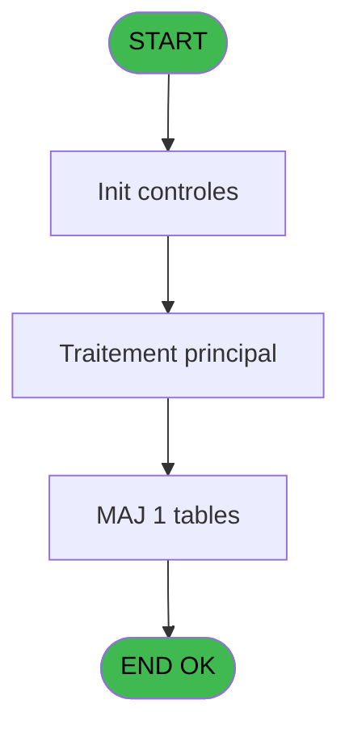
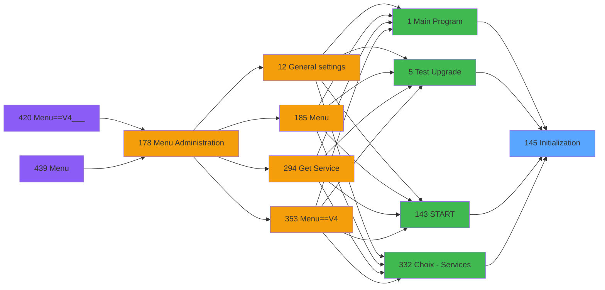
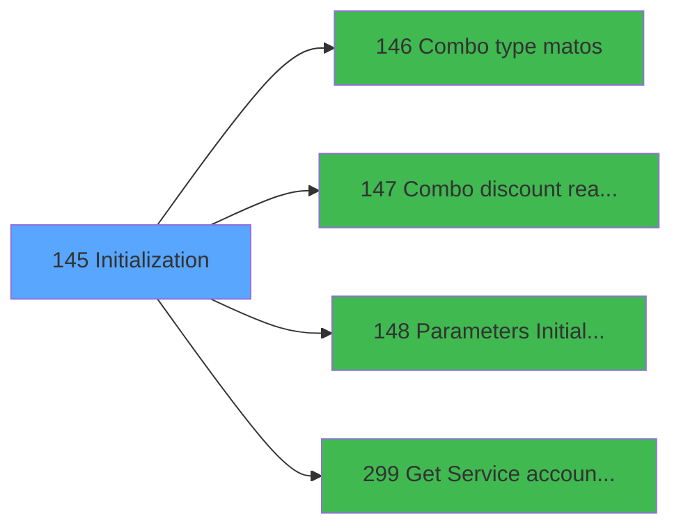

# PVE IDE 145 - Initialization

> **Analyse**: Phases 1-4 2026-02-03 09:42 -> 09:43 (17s) | Assemblage 09:43
> **Pipeline**: V7.2 Enrichi
> **Structure**: 4 onglets (Resume | Ecrans | Donnees | Connexions)

<!-- TAB:Resume -->

## 1. FICHE D'IDENTITE

| Attribut | Valeur |
|----------|--------|
| Projet | PVE |
| IDE Position | 145 |
| Nom Programme | Initialization |
| Fichier source | `Prg_145.xml` |
| Domaine metier | General |
| Taches | 7 (0 ecrans visibles) |
| Tables modifiees | 1 |
| Programmes appeles | 4 |

## 2. DESCRIPTION FONCTIONNELLE

**Initialization** assure la gestion complete de ce processus, accessible depuis [Main Program (IDE 1)](PVE-IDE-1.md), [Test Upgrade (IDE 5)](PVE-IDE-5.md), [START (IDE 143)](PVE-IDE-143.md), [Choix - Services (IDE 332)](PVE-IDE-332.md).

Le flux de traitement s'organise en **2 blocs fonctionnels** :

- **Traitement** (5 taches) : traitements metier divers
- **Initialisation** (2 taches) : reinitialisation d'etats et de variables de travail

**Donnees modifiees** : 1 tables en ecriture (Table_1463).

Detail : phases du traitement

#### Phase 1 : Initialisation (2 taches)

- **145** - Init
- **145.2.1.1** - reset log_initialisation_tpe

Delegue a : [Parameters Initialization (IDE 148)](PVE-IDE-148.md)

#### Phase 2 : Traitement (5 taches)

- **145.1** - Browse - Parametre generaux
- **145.2** - PARAMETERS
- **145.2.1** - tpe par terminal
- **145.3** - PARAMETERS
- **145.3.1** - tpe par terminal

Delegue a : [  Combo type matos (IDE 146)](PVE-IDE-146.md), [  Combo discount reasons (IDE 147)](PVE-IDE-147.md), [Get Service accounting date (IDE 299)](PVE-IDE-299.md)

#### Tables impactees

| Table | Operations | Role metier |
|-------|-----------|-------------|
| Table_1463 | R/**W** (2 usages) |  |

## 3. BLOCS FONCTIONNELS

### 3.1 Initialisation (2 taches)

Reinitialisation d'etats et variables de travail.

---

#### 145 - Init

**Role** : Reinitialisation : Init.
**Delegue a** : [Parameters Initialization (IDE 148)](PVE-IDE-148.md)

---

#### 145.2.1.1 - reset log_initialisation_tpe

**Role** : Reinitialisation : reset log_initialisation_tpe.
**Delegue a** : [Parameters Initialization (IDE 148)](PVE-IDE-148.md)

### 3.2 Traitement (5 taches)

Traitements internes.

---

#### 145.1 - Browse - Parametre generaux

**Role** : Traitement : Browse - Parametre generaux.
**Delegue a** : [  Combo type matos (IDE 146)](PVE-IDE-146.md), [  Combo discount reasons (IDE 147)](PVE-IDE-147.md), [Get Service accounting date (IDE 299)](PVE-IDE-299.md)

---

#### 145.2 - PARAMETERS

**Role** : Traitement : PARAMETERS.
**Delegue a** : [  Combo type matos (IDE 146)](PVE-IDE-146.md), [  Combo discount reasons (IDE 147)](PVE-IDE-147.md), [Parameters Initialization (IDE 148)](PVE-IDE-148.md)

---

#### 145.2.1 - tpe par terminal

**Role** : Traitement : tpe par terminal.
**Delegue a** : [  Combo type matos (IDE 146)](PVE-IDE-146.md), [  Combo discount reasons (IDE 147)](PVE-IDE-147.md), [Get Service accounting date (IDE 299)](PVE-IDE-299.md)

---

#### 145.3 - PARAMETERS

**Role** : Traitement : PARAMETERS.
**Delegue a** : [  Combo type matos (IDE 146)](PVE-IDE-146.md), [  Combo discount reasons (IDE 147)](PVE-IDE-147.md), [Parameters Initialization (IDE 148)](PVE-IDE-148.md)

---

#### 145.3.1 - tpe par terminal

**Role** : Traitement : tpe par terminal.
**Delegue a** : [  Combo type matos (IDE 146)](PVE-IDE-146.md), [  Combo discount reasons (IDE 147)](PVE-IDE-147.md), [Get Service accounting date (IDE 299)](PVE-IDE-299.md)

## 5. REGLES METIER

*(Aucune regle metier identifiee)*

## 6. CONTEXTE

- **Appele par**: [Main Program (IDE 1)](PVE-IDE-1.md), [Test Upgrade (IDE 5)](PVE-IDE-5.md), [START (IDE 143)](PVE-IDE-143.md), [Choix - Services (IDE 332)](PVE-IDE-332.md)
- **Appelle**: 4 programmes | **Tables**: 9 (W:1 R:3 L:6) | **Taches**: 7 | **Expressions**: 3

<!-- TAB:Ecrans -->

## 8. ECRANS

*(Programme sans ecran visible)*

## 9. NAVIGATION

### 9.3 Structure hierarchique (7 taches)

| Position | Tache | Type | Dimensions | Bloc |
|----------|-------|------|------------|------|
| **145.1** | [**Init** (145)](#t1) | MDI | - | Initialisation |
| 145.1.1 | [reset log_initialisation_tpe (145.2.1.1)](#t7) | - | - | |
| **145.2** | [**Browse - Parametre generaux** (145.1)](#t2) | MDI | - | Traitement |
| 145.2.1 | [PARAMETERS (145.2)](#t3) | MDI | - | |
| 145.2.2 | [tpe par terminal (145.2.1)](#t4) | - | - | |
| 145.2.3 | [PARAMETERS (145.3)](#t5) | MDI | - | |
| 145.2.4 | [tpe par terminal (145.3.1)](#t6) | - | - | |

### 9.4 Algorigramme

> **Legende**: Vert = START/END OK | Rouge = END KO | Bleu = Decisions
> *Algorigramme auto-genere. Utiliser `/algorigramme` pour une synthese metier detaillee.*

<!-- TAB:Donnees -->

## 10. TABLES

### Tables utilisees (9)

| ID | Nom | Description | Type | R | W | L | Usages |
|----|-----|-------------|------|---|---|---|--------|
| 67 | tables___________tab |  | DB | R |   |   | 2 |
| 69 | initialisation___ini |  | DB |   |   | L | 2 |
| 372 | pv_budget |  | DB |   |   | L | 2 |
| 384 | pv_equipment_models |  | DB |   |   | L | 1 |
| 728 | arc_cc_total |  | DB | R |   |   | 1 |
| 740 | pv_stock_movements | Articles et stock | DB |   |   | L | 2 |
| 1462 | Table_1462 |  | MEM |   |   | L | 2 |
| 1463 | Table_1463 |  | MEM | R | **W** |   | 2 |
| 1490 | Table_1490 |  | MEM |   |   | L | 2 |

### Colonnes par table (1 / 3 tables avec colonnes identifiees)

Table 67 - tables___________tab (R) - 2 usages

| Lettre | Variable | Acces | Type |
|--------|----------|-------|------|
| A | v.Tpt_interface ? | R | Logical |
| B | v.Tpt_num_tpe | R | Unicode |
| C | v.Tpt_type_tpe | R | Unicode |
| D | v lien adresse service village | R | Logical |

Table 728 - arc_cc_total (R) - 1 usages

*Table utilisee uniquement en Link ou aucune colonne Real identifiee dans le DataView.*

Table 1463 - Table_1463 (R/**W**) - 2 usages

*Table utilisee uniquement en Link ou aucune colonne Real identifiee dans le DataView.*

## 11. VARIABLES

### 11.1 Variables de session (4)

Variables persistantes pendant toute la session.

| Lettre | Nom | Type | Usage dans |
|--------|-----|------|-----------|
| A | v.Tpt_interface ? | Logical | - |
| B | v.Tpt_num_tpe | Unicode | - |
| C | v.Tpt_type_tpe | Unicode | - |
| D | v lien adresse service village | Logical | - |

## 12. EXPRESSIONS

**3 / 3 expressions decodees (100%)**

### 12.1 Repartition par type

| Type | Expressions | Regles |
|------|-------------|--------|
| OTHER | 1 | 0 |
| NEGATION | 1 | 0 |
| REFERENCE_VG | 1 | 0 |

### 12.2 Expressions cles par type

#### OTHER (1 expressions)

| Type | IDE | Expression | Regle |
|------|-----|------------|-------|
| OTHER | 1 | `GetParam ('SERVICE')` | - |

#### NEGATION (1 expressions)

| Type | IDE | Expression | Regle |
|------|-----|------------|-------|
| NEGATION | 2 | `NOT VG104` | - |

#### REFERENCE_VG (1 expressions)

| Type | IDE | Expression | Regle |
|------|-----|------------|-------|
| REFERENCE_VG | 3 | `VG104` | - |

<!-- TAB:Connexions -->

## 13. GRAPHE D'APPELS

### 13.1 Chaine depuis Main (Callers)

Main -> ... -> [Main Program (IDE 1)](PVE-IDE-1.md) -> **Initialization (IDE 145)**

Main -> ... -> [Test Upgrade (IDE 5)](PVE-IDE-5.md) -> **Initialization (IDE 145)**

Main -> ... -> [START (IDE 143)](PVE-IDE-143.md) -> **Initialization (IDE 145)**

Main -> ... -> [Choix - Services (IDE 332)](PVE-IDE-332.md) -> **Initialization (IDE 145)**

### 13.2 Callers

| IDE | Nom Programme | Nb Appels |
|-----|---------------|-----------|
| [1](PVE-IDE-1.md) | Main Program | 1 |
| [5](PVE-IDE-5.md) | Test Upgrade | 1 |
| [143](PVE-IDE-143.md) | START | 1 |
| [332](PVE-IDE-332.md) | Choix - Services | 1 |

### 13.3 Callees (programmes appeles)

### 13.4 Detail Callees avec contexte

| IDE | Nom Programme | Appels | Contexte |
|-----|---------------|--------|----------|
| [146](PVE-IDE-146.md) |   Combo type matos | 1 | Sous-programme |
| [147](PVE-IDE-147.md) |   Combo discount reasons | 1 | Sous-programme |
| [148](PVE-IDE-148.md) | Parameters Initialization | 1 | Reinitialisation |
| [299](PVE-IDE-299.md) | Get Service accounting date | 1 | Recuperation donnees |

## 14. RECOMMANDATIONS MIGRATION

### 14.1 Profil du programme

| Metrique | Valeur | Impact migration |
|----------|--------|-----------------|
| Lignes de logique | 292 | Taille moyenne |
| Expressions | 3 | Peu de logique |
| Tables WRITE | 1 | Impact faible |
| Sous-programmes | 4 | Peu de dependances |
| Ecrans visibles | 0 | Ecran unique ou traitement batch |
| Code desactive | 0% (0 / 292) | Code sain |
| Regles metier | 0 | Pas de regle identifiee |

### 14.2 Plan de migration par bloc

#### Initialisation (2 taches: 0 ecran, 2 traitements)

- **Strategie** : Constructeur/methode `InitAsync()` dans l'orchestrateur.

#### Traitement (5 taches: 0 ecran, 5 traitements)

- **Strategie** : 5 service(s) backend injectable(s) (Domain Services).
- 4 sous-programme(s) a migrer ou a reutiliser depuis les services existants.
- Decomposer les taches en services unitaires testables.

### 14.3 Dependances critiques

| Dependance | Type | Appels | Impact |
|------------|------|--------|--------|
| Table_1463 | Table WRITE (Memory) | 1x | Schema + repository |
| [Parameters Initialization (IDE 148)](PVE-IDE-148.md) | Sous-programme | 1x | Normale - Reinitialisation |
| [Get Service accounting date (IDE 299)](PVE-IDE-299.md) | Sous-programme | 1x | Normale - Recuperation donnees |
| [  Combo type matos (IDE 146)](PVE-IDE-146.md) | Sous-programme | 1x | Normale - Sous-programme |
| [  Combo discount reasons (IDE 147)](PVE-IDE-147.md) | Sous-programme | 1x | Normale - Sous-programme |

---
*Spec DETAILED generee par Pipeline V7.2 - 2026-02-03 09:43*
