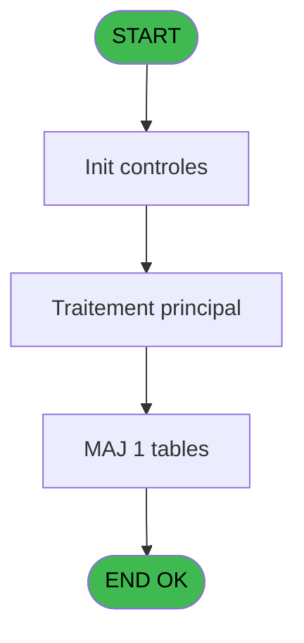
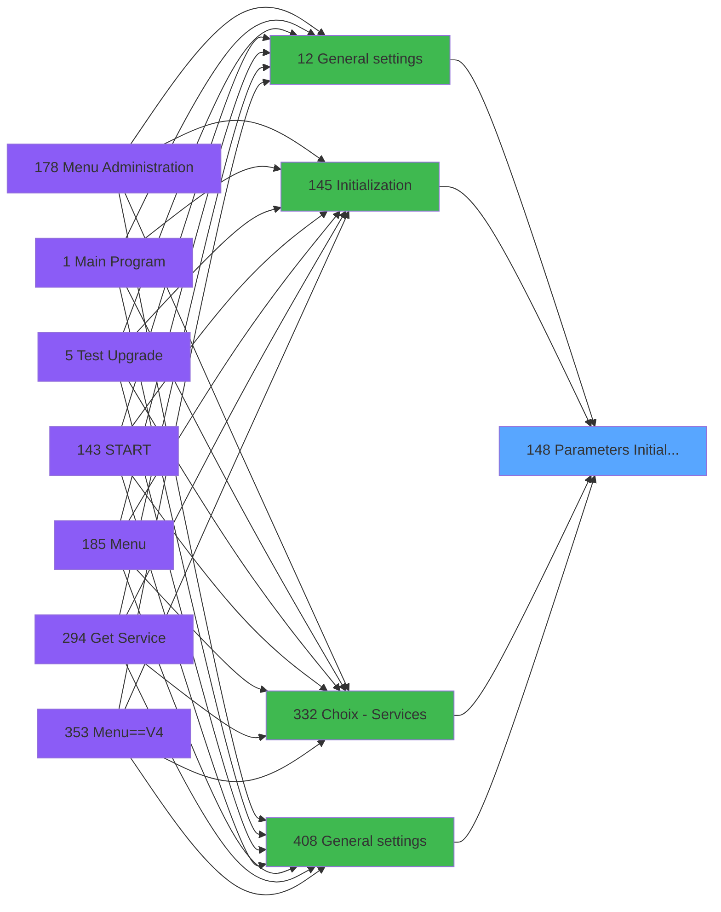

# PVE IDE 148 - Parameters Initialization

> **Analyse**: Phases 1-4 2026-02-03 09:44 -> 09:44 (17s) | Assemblage 09:44
> **Pipeline**: V7.2 Enrichi
> **Structure**: 4 onglets (Resume | Ecrans | Donnees | Connexions)

<!-- TAB:Resume -->

## 1. FICHE D'IDENTITE

| Attribut | Valeur |
|----------|--------|
| Projet | PVE |
| IDE Position | 148 |
| Nom Programme | Parameters Initialization |
| Fichier source | `Prg_148.xml` |
| Domaine metier | General |
| Taches | 5 (0 ecrans visibles) |
| Tables modifiees | 1 |
| Programmes appeles | 1 |

## 2. DESCRIPTION FONCTIONNELLE

**Parameters Initialization** assure la gestion complete de ce processus, accessible depuis [General settings (IDE 12)](PVE-IDE-12.md), [Initialization (IDE 145)](PVE-IDE-145.md), [Choix - Services (IDE 332)](PVE-IDE-332.md), [General settings (IDE 408)](PVE-IDE-408.md).

Le flux de traitement s'organise en **1 blocs fonctionnels** :

- **Traitement** (5 taches) : traitements metier divers

**Donnees modifiees** : 1 tables en ecriture (arc_tai_gm).

**Logique metier** : 4 regles identifiees couvrant conditions metier.

Detail : phases du traitement

#### Phase 1 : Traitement (5 taches)

- **148** - Browse - Parametre generaux **[[ECRAN]](#ecran-t1)**
- **148.1** - Get Max Price
- **148.2** - Terminal boutique ?
- **148.3** - Terminal boutique ?
- **148.4** - (sans nom)

Delegue a : [Existence Rental (IDE 292)](PVE-IDE-292.md)

#### Tables impactees

| Table | Operations | Role metier |
|-------|-----------|-------------|
| arc_tai_gm | **W** (1 usages) |  |

## 3. BLOCS FONCTIONNELS

### 3.1 Traitement (5 taches)

Traitements internes.

---

#### 148 - Browse - Parametre generaux [[ECRAN]](#ecran-t1)

**Role** : Traitement : Browse - Parametre generaux.
**Ecran** : 187 x 45 DLU (MDI) | [Voir mockup](#ecran-t1)

4 sous-taches directes

| Tache | Nom | Bloc |
|-------|-----|------|
| [148.1](#t3) | Get Max Price | Traitement |
| [148.2](#t4) | Terminal boutique ? | Traitement |
| [148.3](#t5) | Terminal boutique ? | Traitement |
| [148.4](#t6) | (sans nom) | Traitement |

**Delegue a** : [Existence Rental (IDE 292)](PVE-IDE-292.md)

---

#### 148.1 - Get Max Price

**Role** : Consultation/chargement : Get Max Price.
**Delegue a** : [Existence Rental (IDE 292)](PVE-IDE-292.md)

---

#### 148.2 - Terminal boutique ?

**Role** : Traitement : Terminal boutique ?.
**Variables liees** : B (L Boutique)
**Delegue a** : [Existence Rental (IDE 292)](PVE-IDE-292.md)

---

#### 148.3 - Terminal boutique ?

**Role** : Traitement : Terminal boutique ?.
**Variables liees** : B (L Boutique)
**Delegue a** : [Existence Rental (IDE 292)](PVE-IDE-292.md)

---

#### 148.4 - (sans nom)

**Role** : Traitement interne.
**Delegue a** : [Existence Rental (IDE 292)](PVE-IDE-292.md)

## 5. REGLES METIER

4 regles identifiees:

### Autres (4 regles)

#### [RM-001] Condition toujours vraie (flag actif)

| Element | Detail |
|---------|--------|
| **Condition** | `[AH]<>[AT] AND [AI]<>[AT] AND [AJ]<>[AT] AND [AK]<>[AT] AND [AL]<>[AT] AND NOT ([AM])` |
| **Si vrai** | 'TRUE'LOG |
| **Si faux** | 'FALSE'LOG) |
| **Expression source** | Expression 4 : `IF ([AH]<>[AT] AND [AI]<>[AT] AND [AJ]<>[AT] AND [AK]<>[AT] ` |
| **Exemple** | Si [AH]<>[AT] AND [AI]<>[AT] AND [AJ]<>[AT] AND [AK]<>[AT] AND [AL]<>[AT] AND NOT ([AM]) → 'TRUE'LOG. Sinon → 'FALSE'LOG) |

#### [RM-002] Si VG63 alors [AF] sinon '')

| Element | Detail |
|---------|--------|
| **Condition** | `VG63` |
| **Si vrai** | [AF] |
| **Si faux** | '') |
| **Expression source** | Expression 50 : `IF(VG63, [AF], '')` |
| **Exemple** | Si VG63 → [AF]. Sinon → '') |

#### [RM-003] Condition toujours fausse (flag inactif)

| Element | Detail |
|---------|--------|
| **Condition** | `VG118` |
| **Si vrai** | [P] |
| **Si faux** | 'FALSE'LOG) AND NOT(VG10) |
| **Expression source** | Expression 51 : `IF(VG118,[P],'FALSE'LOG) AND NOT(VG10)` |
| **Exemple** | Si VG118 → [P]. Sinon → 'FALSE'LOG) AND NOT(VG10) |

#### [RM-004] Condition toujours fausse (flag inactif)

| Element | Detail |
|---------|--------|
| **Condition** | `VG125` |
| **Si vrai** | [Q] |
| **Si faux** | 'FALSE'LOG) AND NOT(VG10) |
| **Expression source** | Expression 52 : `IF(VG125,[Q],'FALSE'LOG) AND NOT(VG10)` |
| **Exemple** | Si VG125 → [Q]. Sinon → 'FALSE'LOG) AND NOT(VG10) |

## 6. CONTEXTE

- **Appele par**: [General settings (IDE 12)](PVE-IDE-12.md), [Initialization (IDE 145)](PVE-IDE-145.md), [Choix - Services (IDE 332)](PVE-IDE-332.md), [General settings (IDE 408)](PVE-IDE-408.md)
- **Appelle**: 1 programmes | **Tables**: 6 (W:1 R:1 L:4) | **Taches**: 5 | **Expressions**: 55

<!-- TAB:Ecrans -->

## 8. ECRANS

*(Programme sans ecran visible)*

## 9. NAVIGATION

### 9.3 Structure hierarchique (5 taches)

| Position | Tache | Type | Dimensions | Bloc |
|----------|-------|------|------------|------|
| **148.1** | [**Browse - Parametre generaux** (148)](#t1) [mockup](#ecran-t1) | MDI | 187x45 | Traitement |
| 148.1.1 | [Get Max Price (148.1)](#t3) | - | - | |
| 148.1.2 | [Terminal boutique ? (148.2)](#t4) | - | - | |
| 148.1.3 | [Terminal boutique ? (148.3)](#t5) | - | - | |
| 148.1.4 | [(sans nom) (148.4)](#t6) | - | - | |

### 9.4 Algorigramme

> **Legende**: Vert = START/END OK | Rouge = END KO | Bleu = Decisions
> *Algorigramme auto-genere. Utiliser `/algorigramme` pour une synthese metier detaillee.*

<!-- TAB:Donnees -->

## 10. TABLES

### Tables utilisees (6)

| ID | Nom | Description | Type | R | W | L | Usages |
|----|-----|-------------|------|---|---|---|--------|
| 67 | tables___________tab |  | DB |   |   | L | 1 |
| 256 | terminaux_boutique |  | DB | R |   |   | 2 |
| 379 | pv_customer_temp |  | DB |   |   | L | 1 |
| 413 | pv_tva |  | DB |   |   | L | 1 |
| 697 | droits_applications | Droits operateur | DB |   |   | L | 1 |
| 731 | arc_tai_gm |  | DB |   | **W** |   | 1 |

### Colonnes par table (2 / 2 tables avec colonnes identifiees)

Table 256 - terminaux_boutique (R) - 2 usages

| Lettre | Variable | Acces | Type |
|--------|----------|-------|------|
| B | L Boutique | R | Logical |

Table 731 - arc_tai_gm (**W**) - 1 usages

| Lettre | Variable | Acces | Type |
|--------|----------|-------|------|
| A | P. Service (new) | W | Alpha |
| B | L Boutique | W | Logical |
| C | V Service | W | Alpha |
| D | L Input Sale and Products | W | Logical |

## 11. VARIABLES

### 11.1 Parametres entrants (1)

Variables recues du programme appelant ([General settings (IDE 12)](PVE-IDE-12.md)).

| Lettre | Nom | Type | Usage dans |
|--------|-----|------|-----------|
| A | P. Service (new) | Alpha | 3x parametre entrant |

### 11.2 Variables de session (1)

Variables persistantes pendant toute la session.

| Lettre | Nom | Type | Usage dans |
|--------|-----|------|-----------|
| C | V Service | Alpha | - |

### 11.3 Autres (2)

Variables diverses.

| Lettre | Nom | Type | Usage dans |
|--------|-----|------|-----------|
| B | L Boutique | Logical | [148.2](#t4), [148.3](#t5) |
| D | L Input Sale and Products | Logical | 1x refs |

## 12. EXPRESSIONS

**55 / 55 expressions decodees (100%)**

### 12.1 Repartition par type

| Type | Expressions | Regles |
|------|-------------|--------|
| CONCATENATION | 1 | 0 |
| FORMAT | 2 | 0 |
| CAST_LOGIQUE | 5 | 3 |
| CONDITION | 3 | 5 |
| CONSTANTE | 3 | 0 |
| OTHER | 36 | 0 |
| REFERENCE_VG | 2 | 0 |
| NEGATION | 1 | 0 |
| STRING | 2 | 0 |

### 12.2 Expressions cles par type

#### CONCATENATION (1 expressions)

| Type | IDE | Expression | Regle |
|------|-----|------------|-------|
| CONCATENATION | 39 | `SetParam ('LIBELBESTOF',Trim([AX])&' - '&Trim([BB]))` | - |

#### FORMAT (2 expressions)

| Type | IDE | Expression | Regle |
|------|-----|------------|-------|
| FORMAT | 48 | `DNSet(DNCast(DotNet.System.Windows.Forms.Control.FromHandle(DNCast(VG106,DotNet.System.IntPtr)),DotNet.System.Windows.Forms.Form).Text,RTrim(VG107) & ' Terminal : ' & Trim(Str(VG105, '3')) & IF(VG24 AND VG25<>'', ' - TPE : '& VG25 , '')  )` | - |
| FORMAT | 47 | `DNSet(DNCast(DotNet.System.Windows.Forms.Control.FromHandle(DNCast(VG106,DotNet.System.IntPtr)),DotNet.System.Windows.Forms.Form).Text,RTrim(VG107) & ' Computer : ' & GetHostName()& '/' & Trim(Str(VG105, '3')) & IF(VG24 AND VG25<>'', ' - TPE : '& VG25, '') )` | - |

#### CAST_LOGIQUE (5 expressions)

| Type | IDE | Expression | Regle |
|------|-----|------------|-------|
| CAST_LOGIQUE | 52 | `IF(VG125,[Q],'FALSE'LOG) AND NOT(VG10)` | [RM-004](#rm-RM-004) |
| CAST_LOGIQUE | 51 | `IF(VG118,[P],'FALSE'LOG) AND NOT(VG10)` | [RM-003](#rm-RM-003) |
| CAST_LOGIQUE | 4 | `IF ([AH]<>[AT] AND [AI]<>[AT] AND [AJ]<>[AT] AND [AK]<>[AT] AND [AL]<>[AT] AND NOT ([AM]),'TRUE'LOG,'FALSE'LOG)` | [RM-001](#rm-RM-001) |
| CAST_LOGIQUE | 54 | `'TRUE'LOG` | - |
| CAST_LOGIQUE | 27 | `SetParam ('INPUTPRODUCTS','TRUE'LOG)` | - |

#### CONDITION (3 expressions)

| Type | IDE | Expression | Regle |
|------|-----|------------|-------|
| CONDITION | 50 | `IF(VG63, [AF], '')` | [RM-002](#rm-RM-002) |
| CONDITION | 53 | `NOT(Trim(VG130)='')` | - |
| CONDITION | 6 | `[H]=0` | - |

#### CONSTANTE (3 expressions)

| Type | IDE | Expression | Regle |
|------|-----|------------|-------|
| CONSTANTE | 5 | `7` | - |
| CONSTANTE | 3 | `'O'` | - |
| CONSTANTE | 2 | `'VSERV'` | - |

#### OTHER (36 expressions)

| Type | IDE | Expression | Regle |
|------|-----|------------|-------|
| OTHER | 31 | `SetParam ('EDITMESSAGE',[J])` | - |
| OTHER | 30 | `SetParam ('SERVICELIB',[AQ])` | - |
| OTHER | 33 | `[L]` | - |
| OTHER | 32 | `[K]` | - |
| OTHER | 29 | `SetParam ('SERVICE',P. Service (new) [A])` | - |
| ... | | *+31 autres* | |

#### REFERENCE_VG (2 expressions)

| Type | IDE | Expression | Regle |
|------|-----|------------|-------|
| REFERENCE_VG | 46 | `VG104` | - |
| REFERENCE_VG | 36 | `VG86` | - |

#### NEGATION (1 expressions)

| Type | IDE | Expression | Regle |
|------|-----|------------|-------|
| NEGATION | 45 | `NOT VG104` | - |

#### STRING (2 expressions)

| Type | IDE | Expression | Regle |
|------|-----|------------|-------|
| STRING | 38 | `Val(Right([AC],2),'2P0')` | - |
| STRING | 37 | `Val(Left([AC],2),'2P0')` | - |

### 12.3 Toutes les expressions (55)

Voir les 55 expressions

#### CONCATENATION (1)

| IDE | Expression Decodee |
|-----|-------------------|
| 39 | `SetParam ('LIBELBESTOF',Trim([AX])&' - '&Trim([BB]))` |

#### FORMAT (2)

| IDE | Expression Decodee |
|-----|-------------------|
| 47 | `DNSet(DNCast(DotNet.System.Windows.Forms.Control.FromHandle(DNCast(VG106,DotNet.System.IntPtr)),DotNet.System.Windows.Forms.Form).Text,RTrim(VG107) & ' Computer : ' & GetHostName()& '/' & Trim(Str(VG105, '3')) & IF(VG24 AND VG25<>'', ' - TPE : '& VG25, '') )` |
| 48 | `DNSet(DNCast(DotNet.System.Windows.Forms.Control.FromHandle(DNCast(VG106,DotNet.System.IntPtr)),DotNet.System.Windows.Forms.Form).Text,RTrim(VG107) & ' Terminal : ' & Trim(Str(VG105, '3')) & IF(VG24 AND VG25<>'', ' - TPE : '& VG25 , '')  )` |

#### CAST_LOGIQUE (5)

| IDE | Expression Decodee |
|-----|-------------------|
| 4 | `IF ([AH]<>[AT] AND [AI]<>[AT] AND [AJ]<>[AT] AND [AK]<>[AT] AND [AL]<>[AT] AND NOT ([AM]),'TRUE'LOG,'FALSE'LOG)` |
| 51 | `IF(VG118,[P],'FALSE'LOG) AND NOT(VG10)` |
| 52 | `IF(VG125,[Q],'FALSE'LOG) AND NOT(VG10)` |
| 27 | `SetParam ('INPUTPRODUCTS','TRUE'LOG)` |
| 54 | `'TRUE'LOG` |

#### CONDITION (3)

| IDE | Expression Decodee |
|-----|-------------------|
| 50 | `IF(VG63, [AF], '')` |
| 6 | `[H]=0` |
| 53 | `NOT(Trim(VG130)='')` |

#### CONSTANTE (3)

| IDE | Expression Decodee |
|-----|-------------------|
| 2 | `'VSERV'` |
| 3 | `'O'` |
| 5 | `7` |

#### OTHER (36)

| IDE | Expression Decodee |
|-----|-------------------|
| 1 | `P. Service (new) [A]` |
| 7 | `[M]` |
| 8 | `[R]` |
| 9 | `[T]` |
| 10 | `[S]` |
| 11 | `[U]` |
| 12 | `[V]` |
| 13 | `[W]` |
| 14 | `[X]` |
| 15 | `[Y]` |
| 16 | `[Z]` |
| 17 | `[AA]` |
| 18 | `[AB]` |
| 19 | `[AD]` |
| 20 | `SetParam ('AUTODAYS',L Input Sale and Products [D])` |
| 21 | `SetParam ('ZONEGEO',[E])` |
| 22 | `SetParam ('OKNOGUARANTY',[F])` |
| 23 | `SetParam ('SKISERVICECODE',L Boutique [B])` |
| 24 | `SetParam ('INSCATEG',[G])` |
| 25 | `SetParam ('SALESCANCEL',[H])` |
| 26 | `SetParam ('INPUTSALES',[AU])` |
| 28 | `SetParam ('LOGO',[I])` |
| 29 | `SetParam ('SERVICE',P. Service (new) [A])` |
| 30 | `SetParam ('SERVICELIB',[AQ])` |
| 31 | `SetParam ('EDITMESSAGE',[J])` |
| 32 | `[K]` |
| 33 | `[L]` |
| 34 | `[N]` |
| 35 | `[O]` |
| 40 | `[AC]` |
| 41 | `P. Service (new) [A]` |
| 42 | `[AQ]` |
| 43 | `[AS]` |
| 44 | `[AR]` |
| 49 | `GetPseudoTerminal ()` |
| 55 | `[BC]` |

#### REFERENCE_VG (2)

| IDE | Expression Decodee |
|-----|-------------------|
| 36 | `VG86` |
| 46 | `VG104` |

#### NEGATION (1)

| IDE | Expression Decodee |
|-----|-------------------|
| 45 | `NOT VG104` |

#### STRING (2)

| IDE | Expression Decodee |
|-----|-------------------|
| 37 | `Val(Left([AC],2),'2P0')` |
| 38 | `Val(Right([AC],2),'2P0')` |

<!-- TAB:Connexions -->

## 13. GRAPHE D'APPELS

### 13.1 Chaine depuis Main (Callers)

Main -> ... -> [General settings (IDE 12)](PVE-IDE-12.md) -> **Parameters Initialization (IDE 148)**

Main -> ... -> [Initialization (IDE 145)](PVE-IDE-145.md) -> **Parameters Initialization (IDE 148)**

Main -> ... -> [Choix - Services (IDE 332)](PVE-IDE-332.md) -> **Parameters Initialization (IDE 148)**

Main -> ... -> [General settings (IDE 408)](PVE-IDE-408.md) -> **Parameters Initialization (IDE 148)**

### 13.2 Callers

| IDE | Nom Programme | Nb Appels |
|-----|---------------|-----------|
| [12](PVE-IDE-12.md) | General settings | 1 |
| [145](PVE-IDE-145.md) | Initialization | 1 |
| [332](PVE-IDE-332.md) | Choix - Services | 1 |
| [408](PVE-IDE-408.md) | General settings | 1 |

### 13.3 Callees (programmes appeles)

### 13.4 Detail Callees avec contexte

| IDE | Nom Programme | Appels | Contexte |
|-----|---------------|--------|----------|
| [292](PVE-IDE-292.md) | Existence Rental | 1 | Sous-programme |

## 14. RECOMMANDATIONS MIGRATION

### 14.1 Profil du programme

| Metrique | Valeur | Impact migration |
|----------|--------|-----------------|
| Lignes de logique | 163 | Programme compact |
| Expressions | 55 | Logique moderee |
| Tables WRITE | 1 | Impact faible |
| Sous-programmes | 1 | Peu de dependances |
| Ecrans visibles | 0 | Ecran unique ou traitement batch |
| Code desactive | 0% (0 / 163) | Code sain |
| Regles metier | 4 | Quelques regles a preserver |

### 14.2 Plan de migration par bloc

#### Traitement (5 taches: 1 ecran, 4 traitements)

- **Strategie** : Orchestrateur avec 1 ecrans (Razor/React) et 4 traitements backend (services).
- Les ecrans deviennent des composants UI, les traitements invisibles deviennent des services injectables.
- 1 sous-programme(s) a migrer ou a reutiliser depuis les services existants.
- Decomposer les taches en services unitaires testables.

### 14.3 Dependances critiques

| Dependance | Type | Appels | Impact |
|------------|------|--------|--------|
| arc_tai_gm | Table WRITE (Database) | 1x | Schema + repository |
| [Existence Rental (IDE 292)](PVE-IDE-292.md) | Sous-programme | 1x | Normale - Sous-programme |

---
*Spec DETAILED generee par Pipeline V7.2 - 2026-02-03 09:44*
