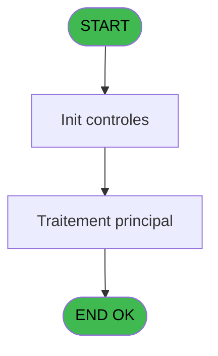

# PVE IDE 150 - Desactiver vendeurs sans login

> **Analyse**: Phases 1-4 2026-02-03 09:45 -> 09:45 (19s) | Assemblage 09:45
> **Pipeline**: V7.2 Enrichi
> **Structure**: 4 onglets (Resume | Ecrans | Donnees | Connexions)

<!-- TAB:Resume -->

## 1. FICHE D'IDENTITE

| Attribut | Valeur |
|----------|--------|
| Projet | PVE |
| IDE Position | 150 |
| Nom Programme | Desactiver vendeurs sans login |
| Fichier source | `Prg_150.xml` |
| Domaine metier | General |
| Taches | 4 (0 ecrans visibles) |
| Tables modifiees | 0 |
| Programmes appeles | 0 |

## 2. DESCRIPTION FONCTIONNELLE

**Desactiver vendeurs sans login** assure la gestion complete de ce processus, accessible depuis [Main Program (IDE 1)](PVE-IDE-1.md).

Le flux de traitement s'organise en **1 blocs fonctionnels** :

- **Traitement** (4 taches) : traitements metier divers

Detail : phases du traitement

#### Phase 1 : Traitement (4 taches)

- **150** - Desactiver vendeurs sans login
- **150.1** - Recup Lock Timeout
- **150.2** - Set Lock Timeout
- **150.3** - Desactiver vendeurs sans login

## 3. BLOCS FONCTIONNELS

### 3.1 Traitement (4 taches)

Traitements internes.

---

#### 150 - Desactiver vendeurs sans login

**Role** : Traitement : Desactiver vendeurs sans login.

3 sous-taches directes

| Tache | Nom | Bloc |
|-------|-----|------|
| [150.1](#t2) | Recup Lock Timeout | Traitement |
| [150.2](#t3) | Set Lock Timeout | Traitement |
| [150.3](#t4) | Desactiver vendeurs sans login | Traitement |

---

#### 150.1 - Recup Lock Timeout

**Role** : Consultation/chargement : Recup Lock Timeout.
**Variables liees** : A (v.Lock Timeout)

---

#### 150.2 - Set Lock Timeout

**Role** : Traitement : Set Lock Timeout.
**Variables liees** : A (v.Lock Timeout)

---

#### 150.3 - Desactiver vendeurs sans login

**Role** : Traitement : Desactiver vendeurs sans login.

## 5. REGLES METIER

*(Aucune regle metier identifiee)*

## 6. CONTEXTE

- **Appele par**: [Main Program (IDE 1)](PVE-IDE-1.md)
- **Appelle**: 0 programmes | **Tables**: 0 (W:0 R:0 L:0) | **Taches**: 4 | **Expressions**: 1

<!-- TAB:Ecrans -->

## 8. ECRANS

*(Programme sans ecran visible)*

## 9. NAVIGATION

### 9.3 Structure hierarchique (4 taches)

| Position | Tache | Type | Dimensions | Bloc |
|----------|-------|------|------------|------|
| **150.1** | [**Desactiver vendeurs sans login** (150)](#t1) | - | - | Traitement |
| 150.1.1 | [Recup Lock Timeout (150.1)](#t2) | - | - | |
| 150.1.2 | [Set Lock Timeout (150.2)](#t3) | - | - | |
| 150.1.3 | [Desactiver vendeurs sans login (150.3)](#t4) | - | - | |

### 9.4 Algorigramme

> **Legende**: Vert = START/END OK | Rouge = END KO | Bleu = Decisions
> *Algorigramme auto-genere. Utiliser `/algorigramme` pour une synthese metier detaillee.*

<!-- TAB:Donnees -->

## 10. TABLES

### Tables utilisees (0)

| ID | Nom | Description | Type | R | W | L | Usages |
|----|-----|-------------|------|---|---|---|--------|

### Colonnes par table (0 / 0 tables avec colonnes identifiees)

## 11. VARIABLES

*(Programme sans variables locales mappees)*

## 12. EXPRESSIONS

**1 / 1 expressions decodees (100%)**

### 12.1 Repartition par type

| Type | Expressions | Regles |
|------|-------------|--------|
| CONSTANTE | 1 | 0 |

### 12.2 Expressions cles par type

#### CONSTANTE (1 expressions)

| Type | IDE | Expression | Regle |
|------|-----|------------|-------|
| CONSTANTE | 1 | `1` | - |

<!-- TAB:Connexions -->

## 13. GRAPHE D'APPELS

### 13.1 Chaine depuis Main (Callers)

Main -> ... -> [Main Program (IDE 1)](PVE-IDE-1.md) -> **Desactiver vendeurs sans login (IDE 150)**

### 13.2 Callers

| IDE | Nom Programme | Nb Appels |
|-----|---------------|-----------|
| [1](PVE-IDE-1.md) | Main Program | 1 |

### 13.3 Callees (programmes appeles)

### 13.4 Detail Callees avec contexte

| IDE | Nom Programme | Appels | Contexte |
|-----|---------------|--------|----------|
| - | (aucun) | - | - |

## 14. RECOMMANDATIONS MIGRATION

### 14.1 Profil du programme

| Metrique | Valeur | Impact migration |
|----------|--------|-----------------|
| Lignes de logique | 12 | Programme compact |
| Expressions | 1 | Peu de logique |
| Tables WRITE | 0 | Impact faible |
| Sous-programmes | 0 | Peu de dependances |
| Ecrans visibles | 0 | Ecran unique ou traitement batch |
| Code desactive | 0% (0 / 12) | Code sain |
| Regles metier | 0 | Pas de regle identifiee |

### 14.2 Plan de migration par bloc

#### Traitement (4 taches: 0 ecran, 4 traitements)

- **Strategie** : 4 service(s) backend injectable(s) (Domain Services).
- Decomposer les taches en services unitaires testables.

### 14.3 Dependances critiques

| Dependance | Type | Appels | Impact |
|------------|------|--------|--------|

---
*Spec DETAILED generee par Pipeline V7.2 - 2026-02-03 09:45*
