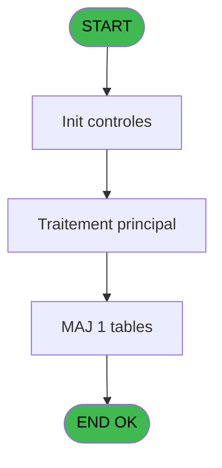
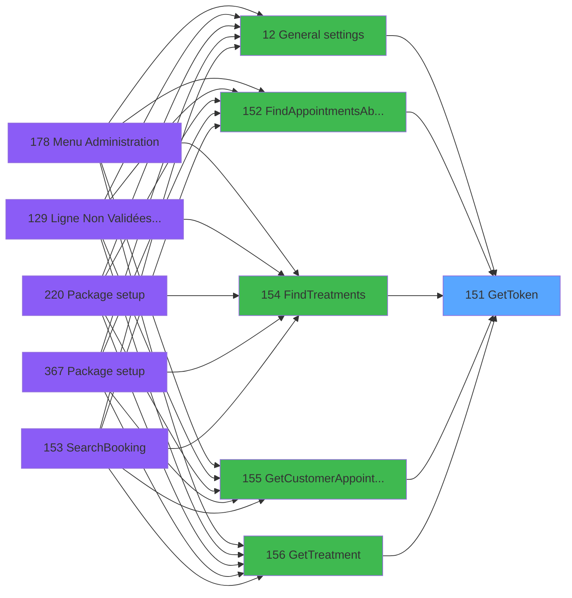

# PVE IDE 151 - GetToken

> **Analyse**: Phases 1-4 2026-02-03 09:45 -> 09:45 (23s) | Assemblage 09:45
> **Pipeline**: V7.2 Enrichi
> **Structure**: 4 onglets (Resume | Ecrans | Donnees | Connexions)

<!-- TAB:Resume -->

## 1. FICHE D'IDENTITE

| Attribut | Valeur |
|----------|--------|
| Projet | PVE |
| IDE Position | 151 |
| Nom Programme | GetToken |
| Fichier source | `Prg_151.xml` |
| Domaine metier | General |
| Taches | 2 (0 ecrans visibles) |
| Tables modifiees | 1 |
| Programmes appeles | 1 |

## 2. DESCRIPTION FONCTIONNELLE

**GetToken** assure la gestion complete de ce processus, accessible depuis [General settings (IDE 12)](PVE-IDE-12.md), [FindAppointmentsAbsentPOS (IDE 152)](PVE-IDE-152.md), [FindTreatments (IDE 154)](PVE-IDE-154.md), [GetCustomerAppointments (IDE 155)](PVE-IDE-155.md), [GetTreatment (IDE 156)](PVE-IDE-156.md), [FindRooms (IDE 157)](PVE-IDE-157.md), [FindEmployees (IDE 158)](PVE-IDE-158.md), [CancelAppointment (IDE 159)](PVE-IDE-159.md), [CreateAppointment (IDE 160)](PVE-IDE-160.md), [GetAppointment (IDE 161)](PVE-IDE-161.md), [TakeDeposit (IDE 162)](PVE-IDE-162.md), [CloseOrder (IDE 163)](PVE-IDE-163.md), [CloseOrder-392 (IDE 164)](PVE-IDE-164.md), [UpdateAppointment (IDE 167)](PVE-IDE-167.md), [AddPaymentToOrder (IDE 169)](PVE-IDE-169.md), [AddSpecialToOrder-392 (IDE 170)](PVE-IDE-170.md), [FindAppointmentsToClose (IDE 172)](PVE-IDE-172.md), [FindAvailability (IDE 173)](PVE-IDE-173.md), [GetLocationPaymentSettings (IDE 174)](PVE-IDE-174.md), [FindAppointments (IDE 176)](PVE-IDE-176.md).

Le flux de traitement s'organise en **1 blocs fonctionnels** :

- **Traitement** (2 taches) : traitements metier divers

**Donnees modifiees** : 1 tables en ecriture (arc_tai_gm).

## 3. BLOCS FONCTIONNELS

### 3.1 Traitement (2 taches)

Traitements internes.

---

#### 151 - GetToken

**Role** : Consultation/chargement : GetToken.
**Delegue a** : [TraceLogBooker (IDE 175)](PVE-IDE-175.md)

---

#### 151.1 - Get Token

**Role** : Consultation/chargement : Get Token.
**Variables liees** : A (O.Token)
**Delegue a** : [TraceLogBooker (IDE 175)](PVE-IDE-175.md)

## 5. REGLES METIER

*(Aucune regle metier identifiee)*

## 6. CONTEXTE

- **Appele par**: [General settings (IDE 12)](PVE-IDE-12.md), [FindAppointmentsAbsentPOS (IDE 152)](PVE-IDE-152.md), [FindTreatments (IDE 154)](PVE-IDE-154.md), [GetCustomerAppointments (IDE 155)](PVE-IDE-155.md), [GetTreatment (IDE 156)](PVE-IDE-156.md), [FindRooms (IDE 157)](PVE-IDE-157.md), [FindEmployees (IDE 158)](PVE-IDE-158.md), [CancelAppointment (IDE 159)](PVE-IDE-159.md), [CreateAppointment (IDE 160)](PVE-IDE-160.md), [GetAppointment (IDE 161)](PVE-IDE-161.md), [TakeDeposit (IDE 162)](PVE-IDE-162.md), [CloseOrder (IDE 163)](PVE-IDE-163.md), [CloseOrder-392 (IDE 164)](PVE-IDE-164.md), [UpdateAppointment (IDE 167)](PVE-IDE-167.md), [AddPaymentToOrder (IDE 169)](PVE-IDE-169.md), [AddSpecialToOrder-392 (IDE 170)](PVE-IDE-170.md), [FindAppointmentsToClose (IDE 172)](PVE-IDE-172.md), [FindAvailability (IDE 173)](PVE-IDE-173.md), [GetLocationPaymentSettings (IDE 174)](PVE-IDE-174.md), [FindAppointments (IDE 176)](PVE-IDE-176.md)
- **Appelle**: 1 programmes | **Tables**: 1 (W:1 R:0 L:0) | **Taches**: 2 | **Expressions**: 13

<!-- TAB:Ecrans -->

## 8. ECRANS

*(Programme sans ecran visible)*

## 9. NAVIGATION

### 9.3 Structure hierarchique (2 taches)

| Position | Tache | Type | Dimensions | Bloc |
|----------|-------|------|------------|------|
| **151.1** | [**GetToken** (151)](#t1) | - | - | Traitement |
| 151.1.1 | [Get Token (151.1)](#t2) | - | - | |

### 9.4 Algorigramme

> **Legende**: Vert = START/END OK | Rouge = END KO | Bleu = Decisions
> *Algorigramme auto-genere. Utiliser `/algorigramme` pour une synthese metier detaillee.*

<!-- TAB:Donnees -->

## 10. TABLES

### Tables utilisees (1)

| ID | Nom | Description | Type | R | W | L | Usages |
|----|-----|-------------|------|---|---|---|--------|
| 731 | arc_tai_gm |  | DB |   | **W** |   | 1 |

### Colonnes par table (0 / 1 tables avec colonnes identifiees)

Table 731 - arc_tai_gm (**W**) - 1 usages

*Table utilisee uniquement en Link ou aucune colonne Real identifiee dans le DataView.*

## 11. VARIABLES

### 11.1 Autres (13)

Variables diverses.

| Lettre | Nom | Type | Usage dans |
|--------|-----|------|-----------|
| A | O.Token | Unicode | 1x refs |
| B | O.IsSuccess | Logical | - |
| C | O.ErrorMessage | Unicode | - |
| D | ClientID | Unicode | 1x refs |
| E | ClientSecret | Unicode | 1x refs |
| F | LocationID | Numeric | 1x refs |
| G | UserName | Unicode | 1x refs |
| H | Password | Unicode | 1x refs |
| I | UrlAPI | Unicode | - |
| J | RequestType | Alpha | - |
| K | JsonIn | Blob | - |
| L | JsonResponse | Blob | 1x refs |
| M | XMLResponse | Blob | - |

## 12. EXPRESSIONS

**13 / 13 expressions decodees (100%)**

### 12.1 Repartition par type

| Type | Expressions | Regles |
|------|-------------|--------|
| CALCULATION | 1 | 0 |
| CONSTANTE | 1 | 0 |
| DATE | 1 | 0 |
| REFERENCE_VG | 2 | 0 |
| OTHER | 2 | 0 |
| STRING | 4 | 0 |
| FORMAT | 2 | 0 |

### 12.2 Expressions cles par type

#### CALCULATION (1 expressions)

| Type | IDE | Expression | Regle |
|------|-----|------------|-------|
| CALCULATION | 6 | `Trim(VG66) & '/Login'` | - |

#### CONSTANTE (1 expressions)

| Type | IDE | Expression | Regle |
|------|-----|------------|-------|
| CONSTANTE | 7 | `'POST'` | - |

#### DATE (1 expressions)

| Type | IDE | Expression | Regle |
|------|-----|------------|-------|
| DATE | 11 | `Date()` | - |

#### REFERENCE_VG (2 expressions)

| Type | IDE | Expression | Regle |
|------|-----|------------|-------|
| REFERENCE_VG | 13 | `VG63` | - |
| REFERENCE_VG | 3 | `VG67` | - |

#### OTHER (2 expressions)

| Type | IDE | Expression | Regle |
|------|-----|------------|-------|
| OTHER | 12 | `Time()` | - |
| OTHER | 9 | `StrToken(JsonResponse [L],1,',')` | - |

#### STRING (4 expressions)

| Type | IDE | Expression | Regle |
|------|-----|------------|-------|
| STRING | 4 | `Trim(VG72)` | - |
| STRING | 5 | `Trim(VG73)` | - |
| STRING | 1 | `Trim(VG70)` | - |
| STRING | 2 | `Trim(VG71)` | - |

#### FORMAT (2 expressions)

| Type | IDE | Expression | Regle |
|------|-----|------------|-------|
| FORMAT | 10 | `RepStr(StrToken(O.Token [A],2,':'),'"','')` | - |
| FORMAT | 8 | `'{    "LocationID":' & Trim(Str(LocationID [F],'10')) & ',    "Password": "' & Trim(Password [H]) & '",        "UserName": "' & Trim(UserName [G]) & '",     "client_id": "'& Trim(ClientID [D]) &'",    "client_secret": "'& Trim(ClientSecret [E]) &'",    "grant_type": "",    "ClientIpAddress": "",    "NetworkConnectionType": null}'` | - |

<!-- TAB:Connexions -->

## 13. GRAPHE D'APPELS

### 13.1 Chaine depuis Main (Callers)

Main -> ... -> [General settings (IDE 12)](PVE-IDE-12.md) -> **GetToken (IDE 151)**

Main -> ... -> [FindAppointmentsAbsentPOS (IDE 152)](PVE-IDE-152.md) -> **GetToken (IDE 151)**

Main -> ... -> [FindTreatments (IDE 154)](PVE-IDE-154.md) -> **GetToken (IDE 151)**

Main -> ... -> [GetCustomerAppointments (IDE 155)](PVE-IDE-155.md) -> **GetToken (IDE 151)**

Main -> ... -> [GetTreatment (IDE 156)](PVE-IDE-156.md) -> **GetToken (IDE 151)**

Main -> ... -> [FindRooms (IDE 157)](PVE-IDE-157.md) -> **GetToken (IDE 151)**

Main -> ... -> [FindEmployees (IDE 158)](PVE-IDE-158.md) -> **GetToken (IDE 151)**

Main -> ... -> [CancelAppointment (IDE 159)](PVE-IDE-159.md) -> **GetToken (IDE 151)**

Main -> ... -> [CreateAppointment (IDE 160)](PVE-IDE-160.md) -> **GetToken (IDE 151)**

Main -> ... -> [GetAppointment (IDE 161)](PVE-IDE-161.md) -> **GetToken (IDE 151)**

Main -> ... -> [TakeDeposit (IDE 162)](PVE-IDE-162.md) -> **GetToken (IDE 151)**

Main -> ... -> [CloseOrder (IDE 163)](PVE-IDE-163.md) -> **GetToken (IDE 151)**

Main -> ... -> [CloseOrder-392 (IDE 164)](PVE-IDE-164.md) -> **GetToken (IDE 151)**

Main -> ... -> [UpdateAppointment (IDE 167)](PVE-IDE-167.md) -> **GetToken (IDE 151)**

Main -> ... -> [AddPaymentToOrder (IDE 169)](PVE-IDE-169.md) -> **GetToken (IDE 151)**

Main -> ... -> [AddSpecialToOrder-392 (IDE 170)](PVE-IDE-170.md) -> **GetToken (IDE 151)**

Main -> ... -> [FindAppointmentsToClose (IDE 172)](PVE-IDE-172.md) -> **GetToken (IDE 151)**

Main -> ... -> [FindAvailability (IDE 173)](PVE-IDE-173.md) -> **GetToken (IDE 151)**

Main -> ... -> [GetLocationPaymentSettings (IDE 174)](PVE-IDE-174.md) -> **GetToken (IDE 151)**

Main -> ... -> [FindAppointments (IDE 176)](PVE-IDE-176.md) -> **GetToken (IDE 151)**

### 13.2 Callers

| IDE | Nom Programme | Nb Appels |
|-----|---------------|-----------|
| [12](PVE-IDE-12.md) | General settings | 1 |
| [152](PVE-IDE-152.md) | FindAppointmentsAbsentPOS | 1 |
| [154](PVE-IDE-154.md) | FindTreatments | 1 |
| [155](PVE-IDE-155.md) | GetCustomerAppointments | 1 |
| [156](PVE-IDE-156.md) | GetTreatment | 1 |
| [157](PVE-IDE-157.md) | FindRooms | 1 |
| [158](PVE-IDE-158.md) | FindEmployees | 1 |
| [159](PVE-IDE-159.md) | CancelAppointment | 1 |
| [160](PVE-IDE-160.md) | CreateAppointment | 1 |
| [161](PVE-IDE-161.md) | GetAppointment | 1 |
| [162](PVE-IDE-162.md) | TakeDeposit | 1 |
| [163](PVE-IDE-163.md) | CloseOrder | 1 |
| [164](PVE-IDE-164.md) | CloseOrder-392 | 1 |
| [167](PVE-IDE-167.md) | UpdateAppointment | 1 |
| [169](PVE-IDE-169.md) | AddPaymentToOrder | 1 |
| [170](PVE-IDE-170.md) | AddSpecialToOrder-392 | 1 |
| [172](PVE-IDE-172.md) | FindAppointmentsToClose | 1 |
| [173](PVE-IDE-173.md) | FindAvailability | 1 |
| [174](PVE-IDE-174.md) | GetLocationPaymentSettings | 1 |
| [176](PVE-IDE-176.md) | FindAppointments | 1 |

### 13.3 Callees (programmes appeles)

### 13.4 Detail Callees avec contexte

| IDE | Nom Programme | Appels | Contexte |
|-----|---------------|--------|----------|
| [175](PVE-IDE-175.md) | TraceLogBooker | 1 | Sous-programme |

## 14. RECOMMANDATIONS MIGRATION

### 14.1 Profil du programme

| Metrique | Valeur | Impact migration |
|----------|--------|-----------------|
| Lignes de logique | 51 | Programme compact |
| Expressions | 13 | Peu de logique |
| Tables WRITE | 1 | Impact faible |
| Sous-programmes | 1 | Peu de dependances |
| Ecrans visibles | 0 | Ecran unique ou traitement batch |
| Code desactive | 0% (0 / 51) | Code sain |
| Regles metier | 0 | Pas de regle identifiee |

### 14.2 Plan de migration par bloc

#### Traitement (2 taches: 0 ecran, 2 traitements)

- **Strategie** : 2 service(s) backend injectable(s) (Domain Services).
- 1 sous-programme(s) a migrer ou a reutiliser depuis les services existants.
- Decomposer les taches en services unitaires testables.

### 14.3 Dependances critiques

| Dependance | Type | Appels | Impact |
|------------|------|--------|--------|
| arc_tai_gm | Table WRITE (Database) | 1x | Schema + repository |
| [TraceLogBooker (IDE 175)](PVE-IDE-175.md) | Sous-programme | 1x | Normale - Sous-programme |

---
*Spec DETAILED generee par Pipeline V7.2 - 2026-02-03 09:46*
