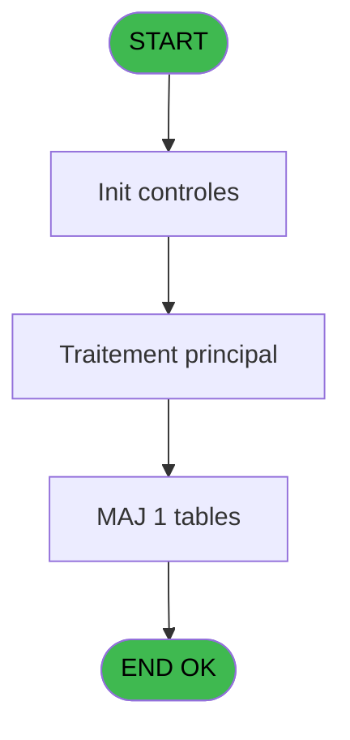
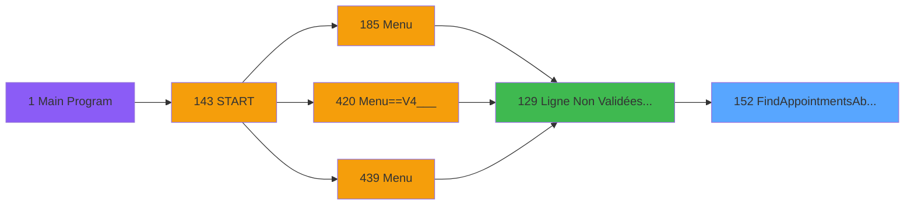
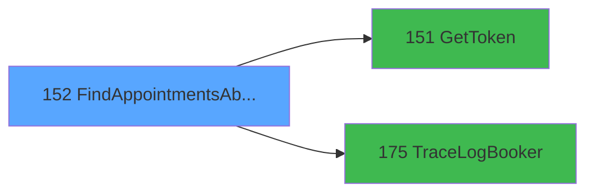

# PVE IDE 152 - FindAppointmentsAbsentPOS

> **Analyse**: Phases 1-4 2026-02-03 09:46 -> 09:46 (26s) | Assemblage 09:46
> **Pipeline**: V7.2 Enrichi
> **Structure**: 4 onglets (Resume | Ecrans | Donnees | Connexions)

<!-- TAB:Resume -->

## 1. FICHE D'IDENTITE

| Attribut | Valeur |
|----------|--------|
| Projet | PVE |
| IDE Position | 152 |
| Nom Programme | FindAppointmentsAbsentPOS |
| Fichier source | `Prg_152.xml` |
| Domaine metier | General |
| Taches | 4 (0 ecrans visibles) |
| Tables modifiees | 1 |
| Programmes appeles | 2 |

## 2. DESCRIPTION FONCTIONNELLE

**FindAppointmentsAbsentPOS** assure la gestion complete de ce processus, accessible depuis [Ligne Non Validées & Edit Book (IDE 129)](PVE-IDE-129.md).

Le flux de traitement s'organise en **1 blocs fonctionnels** :

- **Traitement** (4 taches) : traitements metier divers

**Donnees modifiees** : 1 tables en ecriture (Table_1548).

Detail : phases du traitement

#### Phase 1 : Traitement (4 taches)

- **152** - FindAppointmentsAbsentPOS
- **152.1** - ExtractDataFromXML
- **152.1.1** - DataToTable
- **152.1.2** - DeleteMemoryData

Delegue a : [GetToken (IDE 151)](PVE-IDE-151.md), [TraceLogBooker (IDE 175)](PVE-IDE-175.md)

#### Tables impactees

| Table | Operations | Role metier |
|-------|-----------|-------------|
| Table_1548 | **W** (2 usages) |  |

## 3. BLOCS FONCTIONNELS

### 3.1 Traitement (4 taches)

Traitements internes.

---

#### 152 - FindAppointmentsAbsentPOS

**Role** : Traitement : FindAppointmentsAbsentPOS.

3 sous-taches directes

| Tache | Nom | Bloc |
|-------|-----|------|
| [152.1](#t2) | ExtractDataFromXML | Traitement |
| [152.1.1](#t3) | DataToTable | Traitement |
| [152.1.2](#t4) | DeleteMemoryData | Traitement |

**Delegue a** : [GetToken (IDE 151)](PVE-IDE-151.md), [TraceLogBooker (IDE 175)](PVE-IDE-175.md)

---

#### 152.1 - ExtractDataFromXML

**Role** : Traitement : ExtractDataFromXML.
**Delegue a** : [GetToken (IDE 151)](PVE-IDE-151.md), [TraceLogBooker (IDE 175)](PVE-IDE-175.md)

---

#### 152.1.1 - DataToTable

**Role** : Traitement : DataToTable.
**Delegue a** : [GetToken (IDE 151)](PVE-IDE-151.md), [TraceLogBooker (IDE 175)](PVE-IDE-175.md)

---

#### 152.1.2 - DeleteMemoryData

**Role** : Traitement : DeleteMemoryData.
**Delegue a** : [GetToken (IDE 151)](PVE-IDE-151.md), [TraceLogBooker (IDE 175)](PVE-IDE-175.md)

## 5. REGLES METIER

*(Aucune regle metier identifiee)*

## 6. CONTEXTE

- **Appele par**: [Ligne Non Validées & Edit Book (IDE 129)](PVE-IDE-129.md)
- **Appelle**: 2 programmes | **Tables**: 2 (W:1 R:1 L:0) | **Taches**: 4 | **Expressions**: 11

<!-- TAB:Ecrans -->

## 8. ECRANS

*(Programme sans ecran visible)*

## 9. NAVIGATION

### 9.3 Structure hierarchique (4 taches)

| Position | Tache | Type | Dimensions | Bloc |
|----------|-------|------|------------|------|
| **152.1** | [**FindAppointmentsAbsentPOS** (152)](#t1) | - | - | Traitement |
| 152.1.1 | [ExtractDataFromXML (152.1)](#t2) | - | - | |
| 152.1.2 | [DataToTable (152.1.1)](#t3) | - | - | |
| 152.1.3 | [DeleteMemoryData (152.1.2)](#t4) | - | - | |

### 9.4 Algorigramme

> **Legende**: Vert = START/END OK | Rouge = END KO | Bleu = Decisions
> *Algorigramme auto-genere. Utiliser `/algorigramme` pour une synthese metier detaillee.*

<!-- TAB:Donnees -->

## 10. TABLES

### Tables utilisees (2)

| ID | Nom | Description | Type | R | W | L | Usages |
|----|-----|-------------|------|---|---|---|--------|
| 1539 | Table_1539 |  | MEM | R |   |   | 1 |
| 1548 | Table_1548 |  | MEM |   | **W** |   | 2 |

### Colonnes par table (1 / 2 tables avec colonnes identifiees)

Table 1539 - Table_1539 (R) - 1 usages

| Lettre | Variable | Acces | Type |
|--------|----------|-------|------|
| A | NbrAppointments | R | Numeric |
| B | BookingID | R | Unicode |
| C | CustomerLastName | R | Unicode |
| D | CustomerFirstName | R | Unicode |
| E | ProductName | R | Unicode |
| F | TimeStampDebut | R | Unicode |
| G | TimeStampFin | R | Unicode |
| H | isExistAppointment? | R | Logical |

Table 1548 - Table_1548 (**W**) - 2 usages

*Table utilisee uniquement en Link ou aucune colonne Real identifiee dans le DataView.*

## 11. VARIABLES

### 11.1 Parametres entrants (5)

Variables recues du programme appelant ([Ligne Non Validées & Edit Book (IDE 129)](PVE-IDE-129.md)).

| Lettre | Nom | Type | Usage dans |
|--------|-----|------|-----------|
| A | P.DateDebut | Date | - |
| B | P.TimeDebut | Time | - |
| C | P.DateFin | Date | - |
| D | P.TimeFin | Time | - |
| E | P.NbrAppointments | Numeric | - |

### 11.2 Autres (13)

Variables diverses.

| Lettre | Nom | Type | Usage dans |
|--------|-----|------|-----------|
| F | Token | Unicode | 1x refs |
| G | LocationID | Numeric | 1x refs |
| H | typeRequest | Alpha | - |
| I | UrlApi | Alpha | - |
| J | TimeStampDebut | Unicode | 1x refs |
| K | TimeStampFin | Unicode | 1x refs |
| L | JsonIN | Blob | - |
| M | IsSuccessToken | Logical | - |
| N | ErrorMessageToken | Alpha | - |
| O | IsSuccess | Logical | 1x refs |
| P | ErrorMessage | Alpha | - |
| Q | JsonResponse | Blob | 1x refs |
| R | XmlResponse | Blob | - |

Toutes les 18 variables (liste complete)

| Cat | Lettre | Nom Variable | Type |
|-----|--------|--------------|------|
| P0 | **A** | P.DateDebut | Date |
| P0 | **B** | P.TimeDebut | Time |
| P0 | **C** | P.DateFin | Date |
| P0 | **D** | P.TimeFin | Time |
| P0 | **E** | P.NbrAppointments | Numeric |
| Autre | **F** | Token | Unicode |
| Autre | **G** | LocationID | Numeric |
| Autre | **H** | typeRequest | Alpha |
| Autre | **I** | UrlApi | Alpha |
| Autre | **J** | TimeStampDebut | Unicode |
| Autre | **K** | TimeStampFin | Unicode |
| Autre | **L** | JsonIN | Blob |
| Autre | **M** | IsSuccessToken | Logical |
| Autre | **N** | ErrorMessageToken | Alpha |
| Autre | **O** | IsSuccess | Logical |
| Autre | **P** | ErrorMessage | Alpha |
| Autre | **Q** | JsonResponse | Blob |
| Autre | **R** | XmlResponse | Blob |

## 12. EXPRESSIONS

**11 / 11 expressions decodees (100%)**

### 12.1 Repartition par type

| Type | Expressions | Regles |
|------|-------------|--------|
| CALCULATION | 2 | 0 |
| CONCATENATION | 1 | 0 |
| CONSTANTE | 1 | 0 |
| FORMAT | 1 | 0 |
| DATE | 1 | 0 |
| REFERENCE_VG | 3 | 0 |
| OTHER | 2 | 0 |

### 12.2 Expressions cles par type

#### CALCULATION (2 expressions)

| Type | IDE | Expression | Regle |
|------|-----|------------|-------|
| CALCULATION | 4 | `Trim(VG66) & '/v4.1/merchant/appointments'` | - |
| CALCULATION | 3 | `Trim(VG66) & '/appointments'` | - |

#### CONCATENATION (1 expressions)

| Type | IDE | Expression | Regle |
|------|-----|------------|-------|
| CONCATENATION | 6 | `'<?xml version="1.0" encoding="UTF-8"?>' &ASCIIChr(13)& ASCIIChr(10)&DotNet.System.Xml.Linq.XElement.Load(  DotNet.System.Runtime.Serialization.Json.JsonReaderWriterFactory.CreateJsonReader( JsonResponse [Q],DotNet.System.Xml.XmlDictionaryReaderQuotas()   )).ToString()` | - |

#### CONSTANTE (1 expressions)

| Type | IDE | Expression | Regle |
|------|-----|------------|-------|
| CONSTANTE | 2 | `'POST'` | - |

#### FORMAT (1 expressions)

| Type | IDE | Expression | Regle |
|------|-----|------------|-------|
| FORMAT | 5 | `'{
    "ClassInstanceID": null,
    "CustomerID": null,
    "EmployeeID": null,
    "FromStartDate": "/Date(' & Trim(TimeStampDebut [J]) & ')/",
    "LocationID": ' & Trim(Str(LocationID [G],'10')) & ',
    "PageNumber": 0,
    "PageSize": 0,
    "RoomID": null,
    "ToStartDate": "/Date(' & Trim(TimeStampFin [K]) & ')/",
    "UsePaging": false,
    "access_token": "' & Trim(Token [F]) & '",
    "SkipItemsForOtherAppointmentsInGroup": null,
    "FromDateLastModified": null,
    "ToDateLastModified": null,
    "AppointmentStatusID": null,
    "OnlyClassAppointments": false,
    "ShowAppointmentIconFlags": false,
    "ExcludeEnrollmentAppointments": null,
    "IncludeAppointmentsForDependents": null
}'` | - |

#### DATE (1 expressions)

| Type | IDE | Expression | Regle |
|------|-----|------------|-------|
| DATE | 8 | `Date()` | - |

#### REFERENCE_VG (3 expressions)

| Type | IDE | Expression | Regle |
|------|-----|------------|-------|
| REFERENCE_VG | 11 | `VG63` | - |
| REFERENCE_VG | 10 | `VG65` | - |
| REFERENCE_VG | 1 | `VG67` | - |

#### OTHER (2 expressions)

| Type | IDE | Expression | Regle |
|------|-----|------------|-------|
| OTHER | 9 | `Time()` | - |
| OTHER | 7 | `IsSuccess [O]` | - |

<!-- TAB:Connexions -->

## 13. GRAPHE D'APPELS

### 13.1 Chaine depuis Main (Callers)

Main -> ... -> [Ligne Non Validées & Edit Book (IDE 129)](PVE-IDE-129.md) -> **FindAppointmentsAbsentPOS (IDE 152)**

### 13.2 Callers

| IDE | Nom Programme | Nb Appels |
|-----|---------------|-----------|
| [129](PVE-IDE-129.md) | Ligne Non Validées & Edit Book | 1 |

### 13.3 Callees (programmes appeles)

### 13.4 Detail Callees avec contexte

| IDE | Nom Programme | Appels | Contexte |
|-----|---------------|--------|----------|
| [151](PVE-IDE-151.md) | GetToken | 1 | Recuperation donnees |
| [175](PVE-IDE-175.md) | TraceLogBooker | 1 | Sous-programme |

## 14. RECOMMANDATIONS MIGRATION

### 14.1 Profil du programme

| Metrique | Valeur | Impact migration |
|----------|--------|-----------------|
| Lignes de logique | 114 | Programme compact |
| Expressions | 11 | Peu de logique |
| Tables WRITE | 1 | Impact faible |
| Sous-programmes | 2 | Peu de dependances |
| Ecrans visibles | 0 | Ecran unique ou traitement batch |
| Code desactive | 0.9% (1 / 114) | Code sain |
| Regles metier | 0 | Pas de regle identifiee |

### 14.2 Plan de migration par bloc

#### Traitement (4 taches: 0 ecran, 4 traitements)

- **Strategie** : 4 service(s) backend injectable(s) (Domain Services).
- 2 sous-programme(s) a migrer ou a reutiliser depuis les services existants.
- Decomposer les taches en services unitaires testables.

### 14.3 Dependances critiques

| Dependance | Type | Appels | Impact |
|------------|------|--------|--------|
| Table_1548 | Table WRITE (Memory) | 2x | Schema + repository |
| [TraceLogBooker (IDE 175)](PVE-IDE-175.md) | Sous-programme | 1x | Normale - Sous-programme |
| [GetToken (IDE 151)](PVE-IDE-151.md) | Sous-programme | 1x | Normale - Recuperation donnees |

---
*Spec DETAILED generee par Pipeline V7.2 - 2026-02-03 09:46*
