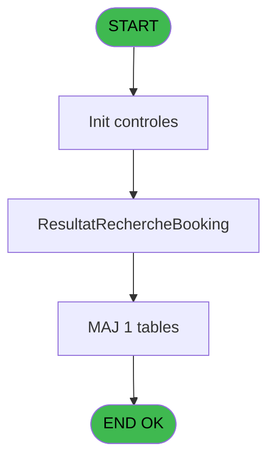
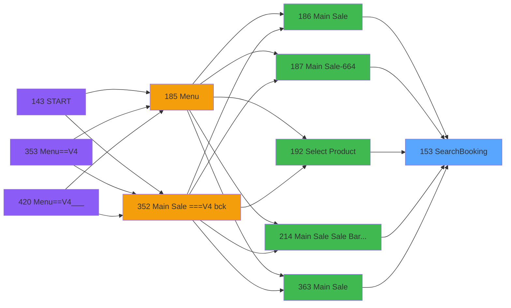
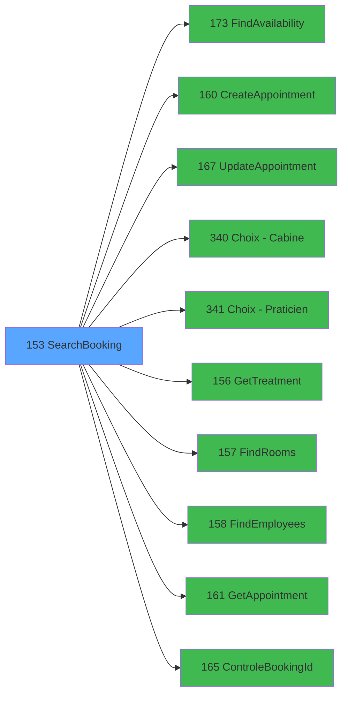

# PVE IDE 153 - SearchBooking

> **Analyse**: Phases 1-4 2026-02-03 09:46 -> 09:47 (21s) | Assemblage 09:47
> **Pipeline**: V7.2 Enrichi
> **Structure**: 4 onglets (Resume | Ecrans | Donnees | Connexions)

<!-- TAB:Resume -->

## 1. FICHE D'IDENTITE

| Attribut | Valeur |
|----------|--------|
| Projet | PVE |
| IDE Position | 153 |
| Nom Programme | SearchBooking |
| Fichier source | `Prg_153.xml` |
| Domaine metier | General |
| Taches | 9 (6 ecrans visibles) |
| Tables modifiees | 1 |
| Programmes appeles | 10 |

## 2. DESCRIPTION FONCTIONNELLE

**SearchBooking** assure la gestion complete de ce processus, accessible depuis [Main Sale (IDE 186)](PVE-IDE-186.md), [Main Sale-664 (IDE 187)](PVE-IDE-187.md), [Select Product (IDE 192)](PVE-IDE-192.md), [Main Sale Sale Bar Code (IDE 214)](PVE-IDE-214.md), [Main Sale (IDE 363)](PVE-IDE-363.md), [Main Sale-664 (IDE 364)](PVE-IDE-364.md), [Main Sale ===V4 Booking ACTUEL (IDE 417)](PVE-IDE-417.md), [Main Sale (IDE 440)](PVE-IDE-440.md).

Le flux de traitement s'organise en **1 blocs fonctionnels** :

- **Traitement** (9 taches) : traitements metier divers

**Donnees modifiees** : 1 tables en ecriture (pv_discount_reasons).

**Logique metier** : 1 regles identifiees couvrant conditions metier.

Detail : phases du traitement

#### Phase 1 : Traitement (9 taches)

- **153** - Search Booking **[[ECRAN]](#ecran-t1)**
- **153.1** - Results **[[ECRAN]](#ecran-t2)**
- **153.1.1** - (sans nom) **[[ECRAN]](#ecran-t3)**
- **153.1.1.1** - UpdateCustomer
- **153.1.2** - (sans nom) **[[ECRAN]](#ecran-t5)**
- **153.1.2.1** - (sans nom) **[[ECRAN]](#ecran-t6)**
- **153.1.2.2** - UpdateCustomer
- **153.1.3** - Jour1 **[[ECRAN]](#ecran-t8)**
- **153.2** - GetResultFromBooker

Delegue a : [FindAvailability (IDE 173)](PVE-IDE-173.md), [UpdateAppointment (IDE 167)](PVE-IDE-167.md), [GetTreatment (IDE 156)](PVE-IDE-156.md), [FindRooms (IDE 157)](PVE-IDE-157.md), [FindEmployees (IDE 158)](PVE-IDE-158.md), [GetAppointment (IDE 161)](PVE-IDE-161.md)

#### Tables impactees

| Table | Operations | Role metier |
|-------|-----------|-------------|
| pv_discount_reasons | R/**W** (3 usages) |  |

## 3. BLOCS FONCTIONNELS

### 3.1 Traitement (9 taches)

Traitements internes.

---

#### 153 - Search Booking [[ECRAN]](#ecran-t1)

**Role** : Tache d'orchestration : point d'entree du programme (9 sous-taches). Coordonne l'enchainement des traitements.
**Ecran** : 1106 x 248 DLU (Type6) | [Voir mockup](#ecran-t1)

8 sous-taches directes

| Tache | Nom | Bloc |
|-------|-----|------|
| [153.1](#t2) | Results **[[ECRAN]](#ecran-t2)** | Traitement |
| [153.1.1](#t3) | (sans nom) **[[ECRAN]](#ecran-t3)** | Traitement |
| [153.1.1.1](#t4) | UpdateCustomer | Traitement |
| [153.1.2](#t5) | (sans nom) **[[ECRAN]](#ecran-t5)** | Traitement |
| [153.1.2.1](#t6) | (sans nom) **[[ECRAN]](#ecran-t6)** | Traitement |
| [153.1.2.2](#t7) | UpdateCustomer | Traitement |
| [153.1.3](#t8) | Jour1 **[[ECRAN]](#ecran-t8)** | Traitement |
| [153.2](#t9) | GetResultFromBooker | Traitement |

**Variables liees** : E (P.BookingID), W (V.exitSearch), T (BookingNumber), U (BookingID)
**Delegue a** : [FindAvailability (IDE 173)](PVE-IDE-173.md), [UpdateAppointment (IDE 167)](PVE-IDE-167.md), [GetTreatment (IDE 156)](PVE-IDE-156.md)

---

#### 153.1 - Results [[ECRAN]](#ecran-t2)

**Role** : Traitement : Results.
**Ecran** : 1409 x 347 DLU (Type6) | [Voir mockup](#ecran-t2)
**Delegue a** : [FindAvailability (IDE 173)](PVE-IDE-173.md), [UpdateAppointment (IDE 167)](PVE-IDE-167.md), [GetTreatment (IDE 156)](PVE-IDE-156.md)

---

#### 153.1.1 - (sans nom) [[ECRAN]](#ecran-t3)

**Role** : Traitement interne.
**Ecran** : 441 x 310 DLU (MDI) | [Voir mockup](#ecran-t3)
**Delegue a** : [FindAvailability (IDE 173)](PVE-IDE-173.md), [UpdateAppointment (IDE 167)](PVE-IDE-167.md), [GetTreatment (IDE 156)](PVE-IDE-156.md)

---

#### 153.1.1.1 - UpdateCustomer

**Role** : Traitement : UpdateCustomer.
**Delegue a** : [FindAvailability (IDE 173)](PVE-IDE-173.md), [UpdateAppointment (IDE 167)](PVE-IDE-167.md), [GetTreatment (IDE 156)](PVE-IDE-156.md)

---

#### 153.1.2 - (sans nom) [[ECRAN]](#ecran-t5)

**Role** : Traitement interne.
**Ecran** : 872 x 311 DLU (Type6) | [Voir mockup](#ecran-t5)
**Delegue a** : [FindAvailability (IDE 173)](PVE-IDE-173.md), [UpdateAppointment (IDE 167)](PVE-IDE-167.md), [GetTreatment (IDE 156)](PVE-IDE-156.md)

---

#### 153.1.2.1 - (sans nom) [[ECRAN]](#ecran-t6)

**Role** : Traitement interne.
**Ecran** : 417 x 192 DLU (Modal) | [Voir mockup](#ecran-t6)
**Delegue a** : [FindAvailability (IDE 173)](PVE-IDE-173.md), [UpdateAppointment (IDE 167)](PVE-IDE-167.md), [GetTreatment (IDE 156)](PVE-IDE-156.md)

---

#### 153.1.2.2 - UpdateCustomer

**Role** : Traitement : UpdateCustomer.
**Delegue a** : [FindAvailability (IDE 173)](PVE-IDE-173.md), [UpdateAppointment (IDE 167)](PVE-IDE-167.md), [GetTreatment (IDE 156)](PVE-IDE-156.md)

---

#### 153.1.3 - Jour1 [[ECRAN]](#ecran-t8)

**Role** : Traitement : Jour1.
**Ecran** : 95 x 224 DLU | [Voir mockup](#ecran-t8)
**Delegue a** : [FindAvailability (IDE 173)](PVE-IDE-173.md), [UpdateAppointment (IDE 167)](PVE-IDE-167.md), [GetTreatment (IDE 156)](PVE-IDE-156.md)

---

#### 153.2 - GetResultFromBooker

**Role** : Consultation/chargement : GetResultFromBooker.
**Delegue a** : [FindAvailability (IDE 173)](PVE-IDE-173.md), [UpdateAppointment (IDE 167)](PVE-IDE-167.md), [GetTreatment (IDE 156)](PVE-IDE-156.md)

## 5. REGLES METIER

1 regles identifiees:

### Autres (1 regles)

#### [RM-001] Traitement conditionnel si [AT] est a zero

| Element | Detail |
|---------|--------|
| **Condition** | `[AT]=0` |
| **Si vrai** | '00:00:00'TIME |
| **Si faux** | IF([AT] = 1,'08:00:00'TIME,IF([AT]=2,'14:00:00'TIME,'19:00:00'TIME))) |
| **Expression source** | Expression 22 : `IF([AT]=0,'00:00:00'TIME,IF([AT] = 1,'08:00:00'TIME,IF([AT]=` |
| **Exemple** | Si [AT]=0 → '00:00:00'TIME |

## 6. CONTEXTE

- **Appele par**: [Main Sale (IDE 186)](PVE-IDE-186.md), [Main Sale-664 (IDE 187)](PVE-IDE-187.md), [Select Product (IDE 192)](PVE-IDE-192.md), [Main Sale Sale Bar Code (IDE 214)](PVE-IDE-214.md), [Main Sale (IDE 363)](PVE-IDE-363.md), [Main Sale-664 (IDE 364)](PVE-IDE-364.md), [Main Sale ===V4 Booking ACTUEL (IDE 417)](PVE-IDE-417.md), [Main Sale (IDE 440)](PVE-IDE-440.md)
- **Appelle**: 10 programmes | **Tables**: 9 (W:1 R:5 L:6) | **Taches**: 9 | **Expressions**: 39

<!-- TAB:Ecrans -->

## 8. ECRANS

### 8.1 Forms visibles (6 / 9)

| # | Position | Tache | Nom | Type | Largeur | Hauteur | Bloc |
|---|----------|-------|-----|------|---------|---------|------|
| 1 | 153 | 153 | Search Booking | Type6 | 1106 | 248 | Traitement |
| 2 | 153.1 | 153.1 | Results | Type6 | 1409 | 347 | Traitement |
| 3 | 153.1.1 | 153.1.1 | (sans nom) | MDI | 441 | 310 | Traitement |
| 4 | 153.1.2 | 153.1.2 | (sans nom) | Type6 | 872 | 311 | Traitement |
| 5 | 153.1.2.1 | 153.1.2.1 | (sans nom) | Modal | 417 | 192 | Traitement |
| 6 | 153.1.3 | 153.1.3 | Jour1 | Type0 | 95 | 224 | Traitement |

### 8.2 Mockups Ecrans

---

#### 153 - Search Booking
**Tache** : [153](#t1) | **Type** : Type6 | **Dimensions** : 1106 x 248 DLU
**Bloc** : Traitement | **Titre IDE** : Search Booking

<!-- FORM-DATA:
{
    "width":  1106,
    "vFactor":  8,
    "type":  "Type6",
    "hFactor":  8,
    "controls":  [
                     {
                         "x":  34,
                         "type":  "label",
                         "var":  "",
                         "y":  6,
                         "w":  442,
                         "fmt":  "",
                         "name":  "",
                         "h":  22,
                         "color":  "188",
                         "text":  "Name - First name",
                         "parent":  null
                     },
                     {
                         "x":  34,
                         "type":  "label",
                         "var":  "",
                         "y":  33,
                         "w":  442,
                         "fmt":  "",
                         "name":  "",
                         "h":  22,
                         "color":  "188",
                         "text":  "Treatement (Product)",
                         "parent":  null
                     },
                     {
                         "x":  34,
                         "type":  "label",
                         "var":  "",
                         "y":  78,
                         "w":  58,
                         "fmt":  "",
                         "name":  "",
                         "h":  11,
                         "color":  "189",
                         "text":  "Since",
                         "parent":  null
                     },
                     {
                         "x":  268,
                         "type":  "label",
                         "var":  "",
                         "y":  78,
                         "w":  30,
                         "fmt":  "",
                         "name":  "",
                         "h":  11,
                         "color":  "189",
                         "text":  "To",
                         "parent":  null
                     },
                     {
                         "x":  34,
                         "type":  "label",
                         "var":  "",
                         "y":  102,
                         "w":  150,
                         "fmt":  "",
                         "name":  "",
                         "h":  11,
                         "color":  "189",
                         "text":  "Time (Optional)",
                         "parent":  null
                     },
                     {
                         "x":  347,
                         "type":  "label",
                         "var":  "",
                         "y":  102,
                         "w":  114,
                         "fmt":  "",
                         "name":  "",
                         "h":  12,
                         "color":  "189",
                         "text":  "+/- 2 hours",
                         "parent":  null
                     },
                     {
                         "x":  34,
                         "type":  "label",
                         "var":  "",
                         "y":  155,
                         "w":  109,
                         "fmt":  "",
                         "name":  "",
                         "h":  11,
                         "color":  "189",
                         "text":  "Booking ID",
                         "parent":  null
                     },
                     {
                         "x":  608,
                         "type":  "label",
                         "var":  "",
                         "y":  70,
                         "w":  482,
                         "fmt":  "",
                         "name":  "",
                         "h":  96,
                         "color":  "189",
                         "text":  "Options",
                         "parent":  null
                     },
                     {
                         "x":  674,
                         "type":  "label",
                         "var":  "",
                         "y":  87,
                         "w":  102,
                         "fmt":  "",
                         "name":  "",
                         "h":  11,
                         "color":  "189",
                         "text":  "Employee",
                         "parent":  11
                     },
                     {
                         "x":  923,
                         "type":  "label",
                         "var":  "",
                         "y":  87,
                         "w":  62,
                         "fmt":  "",
                         "name":  "",
                         "h":  11,
                         "color":  "189",
                         "text":  "Room",
                         "parent":  11
                     },
                     {
                         "x":  108,
                         "type":  "edit",
                         "var":  "",
                         "y":  78,
                         "w":  144,
                         "fmt":  "",
                         "name":  "dateDebut",
                         "h":  12,
                         "color":  "110",
                         "text":  "",
                         "parent":  null
                     },
                     {
                         "x":  314,
                         "type":  "edit",
                         "var":  "",
                         "y":  78,
                         "w":  144,
                         "fmt":  "",
                         "name":  "dateFin",
                         "h":  12,
                         "color":  "110",
                         "text":  "",
                         "parent":  null
                     },
                     {
                         "x":  188,
                         "type":  "combobox",
                         "var":  "",
                         "y":  102,
                         "w":  112,
                         "fmt":  "",
                         "name":  "Heure",
                         "h":  12,
                         "color":  "",
                         "text":  "0,1,2,3",
                         "parent":  null
                     },
                     {
                         "x":  148,
                         "type":  "edit",
                         "var":  "",
                         "y":  154,
                         "w":  390,
                         "fmt":  "18Z",
                         "name":  "BookingID",
                         "h":  12,
                         "color":  "110",
                         "text":  "",
                         "parent":  null
                     },
                     {
                         "x":  637,
                         "type":  "button",
                         "var":  "",
                         "y":  106,
                         "w":  196,
                         "fmt":  "30",
                         "name":  "Praticien1",
                         "h":  20,
                         "color":  "",
                         "text":  "",
                         "parent":  11
                     },
                     {
                         "x":  869,
                         "type":  "button",
                         "var":  "",
                         "y":  106,
                         "w":  196,
                         "fmt":  "30",
                         "name":  "Cabine1",
                         "h":  20,
                         "color":  "",
                         "text":  "",
                         "parent":  11
                     },
                     {
                         "x":  314,
                         "type":  "checkbox",
                         "var":  "",
                         "y":  102,
                         "w":  37,
                         "fmt":  "",
                         "name":  "PlusOuMoins2Heures",
                         "h":  12,
                         "color":  "189",
                         "text":  "",
                         "parent":  null
                     },
                     {
                         "x":  749,
                         "type":  "button",
                         "var":  "",
                         "y":  215,
                         "w":  164,
                         "fmt":  "Quit",
                         "name":  "BtnQuit",
                         "h":  28,
                         "color":  "",
                         "text":  "",
                         "parent":  null
                     },
                     {
                         "x":  926,
                         "type":  "button",
                         "var":  "",
                         "y":  215,
                         "w":  164,
                         "fmt":  "Search",
                         "name":  "BtnSearch",
                         "h":  28,
                         "color":  "",
                         "text":  "",
                         "parent":  null
                     },
                     {
                         "x":  694,
                         "type":  "button",
                         "var":  "",
                         "y":  134,
                         "w":  83,
                         "fmt":  "Clear",
                         "name":  "Btn.RAZEmployee",
                         "h":  14,
                         "color":  "",
                         "text":  "",
                         "parent":  null
                     },
                     {
                         "x":  926,
                         "type":  "button",
                         "var":  "",
                         "y":  134,
                         "w":  83,
                         "fmt":  "Clear",
                         "name":  "Btn.RAZRoom",
                         "h":  14,
                         "color":  "",
                         "text":  "",
                         "parent":  null
                     }
                 ],
    "taskId":  "153",
    "height":  248
}
-->

<strong>Champs : 5 champs</strong>

| Pos (x,y) | Nom | Variable | Type |
|-----------|-----|----------|------|
| 108,78 | dateDebut | - | edit |
| 314,78 | dateFin | - | edit |
| 188,102 | Heure | - | combobox |
| 148,154 | BookingID | - | edit |
| 314,102 | PlusOuMoins2Heures | - | checkbox |

<strong>Boutons : 6 boutons</strong>

| Bouton | Pos (x,y) | Action |
|--------|-----------|--------|
| 30 | 637,106 | Bouton fonctionnel |
| 30 | 869,106 | Bouton fonctionnel |
| Quit | 749,215 | Bouton fonctionnel |
| Search | 926,215 | Ouvre la selection |
| Clear | 694,134 | Bouton fonctionnel |
| Clear | 926,134 | Bouton fonctionnel |

---

#### 153.1 - Results
**Tache** : [153.1](#t2) | **Type** : Type6 | **Dimensions** : 1409 x 347 DLU
**Bloc** : Traitement | **Titre IDE** : Results

<!-- FORM-DATA:
{
    "width":  1409,
    "vFactor":  8,
    "type":  "Type6",
    "hFactor":  8,
    "controls":  [
                     {
                         "x":  35,
                         "type":  "label",
                         "var":  "",
                         "y":  12,
                         "w":  442,
                         "fmt":  "",
                         "name":  "",
                         "h":  22,
                         "color":  "188",
                         "text":  "Name - First name",
                         "parent":  null
                     },
                     {
                         "x":  35,
                         "type":  "label",
                         "var":  "",
                         "y":  39,
                         "w":  442,
                         "fmt":  "",
                         "name":  "",
                         "h":  22,
                         "color":  "188",
                         "text":  "Treatement (Product)",
                         "parent":  null
                     },
                     {
                         "x":  1213,
                         "type":  "button",
                         "var":  "",
                         "y":  313,
                         "w":  164,
                         "fmt":  "Cancel",
                         "name":  "BtnCancel",
                         "h":  28,
                         "color":  "",
                         "text":  "",
                         "parent":  null
                     },
                     {
                         "x":  35,
                         "type":  "subform",
                         "var":  "",
                         "y":  83,
                         "w":  190,
                         "fmt":  "",
                         "name":  "Jour1",
                         "h":  218,
                         "color":  "",
                         "text":  "",
                         "parent":  null
                     },
                     {
                         "x":  227,
                         "type":  "subform",
                         "var":  "",
                         "y":  83,
                         "w":  190,
                         "fmt":  "",
                         "name":  "Jour2",
                         "h":  218,
                         "color":  "",
                         "text":  "",
                         "parent":  null
                     },
                     {
                         "x":  419,
                         "type":  "subform",
                         "var":  "",
                         "y":  83,
                         "w":  190,
                         "fmt":  "",
                         "name":  "Jour3",
                         "h":  218,
                         "color":  "",
                         "text":  "",
                         "parent":  null
                     },
                     {
                         "x":  611,
                         "type":  "subform",
                         "var":  "",
                         "y":  83,
                         "w":  190,
                         "fmt":  "",
                         "name":  "Jour4",
                         "h":  218,
                         "color":  "",
                         "text":  "",
                         "parent":  null
                     },
                     {
                         "x":  803,
                         "type":  "subform",
                         "var":  "",
                         "y":  83,
                         "w":  190,
                         "fmt":  "",
                         "name":  "Jour5",
                         "h":  218,
                         "color":  "",
                         "text":  "",
                         "parent":  null
                     },
                     {
                         "x":  995,
                         "type":  "subform",
                         "var":  "",
                         "y":  83,
                         "w":  190,
                         "fmt":  "",
                         "name":  "Jour6",
                         "h":  218,
                         "color":  "",
                         "text":  "",
                         "parent":  null
                     },
                     {
                         "x":  1187,
                         "type":  "subform",
                         "var":  "",
                         "y":  83,
                         "w":  190,
                         "fmt":  "",
                         "name":  "Jour7",
                         "h":  218,
                         "color":  "",
                         "text":  "",
                         "parent":  null
                     },
                     {
                         "x":  1213,
                         "type":  "button",
                         "var":  "",
                         "y":  66,
                         "w":  164,
                         "fmt":  "Next week \u003e",
                         "name":  "BtnNextWeek",
                         "h":  16,
                         "color":  "",
                         "text":  "",
                         "parent":  null
                     },
                     {
                         "x":  35,
                         "type":  "button",
                         "var":  "",
                         "y":  66,
                         "w":  164,
                         "fmt":  "\u003c Previous week",
                         "name":  "BtnPreviousWeek",
                         "h":  16,
                         "color":  "",
                         "text":  "",
                         "parent":  null
                     }
                 ],
    "taskId":  "153.1",
    "height":  347
}
-->

<strong>Boutons : 3 boutons</strong>

| Bouton | Pos (x,y) | Action |
|--------|-----------|--------|
| Cancel | 1213,313 | Annule et retour au menu |
| Next week > | 1213,66 | Bouton fonctionnel |
| < Previous week | 35,66 | Bouton fonctionnel |

---

#### 153.1.1 - (sans nom)
**Tache** : [153.1.1](#t3) | **Type** : MDI | **Dimensions** : 441 x 310 DLU
**Bloc** : Traitement | **Titre IDE** : (sans nom)

<!-- FORM-DATA:
{
    "width":  441,
    "vFactor":  8,
    "type":  "MDI",
    "hFactor":  4,
    "controls":  [
                     {
                         "x":  20,
                         "type":  "label",
                         "var":  "",
                         "y":  53,
                         "w":  53,
                         "fmt":  "",
                         "name":  "",
                         "h":  11,
                         "color":  "183",
                         "text":  "Practitoner",
                         "parent":  null
                     },
                     {
                         "x":  207,
                         "type":  "label",
                         "var":  "",
                         "y":  53,
                         "w":  152,
                         "fmt":  "",
                         "name":  "",
                         "h":  13,
                         "color":  "183",
                         "text":  "Cabine",
                         "parent":  null
                     },
                     {
                         "x":  0,
                         "type":  "label",
                         "var":  "",
                         "y":  0,
                         "w":  440,
                         "fmt":  "",
                         "name":  "",
                         "h":  42,
                         "color":  "182",
                         "text":  "",
                         "parent":  null
                     },
                     {
                         "x":  14,
                         "type":  "label",
                         "var":  "",
                         "y":  15,
                         "w":  259,
                         "fmt":  "",
                         "name":  "",
                         "h":  10,
                         "color":  "186",
                         "text":  "Select a practitioner and a cabine",
                         "parent":  3
                     },
                     {
                         "x":  12,
                         "type":  "table",
                         "var":  "",
                         "name":  "",
                         "titleH":  12,
                         "color":  "110",
                         "w":  373,
                         "y":  68,
                         "fmt":  "",
                         "parent":  null,
                         "text":  "",
                         "rowH":  24,
                         "h":  191,
                         "cols":  [
                                      {
                                          "title":  "",
                                          "layer":  1,
                                          "w":  225
                                      },
                                      {
                                          "title":  "",
                                          "layer":  2,
                                          "w":  142
                                      }
                                  ],
                         "rows":  2
                     },
                     {
                         "x":  0,
                         "type":  "label",
                         "var":  "",
                         "y":  276,
                         "w":  440,
                         "fmt":  "",
                         "name":  "",
                         "h":  34,
                         "color":  "6",
                         "text":  "",
                         "parent":  null
                     },
                     {
                         "x":  18,
                         "type":  "edit",
                         "var":  "",
                         "y":  82,
                         "w":  213,
                         "fmt":  "",
                         "name":  "label",
                         "h":  20,
                         "color":  "110",
                         "text":  "",
                         "parent":  6
                     },
                     {
                         "x":  392,
                         "type":  "image",
                         "var":  "",
                         "y":  4,
                         "w":  48,
                         "fmt":  "",
                         "name":  "",
                         "h":  37,
                         "color":  "",
                         "text":  "",
                         "parent":  3
                     },
                     {
                         "x":  385,
                         "type":  "button",
                         "var":  "",
                         "y":  68,
                         "w":  44,
                         "fmt":  "ñ",
                         "name":  "",
                         "h":  94,
                         "color":  "",
                         "text":  "",
                         "parent":  null
                     },
                     {
                         "x":  385,
                         "type":  "button",
                         "var":  "",
                         "y":  162,
                         "w":  44,
                         "fmt":  "ò",
                         "name":  "",
                         "h":  98,
                         "color":  "",
                         "text":  "",
                         "parent":  null
                     },
                     {
                         "x":  287,
                         "type":  "button",
                         "var":  "",
                         "y":  281,
                         "w":  77,
                         "fmt":  "\u0026Select",
                         "name":  "BtnSelect",
                         "h":  28,
                         "color":  "",
                         "text":  "",
                         "parent":  null
                     },
                     {
                         "x":  363,
                         "type":  "button",
                         "var":  "",
                         "y":  281,
                         "w":  77,
                         "fmt":  "\u0026Exit",
                         "name":  "",
                         "h":  28,
                         "color":  "",
                         "text":  "",
                         "parent":  null
                     },
                     {
                         "x":  242,
                         "type":  "edit",
                         "var":  "",
                         "y":  83,
                         "w":  135,
                         "fmt":  "",
                         "name":  "CabineLibbelle",
                         "h":  20,
                         "color":  "110",
                         "text":  "",
                         "parent":  6
                     }
                 ],
    "taskId":  "153.1.1",
    "height":  310
}
-->

<strong>Champs : 2 champs</strong>

| Pos (x,y) | Nom | Variable | Type |
|-----------|-----|----------|------|
| 18,82 | label | - | edit |
| 242,83 | CabineLibbelle | - | edit |

<strong>Boutons : 4 boutons</strong>

| Bouton | Pos (x,y) | Action |
|--------|-----------|--------|
| ñ | 385,68 | Bouton fonctionnel |
| ò | 385,162 | Bouton fonctionnel |
| Select | 287,281 | Ouvre la selection |
| Exit | 363,281 | Quitte le programme |

---

#### 153.1.2 - (sans nom)
**Tache** : [153.1.2](#t5) | **Type** : Type6 | **Dimensions** : 872 x 311 DLU
**Bloc** : Traitement | **Titre IDE** : (sans nom)

<!-- FORM-DATA:
{
    "width":  872,
    "vFactor":  8,
    "type":  "Type6",
    "hFactor":  4,
    "controls":  [
                     {
                         "x":  25,
                         "type":  "label",
                         "var":  "",
                         "y":  53,
                         "w":  53,
                         "fmt":  "",
                         "name":  "",
                         "h":  11,
                         "color":  "183",
                         "text":  "Practitoner",
                         "parent":  null
                     },
                     {
                         "x":  450,
                         "type":  "label",
                         "var":  "",
                         "y":  53,
                         "w":  152,
                         "fmt":  "",
                         "name":  "",
                         "h":  13,
                         "color":  "183",
                         "text":  "Room",
                         "parent":  null
                     },
                     {
                         "x":  0,
                         "type":  "label",
                         "var":  "",
                         "y":  0,
                         "w":  872,
                         "fmt":  "",
                         "name":  "",
                         "h":  42,
                         "color":  "182",
                         "text":  "",
                         "parent":  null
                     },
                     {
                         "x":  14,
                         "type":  "label",
                         "var":  "",
                         "y":  15,
                         "w":  259,
                         "fmt":  "",
                         "name":  "",
                         "h":  10,
                         "color":  "186",
                         "text":  "Select a practitioner and a room",
                         "parent":  3
                     },
                     {
                         "x":  17,
                         "type":  "table",
                         "var":  "",
                         "name":  "",
                         "titleH":  12,
                         "color":  "110",
                         "w":  373,
                         "y":  68,
                         "fmt":  "",
                         "parent":  null,
                         "text":  "",
                         "rowH":  24,
                         "h":  191,
                         "cols":  [
                                      {
                                          "title":  "",
                                          "layer":  1,
                                          "w":  368
                                      }
                                  ],
                         "rows":  1
                     },
                     {
                         "x":  0,
                         "type":  "label",
                         "var":  "",
                         "y":  276,
                         "w":  872,
                         "fmt":  "",
                         "name":  "",
                         "h":  34,
                         "color":  "6",
                         "text":  "",
                         "parent":  null
                     },
                     {
                         "x":  824,
                         "type":  "image",
                         "var":  "",
                         "y":  4,
                         "w":  48,
                         "fmt":  "",
                         "name":  "",
                         "h":  37,
                         "color":  "",
                         "text":  "",
                         "parent":  3
                     },
                     {
                         "x":  20,
                         "type":  "edit",
                         "var":  "",
                         "y":  71,
                         "w":  361,
                         "fmt":  "",
                         "name":  "CabineLibbelle",
                         "h":  20,
                         "color":  "110",
                         "text":  "",
                         "parent":  6
                     },
                     {
                         "x":  390,
                         "type":  "button",
                         "var":  "",
                         "y":  68,
                         "w":  44,
                         "fmt":  "ñ",
                         "name":  "",
                         "h":  94,
                         "color":  "",
                         "text":  "",
                         "parent":  null
                     },
                     {
                         "x":  439,
                         "type":  "subform",
                         "var":  "",
                         "y":  70,
                         "w":  417,
                         "fmt":  "",
                         "name":  "Choix Cabine",
                         "h":  192,
                         "color":  "",
                         "text":  "",
                         "parent":  null
                     },
                     {
                         "x":  390,
                         "type":  "button",
                         "var":  "",
                         "y":  162,
                         "w":  44,
                         "fmt":  "ò",
                         "name":  "",
                         "h":  98,
                         "color":  "",
                         "text":  "",
                         "parent":  null
                     },
                     {
                         "x":  699,
                         "type":  "button",
                         "var":  "",
                         "y":  281,
                         "w":  77,
                         "fmt":  "\u0026Select",
                         "name":  "BtnSelect",
                         "h":  28,
                         "color":  "",
                         "text":  "",
                         "parent":  null
                     },
                     {
                         "x":  779,
                         "type":  "button",
                         "var":  "",
                         "y":  281,
                         "w":  77,
                         "fmt":  "\u0026Exit",
                         "name":  "",
                         "h":  28,
                         "color":  "",
                         "text":  "",
                         "parent":  null
                     }
                 ],
    "taskId":  "153.1.2",
    "height":  311
}
-->

<strong>Champs : 1 champs</strong>

| Pos (x,y) | Nom | Variable | Type |
|-----------|-----|----------|------|
| 20,71 | CabineLibbelle | - | edit |

<strong>Boutons : 4 boutons</strong>

| Bouton | Pos (x,y) | Action |
|--------|-----------|--------|
| ñ | 390,68 | Bouton fonctionnel |
| ò | 390,162 | Bouton fonctionnel |
| Select | 699,281 | Ouvre la selection |
| Exit | 779,281 | Quitte le programme |

---

#### 153.1.2.1 - (sans nom)
**Tache** : [153.1.2.1](#t6) | **Type** : Modal | **Dimensions** : 417 x 192 DLU
**Bloc** : Traitement | **Titre IDE** : (sans nom)

<!-- FORM-DATA:
{
    "width":  417,
    "vFactor":  8,
    "type":  "Modal",
    "hFactor":  4,
    "controls":  [
                     {
                         "x":  0,
                         "type":  "table",
                         "var":  "",
                         "name":  "",
                         "titleH":  12,
                         "color":  "110",
                         "w":  373,
                         "y":  0,
                         "fmt":  "",
                         "parent":  null,
                         "text":  "",
                         "rowH":  24,
                         "h":  191,
                         "cols":  [
                                      {
                                          "title":  "",
                                          "layer":  1,
                                          "w":  369
                                      }
                                  ],
                         "rows":  1
                     },
                     {
                         "x":  373,
                         "type":  "button",
                         "var":  "",
                         "y":  0,
                         "w":  44,
                         "fmt":  "ñ",
                         "name":  "",
                         "h":  94,
                         "color":  "",
                         "text":  "",
                         "parent":  null
                     },
                     {
                         "x":  373,
                         "type":  "button",
                         "var":  "",
                         "y":  94,
                         "w":  44,
                         "fmt":  "ò",
                         "name":  "",
                         "h":  98,
                         "color":  "",
                         "text":  "",
                         "parent":  null
                     },
                     {
                         "x":  3,
                         "type":  "edit",
                         "var":  "",
                         "y":  2,
                         "w":  362,
                         "fmt":  "",
                         "name":  "CabineLibbelle",
                         "h":  20,
                         "color":  "110",
                         "text":  "",
                         "parent":  1
                     }
                 ],
    "taskId":  "153.1.2.1",
    "height":  192
}
-->

<strong>Champs : 1 champs</strong>

| Pos (x,y) | Nom | Variable | Type |
|-----------|-----|----------|------|
| 3,2 | CabineLibbelle | - | edit |

<strong>Boutons : 2 boutons</strong>

| Bouton | Pos (x,y) | Action |
|--------|-----------|--------|
| ñ | 373,0 | Bouton fonctionnel |
| ò | 373,94 | Bouton fonctionnel |

---

#### 153.1.3 - Jour1
**Tache** : [153.1.3](#t8) | **Type** : Type0 | **Dimensions** : 95 x 224 DLU
**Bloc** : Traitement | **Titre IDE** : Jour1

<!-- FORM-DATA:
{
    "width":  95,
    "vFactor":  8,
    "type":  "Type0",
    "hFactor":  4,
    "controls":  [
                     {
                         "x":  0,
                         "type":  "table",
                         "var":  "",
                         "name":  "",
                         "titleH":  16,
                         "color":  "183",
                         "w":  97,
                         "y":  0,
                         "fmt":  "",
                         "parent":  null,
                         "text":  "",
                         "rowH":  25,
                         "h":  224,
                         "cols":  [
                                      {
                                          "title":  "jour 1",
                                          "layer":  1,
                                          "w":  80
                                      }
                                  ],
                         "rows":  1
                     },
                     {
                         "x":  5,
                         "type":  "button",
                         "var":  "",
                         "y":  16,
                         "w":  72,
                         "fmt":  "",
                         "name":  "Horaire",
                         "h":  24,
                         "color":  "7",
                         "text":  "",
                         "parent":  1
                     }
                 ],
    "taskId":  "153.1.3",
    "height":  224
}
-->

<strong>Boutons : 1 boutons</strong>

| Bouton | Pos (x,y) | Action |
|--------|-----------|--------|
| Horaire | 5,16 | Bouton fonctionnel |

## 9. NAVIGATION

### 9.1 Enchainement des ecrans

```mermaid
flowchart TD
    START([Entree])
    style START fill:#3fb950
    VF1[153 Search Booking]
    style VF1 fill:#58a6ff
    VF2[153.1 Results]
    style VF2 fill:#58a6ff
    VF3[153.1.1 sans nom]
    style VF3 fill:#58a6ff
    VF5[153.1.2 sans nom]
    style VF5 fill:#58a6ff
    VF6[153.1.2.1 sans nom]
    style VF6 fill:#58a6ff
    VF8[153.1.3 Jour1]
    style VF8 fill:#58a6ff
    EXT173[IDE 173 FindAvailability]
    style EXT173 fill:#3fb950
    EXT160[IDE 160 CreateAppointment]
    style EXT160 fill:#3fb950
    EXT167[IDE 167 UpdateAppointment]
    style EXT167 fill:#3fb950
    EXT340[IDE 340 Choix - Cabine]
    style EXT340 fill:#3fb950
    EXT341[IDE 341 Choix - Praticien]
    style EXT341 fill:#3fb950
    EXT156[IDE 156 GetTreatment]
    style EXT156 fill:#3fb950
    EXT157[IDE 157 FindRooms]
    style EXT157 fill:#3fb950
    EXT158[IDE 158 FindEmployees]
    style EXT158 fill:#3fb950
    EXT161[IDE 161 GetAppointment]
    style EXT161 fill:#3fb950
    EXT165[IDE 165 ControleBookingId]
    style EXT165 fill:#3fb950
    FIN([Sortie])
    style FIN fill:#f85149
    START --> VF1
    VF1 -->|Sous-programme| EXT173
    VF1 -->|Sous-programme| EXT160
    VF1 -->|Mise a jour donnees| EXT167
    VF1 -->|Selection/consultation| EXT340
    VF1 -->|Selection/consultation| EXT341
    VF1 -->|Recuperation donnees| EXT156
    VF1 -->|Sous-programme| EXT157
    VF1 -->|Sous-programme| EXT158
    EXT165 --> FIN
```

**Detail par enchainement :**

| Depuis | Action | Vers | Retour |
|--------|--------|------|--------|
| Search Booking | Sous-programme | [FindAvailability (IDE 173)](PVE-IDE-173.md) | Retour ecran |
| Search Booking | Sous-programme | [CreateAppointment (IDE 160)](PVE-IDE-160.md) | Retour ecran |
| Search Booking | Mise a jour donnees | [UpdateAppointment (IDE 167)](PVE-IDE-167.md) | Retour ecran |
| Search Booking | Selection/consultation | [Choix - Cabine (IDE 340)](PVE-IDE-340.md) | Retour ecran |
| Search Booking | Selection/consultation | [Choix - Praticien (IDE 341)](PVE-IDE-341.md) | Retour ecran |
| Search Booking | Recuperation donnees | [GetTreatment (IDE 156)](PVE-IDE-156.md) | Retour ecran |
| Search Booking | Sous-programme | [FindRooms (IDE 157)](PVE-IDE-157.md) | Retour ecran |
| Search Booking | Sous-programme | [FindEmployees (IDE 158)](PVE-IDE-158.md) | Retour ecran |
| Search Booking | Recuperation donnees | [GetAppointment (IDE 161)](PVE-IDE-161.md) | Retour ecran |
| Search Booking | Controle/validation | [ControleBookingId (IDE 165)](PVE-IDE-165.md) | Retour ecran |

### 9.3 Structure hierarchique (9 taches)

| Position | Tache | Type | Dimensions | Bloc |
|----------|-------|------|------------|------|
| **153.1** | [**Search Booking** (153)](#t1) [mockup](#ecran-t1) | Type6 | 1106x248 | Traitement |
| 153.1.1 | [Results (153.1)](#t2) [mockup](#ecran-t2) | Type6 | 1409x347 | |
| 153.1.2 | [(sans nom) (153.1.1)](#t3) [mockup](#ecran-t3) | MDI | 441x310 | |
| 153.1.3 | [UpdateCustomer (153.1.1.1)](#t4) | - | - | |
| 153.1.4 | [(sans nom) (153.1.2)](#t5) [mockup](#ecran-t5) | Type6 | 872x311 | |
| 153.1.5 | [(sans nom) (153.1.2.1)](#t6) [mockup](#ecran-t6) | Modal | 417x192 | |
| 153.1.6 | [UpdateCustomer (153.1.2.2)](#t7) | - | - | |
| 153.1.7 | [Jour1 (153.1.3)](#t8) [mockup](#ecran-t8) | - | 95x224 | |
| 153.1.8 | [GetResultFromBooker (153.2)](#t9) | - | - | |

### 9.4 Algorigramme

> **Legende**: Vert = START/END OK | Rouge = END KO | Bleu = Decisions
> *Algorigramme auto-genere. Utiliser `/algorigramme` pour une synthese metier detaillee.*

<!-- TAB:Donnees -->

## 10. TABLES

### Tables utilisees (9)

| ID | Nom | Description | Type | R | W | L | Usages |
|----|-----|-------------|------|---|---|---|--------|
| 382 | pv_discount_reasons |  | DB | R | **W** |   | 3 |
| 400 | pv_cust_rentals |  | DB |   |   | L | 1 |
| 403 | pv_sellers |  | DB |   |   | L | 1 |
| 1539 | Table_1539 |  | MEM |   |   | L | 1 |
| 1545 | Table_1545 |  | MEM | R |   | L | 2 |
| 1546 | Table_1546 |  | MEM |   |   | L | 2 |
| 1549 | Table_1549 |  | MEM | R |   | L | 2 |
| 1558 | Table_1558 |  | MEM | R |   |   | 1 |
| 1559 | Table_1559 |  | MEM | R |   |   | 1 |

### Colonnes par table (5 / 5 tables avec colonnes identifiees)

Table 382 - pv_discount_reasons (R/**W**) - 3 usages

| Lettre | Variable | Acces | Type |
|--------|----------|-------|------|
| A | P.CustID | W | Numeric |
| B | P.PackageID | W | Numeric |
| C | P.DebutSejour | W | Date |
| D | P.FinSejour | W | Date |
| E | P.BookingID | W | Unicode |
| F | P.OrderID | W | Numeric |
| G | P.QuitClicked | W | Logical |
| H | P.Id_booker | W | Numeric |
| I | Praticien1ID | W | Numeric |
| J | Praticien2ID | W | Numeric |
| K | Cabine1ID | W | Numeric |
| L | Cabine2ID | W | Numeric |
| M | Exists? | W | Logical |
| N | dateDebut | W | Date |
| O | dateFin | W | Date |
| P | Matin_Midi_Soir? | W | Numeric |
| Q | TimeDebut | W | Time |
| R | TimeFin | W | Time |
| S | PlusOuMoins2Heures | W | Logical |
| T | BookingNumber | W | Numeric |
| U | BookingID | W | Unicode |
| V | BookindIDIsOK | W | Logical |
| W | V.exitSearch | W | Logical |
| X | Btn.RAZEmployee | W | Alpha |
| Y | Btn.RAZRoom | W | Alpha |
| Z | V.OrderID | W | Numeric |

Table 1545 - Table_1545 (R/L) - 2 usages

| Lettre | Variable | Acces | Type |
|--------|----------|-------|------|
| A | PraticienName | R | Unicode |
| B | V.BookingID | R | Unicode |
| C | V.OrderID | R | Numeric |
| D | V.BookerCustID | R | Numeric |
| E | BtnSelect | R | Alpha |

Table 1549 - Table_1549 (R/L) - 2 usages

| Lettre | Variable | Acces | Type |
|--------|----------|-------|------|
| A | DateJour | R | Date |
| B | TimeString | R | Unicode |

Table 1558 - Table_1558 (R) - 1 usages

*Table utilisee uniquement en Link ou aucune colonne Real identifiee dans le DataView.*

Table 1559 - Table_1559 (R) - 1 usages

| Lettre | Variable | Acces | Type |
|--------|----------|-------|------|
| A | PraticienName | R | Unicode |
| B | CabineSelected | R | Numeric |
| C | V.BookingID | R | Unicode |
| D | V.OrderID | R | Numeric |
| E | V.BookerCustID | R | Numeric |
| F | BtnSelect | R | Alpha |
| G | V.RecoveryTime | R | Numeric |

## 11. VARIABLES

### 11.1 Parametres entrants (8)

Variables recues du programme appelant ([Main Sale (IDE 186)](PVE-IDE-186.md)).

| Lettre | Nom | Type | Usage dans |
|--------|-----|------|-----------|
| A | P.CustID | Numeric | 1x parametre entrant |
| B | P.PackageID | Numeric | 1x parametre entrant |
| C | P.DebutSejour | Date | - |
| D | P.FinSejour | Date | 2x parametre entrant |
| E | P.BookingID | Unicode | - |
| F | P.OrderID | Numeric | - |
| G | P.QuitClicked | Logical | - |
| H | P.Id_booker | Numeric | - |

### 11.2 Variables de session (2)

Variables persistantes pendant toute la session.

| Lettre | Nom | Type | Usage dans |
|--------|-----|------|-----------|
| W | V.exitSearch | Logical | 1x session |
| Z | V.OrderID | Numeric | - |

### 11.3 Autres (16)

Variables diverses.

| Lettre | Nom | Type | Usage dans |
|--------|-----|------|-----------|
| I | Praticien1ID | Numeric | - |
| J | Praticien2ID | Numeric | - |
| K | Cabine1ID | Numeric | - |
| L | Cabine2ID | Numeric | 1x refs |
| M | Exists? | Logical | 1x refs |
| N | dateDebut | Date | 1x refs |
| O | dateFin | Date | 1x refs |
| P | Matin_Midi_Soir? | Numeric | - |
| Q | TimeDebut | Time | - |
| R | TimeFin | Time | - |
| S | PlusOuMoins2Heures | Logical | - |
| T | BookingNumber | Numeric | 1x refs |
| U | BookingID | Unicode | 1x refs |
| V | BookindIDIsOK | Logical | 1x refs |
| X | Btn.RAZEmployee | Alpha | 1x refs |
| Y | Btn.RAZRoom | Alpha | 1x refs |

Toutes les 26 variables (liste complete)

| Cat | Lettre | Nom Variable | Type |
|-----|--------|--------------|------|
| P0 | **A** | P.CustID | Numeric |
| P0 | **B** | P.PackageID | Numeric |
| P0 | **C** | P.DebutSejour | Date |
| P0 | **D** | P.FinSejour | Date |
| P0 | **E** | P.BookingID | Unicode |
| P0 | **F** | P.OrderID | Numeric |
| P0 | **G** | P.QuitClicked | Logical |
| P0 | **H** | P.Id_booker | Numeric |
| V. | **W** | V.exitSearch | Logical |
| V. | **Z** | V.OrderID | Numeric |
| Autre | **I** | Praticien1ID | Numeric |
| Autre | **J** | Praticien2ID | Numeric |
| Autre | **K** | Cabine1ID | Numeric |
| Autre | **L** | Cabine2ID | Numeric |
| Autre | **M** | Exists? | Logical |
| Autre | **N** | dateDebut | Date |
| Autre | **O** | dateFin | Date |
| Autre | **P** | Matin_Midi_Soir? | Numeric |
| Autre | **Q** | TimeDebut | Time |
| Autre | **R** | TimeFin | Time |
| Autre | **S** | PlusOuMoins2Heures | Logical |
| Autre | **T** | BookingNumber | Numeric |
| Autre | **U** | BookingID | Unicode |
| Autre | **V** | BookindIDIsOK | Logical |
| Autre | **X** | Btn.RAZEmployee | Alpha |
| Autre | **Y** | Btn.RAZRoom | Alpha |

## 12. EXPRESSIONS

**39 / 39 expressions decodees (100%)**

### 12.1 Repartition par type

| Type | Expressions | Regles |
|------|-------------|--------|
| CONCATENATION | 1 | 0 |
| CONDITION | 8 | 5 |
| CONSTANTE | 4 | 0 |
| DATE | 1 | 0 |
| FORMAT | 2 | 0 |
| OTHER | 20 | 0 |
| CAST_LOGIQUE | 1 | 0 |
| STRING | 2 | 0 |

### 12.2 Expressions cles par type

#### CONCATENATION (1 expressions)

| Type | IDE | Expression | Regle |
|------|-----|------------|-------|
| CONCATENATION | 5 | `Trim(BookingNumber [T]) & ' - ' & Trim(BookingID [U])` | - |

#### CONDITION (8 expressions)

| Type | IDE | Expression | Regle |
|------|-----|------------|-------|
| CONDITION | 22 | `IF([AT]=0,'00:00:00'TIME,IF([AT] = 1,'08:00:00'TIME,IF([AT]=2,'14:00:00'TIME,'19:00:00'TIME)))` | [RM-001](#rm-RM-001) |
| CONDITION | 25 | `[AX] = 0` | - |
| CONDITION | 9 | `Trim(GetParam('SERVICE')) = 'ESTH'` | - |
| CONDITION | 37 | `[AO] AND Trim([AQ]) <> ''` | - |
| CONDITION | 13 | `[AS] > P.FinSejour [D]` | - |
| ... | | *+3 autres* | |

#### CONSTANTE (4 expressions)

| Type | IDE | Expression | Regle |
|------|-----|------------|-------|
| CONSTANTE | 38 | `'This Booking Id is already used for another sale.'` | - |
| CONSTANTE | 39 | `0` | - |
| CONSTANTE | 7 | `'End date cannot be lesser than the start date.'` | - |
| CONSTANTE | 8 | `'End date cannot be greater than the start date of more than 7 days'` | - |

#### DATE (1 expressions)

| Type | IDE | Expression | Regle |
|------|-----|------------|-------|
| DATE | 4 | `Date()` | - |

#### FORMAT (2 expressions)

| Type | IDE | Expression | Regle |
|------|-----|------------|-------|
| FORMAT | 24 | `Str([AX],'18')` | - |
| FORMAT | 12 | `'End date must be lesser than the end of stay date ('& DStr(P.FinSejour [D],'DD/MM/YYYY')&')'` | - |

#### OTHER (20 expressions)

| Type | IDE | Expression | Regle |
|------|-----|------------|-------|
| OTHER | 28 | `[AZ]` | - |
| OTHER | 29 | `SetCrsr(2)` | - |
| OTHER | 27 | `[BD]` | - |
| OTHER | 21 | `Btn.RAZRoom [Y]` | - |
| OTHER | 26 | `[AY]` | - |
| ... | | *+15 autres* | |

#### CAST_LOGIQUE (1 expressions)

| Type | IDE | Expression | Regle |
|------|-----|------------|-------|
| CAST_LOGIQUE | 35 | `'TRUE'LOG` | - |

#### STRING (2 expressions)

| Type | IDE | Expression | Regle |
|------|-----|------------|-------|
| STRING | 36 | `Trim([AY])` | - |
| STRING | 6 | `Trim(Exists? [M])` | - |

### 12.3 Toutes les expressions (39)

Voir les 39 expressions

#### CONCATENATION (1)

| IDE | Expression Decodee |
|-----|-------------------|
| 5 | `Trim(BookingNumber [T]) & ' - ' & Trim(BookingID [U])` |

#### CONDITION (8)

| IDE | Expression Decodee |
|-----|-------------------|
| 11 | `[AS] > [AR] + 7` |
| 22 | `IF([AT]=0,'00:00:00'TIME,IF([AT] = 1,'08:00:00'TIME,IF([AT]=2,'14:00:00'TIME,'19:00:00'TIME)))` |
| 23 | `IF([AT]=0,'23:59:59'TIME,IF([AT]=1,'13:00:00'TIME,IF([AT]=2,'18:00:00'TIME,'22:00:00'TIME)))` |
| 10 | `[AS] < [AR]` |
| 13 | `[AS] > P.FinSejour [D]` |
| 25 | `[AX] = 0` |
| 9 | `Trim(GetParam('SERVICE')) = 'ESTH'` |
| 37 | `[AO] AND Trim([AQ]) <> ''` |

#### CONSTANTE (4)

| IDE | Expression Decodee |
|-----|-------------------|
| 7 | `'End date cannot be lesser than the start date.'` |
| 8 | `'End date cannot be greater than the start date of more than 7 days'` |
| 38 | `'This Booking Id is already used for another sale.'` |
| 39 | `0` |

#### DATE (1)

| IDE | Expression Decodee |
|-----|-------------------|
| 4 | `Date()` |

#### FORMAT (2)

| IDE | Expression Decodee |
|-----|-------------------|
| 12 | `'End date must be lesser than the end of stay date ('& DStr(P.FinSejour [D],'DD/MM/YYYY')&')'` |
| 24 | `Str([AX],'18')` |

#### OTHER (20)

| IDE | Expression Decodee |
|-----|-------------------|
| 1 | `GetParam('SERVICE')` |
| 2 | `P.CustID [A]` |
| 3 | `P.PackageID [B]` |
| 14 | `[BA]` |
| 15 | `dateDebut [N]` |
| 16 | `dateFin [O]` |
| 17 | `Cabine2ID [L]` |
| 18 | `BookindIDIsOK [V]` |
| 19 | `V.exitSearch [W]` |
| 20 | `Btn.RAZEmployee [X]` |
| 21 | `Btn.RAZRoom [Y]` |
| 26 | `[AY]` |
| 27 | `[BD]` |
| 28 | `[AZ]` |
| 29 | `SetCrsr(2)` |
| 30 | `SetCrsr(1)` |
| 31 | `[AR]` |
| 32 | `DbDel('{1548,3}'DSOURCE,'')` |
| 33 | `[AR]` |
| 34 | `[AS]` |

#### CAST_LOGIQUE (1)

| IDE | Expression Decodee |
|-----|-------------------|
| 35 | `'TRUE'LOG` |

#### STRING (2)

| IDE | Expression Decodee |
|-----|-------------------|
| 6 | `Trim(Exists? [M])` |
| 36 | `Trim([AY])` |

<!-- TAB:Connexions -->

## 13. GRAPHE D'APPELS

### 13.1 Chaine depuis Main (Callers)

Main -> ... -> [Main Sale (IDE 186)](PVE-IDE-186.md) -> **SearchBooking (IDE 153)**

Main -> ... -> [Main Sale-664 (IDE 187)](PVE-IDE-187.md) -> **SearchBooking (IDE 153)**

Main -> ... -> [Select Product (IDE 192)](PVE-IDE-192.md) -> **SearchBooking (IDE 153)**

Main -> ... -> [Main Sale Sale Bar Code (IDE 214)](PVE-IDE-214.md) -> **SearchBooking (IDE 153)**

Main -> ... -> [Main Sale (IDE 363)](PVE-IDE-363.md) -> **SearchBooking (IDE 153)**

Main -> ... -> [Main Sale-664 (IDE 364)](PVE-IDE-364.md) -> **SearchBooking (IDE 153)**

Main -> ... -> [Main Sale ===V4 Booking ACTUEL (IDE 417)](PVE-IDE-417.md) -> **SearchBooking (IDE 153)**

Main -> ... -> [Main Sale (IDE 440)](PVE-IDE-440.md) -> **SearchBooking (IDE 153)**

### 13.2 Callers

| IDE | Nom Programme | Nb Appels |
|-----|---------------|-----------|
| [186](PVE-IDE-186.md) | Main Sale | 1 |
| [187](PVE-IDE-187.md) | Main Sale-664 | 1 |
| [192](PVE-IDE-192.md) | Select Product | 1 |
| [214](PVE-IDE-214.md) | Main Sale Sale Bar Code | 1 |
| [363](PVE-IDE-363.md) | Main Sale | 1 |
| [364](PVE-IDE-364.md) | Main Sale-664 | 1 |
| [417](PVE-IDE-417.md) | Main Sale ===V4 Booking ACTUEL | 1 |
| [440](PVE-IDE-440.md) | Main Sale | 1 |

### 13.3 Callees (programmes appeles)

### 13.4 Detail Callees avec contexte

| IDE | Nom Programme | Appels | Contexte |
|-----|---------------|--------|----------|
| [173](PVE-IDE-173.md) | FindAvailability | 4 | Sous-programme |
| [160](PVE-IDE-160.md) | CreateAppointment | 2 | Sous-programme |
| [167](PVE-IDE-167.md) | UpdateAppointment | 2 | Mise a jour donnees |
| [340](PVE-IDE-340.md) | Choix - Cabine | 2 | Selection/consultation |
| [341](PVE-IDE-341.md) | Choix - Praticien | 2 | Selection/consultation |
| [156](PVE-IDE-156.md) | GetTreatment | 1 | Recuperation donnees |
| [157](PVE-IDE-157.md) | FindRooms | 1 | Sous-programme |
| [158](PVE-IDE-158.md) | FindEmployees | 1 | Sous-programme |
| [161](PVE-IDE-161.md) | GetAppointment | 1 | Recuperation donnees |
| [165](PVE-IDE-165.md) | ControleBookingId | 1 | Controle/validation |

## 14. RECOMMANDATIONS MIGRATION

### 14.1 Profil du programme

| Metrique | Valeur | Impact migration |
|----------|--------|-----------------|
| Lignes de logique | 313 | Taille moyenne |
| Expressions | 39 | Peu de logique |
| Tables WRITE | 1 | Impact faible |
| Sous-programmes | 10 | Dependances moderees |
| Ecrans visibles | 6 | Interface complexe multi-ecrans |
| Code desactive | 1.6% (5 / 313) | Code sain |
| Regles metier | 1 | Quelques regles a preserver |

### 14.2 Plan de migration par bloc

#### Traitement (9 taches: 6 ecrans, 3 traitements)

- **Strategie** : Orchestrateur avec 6 ecrans (Razor/React) et 3 traitements backend (services).
- Les ecrans deviennent des composants UI, les traitements invisibles deviennent des services injectables.
- 10 sous-programme(s) a migrer ou a reutiliser depuis les services existants.
- Decomposer les taches en services unitaires testables.

### 14.3 Dependances critiques

| Dependance | Type | Appels | Impact |
|------------|------|--------|--------|
| pv_discount_reasons | Table WRITE (Database) | 2x | Schema + repository |
| [FindAvailability (IDE 173)](PVE-IDE-173.md) | Sous-programme | 4x | **CRITIQUE** - Sous-programme |
| [Choix - Cabine (IDE 340)](PVE-IDE-340.md) | Sous-programme | 2x | Haute - Selection/consultation |
| [Choix - Praticien (IDE 341)](PVE-IDE-341.md) | Sous-programme | 2x | Haute - Selection/consultation |
| [CreateAppointment (IDE 160)](PVE-IDE-160.md) | Sous-programme | 2x | Haute - Sous-programme |
| [UpdateAppointment (IDE 167)](PVE-IDE-167.md) | Sous-programme | 2x | Haute - Mise a jour donnees |
| [GetAppointment (IDE 161)](PVE-IDE-161.md) | Sous-programme | 1x | Normale - Recuperation donnees |
| [ControleBookingId (IDE 165)](PVE-IDE-165.md) | Sous-programme | 1x | Normale - Controle/validation |
| [FindEmployees (IDE 158)](PVE-IDE-158.md) | Sous-programme | 1x | Normale - Sous-programme |
| [GetTreatment (IDE 156)](PVE-IDE-156.md) | Sous-programme | 1x | Normale - Recuperation donnees |
| [FindRooms (IDE 157)](PVE-IDE-157.md) | Sous-programme | 1x | Normale - Sous-programme |

---
*Spec DETAILED generee par Pipeline V7.2 - 2026-02-03 09:47*
