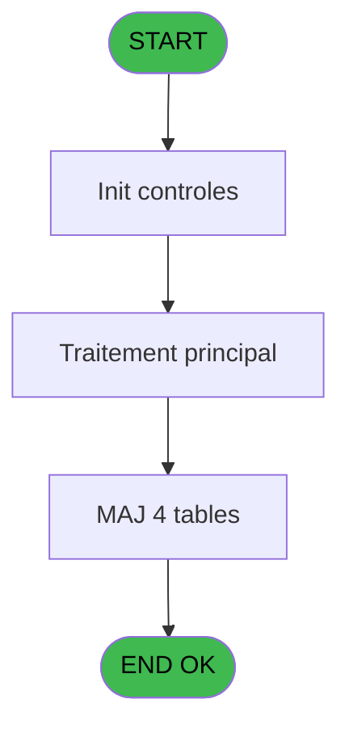
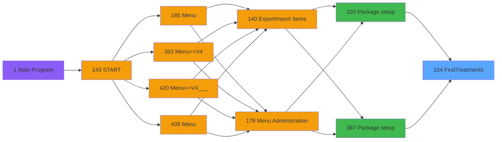
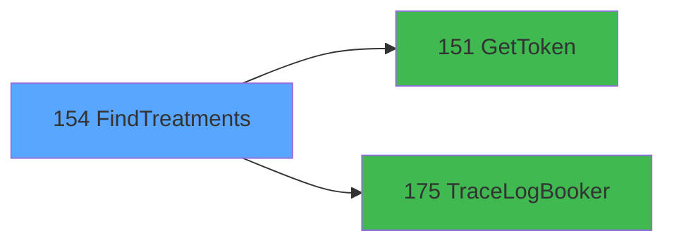

# PVE IDE 154 - FindTreatments

> **Analyse**: Phases 1-4 2026-02-03 09:47 -> 09:47 (22s) | Assemblage 09:47
> **Pipeline**: V7.2 Enrichi
> **Structure**: 4 onglets (Resume | Ecrans | Donnees | Connexions)

<!-- TAB:Resume -->

## 1. FICHE D'IDENTITE

| Attribut | Valeur |
|----------|--------|
| Projet | PVE |
| IDE Position | 154 |
| Nom Programme | FindTreatments |
| Fichier source | `Prg_154.xml` |
| Domaine metier | General |
| Taches | 7 (0 ecrans visibles) |
| Tables modifiees | 4 |
| Programmes appeles | 2 |

## 2. DESCRIPTION FONCTIONNELLE

**FindTreatments** assure la gestion complete de ce processus, accessible depuis [Package setup (IDE 220)](PVE-IDE-220.md), [Package setup (IDE 367)](PVE-IDE-367.md).

Le flux de traitement s'organise en **1 blocs fonctionnels** :

- **Traitement** (7 taches) : traitements metier divers

**Donnees modifiees** : 4 tables en ecriture (pv_customer_temp, pv_sellers, pv_tva, Table_1542).

Detail : phases du traitement

#### Phase 1 : Traitement (7 taches)

- **154** - FindTreatments
- **154.1** - ExtractDataFromXML
- **154.1.1** - DataToMemoryTables
- **154.1.2** - DataToDataBaseTables
- **154.1.2.1** - category
- **154.1.2.2** - SubCat
- **154.1.2.3** - Produit

Delegue a : [GetToken (IDE 151)](PVE-IDE-151.md), [TraceLogBooker (IDE 175)](PVE-IDE-175.md)

#### Tables impactees

| Table | Operations | Role metier |
|-------|-----------|-------------|
| pv_sellers | **W** (1 usages) |  |
| pv_tva | **W** (1 usages) |  |
| Table_1542 | **W** (1 usages) |  |
| pv_customer_temp | **W** (1 usages) |  |

## 3. BLOCS FONCTIONNELS

### 3.1 Traitement (7 taches)

Traitements internes.

---

#### 154 - FindTreatments

**Role** : Tache d'orchestration : point d'entree du programme (7 sous-taches). Coordonne l'enchainement des traitements.

6 sous-taches directes

| Tache | Nom | Bloc |
|-------|-----|------|
| [154.1](#t2) | ExtractDataFromXML | Traitement |
| [154.1.1](#t3) | DataToMemoryTables | Traitement |
| [154.1.2](#t4) | DataToDataBaseTables | Traitement |
| [154.1.2.1](#t5) | category | Traitement |
| [154.1.2.2](#t6) | SubCat | Traitement |
| [154.1.2.3](#t7) | Produit | Traitement |

**Delegue a** : [GetToken (IDE 151)](PVE-IDE-151.md), [TraceLogBooker (IDE 175)](PVE-IDE-175.md)

---

#### 154.1 - ExtractDataFromXML

**Role** : Traitement : ExtractDataFromXML.
**Delegue a** : [GetToken (IDE 151)](PVE-IDE-151.md), [TraceLogBooker (IDE 175)](PVE-IDE-175.md)

---

#### 154.1.1 - DataToMemoryTables

**Role** : Traitement : DataToMemoryTables.
**Delegue a** : [GetToken (IDE 151)](PVE-IDE-151.md), [TraceLogBooker (IDE 175)](PVE-IDE-175.md)

---

#### 154.1.2 - DataToDataBaseTables

**Role** : Traitement : DataToDataBaseTables.
**Delegue a** : [GetToken (IDE 151)](PVE-IDE-151.md), [TraceLogBooker (IDE 175)](PVE-IDE-175.md)

---

#### 154.1.2.1 - category

**Role** : Traitement : category.
**Delegue a** : [GetToken (IDE 151)](PVE-IDE-151.md), [TraceLogBooker (IDE 175)](PVE-IDE-175.md)

---

#### 154.1.2.2 - SubCat

**Role** : Traitement : SubCat.
**Delegue a** : [GetToken (IDE 151)](PVE-IDE-151.md), [TraceLogBooker (IDE 175)](PVE-IDE-175.md)

---

#### 154.1.2.3 - Produit

**Role** : Traitement : Produit.
**Variables liees** : L (V.ProduitDuration)
**Delegue a** : [GetToken (IDE 151)](PVE-IDE-151.md), [TraceLogBooker (IDE 175)](PVE-IDE-175.md)

## 5. REGLES METIER

*(Aucune regle metier identifiee)*

## 6. CONTEXTE

- **Appele par**: [Package setup (IDE 220)](PVE-IDE-220.md), [Package setup (IDE 367)](PVE-IDE-367.md)
- **Appelle**: 2 programmes | **Tables**: 6 (W:4 R:0 L:2) | **Taches**: 7 | **Expressions**: 11

<!-- TAB:Ecrans -->

## 8. ECRANS

*(Programme sans ecran visible)*

## 9. NAVIGATION

### 9.3 Structure hierarchique (7 taches)

| Position | Tache | Type | Dimensions | Bloc |
|----------|-------|------|------------|------|
| **154.1** | [**FindTreatments** (154)](#t1) | - | - | Traitement |
| 154.1.1 | [ExtractDataFromXML (154.1)](#t2) | - | - | |
| 154.1.2 | [DataToMemoryTables (154.1.1)](#t3) | - | - | |
| 154.1.3 | [DataToDataBaseTables (154.1.2)](#t4) | - | - | |
| 154.1.4 | [category (154.1.2.1)](#t5) | - | - | |
| 154.1.5 | [SubCat (154.1.2.2)](#t6) | - | - | |
| 154.1.6 | [Produit (154.1.2.3)](#t7) | - | - | |

### 9.4 Algorigramme

> **Legende**: Vert = START/END OK | Rouge = END KO | Bleu = Decisions
> *Algorigramme auto-genere. Utiliser `/algorigramme` pour une synthese metier detaillee.*

<!-- TAB:Donnees -->

## 10. TABLES

### Tables utilisees (6)

| ID | Nom | Description | Type | R | W | L | Usages |
|----|-----|-------------|------|---|---|---|--------|
| 379 | pv_customer_temp |  | DB |   | **W** |   | 1 |
| 403 | pv_sellers |  | DB |   | **W** |   | 1 |
| 413 | pv_tva |  | DB |   | **W** |   | 1 |
| 1542 | Table_1542 |  | MEM |   | **W** |   | 1 |
| 1543 | Table_1543 |  | MEM |   |   | L | 1 |
| 1544 | Table_1544 |  | MEM |   |   | L | 1 |

### Colonnes par table (2 / 4 tables avec colonnes identifiees)

Table 379 - pv_customer_temp (**W**) - 1 usages

| Lettre | Variable | Acces | Type |
|--------|----------|-------|------|
| A | P.catID | W | Numeric |
| B | ExistCat? | W | Logical |

Table 403 - pv_sellers (**W**) - 1 usages

*Table utilisee uniquement en Link ou aucune colonne Real identifiee dans le DataView.*

Table 413 - pv_tva (**W**) - 1 usages

| Lettre | Variable | Acces | Type |
|--------|----------|-------|------|
| A | P.SubCatID | W | Numeric |
| B | ExistSubCat | W | Logical |

Table 1542 - Table_1542 (**W**) - 1 usages

*Table utilisee uniquement en Link ou aucune colonne Real identifiee dans le DataView.*

## 11. VARIABLES

### 11.1 Variables de session (1)

Variables persistantes pendant toute la session.

| Lettre | Nom | Type | Usage dans |
|--------|-----|------|-----------|
| L | V.ProduitDuration | Numeric | - |

### 11.2 Autres (11)

Variables diverses.

| Lettre | Nom | Type | Usage dans |
|--------|-----|------|-----------|
| A | Token | Unicode | 1x refs |
| B | LocationID | Numeric | 1x refs |
| C | typeRequest | Alpha | - |
| D | UrlApi | Alpha | - |
| E | JsonIN | Blob | - |
| F | IsSuccessToken | Logical | - |
| G | ErrorMessageToken | Alpha | - |
| H | IsSuccess | Logical | 1x refs |
| I | ErrorMessage | Alpha | - |
| J | JsonResponse | Blob | 1x refs |
| K | XmlResponse | Blob | - |

## 12. EXPRESSIONS

**11 / 11 expressions decodees (100%)**

### 12.1 Repartition par type

| Type | Expressions | Regles |
|------|-------------|--------|
| CALCULATION | 2 | 0 |
| CONCATENATION | 1 | 0 |
| CONSTANTE | 1 | 0 |
| DATE | 1 | 0 |
| REFERENCE_VG | 3 | 0 |
| OTHER | 2 | 0 |
| FORMAT | 1 | 0 |

### 12.2 Expressions cles par type

#### CALCULATION (2 expressions)

| Type | IDE | Expression | Regle |
|------|-----|------------|-------|
| CALCULATION | 4 | `Trim(VG66) & '/v4.1/merchant/treatments'` | - |
| CALCULATION | 3 | `Trim(VG66) & '/treatments'` | - |

#### CONCATENATION (1 expressions)

| Type | IDE | Expression | Regle |
|------|-----|------------|-------|
| CONCATENATION | 7 | `'<?xml version="1.0" encoding="UTF-8"?>' &
ASCIIChr(13)& ASCIIChr(10)&
DotNet.System.Xml.Linq.XElement.Load(
  DotNet.System.Runtime.Serialization.Json.JsonReaderWriterFactory.CreateJsonReader( 
     JsonResponse [J],
     DotNet.System.Xml.XmlDictionaryReaderQuotas()
   )
).ToString()` | - |

#### CONSTANTE (1 expressions)

| Type | IDE | Expression | Regle |
|------|-----|------------|-------|
| CONSTANTE | 2 | `'POST'` | - |

#### DATE (1 expressions)

| Type | IDE | Expression | Regle |
|------|-----|------------|-------|
| DATE | 8 | `Date()` | - |

#### REFERENCE_VG (3 expressions)

| Type | IDE | Expression | Regle |
|------|-----|------------|-------|
| REFERENCE_VG | 11 | `VG63` | - |
| REFERENCE_VG | 10 | `VG65` | - |
| REFERENCE_VG | 1 | `VG67` | - |

#### OTHER (2 expressions)

| Type | IDE | Expression | Regle |
|------|-----|------------|-------|
| OTHER | 9 | `Time()` | - |
| OTHER | 5 | `IsSuccess [H]` | - |

#### FORMAT (1 expressions)

| Type | IDE | Expression | Regle |
|------|-----|------------|-------|
| FORMAT | 6 | `'{    "AllowOnGiftCertificateSale": null,    "CategoryID": null,    "EmployeeID": null,    "LocationID": '& Trim(Str(LocationID [B],'10')) &',    "PageNumber": 1,    "PageSize": 10,    "SortBy": [        {            "SortBy": "Name",            "SortDirection": 0        }    ],    "SubCategoryID": null,    "UsePaging": false,    "ExcludeClassesAndWorkshops": null,    "OnlyClassesAndWorkshops": null,    "SkipLoadingRoomsAndEmployees": null,    "DurationTypeID": null,    "ExcludeCoupleServices": null,    "ExcludeMembersOnly": null,    "IncludeEmployeeTreatment": true,    "RoomID": null,    "BrandID": null,    "access_token": "'& Trim(Token [A]) &'"}'` | - |

<!-- TAB:Connexions -->

## 13. GRAPHE D'APPELS

### 13.1 Chaine depuis Main (Callers)

Main -> ... -> [Package setup (IDE 220)](PVE-IDE-220.md) -> **FindTreatments (IDE 154)**

Main -> ... -> [Package setup (IDE 367)](PVE-IDE-367.md) -> **FindTreatments (IDE 154)**

### 13.2 Callers

| IDE | Nom Programme | Nb Appels |
|-----|---------------|-----------|
| [220](PVE-IDE-220.md) | Package setup | 1 |
| [367](PVE-IDE-367.md) | Package setup | 1 |

### 13.3 Callees (programmes appeles)

### 13.4 Detail Callees avec contexte

| IDE | Nom Programme | Appels | Contexte |
|-----|---------------|--------|----------|
| [151](PVE-IDE-151.md) | GetToken | 1 | Recuperation donnees |
| [175](PVE-IDE-175.md) | TraceLogBooker | 1 | Sous-programme |

## 14. RECOMMANDATIONS MIGRATION

### 14.1 Profil du programme

| Metrique | Valeur | Impact migration |
|----------|--------|-----------------|
| Lignes de logique | 244 | Taille moyenne |
| Expressions | 11 | Peu de logique |
| Tables WRITE | 4 | Impact modere |
| Sous-programmes | 2 | Peu de dependances |
| Ecrans visibles | 0 | Ecran unique ou traitement batch |
| Code desactive | 5.3% (13 / 244) | A verifier |
| Regles metier | 0 | Pas de regle identifiee |

### 14.2 Plan de migration par bloc

#### Traitement (7 taches: 0 ecran, 7 traitements)

- **Strategie** : 7 service(s) backend injectable(s) (Domain Services).
- 2 sous-programme(s) a migrer ou a reutiliser depuis les services existants.
- Decomposer les taches en services unitaires testables.

### 14.3 Dependances critiques

| Dependance | Type | Appels | Impact |
|------------|------|--------|--------|
| pv_customer_temp | Table WRITE (Database) | 1x | Schema + repository |
| pv_sellers | Table WRITE (Database) | 1x | Schema + repository |
| pv_tva | Table WRITE (Database) | 1x | Schema + repository |
| Table_1542 | Table WRITE (Memory) | 1x | Schema + repository |
| [TraceLogBooker (IDE 175)](PVE-IDE-175.md) | Sous-programme | 1x | Normale - Sous-programme |
| [GetToken (IDE 151)](PVE-IDE-151.md) | Sous-programme | 1x | Normale - Recuperation donnees |

---
*Spec DETAILED generee par Pipeline V7.2 - 2026-02-03 09:47*
