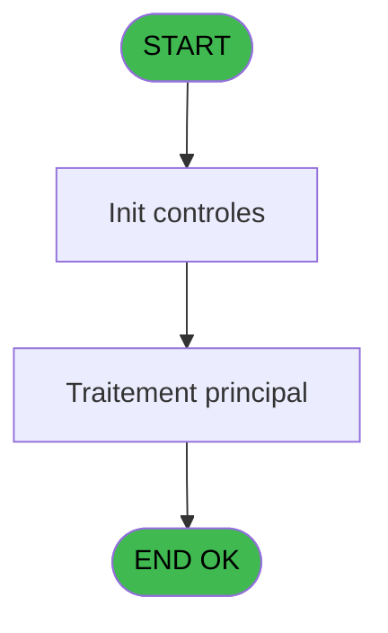
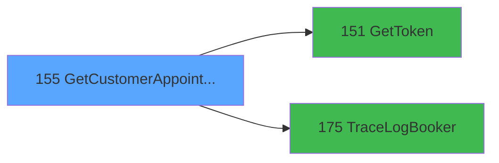

# PVE IDE 155 - GetCustomerAppointments

> **Analyse**: Phases 1-4 2026-02-03 09:47 -> 09:48 (21s) | Assemblage 09:48
> **Pipeline**: V7.2 Enrichi
> **Structure**: 4 onglets (Resume | Ecrans | Donnees | Connexions)

<!-- TAB:Resume -->

## 1. FICHE D'IDENTITE

| Attribut | Valeur |
|----------|--------|
| Projet | PVE |
| IDE Position | 155 |
| Nom Programme | GetCustomerAppointments |
| Fichier source | `Prg_155.xml` |
| Domaine metier | General |
| Taches | 1 (0 ecrans visibles) |
| Tables modifiees | 0 |
| Programmes appeles | 2 |
| :warning: Statut | **ORPHELIN_POTENTIEL** |

## 2. DESCRIPTION FONCTIONNELLE

**GetCustomerAppointments** assure la gestion complete de ce processus.

Le flux de traitement s'organise en **1 blocs fonctionnels** :

- **Traitement** (1 tache) : traitements metier divers

## 3. BLOCS FONCTIONNELS

### 3.1 Traitement (1 tache)

Traitements internes.

---

#### 155 - GetCustomerAppointments

**Role** : Consultation/chargement : GetCustomerAppointments.
**Delegue a** : [GetToken (IDE 151)](PVE-IDE-151.md), [TraceLogBooker (IDE 175)](PVE-IDE-175.md)

## 5. REGLES METIER

*(Aucune regle metier identifiee)*

## 6. CONTEXTE

- **Appele par**: (aucun)
- **Appelle**: 2 programmes | **Tables**: 0 (W:0 R:0 L:0) | **Taches**: 1 | **Expressions**: 10

<!-- TAB:Ecrans -->

## 8. ECRANS

*(Programme sans ecran visible)*

## 9. NAVIGATION

### 9.3 Structure hierarchique (1 tache)

| Position | Tache | Type | Dimensions | Bloc |
|----------|-------|------|------------|------|
| **155.1** | [**GetCustomerAppointments** (155)](#t1) | - | - | Traitement |

### 9.4 Algorigramme

> **Legende**: Vert = START/END OK | Rouge = END KO | Bleu = Decisions
> *Algorigramme auto-genere. Utiliser `/algorigramme` pour une synthese metier detaillee.*

<!-- TAB:Donnees -->

## 10. TABLES

### Tables utilisees (0)

| ID | Nom | Description | Type | R | W | L | Usages |
|----|-----|-------------|------|---|---|---|--------|

### Colonnes par table (0 / 0 tables avec colonnes identifiees)

## 11. VARIABLES

### 11.1 Parametres entrants (1)

Variables recues en parametre.

| Lettre | Nom | Type | Usage dans |
|--------|-----|------|-----------|
| A | P.CustomerID | Numeric | 2x parametre entrant |

### 11.2 Autres (11)

Variables diverses.

| Lettre | Nom | Type | Usage dans |
|--------|-----|------|-----------|
| B | Token | Unicode | 2x refs |
| C | LocationID | Numeric | - |
| D | typeRequest | Alpha | - |
| E | UrlApi | Alpha | - |
| F | JsonIN | Blob | - |
| G | IsSuccessToken | Logical | - |
| H | ErrorMessageToken | Alpha | - |
| I | IsSuccess | Logical | - |
| J | ErrorMessage | Alpha | - |
| K | JsonResponse | Blob | 1x refs |
| L | XMLResponse | Blob | - |

## 12. EXPRESSIONS

**10 / 10 expressions decodees (100%)**

### 12.1 Repartition par type

| Type | Expressions | Regles |
|------|-------------|--------|
| FORMAT | 2 | 0 |
| CONCATENATION | 1 | 0 |
| CONSTANTE | 2 | 0 |
| DATE | 1 | 0 |
| REFERENCE_VG | 3 | 0 |
| OTHER | 1 | 0 |

### 12.2 Expressions cles par type

#### FORMAT (2 expressions)

| Type | IDE | Expression | Regle |
|------|-----|------------|-------|
| FORMAT | 5 | `Trim(VG66) & '/v4.1/merchant/customer/' & Trim(Str(P.CustomerID [A],'10')) & '/appointments?access_token=' & Trim(Token [B])` | - |
| FORMAT | 4 | `Trim(VG66) & '/customer/' & Trim(Str(P.CustomerID [A],'10')) & '/appointments?access_token=' & Trim(Token [B])` | - |

#### CONCATENATION (1 expressions)

| Type | IDE | Expression | Regle |
|------|-----|------------|-------|
| CONCATENATION | 6 | `'<?xml version="1.0" encoding="UTF-8"?>' &ASCIIChr(13)& ASCIIChr(10)&DotNet.System.Xml.Linq.XElement.Load(  DotNet.System.Runtime.Serialization.Json.JsonReaderWriterFactory.CreateJsonReader(      JsonResponse [K],     DotNet.System.Xml.XmlDictionaryReaderQuotas()   )).ToString()` | - |

#### CONSTANTE (2 expressions)

| Type | IDE | Expression | Regle |
|------|-----|------------|-------|
| CONSTANTE | 3 | `'GET'` | - |
| CONSTANTE | 1 | `134731` | - |

#### DATE (1 expressions)

| Type | IDE | Expression | Regle |
|------|-----|------------|-------|
| DATE | 7 | `Date()` | - |

#### REFERENCE_VG (3 expressions)

| Type | IDE | Expression | Regle |
|------|-----|------------|-------|
| REFERENCE_VG | 10 | `VG63` | - |
| REFERENCE_VG | 9 | `VG65` | - |
| REFERENCE_VG | 2 | `VG67` | - |

#### OTHER (1 expressions)

| Type | IDE | Expression | Regle |
|------|-----|------------|-------|
| OTHER | 8 | `Time()` | - |

<!-- TAB:Connexions -->

## 13. GRAPHE D'APPELS

### 13.1 Chaine depuis Main (Callers)

**Chemin**: (pas de callers directs)

### 13.2 Callers

| IDE | Nom Programme | Nb Appels |
|-----|---------------|-----------|
| - | (aucun) | - |

### 13.3 Callees (programmes appeles)

### 13.4 Detail Callees avec contexte

| IDE | Nom Programme | Appels | Contexte |
|-----|---------------|--------|----------|
| [151](PVE-IDE-151.md) | GetToken | 1 | Recuperation donnees |
| [175](PVE-IDE-175.md) | TraceLogBooker | 1 | Sous-programme |

## 14. RECOMMANDATIONS MIGRATION

### 14.1 Profil du programme

| Metrique | Valeur | Impact migration |
|----------|--------|-----------------|
| Lignes de logique | 36 | Programme compact |
| Expressions | 10 | Peu de logique |
| Tables WRITE | 0 | Impact faible |
| Sous-programmes | 2 | Peu de dependances |
| Ecrans visibles | 0 | Ecran unique ou traitement batch |
| Code desactive | 0% (0 / 36) | Code sain |
| Regles metier | 0 | Pas de regle identifiee |

### 14.2 Plan de migration par bloc

#### Traitement (1 tache: 0 ecran, 1 traitement)

- **Strategie** : 1 service(s) backend injectable(s) (Domain Services).
- 2 sous-programme(s) a migrer ou a reutiliser depuis les services existants.
- Decomposer les taches en services unitaires testables.

### 14.3 Dependances critiques

| Dependance | Type | Appels | Impact |
|------------|------|--------|--------|
| [TraceLogBooker (IDE 175)](PVE-IDE-175.md) | Sous-programme | 1x | Normale - Sous-programme |
| [GetToken (IDE 151)](PVE-IDE-151.md) | Sous-programme | 1x | Normale - Recuperation donnees |

---
*Spec DETAILED generee par Pipeline V7.2 - 2026-02-03 09:48*
