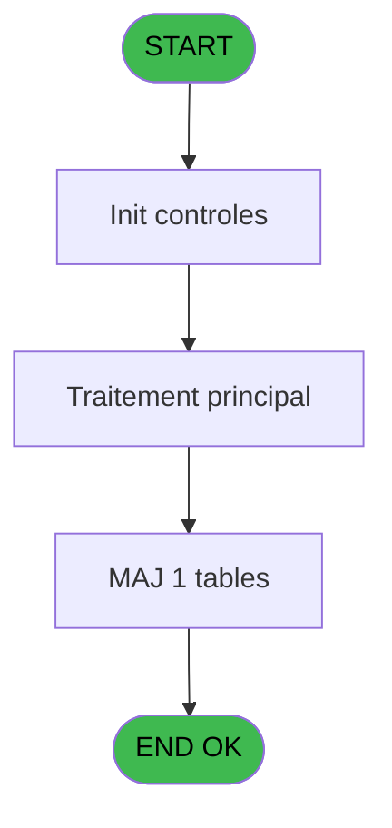
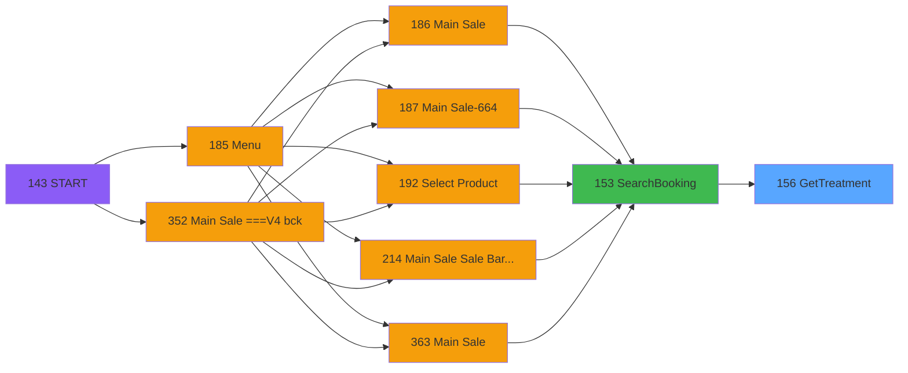
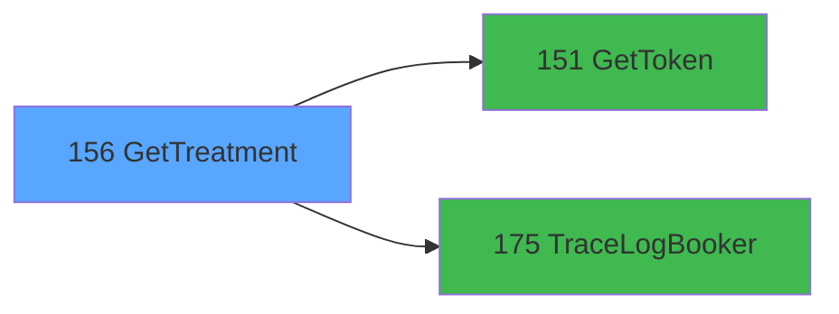

# PVE IDE 156 - GetTreatment

> **Analyse**: Phases 1-4 2026-02-03 09:48 -> 09:48 (19s) | Assemblage 09:48
> **Pipeline**: V7.2 Enrichi
> **Structure**: 4 onglets (Resume | Ecrans | Donnees | Connexions)

<!-- TAB:Resume -->

## 1. FICHE D'IDENTITE

| Attribut | Valeur |
|----------|--------|
| Projet | PVE |
| IDE Position | 156 |
| Nom Programme | GetTreatment |
| Fichier source | `Prg_156.xml` |
| Domaine metier | General |
| Taches | 4 (0 ecrans visibles) |
| Tables modifiees | 1 |
| Programmes appeles | 2 |

## 2. DESCRIPTION FONCTIONNELLE

**GetTreatment** assure la gestion complete de ce processus, accessible depuis [SearchBooking (IDE 153)](PVE-IDE-153.md).

Le flux de traitement s'organise en **1 blocs fonctionnels** :

- **Traitement** (4 taches) : traitements metier divers

**Donnees modifiees** : 1 tables en ecriture (Table_1544).

Detail : phases du traitement

#### Phase 1 : Traitement (4 taches)

- **156** - GetTreatment
- **156.1** - ExtractDataFromXML
- **156.1.1** - PraticienToTable
- **156.1.2** - CabineToTable

Delegue a : [GetToken (IDE 151)](PVE-IDE-151.md), [TraceLogBooker (IDE 175)](PVE-IDE-175.md)

#### Tables impactees

| Table | Operations | Role metier |
|-------|-----------|-------------|
| Table_1544 | **W** (2 usages) |  |

## 3. BLOCS FONCTIONNELS

### 3.1 Traitement (4 taches)

Traitements internes.

---

#### 156 - GetTreatment

**Role** : Consultation/chargement : GetTreatment.

3 sous-taches directes

| Tache | Nom | Bloc |
|-------|-----|------|
| [156.1](#t2) | ExtractDataFromXML | Traitement |
| [156.1.1](#t3) | PraticienToTable | Traitement |
| [156.1.2](#t4) | CabineToTable | Traitement |

**Delegue a** : [GetToken (IDE 151)](PVE-IDE-151.md), [TraceLogBooker (IDE 175)](PVE-IDE-175.md)

---

#### 156.1 - ExtractDataFromXML

**Role** : Traitement : ExtractDataFromXML.
**Delegue a** : [GetToken (IDE 151)](PVE-IDE-151.md), [TraceLogBooker (IDE 175)](PVE-IDE-175.md)

---

#### 156.1.1 - PraticienToTable

**Role** : Traitement : PraticienToTable.
**Delegue a** : [GetToken (IDE 151)](PVE-IDE-151.md), [TraceLogBooker (IDE 175)](PVE-IDE-175.md)

---

#### 156.1.2 - CabineToTable

**Role** : Traitement : CabineToTable.
**Delegue a** : [GetToken (IDE 151)](PVE-IDE-151.md), [TraceLogBooker (IDE 175)](PVE-IDE-175.md)

## 5. REGLES METIER

*(Aucune regle metier identifiee)*

## 6. CONTEXTE

- **Appele par**: [SearchBooking (IDE 153)](PVE-IDE-153.md)
- **Appelle**: 2 programmes | **Tables**: 1 (W:1 R:0 L:0) | **Taches**: 4 | **Expressions**: 10

<!-- TAB:Ecrans -->

## 8. ECRANS

*(Programme sans ecran visible)*

## 9. NAVIGATION

### 9.3 Structure hierarchique (4 taches)

| Position | Tache | Type | Dimensions | Bloc |
|----------|-------|------|------------|------|
| **156.1** | [**GetTreatment** (156)](#t1) | - | - | Traitement |
| 156.1.1 | [ExtractDataFromXML (156.1)](#t2) | - | - | |
| 156.1.2 | [PraticienToTable (156.1.1)](#t3) | - | - | |
| 156.1.3 | [CabineToTable (156.1.2)](#t4) | - | - | |

### 9.4 Algorigramme

> **Legende**: Vert = START/END OK | Rouge = END KO | Bleu = Decisions
> *Algorigramme auto-genere. Utiliser `/algorigramme` pour une synthese metier detaillee.*

<!-- TAB:Donnees -->

## 10. TABLES

### Tables utilisees (1)

| ID | Nom | Description | Type | R | W | L | Usages |
|----|-----|-------------|------|---|---|---|--------|
| 1544 | Table_1544 |  | MEM |   | **W** |   | 2 |

### Colonnes par table (0 / 1 tables avec colonnes identifiees)

Table 1544 - Table_1544 (**W**) - 2 usages

*Table utilisee uniquement en Link ou aucune colonne Real identifiee dans le DataView.*

## 11. VARIABLES

### 11.1 Parametres entrants (2)

Variables recues du programme appelant ([SearchBooking (IDE 153)](PVE-IDE-153.md)).

| Lettre | Nom | Type | Usage dans |
|--------|-----|------|-----------|
| A | P.SoinID | Numeric | 2x parametre entrant |
| B | P.RecoveryTime | Numeric | - |

### 11.2 Autres (11)

Variables diverses.

| Lettre | Nom | Type | Usage dans |
|--------|-----|------|-----------|
| C | Token | Unicode | 2x refs |
| D | LocationID | Numeric | - |
| E | typeRequest | Alpha | - |
| F | UrlApi | Alpha | - |
| G | JsonIN | Blob | - |
| H | IsSuccessToken | Logical | - |
| I | ErrorMessageToken | Alpha | - |
| J | IsSuccess | Logical | 1x refs |
| K | ErrorMessage | Alpha | - |
| L | JsonResponse | Blob | 1x refs |
| M | XmlResponse | Blob | - |

## 12. EXPRESSIONS

**10 / 10 expressions decodees (100%)**

### 12.1 Repartition par type

| Type | Expressions | Regles |
|------|-------------|--------|
| FORMAT | 2 | 0 |
| CONCATENATION | 1 | 0 |
| CONSTANTE | 1 | 0 |
| DATE | 1 | 0 |
| REFERENCE_VG | 3 | 0 |
| OTHER | 2 | 0 |

### 12.2 Expressions cles par type

#### FORMAT (2 expressions)

| Type | IDE | Expression | Regle |
|------|-----|------------|-------|
| FORMAT | 4 | `Trim(VG66) & '/v4.1/merchant/treatment/' & Trim(Str(P.SoinID [A],'10')) & '?access_token=' & Trim(Token [C])` | - |
| FORMAT | 3 | `Trim(VG66) & '/treatment/' & Trim(Str(P.SoinID [A],'10')) & '?access_token=' & Trim(Token [C])` | - |

#### CONCATENATION (1 expressions)

| Type | IDE | Expression | Regle |
|------|-----|------------|-------|
| CONCATENATION | 6 | `'<?xml version="1.0" encoding="UTF-8"?>' &
ASCIIChr(13)& ASCIIChr(10)&
DotNet.System.Xml.Linq.XElement.Load(
  DotNet.System.Runtime.Serialization.Json.JsonReaderWriterFactory.CreateJsonReader( 
     JsonResponse [L],
     DotNet.System.Xml.XmlDictionaryReaderQuotas()
   )
).ToString()` | - |

#### CONSTANTE (1 expressions)

| Type | IDE | Expression | Regle |
|------|-----|------------|-------|
| CONSTANTE | 2 | `'GET'` | - |

#### DATE (1 expressions)

| Type | IDE | Expression | Regle |
|------|-----|------------|-------|
| DATE | 7 | `Date()` | - |

#### REFERENCE_VG (3 expressions)

| Type | IDE | Expression | Regle |
|------|-----|------------|-------|
| REFERENCE_VG | 10 | `VG63` | - |
| REFERENCE_VG | 9 | `VG65` | - |
| REFERENCE_VG | 1 | `VG67` | - |

#### OTHER (2 expressions)

| Type | IDE | Expression | Regle |
|------|-----|------------|-------|
| OTHER | 8 | `Time()` | - |
| OTHER | 5 | `IsSuccess [J]` | - |

<!-- TAB:Connexions -->

## 13. GRAPHE D'APPELS

### 13.1 Chaine depuis Main (Callers)

Main -> ... -> [SearchBooking (IDE 153)](PVE-IDE-153.md) -> **GetTreatment (IDE 156)**

### 13.2 Callers

| IDE | Nom Programme | Nb Appels |
|-----|---------------|-----------|
| [153](PVE-IDE-153.md) | SearchBooking | 1 |

### 13.3 Callees (programmes appeles)

### 13.4 Detail Callees avec contexte

| IDE | Nom Programme | Appels | Contexte |
|-----|---------------|--------|----------|
| [151](PVE-IDE-151.md) | GetToken | 1 | Recuperation donnees |
| [175](PVE-IDE-175.md) | TraceLogBooker | 1 | Sous-programme |

## 14. RECOMMANDATIONS MIGRATION

### 14.1 Profil du programme

| Metrique | Valeur | Impact migration |
|----------|--------|-----------------|
| Lignes de logique | 87 | Programme compact |
| Expressions | 10 | Peu de logique |
| Tables WRITE | 1 | Impact faible |
| Sous-programmes | 2 | Peu de dependances |
| Ecrans visibles | 0 | Ecran unique ou traitement batch |
| Code desactive | 14.9% (13 / 87) | A verifier |
| Regles metier | 0 | Pas de regle identifiee |

### 14.2 Plan de migration par bloc

#### Traitement (4 taches: 0 ecran, 4 traitements)

- **Strategie** : 4 service(s) backend injectable(s) (Domain Services).
- 2 sous-programme(s) a migrer ou a reutiliser depuis les services existants.
- Decomposer les taches en services unitaires testables.

### 14.3 Dependances critiques

| Dependance | Type | Appels | Impact |
|------------|------|--------|--------|
| Table_1544 | Table WRITE (Memory) | 2x | Schema + repository |
| [TraceLogBooker (IDE 175)](PVE-IDE-175.md) | Sous-programme | 1x | Normale - Sous-programme |
| [GetToken (IDE 151)](PVE-IDE-151.md) | Sous-programme | 1x | Normale - Recuperation donnees |

---
*Spec DETAILED generee par Pipeline V7.2 - 2026-02-03 09:48*
