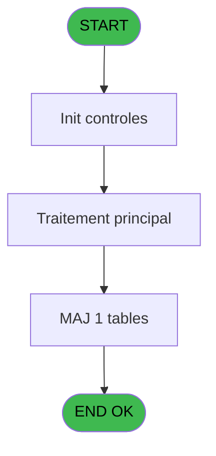
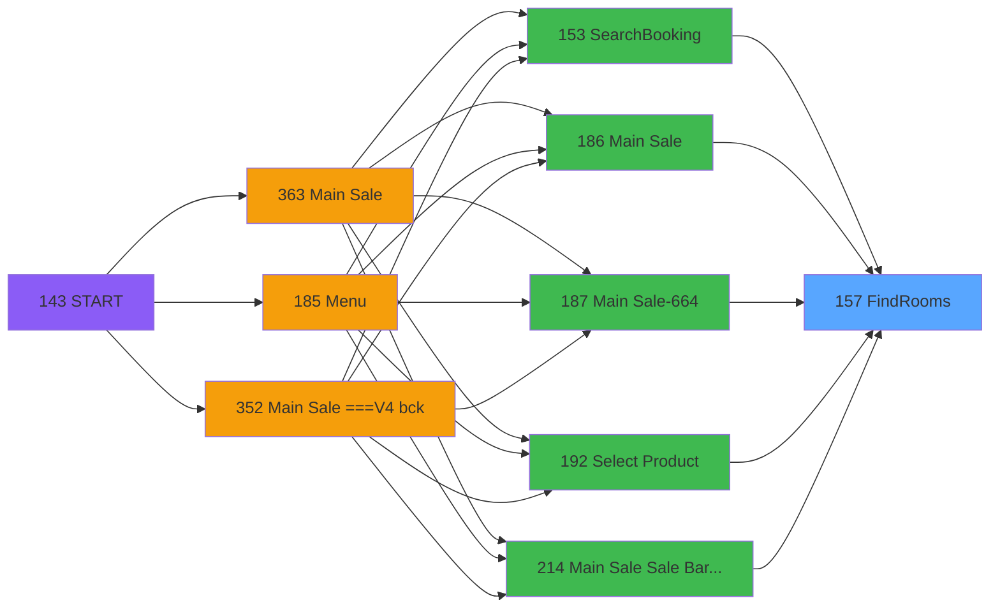
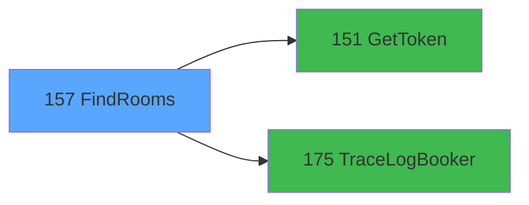

# PVE IDE 157 - FindRooms

> **Analyse**: Phases 1-4 2026-02-03 09:48 -> 09:49 (19s) | Assemblage 09:49
> **Pipeline**: V7.2 Enrichi
> **Structure**: 4 onglets (Resume | Ecrans | Donnees | Connexions)

<!-- TAB:Resume -->

## 1. FICHE D'IDENTITE

| Attribut | Valeur |
|----------|--------|
| Projet | PVE |
| IDE Position | 157 |
| Nom Programme | FindRooms |
| Fichier source | `Prg_157.xml` |
| Domaine metier | General |
| Taches | 4 (0 ecrans visibles) |
| Tables modifiees | 1 |
| Programmes appeles | 2 |

## 2. DESCRIPTION FONCTIONNELLE

**FindRooms** assure la gestion complete de ce processus, accessible depuis [SearchBooking (IDE 153)](PVE-IDE-153.md), [Main Sale (IDE 186)](PVE-IDE-186.md), [Main Sale-664 (IDE 187)](PVE-IDE-187.md), [Select Product (IDE 192)](PVE-IDE-192.md), [Main Sale Sale Bar Code (IDE 214)](PVE-IDE-214.md), [Main Sale (IDE 363)](PVE-IDE-363.md), [Main Sale-664 (IDE 364)](PVE-IDE-364.md), [Main Sale ===V4 Booking ACTUEL (IDE 417)](PVE-IDE-417.md), [Main Sale (IDE 440)](PVE-IDE-440.md).

Le flux de traitement s'organise en **1 blocs fonctionnels** :

- **Traitement** (4 taches) : traitements metier divers

**Donnees modifiees** : 1 tables en ecriture (Table_1546).

Detail : phases du traitement

#### Phase 1 : Traitement (4 taches)

- **157** - FindRooms
- **157.1** - ExtractDataFromXML
- **157.1.1** - DataToTables
- **157.1.2** - DeleteCabines

Delegue a : [GetToken (IDE 151)](PVE-IDE-151.md), [TraceLogBooker (IDE 175)](PVE-IDE-175.md)

#### Tables impactees

| Table | Operations | Role metier |
|-------|-----------|-------------|
| Table_1546 | **W** (2 usages) |  |

## 3. BLOCS FONCTIONNELS

### 3.1 Traitement (4 taches)

Traitements internes.

---

#### 157 - FindRooms

**Role** : Traitement : FindRooms.

3 sous-taches directes

| Tache | Nom | Bloc |
|-------|-----|------|
| [157.1](#t2) | ExtractDataFromXML | Traitement |
| [157.1.1](#t3) | DataToTables | Traitement |
| [157.1.2](#t4) | DeleteCabines | Traitement |

**Delegue a** : [GetToken (IDE 151)](PVE-IDE-151.md), [TraceLogBooker (IDE 175)](PVE-IDE-175.md)

---

#### 157.1 - ExtractDataFromXML

**Role** : Traitement : ExtractDataFromXML.
**Delegue a** : [GetToken (IDE 151)](PVE-IDE-151.md), [TraceLogBooker (IDE 175)](PVE-IDE-175.md)

---

#### 157.1.1 - DataToTables

**Role** : Traitement : DataToTables.
**Delegue a** : [GetToken (IDE 151)](PVE-IDE-151.md), [TraceLogBooker (IDE 175)](PVE-IDE-175.md)

---

#### 157.1.2 - DeleteCabines

**Role** : Traitement : DeleteCabines.
**Delegue a** : [GetToken (IDE 151)](PVE-IDE-151.md), [TraceLogBooker (IDE 175)](PVE-IDE-175.md)

## 5. REGLES METIER

*(Aucune regle metier identifiee)*

## 6. CONTEXTE

- **Appele par**: [SearchBooking (IDE 153)](PVE-IDE-153.md), [Main Sale (IDE 186)](PVE-IDE-186.md), [Main Sale-664 (IDE 187)](PVE-IDE-187.md), [Select Product (IDE 192)](PVE-IDE-192.md), [Main Sale Sale Bar Code (IDE 214)](PVE-IDE-214.md), [Main Sale (IDE 363)](PVE-IDE-363.md), [Main Sale-664 (IDE 364)](PVE-IDE-364.md), [Main Sale ===V4 Booking ACTUEL (IDE 417)](PVE-IDE-417.md), [Main Sale (IDE 440)](PVE-IDE-440.md)
- **Appelle**: 2 programmes | **Tables**: 1 (W:1 R:0 L:0) | **Taches**: 4 | **Expressions**: 11

<!-- TAB:Ecrans -->

## 8. ECRANS

*(Programme sans ecran visible)*

## 9. NAVIGATION

### 9.3 Structure hierarchique (4 taches)

| Position | Tache | Type | Dimensions | Bloc |
|----------|-------|------|------------|------|
| **157.1** | [**FindRooms** (157)](#t1) | - | - | Traitement |
| 157.1.1 | [ExtractDataFromXML (157.1)](#t2) | - | - | |
| 157.1.2 | [DataToTables (157.1.1)](#t3) | - | - | |
| 157.1.3 | [DeleteCabines (157.1.2)](#t4) | - | - | |

### 9.4 Algorigramme

> **Legende**: Vert = START/END OK | Rouge = END KO | Bleu = Decisions
> *Algorigramme auto-genere. Utiliser `/algorigramme` pour une synthese metier detaillee.*

<!-- TAB:Donnees -->

## 10. TABLES

### Tables utilisees (1)

| ID | Nom | Description | Type | R | W | L | Usages |
|----|-----|-------------|------|---|---|---|--------|
| 1546 | Table_1546 |  | MEM |   | **W** |   | 2 |

### Colonnes par table (0 / 1 tables avec colonnes identifiees)

Table 1546 - Table_1546 (**W**) - 2 usages

*Table utilisee uniquement en Link ou aucune colonne Real identifiee dans le DataView.*

## 11. VARIABLES

### 11.1 Parametres entrants (1)

Variables recues du programme appelant ([SearchBooking (IDE 153)](PVE-IDE-153.md)).

| Lettre | Nom | Type | Usage dans |
|--------|-----|------|-----------|
| A | P.SoinsID | Numeric | 1x parametre entrant |

### 11.2 Autres (11)

Variables diverses.

| Lettre | Nom | Type | Usage dans |
|--------|-----|------|-----------|
| B | Token | Unicode | 1x refs |
| C | LocationID | Numeric | 1x refs |
| D | typeRequest | Alpha | - |
| E | UrlApi | Alpha | - |
| F | JsonIN | Blob | - |
| G | IsSuccessToken | Logical | - |
| H | ErrorMessageToken | Alpha | - |
| I | IsSuccess | Logical | 1x refs |
| J | ErrorMessage | Alpha | - |
| K | JsonResponse | Blob | 1x refs |
| L | XmlResponse | Blob | - |

## 12. EXPRESSIONS

**11 / 11 expressions decodees (100%)**

### 12.1 Repartition par type

| Type | Expressions | Regles |
|------|-------------|--------|
| CALCULATION | 2 | 0 |
| CONCATENATION | 1 | 0 |
| CONSTANTE | 1 | 0 |
| DATE | 1 | 0 |
| REFERENCE_VG | 3 | 0 |
| OTHER | 2 | 0 |
| FORMAT | 1 | 0 |

### 12.2 Expressions cles par type

#### CALCULATION (2 expressions)

| Type | IDE | Expression | Regle |
|------|-----|------------|-------|
| CALCULATION | 4 | `Trim(VG66) & '/v4.1/merchant/rooms'` | - |
| CALCULATION | 3 | `Trim(VG66) & '/rooms'` | - |

#### CONCATENATION (1 expressions)

| Type | IDE | Expression | Regle |
|------|-----|------------|-------|
| CONCATENATION | 6 | `'<?xml version="1.0" encoding="UTF-8"?>' &ASCIIChr(13)& ASCIIChr(10)&DotNet.System.Xml.Linq.XElement.Load(  DotNet.System.Runtime.Serialization.Json.JsonReaderWriterFactory.CreateJsonReader( JsonResponse [K],DotNet.System.Xml.XmlDictionaryReaderQuotas()   )).ToString()` | - |

#### CONSTANTE (1 expressions)

| Type | IDE | Expression | Regle |
|------|-----|------------|-------|
| CONSTANTE | 2 | `'POST'` | - |

#### DATE (1 expressions)

| Type | IDE | Expression | Regle |
|------|-----|------------|-------|
| DATE | 8 | `Date()` | - |

#### REFERENCE_VG (3 expressions)

| Type | IDE | Expression | Regle |
|------|-----|------------|-------|
| REFERENCE_VG | 11 | `VG63` | - |
| REFERENCE_VG | 10 | `VG65` | - |
| REFERENCE_VG | 1 | `VG67` | - |

#### OTHER (2 expressions)

| Type | IDE | Expression | Regle |
|------|-----|------------|-------|
| OTHER | 9 | `Time()` | - |
| OTHER | 7 | `IsSuccess [I]` | - |

#### FORMAT (1 expressions)

| Type | IDE | Expression | Regle |
|------|-----|------------|-------|
| FORMAT | 5 | `'{
    "LocationID":' & Trim(Str(LocationID [C],'10')) & ',
    "PageNumber": 1,
    "PageSize": 10,
    "SortBy": [
        {
            "SortBy": "Name",
            "SortDirection": 0
        }
    ],
    "UsePaging": false,
    "access_token": "' & Trim(Token [B]) & '",
    "SkipLoadingTreatments": null,
    "TreatmentID": ' & Trim(Str(P.SoinsID [A],'10')) & ',
    "MinCapacity": null
}'` | - |

<!-- TAB:Connexions -->

## 13. GRAPHE D'APPELS

### 13.1 Chaine depuis Main (Callers)

Main -> ... -> [SearchBooking (IDE 153)](PVE-IDE-153.md) -> **FindRooms (IDE 157)**

Main -> ... -> [Main Sale (IDE 186)](PVE-IDE-186.md) -> **FindRooms (IDE 157)**

Main -> ... -> [Main Sale-664 (IDE 187)](PVE-IDE-187.md) -> **FindRooms (IDE 157)**

Main -> ... -> [Select Product (IDE 192)](PVE-IDE-192.md) -> **FindRooms (IDE 157)**

Main -> ... -> [Main Sale Sale Bar Code (IDE 214)](PVE-IDE-214.md) -> **FindRooms (IDE 157)**

Main -> ... -> [Main Sale (IDE 363)](PVE-IDE-363.md) -> **FindRooms (IDE 157)**

Main -> ... -> [Main Sale-664 (IDE 364)](PVE-IDE-364.md) -> **FindRooms (IDE 157)**

Main -> ... -> [Main Sale ===V4 Booking ACTUEL (IDE 417)](PVE-IDE-417.md) -> **FindRooms (IDE 157)**

Main -> ... -> [Main Sale (IDE 440)](PVE-IDE-440.md) -> **FindRooms (IDE 157)**

### 13.2 Callers

| IDE | Nom Programme | Nb Appels |
|-----|---------------|-----------|
| [153](PVE-IDE-153.md) | SearchBooking | 1 |
| [186](PVE-IDE-186.md) | Main Sale | 1 |
| [187](PVE-IDE-187.md) | Main Sale-664 | 1 |
| [192](PVE-IDE-192.md) | Select Product | 1 |
| [214](PVE-IDE-214.md) | Main Sale Sale Bar Code | 1 |
| [363](PVE-IDE-363.md) | Main Sale | 1 |
| [364](PVE-IDE-364.md) | Main Sale-664 | 1 |
| [417](PVE-IDE-417.md) | Main Sale ===V4 Booking ACTUEL | 1 |
| [440](PVE-IDE-440.md) | Main Sale | 1 |

### 13.3 Callees (programmes appeles)

### 13.4 Detail Callees avec contexte

| IDE | Nom Programme | Appels | Contexte |
|-----|---------------|--------|----------|
| [151](PVE-IDE-151.md) | GetToken | 1 | Recuperation donnees |
| [175](PVE-IDE-175.md) | TraceLogBooker | 1 | Sous-programme |

## 14. RECOMMANDATIONS MIGRATION

### 14.1 Profil du programme

| Metrique | Valeur | Impact migration |
|----------|--------|-----------------|
| Lignes de logique | 64 | Programme compact |
| Expressions | 11 | Peu de logique |
| Tables WRITE | 1 | Impact faible |
| Sous-programmes | 2 | Peu de dependances |
| Ecrans visibles | 0 | Ecran unique ou traitement batch |
| Code desactive | 0% (0 / 64) | Code sain |
| Regles metier | 0 | Pas de regle identifiee |

### 14.2 Plan de migration par bloc

#### Traitement (4 taches: 0 ecran, 4 traitements)

- **Strategie** : 4 service(s) backend injectable(s) (Domain Services).
- 2 sous-programme(s) a migrer ou a reutiliser depuis les services existants.
- Decomposer les taches en services unitaires testables.

### 14.3 Dependances critiques

| Dependance | Type | Appels | Impact |
|------------|------|--------|--------|
| Table_1546 | Table WRITE (Memory) | 2x | Schema + repository |
| [TraceLogBooker (IDE 175)](PVE-IDE-175.md) | Sous-programme | 1x | Normale - Sous-programme |
| [GetToken (IDE 151)](PVE-IDE-151.md) | Sous-programme | 1x | Normale - Recuperation donnees |

---
*Spec DETAILED generee par Pipeline V7.2 - 2026-02-03 09:49*
