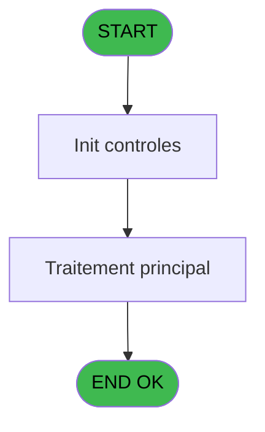
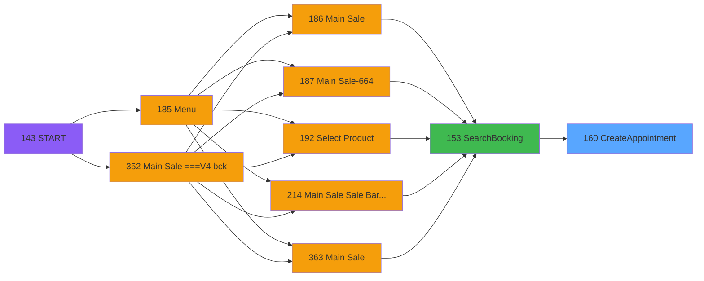
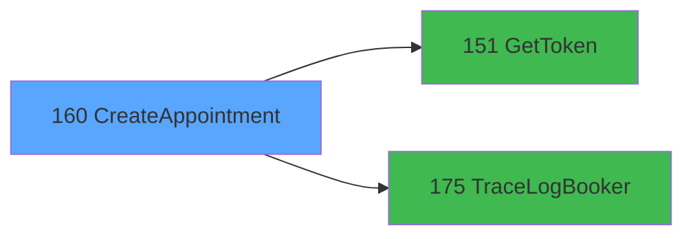

# PVE IDE 160 - CreateAppointment

> **Analyse**: Phases 1-4 2026-02-03 09:50 -> 09:50 (19s) | Assemblage 09:50
> **Pipeline**: V7.2 Enrichi
> **Structure**: 4 onglets (Resume | Ecrans | Donnees | Connexions)

<!-- TAB:Resume -->

## 1. FICHE D'IDENTITE

| Attribut | Valeur |
|----------|--------|
| Projet | PVE |
| IDE Position | 160 |
| Nom Programme | CreateAppointment |
| Fichier source | `Prg_160.xml` |
| Domaine metier | General |
| Taches | 2 (0 ecrans visibles) |
| Tables modifiees | 0 |
| Programmes appeles | 2 |

## 2. DESCRIPTION FONCTIONNELLE

**CreateAppointment** assure la gestion complete de ce processus, accessible depuis [SearchBooking (IDE 153)](PVE-IDE-153.md).

Le flux de traitement s'organise en **2 blocs fonctionnels** :

- **Traitement** (1 tache) : traitements metier divers
- **Creation** (1 tache) : insertion d'enregistrements en base (mouvements, prestations)

Detail : phases du traitement

#### Phase 1 : Creation (1 tache)

- **160** - CreateAppointment

#### Phase 2 : Traitement (1 tache)

- **160.1** - ExtractDataFromXML

Delegue a : [GetToken (IDE 151)](PVE-IDE-151.md), [TraceLogBooker (IDE 175)](PVE-IDE-175.md)

## 3. BLOCS FONCTIONNELS

### 3.1 Creation (1 tache)

Insertion de nouveaux enregistrements en base.

---

#### 160 - CreateAppointment

**Role** : Traitement : CreateAppointment.

### 3.2 Traitement (1 tache)

Traitements internes.

---

#### 160.1 - ExtractDataFromXML

**Role** : Traitement : ExtractDataFromXML.
**Delegue a** : [GetToken (IDE 151)](PVE-IDE-151.md), [TraceLogBooker (IDE 175)](PVE-IDE-175.md)

## 5. REGLES METIER

*(Aucune regle metier identifiee)*

## 6. CONTEXTE

- **Appele par**: [SearchBooking (IDE 153)](PVE-IDE-153.md)
- **Appelle**: 2 programmes | **Tables**: 1 (W:0 R:1 L:0) | **Taches**: 2 | **Expressions**: 12

<!-- TAB:Ecrans -->

## 8. ECRANS

*(Programme sans ecran visible)*

## 9. NAVIGATION

### 9.3 Structure hierarchique (2 taches)

| Position | Tache | Type | Dimensions | Bloc |
|----------|-------|------|------------|------|
| **160.1** | [**CreateAppointment** (160)](#t1) | - | - | Creation |
| **160.2** | [**ExtractDataFromXML** (160.1)](#t2) | - | - | Traitement |

### 9.4 Algorigramme

> **Legende**: Vert = START/END OK | Rouge = END KO | Bleu = Decisions
> *Algorigramme auto-genere. Utiliser `/algorigramme` pour une synthese metier detaillee.*

<!-- TAB:Donnees -->

## 10. TABLES

### Tables utilisees (1)

| ID | Nom | Description | Type | R | W | L | Usages |
|----|-----|-------------|------|---|---|---|--------|
| 382 | pv_discount_reasons |  | DB | R |   |   | 1 |

### Colonnes par table (1 / 1 tables avec colonnes identifiees)

Table 382 - pv_discount_reasons (R) - 1 usages

| Lettre | Variable | Acces | Type |
|--------|----------|-------|------|
| U | JsonIN | R | Blob |
| Z | JsonResponse | R | Blob |
| BA | XMLResponse | R | Blob |

## 11. VARIABLES

### 11.1 Parametres entrants (13)

Variables recues du programme appelant ([SearchBooking (IDE 153)](PVE-IDE-153.md)).

| Lettre | Nom | Type | Usage dans |
|--------|-----|------|-----------|
| A | P.SoinsID | Numeric | 1x parametre entrant |
| B | P.CustomerId | Numeric | 1x parametre entrant |
| C | P.dateDebut | Date | - |
| D | P.TimeDebut | Time | - |
| E | P.DateFin | Date | - |
| F | P.TimeFin | Time | 1x parametre entrant |
| G | P.Praticien | Numeric | 1x parametre entrant |
| H | P.Cabine | Numeric | 1x parametre entrant |
| I | P.BookingID | Unicode | - |
| J | P.OrderID | Numeric | - |
| K | P.BookerCustID | Numeric | - |
| L | P.RecoveryTime | Numeric | 2x parametre entrant |
| M | P.BookingID | Unicode | - |

### 11.2 Variables de session (1)

Variables persistantes pendant toute la session.

| Lettre | Nom | Type | Usage dans |
|--------|-----|------|-----------|
| P | V.TimeFin(+Recovery Time) | Time | 1x session |

### 11.3 Autres (13)

Variables diverses.

| Lettre | Nom | Type | Usage dans |
|--------|-----|------|-----------|
| N | TimeDebutStamp | Unicode | - |
| O | TimeFinStamp | Unicode | 1x refs |
| Q | Token | Unicode | 1x refs |
| R | LocationID | Numeric | 1x refs |
| S | typeRequest | Alpha | - |
| T | UrlApi | Alpha | 1x refs |
| U | JsonIN | Blob | 1x refs |
| V | IsSuccessToken | Logical | - |
| W | ErrorMessageToken | Alpha | - |
| X | IsSuccess | Logical | - |
| Y | ErrorMessage | Alpha | - |
| Z | JsonResponse | Blob | - |
| BA | XMLResponse | Blob | - |

Toutes les 27 variables (liste complete)

| Cat | Lettre | Nom Variable | Type |
|-----|--------|--------------|------|
| P0 | **A** | P.SoinsID | Numeric |
| P0 | **B** | P.CustomerId | Numeric |
| P0 | **C** | P.dateDebut | Date |
| P0 | **D** | P.TimeDebut | Time |
| P0 | **E** | P.DateFin | Date |
| P0 | **F** | P.TimeFin | Time |
| P0 | **G** | P.Praticien | Numeric |
| P0 | **H** | P.Cabine | Numeric |
| P0 | **I** | P.BookingID | Unicode |
| P0 | **J** | P.OrderID | Numeric |
| P0 | **K** | P.BookerCustID | Numeric |
| P0 | **L** | P.RecoveryTime | Numeric |
| P0 | **M** | P.BookingID | Unicode |
| V. | **P** | V.TimeFin(+Recovery Time) | Time |
| Autre | **N** | TimeDebutStamp | Unicode |
| Autre | **O** | TimeFinStamp | Unicode |
| Autre | **Q** | Token | Unicode |
| Autre | **R** | LocationID | Numeric |
| Autre | **S** | typeRequest | Alpha |
| Autre | **T** | UrlApi | Alpha |
| Autre | **U** | JsonIN | Blob |
| Autre | **V** | IsSuccessToken | Logical |
| Autre | **W** | ErrorMessageToken | Alpha |
| Autre | **X** | IsSuccess | Logical |
| Autre | **Y** | ErrorMessage | Alpha |
| Autre | **Z** | JsonResponse | Blob |
| Autre | **BA** | XMLResponse | Blob |

## 12. EXPRESSIONS

**12 / 12 expressions decodees (100%)**

### 12.1 Repartition par type

| Type | Expressions | Regles |
|------|-------------|--------|
| CALCULATION | 2 | 0 |
| CONCATENATION | 1 | 0 |
| CONSTANTE | 1 | 0 |
| FORMAT | 1 | 0 |
| DATE | 1 | 0 |
| OTHER | 3 | 0 |
| REFERENCE_VG | 3 | 0 |

### 12.2 Expressions cles par type

#### CALCULATION (2 expressions)

| Type | IDE | Expression | Regle |
|------|-----|------------|-------|
| CALCULATION | 5 | `Trim(VG66) & '/v4.1/merchant/appointment'` | - |
| CALCULATION | 4 | `Trim(VG66) & '/appointment'` | - |

#### CONCATENATION (1 expressions)

| Type | IDE | Expression | Regle |
|------|-----|------------|-------|
| CONCATENATION | 7 | `'<?xml version="1.0" encoding="UTF-8"?>' &ASCIIChr(13)& ASCIIChr(10)&DotNet.System.Xml.Linq.XElement.Load(  DotNet.System.Runtime.Serialization.Json.JsonReaderWriterFactory.CreateJsonReader( [AC],DotNet.System.Xml.XmlDictionaryReaderQuotas()   )).ToString()` | - |

#### CONSTANTE (1 expressions)

| Type | IDE | Expression | Regle |
|------|-----|------------|-------|
| CONSTANTE | 3 | `'POST'` | - |

#### FORMAT (1 expressions)

| Type | IDE | Expression | Regle |
|------|-----|------------|-------|
| FORMAT | 6 | `'{
    "AppointmentDate": "/Date(' & Trim(Token [Q]) & ')/",
    "AppointmentPayment": null,
    "AppointmentTreatmentDTOs": [
        {
            "AppointmentTreatmentID": null,
            "Employee2ID": null,
            "EmployeeID": ' & Trim(Str(P.Praticien [G],'10')) & ',
            "EmployeeWasRequested": null,
            "EndTime": "/Date(' & Trim(LocationID [R]) & ')/",
            "GapFinishDuration": null,
            "GapProcessingDuration": null,
            "GapStartDuration": null,
            "IsDurationOverridden": null,
            "LockToTechnician": null,
            "RecoveryTime": ' & Trim(Str(P.RecoveryTime [L],'3')) & ',
            "RoomID": ' & Trim(Str(P.Cabine [H],'10')) & ',
            "StartTime": "/Date(' & Trim(Token [Q]) & ')/",
            "TreatmentID": ' & Trim(Str(P.SoinsID [A],'10')) & '
        }
    ],
    "BlockoutID": null,
    "Customer": {
        "Email": "mail@clubmed.com",
        "FirstName": "' & Trim(V.TimeFin(+Recovery Time) [P]) & '",
        "HomePhone": "1234567890",
        "ID": null,
        "LastName": "' & Trim(TimeFinStamp [O]) & '",
        "MobilePhone": "1234567890"
	},
    "Customer2": null,
    "IsPackage": false,
    "LocationID": '& Trim(Str(JsonIN [U],'10')) &',
    "MarkAsConfirmed": true,
    "Notes": "",
    "PackageID": null,
    "ResourceTypeID": 1,
    "TempCreditCardID": "",
    "NeedsAutoApplyPayment": null,
    "ShowAppointmentIconFlags": true,
    "CreateIncompleteAppointment": false,
    "CampaignID": null,
    "ReferredByCustomerID": null,
    "access_token": "' & Trim(UrlApi [T]) & '"
}'` | - |

#### DATE (1 expressions)

| Type | IDE | Expression | Regle |
|------|-----|------------|-------|
| DATE | 8 | `Date()` | - |

#### OTHER (3 expressions)

| Type | IDE | Expression | Regle |
|------|-----|------------|-------|
| OTHER | 11 | `AddTime(P.TimeFin [F],0,P.RecoveryTime [L],0)` | - |
| OTHER | 9 | `Time()` | - |
| OTHER | 1 | `P.CustomerId [B]` | - |

#### REFERENCE_VG (3 expressions)

| Type | IDE | Expression | Regle |
|------|-----|------------|-------|
| REFERENCE_VG | 12 | `VG63` | - |
| REFERENCE_VG | 10 | `VG65` | - |
| REFERENCE_VG | 2 | `VG67` | - |

<!-- TAB:Connexions -->

## 13. GRAPHE D'APPELS

### 13.1 Chaine depuis Main (Callers)

Main -> ... -> [SearchBooking (IDE 153)](PVE-IDE-153.md) -> **CreateAppointment (IDE 160)**

### 13.2 Callers

| IDE | Nom Programme | Nb Appels |
|-----|---------------|-----------|
| [153](PVE-IDE-153.md) | SearchBooking | 2 |

### 13.3 Callees (programmes appeles)

### 13.4 Detail Callees avec contexte

| IDE | Nom Programme | Appels | Contexte |
|-----|---------------|--------|----------|
| [151](PVE-IDE-151.md) | GetToken | 1 | Recuperation donnees |
| [175](PVE-IDE-175.md) | TraceLogBooker | 1 | Sous-programme |

## 14. RECOMMANDATIONS MIGRATION

### 14.1 Profil du programme

| Metrique | Valeur | Impact migration |
|----------|--------|-----------------|
| Lignes de logique | 74 | Programme compact |
| Expressions | 12 | Peu de logique |
| Tables WRITE | 0 | Impact faible |
| Sous-programmes | 2 | Peu de dependances |
| Ecrans visibles | 0 | Ecran unique ou traitement batch |
| Code desactive | 0% (0 / 74) | Code sain |
| Regles metier | 0 | Pas de regle identifiee |

### 14.2 Plan de migration par bloc

#### Creation (1 tache: 0 ecran, 1 traitement)

- **Strategie** : Repository pattern avec Entity Framework Core.
- Insertion via `IRepository<T>.CreateAsync()`

#### Traitement (1 tache: 0 ecran, 1 traitement)

- **Strategie** : 1 service(s) backend injectable(s) (Domain Services).
- 2 sous-programme(s) a migrer ou a reutiliser depuis les services existants.
- Decomposer les taches en services unitaires testables.

### 14.3 Dependances critiques

| Dependance | Type | Appels | Impact |
|------------|------|--------|--------|
| [TraceLogBooker (IDE 175)](PVE-IDE-175.md) | Sous-programme | 1x | Normale - Sous-programme |
| [GetToken (IDE 151)](PVE-IDE-151.md) | Sous-programme | 1x | Normale - Recuperation donnees |

---
*Spec DETAILED generee par Pipeline V7.2 - 2026-02-03 09:50*
