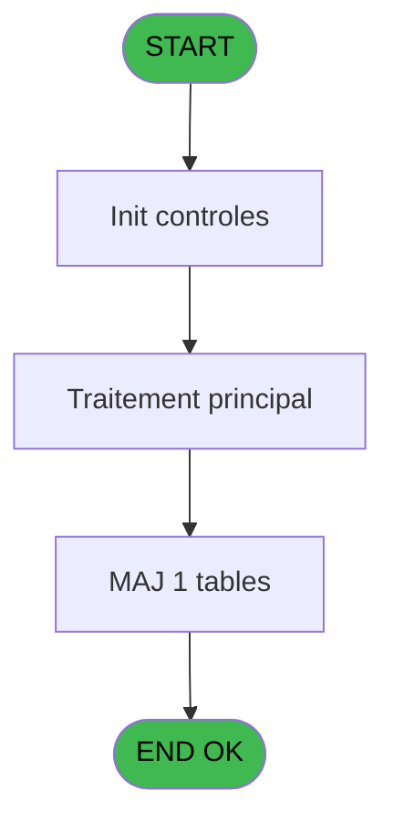
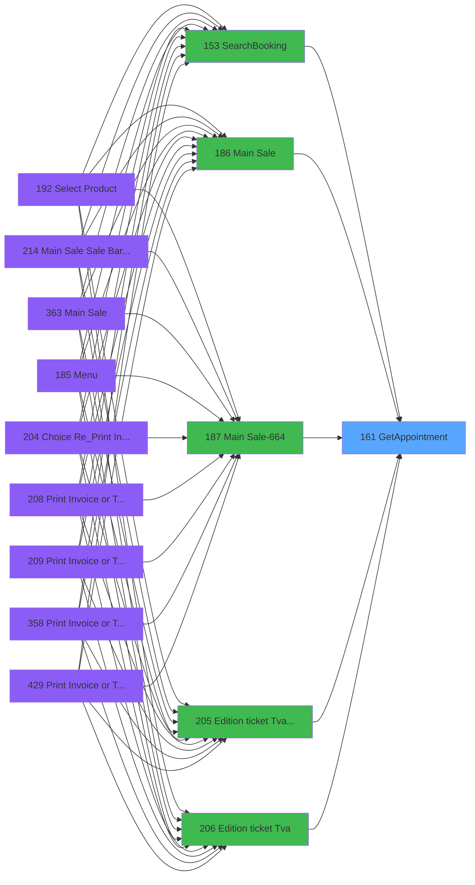
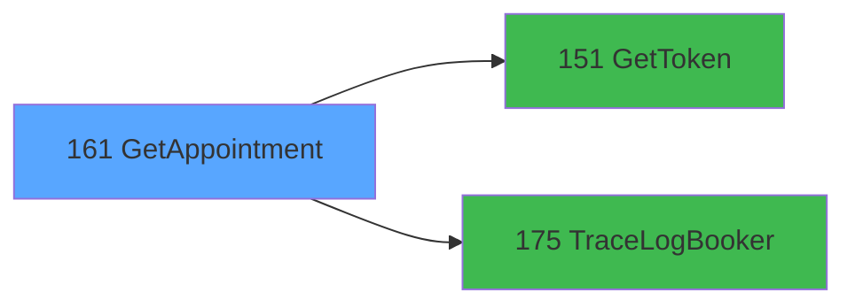

# PVE IDE 161 - GetAppointment

> **Analyse**: Phases 1-4 2026-02-03 09:50 -> 09:51 (20s) | Assemblage 09:51
> **Pipeline**: V7.2 Enrichi
> **Structure**: 4 onglets (Resume | Ecrans | Donnees | Connexions)

<!-- TAB:Resume -->

## 1. FICHE D'IDENTITE

| Attribut | Valeur |
|----------|--------|
| Projet | PVE |
| IDE Position | 161 |
| Nom Programme | GetAppointment |
| Fichier source | `Prg_161.xml` |
| Domaine metier | General |
| Taches | 3 (0 ecrans visibles) |
| Tables modifiees | 1 |
| Programmes appeles | 2 |

## 2. DESCRIPTION FONCTIONNELLE

**GetAppointment** assure la gestion complete de ce processus, accessible depuis [Main Sale (IDE 186)](PVE-IDE-186.md), [Main Sale-664 (IDE 187)](PVE-IDE-187.md), [Edition ticket (Tva) LEX (IDE 205)](PVE-IDE-205.md), [Edition ticket (Tva) (IDE 206)](PVE-IDE-206.md), [Main Sale Sale Bar Code (IDE 214)](PVE-IDE-214.md), [Main Sale (IDE 363)](PVE-IDE-363.md), [Main Sale-664 (IDE 364)](PVE-IDE-364.md), [Main Sale ===V4 Booking ACTUEL (IDE 417)](PVE-IDE-417.md), [Main Sale (IDE 440)](PVE-IDE-440.md), [Edition ticket (Tva) (IDE 442)](PVE-IDE-442.md), [SearchBooking (IDE 153)](PVE-IDE-153.md).

Le flux de traitement s'organise en **1 blocs fonctionnels** :

- **Traitement** (3 taches) : traitements metier divers

**Donnees modifiees** : 1 tables en ecriture (Table_1548).

**Logique metier** : 1 regles identifiees couvrant conditions metier.

## 3. BLOCS FONCTIONNELS

### 3.1 Traitement (3 taches)

Traitements internes.

---

#### 161 - GetAppointment

**Role** : Consultation/chargement : GetAppointment.
**Delegue a** : [GetToken (IDE 151)](PVE-IDE-151.md), [TraceLogBooker (IDE 175)](PVE-IDE-175.md)

---

#### 161.1 - ExtractDataFromXML

**Role** : Traitement : ExtractDataFromXML.
**Delegue a** : [GetToken (IDE 151)](PVE-IDE-151.md), [TraceLogBooker (IDE 175)](PVE-IDE-175.md)

---

#### 161.1.1 - DataToTable

**Role** : Traitement : DataToTable.
**Delegue a** : [GetToken (IDE 151)](PVE-IDE-151.md), [TraceLogBooker (IDE 175)](PVE-IDE-175.md)

## 5. REGLES METIER

1 regles identifiees:

### Autres (1 regles)

#### [RM-001] Condition toujours fausse (flag inactif)

| Element | Detail |
|---------|--------|
| **Condition** | `NOT(AppointmentIsNull [M])` |
| **Si vrai** | IsSuccess [N] |
| **Si faux** | 'FALSE'LOG) |
| **Variables** | M (AppointmentIsNull), N (IsSuccess) |
| **Expression source** | Expression 6 : `IF(NOT(AppointmentIsNull [M]), IsSuccess [N], 'FALSE'LOG)` |
| **Exemple** | Si NOT(AppointmentIsNull [M]) → IsSuccess [N]. Sinon → 'FALSE'LOG) |

## 6. CONTEXTE

- **Appele par**: [Main Sale (IDE 186)](PVE-IDE-186.md), [Main Sale-664 (IDE 187)](PVE-IDE-187.md), [Edition ticket (Tva) LEX (IDE 205)](PVE-IDE-205.md), [Edition ticket (Tva) (IDE 206)](PVE-IDE-206.md), [Main Sale Sale Bar Code (IDE 214)](PVE-IDE-214.md), [Main Sale (IDE 363)](PVE-IDE-363.md), [Main Sale-664 (IDE 364)](PVE-IDE-364.md), [Main Sale ===V4 Booking ACTUEL (IDE 417)](PVE-IDE-417.md), [Main Sale (IDE 440)](PVE-IDE-440.md), [Edition ticket (Tva) (IDE 442)](PVE-IDE-442.md), [SearchBooking (IDE 153)](PVE-IDE-153.md)
- **Appelle**: 2 programmes | **Tables**: 2 (W:1 R:1 L:0) | **Taches**: 3 | **Expressions**: 11

<!-- TAB:Ecrans -->

## 8. ECRANS

*(Programme sans ecran visible)*

## 9. NAVIGATION

### 9.3 Structure hierarchique (3 taches)

| Position | Tache | Type | Dimensions | Bloc |
|----------|-------|------|------------|------|
| **161.1** | [**GetAppointment** (161)](#t1) | - | - | Traitement |
| 161.1.1 | [ExtractDataFromXML (161.1)](#t2) | - | - | |
| 161.1.2 | [DataToTable (161.1.1)](#t3) | - | - | |

### 9.4 Algorigramme

> **Legende**: Vert = START/END OK | Rouge = END KO | Bleu = Decisions
> *Algorigramme auto-genere. Utiliser `/algorigramme` pour une synthese metier detaillee.*

<!-- TAB:Donnees -->

## 10. TABLES

### Tables utilisees (2)

| ID | Nom | Description | Type | R | W | L | Usages |
|----|-----|-------------|------|---|---|---|--------|
| 403 | pv_sellers |  | DB | R |   |   | 1 |
| 1548 | Table_1548 |  | MEM |   | **W** |   | 1 |

### Colonnes par table (1 / 2 tables avec colonnes identifiees)

Table 403 - pv_sellers (R) - 1 usages

| Lettre | Variable | Acces | Type |
|--------|----------|-------|------|
| A | NbrProduits | R | Numeric |
| B | V.BookingID | R | Unicode |
| C | V.IdProduit | R | Numeric |
| D | V.DateDebut | R | Date |
| E | V.TimeDebut | R | Time |
| F | V.DateFin | R | Date |
| G | V.TimeFin | R | Time |
| H | V.PraticienID | R | Numeric |
| I | V.PraticienFullName | R | Unicode |
| J | V.CabineID | R | Numeric |
| K | V.CabineName | R | Unicode |
| L | V.OrderID | R | Numeric |
| M | StatusCode | R | Numeric |
| N | StatusLibelle | R | Unicode |
| O | V.TimeStampDebut | R | Unicode |
| P | V.TimeStampFin | R | Unicode |

Table 1548 - Table_1548 (**W**) - 1 usages

*Table utilisee uniquement en Link ou aucune colonne Real identifiee dans le DataView.*

## 11. VARIABLES

### 11.1 Parametres entrants (5)

Variables recues du programme appelant ([Main Sale (IDE 186)](PVE-IDE-186.md)).

| Lettre | Nom | Type | Usage dans |
|--------|-----|------|-----------|
| A | P.BookingID | Unicode | 2x parametre entrant |
| B | P.IsSuccess | Logical | - |
| C | P.ErrorMessage | Alpha | - |
| D | P.OrderID | Numeric | - |
| E | P.ProductID | Numeric | - |

### 11.2 Autres (12)

Variables diverses.

| Lettre | Nom | Type | Usage dans |
|--------|-----|------|-----------|
| F | Token | Unicode | 2x refs |
| G | LocationID | Numeric | - |
| H | typeRequest | Alpha | - |
| I | UrlApi | Alpha | - |
| J | JsonIN | Blob | - |
| K | IsSuccessToken | Logical | - |
| L | ErrorMessageToken | Alpha | - |
| M | AppointmentIsNull | Logical | 1x refs |
| N | IsSuccess | Logical | 1x refs |
| O | ErrorMessage | Alpha | 1x refs |
| P | JsonResponse | Blob | 1x refs |
| Q | XMLResponse | Blob | - |

Toutes les 17 variables (liste complete)

| Cat | Lettre | Nom Variable | Type |
|-----|--------|--------------|------|
| P0 | **A** | P.BookingID | Unicode |
| P0 | **B** | P.IsSuccess | Logical |
| P0 | **C** | P.ErrorMessage | Alpha |
| P0 | **D** | P.OrderID | Numeric |
| P0 | **E** | P.ProductID | Numeric |
| Autre | **F** | Token | Unicode |
| Autre | **G** | LocationID | Numeric |
| Autre | **H** | typeRequest | Alpha |
| Autre | **I** | UrlApi | Alpha |
| Autre | **J** | JsonIN | Blob |
| Autre | **K** | IsSuccessToken | Logical |
| Autre | **L** | ErrorMessageToken | Alpha |
| Autre | **M** | AppointmentIsNull | Logical |
| Autre | **N** | IsSuccess | Logical |
| Autre | **O** | ErrorMessage | Alpha |
| Autre | **P** | JsonResponse | Blob |
| Autre | **Q** | XMLResponse | Blob |

## 12. EXPRESSIONS

**11 / 11 expressions decodees (100%)**

### 12.1 Repartition par type

| Type | Expressions | Regles |
|------|-------------|--------|
| CONCATENATION | 3 | 0 |
| CAST_LOGIQUE | 1 | 5 |
| CONSTANTE | 1 | 0 |
| DATE | 1 | 0 |
| REFERENCE_VG | 3 | 0 |
| OTHER | 2 | 0 |

### 12.2 Expressions cles par type

#### CONCATENATION (3 expressions)

| Type | IDE | Expression | Regle |
|------|-----|------------|-------|
| CONCATENATION | 5 | `'<?xml version="1.0" encoding="UTF-8"?>' &ASCIIChr(13)& ASCIIChr(10)&DotNet.System.Xml.Linq.XElement.Load(  DotNet.System.Runtime.Serialization.Json.JsonReaderWriterFactory.CreateJsonReader( JsonResponse [P],DotNet.System.Xml.XmlDictionaryReaderQuotas()   )).ToString()` | - |
| CONCATENATION | 4 | `Trim(VG66) & '/v4.1/merchant/appointment/' & '?access_token=' & Trim(Token [F]) & '&booking_number=' & Trim(P.BookingID [A])` | - |
| CONCATENATION | 3 | `Trim(VG66) & '/appointment/' & '?access_token=' & Trim(Token [F]) & '&booking_number=' & Trim(P.BookingID [A])` | - |

#### CAST_LOGIQUE (1 expressions)

| Type | IDE | Expression | Regle |
|------|-----|------------|-------|
| CAST_LOGIQUE | 6 | `IF(NOT(AppointmentIsNull [M]), IsSuccess [N], 'FALSE'LOG)` | [RM-001](#rm-RM-001) |

#### CONSTANTE (1 expressions)

| Type | IDE | Expression | Regle |
|------|-----|------------|-------|
| CONSTANTE | 2 | `'GET'` | - |

#### DATE (1 expressions)

| Type | IDE | Expression | Regle |
|------|-----|------------|-------|
| DATE | 8 | `Date()` | - |

#### REFERENCE_VG (3 expressions)

| Type | IDE | Expression | Regle |
|------|-----|------------|-------|
| REFERENCE_VG | 11 | `VG63` | - |
| REFERENCE_VG | 10 | `VG65` | - |
| REFERENCE_VG | 1 | `VG67` | - |

#### OTHER (2 expressions)

| Type | IDE | Expression | Regle |
|------|-----|------------|-------|
| OTHER | 9 | `Time()` | - |
| OTHER | 7 | `ErrorMessage [O]` | - |

<!-- TAB:Connexions -->

## 13. GRAPHE D'APPELS

### 13.1 Chaine depuis Main (Callers)

Main -> ... -> [Main Sale (IDE 186)](PVE-IDE-186.md) -> **GetAppointment (IDE 161)**

Main -> ... -> [Main Sale-664 (IDE 187)](PVE-IDE-187.md) -> **GetAppointment (IDE 161)**

Main -> ... -> [Edition ticket (Tva) LEX (IDE 205)](PVE-IDE-205.md) -> **GetAppointment (IDE 161)**

Main -> ... -> [Edition ticket (Tva) (IDE 206)](PVE-IDE-206.md) -> **GetAppointment (IDE 161)**

Main -> ... -> [Main Sale Sale Bar Code (IDE 214)](PVE-IDE-214.md) -> **GetAppointment (IDE 161)**

Main -> ... -> [Main Sale (IDE 363)](PVE-IDE-363.md) -> **GetAppointment (IDE 161)**

Main -> ... -> [Main Sale-664 (IDE 364)](PVE-IDE-364.md) -> **GetAppointment (IDE 161)**

Main -> ... -> [Main Sale ===V4 Booking ACTUEL (IDE 417)](PVE-IDE-417.md) -> **GetAppointment (IDE 161)**

Main -> ... -> [Main Sale (IDE 440)](PVE-IDE-440.md) -> **GetAppointment (IDE 161)**

Main -> ... -> [Edition ticket (Tva) (IDE 442)](PVE-IDE-442.md) -> **GetAppointment (IDE 161)**

Main -> ... -> [SearchBooking (IDE 153)](PVE-IDE-153.md) -> **GetAppointment (IDE 161)**

### 13.2 Callers

| IDE | Nom Programme | Nb Appels |
|-----|---------------|-----------|
| [186](PVE-IDE-186.md) | Main Sale | 3 |
| [187](PVE-IDE-187.md) | Main Sale-664 | 3 |
| [205](PVE-IDE-205.md) | Edition ticket (Tva) LEX | 3 |
| [206](PVE-IDE-206.md) | Edition ticket (Tva) | 3 |
| [214](PVE-IDE-214.md) | Main Sale Sale Bar Code | 3 |
| [363](PVE-IDE-363.md) | Main Sale | 3 |
| [364](PVE-IDE-364.md) | Main Sale-664 | 3 |
| [417](PVE-IDE-417.md) | Main Sale ===V4 Booking ACTUEL | 3 |
| [440](PVE-IDE-440.md) | Main Sale | 3 |
| [442](PVE-IDE-442.md) | Edition ticket (Tva) | 3 |
| [153](PVE-IDE-153.md) | SearchBooking | 1 |

### 13.3 Callees (programmes appeles)

### 13.4 Detail Callees avec contexte

| IDE | Nom Programme | Appels | Contexte |
|-----|---------------|--------|----------|
| [151](PVE-IDE-151.md) | GetToken | 1 | Recuperation donnees |
| [175](PVE-IDE-175.md) | TraceLogBooker | 1 | Sous-programme |

## 14. RECOMMANDATIONS MIGRATION

### 14.1 Profil du programme

| Metrique | Valeur | Impact migration |
|----------|--------|-----------------|
| Lignes de logique | 135 | Programme compact |
| Expressions | 11 | Peu de logique |
| Tables WRITE | 1 | Impact faible |
| Sous-programmes | 2 | Peu de dependances |
| Ecrans visibles | 0 | Ecran unique ou traitement batch |
| Code desactive | 0.7% (1 / 135) | Code sain |
| Regles metier | 1 | Quelques regles a preserver |

### 14.2 Plan de migration par bloc

#### Traitement (3 taches: 0 ecran, 3 traitements)

- **Strategie** : 3 service(s) backend injectable(s) (Domain Services).
- 2 sous-programme(s) a migrer ou a reutiliser depuis les services existants.
- Decomposer les taches en services unitaires testables.

### 14.3 Dependances critiques

| Dependance | Type | Appels | Impact |
|------------|------|--------|--------|
| Table_1548 | Table WRITE (Memory) | 1x | Schema + repository |
| [TraceLogBooker (IDE 175)](PVE-IDE-175.md) | Sous-programme | 1x | Normale - Sous-programme |
| [GetToken (IDE 151)](PVE-IDE-151.md) | Sous-programme | 1x | Normale - Recuperation donnees |

---
*Spec DETAILED generee par Pipeline V7.2 - 2026-02-03 09:51*
