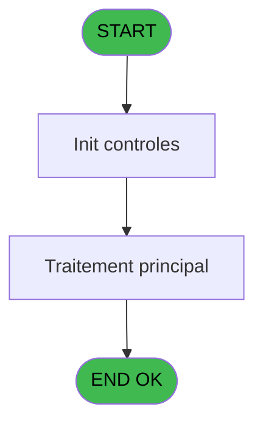
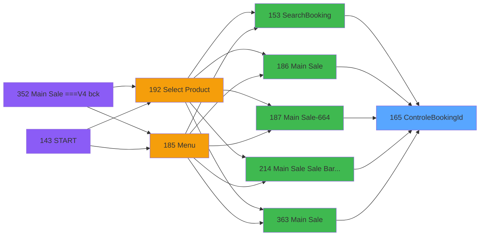

# PVE IDE 165 - ControleBookingId

> **Analyse**: Phases 1-4 2026-02-03 18:36 -> 18:36 (22s) | Assemblage 18:36
> **Pipeline**: V7.2 Enrichi
> **Structure**: 4 onglets (Resume | Ecrans | Donnees | Connexions)

<!-- TAB:Resume -->

## 1. FICHE D'IDENTITE

| Attribut | Valeur |
|----------|--------|
| Projet | PVE |
| IDE Position | 165 |
| Nom Programme | ControleBookingId |
| Fichier source | `Prg_165.xml` |
| Dossier IDE | Interface |
| Taches | 1 (0 ecrans visibles) |
| Tables modifiees | 0 |
| Programmes appeles | 0 |

## 2. DESCRIPTION FONCTIONNELLE

**ControleBookingId** assure la gestion complete de ce processus, accessible depuis [SearchBooking (IDE 153)](PVE-IDE-153.md), [Main Sale (IDE 186)](PVE-IDE-186.md), [Main Sale-664 (IDE 187)](PVE-IDE-187.md), [Main Sale Sale Bar Code (IDE 214)](PVE-IDE-214.md), [Main Sale (IDE 363)](PVE-IDE-363.md), [Main Sale-664 (IDE 364)](PVE-IDE-364.md), [Main Sale ===V4 Booking ACTUEL (IDE 417)](PVE-IDE-417.md), [Main Sale (IDE 440)](PVE-IDE-440.md).

Le flux de traitement s'organise en **1 blocs fonctionnels** :

- **Validation** (1 tache) : controles et verifications de coherence

## 3. BLOCS FONCTIONNELS

### 3.1 Validation (1 tache)

Controles de coherence : 1 tache verifie les donnees et conditions.

---

#### 165 - ControleBookingId

**Role** : Verification : ControleBookingId.

## 5. REGLES METIER

*(Aucune regle metier identifiee)*

## 6. CONTEXTE

- **Appele par**: [SearchBooking (IDE 153)](PVE-IDE-153.md), [Main Sale (IDE 186)](PVE-IDE-186.md), [Main Sale-664 (IDE 187)](PVE-IDE-187.md), [Main Sale Sale Bar Code (IDE 214)](PVE-IDE-214.md), [Main Sale (IDE 363)](PVE-IDE-363.md), [Main Sale-664 (IDE 364)](PVE-IDE-364.md), [Main Sale ===V4 Booking ACTUEL (IDE 417)](PVE-IDE-417.md), [Main Sale (IDE 440)](PVE-IDE-440.md)
- **Appelle**: 0 programmes | **Tables**: 1 (W:0 R:1 L:0) | **Taches**: 1 | **Expressions**: 7

<!-- TAB:Ecrans -->

## 8. ECRANS

*(Programme sans ecran visible)*

## 9. NAVIGATION

### 9.3 Structure hierarchique (1 tache)

| Position | Tache | Type | Dimensions | Bloc |
|----------|-------|------|------------|------|
| **165.1** | [**ControleBookingId** (165)](#t1) | - | - | Validation |

### 9.4 Algorigramme

> **Legende**: Vert = START/END OK | Rouge = END KO | Bleu = Decisions
> *Algorigramme auto-genere. Utiliser `/algorigramme` pour une synthese metier detaillee.*

<!-- TAB:Donnees -->

## 10. TABLES

### Tables utilisees (1)

| ID | Nom | Description | Type | R | W | L | Usages |
|----|-----|-------------|------|---|---|---|--------|
| 1548 | Table_1548 |  | MEM | R |   |   | 1 |

### Colonnes par table (1 / 1 tables avec colonnes identifiees)

Table 1548 - Table_1548 (R) - 1 usages

| Lettre | Variable | Acces | Type |
|--------|----------|-------|------|
| A | P.custID | R | Numeric |
| B | P.PackageID | R | Numeric |
| C | P.BookingID | R | Unicode |
| D | P.ProduitID | R | Numeric |
| E | IdIsOK | R | Logical |
| F | ExisteBookingID? | R | Logical |
| G | MemeProduit? | R | Logical |

## 11. VARIABLES

### 11.1 Parametres entrants (4)

Variables recues du programme appelant ([SearchBooking (IDE 153)](PVE-IDE-153.md)).

| Lettre | Nom | Type | Usage dans |
|--------|-----|------|-----------|
| A | P.custID | Numeric | - |
| B | P.PackageID | Numeric | - |
| C | P.BookingID | Unicode | 1x parametre entrant |
| D | P.ProduitID | Numeric | 1x parametre entrant |

### 11.2 Autres (3)

Variables diverses.

| Lettre | Nom | Type | Usage dans |
|--------|-----|------|-----------|
| E | IdIsOK | Logical | - |
| F | ExisteBookingID? | Logical | 2x refs |
| G | MemeProduit? | Logical | - |

## 12. EXPRESSIONS

**7 / 7 expressions decodees (100%)**

### 12.1 Repartition par type

| Type | Expressions | Regles |
|------|-------------|--------|
| CAST_LOGIQUE | 2 | 0 |
| OTHER | 4 | 0 |
| STRING | 1 | 0 |

### 12.2 Expressions cles par type

#### CAST_LOGIQUE (2 expressions)

| Type | IDE | Expression | Regle |
|------|-----|------------|-------|
| CAST_LOGIQUE | 2 | `'FALSE'LOG` | - |
| CAST_LOGIQUE | 1 | `'TRUE'LOG` | - |

#### OTHER (4 expressions)

| Type | IDE | Expression | Regle |
|------|-----|------------|-------|
| OTHER | 6 | `NOT(ExisteBookingID? [F])` | - |
| OTHER | 7 | `NOT([I])` | - |
| OTHER | 4 | `P.ProduitID [D]` | - |
| OTHER | 5 | `ExisteBookingID? [F]` | - |

#### STRING (1 expressions)

| Type | IDE | Expression | Regle |
|------|-----|------------|-------|
| STRING | 3 | `Trim(P.BookingID [C])` | - |

<!-- TAB:Connexions -->

## 13. GRAPHE D'APPELS

### 13.1 Chaine depuis Main (Callers)

Main -> ... -> [SearchBooking (IDE 153)](PVE-IDE-153.md) -> **ControleBookingId (IDE 165)**

Main -> ... -> [Main Sale (IDE 186)](PVE-IDE-186.md) -> **ControleBookingId (IDE 165)**

Main -> ... -> [Main Sale-664 (IDE 187)](PVE-IDE-187.md) -> **ControleBookingId (IDE 165)**

Main -> ... -> [Main Sale Sale Bar Code (IDE 214)](PVE-IDE-214.md) -> **ControleBookingId (IDE 165)**

Main -> ... -> [Main Sale (IDE 363)](PVE-IDE-363.md) -> **ControleBookingId (IDE 165)**

Main -> ... -> [Main Sale-664 (IDE 364)](PVE-IDE-364.md) -> **ControleBookingId (IDE 165)**

Main -> ... -> [Main Sale ===V4 Booking ACTUEL (IDE 417)](PVE-IDE-417.md) -> **ControleBookingId (IDE 165)**

Main -> ... -> [Main Sale (IDE 440)](PVE-IDE-440.md) -> **ControleBookingId (IDE 165)**

### 13.2 Callers

| IDE | Nom Programme | Nb Appels |
|-----|---------------|-----------|
| [153](PVE-IDE-153.md) | SearchBooking | 1 |
| [186](PVE-IDE-186.md) | Main Sale | 1 |
| [187](PVE-IDE-187.md) | Main Sale-664 | 1 |
| [214](PVE-IDE-214.md) | Main Sale Sale Bar Code | 1 |
| [363](PVE-IDE-363.md) | Main Sale | 1 |
| [364](PVE-IDE-364.md) | Main Sale-664 | 1 |
| [417](PVE-IDE-417.md) | Main Sale ===V4 Booking ACTUEL | 1 |
| [440](PVE-IDE-440.md) | Main Sale | 1 |

### 13.3 Callees (programmes appeles)

### 13.4 Detail Callees avec contexte

| IDE | Nom Programme | Appels | Contexte |
|-----|---------------|--------|----------|
| - | (aucun) | - | - |

## 14. RECOMMANDATIONS MIGRATION

### 14.1 Profil du programme

| Metrique | Valeur | Impact migration |
|----------|--------|-----------------|
| Lignes de logique | 29 | Programme compact |
| Expressions | 7 | Peu de logique |
| Tables WRITE | 0 | Impact faible |
| Sous-programmes | 0 | Peu de dependances |
| Ecrans visibles | 0 | Ecran unique ou traitement batch |
| Code desactive | 0% (0 / 29) | Code sain |
| Regles metier | 0 | Pas de regle identifiee |

### 14.2 Plan de migration par bloc

#### Validation (1 tache: 0 ecran, 1 traitement)

- **Strategie** : FluentValidation avec validators specifiques.
- Chaque tache de validation -> un validator injectable

### 14.3 Dependances critiques

| Dependance | Type | Appels | Impact |
|------------|------|--------|--------|

---
*Spec DETAILED generee par Pipeline V7.2 - 2026-02-03 18:36*
