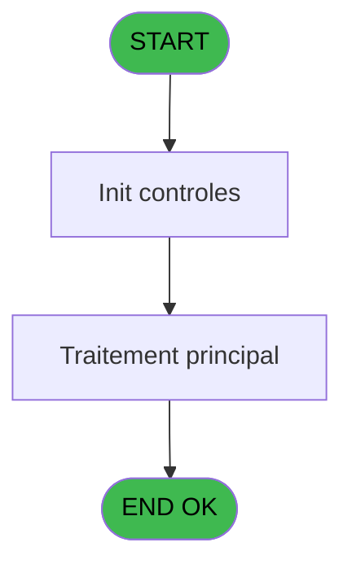
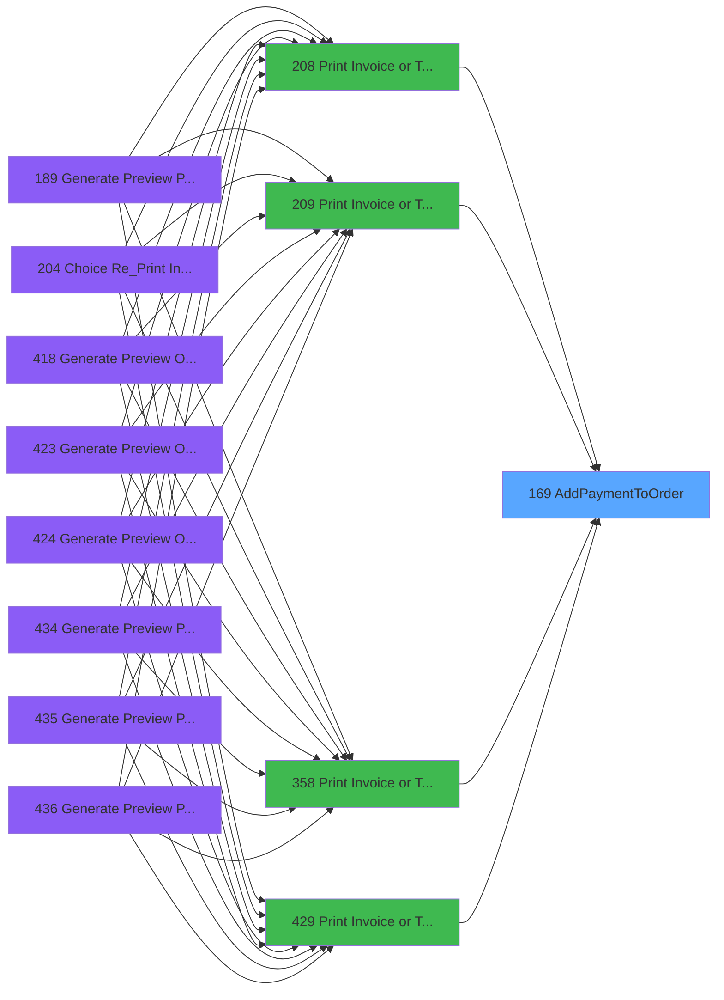
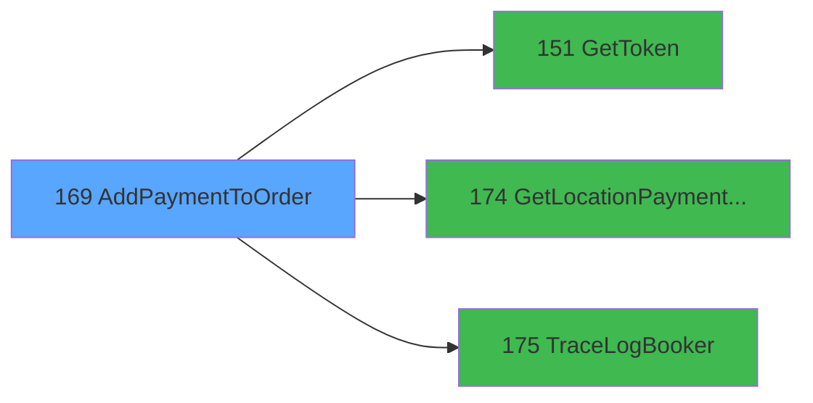

# PVE IDE 169 - AddPaymentToOrder

> **Analyse**: Phases 1-4 2026-02-03 18:38 -> 18:38 (18s) | Assemblage 18:38
> **Pipeline**: V7.2 Enrichi
> **Structure**: 4 onglets (Resume | Ecrans | Donnees | Connexions)

<!-- TAB:Resume -->

## 1. FICHE D'IDENTITE

| Attribut | Valeur |
|----------|--------|
| Projet | PVE |
| IDE Position | 169 |
| Nom Programme | AddPaymentToOrder |
| Fichier source | `Prg_169.xml` |
| Dossier IDE | Interface |
| Taches | 1 (0 ecrans visibles) |
| Tables modifiees | 0 |
| Programmes appeles | 3 |

## 2. DESCRIPTION FONCTIONNELLE

**AddPaymentToOrder** assure la gestion complete de ce processus, accessible depuis [Print Invoice or Ticket (IDE 208)](PVE-IDE-208.md), [Print Invoice or Ticket-664 (IDE 209)](PVE-IDE-209.md), [Print Invoice or Ticket (IDE 358)](PVE-IDE-358.md), [Print Invoice or Ticket==NEW (IDE 429)](PVE-IDE-429.md).

Le flux de traitement s'organise en **1 blocs fonctionnels** :

- **Traitement** (1 tache) : traitements metier divers

**Logique metier** : 1 regles identifiees couvrant conditions metier.

## 3. BLOCS FONCTIONNELS

### 3.1 Traitement (1 tache)

Traitements internes.

---

#### 169 - AddPaymentToOrder

**Role** : Traitement : AddPaymentToOrder.
**Delegue a** : [GetToken (IDE 151)](PVE-IDE-151.md), [GetLocationPaymentSettings (IDE 174)](PVE-IDE-174.md), [TraceLogBooker (IDE 175)](PVE-IDE-175.md)

## 5. REGLES METIER

1 regles identifiees:

### Autres (1 regles)

#### [RM-001] Traitement si P.Payment_FBOv1.00 [E] est renseigne

| Element | Detail |
|---------|--------|
| **Condition** | `P.Payment_FBOv1.00 [E]<>''` |
| **Si vrai** | P.Payment_FBOv1.00 [E] |
| **Si faux** | 'Marketing') |
| **Variables** | E (P.Payment_FBOv1.00) |
| **Expression source** | Expression 2 : `IF(P.Payment_FBOv1.00 [E]<>'',P.Payment_FBOv1.00 [E],'Market` |
| **Exemple** | Si P.Payment_FBOv1.00 [E]<>'' → P.Payment_FBOv1.00 [E]. Sinon → 'Marketing') |

## 6. CONTEXTE

- **Appele par**: [Print Invoice or Ticket (IDE 208)](PVE-IDE-208.md), [Print Invoice or Ticket-664 (IDE 209)](PVE-IDE-209.md), [Print Invoice or Ticket (IDE 358)](PVE-IDE-358.md), [Print Invoice or Ticket==NEW (IDE 429)](PVE-IDE-429.md)
- **Appelle**: 3 programmes | **Tables**: 0 (W:0 R:0 L:0) | **Taches**: 1 | **Expressions**: 13

<!-- TAB:Ecrans -->

## 8. ECRANS

*(Programme sans ecran visible)*

## 9. NAVIGATION

### 9.3 Structure hierarchique (1 tache)

| Position | Tache | Type | Dimensions | Bloc |
|----------|-------|------|------------|------|
| **169.1** | [**AddPaymentToOrder** (169)](#t1) | - | - | Traitement |

### 9.4 Algorigramme

> **Legende**: Vert = START/END OK | Rouge = END KO | Bleu = Decisions
> *Algorigramme auto-genere. Utiliser `/algorigramme` pour une synthese metier detaillee.*

<!-- TAB:Donnees -->

## 10. TABLES

### Tables utilisees (0)

| ID | Nom | Description | Type | R | W | L | Usages |
|----|-----|-------------|------|---|---|---|--------|

### Colonnes par table (0 / 0 tables avec colonnes identifiees)

## 11. VARIABLES

### 11.1 Parametres entrants (5)

Variables recues du programme appelant ([Print Invoice or Ticket (IDE 208)](PVE-IDE-208.md)).

| Lettre | Nom | Type | Usage dans |
|--------|-----|------|-----------|
| A | P.OrderID | Numeric | 3x parametre entrant |
| B | P.Amount | Numeric | 1x parametre entrant |
| C | P.Currency | Unicode | 1x parametre entrant |
| D | P.CustomPaymentMethodeID | Numeric | 1x parametre entrant |
| E | P.Payment_FBOv1.00 | Unicode | 1x parametre entrant |

### 11.2 Autres (14)

Variables diverses.

| Lettre | Nom | Type | Usage dans |
|--------|-----|------|-----------|
| F | PaymentMethodeID | Numeric | 2x refs |
| G | PaymentMethodeName | Unicode | 1x refs |
| H | CustomPaymentMethodID | Numeric | 1x refs |
| I | Token | Unicode | 1x refs |
| J | LocationID | Numeric | - |
| K | typeRequest | Alpha | - |
| L | UrlApi | Alpha | - |
| M | JsonIN | Blob | - |
| N | IsSuccessToken | Logical | - |
| O | ErrorMessageToken | Alpha | - |
| P | IsSuccess | Logical | - |
| Q | ErrorMessage | Alpha | - |
| R | JsonResponse | Blob | 1x refs |
| S | XMLResponse | Blob | - |

Toutes les 19 variables (liste complete)

| Cat | Lettre | Nom Variable | Type |
|-----|--------|--------------|------|
| P0 | **A** | P.OrderID | Numeric |
| P0 | **B** | P.Amount | Numeric |
| P0 | **C** | P.Currency | Unicode |
| P0 | **D** | P.CustomPaymentMethodeID | Numeric |
| P0 | **E** | P.Payment_FBOv1.00 | Unicode |
| Autre | **F** | PaymentMethodeID | Numeric |
| Autre | **G** | PaymentMethodeName | Unicode |
| Autre | **H** | CustomPaymentMethodID | Numeric |
| Autre | **I** | Token | Unicode |
| Autre | **J** | LocationID | Numeric |
| Autre | **K** | typeRequest | Alpha |
| Autre | **L** | UrlApi | Alpha |
| Autre | **M** | JsonIN | Blob |
| Autre | **N** | IsSuccessToken | Logical |
| Autre | **O** | ErrorMessageToken | Alpha |
| Autre | **P** | IsSuccess | Logical |
| Autre | **Q** | ErrorMessage | Alpha |
| Autre | **R** | JsonResponse | Blob |
| Autre | **S** | XMLResponse | Blob |

## 12. EXPRESSIONS

**13 / 13 expressions decodees (100%)**

### 12.1 Repartition par type

| Type | Expressions | Regles |
|------|-------------|--------|
| FORMAT | 3 | 0 |
| CONCATENATION | 1 | 0 |
| CONDITION | 1 | 5 |
| CONSTANTE | 2 | 0 |
| DATE | 1 | 0 |
| OTHER | 2 | 0 |
| REFERENCE_VG | 3 | 0 |

### 12.2 Expressions cles par type

#### FORMAT (3 expressions)

| Type | IDE | Expression | Regle |
|------|-----|------------|-------|
| FORMAT | 8 | `'{
    "PaymentItem": {
	"Amount": {
            "Amount":' & Trim(Str(P.Amount [B],'N12.3C')) & ',
            "CurrencyCode":"' & Trim(P.Currency [C]) & '"
        },
        "Method": {
            "ID": ' & Trim(Str(PaymentMethodeID [F],'10')) & ',
            "Name": "' & Trim(PaymentMethodeName [G]) & '"
        },
        "CustomPaymentMethodID" : "' & Trim(Str(CustomPaymentMethodID [H],'10')) & '"
    },
    "ID": ' & Trim(Str(P.OrderID [A],'18')) & ',
    "ReturnPartialOrderObject":true,
    "access_token": "' & Trim(Token [I]) & '"
}'` | - |
| FORMAT | 7 | `Trim(VG66) & '/v4.1/merchant/order/' & Trim(Str(P.OrderID [A],'18')) & '/add_payment'` | - |
| FORMAT | 6 | `Trim(VG66) & '/order/' & Trim(Str(P.OrderID [A],'18')) & '/add_payment'` | - |

#### CONCATENATION (1 expressions)

| Type | IDE | Expression | Regle |
|------|-----|------------|-------|
| CONCATENATION | 9 | `'<?xml version="1.0" encoding="UTF-8"?>' &ASCIIChr(13)& ASCIIChr(10)&DotNet.System.Xml.Linq.XElement.Load(  DotNet.System.Runtime.Serialization.Json.JsonReaderWriterFactory.CreateJsonReader( JsonResponse [R],DotNet.System.Xml.XmlDictionaryReaderQuotas()   )).ToString()` | - |

#### CONDITION (1 expressions)

| Type | IDE | Expression | Regle |
|------|-----|------------|-------|
| CONDITION | 2 | `IF(P.Payment_FBOv1.00 [E]<>'',P.Payment_FBOv1.00 [E],'Marketing')` | [RM-001](#rm-RM-001) |

#### CONSTANTE (2 expressions)

| Type | IDE | Expression | Regle |
|------|-----|------------|-------|
| CONSTANTE | 5 | `'POST'` | - |
| CONSTANTE | 1 | `11` | - |

#### DATE (1 expressions)

| Type | IDE | Expression | Regle |
|------|-----|------------|-------|
| DATE | 10 | `Date()` | - |

#### OTHER (2 expressions)

| Type | IDE | Expression | Regle |
|------|-----|------------|-------|
| OTHER | 11 | `Time()` | - |
| OTHER | 3 | `P.CustomPaymentMethodeID [D]` | - |

#### REFERENCE_VG (3 expressions)

| Type | IDE | Expression | Regle |
|------|-----|------------|-------|
| REFERENCE_VG | 13 | `VG63` | - |
| REFERENCE_VG | 12 | `VG65` | - |
| REFERENCE_VG | 4 | `VG67` | - |

<!-- TAB:Connexions -->

## 13. GRAPHE D'APPELS

### 13.1 Chaine depuis Main (Callers)

Main -> ... -> [Print Invoice or Ticket (IDE 208)](PVE-IDE-208.md) -> **AddPaymentToOrder (IDE 169)**

Main -> ... -> [Print Invoice or Ticket-664 (IDE 209)](PVE-IDE-209.md) -> **AddPaymentToOrder (IDE 169)**

Main -> ... -> [Print Invoice or Ticket (IDE 358)](PVE-IDE-358.md) -> **AddPaymentToOrder (IDE 169)**

Main -> ... -> [Print Invoice or Ticket==NEW (IDE 429)](PVE-IDE-429.md) -> **AddPaymentToOrder (IDE 169)**

### 13.2 Callers

| IDE | Nom Programme | Nb Appels |
|-----|---------------|-----------|
| [208](PVE-IDE-208.md) | Print Invoice or Ticket | 2 |
| [209](PVE-IDE-209.md) | Print Invoice or Ticket-664 | 2 |
| [358](PVE-IDE-358.md) | Print Invoice or Ticket | 2 |
| [429](PVE-IDE-429.md) | Print Invoice or Ticket==NEW | 2 |

### 13.3 Callees (programmes appeles)

### 13.4 Detail Callees avec contexte

| IDE | Nom Programme | Appels | Contexte |
|-----|---------------|--------|----------|
| [151](PVE-IDE-151.md) | GetToken | 1 | Recuperation donnees |
| [174](PVE-IDE-174.md) | GetLocationPaymentSettings | 1 | Recuperation donnees |
| [175](PVE-IDE-175.md) | TraceLogBooker | 1 | Sous-programme |

## 14. RECOMMANDATIONS MIGRATION

### 14.1 Profil du programme

| Metrique | Valeur | Impact migration |
|----------|--------|-----------------|
| Lignes de logique | 51 | Programme compact |
| Expressions | 13 | Peu de logique |
| Tables WRITE | 0 | Impact faible |
| Sous-programmes | 3 | Peu de dependances |
| Ecrans visibles | 0 | Ecran unique ou traitement batch |
| Code desactive | 2% (1 / 51) | Code sain |
| Regles metier | 1 | Quelques regles a preserver |

### 14.2 Plan de migration par bloc

#### Traitement (1 tache: 0 ecran, 1 traitement)

- **Strategie** : 1 service(s) backend injectable(s) (Domain Services).
- 3 sous-programme(s) a migrer ou a reutiliser depuis les services existants.
- Decomposer les taches en services unitaires testables.

### 14.3 Dependances critiques

| Dependance | Type | Appels | Impact |
|------------|------|--------|--------|
| [TraceLogBooker (IDE 175)](PVE-IDE-175.md) | Sous-programme | 1x | Normale - Sous-programme |
| [GetLocationPaymentSettings (IDE 174)](PVE-IDE-174.md) | Sous-programme | 1x | Normale - Recuperation donnees |
| [GetToken (IDE 151)](PVE-IDE-151.md) | Sous-programme | 1x | Normale - Recuperation donnees |

---
*Spec DETAILED generee par Pipeline V7.2 - 2026-02-03 18:38*
