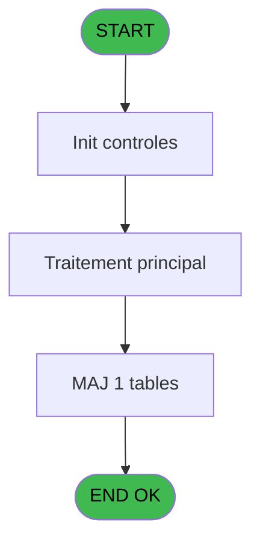
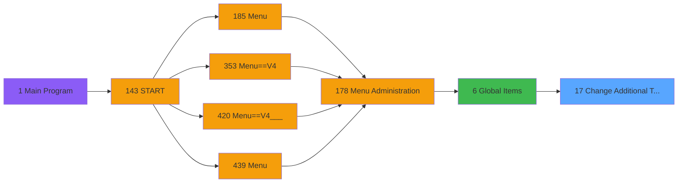
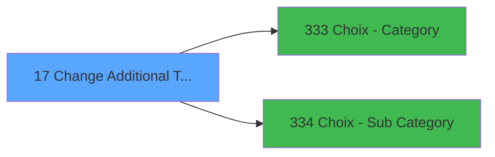

# PVE IDE 17 - Change Additional Taxes

> **Analyse**: Phases 1-4 2026-02-03 01:04 -> 01:05 (43s) | Assemblage 01:05
> **Pipeline**: V7.2 Enrichi
> **Structure**: 4 onglets (Resume | Ecrans | Donnees | Connexions)

<!-- TAB:Resume -->

## 1. FICHE D'IDENTITE

| Attribut | Valeur |
|----------|--------|
| Projet | PVE |
| IDE Position | 17 |
| Nom Programme | Change Additional Taxes |
| Fichier source | `Prg_17.xml` |
| Domaine metier | Change |
| Taches | 3 (1 ecrans visibles) |
| Tables modifiees | 1 |
| Programmes appeles | 2 |

## 2. DESCRIPTION FONCTIONNELLE

**Change Additional Taxes** assure la gestion complete de ce processus, accessible depuis [Global Items (IDE 6)](PVE-IDE-6.md).

Le flux de traitement s'organise en **1 blocs fonctionnels** :

- **Traitement** (3 taches) : traitements metier divers

**Donnees modifiees** : 1 tables en ecriture (pv_weight).

## 3. BLOCS FONCTIONNELS

### 3.1 Traitement (3 taches)

Traitements internes.

---

#### 17 - Change Additional Taxes [[ECRAN]](#ecran-t1)

**Role** : Traitement : Change Additional Taxes.
**Ecran** : 786 x 130 DLU (MDI) | [Voir mockup](#ecran-t1)

---

#### 17.1 - Update Products

**Role** : Traitement : Update Products.

---

#### 17.2 - (sans nom)

**Role** : Traitement interne.

## 5. REGLES METIER

*(Aucune regle metier identifiee)*

## 6. CONTEXTE

- **Appele par**: [Global Items (IDE 6)](PVE-IDE-6.md)
- **Appelle**: 2 programmes | **Tables**: 5 (W:1 R:2 L:2) | **Taches**: 3 | **Expressions**: 6

<!-- TAB:Ecrans -->

## 8. ECRANS

### 8.1 Forms visibles (1 / 3)

| # | Position | Tache | Nom | Type | Largeur | Hauteur | Bloc |
|---|----------|-------|-----|------|---------|---------|------|
| 1 | 17 | 17 | Change Additional Taxes | MDI | 786 | 130 | Traitement |

### 8.2 Mockups Ecrans

---

#### 17 - Change Additional Taxes
**Tache** : [17](#t1) | **Type** : MDI | **Dimensions** : 786 x 130 DLU
**Bloc** : Traitement | **Titre IDE** : Change Additional Taxes

<!-- FORM-DATA:
{
    "width":  786,
    "vFactor":  8,
    "type":  "MDI",
    "hFactor":  8,
    "controls":  [
                     {
                         "x":  393,
                         "type":  "label",
                         "var":  "",
                         "y":  16,
                         "w":  378,
                         "fmt":  "",
                         "name":  "",
                         "h":  17,
                         "color":  "187",
                         "text":  " VAT VALUE",
                         "parent":  null
                     },
                     {
                         "x":  8,
                         "type":  "label",
                         "var":  "",
                         "y":  3,
                         "w":  378,
                         "fmt":  "",
                         "name":  "",
                         "h":  37,
                         "color":  "183",
                         "text":  "Category",
                         "parent":  null
                     },
                     {
                         "x":  8,
                         "type":  "label",
                         "var":  "",
                         "y":  47,
                         "w":  378,
                         "fmt":  "",
                         "name":  "",
                         "h":  37,
                         "color":  "183",
                         "text":  "Sub Category",
                         "parent":  null
                     },
                     {
                         "x":  6,
                         "type":  "label",
                         "var":  "",
                         "y":  96,
                         "w":  773,
                         "fmt":  "",
                         "name":  "",
                         "h":  31,
                         "color":  "182",
                         "text":  "",
                         "parent":  null
                     },
                     {
                         "x":  394,
                         "type":  "label",
                         "var":  "",
                         "y":  56,
                         "w":  378,
                         "fmt":  "",
                         "name":  "",
                         "h":  17,
                         "color":  "187",
                         "text":  " APPLY ON",
                         "parent":  null
                     },
                     {
                         "x":  16,
                         "type":  "button",
                         "var":  "",
                         "y":  14,
                         "w":  358,
                         "fmt":  "",
                         "name":  "CAT",
                         "h":  22,
                         "color":  "",
                         "text":  "",
                         "parent":  2
                     },
                     {
                         "x":  16,
                         "type":  "button",
                         "var":  "",
                         "y":  58,
                         "w":  358,
                         "fmt":  "",
                         "name":  "SUBCAT",
                         "h":  22,
                         "color":  "",
                         "text":  "",
                         "parent":  5
                     },
                     {
                         "x":  14,
                         "type":  "button",
                         "var":  "",
                         "y":  102,
                         "w":  145,
                         "fmt":  "\u0026Exit",
                         "name":  "",
                         "h":  22,
                         "color":  "",
                         "text":  "",
                         "parent":  7
                     },
                     {
                         "x":  621,
                         "type":  "button",
                         "var":  "",
                         "y":  102,
                         "w":  145,
                         "fmt":  "\u0026Change",
                         "name":  "CHANGE",
                         "h":  22,
                         "color":  "",
                         "text":  "",
                         "parent":  7
                     },
                     {
                         "x":  557,
                         "type":  "combobox",
                         "var":  "",
                         "y":  18,
                         "w":  208,
                         "fmt":  "",
                         "name":  "VAT",
                         "h":  12,
                         "color":  "",
                         "text":  "",
                         "parent":  null
                     },
                     {
                         "x":  170,
                         "type":  "button",
                         "var":  "",
                         "y":  102,
                         "w":  145,
                         "fmt":  "\u0026RAZ",
                         "name":  "RAZ",
                         "h":  22,
                         "color":  "",
                         "text":  "",
                         "parent":  7
                     },
                     {
                         "x":  557,
                         "type":  "combobox",
                         "var":  "",
                         "y":  58,
                         "w":  213,
                         "fmt":  "",
                         "name":  "V.PORTEE",
                         "h":  12,
                         "color":  "",
                         "text":  "HT,TTC,TVA,NA",
                         "parent":  null
                     }
                 ],
    "taskId":  "17",
    "height":  130
}
-->

<strong>Champs : 2 champs</strong>

| Pos (x,y) | Nom | Variable | Type |
|-----------|-----|----------|------|
| 557,18 | VAT | - | combobox |
| 557,58 | V.PORTEE | - | combobox |

<strong>Boutons : 5 boutons</strong>

| Bouton | Pos (x,y) | Action |
|--------|-----------|--------|
| CAT | 16,14 | Appel [Choix - Category (IDE 333)](PVE-IDE-333.md) |
| SUBCAT | 16,58 | Bouton fonctionnel |
| Exit | 14,102 | Quitte le programme |
| Change | 621,102 | Modifie l'element |
| RAZ | 170,102 | Bouton fonctionnel |

## 9. NAVIGATION

Ecran unique: **Change Additional Taxes**

### 9.3 Structure hierarchique (3 taches)

| Position | Tache | Type | Dimensions | Bloc |
|----------|-------|------|------------|------|
| **17.1** | [**Change Additional Taxes** (17)](#t1) [mockup](#ecran-t1) | MDI | 786x130 | Traitement |
| 17.1.1 | [Update Products (17.1)](#t2) | - | - | |
| 17.1.2 | [(sans nom) (17.2)](#t3) | - | - | |

### 9.4 Algorigramme

> **Legende**: Vert = START/END OK | Rouge = END KO | Bleu = Decisions
> *Algorigramme auto-genere. Utiliser `/algorigramme` pour une synthese metier detaillee.*

<!-- TAB:Donnees -->

## 10. TABLES

### Tables utilisees (5)

| ID | Nom | Description | Type | R | W | L | Usages |
|----|-----|-------------|------|---|---|---|--------|
| 379 | pv_customer_temp |  | DB | R |   |   | 1 |
| 403 | pv_sellers |  | DB | R |   |   | 1 |
| 413 | pv_tva |  | DB |   |   | L | 1 |
| 417 | pv_weight |  | DB |   | **W** |   | 1 |
| 1628 | Table_1628 |  | MEM |   |   | L | 1 |

### Colonnes par table (1 / 3 tables avec colonnes identifiees)

Table 379 - pv_customer_temp (R) - 1 usages

| Lettre | Variable | Acces | Type |
|--------|----------|-------|------|
| A | P. tva Principale | R | Numeric |
| B | P. Category | R | Numeric |
| C | P.Sub Category | R | Numeric |
| D | V. LISTE_TVA | R | Unicode |
| E | V.TVA | R | Numeric |
| F | V.PORTEE | R | Unicode |

Table 403 - pv_sellers (R) - 1 usages

*Table utilisee uniquement en Link ou aucune colonne Real identifiee dans le DataView.*

Table 417 - pv_weight (**W**) - 1 usages

*Table utilisee uniquement en Link ou aucune colonne Real identifiee dans le DataView.*

## 11. VARIABLES

### 11.1 Parametres entrants (3)

Variables recues du programme appelant ([Global Items (IDE 6)](PVE-IDE-6.md)).

| Lettre | Nom | Type | Usage dans |
|--------|-----|------|-----------|
| A | P. tva Principale | Numeric | 1x parametre entrant |
| B | P. Category | Numeric | 1x parametre entrant |
| C | P.Sub Category | Numeric | - |

### 11.2 Variables de session (3)

Variables persistantes pendant toute la session.

| Lettre | Nom | Type | Usage dans |
|--------|-----|------|-----------|
| D | V. LISTE_TVA | Unicode | - |
| E | V.TVA | Numeric | - |
| F | V.PORTEE | Unicode | - |

## 12. EXPRESSIONS

**6 / 6 expressions decodees (100%)**

### 12.1 Repartition par type

| Type | Expressions | Regles |
|------|-------------|--------|
| CONSTANTE | 1 | 0 |
| OTHER | 3 | 0 |
| CONDITION | 2 | 0 |

### 12.2 Expressions cles par type

#### CONSTANTE (1 expressions)

| Type | IDE | Expression | Regle |
|------|-----|------------|-------|
| CONSTANTE | 4 | `0` | - |

#### OTHER (3 expressions)

| Type | IDE | Expression | Regle |
|------|-----|------------|-------|
| OTHER | 5 | `[O]` | - |
| OTHER | 2 | `P. tva Principale [A]` | - |
| OTHER | 1 | `GetParam ('SERVICE')` | - |

#### CONDITION (2 expressions)

| Type | IDE | Expression | Regle |
|------|-----|------------|-------|
| CONDITION | 6 | `[Q]<>0 AND [J]<>''` | - |
| CONDITION | 3 | `CndRange(P. Category [B]>0,P. Category [B])` | - |

<!-- TAB:Connexions -->

## 13. GRAPHE D'APPELS

### 13.1 Chaine depuis Main (Callers)

Main -> ... -> [Global Items (IDE 6)](PVE-IDE-6.md) -> **Change Additional Taxes (IDE 17)**

### 13.2 Callers

| IDE | Nom Programme | Nb Appels |
|-----|---------------|-----------|
| [6](PVE-IDE-6.md) | Global Items | 1 |

### 13.3 Callees (programmes appeles)

### 13.4 Detail Callees avec contexte

| IDE | Nom Programme | Appels | Contexte |
|-----|---------------|--------|----------|
| [333](PVE-IDE-333.md) | Choix - Category | 1 | Selection/consultation |
| [334](PVE-IDE-334.md) | Choix - Sub Category | 1 | Selection/consultation |

## 14. RECOMMANDATIONS MIGRATION

### 14.1 Profil du programme

| Metrique | Valeur | Impact migration |
|----------|--------|-----------------|
| Lignes de logique | 55 | Programme compact |
| Expressions | 6 | Peu de logique |
| Tables WRITE | 1 | Impact faible |
| Sous-programmes | 2 | Peu de dependances |
| Ecrans visibles | 1 | Ecran unique ou traitement batch |
| Code desactive | 0% (0 / 55) | Code sain |
| Regles metier | 0 | Pas de regle identifiee |

### 14.2 Plan de migration par bloc

#### Traitement (3 taches: 1 ecran, 2 traitements)

- **Strategie** : Orchestrateur avec 1 ecrans (Razor/React) et 2 traitements backend (services).
- Les ecrans deviennent des composants UI, les traitements invisibles deviennent des services injectables.
- 2 sous-programme(s) a migrer ou a reutiliser depuis les services existants.
- Decomposer les taches en services unitaires testables.

### 14.3 Dependances critiques

| Dependance | Type | Appels | Impact |
|------------|------|--------|--------|
| pv_weight | Table WRITE (Database) | 1x | Schema + repository |
| [Choix - Sub Category (IDE 334)](PVE-IDE-334.md) | Sous-programme | 1x | Normale - Selection/consultation |
| [Choix - Category (IDE 333)](PVE-IDE-333.md) | Sous-programme | 1x | Normale - Selection/consultation |

---
*Spec DETAILED generee par Pipeline V7.2 - 2026-02-03 01:05*
