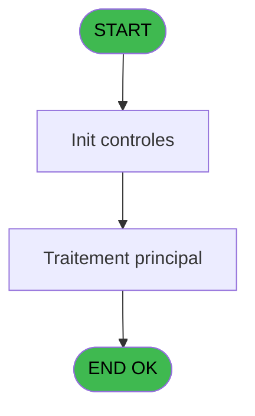
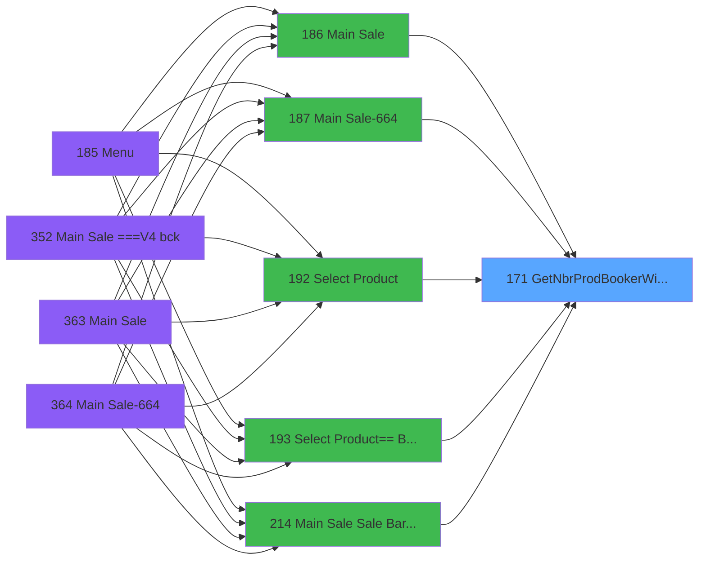

# PVE IDE 171 - GetNbrProdBookerWithoutBooking

> **Analyse**: Phases 1-4 2026-02-03 18:38 -> 18:39 (17s) | Assemblage 18:39
> **Pipeline**: V7.2 Enrichi
> **Structure**: 4 onglets (Resume | Ecrans | Donnees | Connexions)

<!-- TAB:Resume -->

## 1. FICHE D'IDENTITE

| Attribut | Valeur |
|----------|--------|
| Projet | PVE |
| IDE Position | 171 |
| Nom Programme | GetNbrProdBookerWithoutBooking |
| Fichier source | `Prg_171.xml` |
| Dossier IDE | Interface |
| Taches | 1 (0 ecrans visibles) |
| Tables modifiees | 0 |
| Programmes appeles | 0 |

## 2. DESCRIPTION FONCTIONNELLE

**GetNbrProdBookerWithoutBooking** assure la gestion complete de ce processus, accessible depuis [Select Product (IDE 192)](PVE-IDE-192.md), [Main Sale (IDE 186)](PVE-IDE-186.md), [Main Sale-664 (IDE 187)](PVE-IDE-187.md), [Select Product== Best Of (IDE 193)](PVE-IDE-193.md), [Main Sale Sale Bar Code (IDE 214)](PVE-IDE-214.md), [Main Sale (IDE 363)](PVE-IDE-363.md), [Main Sale-664 (IDE 364)](PVE-IDE-364.md), [Select Product== Best Of (IDE 413)](PVE-IDE-413.md), [Main Sale ===V4 Booking ACTUEL (IDE 417)](PVE-IDE-417.md), [Main Sale (IDE 440)](PVE-IDE-440.md).

Le flux de traitement s'organise en **1 blocs fonctionnels** :

- **Traitement** (1 tache) : traitements metier divers

**Logique metier** : 1 regles identifiees couvrant conditions metier.

## 3. BLOCS FONCTIONNELS

### 3.1 Traitement (1 tache)

Traitements internes.

---

#### 171 - GetNbrProdBookerWithoutBooking

**Role** : Consultation/chargement : GetNbrProdBookerWithoutBooking.

## 5. REGLES METIER

1 regles identifiees:

### Autres (1 regles)

#### [RM-001] Traitement si Trim([Q])='GIFT PASS',[P],IF([J] est non nul

| Element | Detail |
|---------|--------|
| **Condition** | `Trim([Q])='GIFT PASS'` |
| **Si vrai** | [P] |
| **Si faux** | IF([J]<>0,[J],[I])) |
| **Expression source** | Expression 16 : `IF(Trim([Q])='GIFT PASS',[P],IF([J]<>0,[J],[I]))` |
| **Exemple** | Si Trim([Q])='GIFT PASS' → [P]. Sinon → IF([J]<>0,[J],[I])) |

## 6. CONTEXTE

- **Appele par**: [Select Product (IDE 192)](PVE-IDE-192.md), [Main Sale (IDE 186)](PVE-IDE-186.md), [Main Sale-664 (IDE 187)](PVE-IDE-187.md), [Select Product== Best Of (IDE 193)](PVE-IDE-193.md), [Main Sale Sale Bar Code (IDE 214)](PVE-IDE-214.md), [Main Sale (IDE 363)](PVE-IDE-363.md), [Main Sale-664 (IDE 364)](PVE-IDE-364.md), [Select Product== Best Of (IDE 413)](PVE-IDE-413.md), [Main Sale ===V4 Booking ACTUEL (IDE 417)](PVE-IDE-417.md), [Main Sale (IDE 440)](PVE-IDE-440.md)
- **Appelle**: 0 programmes | **Tables**: 4 (W:0 R:1 L:3) | **Taches**: 1 | **Expressions**: 16

<!-- TAB:Ecrans -->

## 8. ECRANS

*(Programme sans ecran visible)*

## 9. NAVIGATION

### 9.3 Structure hierarchique (1 tache)

| Position | Tache | Type | Dimensions | Bloc |
|----------|-------|------|------------|------|
| **171.1** | [**GetNbrProdBookerWithoutBooking** (171)](#t1) | - | - | Traitement |

### 9.4 Algorigramme

> **Legende**: Vert = START/END OK | Rouge = END KO | Bleu = Decisions
> *Algorigramme auto-genere. Utiliser `/algorigramme` pour une synthese metier detaillee.*

<!-- TAB:Donnees -->

## 10. TABLES

### Tables utilisees (4)

| ID | Nom | Description | Type | R | W | L | Usages |
|----|-----|-------------|------|---|---|---|--------|
| 379 | pv_customer_temp |  | DB | R |   |   | 1 |
| 400 | pv_cust_rentals |  | DB |   |   | L | 1 |
| 403 | pv_sellers |  | DB |   |   | L | 1 |
| 1539 | Table_1539 |  | MEM |   |   | L | 1 |

### Colonnes par table (2 / 1 tables avec colonnes identifiees)

Table 379 - pv_customer_temp (R) - 1 usages

| Lettre | Variable | Acces | Type |
|--------|----------|-------|------|
| A | P.CustomerID | R | Numeric |
| B | P.Tab_Filiation1 | R | Alpha |
| C | P.NbrTotale | R | Numeric |
| D | P.NbrProdWithoutBooking | R | Numeric |
| E | P.PackageID | R | Numeric |
| F | P.IdBookerProduct | R | Numeric |
| G | v.PackageIdOrigine | R | Numeric |
| H | isNotBooked | R | Logical |

## 11. VARIABLES

### 11.1 Parametres entrants (6)

Variables recues du programme appelant ([Select Product (IDE 192)](PVE-IDE-192.md)).

| Lettre | Nom | Type | Usage dans |
|--------|-----|------|-----------|
| A | P.CustomerID | Numeric | 2x parametre entrant |
| B | P.Tab_Filiation1 | Alpha | 1x parametre entrant |
| C | P.NbrTotale | Numeric | 1x parametre entrant |
| D | P.NbrProdWithoutBooking | Numeric | 1x parametre entrant |
| E | P.PackageID | Numeric | - |
| F | P.IdBookerProduct | Numeric | - |

### 11.2 Variables de session (1)

Variables persistantes pendant toute la session.

| Lettre | Nom | Type | Usage dans |
|--------|-----|------|-----------|
| G | v.PackageIdOrigine | Numeric | - |

### 11.3 Autres (1)

Variables diverses.

| Lettre | Nom | Type | Usage dans |
|--------|-----|------|-----------|
| H | isNotBooked | Logical | - |

## 12. EXPRESSIONS

**16 / 16 expressions decodees (100%)**

### 12.1 Repartition par type

| Type | Expressions | Regles |
|------|-------------|--------|
| CALCULATION | 2 | 0 |
| CONDITION | 4 | 5 |
| CONSTANTE | 1 | 0 |
| OTHER | 8 | 0 |
| CAST_LOGIQUE | 1 | 0 |

### 12.2 Expressions cles par type

#### CALCULATION (2 expressions)

| Type | IDE | Expression | Regle |
|------|-----|------------|-------|
| CALCULATION | 10 | `P.NbrProdWithoutBooking [D] + 1` | - |
| CALCULATION | 9 | `P.NbrTotale [C] + 1` | - |

#### CONDITION (4 expressions)

| Type | IDE | Expression | Regle |
|------|-----|------------|-------|
| CONDITION | 16 | `IF(Trim([Q])='GIFT PASS',[P],IF([J]<>0,[J],[I]))` | [RM-001](#rm-RM-001) |
| CONDITION | 11 | `Trim([AD]) = '' AND [T] <> 0` | - |
| CONDITION | 12 | `[AE] AND [O] = 'SALE'` | - |
| CONDITION | 2 | `CndRange(P.Tab_Filiation1 [B] <> 'All',P.CustomerID [A])` | - |

#### CONSTANTE (1 expressions)

| Type | IDE | Expression | Regle |
|------|-----|------------|-------|
| CONSTANTE | 15 | `0` | - |

#### OTHER (8 expressions)

| Type | IDE | Expression | Regle |
|------|-----|------------|-------|
| OTHER | 8 | `[Z]` | - |
| OTHER | 7 | `P.CustomerID [A]` | - |
| OTHER | 14 | `[Y]` | - |
| OTHER | 13 | `[I]` | - |
| OTHER | 4 | `[K]` | - |
| ... | | *+3 autres* | |

#### CAST_LOGIQUE (1 expressions)

| Type | IDE | Expression | Regle |
|------|-----|------------|-------|
| CAST_LOGIQUE | 3 | `'FALSE'LOG` | - |

<!-- TAB:Connexions -->

## 13. GRAPHE D'APPELS

### 13.1 Chaine depuis Main (Callers)

Main -> ... -> [Select Product (IDE 192)](PVE-IDE-192.md) -> **GetNbrProdBookerWithoutBooking (IDE 171)**

Main -> ... -> [Main Sale (IDE 186)](PVE-IDE-186.md) -> **GetNbrProdBookerWithoutBooking (IDE 171)**

Main -> ... -> [Main Sale-664 (IDE 187)](PVE-IDE-187.md) -> **GetNbrProdBookerWithoutBooking (IDE 171)**

Main -> ... -> [Select Product== Best Of (IDE 193)](PVE-IDE-193.md) -> **GetNbrProdBookerWithoutBooking (IDE 171)**

Main -> ... -> [Main Sale Sale Bar Code (IDE 214)](PVE-IDE-214.md) -> **GetNbrProdBookerWithoutBooking (IDE 171)**

Main -> ... -> [Main Sale (IDE 363)](PVE-IDE-363.md) -> **GetNbrProdBookerWithoutBooking (IDE 171)**

Main -> ... -> [Main Sale-664 (IDE 364)](PVE-IDE-364.md) -> **GetNbrProdBookerWithoutBooking (IDE 171)**

Main -> ... -> [Select Product== Best Of (IDE 413)](PVE-IDE-413.md) -> **GetNbrProdBookerWithoutBooking (IDE 171)**

Main -> ... -> [Main Sale ===V4 Booking ACTUEL (IDE 417)](PVE-IDE-417.md) -> **GetNbrProdBookerWithoutBooking (IDE 171)**

Main -> ... -> [Main Sale (IDE 440)](PVE-IDE-440.md) -> **GetNbrProdBookerWithoutBooking (IDE 171)**

### 13.2 Callers

| IDE | Nom Programme | Nb Appels |
|-----|---------------|-----------|
| [192](PVE-IDE-192.md) | Select Product | 2 |
| [186](PVE-IDE-186.md) | Main Sale | 1 |
| [187](PVE-IDE-187.md) | Main Sale-664 | 1 |
| [193](PVE-IDE-193.md) | Select Product== Best Of | 1 |
| [214](PVE-IDE-214.md) | Main Sale Sale Bar Code | 1 |
| [363](PVE-IDE-363.md) | Main Sale | 1 |
| [364](PVE-IDE-364.md) | Main Sale-664 | 1 |
| [413](PVE-IDE-413.md) | Select Product== Best Of | 1 |
| [417](PVE-IDE-417.md) | Main Sale ===V4 Booking ACTUEL | 1 |
| [440](PVE-IDE-440.md) | Main Sale | 1 |

### 13.3 Callees (programmes appeles)

### 13.4 Detail Callees avec contexte

| IDE | Nom Programme | Appels | Contexte |
|-----|---------------|--------|----------|
| - | (aucun) | - | - |

## 14. RECOMMANDATIONS MIGRATION

### 14.1 Profil du programme

| Metrique | Valeur | Impact migration |
|----------|--------|-----------------|
| Lignes de logique | 53 | Programme compact |
| Expressions | 16 | Peu de logique |
| Tables WRITE | 0 | Impact faible |
| Sous-programmes | 0 | Peu de dependances |
| Ecrans visibles | 0 | Ecran unique ou traitement batch |
| Code desactive | 0% (0 / 53) | Code sain |
| Regles metier | 1 | Quelques regles a preserver |

### 14.2 Plan de migration par bloc

#### Traitement (1 tache: 0 ecran, 1 traitement)

- **Strategie** : 1 service(s) backend injectable(s) (Domain Services).
- Decomposer les taches en services unitaires testables.

### 14.3 Dependances critiques

| Dependance | Type | Appels | Impact |
|------------|------|--------|--------|

---
*Spec DETAILED generee par Pipeline V7.2 - 2026-02-03 18:39*
