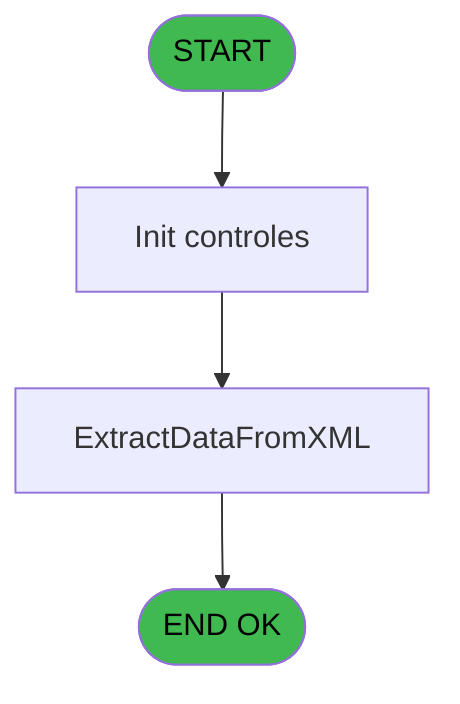
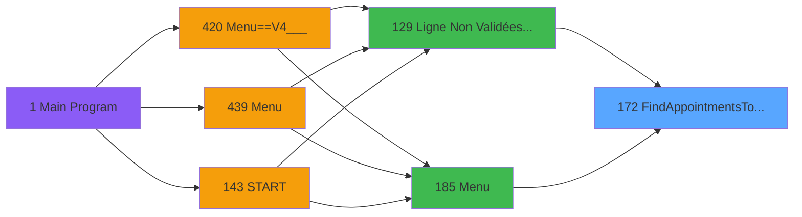
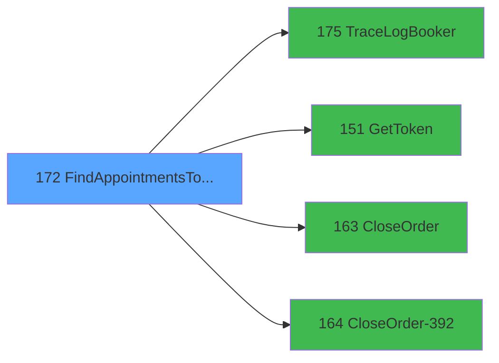

# PVE IDE 172 - FindAppointmentsToClose

> **Analyse**: Phases 1-4 2026-02-03 18:39 -> 18:39 (17s) | Assemblage 18:39
> **Pipeline**: V7.2 Enrichi
> **Structure**: 4 onglets (Resume | Ecrans | Donnees | Connexions)

<!-- TAB:Resume -->

## 1. FICHE D'IDENTITE

| Attribut | Valeur |
|----------|--------|
| Projet | PVE |
| IDE Position | 172 |
| Nom Programme | FindAppointmentsToClose |
| Fichier source | `Prg_172.xml` |
| Dossier IDE | Interface |
| Taches | 2 (1 ecrans visibles) |
| Tables modifiees | 0 |
| Programmes appeles | 4 |

## 2. DESCRIPTION FONCTIONNELLE

**FindAppointmentsToClose** assure la gestion complete de ce processus, accessible depuis [Ligne Non Validées & Edit Book (IDE 129)](PVE-IDE-129.md), [Menu (IDE 185)](PVE-IDE-185.md).

Le flux de traitement s'organise en **1 blocs fonctionnels** :

- **Traitement** (2 taches) : traitements metier divers

## 3. BLOCS FONCTIONNELS

### 3.1 Traitement (2 taches)

Traitements internes.

---

#### 172 - FindAppointmentsTOClose

**Role** : Traitement : FindAppointmentsTOClose.
**Delegue a** : [TraceLogBooker (IDE 175)](PVE-IDE-175.md), [GetToken (IDE 151)](PVE-IDE-151.md), [CloseOrder (IDE 163)](PVE-IDE-163.md)

---

#### 172.1 - Close [[ECRAN]](#ecran-t2)

**Role** : Traitement : Close.
**Ecran** : 236 x 49 DLU | [Voir mockup](#ecran-t2)
**Delegue a** : [TraceLogBooker (IDE 175)](PVE-IDE-175.md), [GetToken (IDE 151)](PVE-IDE-151.md), [CloseOrder (IDE 163)](PVE-IDE-163.md)

## 5. REGLES METIER

*(Aucune regle metier identifiee)*

## 6. CONTEXTE

- **Appele par**: [Ligne Non Validées & Edit Book (IDE 129)](PVE-IDE-129.md), [Menu (IDE 185)](PVE-IDE-185.md)
- **Appelle**: 4 programmes | **Tables**: 1 (W:0 R:1 L:0) | **Taches**: 2 | **Expressions**: 13

<!-- TAB:Ecrans -->

## 8. ECRANS

### 8.1 Forms visibles (1 / 2)

| # | Position | Tache | Nom | Type | Largeur | Hauteur | Bloc |
|---|----------|-------|-----|------|---------|---------|------|
| 1 | 172.1 | 172.1 | Close | Type0 | 236 | 49 | Traitement |

### 8.2 Mockups Ecrans

---

#### 172.1 - Close
**Tache** : [172.1](#t2) | **Type** : Type0 | **Dimensions** : 236 x 49 DLU
**Bloc** : Traitement | **Titre IDE** : Close

<!-- FORM-DATA:
{
    "width":  236,
    "vFactor":  8,
    "type":  "Type0",
    "hFactor":  4,
    "controls":  [
                     {
                         "x":  8,
                         "type":  "label",
                         "var":  "",
                         "y":  8,
                         "w":  220,
                         "fmt":  "",
                         "name":  "",
                         "h":  32,
                         "color":  "7",
                         "text":  "",
                         "parent":  null
                     },
                     {
                         "x":  18,
                         "type":  "label",
                         "var":  "",
                         "y":  16,
                         "w":  200,
                         "fmt":  "",
                         "name":  "",
                         "h":  16,
                         "color":  "158",
                         "text":  "",
                         "parent":  null
                     }
                 ],
    "taskId":  "172.1",
    "height":  49
}
-->

## 9. NAVIGATION

Ecran unique: **Close**

### 9.3 Structure hierarchique (2 taches)

| Position | Tache | Type | Dimensions | Bloc |
|----------|-------|------|------------|------|
| **172.1** | [**FindAppointmentsTOClose** (172)](#t1) | - | - | Traitement |
| 172.1.1 | [Close (172.1)](#t2) [mockup](#ecran-t2) | - | 236x49 | |

### 9.4 Algorigramme

> **Legende**: Vert = START/END OK | Rouge = END KO | Bleu = Decisions
> *Algorigramme auto-genere. Utiliser `/algorigramme` pour une synthese metier detaillee.*

<!-- TAB:Donnees -->

## 10. TABLES

### Tables utilisees (1)

| ID | Nom | Description | Type | R | W | L | Usages |
|----|-----|-------------|------|---|---|---|--------|
| 1539 | Table_1539 |  | MEM | R |   |   | 1 |

### Colonnes par table (1 / 1 tables avec colonnes identifiees)

Table 1539 - Table_1539 (R) - 1 usages

| Lettre | Variable | Acces | Type |
|--------|----------|-------|------|
| A | v.NbrAppointments | R | Numeric |
| B | v.NbrAppointments fermés | R | Numeric |
| C | v.BookingID | R | Unicode |
| D | v.CustomerLastName | R | Unicode |
| E | v.CustomerFirstName | R | Unicode |
| F | v.ProductName | R | Unicode |
| G | v.TimeStampDebut | R | Unicode |
| H | v.TimeStampFin | R | Unicode |
| I | v.DateRendezVous | R | Date |
| J | v.TimeRendezVous | R | Time |
| K | v.NoShow | R | Logical |
| L | v.IsOrderClosed | R | Logical |
| M | v.IsOrderPaid | R | Logical |
| N | v.OrderID | R | Numeric |
| O | v.FinalTotal | R | Numeric |
| P | v.Exist Appointment? | R | Logical |
| Q | v.Taille barre progression | R | Numeric |
| R | v.IsSuccess close ? | R | Logical |
| S | v.Libellé lligne log | R | Unicode |
| T | i.Log | R | Unicode |

## 11. VARIABLES

### 11.1 Parametres entrants (5)

Variables recues du programme appelant ([Ligne Non Validées & Edit Book (IDE 129)](PVE-IDE-129.md)).

| Lettre | Nom | Type | Usage dans |
|--------|-----|------|-----------|
| A | P.DateDebut | Date | - |
| B | P.TimeDebut | Time | - |
| C | P.DateFin | Date | - |
| D | P.TimeFin | Time | - |
| E | P.NbrAppointments | Numeric | - |

### 11.2 Variables de session (1)

Variables persistantes pendant toute la session.

| Lettre | Nom | Type | Usage dans |
|--------|-----|------|-----------|
| S | v.Log recap | Blob | 1x session |

### 11.3 Autres (14)

Variables diverses.

| Lettre | Nom | Type | Usage dans |
|--------|-----|------|-----------|
| F | Token | Unicode | 1x refs |
| G | LocationID | Numeric | 1x refs |
| H | typeRequest | Alpha | - |
| I | UrlApi | Alpha | - |
| J | TimeStampDebut | Unicode | 1x refs |
| K | TimeStampFin | Unicode | 1x refs |
| L | JsonIN | Blob | - |
| M | IsSuccessToken | Logical | - |
| N | ErrorMessageToken | Alpha | - |
| O | IsSuccess | Logical | 1x refs |
| P | ErrorMessage | Alpha | - |
| Q | JsonResponse | Blob | 1x refs |
| R | XmlResponse | Blob | - |
| T | i.Log | Unicode | - |

Toutes les 20 variables (liste complete)

| Cat | Lettre | Nom Variable | Type |
|-----|--------|--------------|------|
| P0 | **A** | P.DateDebut | Date |
| P0 | **B** | P.TimeDebut | Time |
| P0 | **C** | P.DateFin | Date |
| P0 | **D** | P.TimeFin | Time |
| P0 | **E** | P.NbrAppointments | Numeric |
| V. | **S** | v.Log recap | Blob |
| Autre | **F** | Token | Unicode |
| Autre | **G** | LocationID | Numeric |
| Autre | **H** | typeRequest | Alpha |
| Autre | **I** | UrlApi | Alpha |
| Autre | **J** | TimeStampDebut | Unicode |
| Autre | **K** | TimeStampFin | Unicode |
| Autre | **L** | JsonIN | Blob |
| Autre | **M** | IsSuccessToken | Logical |
| Autre | **N** | ErrorMessageToken | Alpha |
| Autre | **O** | IsSuccess | Logical |
| Autre | **P** | ErrorMessage | Alpha |
| Autre | **Q** | JsonResponse | Blob |
| Autre | **R** | XmlResponse | Blob |
| Autre | **T** | i.Log | Unicode |

## 12. EXPRESSIONS

**13 / 13 expressions decodees (100%)**

### 12.1 Repartition par type

| Type | Expressions | Regles |
|------|-------------|--------|
| CALCULATION | 2 | 0 |
| CONCATENATION | 1 | 0 |
| CONSTANTE | 1 | 0 |
| FORMAT | 1 | 0 |
| DATE | 1 | 0 |
| REFERENCE_VG | 3 | 0 |
| OTHER | 4 | 0 |

### 12.2 Expressions cles par type

#### CALCULATION (2 expressions)

| Type | IDE | Expression | Regle |
|------|-----|------------|-------|
| CALCULATION | 4 | `Trim(VG66) & '/v4.1/merchant/appointments'` | - |
| CALCULATION | 3 | `Trim(VG66) & '/appointments'` | - |

#### CONCATENATION (1 expressions)

| Type | IDE | Expression | Regle |
|------|-----|------------|-------|
| CONCATENATION | 6 | `'<?xml version="1.0" encoding="UTF-8"?>' &ASCIIChr(13)& ASCIIChr(10)&DotNet.System.Xml.Linq.XElement.Load(  DotNet.System.Runtime.Serialization.Json.JsonReaderWriterFactory.CreateJsonReader( JsonResponse [Q],DotNet.System.Xml.XmlDictionaryReaderQuotas()   )).ToString()` | - |

#### CONSTANTE (1 expressions)

| Type | IDE | Expression | Regle |
|------|-----|------------|-------|
| CONSTANTE | 2 | `'POST'` | - |

#### FORMAT (1 expressions)

| Type | IDE | Expression | Regle |
|------|-----|------------|-------|
| FORMAT | 5 | `'{
    "ClassInstanceID": null,
    "CustomerID": null,
    "EmployeeID": null,
    "FromStartDate": "/Date(' & Trim(TimeStampDebut [J]) & ')/",
    "LocationID": ' & Trim(Str(LocationID [G],'10')) & ',
    "PageNumber": 0,
    "PageSize": 0,
    "RoomID": null,
    "ToStartDate": "/Date(' & Trim(TimeStampFin [K]) & ')/",
    "UsePaging": false,
    "access_token": "' & Trim(Token [F]) & '",
    "SkipItemsForOtherAppointmentsInGroup": null,
    "FromDateLastModified": null,
    "ToDateLastModified": null,
    "OnlyClassAppointments": false,
    "ShowAppointmentIconFlags": false,
    "ExcludeEnrollmentAppointments": null,
    "IncludeAppointmentsForDependents": null
}'` | - |

#### DATE (1 expressions)

| Type | IDE | Expression | Regle |
|------|-----|------------|-------|
| DATE | 8 | `Date()` | - |

#### REFERENCE_VG (3 expressions)

| Type | IDE | Expression | Regle |
|------|-----|------------|-------|
| REFERENCE_VG | 11 | `VG63` | - |
| REFERENCE_VG | 10 | `VG65` | - |
| REFERENCE_VG | 1 | `VG67` | - |

#### OTHER (4 expressions)

| Type | IDE | Expression | Regle |
|------|-----|------------|-------|
| OTHER | 12 | `Prog()` | - |
| OTHER | 13 | `v.Log recap [S]` | - |
| OTHER | 7 | `IsSuccess [O]` | - |
| OTHER | 9 | `Time()` | - |

<!-- TAB:Connexions -->

## 13. GRAPHE D'APPELS

### 13.1 Chaine depuis Main (Callers)

Main -> ... -> [Ligne Non Validées & Edit Book (IDE 129)](PVE-IDE-129.md) -> **FindAppointmentsToClose (IDE 172)**

Main -> ... -> [Menu (IDE 185)](PVE-IDE-185.md) -> **FindAppointmentsToClose (IDE 172)**

### 13.2 Callers

| IDE | Nom Programme | Nb Appels |
|-----|---------------|-----------|
| [129](PVE-IDE-129.md) | Ligne Non Validées & Edit Book | 1 |
| [185](PVE-IDE-185.md) | Menu | 1 |

### 13.3 Callees (programmes appeles)

### 13.4 Detail Callees avec contexte

| IDE | Nom Programme | Appels | Contexte |
|-----|---------------|--------|----------|
| [175](PVE-IDE-175.md) | TraceLogBooker | 2 | Sous-programme |
| [151](PVE-IDE-151.md) | GetToken | 1 | Recuperation donnees |
| [163](PVE-IDE-163.md) | CloseOrder | 1 | Fermeture session |
| [164](PVE-IDE-164.md) | CloseOrder-392 | 1 | Fermeture session |

## 14. RECOMMANDATIONS MIGRATION

### 14.1 Profil du programme

| Metrique | Valeur | Impact migration |
|----------|--------|-----------------|
| Lignes de logique | 148 | Programme compact |
| Expressions | 13 | Peu de logique |
| Tables WRITE | 0 | Impact faible |
| Sous-programmes | 4 | Peu de dependances |
| Ecrans visibles | 1 | Ecran unique ou traitement batch |
| Code desactive | 0% (0 / 148) | Code sain |
| Regles metier | 0 | Pas de regle identifiee |

### 14.2 Plan de migration par bloc

#### Traitement (2 taches: 1 ecran, 1 traitement)

- **Strategie** : Orchestrateur avec 1 ecrans (Razor/React) et 1 traitements backend (services).
- Les ecrans deviennent des composants UI, les traitements invisibles deviennent des services injectables.
- 4 sous-programme(s) a migrer ou a reutiliser depuis les services existants.
- Decomposer les taches en services unitaires testables.

### 14.3 Dependances critiques

| Dependance | Type | Appels | Impact |
|------------|------|--------|--------|
| [TraceLogBooker (IDE 175)](PVE-IDE-175.md) | Sous-programme | 2x | Haute - Sous-programme |
| [CloseOrder-392 (IDE 164)](PVE-IDE-164.md) | Sous-programme | 1x | Normale - Fermeture session |
| [CloseOrder (IDE 163)](PVE-IDE-163.md) | Sous-programme | 1x | Normale - Fermeture session |
| [GetToken (IDE 151)](PVE-IDE-151.md) | Sous-programme | 1x | Normale - Recuperation donnees |

---
*Spec DETAILED generee par Pipeline V7.2 - 2026-02-03 18:39*
