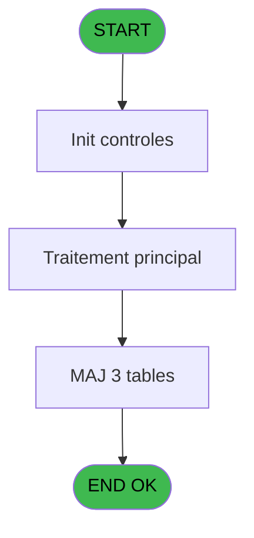
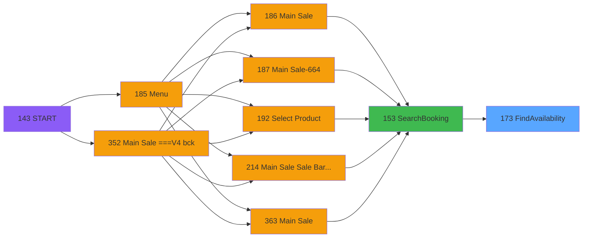
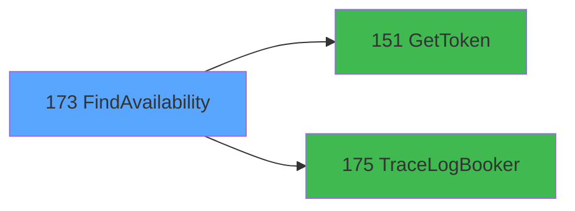

# PVE IDE 173 - FindAvailability

> **Analyse**: Phases 1-4 2026-02-03 18:39 -> 18:40 (19s) | Assemblage 18:40
> **Pipeline**: V7.2 Enrichi
> **Structure**: 4 onglets (Resume | Ecrans | Donnees | Connexions)

<!-- TAB:Resume -->

## 1. FICHE D'IDENTITE

| Attribut | Valeur |
|----------|--------|
| Projet | PVE |
| IDE Position | 173 |
| Nom Programme | FindAvailability |
| Fichier source | `Prg_173.xml` |
| Dossier IDE | Interface |
| Taches | 8 (0 ecrans visibles) |
| Tables modifiees | 3 |
| Programmes appeles | 2 |

## 2. DESCRIPTION FONCTIONNELLE

**FindAvailability** assure la gestion complete de ce processus, accessible depuis [SearchBooking (IDE 153)](PVE-IDE-153.md).

Le flux de traitement s'organise en **1 blocs fonctionnels** :

- **Traitement** (8 taches) : traitements metier divers

**Donnees modifiees** : 3 tables en ecriture (Table_1549, Table_1558, Table_1559).

Detail : phases du traitement

#### Phase 1 : Traitement (8 taches)

- **173** - FindAvailability
- **173.1** - ExtractDataFromXML
- **173.1.1** - DataToTables
- **173.1.2** - DataToEmployee
- **173.1.3** - DataToRoom
- **173.1.4** - DeleteAvailibility
- **173.1.5** - DeleteAvailibilityEmployees
- **173.1.6** - DeleteAvailibilityRooms

Delegue a : [GetToken (IDE 151)](PVE-IDE-151.md), [TraceLogBooker (IDE 175)](PVE-IDE-175.md)

#### Tables impactees

| Table | Operations | Role metier |
|-------|-----------|-------------|
| Table_1559 | **W** (2 usages) |  |
| Table_1549 | **W** (2 usages) |  |
| Table_1558 | **W** (2 usages) |  |

## 3. BLOCS FONCTIONNELS

### 3.1 Traitement (8 taches)

Traitements internes.

---

#### 173 - FindAvailability

**Role** : Tache d'orchestration : point d'entree du programme (8 sous-taches). Coordonne l'enchainement des traitements.

7 sous-taches directes

| Tache | Nom | Bloc |
|-------|-----|------|
| [173.1](#t2) | ExtractDataFromXML | Traitement |
| [173.1.1](#t3) | DataToTables | Traitement |
| [173.1.2](#t4) | DataToEmployee | Traitement |
| [173.1.3](#t5) | DataToRoom | Traitement |
| [173.1.4](#t6) | DeleteAvailibility | Traitement |
| [173.1.5](#t7) | DeleteAvailibilityEmployees | Traitement |
| [173.1.6](#t8) | DeleteAvailibilityRooms | Traitement |

**Delegue a** : [GetToken (IDE 151)](PVE-IDE-151.md), [TraceLogBooker (IDE 175)](PVE-IDE-175.md)

---

#### 173.1 - ExtractDataFromXML

**Role** : Traitement : ExtractDataFromXML.
**Delegue a** : [GetToken (IDE 151)](PVE-IDE-151.md), [TraceLogBooker (IDE 175)](PVE-IDE-175.md)

---

#### 173.1.1 - DataToTables

**Role** : Traitement : DataToTables.
**Delegue a** : [GetToken (IDE 151)](PVE-IDE-151.md), [TraceLogBooker (IDE 175)](PVE-IDE-175.md)

---

#### 173.1.2 - DataToEmployee

**Role** : Traitement : DataToEmployee.
**Delegue a** : [GetToken (IDE 151)](PVE-IDE-151.md), [TraceLogBooker (IDE 175)](PVE-IDE-175.md)

---

#### 173.1.3 - DataToRoom

**Role** : Traitement : DataToRoom.
**Delegue a** : [GetToken (IDE 151)](PVE-IDE-151.md), [TraceLogBooker (IDE 175)](PVE-IDE-175.md)

---

#### 173.1.4 - DeleteAvailibility

**Role** : Traitement : DeleteAvailibility.
**Delegue a** : [GetToken (IDE 151)](PVE-IDE-151.md), [TraceLogBooker (IDE 175)](PVE-IDE-175.md)

---

#### 173.1.5 - DeleteAvailibilityEmployees

**Role** : Traitement : DeleteAvailibilityEmployees.
**Delegue a** : [GetToken (IDE 151)](PVE-IDE-151.md), [TraceLogBooker (IDE 175)](PVE-IDE-175.md)

---

#### 173.1.6 - DeleteAvailibilityRooms

**Role** : Traitement : DeleteAvailibilityRooms.
**Delegue a** : [GetToken (IDE 151)](PVE-IDE-151.md), [TraceLogBooker (IDE 175)](PVE-IDE-175.md)

## 5. REGLES METIER

*(Aucune regle metier identifiee)*

## 6. CONTEXTE

- **Appele par**: [SearchBooking (IDE 153)](PVE-IDE-153.md)
- **Appelle**: 2 programmes | **Tables**: 5 (W:3 R:1 L:1) | **Taches**: 8 | **Expressions**: 10

<!-- TAB:Ecrans -->

## 8. ECRANS

*(Programme sans ecran visible)*

## 9. NAVIGATION

### 9.3 Structure hierarchique (8 taches)

| Position | Tache | Type | Dimensions | Bloc |
|----------|-------|------|------------|------|
| **173.1** | [**FindAvailability** (173)](#t1) | - | - | Traitement |
| 173.1.1 | [ExtractDataFromXML (173.1)](#t2) | - | - | |
| 173.1.2 | [DataToTables (173.1.1)](#t3) | - | - | |
| 173.1.3 | [DataToEmployee (173.1.2)](#t4) | - | - | |
| 173.1.4 | [DataToRoom (173.1.3)](#t5) | - | - | |
| 173.1.5 | [DeleteAvailibility (173.1.4)](#t6) | - | - | |
| 173.1.6 | [DeleteAvailibilityEmployees (173.1.5)](#t7) | - | - | |
| 173.1.7 | [DeleteAvailibilityRooms (173.1.6)](#t8) | - | - | |

### 9.4 Algorigramme

> **Legende**: Vert = START/END OK | Rouge = END KO | Bleu = Decisions
> *Algorigramme auto-genere. Utiliser `/algorigramme` pour une synthese metier detaillee.*

<!-- TAB:Donnees -->

## 10. TABLES

### Tables utilisees (5)

| ID | Nom | Description | Type | R | W | L | Usages |
|----|-----|-------------|------|---|---|---|--------|
| 1545 | Table_1545 |  | MEM | R |   |   | 1 |
| 1546 | Table_1546 |  | MEM |   |   | L | 1 |
| 1549 | Table_1549 |  | MEM |   | **W** |   | 2 |
| 1558 | Table_1558 |  | MEM |   | **W** |   | 2 |
| 1559 | Table_1559 |  | MEM |   | **W** |   | 2 |

### Colonnes par table (1 / 4 tables avec colonnes identifiees)

Table 1545 - Table_1545 (R) - 1 usages

| Lettre | Variable | Acces | Type |
|--------|----------|-------|------|
| A | NbrItineraryTimeSlotsLists | R | Numeric |
| B | NbrItineraryTimeSlots | R | Numeric |
| C | NbrTreatmentTimeSlots | R | Numeric |
| D | ProduitID | R | Numeric |
| E | TimeStamp | R | Unicode |
| F | PraticienID | R | Numeric |
| G | CabineId | R | Numeric |
| H | Prix | R | Numeric |
| I | Currency | R | Alpha |
| J | Duration | R | Numeric |
| K | Praticien2ID | R | Numeric |
| L | RecoveryTime | R | Numeric |
| M | V.DatePrestation | R | Date |
| N | V.HeurePrestation | R | Time |

Table 1549 - Table_1549 (**W**) - 2 usages

*Table utilisee uniquement en Link ou aucune colonne Real identifiee dans le DataView.*

Table 1558 - Table_1558 (**W**) - 2 usages

*Table utilisee uniquement en Link ou aucune colonne Real identifiee dans le DataView.*

Table 1559 - Table_1559 (**W**) - 2 usages

*Table utilisee uniquement en Link ou aucune colonne Real identifiee dans le DataView.*

## 11. VARIABLES

### 11.1 Parametres entrants (8)

Variables recues du programme appelant ([SearchBooking (IDE 153)](PVE-IDE-153.md)).

| Lettre | Nom | Type | Usage dans |
|--------|-----|------|-----------|
| A | P.DateDebut | Date | - |
| B | P.DateFin | Date | - |
| C | P.TimeDebut | Time | - |
| D | P.TimeFin | Time | - |
| E | P.Praticien | Numeric | 1x parametre entrant |
| F | P.Cabine | Numeric | 1x parametre entrant |
| G | P.ProduitID | Numeric | 1x parametre entrant |
| H | P.RajoutDonnees | Logical | - |

### 11.2 Autres (15)

Variables diverses.

| Lettre | Nom | Type | Usage dans |
|--------|-----|------|-----------|
| I | DateTimeDebutUnix | Unicode | 1x refs |
| J | DateTimeFinUnix | Unicode | 1x refs |
| K | Token | Unicode | 1x refs |
| L | LocationID | Numeric | 1x refs |
| M | typeRequest | Alpha | - |
| N | UrlApi | Alpha | - |
| O | JsonIN | Blob | - |
| P | IsSuccessToken | Logical | - |
| Q | ErrorMessageToken | Alpha | - |
| R | IsSuccess | Logical | - |
| S | ErrorMessage | Alpha | - |
| T | JsonResponse | Blob | 1x refs |
| U | XMLResponse | Blob | - |
| V | IsSuccessDate | Logical | - |
| W | ErrorDate | Alpha | - |

Toutes les 23 variables (liste complete)

| Cat | Lettre | Nom Variable | Type |
|-----|--------|--------------|------|
| P0 | **A** | P.DateDebut | Date |
| P0 | **B** | P.DateFin | Date |
| P0 | **C** | P.TimeDebut | Time |
| P0 | **D** | P.TimeFin | Time |
| P0 | **E** | P.Praticien | Numeric |
| P0 | **F** | P.Cabine | Numeric |
| P0 | **G** | P.ProduitID | Numeric |
| P0 | **H** | P.RajoutDonnees | Logical |
| Autre | **I** | DateTimeDebutUnix | Unicode |
| Autre | **J** | DateTimeFinUnix | Unicode |
| Autre | **K** | Token | Unicode |
| Autre | **L** | LocationID | Numeric |
| Autre | **M** | typeRequest | Alpha |
| Autre | **N** | UrlApi | Alpha |
| Autre | **O** | JsonIN | Blob |
| Autre | **P** | IsSuccessToken | Logical |
| Autre | **Q** | ErrorMessageToken | Alpha |
| Autre | **R** | IsSuccess | Logical |
| Autre | **S** | ErrorMessage | Alpha |
| Autre | **T** | JsonResponse | Blob |
| Autre | **U** | XMLResponse | Blob |
| Autre | **V** | IsSuccessDate | Logical |
| Autre | **W** | ErrorDate | Alpha |

## 12. EXPRESSIONS

**10 / 10 expressions decodees (100%)**

### 12.1 Repartition par type

| Type | Expressions | Regles |
|------|-------------|--------|
| CALCULATION | 2 | 0 |
| CONCATENATION | 1 | 0 |
| CONSTANTE | 1 | 0 |
| FORMAT | 1 | 0 |
| DATE | 1 | 0 |
| REFERENCE_VG | 3 | 0 |
| OTHER | 1 | 0 |

### 12.2 Expressions cles par type

#### CALCULATION (2 expressions)

| Type | IDE | Expression | Regle |
|------|-----|------------|-------|
| CALCULATION | 4 | `Trim(VG66) & '/availability/employee_room'` | - |
| CALCULATION | 3 | `Trim(VG66) & '/availability/employee_room'` | - |

#### CONCATENATION (1 expressions)

| Type | IDE | Expression | Regle |
|------|-----|------------|-------|
| CONCATENATION | 6 | `'<?xml version="1.0" encoding="UTF-8"?>' &ASCIIChr(13)& ASCIIChr(10)&DotNet.System.Xml.Linq.XElement.Load(  DotNet.System.Runtime.Serialization.Json.JsonReaderWriterFactory.CreateJsonReader(JsonResponse [T],     DotNet.System.Xml.XmlDictionaryReaderQuotas()   )).ToString()` | - |

#### CONSTANTE (1 expressions)

| Type | IDE | Expression | Regle |
|------|-----|------------|-------|
| CONSTANTE | 2 | `'POST'` | - |

#### FORMAT (1 expressions)

| Type | IDE | Expression | Regle |
|------|-----|------------|-------|
| FORMAT | 5 | `'{
    
    "EmployeeID": ' & IF(P.Praticien [E] <> 0,Trim(Str(P.Praticien [E],'10')),'null') & ',
    "EndDateTime": "/Date(' & Trim(DateTimeFinUnix [J]) & ')/",
    "IncludeFreelancers": false,
    "IsPackage": false,
    "LocationID":' & Trim(Str(LocationID [L],'10')) &',
    "PackageID": null,
    "Quantity": 1,
    "ServiceID":' & Trim(Str(P.ProduitID [G],'10')) &',
    "ServiceTypeID": 1,
    "StartDateTime": "/Date(' & Trim(DateTimeDebutUnix [I]) & ')/",
    "RoomID": ' & IF(P.Cabine [F] <> 0,Trim(Str(P.Cabine [F],'10')),'null') & ',
    "access_token": "'& Trim(Token [K]) &'"
}'` | - |

#### DATE (1 expressions)

| Type | IDE | Expression | Regle |
|------|-----|------------|-------|
| DATE | 7 | `Date()` | - |

#### REFERENCE_VG (3 expressions)

| Type | IDE | Expression | Regle |
|------|-----|------------|-------|
| REFERENCE_VG | 10 | `VG63` | - |
| REFERENCE_VG | 9 | `VG65` | - |
| REFERENCE_VG | 1 | `VG67` | - |

#### OTHER (1 expressions)

| Type | IDE | Expression | Regle |
|------|-----|------------|-------|
| OTHER | 8 | `Time()` | - |

<!-- TAB:Connexions -->

## 13. GRAPHE D'APPELS

### 13.1 Chaine depuis Main (Callers)

Main -> ... -> [SearchBooking (IDE 153)](PVE-IDE-153.md) -> **FindAvailability (IDE 173)**

### 13.2 Callers

| IDE | Nom Programme | Nb Appels |
|-----|---------------|-----------|
| [153](PVE-IDE-153.md) | SearchBooking | 4 |

### 13.3 Callees (programmes appeles)

### 13.4 Detail Callees avec contexte

| IDE | Nom Programme | Appels | Contexte |
|-----|---------------|--------|----------|
| [151](PVE-IDE-151.md) | GetToken | 1 | Recuperation donnees |
| [175](PVE-IDE-175.md) | TraceLogBooker | 1 | Sous-programme |

## 14. RECOMMANDATIONS MIGRATION

### 14.1 Profil du programme

| Metrique | Valeur | Impact migration |
|----------|--------|-----------------|
| Lignes de logique | 216 | Taille moyenne |
| Expressions | 10 | Peu de logique |
| Tables WRITE | 3 | Impact modere |
| Sous-programmes | 2 | Peu de dependances |
| Ecrans visibles | 0 | Ecran unique ou traitement batch |
| Code desactive | 1.4% (3 / 216) | Code sain |
| Regles metier | 0 | Pas de regle identifiee |

### 14.2 Plan de migration par bloc

#### Traitement (8 taches: 0 ecran, 8 traitements)

- **Strategie** : 8 service(s) backend injectable(s) (Domain Services).
- 2 sous-programme(s) a migrer ou a reutiliser depuis les services existants.
- Decomposer les taches en services unitaires testables.

### 14.3 Dependances critiques

| Dependance | Type | Appels | Impact |
|------------|------|--------|--------|
| Table_1549 | Table WRITE (Memory) | 2x | Schema + repository |
| Table_1558 | Table WRITE (Memory) | 2x | Schema + repository |
| Table_1559 | Table WRITE (Memory) | 2x | Schema + repository |
| [TraceLogBooker (IDE 175)](PVE-IDE-175.md) | Sous-programme | 1x | Normale - Sous-programme |
| [GetToken (IDE 151)](PVE-IDE-151.md) | Sous-programme | 1x | Normale - Recuperation donnees |

---
*Spec DETAILED generee par Pipeline V7.2 - 2026-02-03 18:40*
