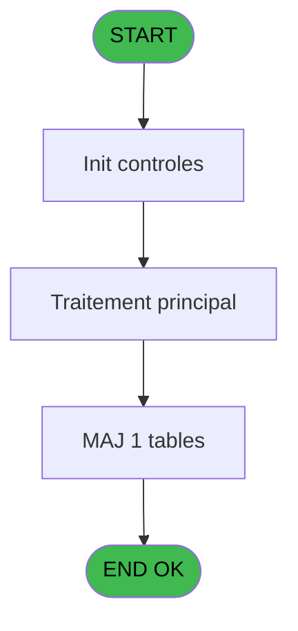
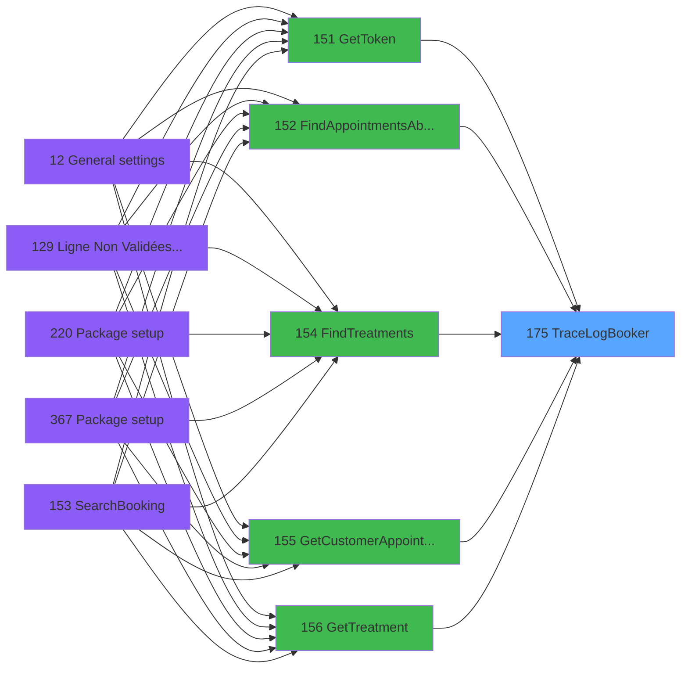

# PVE IDE 175 - TraceLogBooker

> **Analyse**: Phases 1-4 2026-02-03 18:40 -> 18:40 (17s) | Assemblage 18:40
> **Pipeline**: V7.2 Enrichi
> **Structure**: 4 onglets (Resume | Ecrans | Donnees | Connexions)

<!-- TAB:Resume -->

## 1. FICHE D'IDENTITE

| Attribut | Valeur |
|----------|--------|
| Projet | PVE |
| IDE Position | 175 |
| Nom Programme | TraceLogBooker |
| Fichier source | `Prg_175.xml` |
| Dossier IDE | Interface |
| Taches | 1 (0 ecrans visibles) |
| Tables modifiees | 1 |
| Programmes appeles | 0 |

## 2. DESCRIPTION FONCTIONNELLE

**TraceLogBooker** assure la gestion complete de ce processus, accessible depuis [Print Invoice or Ticket (IDE 208)](PVE-IDE-208.md), [Print Invoice or Ticket-664 (IDE 209)](PVE-IDE-209.md), [FindAppointmentsToClose (IDE 172)](PVE-IDE-172.md), [GetToken (IDE 151)](PVE-IDE-151.md), [FindAppointmentsAbsentPOS (IDE 152)](PVE-IDE-152.md), [FindTreatments (IDE 154)](PVE-IDE-154.md), [GetCustomerAppointments (IDE 155)](PVE-IDE-155.md), [GetTreatment (IDE 156)](PVE-IDE-156.md), [FindRooms (IDE 157)](PVE-IDE-157.md), [FindEmployees (IDE 158)](PVE-IDE-158.md), [CancelAppointment (IDE 159)](PVE-IDE-159.md), [CreateAppointment (IDE 160)](PVE-IDE-160.md), [GetAppointment (IDE 161)](PVE-IDE-161.md), [TakeDeposit (IDE 162)](PVE-IDE-162.md), [CloseOrder (IDE 163)](PVE-IDE-163.md), [CloseOrder-392 (IDE 164)](PVE-IDE-164.md), [UpdateAppointment (IDE 167)](PVE-IDE-167.md), [AddPaymentToOrder (IDE 169)](PVE-IDE-169.md), [AddSpecialToOrder-392 (IDE 170)](PVE-IDE-170.md), [FindAvailability (IDE 173)](PVE-IDE-173.md).

Le flux de traitement s'organise en **1 blocs fonctionnels** :

- **Traitement** (1 tache) : traitements metier divers

**Donnees modifiees** : 1 tables en ecriture (Table_1572).

## 3. BLOCS FONCTIONNELS

### 3.1 Traitement (1 tache)

Traitements internes.

---

#### 175 - TraceLogBooker

**Role** : Traitement : TraceLogBooker.

## 5. REGLES METIER

*(Aucune regle metier identifiee)*

## 6. CONTEXTE

- **Appele par**: [Print Invoice or Ticket (IDE 208)](PVE-IDE-208.md), [Print Invoice or Ticket-664 (IDE 209)](PVE-IDE-209.md), [FindAppointmentsToClose (IDE 172)](PVE-IDE-172.md), [GetToken (IDE 151)](PVE-IDE-151.md), [FindAppointmentsAbsentPOS (IDE 152)](PVE-IDE-152.md), [FindTreatments (IDE 154)](PVE-IDE-154.md), [GetCustomerAppointments (IDE 155)](PVE-IDE-155.md), [GetTreatment (IDE 156)](PVE-IDE-156.md), [FindRooms (IDE 157)](PVE-IDE-157.md), [FindEmployees (IDE 158)](PVE-IDE-158.md), [CancelAppointment (IDE 159)](PVE-IDE-159.md), [CreateAppointment (IDE 160)](PVE-IDE-160.md), [GetAppointment (IDE 161)](PVE-IDE-161.md), [TakeDeposit (IDE 162)](PVE-IDE-162.md), [CloseOrder (IDE 163)](PVE-IDE-163.md), [CloseOrder-392 (IDE 164)](PVE-IDE-164.md), [UpdateAppointment (IDE 167)](PVE-IDE-167.md), [AddPaymentToOrder (IDE 169)](PVE-IDE-169.md), [AddSpecialToOrder-392 (IDE 170)](PVE-IDE-170.md), [FindAvailability (IDE 173)](PVE-IDE-173.md)
- **Appelle**: 0 programmes | **Tables**: 1 (W:1 R:0 L:0) | **Taches**: 1 | **Expressions**: 9

<!-- TAB:Ecrans -->

## 8. ECRANS

*(Programme sans ecran visible)*

## 9. NAVIGATION

### 9.3 Structure hierarchique (1 tache)

| Position | Tache | Type | Dimensions | Bloc |
|----------|-------|------|------------|------|
| **175.1** | [**TraceLogBooker** (175)](#t1) | - | - | Traitement |

### 9.4 Algorigramme

> **Legende**: Vert = START/END OK | Rouge = END KO | Bleu = Decisions
> *Algorigramme auto-genere. Utiliser `/algorigramme` pour une synthese metier detaillee.*

<!-- TAB:Donnees -->

## 10. TABLES

### Tables utilisees (1)

| ID | Nom | Description | Type | R | W | L | Usages |
|----|-----|-------------|------|---|---|---|--------|
| 1572 | Table_1572 |  | MEM |   | **W** |   | 1 |

### Colonnes par table (1 / 1 tables avec colonnes identifiees)

Table 1572 - Table_1572 (**W**) - 1 usages

| Lettre | Variable | Acces | Type |
|--------|----------|-------|------|
| G | P.JsonIN | W | Blob |
| H | P.JsonOut | W | Blob |

## 11. VARIABLES

### 11.1 Parametres entrants (8)

Variables recues du programme appelant ([Print Invoice or Ticket (IDE 208)](PVE-IDE-208.md)).

| Lettre | Nom | Type | Usage dans |
|--------|-----|------|-----------|
| A | P.UrlApi | Unicode | 1x parametre entrant |
| B | P.DateLog | Date | 1x parametre entrant |
| C | P.TimeLog | Time | 1x parametre entrant |
| D | P.P.LocationID | Numeric | 1x parametre entrant |
| E | P.Statut | Logical | 1x parametre entrant |
| F | P.Login | Unicode | 1x parametre entrant |
| G | P.JsonIN | Blob | 1x parametre entrant |
| H | P.JsonOut | Blob | 1x parametre entrant |

## 12. EXPRESSIONS

**9 / 9 expressions decodees (100%)**

### 12.1 Repartition par type

| Type | Expressions | Regles |
|------|-------------|--------|
| OTHER | 9 | 0 |

### 12.2 Expressions cles par type

#### OTHER (9 expressions)

| Type | IDE | Expression | Regle |
|------|-----|------------|-------|
| OTHER | 7 | `P.Login [F]` | - |
| OTHER | 6 | `P.Statut [E]` | - |
| OTHER | 9 | `P.JsonOut [H]` | - |
| OTHER | 8 | `P.JsonIN [G]` | - |
| OTHER | 5 | `P.P.LocationID [D]` | - |
| ... | | *+4 autres* | |

<!-- TAB:Connexions -->

## 13. GRAPHE D'APPELS

### 13.1 Chaine depuis Main (Callers)

Main -> ... -> [Print Invoice or Ticket (IDE 208)](PVE-IDE-208.md) -> **TraceLogBooker (IDE 175)**

Main -> ... -> [Print Invoice or Ticket-664 (IDE 209)](PVE-IDE-209.md) -> **TraceLogBooker (IDE 175)**

Main -> ... -> [FindAppointmentsToClose (IDE 172)](PVE-IDE-172.md) -> **TraceLogBooker (IDE 175)**

Main -> ... -> [GetToken (IDE 151)](PVE-IDE-151.md) -> **TraceLogBooker (IDE 175)**

Main -> ... -> [FindAppointmentsAbsentPOS (IDE 152)](PVE-IDE-152.md) -> **TraceLogBooker (IDE 175)**

Main -> ... -> [FindTreatments (IDE 154)](PVE-IDE-154.md) -> **TraceLogBooker (IDE 175)**

Main -> ... -> [GetCustomerAppointments (IDE 155)](PVE-IDE-155.md) -> **TraceLogBooker (IDE 175)**

Main -> ... -> [GetTreatment (IDE 156)](PVE-IDE-156.md) -> **TraceLogBooker (IDE 175)**

Main -> ... -> [FindRooms (IDE 157)](PVE-IDE-157.md) -> **TraceLogBooker (IDE 175)**

Main -> ... -> [FindEmployees (IDE 158)](PVE-IDE-158.md) -> **TraceLogBooker (IDE 175)**

Main -> ... -> [CancelAppointment (IDE 159)](PVE-IDE-159.md) -> **TraceLogBooker (IDE 175)**

Main -> ... -> [CreateAppointment (IDE 160)](PVE-IDE-160.md) -> **TraceLogBooker (IDE 175)**

Main -> ... -> [GetAppointment (IDE 161)](PVE-IDE-161.md) -> **TraceLogBooker (IDE 175)**

Main -> ... -> [TakeDeposit (IDE 162)](PVE-IDE-162.md) -> **TraceLogBooker (IDE 175)**

Main -> ... -> [CloseOrder (IDE 163)](PVE-IDE-163.md) -> **TraceLogBooker (IDE 175)**

Main -> ... -> [CloseOrder-392 (IDE 164)](PVE-IDE-164.md) -> **TraceLogBooker (IDE 175)**

Main -> ... -> [UpdateAppointment (IDE 167)](PVE-IDE-167.md) -> **TraceLogBooker (IDE 175)**

Main -> ... -> [AddPaymentToOrder (IDE 169)](PVE-IDE-169.md) -> **TraceLogBooker (IDE 175)**

Main -> ... -> [AddSpecialToOrder-392 (IDE 170)](PVE-IDE-170.md) -> **TraceLogBooker (IDE 175)**

Main -> ... -> [FindAvailability (IDE 173)](PVE-IDE-173.md) -> **TraceLogBooker (IDE 175)**

### 13.2 Callers

| IDE | Nom Programme | Nb Appels |
|-----|---------------|-----------|
| [208](PVE-IDE-208.md) | Print Invoice or Ticket | 3 |
| [209](PVE-IDE-209.md) | Print Invoice or Ticket-664 | 3 |
| [172](PVE-IDE-172.md) | FindAppointmentsToClose | 2 |
| [151](PVE-IDE-151.md) | GetToken | 1 |
| [152](PVE-IDE-152.md) | FindAppointmentsAbsentPOS | 1 |
| [154](PVE-IDE-154.md) | FindTreatments | 1 |
| [155](PVE-IDE-155.md) | GetCustomerAppointments | 1 |
| [156](PVE-IDE-156.md) | GetTreatment | 1 |
| [157](PVE-IDE-157.md) | FindRooms | 1 |
| [158](PVE-IDE-158.md) | FindEmployees | 1 |
| [159](PVE-IDE-159.md) | CancelAppointment | 1 |
| [160](PVE-IDE-160.md) | CreateAppointment | 1 |
| [161](PVE-IDE-161.md) | GetAppointment | 1 |
| [162](PVE-IDE-162.md) | TakeDeposit | 1 |
| [163](PVE-IDE-163.md) | CloseOrder | 1 |
| [164](PVE-IDE-164.md) | CloseOrder-392 | 1 |
| [167](PVE-IDE-167.md) | UpdateAppointment | 1 |
| [169](PVE-IDE-169.md) | AddPaymentToOrder | 1 |
| [170](PVE-IDE-170.md) | AddSpecialToOrder-392 | 1 |
| [173](PVE-IDE-173.md) | FindAvailability | 1 |

### 13.3 Callees (programmes appeles)

### 13.4 Detail Callees avec contexte

| IDE | Nom Programme | Appels | Contexte |
|-----|---------------|--------|----------|
| - | (aucun) | - | - |

## 14. RECOMMANDATIONS MIGRATION

### 14.1 Profil du programme

| Metrique | Valeur | Impact migration |
|----------|--------|-----------------|
| Lignes de logique | 23 | Programme compact |
| Expressions | 9 | Peu de logique |
| Tables WRITE | 1 | Impact faible |
| Sous-programmes | 0 | Peu de dependances |
| Ecrans visibles | 0 | Ecran unique ou traitement batch |
| Code desactive | 0% (0 / 23) | Code sain |
| Regles metier | 0 | Pas de regle identifiee |

### 14.2 Plan de migration par bloc

#### Traitement (1 tache: 0 ecran, 1 traitement)

- **Strategie** : 1 service(s) backend injectable(s) (Domain Services).
- Decomposer les taches en services unitaires testables.

### 14.3 Dependances critiques

| Dependance | Type | Appels | Impact |
|------------|------|--------|--------|
| Table_1572 | Table WRITE (Memory) | 1x | Schema + repository |

---
*Spec DETAILED generee par Pipeline V7.2 - 2026-02-03 18:40*
