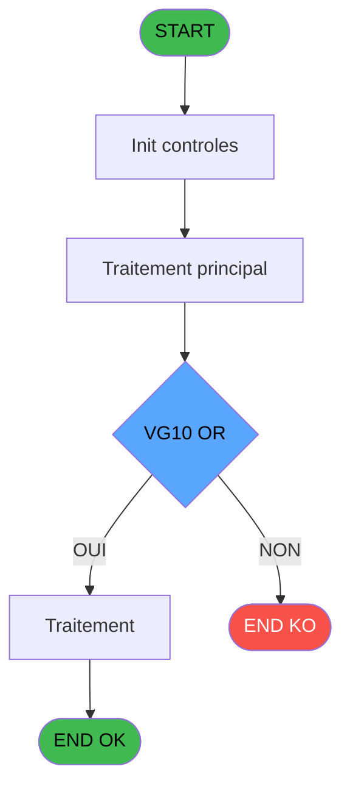
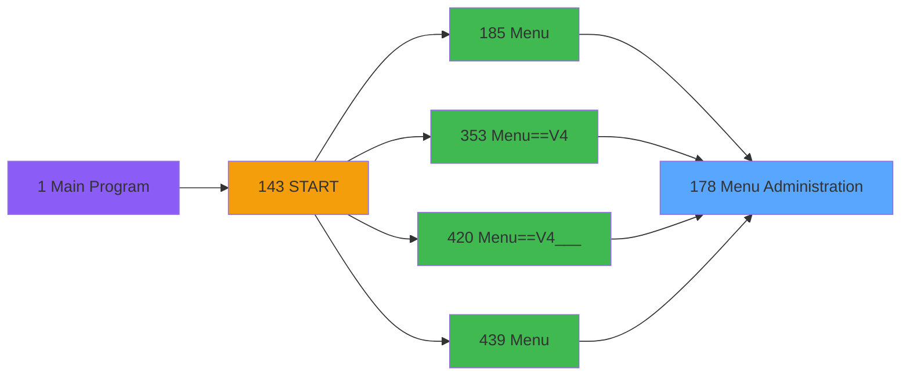
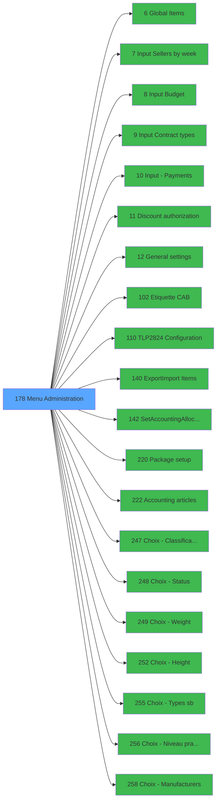

# PVE IDE 178 - Menu Administration

> **Analyse**: Phases 1-4 2026-02-03 18:41 -> 18:42 (17s) | Assemblage 18:42
> **Pipeline**: V7.2 Enrichi
> **Structure**: 4 onglets (Resume | Ecrans | Donnees | Connexions)

<!-- TAB:Resume -->

## 1. FICHE D'IDENTITE

| Attribut | Valeur |
|----------|--------|
| Projet | PVE |
| IDE Position | 178 |
| Nom Programme | Menu Administration |
| Fichier source | `Prg_178.xml` |
| Dossier IDE | Menu |
| Taches | 1 (1 ecrans visibles) |
| Tables modifiees | 0 |
| Programmes appeles | 20 |

## 2. DESCRIPTION FONCTIONNELLE

**Menu Administration** assure la gestion complete de ce processus, accessible depuis [Menu (IDE 185)](PVE-IDE-185.md), [Menu==V4 (IDE 353)](PVE-IDE-353.md), [Menu==V4___ (IDE 420)](PVE-IDE-420.md), [Menu (IDE 439)](PVE-IDE-439.md).

Le flux de traitement s'organise en **1 blocs fonctionnels** :

- **Traitement** (1 tache) : traitements metier divers

**Logique metier** : 3 regles identifiees couvrant conditions metier.

## 3. BLOCS FONCTIONNELS

### 3.1 Traitement (1 tache)

Traitements internes.

---

#### 178 - Menu options [[ECRAN]](#ecran-t1)

**Role** : Traitement : Menu options.
**Ecran** : 810 x 393 DLU (MDI) | [Voir mockup](#ecran-t1)
**Delegue a** : [Global Items (IDE 6)](PVE-IDE-6.md), [Input Sellers by week (IDE 7)](PVE-IDE-7.md), [Input Budget (IDE 8)](PVE-IDE-8.md)

## 5. REGLES METIER

3 regles identifiees:

### Autres (3 regles)

#### [RM-001] Si VG12 alors 'M' sinon 'Q')

| Element | Detail |
|---------|--------|
| **Condition** | `VG12` |
| **Si vrai** | 'M' |
| **Si faux** | 'Q') |
| **Expression source** | Expression 33 : `IF (VG12,'M','Q')` |
| **Exemple** | Si VG12 → 'M'. Sinon → 'Q') |

#### [RM-002] Si GetParam ('GROUP')='INFORMATICIEN' OR GetParam ('GROUP')='GESTION' alors 'M' sinon 'Q')

| Element | Detail |
|---------|--------|
| **Condition** | `GetParam ('GROUP')='INFORMATICIEN' OR GetParam ('GROUP')='GESTION'` |
| **Si vrai** | 'M' |
| **Si faux** | 'Q') |
| **Expression source** | Expression 34 : `IF (GetParam ('GROUP')='INFORMATICIEN' OR GetParam ('GROUP')` |
| **Exemple** | Si GetParam ('GROUP')='INFORMATICIEN' OR GetParam ('GROUP')='GESTION' → 'M'. Sinon → 'Q') |

#### [RM-003] Condition toujours vraie (flag actif)

| Element | Detail |
|---------|--------|
| **Condition** | `VG99` |
| **Si vrai** | VG10 OR [F] |
| **Si faux** | 'TRUE'LOG) |
| **Expression source** | Expression 50 : `IF(VG99,VG10 OR [F],'TRUE'LOG)` |
| **Exemple** | Si VG99 → VG10 OR [F]. Sinon → 'TRUE'LOG) |

## 6. CONTEXTE

- **Appele par**: [Menu (IDE 185)](PVE-IDE-185.md), [Menu==V4 (IDE 353)](PVE-IDE-353.md), [Menu==V4___ (IDE 420)](PVE-IDE-420.md), [Menu (IDE 439)](PVE-IDE-439.md)
- **Appelle**: 20 programmes | **Tables**: 2 (W:0 R:1 L:1) | **Taches**: 1 | **Expressions**: 55

<!-- TAB:Ecrans -->

## 8. ECRANS

### 8.1 Forms visibles (1 / 1)

| # | Position | Tache | Nom | Type | Largeur | Hauteur | Bloc |
|---|----------|-------|-----|------|---------|---------|------|
| 1 | 178 | 178 | Menu options | MDI | 810 | 393 | Traitement |

### 8.2 Mockups Ecrans

---

#### 178 - Menu options
**Tache** : [178](#t1) | **Type** : MDI | **Dimensions** : 810 x 393 DLU
**Bloc** : Traitement | **Titre IDE** : Menu options

<!-- FORM-DATA:
{
    "width":  810,
    "vFactor":  8,
    "type":  "MDI",
    "hFactor":  4,
    "controls":  [
                     {
                         "x":  19,
                         "type":  "line",
                         "var":  "",
                         "y":  335,
                         "w":  495,
                         "fmt":  "",
                         "name":  "",
                         "h":  0,
                         "color":  "",
                         "text":  "",
                         "parent":  null
                     },
                     {
                         "x":  2,
                         "type":  "label",
                         "var":  "",
                         "y":  2,
                         "w":  804,
                         "fmt":  "",
                         "name":  "",
                         "h":  32,
                         "color":  "183",
                         "text":  "",
                         "parent":  null
                     },
                     {
                         "x":  6,
                         "type":  "label",
                         "var":  "",
                         "y":  6,
                         "w":  796,
                         "fmt":  "",
                         "name":  "",
                         "h":  26,
                         "color":  "188",
                         "text":  "ADMINISTRATION CENTER",
                         "parent":  2
                     },
                     {
                         "x":  20,
                         "type":  "button",
                         "var":  "",
                         "y":  40,
                         "w":  121,
                         "fmt":  "Types of payment",
                         "name":  "F",
                         "h":  31,
                         "color":  "",
                         "text":  "",
                         "parent":  null
                     },
                     {
                         "x":  145,
                         "type":  "button",
                         "var":  "",
                         "y":  40,
                         "w":  121,
                         "fmt":  "Manufacturers",
                         "name":  "M",
                         "h":  31,
                         "color":  "",
                         "text":  "",
                         "parent":  null
                     },
                     {
                         "x":  270,
                         "type":  "button",
                         "var":  "",
                         "y":  40,
                         "w":  121,
                         "fmt":  "Equipment types",
                         "name":  "C",
                         "h":  31,
                         "color":  "",
                         "text":  "",
                         "parent":  null
                     },
                     {
                         "x":  395,
                         "type":  "button",
                         "var":  "",
                         "y":  40,
                         "w":  121,
                         "fmt":  "Weight",
                         "name":  "G",
                         "h":  31,
                         "color":  "",
                         "text":  "",
                         "parent":  null
                     },
                     {
                         "x":  20,
                         "type":  "button",
                         "var":  "",
                         "y":  77,
                         "w":  121,
                         "fmt":  "Accounting",
                         "name":  "L",
                         "h":  31,
                         "color":  "",
                         "text":  "",
                         "parent":  null
                     },
                     {
                         "x":  145,
                         "type":  "button",
                         "var":  "",
                         "y":  77,
                         "w":  121,
                         "fmt":  "Equipment owners",
                         "name":  "O",
                         "h":  31,
                         "color":  "",
                         "text":  "",
                         "parent":  null
                     },
                     {
                         "x":  270,
                         "type":  "button",
                         "var":  "",
                         "y":  77,
                         "w":  121,
                         "fmt":  "Equipment models",
                         "name":  "N",
                         "h":  31,
                         "color":  "",
                         "text":  "",
                         "parent":  null
                     },
                     {
                         "x":  395,
                         "type":  "button",
                         "var":  "",
                         "y":  77,
                         "w":  121,
                         "fmt":  "Height",
                         "name":  "H",
                         "h":  31,
                         "color":  "",
                         "text":  "",
                         "parent":  null
                     },
                     {
                         "x":  20,
                         "type":  "button",
                         "var":  "",
                         "y":  114,
                         "w":  121,
                         "fmt":  "Status",
                         "name":  "E",
                         "h":  31,
                         "color":  "",
                         "text":  "",
                         "parent":  null
                     },
                     {
                         "x":  145,
                         "type":  "button",
                         "var":  "",
                         "y":  114,
                         "w":  121,
                         "fmt":  "Prepaid packages",
                         "name":  "B",
                         "h":  31,
                         "color":  "",
                         "text":  "",
                         "parent":  null
                     },
                     {
                         "x":  270,
                         "type":  "button",
                         "var":  "",
                         "y":  114,
                         "w":  121,
                         "fmt":  "Classification",
                         "name":  "D",
                         "h":  31,
                         "color":  "",
                         "text":  "",
                         "parent":  null
                     },
                     {
                         "x":  395,
                         "type":  "button",
                         "var":  "",
                         "y":  114,
                         "w":  121,
                         "fmt":  "skier type",
                         "name":  "I",
                         "h":  31,
                         "color":  "",
                         "text":  "",
                         "parent":  null
                     },
                     {
                         "x":  20,
                         "type":  "button",
                         "var":  "",
                         "y":  151,
                         "w":  121,
                         "fmt":  "Discount reasons",
                         "name":  "P",
                         "h":  31,
                         "color":  "",
                         "text":  "",
                         "parent":  null
                     },
                     {
                         "x":  145,
                         "type":  "button",
                         "var":  "",
                         "y":  151,
                         "w":  121,
                         "fmt":  "Packages",
                         "name":  "A",
                         "h":  31,
                         "color":  "",
                         "text":  "",
                         "parent":  null
                     },
                     {
                         "x":  270,
                         "type":  "button",
                         "var":  "",
                         "y":  151,
                         "w":  121,
                         "fmt":  "Bindings setting",
                         "name":  "K",
                         "h":  31,
                         "color":  "",
                         "text":  "",
                         "parent":  null
                     },
                     {
                         "x":  395,
                         "type":  "button",
                         "var":  "",
                         "y":  151,
                         "w":  121,
                         "fmt":  "snowboarder type",
                         "name":  "J",
                         "h":  31,
                         "color":  "",
                         "text":  "",
                         "parent":  null
                     },
                     {
                         "x":  270,
                         "type":  "button",
                         "var":  "",
                         "y":  188,
                         "w":  121,
                         "fmt":  "VAT",
                         "name":  "VAT",
                         "h":  31,
                         "color":  "",
                         "text":  "",
                         "parent":  null
                     },
                     {
                         "x":  395,
                         "type":  "button",
                         "var":  "",
                         "y":  188,
                         "w":  121,
                         "fmt":  "Selling units",
                         "name":  "UNIT",
                         "h":  31,
                         "color":  "",
                         "text":  "",
                         "parent":  null
                     },
                     {
                         "x":  20,
                         "type":  "button",
                         "var":  "",
                         "y":  188,
                         "w":  121,
                         "fmt":  "Discounts",
                         "name":  "DISCOUNTS",
                         "h":  31,
                         "color":  "",
                         "text":  "",
                         "parent":  null
                     },
                     {
                         "x":  145,
                         "type":  "button",
                         "var":  "",
                         "y":  188,
                         "w":  121,
                         "fmt":  "Global Items",
                         "name":  "ITEMS",
                         "h":  31,
                         "color":  "",
                         "text":  "",
                         "parent":  null
                     },
                     {
                         "x":  20,
                         "type":  "button",
                         "var":  "",
                         "y":  225,
                         "w":  121,
                         "fmt":  "Movement types",
                         "name":  "MVT",
                         "h":  31,
                         "color":  "",
                         "text":  "",
                         "parent":  null
                     },
                     {
                         "x":  145,
                         "type":  "button",
                         "var":  "",
                         "y":  225,
                         "w":  121,
                         "fmt":  "Discount authorize",
                         "name":  "DISCOUNTPRODUCT",
                         "h":  31,
                         "color":  "",
                         "text":  "",
                         "parent":  null
                     },
                     {
                         "x":  270,
                         "type":  "button",
                         "var":  "",
                         "y":  225,
                         "w":  121,
                         "fmt":  "Labels",
                         "name":  "LABELS",
                         "h":  31,
                         "color":  "",
                         "text":  "",
                         "parent":  null
                     },
                     {
                         "x":  19,
                         "type":  "button",
                         "var":  "",
                         "y":  343,
                         "w":  121,
                         "fmt":  "General Settings",
                         "name":  "Y",
                         "h":  31,
                         "color":  "",
                         "text":  "",
                         "parent":  null
                     },
                     {
                         "x":  145,
                         "type":  "button",
                         "var":  "",
                         "y":  343,
                         "w":  121,
                         "fmt":  "Export Items",
                         "name":  "EXPORT ITEMS",
                         "h":  31,
                         "color":  "",
                         "text":  "",
                         "parent":  null
                     },
                     {
                         "x":  270,
                         "type":  "button",
                         "var":  "",
                         "y":  343,
                         "w":  121,
                         "fmt":  "Import Items",
                         "name":  "IMPORT ITEMS",
                         "h":  31,
                         "color":  "",
                         "text":  "",
                         "parent":  null
                     },
                     {
                         "x":  395,
                         "type":  "button",
                         "var":  "",
                         "y":  343,
                         "w":  121,
                         "fmt":  "ZEBRA configuration",
                         "name":  "Z",
                         "h":  31,
                         "color":  "",
                         "text":  "",
                         "parent":  null
                     },
                     {
                         "x":  20,
                         "type":  "button",
                         "var":  "",
                         "y":  262,
                         "w":  121,
                         "fmt":  "Budget",
                         "name":  "BUDGET",
                         "h":  31,
                         "color":  "",
                         "text":  "",
                         "parent":  null
                     },
                     {
                         "x":  145,
                         "type":  "button",
                         "var":  "",
                         "y":  262,
                         "w":  121,
                         "fmt":  "Hotel Days",
                         "name":  "HD",
                         "h":  31,
                         "color":  "",
                         "text":  "",
                         "parent":  null
                     },
                     {
                         "x":  270,
                         "type":  "button",
                         "var":  "",
                         "y":  262,
                         "w":  121,
                         "fmt":  "Sellers types of contract",
                         "name":  "CONTRACT",
                         "h":  31,
                         "color":  "",
                         "text":  "",
                         "parent":  null
                     },
                     {
                         "x":  395,
                         "type":  "button",
                         "var":  "",
                         "y":  262,
                         "w":  121,
                         "fmt":  "Sellers / Week",
                         "name":  "SELLERSWEEK",
                         "h":  31,
                         "color":  "",
                         "text":  "",
                         "parent":  null
                     },
                     {
                         "x":  20,
                         "type":  "button",
                         "var":  "",
                         "y":  299,
                         "w":  121,
                         "fmt":  "Sales settings",
                         "name":  "PARAMSALES",
                         "h":  31,
                         "color":  "",
                         "text":  "",
                         "parent":  null
                     },
                     {
                         "x":  554,
                         "type":  "edit",
                         "var":  "",
                         "y":  10,
                         "w":  245,
                         "fmt":  "30",
                         "name":  "",
                         "h":  18,
                         "color":  "174",
                         "text":  "",
                         "parent":  3
                     },
                     {
                         "x":  395,
                         "type":  "button",
                         "var":  "",
                         "y":  225,
                         "w":  121,
                         "fmt":  "Messages",
                         "name":  "MESSAGES",
                         "h":  31,
                         "color":  "",
                         "text":  "",
                         "parent":  null
                     },
                     {
                         "x":  145,
                         "type":  "button",
                         "var":  "",
                         "y":  299,
                         "w":  121,
                         "fmt":  "Email Follow Up",
                         "name":  "EMAIL",
                         "h":  31,
                         "color":  "",
                         "text":  "",
                         "parent":  null
                     },
                     {
                         "x":  270,
                         "type":  "button",
                         "var":  "",
                         "y":  299,
                         "w":  121,
                         "fmt":  "Credit Recalculation",
                         "name":  "RECALC",
                         "h":  31,
                         "color":  "",
                         "text":  "",
                         "parent":  null
                     },
                     {
                         "x":  397,
                         "type":  "button",
                         "var":  "",
                         "y":  299,
                         "w":  121,
                         "fmt":  "Accounting allocations",
                         "name":  "ACCOUNTING",
                         "h":  31,
                         "color":  "",
                         "text":  "",
                         "parent":  null
                     }
                 ],
    "taskId":  "178",
    "height":  393
}
-->

<strong>Champs : 1 champs</strong>

| Pos (x,y) | Nom | Variable | Type |
|-----------|-----|----------|------|
| 554,10 | 30 | - | edit |

<strong>Boutons : 36 boutons</strong>

| Bouton | Pos (x,y) | Action |
|--------|-----------|--------|
| Types of payment | 20,40 | Appel [Input Contract types (IDE 9)](PVE-IDE-9.md) |
| Manufacturers | 145,40 | Appel [Choix - Manufacturers (IDE 258)](PVE-IDE-258.md) |
| Equipment types | 270,40 | Bouton fonctionnel |
| Weight | 395,40 | Appel [Choix - Weight (IDE 249)](PVE-IDE-249.md) |
| Accounting | 20,77 | Appel [SetAccountingAllocations (IDE 142)](PVE-IDE-142.md) |
| Equipment owners | 145,77 | Bouton fonctionnel |
| Equipment models | 270,77 | Bouton fonctionnel |
| Height | 395,77 | Appel [Choix - Height (IDE 252)](PVE-IDE-252.md) |
| Status | 20,114 | Appel [Choix - Status (IDE 248)](PVE-IDE-248.md) |
| Prepaid packages | 145,114 | Bouton fonctionnel |
| Classification | 270,114 | Appel [Choix - Classification (IDE 247)](PVE-IDE-247.md) |
| skier type | 395,114 | Bouton fonctionnel |
| Discount reasons | 20,151 | Appel [Discount authorization (IDE 11)](PVE-IDE-11.md) |
| Packages | 145,151 | Appel [Package setup (IDE 220)](PVE-IDE-220.md) |
| Bindings setting | 270,151 | Bouton fonctionnel |
| snowboarder type | 395,151 | Bouton fonctionnel |
| VAT | 270,188 | Bouton fonctionnel |
| Selling units | 395,188 | Bouton fonctionnel |
| Discounts | 20,188 | Appel [Discount authorization (IDE 11)](PVE-IDE-11.md) |
| Global Items | 145,188 | Appel [Global Items (IDE 6)](PVE-IDE-6.md) |
| Movement types | 20,225 | Bouton fonctionnel |
| Discount authorize | 145,225 | Appel [Discount authorization (IDE 11)](PVE-IDE-11.md) |
| Labels | 270,225 | Bouton fonctionnel |
| General Settings | 19,343 | Appel [General settings (IDE 12)](PVE-IDE-12.md) |
| Export Items | 145,343 | Appel [Export/Import Items (IDE 140)](PVE-IDE-140.md) |
| Import Items | 270,343 | Appel [Export/Import Items (IDE 140)](PVE-IDE-140.md) |
| ZEBRA configuration | 395,343 | Bouton fonctionnel |
| Budget | 20,262 | Appel [Input Budget (IDE 8)](PVE-IDE-8.md) |
| Hotel Days | 145,262 | Bouton fonctionnel |
| Sellers types of contract | 270,262 | Appel [Input Sellers by week (IDE 7)](PVE-IDE-7.md) |
| Sellers / Week | 395,262 | Appel [Input Sellers by week (IDE 7)](PVE-IDE-7.md) |
| Sales settings | 20,299 | Bouton fonctionnel |
| Messages | 395,225 | Bouton fonctionnel |
| Email Follow Up | 145,299 | Bouton fonctionnel |
| Credit Recalculation | 270,299 | Lance le calcul Modifie l'element |
| Accounting allocations | 397,299 | Appel [SetAccountingAllocations (IDE 142)](PVE-IDE-142.md) |

## 9. NAVIGATION

Ecran unique: **Menu options**

### 9.3 Structure hierarchique (1 tache)

| Position | Tache | Type | Dimensions | Bloc |
|----------|-------|------|------------|------|
| **178.1** | [**Menu options** (178)](#t1) [mockup](#ecran-t1) | MDI | 810x393 | Traitement |

### 9.4 Algorigramme

> **Legende**: Vert = START/END OK | Rouge = END KO | Bleu = Decisions
> *Algorigramme auto-genere. Utiliser `/algorigramme` pour une synthese metier detaillee.*

<!-- TAB:Donnees -->

## 10. TABLES

### Tables utilisees (2)

| ID | Nom | Description | Type | R | W | L | Usages |
|----|-----|-------------|------|---|---|---|--------|
| 67 | tables___________tab |  | DB | R |   |   | 1 |
| 740 | pv_stock_movements | Articles et stock | DB |   |   | L | 1 |

### Colonnes par table (1 / 1 tables avec colonnes identifiees)

Table 67 - tables___________tab (R) - 1 usages

| Lettre | Variable | Acces | Type |
|--------|----------|-------|------|
| A | BP. Exit | R | Alpha |
| B | V.Login RFI | R | Logical |
| C | V.Login RDS | R | Logical |

## 11. VARIABLES

### 11.1 Variables de session (2)

Variables persistantes pendant toute la session.

| Lettre | Nom | Type | Usage dans |
|--------|-----|------|-----------|
| B | V.Login RFI | Logical | - |
| C | V.Login RDS | Logical | - |

### 11.2 Autres (1)

Variables diverses.

| Lettre | Nom | Type | Usage dans |
|--------|-----|------|-----------|
| A | BP. Exit | Alpha | - |

## 12. EXPRESSIONS

**55 / 55 expressions decodees (100%)**

### 12.1 Repartition par type

| Type | Expressions | Regles |
|------|-------------|--------|
| CONDITION | 37 | 2 |
| CAST_LOGIQUE | 6 | 5 |
| CONSTANTE | 5 | 0 |
| OTHER | 4 | 0 |
| REFERENCE_VG | 3 | 0 |

### 12.2 Expressions cles par type

#### CONDITION (37 expressions)

| Type | IDE | Expression | Regle |
|------|-----|------------|-------|
| CONDITION | 34 | `IF (GetParam ('GROUP')='INFORMATICIEN' OR GetParam ('GROUP')='GESTION','M','Q')` | [RM-002](#rm-RM-002) |
| CONDITION | 33 | `IF (VG12,'M','Q')` | [RM-001](#rm-RM-001) |
| CONDITION | 24 | `LastClicked ()='Z'` | - |
| CONDITION | 23 | `LastClicked ()='EXPORT ITEMS' OR LastClicked ()='IMPORT ITEMS'` | - |
| CONDITION | 35 | `LastClicked ()='HD'` | - |
| ... | | *+32 autres* | |

#### CAST_LOGIQUE (6 expressions)

| Type | IDE | Expression | Regle |
|------|-----|------------|-------|
| CAST_LOGIQUE | 50 | `IF(VG99,VG10 OR [F],'TRUE'LOG)` | [RM-003](#rm-RM-003) |
| CAST_LOGIQUE | 29 | `GetParam ('RENTAL')='TRUE'LOG` | - |
| CAST_LOGIQUE | 45 | `'FALSE'LOG` | - |
| CAST_LOGIQUE | 28 | `GetParam ('RENTAL')='TRUE'LOG` | - |
| CAST_LOGIQUE | 51 | `IF(VG99,GetParam ('RENTAL')='TRUE'LOG AND (VG10 OR [F]),GetParam ('RENTAL')='TRUE'LOG)` | - |
| ... | | *+1 autres* | |

#### CONSTANTE (5 expressions)

| Type | IDE | Expression | Regle |
|------|-----|------------|-------|
| CONSTANTE | 52 | `'C'` | - |
| CONSTANTE | 54 | `'O'` | - |
| CONSTANTE | 43 | `'O'` | - |
| CONSTANTE | 25 | `'VSERV'` | - |
| CONSTANTE | 40 | `'C'` | - |

#### OTHER (4 expressions)

| Type | IDE | Expression | Regle |
|------|-----|------------|-------|
| OTHER | 31 | `LastClicked ()` | - |
| OTHER | 44 | `' '&Upper(GetParam('SERVICELIB'))` | - |
| OTHER | 26 | `GetParam ('SERVICE')` | - |
| OTHER | 27 | `[E]` | - |

#### REFERENCE_VG (3 expressions)

| Type | IDE | Expression | Regle |
|------|-----|------------|-------|
| REFERENCE_VG | 53 | `VG1` | - |
| REFERENCE_VG | 46 | `VG10` | - |
| REFERENCE_VG | 30 | `VG11` | - |

### 12.3 Toutes les expressions (55)

Voir les 55 expressions

#### CONDITION (37)

| IDE | Expression Decodee |
|-----|-------------------|
| 33 | `IF (VG12,'M','Q')` |
| 34 | `IF (GetParam ('GROUP')='INFORMATICIEN' OR GetParam ('GROUP')='GESTION','M','Q')` |
| 1 | `LastClicked ()='ITEMS'` |
| 2 | `LastClicked ()='B'` |
| 3 | `LastClicked ()='C'` |
| 4 | `LastClicked ()='D'` |
| 5 | `LastClicked ()='E'` |
| 6 | `LastClicked ()='F'` |
| 7 | `LastClicked ()='G'` |
| 8 | `LastClicked ()='H'` |
| 9 | `LastClicked ()='I'` |
| 10 | `LastClicked ()='J'` |
| 11 | `LastClicked ()='K'` |
| 12 | `LastClicked ()='L'` |
| 13 | `LastClicked ()='M'` |
| 14 | `LastClicked ()='N'` |
| 15 | `LastClicked ()='O'` |
| 16 | `LastClicked ()='P'` |
| 17 | `LastClicked ()='DISCOUNTS'` |
| 18 | `LastClicked ()='VAT'` |
| 19 | `LastClicked ()='UNIT'` |
| 20 | `LastClicked ()='MVT'` |
| 21 | `LastClicked ()='DISCOUNTPRODUCT'` |
| 22 | `LastClicked ()='Y'` |
| 23 | `LastClicked ()='EXPORT ITEMS' OR LastClicked ()='IMPORT ITEMS'` |
| 24 | `LastClicked ()='Z'` |
| 32 | `(GetParam ('GROUP')='INFORMATICIEN' OR GetParam ('GROUP')='GESTION') AND NOT(VG20)` |
| 35 | `LastClicked ()='HD'` |
| 36 | `LastClicked ()='BUDGET'` |
| 37 | `LastClicked ()='CONTRACT'` |
| 38 | `LastClicked ()='SELLERSWEEK'` |
| 39 | `LastClicked()='LABELS'` |
| 41 | `LastClicked()='PARAMSALES'` |
| 42 | `LastClicked()='EMAIL'` |
| 47 | `LastClicked()='RECALC'` |
| 48 | `LastClicked()='ACCOUNTING'` |
| 49 | `GetParam('GROUP')='GESTION'` |

#### CAST_LOGIQUE (6)

| IDE | Expression Decodee |
|-----|-------------------|
| 50 | `IF(VG99,VG10 OR [F],'TRUE'LOG)` |
| 51 | `IF(VG99,GetParam ('RENTAL')='TRUE'LOG AND (VG10 OR [F]),GetParam ('RENTAL')='TRUE'LOG)` |
| 55 | `IF(VG99,VG10 OR [F] OR [G],'TRUE'LOG)` |
| 28 | `GetParam ('RENTAL')='TRUE'LOG` |
| 29 | `GetParam ('RENTAL')='TRUE'LOG` |
| 45 | `'FALSE'LOG` |

#### CONSTANTE (5)

| IDE | Expression Decodee |
|-----|-------------------|
| 25 | `'VSERV'` |
| 40 | `'C'` |
| 43 | `'O'` |
| 52 | `'C'` |
| 54 | `'O'` |

#### OTHER (4)

| IDE | Expression Decodee |
|-----|-------------------|
| 26 | `GetParam ('SERVICE')` |
| 27 | `[E]` |
| 31 | `LastClicked ()` |
| 44 | `' '&Upper(GetParam('SERVICELIB'))` |

#### REFERENCE_VG (3)

| IDE | Expression Decodee |
|-----|-------------------|
| 30 | `VG11` |
| 46 | `VG10` |
| 53 | `VG1` |

<!-- TAB:Connexions -->

## 13. GRAPHE D'APPELS

### 13.1 Chaine depuis Main (Callers)

Main -> ... -> [Menu (IDE 185)](PVE-IDE-185.md) -> **Menu Administration (IDE 178)**

Main -> ... -> [Menu==V4 (IDE 353)](PVE-IDE-353.md) -> **Menu Administration (IDE 178)**

Main -> ... -> [Menu==V4___ (IDE 420)](PVE-IDE-420.md) -> **Menu Administration (IDE 178)**

Main -> ... -> [Menu (IDE 439)](PVE-IDE-439.md) -> **Menu Administration (IDE 178)**

### 13.2 Callers

| IDE | Nom Programme | Nb Appels |
|-----|---------------|-----------|
| [185](PVE-IDE-185.md) | Menu | 1 |
| [353](PVE-IDE-353.md) | Menu==V4 | 1 |
| [420](PVE-IDE-420.md) | Menu==V4___ | 1 |
| [439](PVE-IDE-439.md) | Menu | 1 |

### 13.3 Callees (programmes appeles)

### 13.4 Detail Callees avec contexte

| IDE | Nom Programme | Appels | Contexte |
|-----|---------------|--------|----------|
| [6](PVE-IDE-6.md) | Global Items | 1 | Sous-programme |
| [7](PVE-IDE-7.md) | Input Sellers by week | 1 | Sous-programme |
| [8](PVE-IDE-8.md) | Input Budget | 1 | Recuperation donnees |
| [9](PVE-IDE-9.md) | Input Contract types | 1 | Sous-programme |
| [10](PVE-IDE-10.md) | Input - Payments | 1 | Sous-programme |
| [11](PVE-IDE-11.md) | Discount authorization | 1 | Sous-programme |
| [12](PVE-IDE-12.md) | General settings | 1 | Sous-programme |
| [102](PVE-IDE-102.md) | Etiquette CAB | 1 | Sous-programme |
| [110](PVE-IDE-110.md) | TLP2824 Configuration | 1 | Sous-programme |
| [140](PVE-IDE-140.md) | Export/Import Items | 1 | Sous-programme |
| [142](PVE-IDE-142.md) | SetAccountingAllocations | 1 | Sous-programme |
| [220](PVE-IDE-220.md) | Package setup | 1 | Sous-programme |
| [222](PVE-IDE-222.md) |    Accounting articles | 1 | Sous-programme |
| [247](PVE-IDE-247.md) | Choix - Classification | 1 | Selection/consultation |
| [248](PVE-IDE-248.md) | Choix - Status | 1 | Selection/consultation |
| [249](PVE-IDE-249.md) | Choix - Weight | 1 | Selection/consultation |
| [252](PVE-IDE-252.md) | Choix - Height | 1 | Selection/consultation |
| [255](PVE-IDE-255.md) | Choix - Types (sb) | 1 | Selection/consultation |
| [256](PVE-IDE-256.md) | Choix - Niveau pratique | 1 | Selection/consultation |
| [258](PVE-IDE-258.md) | Choix - Manufacturers | 1 | Selection/consultation |

## 14. RECOMMANDATIONS MIGRATION

### 14.1 Profil du programme

| Metrique | Valeur | Impact migration |
|----------|--------|-----------------|
| Lignes de logique | 52 | Programme compact |
| Expressions | 55 | Logique moderee |
| Tables WRITE | 0 | Impact faible |
| Sous-programmes | 20 | Forte dependance |
| Ecrans visibles | 1 | Ecran unique ou traitement batch |
| Code desactive | 0% (0 / 52) | Code sain |
| Regles metier | 3 | Quelques regles a preserver |

### 14.2 Plan de migration par bloc

#### Traitement (1 tache: 1 ecran, 0 traitement)

- **Strategie** : 1 composant(s) UI (Razor/React) avec formulaires et validation.
- 20 sous-programme(s) a migrer ou a reutiliser depuis les services existants.
- Decomposer les taches en services unitaires testables.

### 14.3 Dependances critiques

| Dependance | Type | Appels | Impact |
|------------|------|--------|--------|
| [Choix - Classification (IDE 247)](PVE-IDE-247.md) | Sous-programme | 1x | Normale - Selection/consultation |
| [Choix - Status (IDE 248)](PVE-IDE-248.md) | Sous-programme | 1x | Normale - Selection/consultation |
| [   Accounting articles (IDE 222)](PVE-IDE-222.md) | Sous-programme | 1x | Normale - Sous-programme |
| [SetAccountingAllocations (IDE 142)](PVE-IDE-142.md) | Sous-programme | 1x | Normale - Sous-programme |
| [Package setup (IDE 220)](PVE-IDE-220.md) | Sous-programme | 1x | Normale - Sous-programme |
| [Choix - Niveau pratique (IDE 256)](PVE-IDE-256.md) | Sous-programme | 1x | Normale - Selection/consultation |
| [Choix - Manufacturers (IDE 258)](PVE-IDE-258.md) | Sous-programme | 1x | Normale - Selection/consultation |
| [Choix - Types (sb) (IDE 255)](PVE-IDE-255.md) | Sous-programme | 1x | Normale - Selection/consultation |
| [Choix - Weight (IDE 249)](PVE-IDE-249.md) | Sous-programme | 1x | Normale - Selection/consultation |
| [Choix - Height (IDE 252)](PVE-IDE-252.md) | Sous-programme | 1x | Normale - Selection/consultation |

---
*Spec DETAILED generee par Pipeline V7.2 - 2026-02-03 18:42*
