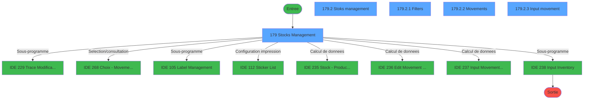

# PVE IDE 179 - Menu Stocks Management

> **Analyse**: Phases 1-4 2026-02-03 18:42 -> 18:42 (16s) | Assemblage 18:42
> **Pipeline**: V7.2 Enrichi
> **Structure**: 4 onglets (Resume | Ecrans | Donnees | Connexions)

<!-- TAB:Resume -->

## 1. FICHE D'IDENTITE

| Attribut | Valeur |
|----------|--------|
| Projet | PVE |
| IDE Position | 179 |
| Nom Programme | Menu Stocks Management |
| Fichier source | `Prg_179.xml` |
| Dossier IDE | Menu |
| Taches | 10 (5 ecrans visibles) |
| Tables modifiees | 2 |
| Programmes appeles | 8 |

## 2. DESCRIPTION FONCTIONNELLE

**Menu Stocks Management** assure la gestion complete de ce processus, accessible depuis [Menu (IDE 185)](PVE-IDE-185.md), [Menu==V4 (IDE 353)](PVE-IDE-353.md), [Menu==V4___ (IDE 420)](PVE-IDE-420.md), [Menu (IDE 439)](PVE-IDE-439.md).

Le flux de traitement s'organise en **2 blocs fonctionnels** :

- **Traitement** (9 taches) : traitements metier divers
- **Calcul** (1 tache) : calculs de montants, stocks ou compteurs

**Donnees modifiees** : 2 tables en ecriture (pv_sellers, pv_mvt_stock_tempo).

Detail : phases du traitement

#### Phase 1 : Calcul (1 tache)

- **179** - Stocks Management **[[ECRAN]](#ecran-t1)**

Delegue a : [Stock - Products List CSV V2 (IDE 235)](PVE-IDE-235.md), [Edit Movement stock (IDE 236)](PVE-IDE-236.md), [Input Movement stock (IDE 237)](PVE-IDE-237.md)

#### Phase 2 : Traitement (9 taches)

- **179.1** - Maj mvt **[[ECRAN]](#ecran-t2)**
- **179.1.1** - Maj article SQL **[[ECRAN]](#ecran-t3)**
- **179.2** - Stoks management **[[ECRAN]](#ecran-t4)**
- **179.2.1** - Filters **[[ECRAN]](#ecran-t5)**
- **179.2.2** - Movements **[[ECRAN]](#ecran-t6)**
- **179.2.3** - Input movement **[[ECRAN]](#ecran-t7)**
- **179.2.3.1** - Maj Product
- **179.2.4** - (sans nom)
- **179.2.5** - (sans nom)

Delegue a : [Trace Modification package (IDE 229)](PVE-IDE-229.md), [Label Management (IDE 105)](PVE-IDE-105.md), [Sticker List (IDE 112)](PVE-IDE-112.md), [Input Inventory (IDE 238)](PVE-IDE-238.md)

#### Tables impactees

| Table | Operations | Role metier |
|-------|-----------|-------------|
| pv_mvt_stock_tempo | R/**W**/L (4 usages) | Table temporaire ecran |
| pv_sellers | **W**/L (3 usages) |  |

## 3. BLOCS FONCTIONNELS

### 3.1 Calcul (1 tache)

Calculs metier : montants, stocks, compteurs.

---

#### 179 - Stocks Management [[ECRAN]](#ecran-t1)

**Role** : Calcul : Stocks Management.
**Ecran** : 579 x 285 DLU (MDI) | [Voir mockup](#ecran-t1)
**Delegue a** : [Stock - Products List CSV V2 (IDE 235)](PVE-IDE-235.md), [Edit Movement stock (IDE 236)](PVE-IDE-236.md), [Input Movement stock (IDE 237)](PVE-IDE-237.md)

### 3.2 Traitement (9 taches)

Traitements internes.

---

#### 179.1 - Maj mvt [[ECRAN]](#ecran-t2)

**Role** : Traitement : Maj mvt.
**Ecran** : 557 x 494 DLU | [Voir mockup](#ecran-t2)
**Delegue a** : [Trace Modification package (IDE 229)](PVE-IDE-229.md), [Label Management (IDE 105)](PVE-IDE-105.md), [Sticker List (IDE 112)](PVE-IDE-112.md)

---

#### 179.1.1 - Maj article SQL [[ECRAN]](#ecran-t3)

**Role** : Traitement : Maj article SQL.
**Ecran** : 120 x 195 DLU | [Voir mockup](#ecran-t3)
**Variables liees** : G (V.Combo article Actif), M (CHG_REASON_V.Combo article Act), N (CHG_PRV_V.Combo article Actif)
**Delegue a** : [Trace Modification package (IDE 229)](PVE-IDE-229.md), [Label Management (IDE 105)](PVE-IDE-105.md), [Sticker List (IDE 112)](PVE-IDE-112.md)

---

#### 179.2 - Stoks management [[ECRAN]](#ecran-t4)

**Role** : Traitement : Stoks management.
**Ecran** : 809 x 392 DLU (Modal) | [Voir mockup](#ecran-t4)
**Delegue a** : [Trace Modification package (IDE 229)](PVE-IDE-229.md), [Label Management (IDE 105)](PVE-IDE-105.md), [Sticker List (IDE 112)](PVE-IDE-112.md)

---

#### 179.2.1 - Filters [[ECRAN]](#ecran-t5)

**Role** : Traitement : Filters.
**Ecran** : 786 x 130 DLU (MDI) | [Voir mockup](#ecran-t5)
**Delegue a** : [Trace Modification package (IDE 229)](PVE-IDE-229.md), [Label Management (IDE 105)](PVE-IDE-105.md), [Sticker List (IDE 112)](PVE-IDE-112.md)

---

#### 179.2.2 - Movements [[ECRAN]](#ecran-t6)

**Role** : Traitement : Movements.
**Ecran** : 264 x 288 DLU (Modal) | [Voir mockup](#ecran-t6)
**Delegue a** : [Trace Modification package (IDE 229)](PVE-IDE-229.md), [Choix - Movement types (IDE 268)](PVE-IDE-268.md), [Label Management (IDE 105)](PVE-IDE-105.md)

---

#### 179.2.3 - Input movement [[ECRAN]](#ecran-t7)

**Role** : Traitement : Input movement.
**Ecran** : 240 x 129 DLU (MDI) | [Voir mockup](#ecran-t7)
**Variables liees** : E (V Movement type), K (L Movement)
**Delegue a** : [Trace Modification package (IDE 229)](PVE-IDE-229.md), [Label Management (IDE 105)](PVE-IDE-105.md), [Sticker List (IDE 112)](PVE-IDE-112.md)

---

#### 179.2.3.1 - Maj Product

**Role** : Traitement : Maj Product.
**Delegue a** : [Trace Modification package (IDE 229)](PVE-IDE-229.md), [Label Management (IDE 105)](PVE-IDE-105.md), [Sticker List (IDE 112)](PVE-IDE-112.md)

---

#### 179.2.4 - (sans nom)

**Role** : Traitement interne.
**Delegue a** : [Trace Modification package (IDE 229)](PVE-IDE-229.md), [Label Management (IDE 105)](PVE-IDE-105.md), [Sticker List (IDE 112)](PVE-IDE-112.md)

---

#### 179.2.5 - (sans nom)

**Role** : Traitement interne.
**Delegue a** : [Trace Modification package (IDE 229)](PVE-IDE-229.md), [Label Management (IDE 105)](PVE-IDE-105.md), [Sticker List (IDE 112)](PVE-IDE-112.md)

## 5. REGLES METIER

*(Aucune regle metier identifiee)*

## 6. CONTEXTE

- **Appele par**: [Menu (IDE 185)](PVE-IDE-185.md), [Menu==V4 (IDE 353)](PVE-IDE-353.md), [Menu==V4___ (IDE 420)](PVE-IDE-420.md), [Menu (IDE 439)](PVE-IDE-439.md)
- **Appelle**: 8 programmes | **Tables**: 6 (W:2 R:3 L:5) | **Taches**: 10 | **Expressions**: 9

<!-- TAB:Ecrans -->

## 8. ECRANS

### 8.1 Forms visibles (5 / 10)

| # | Position | Tache | Nom | Type | Largeur | Hauteur | Bloc |
|---|----------|-------|-----|------|---------|---------|------|
| 1 | 179 | 179 | Stocks Management | MDI | 579 | 285 | Calcul |
| 2 | 179.2 | 179.2 | Stoks management | Modal | 809 | 392 | Traitement |
| 3 | 179.2.1 | 179.2.1 | Filters | MDI | 786 | 130 | Traitement |
| 4 | 179.2.2 | 179.2.2 | Movements | Modal | 264 | 288 | Traitement |
| 5 | 179.2.3 | 179.2.3 | Input movement | MDI | 240 | 129 | Traitement |

### 8.2 Mockups Ecrans

---

#### 179.2 - Stoks management
**Tache** : [179.2](#t4) | **Type** : Modal | **Dimensions** : 809 x 392 DLU
**Bloc** : Traitement | **Titre IDE** : Stoks management

<!-- FORM-DATA:
{
    "width":  809,
    "vFactor":  8,
    "type":  "Modal",
    "hFactor":  4,
    "controls":  [
                     {
                         "x":  0,
                         "type":  "label",
                         "var":  "",
                         "y":  0,
                         "w":  809,
                         "fmt":  "",
                         "name":  "",
                         "h":  43,
                         "color":  "188",
                         "text":  "",
                         "parent":  null
                     },
                     {
                         "x":  20,
                         "type":  "label",
                         "var":  "",
                         "y":  17,
                         "w":  52,
                         "fmt":  "",
                         "name":  "",
                         "h":  14,
                         "color":  "183",
                         "text":  "Filters :",
                         "parent":  1
                     },
                     {
                         "x":  78,
                         "type":  "label",
                         "var":  "",
                         "y":  17,
                         "w":  46,
                         "fmt":  "",
                         "name":  "",
                         "h":  14,
                         "color":  "183",
                         "text":  "NONE",
                         "parent":  1
                     },
                     {
                         "x":  188,
                         "type":  "label",
                         "var":  "",
                         "y":  17,
                         "w":  313,
                         "fmt":  "",
                         "name":  "",
                         "h":  14,
                         "color":  "188",
                         "text":  "STOCKS MANAGEMENT",
                         "parent":  1
                     },
                     {
                         "x":  8,
                         "type":  "table",
                         "var":  "",
                         "name":  "",
                         "titleH":  24,
                         "color":  "110",
                         "w":  494,
                         "y":  50,
                         "fmt":  "",
                         "parent":  null,
                         "text":  "",
                         "rowH":  21,
                         "h":  294,
                         "cols":  [
                                      {
                                          "title":  "Category",
                                          "layer":  1,
                                          "w":  124
                                      },
                                      {
                                          "title":  "Sub category",
                                          "layer":  2,
                                          "w":  126
                                      },
                                      {
                                          "title":  "Product",
                                          "layer":  3,
                                          "w":  131
                                      },
                                      {
                                          "title":  "In stock",
                                          "layer":  4,
                                          "w":  73
                                      },
                                      {
                                          "title":  "Unit",
                                          "layer":  5,
                                          "w":  37
                                      }
                                  ],
                         "rows":  5
                     },
                     {
                         "x":  0,
                         "type":  "label",
                         "var":  "",
                         "y":  359,
                         "w":  809,
                         "fmt":  "",
                         "name":  "",
                         "h":  33,
                         "color":  "6",
                         "text":  "",
                         "parent":  null
                     },
                     {
                         "x":  260,
                         "type":  "button",
                         "var":  "",
                         "y":  364,
                         "w":  86,
                         "fmt":  "\u0026Input movement",
                         "name":  "INPUT",
                         "h":  28,
                         "color":  "",
                         "text":  "",
                         "parent":  null
                     },
                     {
                         "x":  12,
                         "type":  "edit",
                         "var":  "",
                         "y":  77,
                         "w":  118,
                         "fmt":  "",
                         "name":  "V Category",
                         "h":  16,
                         "color":  "6",
                         "text":  "",
                         "parent":  9
                     },
                     {
                         "x":  137,
                         "type":  "edit",
                         "var":  "",
                         "y":  77,
                         "w":  119,
                         "fmt":  "",
                         "name":  "V S/Category",
                         "h":  16,
                         "color":  "6",
                         "text":  "",
                         "parent":  9
                     },
                     {
                         "x":  264,
                         "type":  "edit",
                         "var":  "",
                         "y":  77,
                         "w":  121,
                         "fmt":  "",
                         "name":  "CTRL_001",
                         "h":  16,
                         "color":  "6",
                         "text":  "",
                         "parent":  9
                     },
                     {
                         "x":  392,
                         "type":  "edit",
                         "var":  "",
                         "y":  77,
                         "w":  70,
                         "fmt":  "N9.2C",
                         "name":  "CTRL_002",
                         "h":  16,
                         "color":  "6",
                         "text":  "",
                         "parent":  9
                     },
                     {
                         "x":  466,
                         "type":  "edit",
                         "var":  "",
                         "y":  77,
                         "w":  30,
                         "fmt":  "",
                         "name":  "CTRL_003",
                         "h":  16,
                         "color":  "6",
                         "text":  "",
                         "parent":  9
                     },
                     {
                         "x":  661,
                         "type":  "button",
                         "var":  "",
                         "y":  367,
                         "w":  29,
                         "fmt":  "",
                         "name":  "BP. Print label",
                         "h":  22,
                         "color":  "",
                         "text":  "",
                         "parent":  null
                     },
                     {
                         "x":  759,
                         "type":  "image",
                         "var":  "",
                         "y":  8,
                         "w":  48,
                         "fmt":  "",
                         "name":  "",
                         "h":  35,
                         "color":  "",
                         "text":  "",
                         "parent":  1
                     },
                     {
                         "x":  78,
                         "type":  "edit",
                         "var":  "",
                         "y":  17,
                         "w":  30,
                         "fmt":  "",
                         "name":  "",
                         "h":  14,
                         "color":  "183",
                         "text":  "",
                         "parent":  1
                     },
                     {
                         "x":  121,
                         "type":  "edit",
                         "var":  "",
                         "y":  17,
                         "w":  120,
                         "fmt":  "30",
                         "name":  "",
                         "h":  14,
                         "color":  "187",
                         "text":  "",
                         "parent":  1
                     },
                     {
                         "x":  503,
                         "type":  "button",
                         "var":  "",
                         "y":  51,
                         "w":  32,
                         "fmt":  "ñ",
                         "name":  "",
                         "h":  145,
                         "color":  "",
                         "text":  "",
                         "parent":  null
                     },
                     {
                         "x":  503,
                         "type":  "button",
                         "var":  "",
                         "y":  196,
                         "w":  32,
                         "fmt":  "ò",
                         "name":  "",
                         "h":  149,
                         "color":  "",
                         "text":  "",
                         "parent":  null
                     },
                     {
                         "x":  2,
                         "type":  "button",
                         "var":  "",
                         "y":  364,
                         "w":  86,
                         "fmt":  "\u0026Filters",
                         "name":  "FILTER",
                         "h":  28,
                         "color":  "",
                         "text":  "",
                         "parent":  null
                     },
                     {
                         "x":  88,
                         "type":  "button",
                         "var":  "",
                         "y":  364,
                         "w":  86,
                         "fmt":  "\u0026Stock List",
                         "name":  "LIST",
                         "h":  28,
                         "color":  "",
                         "text":  "",
                         "parent":  null
                     },
                     {
                         "x":  432,
                         "type":  "button",
                         "var":  "",
                         "y":  364,
                         "w":  86,
                         "fmt":  "\u0026Stickers",
                         "name":  "Stickers",
                         "h":  28,
                         "color":  "",
                         "text":  "",
                         "parent":  null
                     },
                     {
                         "x":  719,
                         "type":  "button",
                         "var":  "",
                         "y":  364,
                         "w":  87,
                         "fmt":  "\u0026Exit",
                         "name":  "",
                         "h":  28,
                         "color":  "",
                         "text":  "",
                         "parent":  null
                     },
                     {
                         "x":  506,
                         "type":  "edit",
                         "var":  "",
                         "y":  16,
                         "w":  245,
                         "fmt":  "30",
                         "name":  "",
                         "h":  18,
                         "color":  "174",
                         "text":  "",
                         "parent":  1
                     },
                     {
                         "x":  536,
                         "type":  "subform",
                         "var":  "",
                         "y":  50,
                         "w":  272,
                         "fmt":  "",
                         "name":  "MVT",
                         "h":  296,
                         "color":  "",
                         "text":  "",
                         "parent":  null
                     },
                     {
                         "x":  346,
                         "type":  "button",
                         "var":  "",
                         "y":  364,
                         "w":  86,
                         "fmt":  "\u0026Inventory",
                         "name":  "INVENTORY",
                         "h":  28,
                         "color":  "",
                         "text":  "",
                         "parent":  null
                     },
                     {
                         "x":  174,
                         "type":  "button",
                         "var":  "",
                         "y":  364,
                         "w":  86,
                         "fmt":  "\u0026Movement List",
                         "name":  "LIST",
                         "h":  28,
                         "color":  "",
                         "text":  "",
                         "parent":  null
                     },
                     {
                         "x":  20,
                         "type":  "combobox",
                         "var":  "",
                         "y":  31,
                         "w":  95,
                         "fmt":  "",
                         "name":  "V.Combo article Actif",
                         "h":  12,
                         "color":  "183",
                         "text":  "A,O,N",
                         "parent":  null
                     }
                 ],
    "taskId":  "179.2",
    "height":  392
}
-->

<strong>Champs : 9 champs</strong>

| Pos (x,y) | Nom | Variable | Type |
|-----------|-----|----------|------|
| 12,77 | V Category | - | edit |
| 137,77 | V S/Category | - | edit |
| 264,77 | CTRL_001 | - | edit |
| 392,77 | CTRL_002 | - | edit |
| 466,77 | CTRL_003 | - | edit |
| 78,17 | (sans nom) | - | edit |
| 121,17 | 30 | - | edit |
| 506,16 | 30 | - | edit |
| 20,31 | V.Combo article Actif | - | combobox |

<strong>Boutons : 10 boutons</strong>

| Bouton | Pos (x,y) | Action |
|--------|-----------|--------|
| Input movement | 260,364 | Appel [Input Movement stock (IDE 237)](PVE-IDE-237.md) |
| BP. Print label | 661,367 | Lance l'impression |
| ñ | 503,51 | Bouton fonctionnel |
| ò | 503,196 | Bouton fonctionnel |
| Filters | 2,364 | Bouton fonctionnel |
| Stock List | 88,364 | Appel [Stock - Products List CSV V2 (IDE 235)](PVE-IDE-235.md) |
| Stickers | 432,364 | Appel [Sticker List (IDE 112)](PVE-IDE-112.md) |
| Exit | 719,364 | Quitte le programme |
| Inventory | 346,364 | Appel [Input Inventory (IDE 238)](PVE-IDE-238.md) |
| Movement List | 174,364 | Appel [Choix - Movement types (IDE 268)](PVE-IDE-268.md) |

---

#### 179.2.1 - Filters
**Tache** : [179.2.1](#t5) | **Type** : MDI | **Dimensions** : 786 x 130 DLU
**Bloc** : Traitement | **Titre IDE** : Filters

<!-- FORM-DATA:
{
    "width":  786,
    "vFactor":  8,
    "type":  "MDI",
    "hFactor":  8,
    "controls":  [
                     {
                         "x":  280,
                         "type":  "label",
                         "var":  "",
                         "y":  38,
                         "w":  43,
                         "fmt":  "",
                         "name":  "",
                         "h":  18,
                         "color":  "183",
                         "text":  "or",
                         "parent":  null
                     },
                     {
                         "x":  47,
                         "type":  "label",
                         "var":  "",
                         "y":  16,
                         "w":  200,
                         "fmt":  "",
                         "name":  "",
                         "h":  53,
                         "color":  "183",
                         "text":  "All/In/Out",
                         "parent":  null
                     },
                     {
                         "x":  347,
                         "type":  "label",
                         "var":  "",
                         "y":  16,
                         "w":  397,
                         "fmt":  "",
                         "name":  "",
                         "h":  53,
                         "color":  "183",
                         "text":  "Movement type",
                         "parent":  null
                     },
                     {
                         "x":  6,
                         "type":  "label",
                         "var":  "",
                         "y":  95,
                         "w":  773,
                         "fmt":  "",
                         "name":  "",
                         "h":  32,
                         "color":  "6",
                         "text":  "",
                         "parent":  null
                     },
                     {
                         "x":  86,
                         "type":  "combobox",
                         "var":  "",
                         "y":  35,
                         "w":  120,
                         "fmt":  "",
                         "name":  "INOUT",
                         "h":  12,
                         "color":  "63",
                         "text":  "",
                         "parent":  2
                     },
                     {
                         "x":  373,
                         "type":  "button",
                         "var":  "",
                         "y":  35,
                         "w":  344,
                         "fmt":  "",
                         "name":  "MVT",
                         "h":  22,
                         "color":  "",
                         "text":  "",
                         "parent":  null
                     },
                     {
                         "x":  165,
                         "type":  "button",
                         "var":  "",
                         "y":  101,
                         "w":  161,
                         "fmt":  "",
                         "name":  "BP. Reset filters",
                         "h":  22,
                         "color":  "",
                         "text":  "",
                         "parent":  null
                     },
                     {
                         "x":  14,
                         "type":  "button",
                         "var":  "",
                         "y":  101,
                         "w":  145,
                         "fmt":  "\u0026Exit",
                         "name":  "",
                         "h":  22,
                         "color":  "",
                         "text":  "",
                         "parent":  null
                     },
                     {
                         "x":  621,
                         "type":  "button",
                         "var":  "",
                         "y":  101,
                         "w":  145,
                         "fmt":  "\u0026Ok",
                         "name":  "",
                         "h":  22,
                         "color":  "",
                         "text":  "",
                         "parent":  null
                     }
                 ],
    "taskId":  "179.2.1",
    "height":  130
}
-->

<strong>Champs : 1 champs</strong>

| Pos (x,y) | Nom | Variable | Type |
|-----------|-----|----------|------|
| 86,35 | INOUT | - | combobox |

<strong>Boutons : 4 boutons</strong>

| Bouton | Pos (x,y) | Action |
|--------|-----------|--------|
| MVT | 373,35 | Bouton fonctionnel |
| BP. Reset filters | 165,101 | Bouton fonctionnel |
| Exit | 14,101 | Quitte le programme |
| Ok | 621,101 | Valide la saisie et enregistre |

---

#### 179.2.2 - Movements
**Tache** : [179.2.2](#t6) | **Type** : Modal | **Dimensions** : 264 x 288 DLU
**Bloc** : Traitement | **Titre IDE** : Movements

<!-- FORM-DATA:
{
    "width":  264,
    "vFactor":  8,
    "type":  "Modal",
    "hFactor":  4,
    "controls":  [
                     {
                         "x":  6,
                         "type":  "table",
                         "var":  "",
                         "name":  "",
                         "titleH":  16,
                         "color":  "110",
                         "w":  251,
                         "y":  14,
                         "fmt":  "",
                         "parent":  null,
                         "text":  "",
                         "rowH":  16,
                         "h":  256,
                         "cols":  [
                                      {
                                          "title":  "Date",
                                          "layer":  1,
                                          "w":  62
                                      },
                                      {
                                          "title":  "Time",
                                          "layer":  2,
                                          "w":  41
                                      },
                                      {
                                          "title":  "Quantity",
                                          "layer":  3,
                                          "w":  66
                                      },
                                      {
                                          "title":  "User",
                                          "layer":  4,
                                          "w":  64
                                      }
                                  ],
                         "rows":  4
                     },
                     {
                         "x":  9,
                         "type":  "edit",
                         "var":  "",
                         "y":  32,
                         "w":  58,
                         "fmt":  "##/##/####Z",
                         "name":  "",
                         "h":  12,
                         "color":  "110",
                         "text":  "",
                         "parent":  2
                     },
                     {
                         "x":  71,
                         "type":  "edit",
                         "var":  "",
                         "y":  32,
                         "w":  36,
                         "fmt":  "HH:MMZ",
                         "name":  "",
                         "h":  12,
                         "color":  "110",
                         "text":  "",
                         "parent":  2
                     },
                     {
                         "x":  112,
                         "type":  "edit",
                         "var":  "",
                         "y":  32,
                         "w":  60,
                         "fmt":  "N10.3Z",
                         "name":  "",
                         "h":  12,
                         "color":  "110",
                         "text":  "",
                         "parent":  2
                     },
                     {
                         "x":  178,
                         "type":  "edit",
                         "var":  "",
                         "y":  32,
                         "w":  56,
                         "fmt":  "",
                         "name":  "",
                         "h":  12,
                         "color":  "110",
                         "text":  "",
                         "parent":  2
                     },
                     {
                         "x":  28,
                         "type":  "edit",
                         "var":  "",
                         "y":  274,
                         "w":  184,
                         "fmt":  "",
                         "name":  "",
                         "h":  12,
                         "color":  "183",
                         "text":  "",
                         "parent":  null
                     }
                 ],
    "taskId":  "179.2.2",
    "height":  288
}
-->

<strong>Champs : 5 champs</strong>

| Pos (x,y) | Nom | Variable | Type |
|-----------|-----|----------|------|
| 9,32 | ##/##/####Z | - | edit |
| 71,32 | HH:MMZ | - | edit |
| 112,32 | N10.3Z | - | edit |
| 178,32 | (sans nom) | - | edit |
| 28,274 | (sans nom) | - | edit |

---

#### 179.2.3 - Input movement
**Tache** : [179.2.3](#t7) | **Type** : MDI | **Dimensions** : 240 x 129 DLU
**Bloc** : Traitement | **Titre IDE** : Input movement

<!-- FORM-DATA:
{
    "width":  240,
    "vFactor":  8,
    "type":  "MDI",
    "hFactor":  4,
    "controls":  [
                     {
                         "x":  20,
                         "type":  "label",
                         "var":  "",
                         "y":  18,
                         "w":  40,
                         "fmt":  "",
                         "name":  "",
                         "h":  9,
                         "color":  "183",
                         "text":  "Type",
                         "parent":  null
                     },
                     {
                         "x":  20,
                         "type":  "label",
                         "var":  "",
                         "y":  56,
                         "w":  40,
                         "fmt":  "",
                         "name":  "",
                         "h":  9,
                         "color":  "183",
                         "text":  "Quantity",
                         "parent":  null
                     },
                     {
                         "x":  0,
                         "type":  "label",
                         "var":  "",
                         "y":  104,
                         "w":  239,
                         "fmt":  "",
                         "name":  "",
                         "h":  24,
                         "color":  "6",
                         "text":  "",
                         "parent":  null
                     },
                     {
                         "x":  175,
                         "type":  "button",
                         "var":  "",
                         "y":  109,
                         "w":  62,
                         "fmt":  "\u0026Cancel",
                         "name":  "CANCEL",
                         "h":  17,
                         "color":  "",
                         "text":  "",
                         "parent":  null
                     },
                     {
                         "x":  20,
                         "type":  "button",
                         "var":  "",
                         "y":  29,
                         "w":  164,
                         "fmt":  "",
                         "name":  "BP. Movement",
                         "h":  14,
                         "color":  "",
                         "text":  "",
                         "parent":  null
                     },
                     {
                         "x":  20,
                         "type":  "edit",
                         "var":  "",
                         "y":  69,
                         "w":  73,
                         "fmt":  "N10.3",
                         "name":  "CTRL_001",
                         "h":  10,
                         "color":  "110",
                         "text":  "",
                         "parent":  null
                     },
                     {
                         "x":  113,
                         "type":  "button",
                         "var":  "",
                         "y":  109,
                         "w":  62,
                         "fmt":  "\u0026Validate",
                         "name":  "VALID",
                         "h":  17,
                         "color":  "",
                         "text":  "",
                         "parent":  null
                     },
                     {
                         "x":  100,
                         "type":  "edit",
                         "var":  "",
                         "y":  69,
                         "w":  25,
                         "fmt":  "3",
                         "name":  "",
                         "h":  10,
                         "color":  "110",
                         "text":  "",
                         "parent":  null
                     }
                 ],
    "taskId":  "179.2.3",
    "height":  129
}
-->

<strong>Champs : 2 champs</strong>

| Pos (x,y) | Nom | Variable | Type |
|-----------|-----|----------|------|
| 20,69 | CTRL_001 | - | edit |
| 100,69 | 3 | - | edit |

<strong>Boutons : 3 boutons</strong>

| Bouton | Pos (x,y) | Action |
|--------|-----------|--------|
| Cancel | 175,109 | Annule et retour au menu |
| BP. Movement | 20,29 | Bouton fonctionnel |
| Validate | 113,109 | Valide la saisie et enregistre |

## 9. NAVIGATION

### 9.1 Enchainement des ecrans

**Detail par enchainement :**

| Depuis | Action | Vers | Retour |
|--------|--------|------|--------|
| Stocks Management | Sous-programme | [Trace Modification package (IDE 229)](PVE-IDE-229.md) | Retour ecran |
| Stocks Management | Selection/consultation | [Choix - Movement types (IDE 268)](PVE-IDE-268.md) | Retour ecran |
| Stocks Management | Sous-programme | [Label Management (IDE 105)](PVE-IDE-105.md) | Retour ecran |
| Stocks Management | Configuration impression | [Sticker List (IDE 112)](PVE-IDE-112.md) | Retour ecran |
| Stocks Management | Calcul de donnees | [Stock - Products List CSV V2 (IDE 235)](PVE-IDE-235.md) | Retour ecran |
| Stocks Management | Calcul de donnees | [Edit Movement stock (IDE 236)](PVE-IDE-236.md) | Retour ecran |
| Stocks Management | Calcul de donnees | [Input Movement stock (IDE 237)](PVE-IDE-237.md) | Retour ecran |
| Stocks Management | Sous-programme | [Input Inventory (IDE 238)](PVE-IDE-238.md) | Retour ecran |

### 9.3 Structure hierarchique (10 taches)

| Position | Tache | Type | Dimensions | Bloc |
|----------|-------|------|------------|------|
| **179.1** | [**Stocks Management** (179)](#t1) [mockup](#ecran-t1) | MDI | 579x285 | Calcul |
| **179.2** | [**Maj mvt** (179.1)](#t2) [mockup](#ecran-t2) | - | 557x494 | Traitement |
| 179.2.1 | [Maj article SQL (179.1.1)](#t3) [mockup](#ecran-t3) | - | 120x195 | |
| 179.2.2 | [Stoks management (179.2)](#t4) [mockup](#ecran-t4) | Modal | 809x392 | |
| 179.2.3 | [Filters (179.2.1)](#t5) [mockup](#ecran-t5) | MDI | 786x130 | |
| 179.2.4 | [Movements (179.2.2)](#t6) [mockup](#ecran-t6) | Modal | 264x288 | |
| 179.2.5 | [Input movement (179.2.3)](#t7) [mockup](#ecran-t7) | MDI | 240x129 | |
| 179.2.6 | [Maj Product (179.2.3.1)](#t8) | MDI | - | |
| 179.2.7 | [(sans nom) (179.2.4)](#t9) | MDI | - | |
| 179.2.8 | [(sans nom) (179.2.5)](#t10) | MDI | - | |

### 9.4 Algorigramme

> **Legende**: Vert = START/END OK | Rouge = END KO | Bleu = Decisions
> *Algorigramme auto-genere. Utiliser `/algorigramme` pour une synthese metier detaillee.*

<!-- TAB:Donnees -->

## 10. TABLES

### Tables utilisees (6)

| ID | Nom | Description | Type | R | W | L | Usages |
|----|-----|-------------|------|---|---|---|--------|
| 379 | pv_customer_temp |  | DB | R |   |   | 1 |
| 403 | pv_sellers |  | DB |   | **W** | L | 3 |
| 413 | pv_tva |  | DB |   |   | L | 1 |
| 759 | Temp_service_cash | Services / filieres | DB |   |   | L | 1 |
| 761 | pv_ligne_inv_stock | Articles et stock | DB | R |   | L | 3 |
| 762 | pv_mvt_stock_tempo | Table temporaire ecran | DB | R | **W** | L | 4 |

### Colonnes par table (4 / 4 tables avec colonnes identifiees)

Table 379 - pv_customer_temp (R) - 1 usages

| Lettre | Variable | Acces | Type |
|--------|----------|-------|------|
| A | BP. Historic | R | Alpha |
| B | BP. Input movement | R | Alpha |
| C | BP. Input inventory | R | Alpha |
| D | L Preview | R | Logical |
| E | V Category | R | Alpha |
| F | V S/Category | R | Alpha |
| G | V.Combo article Actif | R | Unicode |
| H | v.Géré en stock détail ? | R | Logical |
| I | BP. Print label | R | Alpha |
| J | V Tri | R | Alpha |
| K | L Movement | R | Logical |
| L | V.Clause where | R | Alpha |
| M | CHG_REASON_V.Combo article Act | R | Numeric |
| N | CHG_PRV_V.Combo article Actif | R | Unicode |

Table 403 - pv_sellers (**W**/L) - 3 usages

| Lettre | Variable | Acces | Type |
|--------|----------|-------|------|
| A | v Lien Mvt Stock | W | Logical |
| B | V.Date | W | Date |
| C | V.Time | W | Time |

Table 761 - pv_ligne_inv_stock (R/L) - 3 usages

| Lettre | Variable | Acces | Type |
|--------|----------|-------|------|
| A | V Choix All/In/Out | R | Alpha |
| B | V Choix Movement type | R | Numeric |
| C | BP. Movement type | R | Alpha |
| D | BP. Reset filters | R | Alpha |

Table 762 - pv_mvt_stock_tempo (R/**W**/L) - 4 usages

| Lettre | Variable | Acces | Type |
|--------|----------|-------|------|
| A | P(0) Label | W | Alpha |
| B | BP. Cancel | W | Alpha |
| C | T Movement | W | Logical |
| D | BP. Movement | W | Alpha |
| E | BP. Validate | W | Alpha |

## 11. VARIABLES

### 11.1 Variables de session (10)

Variables persistantes pendant toute la session.

| Lettre | Nom | Type | Usage dans |
|--------|-----|------|-----------|
| A | V No exit | Logical | 1x session |
| B | V Key | Numeric | - |
| C | V Mode | Alpha | - |
| D | V All/In/Out | Alpha | - |
| E | V Movement type | Numeric | - |
| F | V Type label | Alpha | - |
| G | V.Combo article Actif | Unicode | - |
| H | v.Géré en stock détail ? | Logical | - |
| J | V Tri | Alpha | - |
| L | V.Clause where | Alpha | - |

### 11.2 Autres (4)

Variables diverses.

| Lettre | Nom | Type | Usage dans |
|--------|-----|------|-----------|
| I | BP. Print label | Alpha | - |
| K | L Movement | Logical | - |
| M | CHG_REASON_V.Combo article Act | Numeric | - |
| N | CHG_PRV_V.Combo article Actif | Unicode | - |

## 12. EXPRESSIONS

**9 / 9 expressions decodees (100%)**

### 12.1 Repartition par type

| Type | Expressions | Regles |
|------|-------------|--------|
| CONSTANTE | 4 | 0 |
| CAST_LOGIQUE | 3 | 0 |
| OTHER | 2 | 0 |

### 12.2 Expressions cles par type

#### CONSTANTE (4 expressions)

| Type | IDE | Expression | Regle |
|------|-----|------------|-------|
| CONSTANTE | 5 | `0` | - |
| CONSTANTE | 6 | `''` | - |
| CONSTANTE | 2 | `1` | - |
| CONSTANTE | 4 | `'All'` | - |

#### CAST_LOGIQUE (3 expressions)

| Type | IDE | Expression | Regle |
|------|-----|------------|-------|
| CAST_LOGIQUE | 8 | `INIPut ('RepositionAfterModify=Y','FALSE'LOG)` | - |
| CAST_LOGIQUE | 7 | `INIPut ('RepositionAfterModify=N','FALSE'LOG)` | - |
| CAST_LOGIQUE | 1 | `'TRUE'LOG` | - |

#### OTHER (2 expressions)

| Type | IDE | Expression | Regle |
|------|-----|------------|-------|
| OTHER | 9 | `V No exit [A]` | - |
| OTHER | 3 | `'E'MODE` | - |

<!-- TAB:Connexions -->

## 13. GRAPHE D'APPELS

### 13.1 Chaine depuis Main (Callers)

Main -> ... -> [Menu (IDE 185)](PVE-IDE-185.md) -> **Menu Stocks Management (IDE 179)**

Main -> ... -> [Menu==V4 (IDE 353)](PVE-IDE-353.md) -> **Menu Stocks Management (IDE 179)**

Main -> ... -> [Menu==V4___ (IDE 420)](PVE-IDE-420.md) -> **Menu Stocks Management (IDE 179)**

Main -> ... -> [Menu (IDE 439)](PVE-IDE-439.md) -> **Menu Stocks Management (IDE 179)**

### 13.2 Callers

| IDE | Nom Programme | Nb Appels |
|-----|---------------|-----------|
| [185](PVE-IDE-185.md) | Menu | 1 |
| [353](PVE-IDE-353.md) | Menu==V4 | 1 |
| [420](PVE-IDE-420.md) | Menu==V4___ | 1 |
| [439](PVE-IDE-439.md) | Menu | 1 |

### 13.3 Callees (programmes appeles)

### 13.4 Detail Callees avec contexte

| IDE | Nom Programme | Appels | Contexte |
|-----|---------------|--------|----------|
| [229](PVE-IDE-229.md) | Trace Modification package | 2 | Sous-programme |
| [268](PVE-IDE-268.md) | Choix - Movement types | 2 | Selection/consultation |
| [105](PVE-IDE-105.md) | Label Management | 1 | Sous-programme |
| [112](PVE-IDE-112.md) | Sticker List | 1 | Configuration impression |
| [235](PVE-IDE-235.md) | Stock - Products List CSV V2 | 1 | Calcul de donnees |
| [236](PVE-IDE-236.md) | Edit Movement stock | 1 | Calcul de donnees |
| [237](PVE-IDE-237.md) | Input Movement stock | 1 | Calcul de donnees |
| [238](PVE-IDE-238.md) | Input Inventory | 1 | Sous-programme |

## 14. RECOMMANDATIONS MIGRATION

### 14.1 Profil du programme

| Metrique | Valeur | Impact migration |
|----------|--------|-----------------|
| Lignes de logique | 291 | Taille moyenne |
| Expressions | 9 | Peu de logique |
| Tables WRITE | 2 | Impact faible |
| Sous-programmes | 8 | Dependances moderees |
| Ecrans visibles | 5 | Quelques ecrans |
| Code desactive | 0.7% (2 / 291) | Code sain |
| Regles metier | 0 | Pas de regle identifiee |

### 14.2 Plan de migration par bloc

#### Calcul (1 tache: 1 ecran, 0 traitement)

- **Strategie** : Services de calcul purs (Domain Services).
- Migrer la logique de calcul (stock, compteurs, montants)

#### Traitement (9 taches: 6 ecrans, 3 traitements)

- **Strategie** : Orchestrateur avec 6 ecrans (Razor/React) et 3 traitements backend (services).
- Les ecrans deviennent des composants UI, les traitements invisibles deviennent des services injectables.
- 8 sous-programme(s) a migrer ou a reutiliser depuis les services existants.
- Decomposer les taches en services unitaires testables.

### 14.3 Dependances critiques

| Dependance | Type | Appels | Impact |
|------------|------|--------|--------|
| pv_sellers | Table WRITE (Database) | 2x | Schema + repository |
| pv_mvt_stock_tempo | Table WRITE (Database) | 1x | Schema + repository |
| [Choix - Movement types (IDE 268)](PVE-IDE-268.md) | Sous-programme | 2x | Haute - Selection/consultation |
| [Trace Modification package (IDE 229)](PVE-IDE-229.md) | Sous-programme | 2x | Haute - Sous-programme |
| [Edit Movement stock (IDE 236)](PVE-IDE-236.md) | Sous-programme | 1x | Normale - Calcul de donnees |
| [Input Movement stock (IDE 237)](PVE-IDE-237.md) | Sous-programme | 1x | Normale - Calcul de donnees |
| [Input Inventory (IDE 238)](PVE-IDE-238.md) | Sous-programme | 1x | Normale - Sous-programme |
| [Label Management (IDE 105)](PVE-IDE-105.md) | Sous-programme | 1x | Normale - Sous-programme |
| [Sticker List (IDE 112)](PVE-IDE-112.md) | Sous-programme | 1x | Normale - Configuration impression |
| [Stock - Products List CSV V2 (IDE 235)](PVE-IDE-235.md) | Sous-programme | 1x | Normale - Calcul de donnees |

---
*Spec DETAILED generee par Pipeline V7.2 - 2026-02-03 18:42*
