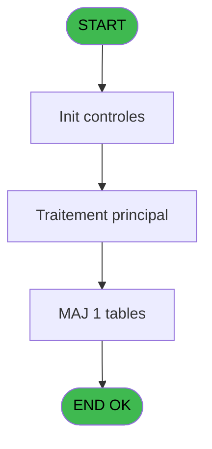
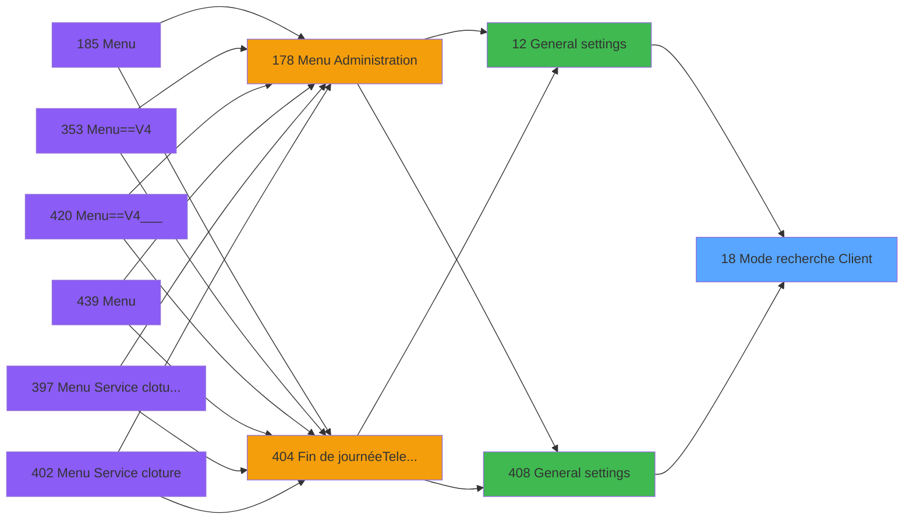

# PVE IDE 18 - Mode recherche Client

> **Analyse**: Phases 1-4 2026-02-03 01:05 -> 01:06 (39s) | Assemblage 01:06
> **Pipeline**: V7.2 Enrichi
> **Structure**: 4 onglets (Resume | Ecrans | Donnees | Connexions)

<!-- TAB:Resume -->

## 1. FICHE D'IDENTITE

| Attribut | Valeur |
|----------|--------|
| Projet | PVE |
| IDE Position | 18 |
| Nom Programme | Mode recherche Client |
| Fichier source | `Prg_18.xml` |
| Domaine metier | Consultation |
| Taches | 2 (1 ecrans visibles) |
| Tables modifiees | 1 |
| Programmes appeles | 0 |

## 2. DESCRIPTION FONCTIONNELLE

**Mode recherche Client** assure la gestion complete de ce processus, accessible depuis [General settings (IDE 12)](PVE-IDE-12.md), [General settings (IDE 408)](PVE-IDE-408.md).

Le flux de traitement s'organise en **2 blocs fonctionnels** :

- **Consultation** (1 tache) : ecrans de recherche, selection et consultation
- **Traitement** (1 tache) : traitements metier divers

**Donnees modifiees** : 1 tables en ecriture (arc_tai_gm).

Detail : phases du traitement

#### Phase 1 : Traitement (1 tache)

- **18** - Default customer search mode **[[ECRAN]](#ecran-t1)**

#### Phase 2 : Consultation (1 tache)

- **18.1** - Update Mode Recherche

#### Tables impactees

| Table | Operations | Role metier |
|-------|-----------|-------------|
| arc_tai_gm | R/**W** (2 usages) |  |

## 3. BLOCS FONCTIONNELS

### 3.1 Traitement (1 tache)

Traitements internes.

---

#### 18 - Default customer search mode [[ECRAN]](#ecran-t1)

**Role** : Traitement : Default customer search mode.
**Ecran** : 786 x 130 DLU (MDI) | [Voir mockup](#ecran-t1)
**Variables liees** : B (V.ModeRecherche)

### 3.2 Consultation (1 tache)

Ecrans de recherche et consultation.

---

#### 18.1 - Update Mode Recherche

**Role** : Traitement : Update Mode Recherche.
**Variables liees** : B (V.ModeRecherche)

## 5. REGLES METIER

*(Aucune regle metier identifiee)*

## 6. CONTEXTE

- **Appele par**: [General settings (IDE 12)](PVE-IDE-12.md), [General settings (IDE 408)](PVE-IDE-408.md)
- **Appelle**: 0 programmes | **Tables**: 1 (W:1 R:1 L:0) | **Taches**: 2 | **Expressions**: 3

<!-- TAB:Ecrans -->

## 8. ECRANS

### 8.1 Forms visibles (1 / 2)

| # | Position | Tache | Nom | Type | Largeur | Hauteur | Bloc |
|---|----------|-------|-----|------|---------|---------|------|
| 1 | 18 | 18 | Default customer search mode | MDI | 786 | 130 | Traitement |

### 8.2 Mockups Ecrans

---

#### 18 - Default customer search mode
**Tache** : [18](#t1) | **Type** : MDI | **Dimensions** : 786 x 130 DLU
**Bloc** : Traitement | **Titre IDE** : Default customer search mode

<!-- FORM-DATA:
{
    "width":  786,
    "vFactor":  8,
    "type":  "MDI",
    "hFactor":  8,
    "controls":  [
                     {
                         "x":  200,
                         "type":  "label",
                         "var":  "",
                         "y":  39,
                         "w":  385,
                         "fmt":  "",
                         "name":  "",
                         "h":  16,
                         "color":  "187",
                         "text":  " Mode",
                         "parent":  null
                     },
                     {
                         "x":  3,
                         "type":  "label",
                         "var":  "",
                         "y":  96,
                         "w":  773,
                         "fmt":  "",
                         "name":  "",
                         "h":  31,
                         "color":  "182",
                         "text":  "",
                         "parent":  null
                     },
                     {
                         "x":  11,
                         "type":  "button",
                         "var":  "",
                         "y":  102,
                         "w":  145,
                         "fmt":  "\u0026Exit",
                         "name":  "",
                         "h":  22,
                         "color":  "",
                         "text":  "",
                         "parent":  3
                     },
                     {
                         "x":  618,
                         "type":  "button",
                         "var":  "",
                         "y":  102,
                         "w":  145,
                         "fmt":  "\u0026Change",
                         "name":  "CHANGE",
                         "h":  22,
                         "color":  "",
                         "text":  "",
                         "parent":  3
                     },
                     {
                         "x":  294,
                         "type":  "combobox",
                         "var":  "",
                         "y":  40,
                         "w":  292,
                         "fmt":  "",
                         "name":  "VAT",
                         "h":  12,
                         "color":  "",
                         "text":  "1,2,3,4",
                         "parent":  1
                     }
                 ],
    "taskId":  "18",
    "height":  130
}
-->

<strong>Champs : 1 champs</strong>

| Pos (x,y) | Nom | Variable | Type |
|-----------|-----|----------|------|
| 294,40 | VAT | - | combobox |

<strong>Boutons : 2 boutons</strong>

| Bouton | Pos (x,y) | Action |
|--------|-----------|--------|
| Exit | 11,102 | Quitte le programme |
| Change | 618,102 | Modifie l'element |

## 9. NAVIGATION

Ecran unique: **Default customer search mode**

### 9.3 Structure hierarchique (2 taches)

| Position | Tache | Type | Dimensions | Bloc |
|----------|-------|------|------------|------|
| **18.1** | [**Default customer search mode** (18)](#t1) [mockup](#ecran-t1) | MDI | 786x130 | Traitement |
| **18.2** | [**Update Mode Recherche** (18.1)](#t2) | - | - | Consultation |

### 9.4 Algorigramme

> **Legende**: Vert = START/END OK | Rouge = END KO | Bleu = Decisions
> *Algorigramme auto-genere. Utiliser `/algorigramme` pour une synthese metier detaillee.*

<!-- TAB:Donnees -->

## 10. TABLES

### Tables utilisees (1)

| ID | Nom | Description | Type | R | W | L | Usages |
|----|-----|-------------|------|---|---|---|--------|
| 731 | arc_tai_gm |  | DB | R | **W** |   | 2 |

### Colonnes par table (1 / 1 tables avec colonnes identifiees)

Table 731 - arc_tai_gm (R/**W**) - 2 usages

| Lettre | Variable | Acces | Type |
|--------|----------|-------|------|
| A | P.Service | W | Unicode |
| B | V.ModeRecherche | W | Numeric |

## 11. VARIABLES

### 11.1 Parametres entrants (1)

Variables recues du programme appelant ([General settings (IDE 12)](PVE-IDE-12.md)).

| Lettre | Nom | Type | Usage dans |
|--------|-----|------|-----------|
| A | P.Service | Unicode | 1x parametre entrant |

### 11.2 Variables de session (1)

Variables persistantes pendant toute la session.

| Lettre | Nom | Type | Usage dans |
|--------|-----|------|-----------|
| B | V.ModeRecherche | Numeric | - |

## 12. EXPRESSIONS

**3 / 3 expressions decodees (100%)**

### 12.1 Repartition par type

| Type | Expressions | Regles |
|------|-------------|--------|
| CONSTANTE | 1 | 0 |
| OTHER | 2 | 0 |

### 12.2 Expressions cles par type

#### CONSTANTE (1 expressions)

| Type | IDE | Expression | Regle |
|------|-----|------------|-------|
| CONSTANTE | 2 | `''` | - |

#### OTHER (2 expressions)

| Type | IDE | Expression | Regle |
|------|-----|------------|-------|
| OTHER | 3 | `[D]` | - |
| OTHER | 1 | `P.Service [A]` | - |

<!-- TAB:Connexions -->

## 13. GRAPHE D'APPELS

### 13.1 Chaine depuis Main (Callers)

Main -> ... -> [General settings (IDE 12)](PVE-IDE-12.md) -> **Mode recherche Client (IDE 18)**

Main -> ... -> [General settings (IDE 408)](PVE-IDE-408.md) -> **Mode recherche Client (IDE 18)**

### 13.2 Callers

| IDE | Nom Programme | Nb Appels |
|-----|---------------|-----------|
| [12](PVE-IDE-12.md) | General settings | 1 |
| [408](PVE-IDE-408.md) | General settings | 1 |

### 13.3 Callees (programmes appeles)

### 13.4 Detail Callees avec contexte

| IDE | Nom Programme | Appels | Contexte |
|-----|---------------|--------|----------|
| - | (aucun) | - | - |

## 14. RECOMMANDATIONS MIGRATION

### 14.1 Profil du programme

| Metrique | Valeur | Impact migration |
|----------|--------|-----------------|
| Lignes de logique | 23 | Programme compact |
| Expressions | 3 | Peu de logique |
| Tables WRITE | 1 | Impact faible |
| Sous-programmes | 0 | Peu de dependances |
| Ecrans visibles | 1 | Ecran unique ou traitement batch |
| Code desactive | 0% (0 / 23) | Code sain |
| Regles metier | 0 | Pas de regle identifiee |

### 14.2 Plan de migration par bloc

#### Traitement (1 tache: 1 ecran, 0 traitement)

- **Strategie** : 1 composant(s) UI (Razor/React) avec formulaires et validation.
- Decomposer les taches en services unitaires testables.

#### Consultation (1 tache: 0 ecran, 1 traitement)

- **Strategie** : Composants de recherche/selection en modales.

### 14.3 Dependances critiques

| Dependance | Type | Appels | Impact |
|------------|------|--------|--------|
| arc_tai_gm | Table WRITE (Database) | 1x | Schema + repository |

---
*Spec DETAILED generee par Pipeline V7.2 - 2026-02-03 01:06*
