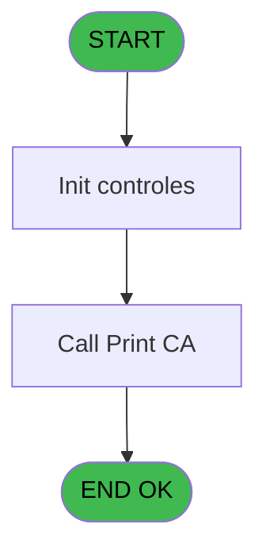
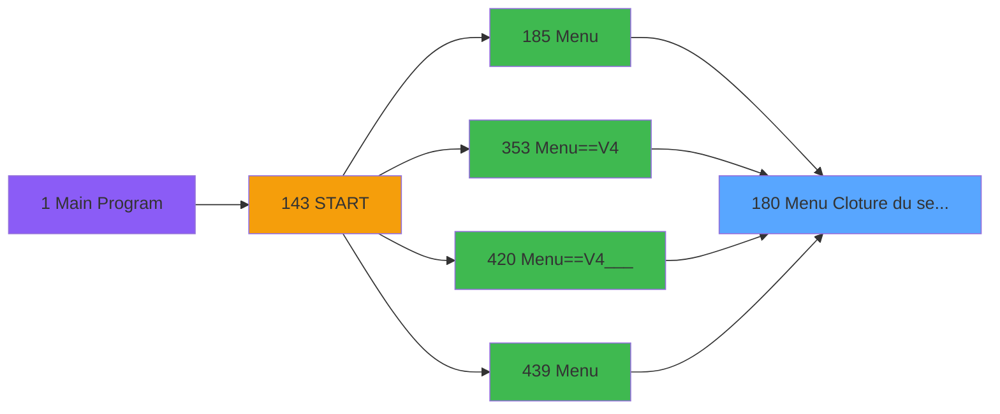
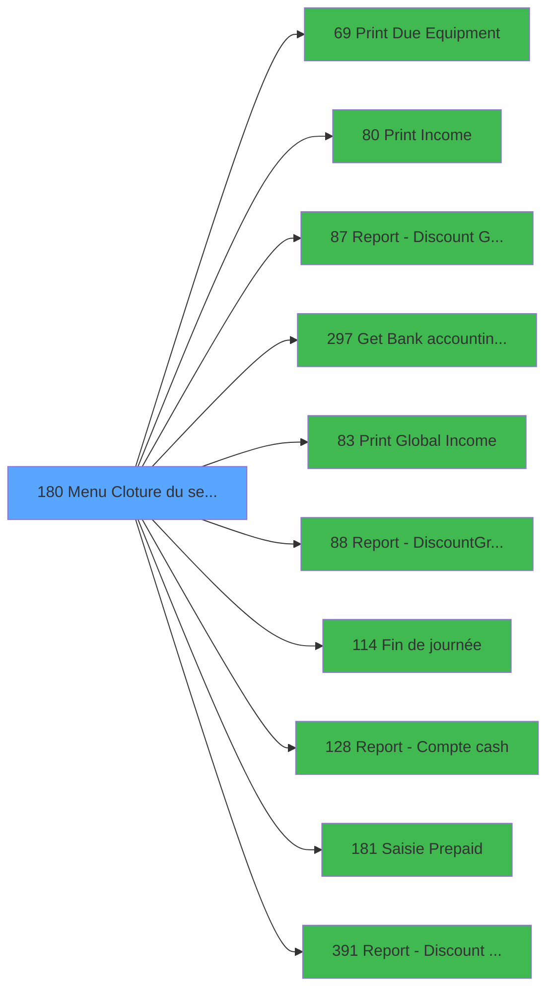

# PVE IDE 180 - Menu Cloture du service

> **Analyse**: Phases 1-4 2026-02-03 18:42 -> 18:42 (17s) | Assemblage 18:42
> **Pipeline**: V7.2 Enrichi
> **Structure**: 4 onglets (Resume | Ecrans | Donnees | Connexions)

<!-- TAB:Resume -->

## 1. FICHE D'IDENTITE

| Attribut | Valeur |
|----------|--------|
| Projet | PVE |
| IDE Position | 180 |
| Nom Programme | Menu Cloture du service |
| Fichier source | `Prg_180.xml` |
| Dossier IDE | Menu |
| Taches | 7 (6 ecrans visibles) |
| Tables modifiees | 0 |
| Programmes appeles | 10 |

## 2. DESCRIPTION FONCTIONNELLE

**Menu Cloture du service** assure la gestion complete de ce processus, accessible depuis [Menu (IDE 185)](PVE-IDE-185.md), [Menu==V4 (IDE 353)](PVE-IDE-353.md), [Menu==V4___ (IDE 420)](PVE-IDE-420.md), [Menu (IDE 439)](PVE-IDE-439.md).

Le flux de traitement s'organise en **3 blocs fonctionnels** :

- **Impression** (4 taches) : generation de tickets et documents
- **Traitement** (2 taches) : traitements metier divers
- **Calcul** (1 tache) : calculs de montants, stocks ou compteurs

Detail : phases du traitement

#### Phase 1 : Traitement (2 taches)

- **180** - Cloture **[[ECRAN]](#ecran-t1)**
- **180.5** - Change service accounting date **[[ECRAN]](#ecran-t6)**

Delegue a : [Report - Discount & Gratuities (IDE 87)](PVE-IDE-87.md), [Get Bank accounting date (IDE 297)](PVE-IDE-297.md), [Report - Discount&Gratuit-719 (IDE 88)](PVE-IDE-88.md), [Fin de journée (IDE 114)](PVE-IDE-114.md), [Report - Discount & Gratuities (IDE 391)](PVE-IDE-391.md)

#### Phase 2 : Impression (4 taches)

- **180.1** - Print types of payments **[[ECRAN]](#ecran-t2)**
- **180.2** - Print Compte cash **[[ECRAN]](#ecran-t3)**
- **180.3** - Print types of payments **[[ECRAN]](#ecran-t4)**
- **180.4** - Print types of payments **[[ECRAN]](#ecran-t5)**

Delegue a : [Print Due Equipment (IDE 69)](PVE-IDE-69.md), [Print Income (IDE 80)](PVE-IDE-80.md), [Print Global Income (IDE 83)](PVE-IDE-83.md)

#### Phase 3 : Calcul (1 tache)

- **180.6** - Existe Compte Cash

Delegue a : [Report - Compte cash (IDE 128)](PVE-IDE-128.md)

## 3. BLOCS FONCTIONNELS

### 3.1 Traitement (2 taches)

Traitements internes.

---

#### 180 - Cloture [[ECRAN]](#ecran-t1)

**Role** : Traitement : Cloture.
**Ecran** : 995 x 392 DLU | [Voir mockup](#ecran-t1)
**Delegue a** : [Report - Discount & Gratuities (IDE 87)](PVE-IDE-87.md), [Get Bank accounting date (IDE 297)](PVE-IDE-297.md), [Report - Discount&Gratuit-719 (IDE 88)](PVE-IDE-88.md)

---

#### 180.5 - Change service accounting date [[ECRAN]](#ecran-t6)

**Role** : Traitement : Change service accounting date.
**Ecran** : 300 x 86 DLU (Modal) | [Voir mockup](#ecran-t6)
**Variables liees** : C (V Bank Accounting Date), D (V Service Accounting Date)
**Delegue a** : [Report - Discount & Gratuities (IDE 87)](PVE-IDE-87.md), [Get Bank accounting date (IDE 297)](PVE-IDE-297.md), [Report - Discount&Gratuit-719 (IDE 88)](PVE-IDE-88.md)

### 3.2 Impression (4 taches)

Generation des documents et tickets.

---

#### 180.1 - Print types of payments [[ECRAN]](#ecran-t2)

**Role** : Generation du document : Print types of payments.
**Ecran** : 296 x 85 DLU (Modal) | [Voir mockup](#ecran-t2)
**Delegue a** : [Print Due Equipment (IDE 69)](PVE-IDE-69.md), [Print Income (IDE 80)](PVE-IDE-80.md), [Print Global Income (IDE 83)](PVE-IDE-83.md)

---

#### 180.2 - Print Compte cash [[ECRAN]](#ecran-t3)

**Role** : Generation du document : Print Compte cash.
**Ecran** : 296 x 85 DLU (Modal) | [Voir mockup](#ecran-t3)
**Variables liees** : L (V Existe Compte Cash)
**Delegue a** : [Print Due Equipment (IDE 69)](PVE-IDE-69.md), [Print Income (IDE 80)](PVE-IDE-80.md), [Print Global Income (IDE 83)](PVE-IDE-83.md)

---

#### 180.3 - Print types of payments [[ECRAN]](#ecran-t4)

**Role** : Generation du document : Print types of payments.
**Ecran** : 296 x 85 DLU (Modal) | [Voir mockup](#ecran-t4)
**Delegue a** : [Print Due Equipment (IDE 69)](PVE-IDE-69.md), [Print Income (IDE 80)](PVE-IDE-80.md), [Print Global Income (IDE 83)](PVE-IDE-83.md)

---

#### 180.4 - Print types of payments [[ECRAN]](#ecran-t5)

**Role** : Generation du document : Print types of payments.
**Ecran** : 296 x 85 DLU (Modal) | [Voir mockup](#ecran-t5)
**Delegue a** : [Print Due Equipment (IDE 69)](PVE-IDE-69.md), [Print Income (IDE 80)](PVE-IDE-80.md), [Print Global Income (IDE 83)](PVE-IDE-83.md)

### 3.3 Calcul (1 tache)

Calculs metier : montants, stocks, compteurs.

---

#### 180.6 - Existe Compte Cash

**Role** : Traitement : Existe Compte Cash.
**Variables liees** : L (V Existe Compte Cash)
**Delegue a** : [Report - Compte cash (IDE 128)](PVE-IDE-128.md)

## 5. REGLES METIER

*(Aucune regle metier identifiee)*

## 6. CONTEXTE

- **Appele par**: [Menu (IDE 185)](PVE-IDE-185.md), [Menu==V4 (IDE 353)](PVE-IDE-353.md), [Menu==V4___ (IDE 420)](PVE-IDE-420.md), [Menu (IDE 439)](PVE-IDE-439.md)
- **Appelle**: 10 programmes | **Tables**: 1 (W:0 R:1 L:0) | **Taches**: 7 | **Expressions**: 28

<!-- TAB:Ecrans -->

## 8. ECRANS

### 8.1 Forms visibles (6 / 7)

| # | Position | Tache | Nom | Type | Largeur | Hauteur | Bloc |
|---|----------|-------|-----|------|---------|---------|------|
| 1 | 180 | 180 | Cloture | Type0 | 995 | 392 | Traitement |
| 2 | 180.1 | 180.1 | Print types of payments | Modal | 296 | 85 | Impression |
| 3 | 180.2 | 180.2 | Print Compte cash | Modal | 296 | 85 | Impression |
| 4 | 180.3 | 180.3 | Print types of payments | Modal | 296 | 85 | Impression |
| 5 | 180.4 | 180.4 | Print types of payments | Modal | 296 | 85 | Impression |
| 6 | 180.5 | 180.5 | Change service accounting date | Modal | 300 | 86 | Traitement |

### 8.2 Mockups Ecrans

---

#### 180 - Cloture
**Tache** : [180](#t1) | **Type** : Type0 | **Dimensions** : 995 x 392 DLU
**Bloc** : Traitement | **Titre IDE** : Cloture

<!-- FORM-DATA:
{
    "width":  995,
    "vFactor":  8,
    "type":  "Type0",
    "hFactor":  4,
    "controls":  [
                     {
                         "x":  2,
                         "type":  "label",
                         "var":  "",
                         "y":  2,
                         "w":  990,
                         "fmt":  "",
                         "name":  "",
                         "h":  40,
                         "color":  "188",
                         "text":  "",
                         "parent":  null
                     },
                     {
                         "x":  7,
                         "type":  "label",
                         "var":  "",
                         "y":  12,
                         "w":  980,
                         "fmt":  "",
                         "name":  "",
                         "h":  26,
                         "color":  "188",
                         "text":  "\"CLOTURE\" CENTER",
                         "parent":  1
                     },
                     {
                         "x":  323,
                         "type":  "label",
                         "var":  "",
                         "y":  82,
                         "w":  348,
                         "fmt":  "",
                         "name":  "",
                         "h":  245,
                         "color":  "",
                         "text":  "",
                         "parent":  null
                     },
                     {
                         "x":  325,
                         "type":  "label",
                         "var":  "",
                         "y":  82,
                         "w":  346,
                         "fmt":  "",
                         "name":  "",
                         "h":  42,
                         "color":  "186",
                         "text":  "",
                         "parent":  null
                     },
                     {
                         "x":  341,
                         "type":  "label",
                         "var":  "",
                         "y":  96,
                         "w":  261,
                         "fmt":  "",
                         "name":  "",
                         "h":  11,
                         "color":  "186",
                         "text":  "Follow the steps to perform the daily cloture",
                         "parent":  5
                     },
                     {
                         "x":  343,
                         "type":  "label",
                         "var":  "",
                         "y":  153,
                         "w":  311,
                         "fmt":  "",
                         "name":  "",
                         "h":  162,
                         "color":  "7",
                         "text":  "",
                         "parent":  null
                     },
                     {
                         "x":  462,
                         "type":  "label",
                         "var":  "",
                         "y":  170,
                         "w":  176,
                         "fmt":  "",
                         "name":  "",
                         "h":  14,
                         "color":  "141",
                         "text":  "Bank accounting date",
                         "parent":  8
                     },
                     {
                         "x":  737,
                         "type":  "edit",
                         "var":  "",
                         "y":  16,
                         "w":  245,
                         "fmt":  "30",
                         "name":  "",
                         "h":  18,
                         "color":  "174",
                         "text":  "",
                         "parent":  2
                     },
                     {
                         "x":  621,
                         "type":  "image",
                         "var":  "",
                         "y":  87,
                         "w":  49,
                         "fmt":  "",
                         "name":  "",
                         "h":  35,
                         "color":  "",
                         "text":  "",
                         "parent":  5
                     },
                     {
                         "x":  350,
                         "type":  "image",
                         "var":  "",
                         "y":  159,
                         "w":  79,
                         "fmt":  "",
                         "name":  "",
                         "h":  54,
                         "color":  "",
                         "text":  "",
                         "parent":  8
                     },
                     {
                         "x":  579,
                         "type":  "edit",
                         "var":  "",
                         "y":  171,
                         "w":  58,
                         "fmt":  "",
                         "name":  "V Bank Accounting Date",
                         "h":  11,
                         "color":  "7",
                         "text":  "",
                         "parent":  8
                     }
                 ],
    "taskId":  "180",
    "height":  392
}
-->

<strong>Champs : 2 champs</strong>

| Pos (x,y) | Nom | Variable | Type |
|-----------|-----|----------|------|
| 737,16 | 30 | - | edit |
| 579,171 | V Bank Accounting Date | - | edit |

---

#### 180.1 - Print types of payments
**Tache** : [180.1](#t2) | **Type** : Modal | **Dimensions** : 296 x 85 DLU
**Bloc** : Impression | **Titre IDE** : Print types of payments

<!-- FORM-DATA:
{
    "width":  296,
    "vFactor":  8,
    "type":  "Modal",
    "hFactor":  4,
    "controls":  [
                     {
                         "x":  0,
                         "type":  "label",
                         "var":  "",
                         "y":  0,
                         "w":  294,
                         "fmt":  "",
                         "name":  "",
                         "h":  32,
                         "color":  "110",
                         "text":  "",
                         "parent":  null
                     },
                     {
                         "x":  12,
                         "type":  "label",
                         "var":  "",
                         "y":  10,
                         "w":  12,
                         "fmt":  "",
                         "name":  "",
                         "h":  12,
                         "color":  "144",
                         "text":  "1",
                         "parent":  1
                     },
                     {
                         "x":  30,
                         "type":  "label",
                         "var":  "",
                         "y":  10,
                         "w":  239,
                         "fmt":  "",
                         "name":  "",
                         "h":  12,
                         "color":  "110",
                         "text":  "Print daily income (Global \u0026 Detailed)",
                         "parent":  1
                     },
                     {
                         "x":  213,
                         "type":  "button",
                         "var":  "",
                         "y":  51,
                         "w":  77,
                         "fmt":  "\u0026Next",
                         "name":  "NEXT",
                         "h":  28,
                         "color":  "",
                         "text":  "",
                         "parent":  null
                     },
                     {
                         "x":  9,
                         "type":  "button",
                         "var":  "",
                         "y":  51,
                         "w":  77,
                         "fmt":  "\u0026Cancel",
                         "name":  "BACK",
                         "h":  28,
                         "color":  "",
                         "text":  "",
                         "parent":  null
                     }
                 ],
    "taskId":  "180.1",
    "height":  85
}
-->

<strong>Boutons : 2 boutons</strong>

| Bouton | Pos (x,y) | Action |
|--------|-----------|--------|
| Next | 213,51 | Bouton fonctionnel |
| Cancel | 9,51 | Annule et retour au menu |

---

#### 180.2 - Print Compte cash
**Tache** : [180.2](#t3) | **Type** : Modal | **Dimensions** : 296 x 85 DLU
**Bloc** : Impression | **Titre IDE** : Print Compte cash

<!-- FORM-DATA:
{
    "width":  296,
    "vFactor":  8,
    "type":  "Modal",
    "hFactor":  4,
    "controls":  [
                     {
                         "x":  0,
                         "type":  "label",
                         "var":  "",
                         "y":  0,
                         "w":  294,
                         "fmt":  "",
                         "name":  "",
                         "h":  32,
                         "color":  "110",
                         "text":  "",
                         "parent":  null
                     },
                     {
                         "x":  12,
                         "type":  "label",
                         "var":  "",
                         "y":  10,
                         "w":  12,
                         "fmt":  "",
                         "name":  "",
                         "h":  12,
                         "color":  "144",
                         "text":  "2",
                         "parent":  1
                     },
                     {
                         "x":  30,
                         "type":  "label",
                         "var":  "",
                         "y":  10,
                         "w":  239,
                         "fmt":  "",
                         "name":  "",
                         "h":  12,
                         "color":  "110",
                         "text":  "Print Cash Account",
                         "parent":  1
                     },
                     {
                         "x":  213,
                         "type":  "button",
                         "var":  "",
                         "y":  51,
                         "w":  77,
                         "fmt":  "\u0026Next",
                         "name":  "NEXT",
                         "h":  28,
                         "color":  "",
                         "text":  "",
                         "parent":  null
                     },
                     {
                         "x":  9,
                         "type":  "button",
                         "var":  "",
                         "y":  51,
                         "w":  77,
                         "fmt":  "\u0026Back",
                         "name":  "BACK",
                         "h":  28,
                         "color":  "",
                         "text":  "",
                         "parent":  null
                     }
                 ],
    "taskId":  "180.2",
    "height":  85
}
-->

<strong>Boutons : 2 boutons</strong>

| Bouton | Pos (x,y) | Action |
|--------|-----------|--------|
| Next | 213,51 | Bouton fonctionnel |
| Back | 9,51 | Bouton fonctionnel |

---

#### 180.3 - Print types of payments
**Tache** : [180.3](#t4) | **Type** : Modal | **Dimensions** : 296 x 85 DLU
**Bloc** : Impression | **Titre IDE** : Print types of payments

<!-- FORM-DATA:
{
    "width":  296,
    "vFactor":  8,
    "type":  "Modal",
    "hFactor":  4,
    "controls":  [
                     {
                         "x":  0,
                         "type":  "label",
                         "var":  "",
                         "y":  0,
                         "w":  294,
                         "fmt":  "",
                         "name":  "",
                         "h":  32,
                         "color":  "6",
                         "text":  "",
                         "parent":  null
                     },
                     {
                         "x":  8,
                         "type":  "label",
                         "var":  "",
                         "y":  10,
                         "w":  12,
                         "fmt":  "",
                         "name":  "",
                         "h":  12,
                         "color":  "144",
                         "text":  "3",
                         "parent":  1
                     },
                     {
                         "x":  25,
                         "type":  "label",
                         "var":  "",
                         "y":  10,
                         "w":  199,
                         "fmt":  "",
                         "name":  "",
                         "h":  12,
                         "color":  "110",
                         "text":  "Print discounts \u0026 gratuities",
                         "parent":  1
                     },
                     {
                         "x":  213,
                         "type":  "button",
                         "var":  "",
                         "y":  51,
                         "w":  77,
                         "fmt":  "\u0026Next",
                         "name":  "NEXT",
                         "h":  28,
                         "color":  "",
                         "text":  "",
                         "parent":  null
                     },
                     {
                         "x":  9,
                         "type":  "button",
                         "var":  "",
                         "y":  51,
                         "w":  77,
                         "fmt":  "\u0026Back",
                         "name":  "BACK",
                         "h":  28,
                         "color":  "",
                         "text":  "",
                         "parent":  null
                     }
                 ],
    "taskId":  "180.3",
    "height":  85
}
-->

<strong>Boutons : 2 boutons</strong>

| Bouton | Pos (x,y) | Action |
|--------|-----------|--------|
| Next | 213,51 | Bouton fonctionnel |
| Back | 9,51 | Bouton fonctionnel |

---

#### 180.4 - Print types of payments
**Tache** : [180.4](#t5) | **Type** : Modal | **Dimensions** : 296 x 85 DLU
**Bloc** : Impression | **Titre IDE** : Print types of payments

<!-- FORM-DATA:
{
    "width":  296,
    "vFactor":  8,
    "type":  "Modal",
    "hFactor":  4,
    "controls":  [
                     {
                         "x":  0,
                         "type":  "label",
                         "var":  "",
                         "y":  0,
                         "w":  294,
                         "fmt":  "",
                         "name":  "",
                         "h":  32,
                         "color":  "6",
                         "text":  "",
                         "parent":  null
                     },
                     {
                         "x":  10,
                         "type":  "label",
                         "var":  "",
                         "y":  10,
                         "w":  12,
                         "fmt":  "",
                         "name":  "",
                         "h":  12,
                         "color":  "144",
                         "text":  "4",
                         "parent":  1
                     },
                     {
                         "x":  27,
                         "type":  "label",
                         "var":  "",
                         "y":  10,
                         "w":  199,
                         "fmt":  "",
                         "name":  "",
                         "h":  12,
                         "color":  "110",
                         "text":  "Print equipments due",
                         "parent":  1
                     },
                     {
                         "x":  213,
                         "type":  "button",
                         "var":  "",
                         "y":  51,
                         "w":  77,
                         "fmt":  "\u0026Next",
                         "name":  "NEXT",
                         "h":  28,
                         "color":  "",
                         "text":  "",
                         "parent":  null
                     },
                     {
                         "x":  9,
                         "type":  "button",
                         "var":  "",
                         "y":  51,
                         "w":  77,
                         "fmt":  "\u0026Back",
                         "name":  "BACK",
                         "h":  28,
                         "color":  "",
                         "text":  "",
                         "parent":  null
                     }
                 ],
    "taskId":  "180.4",
    "height":  85
}
-->

<strong>Boutons : 2 boutons</strong>

| Bouton | Pos (x,y) | Action |
|--------|-----------|--------|
| Next | 213,51 | Bouton fonctionnel |
| Back | 9,51 | Bouton fonctionnel |

---

#### 180.5 - Change service accounting date
**Tache** : [180.5](#t6) | **Type** : Modal | **Dimensions** : 300 x 86 DLU
**Bloc** : Traitement | **Titre IDE** : Change service accounting date

<!-- FORM-DATA:
{
    "width":  300,
    "vFactor":  8,
    "type":  "Modal",
    "hFactor":  4,
    "controls":  [
                     {
                         "x":  0,
                         "type":  "label",
                         "var":  "",
                         "y":  0,
                         "w":  300,
                         "fmt":  "",
                         "name":  "",
                         "h":  32,
                         "color":  "110",
                         "text":  "",
                         "parent":  null
                     },
                     {
                         "x":  10,
                         "type":  "label",
                         "var":  "",
                         "y":  10,
                         "w":  12,
                         "fmt":  "",
                         "name":  "",
                         "h":  12,
                         "color":  "12",
                         "text":  "4",
                         "parent":  1
                     },
                     {
                         "x":  10,
                         "type":  "label",
                         "var":  "",
                         "y":  10,
                         "w":  12,
                         "fmt":  "",
                         "name":  "",
                         "h":  12,
                         "color":  "144",
                         "text":  "5",
                         "parent":  1
                     },
                     {
                         "x":  27,
                         "type":  "label",
                         "var":  "",
                         "y":  10,
                         "w":  68,
                         "fmt":  "",
                         "name":  "",
                         "h":  12,
                         "color":  "110",
                         "text":  "Cloture",
                         "parent":  1
                     },
                     {
                         "x":  120,
                         "type":  "label",
                         "var":  "",
                         "y":  10,
                         "w":  168,
                         "fmt":  "",
                         "name":  "",
                         "h":  12,
                         "color":  "110",
                         "text":  "Perform service cloture",
                         "parent":  1
                     },
                     {
                         "x":  213,
                         "type":  "button",
                         "var":  "",
                         "y":  51,
                         "w":  77,
                         "fmt":  "\u0026Next",
                         "name":  "NEXT",
                         "h":  28,
                         "color":  "",
                         "text":  "",
                         "parent":  null
                     },
                     {
                         "x":  9,
                         "type":  "button",
                         "var":  "",
                         "y":  51,
                         "w":  77,
                         "fmt":  "\u0026Back",
                         "name":  "BACK",
                         "h":  28,
                         "color":  "",
                         "text":  "",
                         "parent":  null
                     }
                 ],
    "taskId":  "180.5",
    "height":  86
}
-->

<strong>Boutons : 2 boutons</strong>

| Bouton | Pos (x,y) | Action |
|--------|-----------|--------|
| Next | 213,51 | Bouton fonctionnel |
| Back | 9,51 | Bouton fonctionnel |

## 9. NAVIGATION

### 9.1 Enchainement des ecrans

```mermaid
flowchart TD
    START([Entree])
    style START fill:#3fb950
    VF1[180 Cloture]
    style VF1 fill:#58a6ff
    VF2[180.1 Print types of paym...]
    style VF2 fill:#58a6ff
    VF3[180.2 Print Compte cash]
    style VF3 fill:#58a6ff
    VF4[180.3 Print types of paym...]
    style VF4 fill:#58a6ff
    VF5[180.4 Print types of paym...]
    style VF5 fill:#58a6ff
    VF6[180.5 Change service acco...]
    style VF6 fill:#58a6ff
    EXT69[IDE 69 Print Due Equip...]
    style EXT69 fill:#3fb950
    EXT80[IDE 80 Print Income]
    style EXT80 fill:#3fb950
    EXT87[IDE 87 Report - Discou...]
    style EXT87 fill:#3fb950
    EXT297[IDE 297 Get Bank accou...]
    style EXT297 fill:#3fb950
    EXT83[IDE 83 Print Global In...]
    style EXT83 fill:#3fb950
    EXT88[IDE 88 Report - Discou...]
    style EXT88 fill:#3fb950
    EXT114[IDE 114 Fin de journée]
    style EXT114 fill:#3fb950
    EXT128[IDE 128 Report - Compt...]
    style EXT128 fill:#3fb950
    EXT181[IDE 181 Saisie Prepaid]
    style EXT181 fill:#3fb950
    EXT391[IDE 391 Report - Disco...]
    style EXT391 fill:#3fb950
    FIN([Sortie])
    style FIN fill:#f85149
    START --> VF1
    VF1 -->|Impression ticket/document| EXT69
    VF1 -->|Impression ticket/document| EXT80
    VF1 -->|Sous-programme| EXT87
    VF1 -->|Recuperation donnees| EXT297
    VF1 -->|Impression ticket/document| EXT83
    VF1 -->|Sous-programme| EXT88
    VF1 -->|Sous-programme| EXT114
    VF1 -->|Sous-programme| EXT128
    EXT391 --> FIN
```

**Detail par enchainement :**

| Depuis | Action | Vers | Retour |
|--------|--------|------|--------|
| Cloture | Impression ticket/document | [Print Due Equipment (IDE 69)](PVE-IDE-69.md) | Retour ecran |
| Cloture | Impression ticket/document | [Print Income (IDE 80)](PVE-IDE-80.md) | Retour ecran |
| Cloture | Sous-programme | [Report - Discount & Gratuities (IDE 87)](PVE-IDE-87.md) | Retour ecran |
| Cloture | Recuperation donnees | [Get Bank accounting date (IDE 297)](PVE-IDE-297.md) | Retour ecran |
| Cloture | Impression ticket/document | [Print Global Income (IDE 83)](PVE-IDE-83.md) | Retour ecran |
| Cloture | Sous-programme | [Report - Discount&Gratuit-719 (IDE 88)](PVE-IDE-88.md) | Retour ecran |
| Cloture | Sous-programme | [Fin de journée (IDE 114)](PVE-IDE-114.md) | Retour ecran |
| Cloture | Sous-programme | [Report - Compte cash (IDE 128)](PVE-IDE-128.md) | Retour ecran |
| Cloture | Sous-programme | [Saisie Prepaid (IDE 181)](PVE-IDE-181.md) | Retour ecran |
| Cloture | Sous-programme | [Report - Discount & Gratuities (IDE 391)](PVE-IDE-391.md) | Retour ecran |

### 9.3 Structure hierarchique (7 taches)

| Position | Tache | Type | Dimensions | Bloc |
|----------|-------|------|------------|------|
| **180.1** | [**Cloture** (180)](#t1) [mockup](#ecran-t1) | - | 995x392 | Traitement |
| 180.1.1 | [Change service accounting date (180.5)](#t6) [mockup](#ecran-t6) | Modal | 300x86 | |
| **180.2** | [**Print types of payments** (180.1)](#t2) [mockup](#ecran-t2) | Modal | 296x85 | Impression |
| 180.2.1 | [Print Compte cash (180.2)](#t3) [mockup](#ecran-t3) | Modal | 296x85 | |
| 180.2.2 | [Print types of payments (180.3)](#t4) [mockup](#ecran-t4) | Modal | 296x85 | |
| 180.2.3 | [Print types of payments (180.4)](#t5) [mockup](#ecran-t5) | Modal | 296x85 | |
| **180.3** | [**Existe Compte Cash** (180.6)](#t7) | - | - | Calcul |

### 9.4 Algorigramme

> **Legende**: Vert = START/END OK | Rouge = END KO | Bleu = Decisions
> *Algorigramme auto-genere. Utiliser `/algorigramme` pour une synthese metier detaillee.*

<!-- TAB:Donnees -->

## 10. TABLES

### Tables utilisees (1)

| ID | Nom | Description | Type | R | W | L | Usages |
|----|-----|-------------|------|---|---|---|--------|
| 786 | qualite_avant_reprise |  | DB | R |   |   | 1 |

### Colonnes par table (0 / 1 tables avec colonnes identifiees)

Table 786 - qualite_avant_reprise (R) - 1 usages

*Table utilisee uniquement en Link ou aucune colonne Real identifiee dans le DataView.*

## 11. VARIABLES

### 11.1 Parametres entrants (1)

Variables recues du programme appelant ([Menu (IDE 185)](PVE-IDE-185.md)).

| Lettre | Nom | Type | Usage dans |
|--------|-----|------|-----------|
| B | P Societe | Alpha | 1x parametre entrant |

### 11.2 Variables de session (11)

Variables persistantes pendant toute la session.

| Lettre | Nom | Type | Usage dans |
|--------|-----|------|-----------|
| C | V Bank Accounting Date | Date | [180.5](#t6) |
| D | V Service Accounting Date | Date | [180.5](#t6) |
| E | V Step | Numeric | 9x session |
| F | V No Exit | Logical | 1x session |
| G | V Village Name | Alpha | - |
| H | V Currency | Alpha | - |
| I | V Masque | Alpha | 1x session |
| J | V Masque sans Z | Alpha | - |
| K | V Decimales | Numeric | - |
| L | V Existe Compte Cash | Logical | [180.2](#t3), [180.6](#t7) |
| M | v Back demandé | Logical | 1x session |

### 11.3 Autres (1)

Variables diverses.

| Lettre | Nom | Type | Usage dans |
|--------|-----|------|-----------|
| A | o.Fin de journée lancée ? | Logical | - |

## 12. EXPRESSIONS

**28 / 28 expressions decodees (100%)**

### 12.1 Repartition par type

| Type | Expressions | Regles |
|------|-------------|--------|
| CALCULATION | 2 | 0 |
| CONSTANTE | 3 | 0 |
| CONDITION | 10 | 0 |
| OTHER | 7 | 0 |
| CAST_LOGIQUE | 4 | 0 |
| NEGATION | 2 | 0 |

### 12.2 Expressions cles par type

#### CALCULATION (2 expressions)

| Type | IDE | Expression | Regle |
|------|-----|------------|-------|
| CALCULATION | 18 | `V Step [E]+1` | - |
| CALCULATION | 6 | `Left (Trim (V Masque [I]),Len (Trim (V Masque [I]))-1)` | - |

#### CONSTANTE (3 expressions)

| Type | IDE | Expression | Regle |
|------|-----|------------|-------|
| CONSTANTE | 25 | `'CLO'` | - |
| CONSTANTE | 9 | `1` | - |
| CONSTANTE | 1 | `'C'` | - |

#### CONDITION (10 expressions)

| Type | IDE | Expression | Regle |
|------|-----|------------|-------|
| CONDITION | 23 | `V Step [E]=1 AND NOT VG28` | - |
| CONDITION | 22 | `V Step [E]=1 AND VG28` | - |
| CONDITION | 24 | `V Step [E]=1` | - |
| CONDITION | 28 | `GetParam('SERVICE')='BOUT' AND VG124` | - |
| CONDITION | 27 | `GetParam('SERVICE')='BOUT' AND VG111` | - |
| ... | | *+5 autres* | |

#### OTHER (7 expressions)

| Type | IDE | Expression | Regle |
|------|-----|------------|-------|
| OTHER | 8 | `SetParam('PrintPreview','N')` | - |
| OTHER | 20 | `' '&Upper(GetParam('SERVICELIB'))` | - |
| OTHER | 21 | `V No Exit [F]` | - |
| OTHER | 7 | `GetParam ('DECIMALNUMBER')` | - |
| OTHER | 3 | `GetParam ('HEADERLINE02')` | - |
| ... | | *+2 autres* | |

#### CAST_LOGIQUE (4 expressions)

| Type | IDE | Expression | Regle |
|------|-----|------------|-------|
| CAST_LOGIQUE | 16 | `V Step [E]=4 AND GetParam ('RENTAL')='FALSE'LOG` | - |
| CAST_LOGIQUE | 19 | `'TRUE'LOG` | - |
| CAST_LOGIQUE | 11 | `'FALSE'LOG` | - |
| CAST_LOGIQUE | 15 | `V Step [E]=4 AND GetParam ('RENTAL')='TRUE'LOG` | - |

#### NEGATION (2 expressions)

| Type | IDE | Expression | Regle |
|------|-----|------------|-------|
| NEGATION | 26 | `NOT v Back demandé [M]` | - |
| NEGATION | 12 | `NOT (V Service Accounting Date [D]<=V Bank Accounting Date [C])` | - |

### 12.3 Toutes les expressions (28)

Voir les 28 expressions

#### CALCULATION (2)

| IDE | Expression Decodee |
|-----|-------------------|
| 6 | `Left (Trim (V Masque [I]),Len (Trim (V Masque [I]))-1)` |
| 18 | `V Step [E]+1` |

#### CONSTANTE (3)

| IDE | Expression Decodee |
|-----|-------------------|
| 1 | `'C'` |
| 9 | `1` |
| 25 | `'CLO'` |

#### CONDITION (10)

| IDE | Expression Decodee |
|-----|-------------------|
| 2 | `P Societe [B]=''` |
| 10 | `V Service Accounting Date [D]<=V Bank Accounting Date [C]` |
| 13 | `V Step [E]=2 AND V Existe Compte Cash [L]` |
| 14 | `V Step [E]=3` |
| 17 | `V Step [E]=5` |
| 22 | `V Step [E]=1 AND VG28` |
| 23 | `V Step [E]=1 AND NOT VG28` |
| 24 | `V Step [E]=1` |
| 27 | `GetParam('SERVICE')='BOUT' AND VG111` |
| 28 | `GetParam('SERVICE')='BOUT' AND VG124` |

#### OTHER (7)

| IDE | Expression Decodee |
|-----|-------------------|
| 3 | `GetParam ('HEADERLINE02')` |
| 4 | `GetParam ('CURRENCYVALUE')` |
| 5 | `GetParam ('AMOUNTFORMAT')` |
| 7 | `GetParam ('DECIMALNUMBER')` |
| 8 | `SetParam('PrintPreview','N')` |
| 20 | `' '&Upper(GetParam('SERVICELIB'))` |
| 21 | `V No Exit [F]` |

#### CAST_LOGIQUE (4)

| IDE | Expression Decodee |
|-----|-------------------|
| 11 | `'FALSE'LOG` |
| 15 | `V Step [E]=4 AND GetParam ('RENTAL')='TRUE'LOG` |
| 16 | `V Step [E]=4 AND GetParam ('RENTAL')='FALSE'LOG` |
| 19 | `'TRUE'LOG` |

#### NEGATION (2)

| IDE | Expression Decodee |
|-----|-------------------|
| 12 | `NOT (V Service Accounting Date [D]<=V Bank Accounting Date [C])` |
| 26 | `NOT v Back demandé [M]` |

<!-- TAB:Connexions -->

## 13. GRAPHE D'APPELS

### 13.1 Chaine depuis Main (Callers)

Main -> ... -> [Menu (IDE 185)](PVE-IDE-185.md) -> **Menu Cloture du service (IDE 180)**

Main -> ... -> [Menu==V4 (IDE 353)](PVE-IDE-353.md) -> **Menu Cloture du service (IDE 180)**

Main -> ... -> [Menu==V4___ (IDE 420)](PVE-IDE-420.md) -> **Menu Cloture du service (IDE 180)**

Main -> ... -> [Menu (IDE 439)](PVE-IDE-439.md) -> **Menu Cloture du service (IDE 180)**

### 13.2 Callers

| IDE | Nom Programme | Nb Appels |
|-----|---------------|-----------|
| [185](PVE-IDE-185.md) | Menu | 1 |
| [353](PVE-IDE-353.md) | Menu==V4 | 1 |
| [420](PVE-IDE-420.md) | Menu==V4___ | 1 |
| [439](PVE-IDE-439.md) | Menu | 1 |

### 13.3 Callees (programmes appeles)

### 13.4 Detail Callees avec contexte

| IDE | Nom Programme | Appels | Contexte |
|-----|---------------|--------|----------|
| [69](PVE-IDE-69.md) | Print Due Equipment | 2 | Impression ticket/document |
| [80](PVE-IDE-80.md) | Print Income | 2 | Impression ticket/document |
| [87](PVE-IDE-87.md) | Report - Discount & Gratuities | 2 | Sous-programme |
| [297](PVE-IDE-297.md) | Get Bank accounting date | 2 | Recuperation donnees |
| [83](PVE-IDE-83.md) | Print Global Income | 1 | Impression ticket/document |
| [88](PVE-IDE-88.md) | Report - Discount&Gratuit-719 | 1 | Sous-programme |
| [114](PVE-IDE-114.md) | Fin de journée | 1 | Sous-programme |
| [128](PVE-IDE-128.md) | Report - Compte cash | 1 | Sous-programme |
| [181](PVE-IDE-181.md) | Saisie Prepaid | 1 | Sous-programme |
| [391](PVE-IDE-391.md) | Report - Discount & Gratuities | 1 | Sous-programme |

## 14. RECOMMANDATIONS MIGRATION

### 14.1 Profil du programme

| Metrique | Valeur | Impact migration |
|----------|--------|-----------------|
| Lignes de logique | 127 | Programme compact |
| Expressions | 28 | Peu de logique |
| Tables WRITE | 0 | Impact faible |
| Sous-programmes | 10 | Dependances moderees |
| Ecrans visibles | 6 | Interface complexe multi-ecrans |
| Code desactive | 3.9% (5 / 127) | Code sain |
| Regles metier | 0 | Pas de regle identifiee |

### 14.2 Plan de migration par bloc

#### Traitement (2 taches: 2 ecrans, 0 traitement)

- **Strategie** : 2 composant(s) UI (Razor/React) avec formulaires et validation.
- 10 sous-programme(s) a migrer ou a reutiliser depuis les services existants.
- Decomposer les taches en services unitaires testables.

#### Impression (4 taches: 4 ecrans, 0 traitement)

- **Strategie** : Templates HTML -> PDF via wkhtmltopdf ou Puppeteer.
- `PrintService` injectable avec choix imprimante

#### Calcul (1 tache: 0 ecran, 1 traitement)

- **Strategie** : Services de calcul purs (Domain Services).
- Migrer la logique de calcul (stock, compteurs, montants)

### 14.3 Dependances critiques

| Dependance | Type | Appels | Impact |
|------------|------|--------|--------|
| [Report - Discount & Gratuities (IDE 87)](PVE-IDE-87.md) | Sous-programme | 2x | Haute - Sous-programme |
| [Get Bank accounting date (IDE 297)](PVE-IDE-297.md) | Sous-programme | 2x | Haute - Recuperation donnees |
| [Print Due Equipment (IDE 69)](PVE-IDE-69.md) | Sous-programme | 2x | Haute - Impression ticket/document |
| [Print Income (IDE 80)](PVE-IDE-80.md) | Sous-programme | 2x | Haute - Impression ticket/document |
| [Report - Compte cash (IDE 128)](PVE-IDE-128.md) | Sous-programme | 1x | Normale - Sous-programme |
| [Saisie Prepaid (IDE 181)](PVE-IDE-181.md) | Sous-programme | 1x | Normale - Sous-programme |
| [Report - Discount & Gratuities (IDE 391)](PVE-IDE-391.md) | Sous-programme | 1x | Normale - Sous-programme |
| [Print Global Income (IDE 83)](PVE-IDE-83.md) | Sous-programme | 1x | Normale - Impression ticket/document |
| [Report - Discount&Gratuit-719 (IDE 88)](PVE-IDE-88.md) | Sous-programme | 1x | Normale - Sous-programme |
| [Fin de journée (IDE 114)](PVE-IDE-114.md) | Sous-programme | 1x | Normale - Sous-programme |

---
*Spec DETAILED generee par Pipeline V7.2 - 2026-02-03 18:43*
