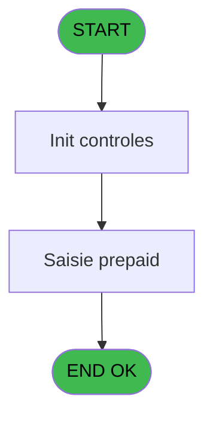
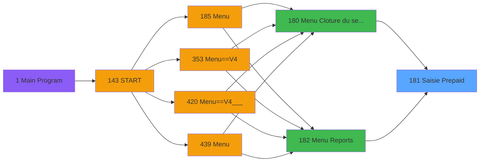
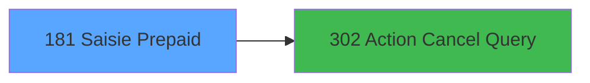

# PVE IDE 181 - Saisie Prepaid

> **Analyse**: Phases 1-4 2026-02-03 18:43 -> 18:43 (18s) | Assemblage 18:43
> **Pipeline**: V7.2 Enrichi
> **Structure**: 4 onglets (Resume | Ecrans | Donnees | Connexions)

<!-- TAB:Resume -->

## 1. FICHE D'IDENTITE

| Attribut | Valeur |
|----------|--------|
| Projet | PVE |
| IDE Position | 181 |
| Nom Programme | Saisie Prepaid |
| Fichier source | `Prg_181.xml` |
| Dossier IDE | Menu |
| Taches | 3 (1 ecrans visibles) |
| Tables modifiees | 0 |
| Programmes appeles | 1 |

## 2. DESCRIPTION FONCTIONNELLE

**Saisie Prepaid** assure la gestion complete de ce processus, accessible depuis [Menu Cloture du service (IDE 180)](PVE-IDE-180.md), [Menu Reports (IDE 182)](PVE-IDE-182.md).

Le flux de traitement s'organise en **2 blocs fonctionnels** :

- **Saisie** (2 taches) : ecrans de saisie utilisateur (formulaires, champs, donnees)
- **Traitement** (1 tache) : traitements metier divers

Detail : phases du traitement

#### Phase 1 : Saisie (2 taches)

- **181** - Saisie Prepaid
- **181.1** - Saisie prepaid **[[ECRAN]](#ecran-t2)**

#### Phase 2 : Traitement (1 tache)

- **181.2** - Execute SQL command **[[ECRAN]](#ecran-t3)**

Delegue a : [Action Cancel Query (IDE 302)](PVE-IDE-302.md)

## 3. BLOCS FONCTIONNELS

### 3.1 Saisie (2 taches)

L'operateur saisit les donnees de la transaction via 1 ecran (Saisie prepaid).

---

#### 181 - Saisie Prepaid

**Role** : Saisie des donnees : Saisie Prepaid.

---

#### 181.1 - Saisie prepaid [[ECRAN]](#ecran-t2)

**Role** : Saisie des donnees : Saisie prepaid.
**Ecran** : 810 x 380 DLU | [Voir mockup](#ecran-t2)

### 3.2 Traitement (1 tache)

Traitements internes.

---

#### 181.2 - Execute SQL command [[ECRAN]](#ecran-t3)

**Role** : Traitement : Execute SQL command.
**Ecran** : 120 x 195 DLU | [Voir mockup](#ecran-t3)
**Delegue a** : [Action Cancel Query (IDE 302)](PVE-IDE-302.md)

## 5. REGLES METIER

*(Aucune regle metier identifiee)*

## 6. CONTEXTE

- **Appele par**: [Menu Cloture du service (IDE 180)](PVE-IDE-180.md), [Menu Reports (IDE 182)](PVE-IDE-182.md)
- **Appelle**: 1 programmes | **Tables**: 5 (W:0 R:1 L:4) | **Taches**: 3 | **Expressions**: 6

<!-- TAB:Ecrans -->

## 8. ECRANS

### 8.1 Forms visibles (1 / 3)

| # | Position | Tache | Nom | Type | Largeur | Hauteur | Bloc |
|---|----------|-------|-----|------|---------|---------|------|
| 1 | 181.1 | 181.1 | Saisie prepaid | Type0 | 810 | 380 | Saisie |

### 8.2 Mockups Ecrans

---

#### 181.1 - Saisie prepaid
**Tache** : [181.1](#t2) | **Type** : Type0 | **Dimensions** : 810 x 380 DLU
**Bloc** : Saisie | **Titre IDE** : Saisie prepaid

<!-- FORM-DATA:
{
    "width":  810,
    "vFactor":  8,
    "type":  "Type0",
    "hFactor":  4,
    "controls":  [
                     {
                         "x":  3,
                         "type":  "label",
                         "var":  "",
                         "y":  0,
                         "w":  804,
                         "fmt":  "",
                         "name":  "",
                         "h":  41,
                         "color":  "188",
                         "text":  "",
                         "parent":  null
                     },
                     {
                         "x":  13,
                         "type":  "label",
                         "var":  "",
                         "y":  17,
                         "w":  77,
                         "fmt":  "",
                         "name":  "",
                         "h":  14,
                         "color":  "188",
                         "text":  "PREPAID",
                         "parent":  1
                     },
                     {
                         "x":  3,
                         "type":  "table",
                         "var":  "",
                         "name":  "",
                         "titleH":  24,
                         "color":  "110",
                         "w":  774,
                         "y":  44,
                         "fmt":  "",
                         "parent":  null,
                         "text":  "",
                         "rowH":  21,
                         "h":  294,
                         "cols":  [
                                      {
                                          "title":  "Date",
                                          "layer":  1,
                                          "w":  66
                                      },
                                      {
                                          "title":  "Name",
                                          "layer":  2,
                                          "w":  123
                                      },
                                      {
                                          "title":  "First Name",
                                          "layer":  3,
                                          "w":  97
                                      },
                                      {
                                          "title":  "Room",
                                          "layer":  4,
                                          "w":  45
                                      },
                                      {
                                          "title":  "Cat/Sub.Cat/Product",
                                          "layer":  5,
                                          "w":  301
                                      },
                                      {
                                          "title":  "Catalog Price",
                                          "layer":  6,
                                          "w":  66
                                      },
                                      {
                                          "title":  "Prepaid Amount",
                                          "layer":  7,
                                          "w":  72
                                      }
                                  ],
                         "rows":  7
                     },
                     {
                         "x":  3,
                         "type":  "label",
                         "var":  "",
                         "y":  340,
                         "w":  804,
                         "fmt":  "",
                         "name":  "",
                         "h":  38,
                         "color":  "188",
                         "text":  "",
                         "parent":  null
                     },
                     {
                         "x":  758,
                         "type":  "image",
                         "var":  "",
                         "y":  8,
                         "w":  48,
                         "fmt":  "",
                         "name":  "",
                         "h":  32,
                         "color":  "",
                         "text":  "",
                         "parent":  1
                     },
                     {
                         "x":  495,
                         "type":  "edit",
                         "var":  "",
                         "y":  17,
                         "w":  246,
                         "fmt":  "15",
                         "name":  "",
                         "h":  15,
                         "color":  "188",
                         "text":  "",
                         "parent":  1
                     },
                     {
                         "x":  7,
                         "type":  "edit",
                         "var":  "",
                         "y":  71,
                         "w":  61,
                         "fmt":  "",
                         "name":  "bank_accounting_date",
                         "h":  16,
                         "color":  "6",
                         "text":  "",
                         "parent":  5
                     },
                     {
                         "x":  72,
                         "type":  "edit",
                         "var":  "",
                         "y":  71,
                         "w":  118,
                         "fmt":  "",
                         "name":  "gm_nom",
                         "h":  16,
                         "color":  "6",
                         "text":  "",
                         "parent":  5
                     },
                     {
                         "x":  197,
                         "type":  "edit",
                         "var":  "",
                         "y":  71,
                         "w":  89,
                         "fmt":  "",
                         "name":  "gm_prenom",
                         "h":  16,
                         "color":  "6",
                         "text":  "",
                         "parent":  5
                     },
                     {
                         "x":  295,
                         "type":  "edit",
                         "var":  "",
                         "y":  71,
                         "w":  34,
                         "fmt":  "",
                         "name":  "v Room #",
                         "h":  16,
                         "color":  "6",
                         "text":  "",
                         "parent":  5
                     },
                     {
                         "x":  337,
                         "type":  "edit",
                         "var":  "",
                         "y":  71,
                         "w":  296,
                         "fmt":  "50",
                         "name":  "",
                         "h":  16,
                         "color":  "6",
                         "text":  "",
                         "parent":  5
                     },
                     {
                         "x":  639,
                         "type":  "edit",
                         "var":  "",
                         "y":  71,
                         "w":  61,
                         "fmt":  "",
                         "name":  "prix_de_vente",
                         "h":  16,
                         "color":  "6",
                         "text":  "",
                         "parent":  5
                     },
                     {
                         "x":  705,
                         "type":  "edit",
                         "var":  "",
                         "y":  71,
                         "w":  62,
                         "fmt":  "",
                         "name":  "cpk_montant_prepaid",
                         "h":  16,
                         "color":  "6",
                         "text":  "",
                         "parent":  5
                     },
                     {
                         "x":  776,
                         "type":  "button",
                         "var":  "",
                         "y":  44,
                         "w":  32,
                         "fmt":  "ñ",
                         "name":  "",
                         "h":  147,
                         "color":  "",
                         "text":  "",
                         "parent":  null
                     },
                     {
                         "x":  776,
                         "type":  "button",
                         "var":  "",
                         "y":  191,
                         "w":  32,
                         "fmt":  "ò",
                         "name":  "",
                         "h":  148,
                         "color":  "",
                         "text":  "",
                         "parent":  null
                     },
                     {
                         "x":  10,
                         "type":  "button",
                         "var":  "",
                         "y":  347,
                         "w":  78,
                         "fmt":  "\u0026Modify mode",
                         "name":  "",
                         "h":  28,
                         "color":  "",
                         "text":  "",
                         "parent":  null
                     },
                     {
                         "x":  90,
                         "type":  "button",
                         "var":  "",
                         "y":  347,
                         "w":  77,
                         "fmt":  "\u0026Cancel",
                         "name":  "",
                         "h":  28,
                         "color":  "",
                         "text":  "",
                         "parent":  null
                     },
                     {
                         "x":  717,
                         "type":  "button",
                         "var":  "",
                         "y":  347,
                         "w":  87,
                         "fmt":  "\u0026Exit",
                         "name":  "",
                         "h":  28,
                         "color":  "",
                         "text":  "",
                         "parent":  null
                     }
                 ],
    "taskId":  "181.1",
    "height":  380
}
-->

<strong>Champs : 8 champs</strong>

| Pos (x,y) | Nom | Variable | Type |
|-----------|-----|----------|------|
| 495,17 | 15 | - | edit |
| 7,71 | bank_accounting_date | - | edit |
| 72,71 | gm_nom | - | edit |
| 197,71 | gm_prenom | - | edit |
| 295,71 | v Room # | - | edit |
| 337,71 | 50 | - | edit |
| 639,71 | prix_de_vente | - | edit |
| 705,71 | cpk_montant_prepaid | - | edit |

<strong>Boutons : 5 boutons</strong>

| Bouton | Pos (x,y) | Action |
|--------|-----------|--------|
| ñ | 776,44 | Bouton fonctionnel |
| ò | 776,191 | Bouton fonctionnel |
| Modify mode | 10,347 | Modifie l'element |
| Cancel | 90,347 | Appel [Action Cancel Query (IDE 302)](PVE-IDE-302.md) |
| Exit | 717,347 | Quitte le programme |

## 9. NAVIGATION

Ecran unique: **Saisie prepaid**

### 9.3 Structure hierarchique (3 taches)

| Position | Tache | Type | Dimensions | Bloc |
|----------|-------|------|------------|------|
| **181.1** | [**Saisie Prepaid** (181)](#t1) | - | - | Saisie |
| 181.1.1 | [Saisie prepaid (181.1)](#t2) [mockup](#ecran-t2) | - | 810x380 | |
| **181.2** | [**Execute SQL command** (181.2)](#t3) [mockup](#ecran-t3) | - | 120x195 | Traitement |

### 9.4 Algorigramme

> **Legende**: Vert = START/END OK | Rouge = END KO | Bleu = Decisions
> *Algorigramme auto-genere. Utiliser `/algorigramme` pour une synthese metier detaillee.*

<!-- TAB:Donnees -->

## 10. TABLES

### Tables utilisees (5)

| ID | Nom | Description | Type | R | W | L | Usages |
|----|-----|-------------|------|---|---|---|--------|
| 379 | pv_customer_temp |  | DB | R |   |   | 1 |
| 382 | pv_discount_reasons |  | DB |   |   | L | 1 |
| 400 | pv_cust_rentals |  | DB |   |   | L | 1 |
| 403 | pv_sellers |  | DB |   |   | L | 1 |
| 413 | pv_tva |  | DB |   |   | L | 1 |

### Colonnes par table (1 / 1 tables avec colonnes identifiees)

Table 379 - pv_customer_temp (R) - 1 usages

| Lettre | Variable | Acces | Type |
|--------|----------|-------|------|
| A | v Date Comptable | R | Date |
| B | v Room # | R | Alpha |
| C | v Fin tache | R | Logical |
| D | v Nb d'enregistrement | R | Numeric |

## 11. VARIABLES

### 11.1 Parametres entrants (4)

Variables recues du programme appelant ([Menu Cloture du service (IDE 180)](PVE-IDE-180.md)).

| Lettre | Nom | Type | Usage dans |
|--------|-----|------|-----------|
| A | P Viens de : | Alpha | 2x parametre entrant |
| B | P Date comptable Min | Date | - |
| C | P Date comptable Max | Date | - |
| D | P Step Cloture | Numeric | 1x parametre entrant |

### 11.2 Variables de session (2)

Variables persistantes pendant toute la session.

| Lettre | Nom | Type | Usage dans |
|--------|-----|------|-----------|
| E | v Fin de tache | Logical | 1x session |
| F | v Nb enregistrement | Numeric | 3x session |

## 12. EXPRESSIONS

**6 / 6 expressions decodees (100%)**

### 12.1 Repartition par type

| Type | Expressions | Regles |
|------|-------------|--------|
| CALCULATION | 1 | 0 |
| CONSTANTE | 1 | 0 |
| CONDITION | 3 | 0 |
| OTHER | 1 | 0 |

### 12.2 Expressions cles par type

#### CALCULATION (1 expressions)

| Type | IDE | Expression | Regle |
|------|-----|------------|-------|
| CALCULATION | 6 | `P Step Cloture [D]+1` | - |

#### CONSTANTE (1 expressions)

| Type | IDE | Expression | Regle |
|------|-----|------------|-------|
| CONSTANTE | 2 | `'No record found'` | - |

#### CONDITION (3 expressions)

| Type | IDE | Expression | Regle |
|------|-----|------------|-------|
| CONDITION | 4 | `v Nb enregistrement [F]=0 AND P Viens de : [A]='EDI'` | - |
| CONDITION | 3 | `v Nb enregistrement [F]=0 AND P Viens de : [A]='CLO'` | - |
| CONDITION | 1 | `v Nb enregistrement [F]>0` | - |

#### OTHER (1 expressions)

| Type | IDE | Expression | Regle |
|------|-----|------------|-------|
| OTHER | 5 | `v Fin de tache [E]` | - |

<!-- TAB:Connexions -->

## 13. GRAPHE D'APPELS

### 13.1 Chaine depuis Main (Callers)

Main -> ... -> [Menu Cloture du service (IDE 180)](PVE-IDE-180.md) -> **Saisie Prepaid (IDE 181)**

Main -> ... -> [Menu Reports (IDE 182)](PVE-IDE-182.md) -> **Saisie Prepaid (IDE 181)**

### 13.2 Callers

| IDE | Nom Programme | Nb Appels |
|-----|---------------|-----------|
| [180](PVE-IDE-180.md) | Menu Cloture du service | 1 |
| [182](PVE-IDE-182.md) | Menu Reports | 1 |

### 13.3 Callees (programmes appeles)

### 13.4 Detail Callees avec contexte

| IDE | Nom Programme | Appels | Contexte |
|-----|---------------|--------|----------|
| [302](PVE-IDE-302.md) | Action Cancel Query | 1 | Sous-programme |

## 14. RECOMMANDATIONS MIGRATION

### 14.1 Profil du programme

| Metrique | Valeur | Impact migration |
|----------|--------|-----------------|
| Lignes de logique | 97 | Programme compact |
| Expressions | 6 | Peu de logique |
| Tables WRITE | 0 | Impact faible |
| Sous-programmes | 1 | Peu de dependances |
| Ecrans visibles | 1 | Ecran unique ou traitement batch |
| Code desactive | 0% (0 / 97) | Code sain |
| Regles metier | 0 | Pas de regle identifiee |

### 14.2 Plan de migration par bloc

#### Saisie (2 taches: 1 ecran, 1 traitement)

- **Strategie** : Formulaire React/Blazor avec validation Zod/FluentValidation.
- Reproduire 1 ecran : Saisie prepaid
- Validation temps reel cote client + serveur

#### Traitement (1 tache: 1 ecran, 0 traitement)

- **Strategie** : 1 composant(s) UI (Razor/React) avec formulaires et validation.
- 1 sous-programme(s) a migrer ou a reutiliser depuis les services existants.
- Decomposer les taches en services unitaires testables.

### 14.3 Dependances critiques

| Dependance | Type | Appels | Impact |
|------------|------|--------|--------|
| [Action Cancel Query (IDE 302)](PVE-IDE-302.md) | Sous-programme | 1x | Normale - Sous-programme |

---
*Spec DETAILED generee par Pipeline V7.2 - 2026-02-03 18:43*
