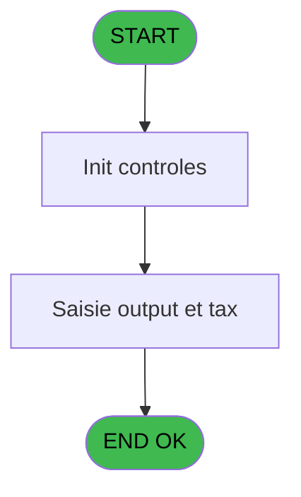
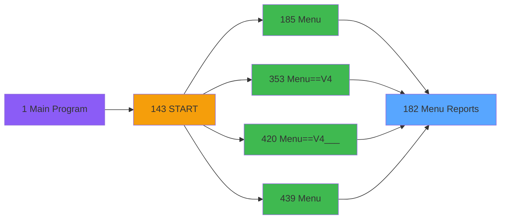
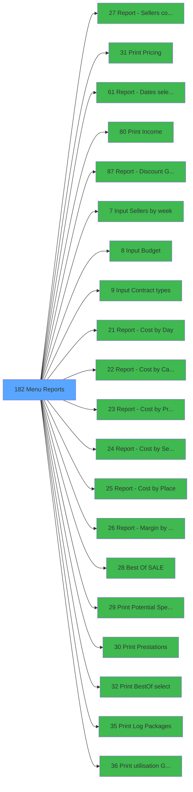

# PVE IDE 182 - Menu Reports

> **Analyse**: Phases 1-4 2026-02-03 18:43 -> 18:43 (19s) | Assemblage 18:43
> **Pipeline**: V7.2 Enrichi
> **Structure**: 4 onglets (Resume | Ecrans | Donnees | Connexions)

<!-- TAB:Resume -->

## 1. FICHE D'IDENTITE

| Attribut | Valeur |
|----------|--------|
| Projet | PVE |
| IDE Position | 182 |
| Nom Programme | Menu Reports |
| Fichier source | `Prg_182.xml` |
| Dossier IDE | Menu |
| Taches | 4 (3 ecrans visibles) |
| Tables modifiees | 0 |
| Programmes appeles | 20 |

## 2. DESCRIPTION FONCTIONNELLE

**Menu Reports** assure la gestion complete de ce processus, accessible depuis [Menu (IDE 185)](PVE-IDE-185.md), [Menu==V4 (IDE 353)](PVE-IDE-353.md), [Menu==V4___ (IDE 420)](PVE-IDE-420.md), [Menu (IDE 439)](PVE-IDE-439.md).

Le flux de traitement s'organise en **2 blocs fonctionnels** :

- **Traitement** (3 taches) : traitements metier divers
- **Consultation** (1 tache) : ecrans de recherche, selection et consultation

**Logique metier** : 3 regles identifiees couvrant conditions metier.

Detail : phases du traitement

#### Phase 1 : Traitement (3 taches)

- **182** - Report 2.00 **[[ECRAN]](#ecran-t1)**
- **182.1** - Output and Tax Choice
- **182.3** - Scope **[[ECRAN]](#ecran-t4)**

Delegue a : [Report - Sellers cost by week (IDE 27)](PVE-IDE-27.md), [Report - Discount & Gratuities (IDE 87)](PVE-IDE-87.md), [Input Sellers by week (IDE 7)](PVE-IDE-7.md), [Input Budget (IDE 8)](PVE-IDE-8.md), [Input Contract types (IDE 9)](PVE-IDE-9.md), [Report - Cost by Day (IDE 21)](PVE-IDE-21.md), [Report - Cost by Category (IDE 22)](PVE-IDE-22.md), [Report - Cost by Product (IDE 23)](PVE-IDE-23.md), [Report - Cost by Seller (IDE 24)](PVE-IDE-24.md), [Report - Cost by Place (IDE 25)](PVE-IDE-25.md), [Report - Margin by Seller (IDE 26)](PVE-IDE-26.md), [Best Of (SALE) (IDE 28)](PVE-IDE-28.md)

#### Phase 2 : Consultation (1 tache)

- **182.2** - Date selection **[[ECRAN]](#ecran-t3)**

Delegue a : [Input Budget (IDE 8)](PVE-IDE-8.md)

## 3. BLOCS FONCTIONNELS

### 3.1 Traitement (3 taches)

Traitements internes.

---

#### 182 - Report 2.00 [[ECRAN]](#ecran-t1)

**Role** : Traitement : Report 2.00.
**Ecran** : 810 x 393 DLU (MDI) | [Voir mockup](#ecran-t1)
**Variables liees** : M (v.Execute print report)
**Delegue a** : [Report - Sellers cost by week (IDE 27)](PVE-IDE-27.md), [Report - Discount & Gratuities (IDE 87)](PVE-IDE-87.md), [Input Sellers by week (IDE 7)](PVE-IDE-7.md)

---

#### 182.1 - Output and Tax Choice

**Role** : Traitement : Output and Tax Choice.
**Variables liees** : BB (v. Choice E equip / P product)
**Delegue a** : [Report - Sellers cost by week (IDE 27)](PVE-IDE-27.md), [Report - Discount & Gratuities (IDE 87)](PVE-IDE-87.md), [Input Sellers by week (IDE 7)](PVE-IDE-7.md)

---

#### 182.3 - Scope [[ECRAN]](#ecran-t4)

**Role** : Traitement : Scope.
**Ecran** : 243 x 152 DLU (MDI) | [Voir mockup](#ecran-t4)
**Delegue a** : [Report - Sellers cost by week (IDE 27)](PVE-IDE-27.md), [Report - Discount & Gratuities (IDE 87)](PVE-IDE-87.md), [Input Sellers by week (IDE 7)](PVE-IDE-7.md)

### 3.2 Consultation (1 tache)

Ecrans de recherche et consultation.

---

#### 182.2 - Date selection [[ECRAN]](#ecran-t3)

**Role** : Selection par l'operateur : Date selection.
**Ecran** : 243 x 152 DLU (MDI) | [Voir mockup](#ecran-t3)
**Variables liees** : K (v.Date Min), L (v.Date Max), S (v.Date Selection), T (v.Tax Selection)

## 5. REGLES METIER

3 regles identifiees:

### Autres (3 regles)

#### [RM-001] Si VG12 alors 'M' sinon 'Q')

| Element | Detail |
|---------|--------|
| **Condition** | `VG12` |
| **Si vrai** | 'M' |
| **Si faux** | 'Q') |
| **Expression source** | Expression 32 : `IF (VG12,'M','Q')` |
| **Exemple** | Si VG12 → 'M'. Sinon → 'Q') |

#### [RM-002] Si GetParam ('GROUP')='INFORMATICIEN' OR GetParam ('GROUP')='GESTION' alors 'M' sinon 'Q')

| Element | Detail |
|---------|--------|
| **Condition** | `GetParam ('GROUP')='INFORMATICIEN' OR GetParam ('GROUP')='GESTION'` |
| **Si vrai** | 'M' |
| **Si faux** | 'Q') |
| **Expression source** | Expression 33 : `IF (GetParam ('GROUP')='INFORMATICIEN' OR GetParam ('GROUP')` |
| **Exemple** | Si GetParam ('GROUP')='INFORMATICIEN' OR GetParam ('GROUP')='GESTION' → 'M'. Sinon → 'Q') |

#### [RM-003] Traitement si InStr('D1D2D4D10R02R03R04R05R06R08R12R13R14R22R23R24D6D7D8D9P1P2P3P8P9P10P15',Trim(v.Lastclick [W])) est non nul

| Element | Detail |
|---------|--------|
| **Condition** | `InStr('D1D2D4D10R02R03R04R05R06R08R12R13R14R22R23R24D6D7D8D9P1P2P3P8P9P10P15'` |
| **Si vrai** | Trim(v.Lastclick [W]))<>0 |
| **Si faux** | 'FALSE'LOG,'TRUE'LOG) |
| **Variables** | W (v.Lastclick) |
| **Expression source** | Expression 51 : `IF(InStr('D1D2D4D10R02R03R04R05R06R08R12R13R14R22R23R24D6D7D` |
| **Exemple** | Si InStr('D1D2D4D10R02R03R04R05R06R08R12R13R14R22R23R24D6D7D8D9P1P2P3P8P9P10P15' → Trim(v.Lastclick [W]))<>0. Sinon → 'FALSE'LOG,'TRUE'LOG) |

## 6. CONTEXTE

- **Appele par**: [Menu (IDE 185)](PVE-IDE-185.md), [Menu==V4 (IDE 353)](PVE-IDE-353.md), [Menu==V4___ (IDE 420)](PVE-IDE-420.md), [Menu (IDE 439)](PVE-IDE-439.md)
- **Appelle**: 20 programmes | **Tables**: 0 (W:0 R:0 L:0) | **Taches**: 4 | **Expressions**: 109

<!-- TAB:Ecrans -->

## 8. ECRANS

### 8.1 Forms visibles (3 / 4)

| # | Position | Tache | Nom | Type | Largeur | Hauteur | Bloc |
|---|----------|-------|-----|------|---------|---------|------|
| 1 | 182 | 182 | Report 2.00 | MDI | 810 | 393 | Traitement |
| 2 | 182.2 | 182.2 | Date selection | MDI | 243 | 152 | Consultation |
| 3 | 182.3 | 182.3 | Scope | MDI | 243 | 152 | Traitement |

### 8.2 Mockups Ecrans

---

#### 182 - Report 2.00
**Tache** : [182](#t1) | **Type** : MDI | **Dimensions** : 810 x 393 DLU
**Bloc** : Traitement | **Titre IDE** : Report 2.00

<!-- FORM-DATA:
{
    "width":  810,
    "vFactor":  8,
    "type":  "MDI",
    "hFactor":  4,
    "controls":  [
                     {
                         "x":  9,
                         "type":  "label",
                         "var":  "",
                         "y":  38,
                         "w":  786,
                         "fmt":  "",
                         "name":  "",
                         "h":  18,
                         "color":  "173",
                         "text":  "   REPORTS",
                         "parent":  null
                     },
                     {
                         "x":  2,
                         "type":  "label",
                         "var":  "",
                         "y":  1,
                         "w":  803,
                         "fmt":  "",
                         "name":  "",
                         "h":  33,
                         "color":  "183",
                         "text":  "",
                         "parent":  null
                     },
                     {
                         "x":  6,
                         "type":  "label",
                         "var":  "",
                         "y":  6,
                         "w":  796,
                         "fmt":  "",
                         "name":  "",
                         "h":  26,
                         "color":  "188",
                         "text":  "MANAGEMENT REPORTS",
                         "parent":  2
                     },
                     {
                         "x":  89,
                         "type":  "label",
                         "var":  "",
                         "y":  102,
                         "w":  634,
                         "fmt":  "",
                         "name":  "",
                         "h":  238,
                         "color":  "189",
                         "text":  "",
                         "parent":  5
                     },
                     {
                         "x":  122,
                         "type":  "label",
                         "var":  "",
                         "y":  225,
                         "w":  91,
                         "fmt":  "",
                         "name":  "",
                         "h":  14,
                         "color":  "189",
                         "text":  "Fixed",
                         "parent":  5
                     },
                     {
                         "x":  122,
                         "type":  "label",
                         "var":  "",
                         "y":  116,
                         "w":  87,
                         "fmt":  "",
                         "name":  "",
                         "h":  14,
                         "color":  "189",
                         "text":  "Gross",
                         "parent":  5
                     },
                     {
                         "x":  122,
                         "type":  "label",
                         "var":  "",
                         "y":  231,
                         "w":  71,
                         "fmt":  "",
                         "name":  "",
                         "h":  14,
                         "color":  "189",
                         "text":  "Net",
                         "parent":  5
                     },
                     {
                         "x":  122,
                         "type":  "line",
                         "var":  "",
                         "y":  227,
                         "w":  574,
                         "fmt":  "",
                         "name":  "",
                         "h":  0,
                         "color":  "",
                         "text":  "",
                         "parent":  5
                     },
                     {
                         "x":  122,
                         "type":  "line",
                         "var":  "",
                         "y":  218,
                         "w":  575,
                         "fmt":  "",
                         "name":  "",
                         "h":  0,
                         "color":  "",
                         "text":  "",
                         "parent":  5
                     },
                     {
                         "x":  122,
                         "type":  "label",
                         "var":  "",
                         "y":  114,
                         "w":  91,
                         "fmt":  "",
                         "name":  "",
                         "h":  14,
                         "color":  "189",
                         "text":  "Variable",
                         "parent":  5
                     },
                     {
                         "x":  706,
                         "type":  "button",
                         "var":  "",
                         "y":  361,
                         "w":  101,
                         "fmt":  "\u0026Exit",
                         "name":  "BP. Exit",
                         "h":  30,
                         "color":  "",
                         "text":  "",
                         "parent":  null
                     },
                     {
                         "x":  121,
                         "type":  "button",
                         "var":  "",
                         "y":  114,
                         "w":  127,
                         "fmt":  "For an accounting Period",
                         "name":  "R02",
                         "h":  28,
                         "color":  "",
                         "text":  "",
                         "parent":  5
                     },
                     {
                         "x":  278,
                         "type":  "button",
                         "var":  "",
                         "y":  114,
                         "w":  127,
                         "fmt":  "By Categories \u0026\u0026 Period",
                         "name":  "R03",
                         "h":  28,
                         "color":  "",
                         "text":  "",
                         "parent":  5
                     },
                     {
                         "x":  437,
                         "type":  "button",
                         "var":  "",
                         "y":  114,
                         "w":  127,
                         "fmt":  "By Products \u0026\u0026 Period",
                         "name":  "R04",
                         "h":  28,
                         "color":  "",
                         "text":  "",
                         "parent":  5
                     },
                     {
                         "x":  121,
                         "type":  "button",
                         "var":  "",
                         "y":  156,
                         "w":  127,
                         "fmt":  "Discounts \u0026\u0026 Free of charge",
                         "name":  "R05",
                         "h":  28,
                         "color":  "",
                         "text":  "",
                         "parent":  5
                     },
                     {
                         "x":  278,
                         "type":  "button",
                         "var":  "",
                         "y":  156,
                         "w":  127,
                         "fmt":  "Revenue cancelations",
                         "name":  "R06",
                         "h":  28,
                         "color":  "",
                         "text":  "",
                         "parent":  5
                     },
                     {
                         "x":  122,
                         "type":  "button",
                         "var":  "",
                         "y":  132,
                         "w":  127,
                         "fmt":  "Goods consumed cost /HD",
                         "name":  "R12",
                         "h":  28,
                         "color":  "",
                         "text":  "",
                         "parent":  5
                     },
                     {
                         "x":  278,
                         "type":  "button",
                         "var":  "",
                         "y":  132,
                         "w":  127,
                         "fmt":  "GCC by Categories /HD",
                         "name":  "R13",
                         "h":  28,
                         "color":  "",
                         "text":  "",
                         "parent":  5
                     },
                     {
                         "x":  437,
                         "type":  "button",
                         "var":  "",
                         "y":  132,
                         "w":  127,
                         "fmt":  "GCC by Products /HD",
                         "name":  "R14",
                         "h":  28,
                         "color":  "",
                         "text":  "",
                         "parent":  5
                     },
                     {
                         "x":  437,
                         "type":  "button",
                         "var":  "",
                         "y":  132,
                         "w":  127,
                         "fmt":  "Gross margin by Product",
                         "name":  "R24",
                         "h":  28,
                         "color":  "",
                         "text":  "",
                         "parent":  5
                     },
                     {
                         "x":  122,
                         "type":  "button",
                         "var":  "",
                         "y":  132,
                         "w":  127,
                         "fmt":  "Global gross margin",
                         "name":  "R22",
                         "h":  28,
                         "color":  "",
                         "text":  "",
                         "parent":  5
                     },
                     {
                         "x":  278,
                         "type":  "button",
                         "var":  "",
                         "y":  132,
                         "w":  127,
                         "fmt":  "Gross margin by Category",
                         "name":  "R23",
                         "h":  28,
                         "color":  "",
                         "text":  "",
                         "parent":  5
                     },
                     {
                         "x":  90,
                         "type":  "tab",
                         "var":  "",
                         "y":  90,
                         "w":  629,
                         "fmt":  "",
                         "name":  "V.Onglet etat",
                         "h":  247,
                         "color":  "",
                         "text":  "RE,CH,MA,RN,MI",
                         "parent":  null
                     },
                     {
                         "x":  402,
                         "type":  "button",
                         "var":  "",
                         "y":  122,
                         "w":  127,
                         "fmt":  "Rental Statistics",
                         "name":  "P11",
                         "h":  28,
                         "color":  "",
                         "text":  "",
                         "parent":  5
                     },
                     {
                         "x":  261,
                         "type":  "button",
                         "var":  "",
                         "y":  212,
                         "w":  127,
                         "fmt":  "Deposits",
                         "name":  "P10",
                         "h":  28,
                         "color":  "",
                         "text":  "",
                         "parent":  5
                     },
                     {
                         "x":  261,
                         "type":  "button",
                         "var":  "",
                         "y":  167,
                         "w":  127,
                         "fmt":  "Export Rental Stats",
                         "name":  "P14",
                         "h":  28,
                         "color":  "",
                         "text":  "",
                         "parent":  5
                     },
                     {
                         "x":  261,
                         "type":  "button",
                         "var":  "",
                         "y":  122,
                         "w":  127,
                         "fmt":  "Equipments due",
                         "name":  "P5",
                         "h":  28,
                         "color":  "",
                         "text":  "",
                         "parent":  5
                     },
                     {
                         "x":  118,
                         "type":  "button",
                         "var":  "",
                         "y":  212,
                         "w":  127,
                         "fmt":  "Local \u0026\u0026 Prepaid Rentals",
                         "name":  "P13",
                         "h":  28,
                         "color":  "",
                         "text":  "",
                         "parent":  5
                     },
                     {
                         "x":  118,
                         "type":  "button",
                         "var":  "",
                         "y":  167,
                         "w":  127,
                         "fmt":  "Equipments inventory",
                         "name":  "P4",
                         "h":  28,
                         "color":  "",
                         "text":  "",
                         "parent":  5
                     },
                     {
                         "x":  118,
                         "type":  "button",
                         "var":  "",
                         "y":  122,
                         "w":  127,
                         "fmt":  "Insurance file export",
                         "name":  "P3",
                         "h":  28,
                         "color":  "",
                         "text":  "",
                         "parent":  5
                     },
                     {
                         "x":  437,
                         "type":  "button",
                         "var":  "",
                         "y":  156,
                         "w":  127,
                         "fmt":  "Income",
                         "name":  "P1",
                         "h":  28,
                         "color":  "",
                         "text":  "",
                         "parent":  5
                     },
                     {
                         "x":  121,
                         "type":  "button",
                         "var":  "",
                         "y":  198,
                         "w":  127,
                         "fmt":  "Global Income",
                         "name":  "P2",
                         "h":  28,
                         "color":  "",
                         "text":  "",
                         "parent":  5
                     },
                     {
                         "x":  290,
                         "type":  "button",
                         "var":  "",
                         "y":  130,
                         "w":  127,
                         "fmt":  "Prepaid packages",
                         "name":  "P6",
                         "h":  28,
                         "color":  "",
                         "text":  "",
                         "parent":  5
                     },
                     {
                         "x":  461,
                         "type":  "button",
                         "var":  "",
                         "y":  130,
                         "w":  127,
                         "fmt":  "Price List",
                         "name":  "P7",
                         "h":  28,
                         "color":  "",
                         "text":  "",
                         "parent":  5
                     },
                     {
                         "x":  121,
                         "type":  "button",
                         "var":  "",
                         "y":  130,
                         "w":  127,
                         "fmt":  "Best Of",
                         "name":  "P8",
                         "h":  28,
                         "color":  "",
                         "text":  "",
                         "parent":  5
                     },
                     {
                         "x":  402,
                         "type":  "button",
                         "var":  "",
                         "y":  167,
                         "w":  127,
                         "fmt":  "Mini Club Labels",
                         "name":  "P12",
                         "h":  28,
                         "color":  "",
                         "text":  "",
                         "parent":  5
                     },
                     {
                         "x":  273,
                         "type":  "checkbox",
                         "var":  "",
                         "y":  64,
                         "w":  127,
                         "fmt":  "",
                         "name":  "V Preview",
                         "h":  18,
                         "color":  "187",
                         "text":  "Print preview ?",
                         "parent":  null
                     },
                     {
                         "x":  411,
                         "type":  "checkbox",
                         "var":  "",
                         "y":  64,
                         "w":  127,
                         "fmt":  "",
                         "name":  "V Show Printers",
                         "h":  18,
                         "color":  "187",
                         "text":  "Show Printers ?",
                         "parent":  null
                     },
                     {
                         "x":  122,
                         "type":  "button",
                         "var":  "",
                         "y":  244,
                         "w":  127,
                         "fmt":  "Sellers cost by Week",
                         "name":  "R31",
                         "h":  28,
                         "color":  "",
                         "text":  "",
                         "parent":  5
                     },
                     {
                         "x":  122,
                         "type":  "button",
                         "var":  "",
                         "y":  253,
                         "w":  127,
                         "fmt":  "Net margin by product",
                         "name":  "R41",
                         "h":  28,
                         "color":  "",
                         "text":  "",
                         "parent":  5
                     },
                     {
                         "x":  437,
                         "type":  "button",
                         "var":  "",
                         "y":  198,
                         "w":  127,
                         "fmt":  "By Sales place \u0026\u0026 Period",
                         "name":  "D1",
                         "h":  28,
                         "color":  "",
                         "text":  "",
                         "parent":  5
                     },
                     {
                         "x":  121,
                         "type":  "button",
                         "var":  "",
                         "y":  240,
                         "w":  127,
                         "fmt":  "By Sellers \u0026\u0026 Period",
                         "name":  "D2",
                         "h":  28,
                         "color":  "",
                         "text":  "",
                         "parent":  5
                     },
                     {
                         "x":  122,
                         "type":  "button",
                         "var":  "",
                         "y":  174,
                         "w":  127,
                         "fmt":  "GCC by Sales place /HD",
                         "name":  "D6",
                         "h":  28,
                         "color":  "",
                         "text":  "",
                         "parent":  5
                     },
                     {
                         "x":  278,
                         "type":  "button",
                         "var":  "",
                         "y":  174,
                         "w":  127,
                         "fmt":  "GCC by Sellers /HD",
                         "name":  "D7",
                         "h":  28,
                         "color":  "",
                         "text":  "",
                         "parent":  5
                     },
                     {
                         "x":  122,
                         "type":  "button",
                         "var":  "",
                         "y":  175,
                         "w":  127,
                         "fmt":  "Gross margin by Sales place",
                         "name":  "D8",
                         "h":  28,
                         "color":  "",
                         "text":  "",
                         "parent":  5
                     },
                     {
                         "x":  278,
                         "type":  "button",
                         "var":  "",
                         "y":  175,
                         "w":  127,
                         "fmt":  "Gross margin by Seller",
                         "name":  "D9",
                         "h":  28,
                         "color":  "",
                         "text":  "",
                         "parent":  5
                     },
                     {
                         "x":  278,
                         "type":  "button",
                         "var":  "",
                         "y":  240,
                         "w":  127,
                         "fmt":  "Average basket by Period",
                         "name":  "D4",
                         "h":  28,
                         "color":  "",
                         "text":  "",
                         "parent":  5
                     },
                     {
                         "x":  278,
                         "type":  "button",
                         "var":  "",
                         "y":  198,
                         "w":  127,
                         "fmt":  "PREPAID Income",
                         "name":  "P9",
                         "h":  28,
                         "color":  "",
                         "text":  "",
                         "parent":  5
                     },
                     {
                         "x":  556,
                         "type":  "edit",
                         "var":  "",
                         "y":  9,
                         "w":  245,
                         "fmt":  "30",
                         "name":  "",
                         "h":  18,
                         "color":  "174",
                         "text":  "",
                         "parent":  3
                     },
                     {
                         "x":  437,
                         "type":  "button",
                         "var":  "",
                         "y":  240,
                         "w":  127,
                         "fmt":  "Sales by Customer",
                         "name":  "D10",
                         "h":  28,
                         "color":  "",
                         "text":  "",
                         "parent":  5
                     },
                     {
                         "x":  121,
                         "type":  "button",
                         "var":  "",
                         "y":  285,
                         "w":  127,
                         "fmt":  "Global Income All Services",
                         "name":  "P15",
                         "h":  28,
                         "color":  "",
                         "text":  "",
                         "parent":  5
                     },
                     {
                         "x":  121,
                         "type":  "button",
                         "var":  "",
                         "y":  181,
                         "w":  127,
                         "fmt":  "Packages Modification Log",
                         "name":  "P16",
                         "h":  28,
                         "color":  "",
                         "text":  "",
                         "parent":  5
                     },
                     {
                         "x":  278,
                         "type":  "button",
                         "var":  "",
                         "y":  285,
                         "w":  127,
                         "fmt":  "Refusal to sell",
                         "name":  "R08",
                         "h":  28,
                         "color":  "",
                         "text":  "",
                         "parent":  5
                     },
                     {
                         "x":  437,
                         "type":  "button",
                         "var":  "",
                         "y":  285,
                         "w":  127,
                         "fmt":  "Prepaid Package Modification",
                         "name":  "R15",
                         "h":  28,
                         "color":  "",
                         "text":  "",
                         "parent":  5
                     },
                     {
                         "x":  290,
                         "type":  "button",
                         "var":  "",
                         "y":  181,
                         "w":  127,
                         "fmt":  "In Resort Purchase Potential",
                         "name":  "P17",
                         "h":  28,
                         "color":  "",
                         "text":  "",
                         "parent":  5
                     },
                     {
                         "x":  461,
                         "type":  "button",
                         "var":  "",
                         "y":  181,
                         "w":  127,
                         "fmt":  "In Resort Gift Pass Spent",
                         "name":  "P18",
                         "h":  28,
                         "color":  "",
                         "text":  "",
                         "parent":  5
                     },
                     {
                         "x":  120,
                         "type":  "button",
                         "var":  "",
                         "y":  227,
                         "w":  127,
                         "fmt":  "Mini Club Labels",
                         "name":  "P19",
                         "h":  28,
                         "color":  "",
                         "text":  "",
                         "parent":  5
                     },
                     {
                         "x":  402,
                         "type":  "button",
                         "var":  "",
                         "y":  212,
                         "w":  127,
                         "fmt":  "Edition UPGRADE",
                         "name":  "P20",
                         "h":  28,
                         "color":  "",
                         "text":  "",
                         "parent":  5
                     }
                 ],
    "taskId":  "182",
    "height":  393
}
-->

<strong>Champs : 3 champs</strong>

| Pos (x,y) | Nom | Variable | Type |
|-----------|-----|----------|------|
| 273,64 | V Preview | - | checkbox |
| 411,64 | V Show Printers | - | checkbox |
| 556,9 | 30 | - | edit |

<strong>Boutons : 44 boutons</strong>

| Bouton | Pos (x,y) | Action |
|--------|-----------|--------|
| Exit | 706,361 | Quitte le programme |
| For an accounting Period | 121,114 | Bouton fonctionnel |
| By Categories  Period | 278,114 | Appel [Report - Cost by Category (IDE 22)](PVE-IDE-22.md) |
| By Products  Period | 437,114 | Appel [Report - Cost by Product (IDE 23)](PVE-IDE-23.md) |
| Discounts  Free of charge | 121,156 | Appel [Report - Discount & Gratuities (IDE 87)](PVE-IDE-87.md) |
| Revenue cancelations | 278,156 | Annule et retour au menu |
| Goods consumed cost /HD | 122,132 | Bouton fonctionnel |
| GCC by Categories /HD | 278,132 | Bouton fonctionnel |
| GCC by Products /HD | 437,132 | Bouton fonctionnel |
| Gross margin by Product | 437,132 | Bouton fonctionnel |
| Global gross margin | 122,132 | Bouton fonctionnel |
| Gross margin by Category | 278,132 | Bouton fonctionnel |
| Rental Statistics | 402,122 | Bouton fonctionnel |
| Deposits | 261,212 | Bouton fonctionnel |
| Export Rental Stats | 261,167 | Bouton fonctionnel |
| Equipments due | 261,122 | Bouton fonctionnel |
| Local  Prepaid Rentals | 118,212 | Bouton fonctionnel |
| Equipments inventory | 118,167 | Bouton fonctionnel |
| Insurance file export | 118,122 | Bouton fonctionnel |
| Income | 437,156 | Appel [Print Income (IDE 80)](PVE-IDE-80.md) |
| Global Income | 121,198 | Bouton fonctionnel |
| Prepaid packages | 290,130 | Bouton fonctionnel |
| Price List | 461,130 | Bouton fonctionnel |
| Best Of | 121,130 | Appel [Best Of (SALE) (IDE 28)](PVE-IDE-28.md) |
| Mini Club Labels | 402,167 | Bouton fonctionnel |
| Sellers cost by Week | 122,244 | Appel [Report - Sellers cost by week (IDE 27)](PVE-IDE-27.md) |
| Net margin by product | 122,253 | Bouton fonctionnel |
| By Sales place  Period | 437,198 | Bouton fonctionnel |
| By Sellers  Period | 121,240 | Appel [Report - Cost by Seller (IDE 24)](PVE-IDE-24.md) |
| GCC by Sales place /HD | 122,174 | Bouton fonctionnel |
| GCC by Sellers /HD | 278,174 | Bouton fonctionnel |
| Gross margin by Sales place | 122,175 | Bouton fonctionnel |
| Gross margin by Seller | 278,175 | Bouton fonctionnel |
| Average basket by Period | 278,240 | Bouton fonctionnel |
| PREPAID Income | 278,198 | Bouton fonctionnel |
| Sales by Customer | 437,240 | Bouton fonctionnel |
| Global Income All Services | 121,285 | Bouton fonctionnel |
| Packages Modification Log | 121,181 | Appel [Print Log Packages (IDE 35)](PVE-IDE-35.md) |
| Refusal to sell | 278,285 | Bouton fonctionnel |
| Prepaid Package Modification | 437,285 | Modifie l'element |
| In Resort Purchase Potential | 290,181 | Bouton fonctionnel |
| In Resort Gift Pass Spent | 461,181 | Bouton fonctionnel |
| Mini Club Labels | 120,227 | Bouton fonctionnel |
| Edition UPGRADE | 402,212 | Lance l'impression Modifie l'element |

---

#### 182.2 - Date selection
**Tache** : [182.2](#t3) | **Type** : MDI | **Dimensions** : 243 x 152 DLU
**Bloc** : Consultation | **Titre IDE** : Date selection

<!-- FORM-DATA:
{
    "width":  243,
    "vFactor":  8,
    "type":  "MDI",
    "hFactor":  4,
    "controls":  [
                     {
                         "x":  11,
                         "type":  "label",
                         "var":  "",
                         "y":  50,
                         "w":  212,
                         "fmt":  "",
                         "name":  "",
                         "h":  9,
                         "color":  "187",
                         "text":  "Select the accounting period you want to print",
                         "parent":  null
                     },
                     {
                         "x":  36,
                         "type":  "label",
                         "var":  "",
                         "y":  73,
                         "w":  48,
                         "fmt":  "",
                         "name":  "",
                         "h":  12,
                         "color":  "183",
                         "text":  "Date min",
                         "parent":  null
                     },
                     {
                         "x":  36,
                         "type":  "label",
                         "var":  "",
                         "y":  97,
                         "w":  51,
                         "fmt":  "",
                         "name":  "",
                         "h":  12,
                         "color":  "183",
                         "text":  "Date max",
                         "parent":  null
                     },
                     {
                         "x":  0,
                         "type":  "label",
                         "var":  "",
                         "y":  0,
                         "w":  242,
                         "fmt":  "",
                         "name":  "",
                         "h":  41,
                         "color":  "182",
                         "text":  "",
                         "parent":  null
                     },
                     {
                         "x":  13,
                         "type":  "label",
                         "var":  "",
                         "y":  16,
                         "w":  169,
                         "fmt":  "",
                         "name":  "",
                         "h":  10,
                         "color":  "186",
                         "text":  "Date selection",
                         "parent":  6
                     },
                     {
                         "x":  0,
                         "type":  "label",
                         "var":  "",
                         "y":  117,
                         "w":  242,
                         "fmt":  "",
                         "name":  "",
                         "h":  33,
                         "color":  "183",
                         "text":  "",
                         "parent":  null
                     },
                     {
                         "x":  89,
                         "type":  "edit",
                         "var":  "",
                         "y":  73,
                         "w":  73,
                         "fmt":  "",
                         "name":  "",
                         "h":  12,
                         "color":  "110",
                         "text":  "",
                         "parent":  null
                     },
                     {
                         "x":  89,
                         "type":  "edit",
                         "var":  "",
                         "y":  97,
                         "w":  73,
                         "fmt":  "",
                         "name":  "",
                         "h":  12,
                         "color":  "110",
                         "text":  "",
                         "parent":  null
                     },
                     {
                         "x":  104,
                         "type":  "button",
                         "var":  "",
                         "y":  121,
                         "w":  68,
                         "fmt":  "\u0026Exit",
                         "name":  "",
                         "h":  28,
                         "color":  "",
                         "text":  "",
                         "parent":  null
                     },
                     {
                         "x":  173,
                         "type":  "button",
                         "var":  "",
                         "y":  121,
                         "w":  68,
                         "fmt":  "\u0026Validate",
                         "name":  "",
                         "h":  28,
                         "color":  "",
                         "text":  "",
                         "parent":  null
                     },
                     {
                         "x":  192,
                         "type":  "image",
                         "var":  "",
                         "y":  5,
                         "w":  48,
                         "fmt":  "",
                         "name":  "",
                         "h":  34,
                         "color":  "",
                         "text":  "",
                         "parent":  8
                     }
                 ],
    "taskId":  "182.2",
    "height":  152
}
-->

<strong>Champs : 2 champs</strong>

| Pos (x,y) | Nom | Variable | Type |
|-----------|-----|----------|------|
| 89,73 | (sans nom) | - | edit |
| 89,97 | (sans nom) | - | edit |

<strong>Boutons : 2 boutons</strong>

| Bouton | Pos (x,y) | Action |
|--------|-----------|--------|
| Exit | 104,121 | Quitte le programme |
| Validate | 173,121 | Valide la saisie et enregistre |

---

#### 182.3 - Scope
**Tache** : [182.3](#t4) | **Type** : MDI | **Dimensions** : 243 x 152 DLU
**Bloc** : Traitement | **Titre IDE** : Scope

<!-- FORM-DATA:
{
    "width":  243,
    "vFactor":  8,
    "type":  "MDI",
    "hFactor":  4,
    "controls":  [
                     {
                         "x":  0,
                         "type":  "label",
                         "var":  "",
                         "y":  0,
                         "w":  242,
                         "fmt":  "",
                         "name":  "",
                         "h":  41,
                         "color":  "182",
                         "text":  "",
                         "parent":  null
                     },
                     {
                         "x":  13,
                         "type":  "label",
                         "var":  "",
                         "y":  16,
                         "w":  169,
                         "fmt":  "",
                         "name":  "",
                         "h":  10,
                         "color":  "186",
                         "text":  "Scope of the report",
                         "parent":  1
                     },
                     {
                         "x":  0,
                         "type":  "label",
                         "var":  "",
                         "y":  117,
                         "w":  242,
                         "fmt":  "",
                         "name":  "",
                         "h":  33,
                         "color":  "183",
                         "text":  "",
                         "parent":  null
                     },
                     {
                         "x":  173,
                         "type":  "button",
                         "var":  "",
                         "y":  121,
                         "w":  68,
                         "fmt":  "\u0026Validate",
                         "name":  "",
                         "h":  28,
                         "color":  "",
                         "text":  "",
                         "parent":  null
                     },
                     {
                         "x":  192,
                         "type":  "image",
                         "var":  "",
                         "y":  5,
                         "w":  48,
                         "fmt":  "",
                         "name":  "",
                         "h":  34,
                         "color":  "",
                         "text":  "",
                         "parent":  3
                     },
                     {
                         "x":  82,
                         "type":  "radio",
                         "var":  "",
                         "y":  58,
                         "w":  78,
                         "fmt":  "",
                         "name":  "v. Choice",
                         "h":  45,
                         "color":  "183",
                         "text":  "E,P",
                         "parent":  null
                     }
                 ],
    "taskId":  "182.3",
    "height":  152
}
-->

<strong>Boutons : 1 boutons</strong>

| Bouton | Pos (x,y) | Action |
|--------|-----------|--------|
| Validate | 173,121 | Valide la saisie et enregistre |

## 9. NAVIGATION

### 9.1 Enchainement des ecrans

```mermaid
flowchart TD
    START([Entree])
    style START fill:#3fb950
    VF1[182 Report 2.00]
    style VF1 fill:#58a6ff
    VF3[182.2 Date selection]
    style VF3 fill:#58a6ff
    VF4[182.3 Scope]
    style VF4 fill:#58a6ff
    EXT27[IDE 27 Report - Seller...]
    style EXT27 fill:#3fb950
    EXT31[IDE 31 Print Pricing]
    style EXT31 fill:#3fb950
    EXT61[IDE 61 Report - Dates ...]
    style EXT61 fill:#3fb950
    EXT80[IDE 80 Print Income]
    style EXT80 fill:#3fb950
    EXT87[IDE 87 Report - Discou...]
    style EXT87 fill:#3fb950
    EXT7[IDE 7 Input Sellers by...]
    style EXT7 fill:#3fb950
    EXT8[IDE 8 Input Budget]
    style EXT8 fill:#3fb950
    EXT9[IDE 9 Input Contract t...]
    style EXT9 fill:#3fb950
    EXT21[IDE 21 Report - Cost b...]
    style EXT21 fill:#3fb950
    EXT22[IDE 22 Report - Cost b...]
    style EXT22 fill:#3fb950
    EXT23[IDE 23 Report - Cost b...]
    style EXT23 fill:#3fb950
    EXT24[IDE 24 Report - Cost b...]
    style EXT24 fill:#3fb950
    EXT25[IDE 25 Report - Cost b...]
    style EXT25 fill:#3fb950
    EXT26[IDE 26 Report - Margin...]
    style EXT26 fill:#3fb950
    EXT28[IDE 28 Best Of SALE]
    style EXT28 fill:#3fb950
    EXT29[IDE 29 Print Potential...]
    style EXT29 fill:#3fb950
    EXT30[IDE 30 Print Prestations]
    style EXT30 fill:#3fb950
    EXT32[IDE 32 Print BestOf se...]
    style EXT32 fill:#3fb950
    EXT35[IDE 35 Print Log Packages]
    style EXT35 fill:#3fb950
    EXT36[IDE 36 Print utilisati...]
    style EXT36 fill:#3fb950
    FIN([Sortie])
    style FIN fill:#f85149
    START --> VF1
    VF1 -->|Sous-programme| EXT27
    VF1 -->|Impression ticket/document| EXT31
    VF1 -->|Impression ticket/document| EXT61
    VF1 -->|Impression ticket/document| EXT80
    VF1 -->|Sous-programme| EXT87
    VF1 -->|Sous-programme| EXT7
    VF1 -->|Recuperation donnees| EXT8
    VF1 -->|Sous-programme| EXT9
    EXT36 --> FIN
```

**Detail par enchainement :**

| Depuis | Action | Vers | Retour |
|--------|--------|------|--------|
| Report 2.00 | Sous-programme | [Report - Sellers cost by week (IDE 27)](PVE-IDE-27.md) | Retour ecran |
| Report 2.00 | Impression ticket/document | [Print Pricing (IDE 31)](PVE-IDE-31.md) | Retour ecran |
| Report 2.00 | Impression ticket/document | [Report - Dates selec&Print-719 (IDE 61)](PVE-IDE-61.md) | Retour ecran |
| Report 2.00 | Impression ticket/document | [Print Income (IDE 80)](PVE-IDE-80.md) | Retour ecran |
| Report 2.00 | Sous-programme | [Report - Discount & Gratuities (IDE 87)](PVE-IDE-87.md) | Retour ecran |
| Report 2.00 | Sous-programme | [Input Sellers by week (IDE 7)](PVE-IDE-7.md) | Retour ecran |
| Report 2.00 | Recuperation donnees | [Input Budget (IDE 8)](PVE-IDE-8.md) | Retour ecran |
| Report 2.00 | Sous-programme | [Input Contract types (IDE 9)](PVE-IDE-9.md) | Retour ecran |
| Report 2.00 | Sous-programme | [Report - Cost by Day (IDE 21)](PVE-IDE-21.md) | Retour ecran |
| Report 2.00 | Sous-programme | [Report - Cost by Category (IDE 22)](PVE-IDE-22.md) | Retour ecran |
| Report 2.00 | Sous-programme | [Report - Cost by Product (IDE 23)](PVE-IDE-23.md) | Retour ecran |
| Report 2.00 | Sous-programme | [Report - Cost by Seller (IDE 24)](PVE-IDE-24.md) | Retour ecran |
| Report 2.00 | Sous-programme | [Report - Cost by Place (IDE 25)](PVE-IDE-25.md) | Retour ecran |
| Report 2.00 | Sous-programme | [Report - Margin by Seller (IDE 26)](PVE-IDE-26.md) | Retour ecran |
| Report 2.00 | Sous-programme | [Best Of (SALE) (IDE 28)](PVE-IDE-28.md) | Retour ecran |
| Report 2.00 | Impression ticket/document | [Print Potential Spenders (IDE 29)](PVE-IDE-29.md) | Retour ecran |
| Report 2.00 | Impression ticket/document | [Print Prestations (IDE 30)](PVE-IDE-30.md) | Retour ecran |
| Report 2.00 | Impression ticket/document | [Print BestOf (select) (IDE 32)](PVE-IDE-32.md) | Retour ecran |
| Report 2.00 | Impression ticket/document | [Print Log Packages (IDE 35)](PVE-IDE-35.md) | Retour ecran |
| Report 2.00 | Impression ticket/document | [Print utilisation Gift Pass (IDE 36)](PVE-IDE-36.md) | Retour ecran |

### 9.3 Structure hierarchique (4 taches)

| Position | Tache | Type | Dimensions | Bloc |
|----------|-------|------|------------|------|
| **182.1** | [**Report 2.00** (182)](#t1) [mockup](#ecran-t1) | MDI | 810x393 | Traitement |
| 182.1.1 | [Output and Tax Choice (182.1)](#t2) | Type6 | - | |
| 182.1.2 | [Scope (182.3)](#t4) [mockup](#ecran-t4) | MDI | 243x152 | |
| **182.2** | [**Date selection** (182.2)](#t3) [mockup](#ecran-t3) | MDI | 243x152 | Consultation |

### 9.4 Algorigramme

> **Legende**: Vert = START/END OK | Rouge = END KO | Bleu = Decisions
> *Algorigramme auto-genere. Utiliser `/algorigramme` pour une synthese metier detaillee.*

<!-- TAB:Donnees -->

## 10. TABLES

### Tables utilisees (0)

| ID | Nom | Description | Type | R | W | L | Usages |
|----|-----|-------------|------|---|---|---|--------|

### Colonnes par table (0 / 0 tables avec colonnes identifiees)

## 11. VARIABLES

### 11.1 Variables de session (27)

Variables persistantes pendant toute la session.

| Lettre | Nom | Type | Usage dans |
|--------|-----|------|-----------|
| A | v.Preview | Logical | 1x session |
| B | v.Show Printers | Logical | 1x session |
| C | v.Printer/Extract | Alpha | 1x session |
| D | v.Before tax/Tax inclusive | Alpha | - |
| E | v.Village Name | Alpha | - |
| F | v.Currency | Alpha | - |
| G | v.Amount format | Alpha | 1x session |
| H | v.Amount format sans Z | Alpha | - |
| I | v.Decimales | Numeric | - |
| J | v.Onglet etat | Alpha | - |
| K | v.Date Min | Date | - |
| L | v.Date Max | Date | - |
| M | v.Execute print report | Logical | [182](#t1) |
| N | v.Contrôle HD | Logical | - |
| O | v.Pèriode Nombre JH | Numeric | - |
| P | v.Jours Pèriode | Numeric | - |
| Q | v.Catégorie Mini | Numeric | - |
| R | v.Catégorie Maxi | Numeric | - |
| S | v.Date Selection | Logical | - |
| T | v.Tax Selection | Logical | - |
| U | v.Discount&Free | Numeric | - |
| W | v.Lastclick | Alpha | 26x session |
| X | v.Giftpass dans gratuites? | Logical | - |
| Y | v.Only Manual Prepaid? | Logical | - |
| Z | v.Ordre de Trie | Unicode | - |
| BA | v.Seminar | Unicode | - |
| BB | v. Choice E equip / P product | Alpha | - |

### 11.2 Autres (1)

Variables diverses.

| Lettre | Nom | Type | Usage dans |
|--------|-----|------|-----------|
| V | BP. Exit | Alpha | - |

Toutes les 28 variables (liste complete)

| Cat | Lettre | Nom Variable | Type |
|-----|--------|--------------|------|
| V. | **A** | v.Preview | Logical |
| V. | **B** | v.Show Printers | Logical |
| V. | **C** | v.Printer/Extract | Alpha |
| V. | **D** | v.Before tax/Tax inclusive | Alpha |
| V. | **E** | v.Village Name | Alpha |
| V. | **F** | v.Currency | Alpha |
| V. | **G** | v.Amount format | Alpha |
| V. | **H** | v.Amount format sans Z | Alpha |
| V. | **I** | v.Decimales | Numeric |
| V. | **J** | v.Onglet etat | Alpha |
| V. | **K** | v.Date Min | Date |
| V. | **L** | v.Date Max | Date |
| V. | **M** | v.Execute print report | Logical |
| V. | **N** | v.Contrôle HD | Logical |
| V. | **O** | v.Pèriode Nombre JH | Numeric |
| V. | **P** | v.Jours Pèriode | Numeric |
| V. | **Q** | v.Catégorie Mini | Numeric |
| V. | **R** | v.Catégorie Maxi | Numeric |
| V. | **S** | v.Date Selection | Logical |
| V. | **T** | v.Tax Selection | Logical |
| V. | **U** | v.Discount&Free | Numeric |
| V. | **W** | v.Lastclick | Alpha |
| V. | **X** | v.Giftpass dans gratuites? | Logical |
| V. | **Y** | v.Only Manual Prepaid? | Logical |
| V. | **Z** | v.Ordre de Trie | Unicode |
| V. | **BA** | v.Seminar | Unicode |
| V. | **BB** | v. Choice E equip / P product | Alpha |
| Autre | **V** | BP. Exit | Alpha |

## 12. EXPRESSIONS

**109 / 109 expressions decodees (100%)**

### 12.1 Repartition par type

| Type | Expressions | Regles |
|------|-------------|--------|
| CALCULATION | 1 | 0 |
| CONDITION | 31 | 2 |
| CAST_LOGIQUE | 8 | 5 |
| CONSTANTE | 46 | 0 |
| OTHER | 15 | 0 |
| REFERENCE_VG | 3 | 0 |
| NEGATION | 1 | 0 |
| STRING | 1 | 0 |
| FORMAT | 3 | 0 |

### 12.2 Expressions cles par type

#### CALCULATION (1 expressions)

| Type | IDE | Expression | Regle |
|------|-----|------------|-------|
| CALCULATION | 30 | `Left (Trim (v.Amount format [G]),Len (Trim (v.Amount format [G]))-1)` | - |

#### CONDITION (31 expressions)

| Type | IDE | Expression | Regle |
|------|-----|------------|-------|
| CONDITION | 33 | `IF (GetParam ('GROUP')='INFORMATICIEN' OR GetParam ('GROUP')='GESTION','M','Q')` | [RM-002](#rm-RM-002) |
| CONDITION | 32 | `IF (VG12,'M','Q')` | [RM-001](#rm-RM-001) |
| CONDITION | 26 | `v.Lastclick [W]='SELLERSWEEK'` | - |
| CONDITION | 36 | `GetParam ('SERVICE')='SKIN'` | - |
| CONDITION | 46 | `GetParam ('GROUP')='INFORMATICIEN' OR GetParam ('GROUP')='GESTION'` | - |
| ... | | *+26 autres* | |

#### CAST_LOGIQUE (8 expressions)

| Type | IDE | Expression | Regle |
|------|-----|------------|-------|
| CAST_LOGIQUE | 51 | `IF(InStr('D1D2D4D10R02R03R04R05R06R08R12R13R14R22R23R24D6D7D8D9P1P2P3P8P9P10P15',Trim(v.Lastclick [W]))<>0,'FALSE'LOG,'TRUE'LOG)` | [RM-003](#rm-RM-003) |
| CAST_LOGIQUE | 49 | `'TRUE'LOG` | - |
| CAST_LOGIQUE | 57 | `INIPut('EmbedFonts=N','FALSE'LOG)` | - |
| CAST_LOGIQUE | 58 | `INIPut('CompressPDF=Y','FALSE'LOG)` | - |
| CAST_LOGIQUE | 48 | `'FALSE'LOG` | - |
| ... | | *+3 autres* | |

#### CONSTANTE (46 expressions)

| Type | IDE | Expression | Regle |
|------|-----|------------|-------|
| CONSTANTE | 87 | `'Export Rental Stats'` | - |
| CONSTANTE | 86 | `'Equipments inventory'` | - |
| CONSTANTE | 88 | `'Local & Prepaid Rentals'` | - |
| CONSTANTE | 90 | `'Best Of'` | - |
| CONSTANTE | 89 | `'Deposits'` | - |
| ... | | *+41 autres* | |

#### OTHER (15 expressions)

| Type | IDE | Expression | Regle |
|------|-----|------------|-------|
| OTHER | 47 | `v.Execute print report [M]` | - |
| OTHER | 45 | `' '&Upper(GetParam('SERVICELIB'))` | - |
| OTHER | 43 | `NOT(VG10)` | - |
| OTHER | 53 | `VG28 AND v.Execute print report [M]` | - |
| OTHER | 104 | `v.Giftpass dans gratui... [X]` | - |
| ... | | *+10 autres* | |

#### REFERENCE_VG (3 expressions)

| Type | IDE | Expression | Regle |
|------|-----|------------|-------|
| REFERENCE_VG | 103 | `VG10` | - |
| REFERENCE_VG | 52 | `VG28` | - |
| REFERENCE_VG | 44 | `VG10` | - |

#### NEGATION (1 expressions)

| Type | IDE | Expression | Regle |
|------|-----|------------|-------|
| NEGATION | 102 | `NOT VG10` | - |

#### STRING (1 expressions)

| Type | IDE | Expression | Regle |
|------|-----|------------|-------|
| STRING | 39 | `Trim(LastClicked())` | - |

#### FORMAT (3 expressions)

| Type | IDE | Expression | Regle |
|------|-----|------------|-------|
| FORMAT | 50 | `InStr('R06R08P1P2P3P9P10P15R05D4',Trim(v.Lastclick [W]))=0` | - |
| FORMAT | 41 | `InStr('D1D2D4D6D7D8D9D10P1P2P3P8P9P10P15R08R02R03R04R05R06R12R13R14R22R23R24',Trim(v.Lastclick [W]))<>0` | - |
| FORMAT | 40 | `InStr('D3R41',Trim(v.Lastclick [W]))<>0` | - |

### 12.3 Toutes les expressions (109)

Voir les 109 expressions

#### CALCULATION (1)

| IDE | Expression Decodee |
|-----|-------------------|
| 30 | `Left (Trim (v.Amount format [G]),Len (Trim (v.Amount format [G]))-1)` |

#### CONDITION (31)

| IDE | Expression Decodee |
|-----|-------------------|
| 32 | `IF (VG12,'M','Q')` |
| 33 | `IF (GetParam ('GROUP')='INFORMATICIEN' OR GetParam ('GROUP')='GESTION','M','Q')` |
| 1 | `INIGet ('[MAGIC_LOGICAL_NAMES]preview')='O' OR GetParam ('PrintPreview')='O'` |
| 2 | `GetParam ('ShowPrinters')='O'` |
| 9 | `v.Lastclick [W]='R31'` |
| 10 | `v.Lastclick [W]='P4'` |
| 11 | `v.Lastclick [W]='P5'` |
| 12 | `v.Lastclick [W]='P6'` |
| 13 | `v.Lastclick [W]='P7'` |
| 14 | `v.Lastclick [W]='P8'` |
| 15 | `v.Lastclick [W]='P11'` |
| 16 | `(v.Lastclick [W]='P12' OR v.Lastclick [W]='P19') AND NOT(VG16)` |
| 17 | `(v.Lastclick [W]='P12' OR v.Lastclick [W]='P19') AND VG16` |
| 18 | `v.Lastclick [W]='P13'` |
| 19 | `v.Lastclick [W]='P14'` |
| 20 | `v.Lastclick [W]='P16'` |
| 21 | `v.Lastclick [W]='P17'` |
| 22 | `v.Lastclick [W]='P18'` |
| 23 | `v.Lastclick [W]='HD'` |
| 24 | `v.Lastclick [W]='BUDGET'` |
| 25 | `v.Lastclick [W]='CONTRACT'` |
| 26 | `v.Lastclick [W]='SELLERSWEEK'` |
| 36 | `GetParam ('SERVICE')='SKIN'` |
| 46 | `GetParam ('GROUP')='INFORMATICIEN' OR GetParam ('GROUP')='GESTION'` |
| 56 | `GetParam('SERVICE')='MINI' OR GetParam('SERVICE')='BABY'` |
| 105 | `[AB]='E'` |
| 108 | `GetParam('SERVICE')='GEST'` |
| 34 | `InStr ('R04',Trim(v.Lastclick [W]))<>0` |
| 42 | `Trim(v.Lastclick [W])='P9' AND (VG127 OR VG140)` |
| 101 | `Trim(v.Lastclick [W])='R05'` |
| 107 | `Trim(v.Lastclick [W])='P9'` |

#### CAST_LOGIQUE (8)

| IDE | Expression Decodee |
|-----|-------------------|
| 51 | `IF(InStr('D1D2D4D10R02R03R04R05R06R08R12R13R14R22R23R24D6D7D8D9P1P2P3P8P9P10P15',Trim(v.Lastclick [W]))<>0,'FALSE'LOG,'TRUE'LOG)` |
| 35 | `'1,2,3'&IF(GetParam('RENTAL')='TRUE'LOG OR GetParam('SERVICE')='SKIN'
,',4','')&',5'` |
| 37 | `GetParam ('RENTAL')='FALSE'LOG AND ExpCalc('14'EXP)` |
| 38 | `GetParam ('RENTAL')='TRUE'LOG AND ExpCalc('14'EXP)` |
| 48 | `'FALSE'LOG` |
| 49 | `'TRUE'LOG` |
| 57 | `INIPut('EmbedFonts=N','FALSE'LOG)` |
| 58 | `INIPut('CompressPDF=Y','FALSE'LOG)` |

#### CONSTANTE (46)

| IDE | Expression Decodee |
|-----|-------------------|
| 3 | `'Printer'` |
| 4 | `'Before tax'` |
| 54 | `'EDI'` |
| 55 | `'PVE'` |
| 61 | `'For an accounting Period'` |
| 62 | `'By Categories & Period'` |
| 63 | `'By Products & Period'` |
| 64 | `'Edition UPGRADE'` |
| 65 | `'Revenue cancelations'` |
| 66 | `'By Sales place & Period'` |
| 67 | `'By Sellers & Period'` |
| 68 | `'Average basket by Period'` |
| 69 | `'Sales by Customer'` |
| 70 | `'Global Income All Services'` |
| 71 | `'Refusal to sell'` |
| 72 | `'Prepaid Package Modification'` |
| 73 | `'Goods consumed cost /HD'` |
| 74 | `'GCC by Categories /HD'` |
| 75 | `'GCC by Products /HD'` |
| 76 | `'GCC by Sales place /HD'` |
| 77 | `'GCC by Sellers /HD'` |
| 78 | `'Sellers cost by Week'` |
| 79 | `'Global gross margin'` |
| 80 | `'Gross margin by Category'` |
| 81 | `'Gross margin by Sales place'` |
| 82 | `'Gross margin by Seller'` |
| 83 | `'Net margin by product'` |
| 84 | `'Equipments due'` |
| 85 | `'Rental Statistics'` |
| 86 | `'Equipments inventory'` |
| 87 | `'Export Rental Stats'` |
| 88 | `'Local & Prepaid Rentals'` |
| 89 | `'Deposits'` |
| 90 | `'Best Of'` |
| 91 | `'Price List'` |
| 92 | `'Packages Modification Log'` |
| 93 | `'In Resort Gift Pass Spent'` |
| 94 | `'Budget'` |
| 95 | `'Hotel Days'` |
| 96 | `'Sellers types of contract'` |
| 97 | `'Sellers / Week'` |
| 98 | `'Gross margin by Product'` |
| 99 | `'Price List'` |
| 100 | `'Sellers cost by Week'` |
| 106 | `'P'` |
| 109 | `''` |

#### OTHER (15)

| IDE | Expression Decodee |
|-----|-------------------|
| 5 | `SetParam ('PrintPreview',IF (v.Preview [A],'O','N'))` |
| 6 | `SetParam ('ShowPrinters',IF (v.Show Printers [B],'O','N'))` |
| 7 | `SetParam ('Output',v.Printer/Extract [C])` |
| 8 | `SetParam ('Tax',v.Before tax/Tax inclu... [D])` |
| 27 | `GetParam ('HEADERLINE02')` |
| 28 | `GetParam ('CURRENCYVALUE')` |
| 29 | `GetParam ('AMOUNTFORMAT')` |
| 31 | `GetParam ('DECIMALNUMBER')` |
| 43 | `NOT(VG10)` |
| 45 | `' '&Upper(GetParam('SERVICELIB'))` |
| 47 | `v.Execute print report [M]` |
| 53 | `VG28 AND v.Execute print report [M]` |
| 59 | `GetParam('SERVICE')` |
| 60 | `GetParam ('INSCATEG')` |
| 104 | `v.Giftpass dans gratui... [X]` |

#### REFERENCE_VG (3)

| IDE | Expression Decodee |
|-----|-------------------|
| 44 | `VG10` |
| 52 | `VG28` |
| 103 | `VG10` |

#### NEGATION (1)

| IDE | Expression Decodee |
|-----|-------------------|
| 102 | `NOT VG10` |

#### STRING (1)

| IDE | Expression Decodee |
|-----|-------------------|
| 39 | `Trim(LastClicked())` |

#### FORMAT (3)

| IDE | Expression Decodee |
|-----|-------------------|
| 40 | `InStr('D3R41',Trim(v.Lastclick [W]))<>0` |
| 41 | `InStr('D1D2D4D6D7D8D9D10P1P2P3P8P9P10P15R08R02R03R04R05R06R12R13R14R22R23R24',Trim(v.Lastclick [W]))<>0` |
| 50 | `InStr('R06R08P1P2P3P9P10P15R05D4',Trim(v.Lastclick [W]))=0` |

<!-- TAB:Connexions -->

## 13. GRAPHE D'APPELS

### 13.1 Chaine depuis Main (Callers)

Main -> ... -> [Menu (IDE 185)](PVE-IDE-185.md) -> **Menu Reports (IDE 182)**

Main -> ... -> [Menu==V4 (IDE 353)](PVE-IDE-353.md) -> **Menu Reports (IDE 182)**

Main -> ... -> [Menu==V4___ (IDE 420)](PVE-IDE-420.md) -> **Menu Reports (IDE 182)**

Main -> ... -> [Menu (IDE 439)](PVE-IDE-439.md) -> **Menu Reports (IDE 182)**

### 13.2 Callers

| IDE | Nom Programme | Nb Appels |
|-----|---------------|-----------|
| [185](PVE-IDE-185.md) | Menu | 1 |
| [353](PVE-IDE-353.md) | Menu==V4 | 1 |
| [420](PVE-IDE-420.md) | Menu==V4___ | 1 |
| [439](PVE-IDE-439.md) | Menu | 1 |

### 13.3 Callees (programmes appeles)

### 13.4 Detail Callees avec contexte

| IDE | Nom Programme | Appels | Contexte |
|-----|---------------|--------|----------|
| [27](PVE-IDE-27.md) | Report - Sellers cost by week | 2 | Sous-programme |
| [31](PVE-IDE-31.md) | Print Pricing | 2 | Impression ticket/document |
| [61](PVE-IDE-61.md) | Report - Dates selec&Print-719 | 2 | Impression ticket/document |
| [80](PVE-IDE-80.md) | Print Income | 2 | Impression ticket/document |
| [87](PVE-IDE-87.md) | Report - Discount & Gratuities | 2 | Sous-programme |
| [7](PVE-IDE-7.md) | Input Sellers by week | 1 | Sous-programme |
| [8](PVE-IDE-8.md) | Input Budget | 1 | Recuperation donnees |
| [9](PVE-IDE-9.md) | Input Contract types | 1 | Sous-programme |
| [21](PVE-IDE-21.md) | Report - Cost by Day | 1 | Sous-programme |
| [22](PVE-IDE-22.md) | Report - Cost by Category | 1 | Sous-programme |
| [23](PVE-IDE-23.md) | Report - Cost by Product | 1 | Sous-programme |
| [24](PVE-IDE-24.md) | Report - Cost by Seller | 1 | Sous-programme |
| [25](PVE-IDE-25.md) | Report - Cost by Place | 1 | Sous-programme |
| [26](PVE-IDE-26.md) | Report - Margin by Seller | 1 | Sous-programme |
| [28](PVE-IDE-28.md) | Best Of (SALE) | 1 | Sous-programme |
| [29](PVE-IDE-29.md) | Print Potential Spenders | 1 | Impression ticket/document |
| [30](PVE-IDE-30.md) | Print Prestations | 1 | Impression ticket/document |
| [32](PVE-IDE-32.md) | Print BestOf (select) | 1 | Impression ticket/document |
| [35](PVE-IDE-35.md) | Print Log Packages | 1 | Impression ticket/document |
| [36](PVE-IDE-36.md) | Print utilisation Gift Pass | 1 | Impression ticket/document |

## 14. RECOMMANDATIONS MIGRATION

### 14.1 Profil du programme

| Metrique | Valeur | Impact migration |
|----------|--------|-----------------|
| Lignes de logique | 260 | Taille moyenne |
| Expressions | 109 | Logique moderee |
| Tables WRITE | 0 | Impact faible |
| Sous-programmes | 20 | Forte dependance |
| Ecrans visibles | 3 | Quelques ecrans |
| Code desactive | 1.5% (4 / 260) | Code sain |
| Regles metier | 3 | Quelques regles a preserver |

### 14.2 Plan de migration par bloc

#### Traitement (3 taches: 2 ecrans, 1 traitement)

- **Strategie** : Orchestrateur avec 2 ecrans (Razor/React) et 1 traitements backend (services).
- Les ecrans deviennent des composants UI, les traitements invisibles deviennent des services injectables.
- 20 sous-programme(s) a migrer ou a reutiliser depuis les services existants.
- Decomposer les taches en services unitaires testables.

#### Consultation (1 tache: 1 ecran, 0 traitement)

- **Strategie** : Composants de recherche/selection en modales.
- 1 ecran : Date selection

### 14.3 Dependances critiques

| Dependance | Type | Appels | Impact |
|------------|------|--------|--------|
| [Print Income (IDE 80)](PVE-IDE-80.md) | Sous-programme | 2x | Haute - Impression ticket/document |
| [Report - Discount & Gratuities (IDE 87)](PVE-IDE-87.md) | Sous-programme | 2x | Haute - Sous-programme |
| [Report - Dates selec&Print-719 (IDE 61)](PVE-IDE-61.md) | Sous-programme | 2x | Haute - Impression ticket/document |
| [Report - Sellers cost by week (IDE 27)](PVE-IDE-27.md) | Sous-programme | 2x | Haute - Sous-programme |
| [Print Pricing (IDE 31)](PVE-IDE-31.md) | Sous-programme | 2x | Haute - Impression ticket/document |
| [Print Potential Spenders (IDE 29)](PVE-IDE-29.md) | Sous-programme | 1x | Normale - Impression ticket/document |
| [Best Of (SALE) (IDE 28)](PVE-IDE-28.md) | Sous-programme | 1x | Normale - Sous-programme |
| [Report - Margin by Seller (IDE 26)](PVE-IDE-26.md) | Sous-programme | 1x | Normale - Sous-programme |
| [Print Prestations (IDE 30)](PVE-IDE-30.md) | Sous-programme | 1x | Normale - Impression ticket/document |
| [Print utilisation Gift Pass (IDE 36)](PVE-IDE-36.md) | Sous-programme | 1x | Normale - Impression ticket/document |

---
*Spec DETAILED generee par Pipeline V7.2 - 2026-02-03 18:43*
