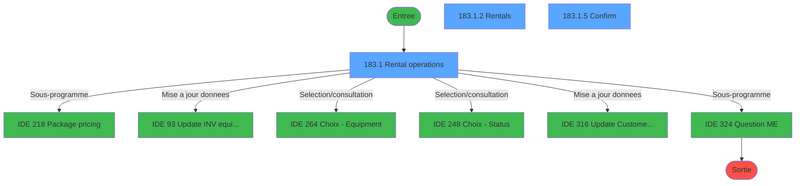
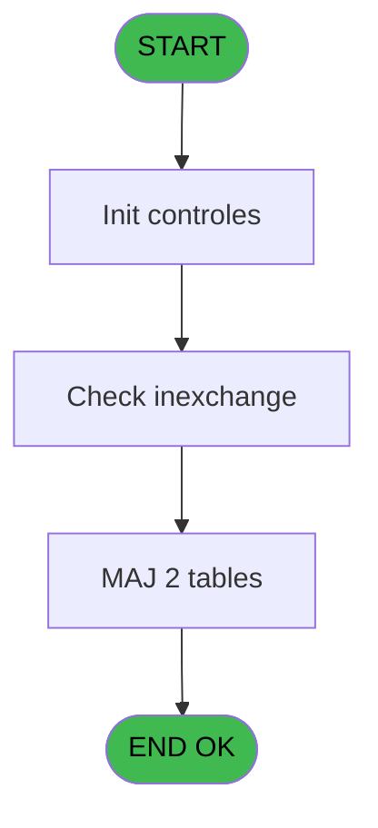
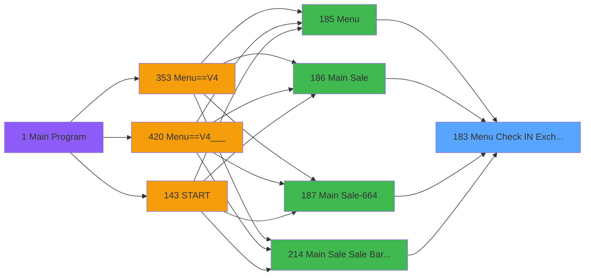
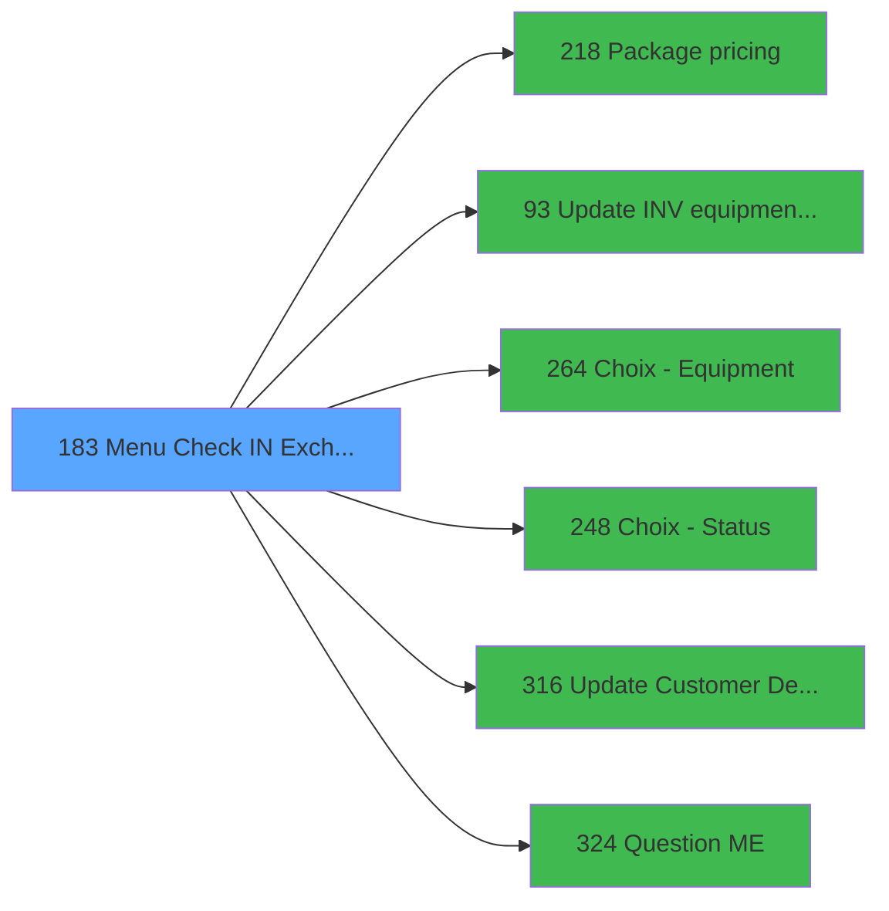

# PVE IDE 183 - Menu Check IN / Exchange

> **Analyse**: Phases 1-4 2026-02-03 18:44 -> 18:44 (18s) | Assemblage 18:44
> **Pipeline**: V7.2 Enrichi
> **Structure**: 4 onglets (Resume | Ecrans | Donnees | Connexions)

<!-- TAB:Resume -->

## 1. FICHE D'IDENTITE

| Attribut | Valeur |
|----------|--------|
| Projet | PVE |
| IDE Position | 183 |
| Nom Programme | Menu Check IN / Exchange |
| Fichier source | `Prg_183.xml` |
| Dossier IDE | Mobile |
| Taches | 8 (3 ecrans visibles) |
| Tables modifiees | 2 |
| Programmes appeles | 6 |

## 2. DESCRIPTION FONCTIONNELLE

**Menu Check IN / Exchange** assure la gestion complete de ce processus, accessible depuis [Main Sale Sale Bar Code (IDE 214)](PVE-IDE-214.md), [Menu (IDE 185)](PVE-IDE-185.md), [Main Sale ===V4 (IDE 0)](PVE-IDE-0.md), [Main Sale (IDE 186)](PVE-IDE-186.md), [Main Sale-664 (IDE 187)](PVE-IDE-187.md), [Menu==V4 (IDE 353)](PVE-IDE-353.md), [Main Sale ===V4 (IDE 354)](PVE-IDE-354.md), [Main Sale ===V4 (IDE 359)](PVE-IDE-359.md), [Main Sale (IDE 363)](PVE-IDE-363.md), [Main Sale-664 (IDE 364)](PVE-IDE-364.md), [Main Sale ===V4 (IDE 409)](PVE-IDE-409.md), [Main Sale ===V4 (IDE 415)](PVE-IDE-415.md), [Main Sale ===V4 Booking ACTUEL (IDE 417)](PVE-IDE-417.md), [Menu==V4___ (IDE 420)](PVE-IDE-420.md), [Menu (IDE 439)](PVE-IDE-439.md), [Main Sale (IDE 440)](PVE-IDE-440.md).

Le flux de traitement s'organise en **2 blocs fonctionnels** :

- **Traitement** (7 taches) : traitements metier divers
- **Creation** (1 tache) : insertion d'enregistrements en base (mouvements, prestations)

**Donnees modifiees** : 2 tables en ecriture (pv_sellers_by_week, vente_par_moyen_paiement).

Detail : phases du traitement

#### Phase 1 : Traitement (7 taches)

- **183** - Check IN / Swap **[[ECRAN]](#ecran-t1)**
- **183.1** - Rental operations **[[ECRAN]](#ecran-t2)**
- **183.1.1** - add rental
- **183.1.2** - Rentals **[[ECRAN]](#ecran-t4)**
- **183.1.3** - Rentals **[[ECRAN]](#ecran-t5)**
- **183.1.4** - Rentals
- **183.1.5** - Confirm **[[ECRAN]](#ecran-t7)**

Delegue a : [    Package pricing (IDE 218)](PVE-IDE-218.md), [Update INV equipment status (IDE 93)](PVE-IDE-93.md), [Update Customer Details (IDE 316)](PVE-IDE-316.md), [Question M&E (IDE 324)](PVE-IDE-324.md)

#### Phase 2 : Creation (1 tache)

- **183.1.6** - create reponse

#### Tables impactees

| Table | Operations | Role metier |
|-------|-----------|-------------|
| pv_sellers_by_week | R/**W**/L (5 usages) |  |
| vente_par_moyen_paiement | **W** (1 usages) | Donnees de ventes |

## 3. BLOCS FONCTIONNELS

### 3.1 Traitement (7 taches)

Traitements internes.

---

#### 183 - Check IN / Swap [[ECRAN]](#ecran-t1)

**Role** : Tache d'orchestration : point d'entree du programme (7 sous-taches). Coordonne l'enchainement des traitements.
**Ecran** : 1988 x 432 DLU (MDI) | [Voir mockup](#ecran-t1)

6 sous-taches directes

| Tache | Nom | Bloc |
|-------|-----|------|
| [183.1](#t2) | Rental operations **[[ECRAN]](#ecran-t2)** | Traitement |
| [183.1.1](#t3) | add rental | Traitement |
| [183.1.2](#t4) | Rentals **[[ECRAN]](#ecran-t4)** | Traitement |
| [183.1.3](#t5) | Rentals **[[ECRAN]](#ecran-t5)** | Traitement |
| [183.1.4](#t6) | Rentals | Traitement |
| [183.1.5](#t7) | Confirm **[[ECRAN]](#ecran-t7)** | Traitement |

**Variables liees** : E (p.i.Check-In/Exchange/Les deux)
**Delegue a** : [    Package pricing (IDE 218)](PVE-IDE-218.md), [Update INV equipment status (IDE 93)](PVE-IDE-93.md), [Update Customer Details (IDE 316)](PVE-IDE-316.md)

---

#### 183.1 - Rental operations [[ECRAN]](#ecran-t2)

**Role** : Traitement : Rental operations.
**Ecran** : 1988 x 432 DLU (Type6) | [Voir mockup](#ecran-t2)
**Variables liees** : K (v.Nb rentals left client)
**Delegue a** : [    Package pricing (IDE 218)](PVE-IDE-218.md), [Update INV equipment status (IDE 93)](PVE-IDE-93.md), [Update Customer Details (IDE 316)](PVE-IDE-316.md)

---

#### 183.1.1 - add rental

**Role** : Traitement : add rental.
**Variables liees** : K (v.Nb rentals left client)
**Delegue a** : [    Package pricing (IDE 218)](PVE-IDE-218.md), [Update INV equipment status (IDE 93)](PVE-IDE-93.md), [Update Customer Details (IDE 316)](PVE-IDE-316.md)

---

#### 183.1.2 - Rentals [[ECRAN]](#ecran-t4)

**Role** : Traitement : Rentals.
**Ecran** : 628 x 197 DLU (Modal) | [Voir mockup](#ecran-t4)
**Variables liees** : K (v.Nb rentals left client)
**Delegue a** : [    Package pricing (IDE 218)](PVE-IDE-218.md), [Update INV equipment status (IDE 93)](PVE-IDE-93.md), [Update Customer Details (IDE 316)](PVE-IDE-316.md)

---

#### 183.1.3 - Rentals [[ECRAN]](#ecran-t5)

**Role** : Traitement : Rentals.
**Ecran** : 628 x 197 DLU (Modal) | [Voir mockup](#ecran-t5)
**Variables liees** : K (v.Nb rentals left client)
**Delegue a** : [    Package pricing (IDE 218)](PVE-IDE-218.md), [Update INV equipment status (IDE 93)](PVE-IDE-93.md), [Update Customer Details (IDE 316)](PVE-IDE-316.md)

---

#### 183.1.4 - Rentals

**Role** : Traitement : Rentals.
**Variables liees** : K (v.Nb rentals left client)
**Delegue a** : [    Package pricing (IDE 218)](PVE-IDE-218.md), [Update INV equipment status (IDE 93)](PVE-IDE-93.md), [Update Customer Details (IDE 316)](PVE-IDE-316.md)

---

#### 183.1.5 - Confirm [[ECRAN]](#ecran-t7)

**Role** : Traitement : Confirm.
**Ecran** : 554 x 157 DLU (MDI) | [Voir mockup](#ecran-t7)
**Delegue a** : [    Package pricing (IDE 218)](PVE-IDE-218.md), [Update INV equipment status (IDE 93)](PVE-IDE-93.md), [Update Customer Details (IDE 316)](PVE-IDE-316.md)

### 3.2 Creation (1 tache)

Insertion de nouveaux enregistrements en base.

---

#### 183.1.6 - create reponse

**Role** : Traitement : create reponse.

## 5. REGLES METIER

*(Aucune regle metier identifiee)*

## 6. CONTEXTE

- **Appele par**: [Main Sale Sale Bar Code (IDE 214)](PVE-IDE-214.md), [Menu (IDE 185)](PVE-IDE-185.md), [Main Sale ===V4 (IDE 0)](PVE-IDE-0.md), [Main Sale (IDE 186)](PVE-IDE-186.md), [Main Sale-664 (IDE 187)](PVE-IDE-187.md), [Menu==V4 (IDE 353)](PVE-IDE-353.md), [Main Sale ===V4 (IDE 354)](PVE-IDE-354.md), [Main Sale ===V4 (IDE 359)](PVE-IDE-359.md), [Main Sale (IDE 363)](PVE-IDE-363.md), [Main Sale-664 (IDE 364)](PVE-IDE-364.md), [Main Sale ===V4 (IDE 409)](PVE-IDE-409.md), [Main Sale ===V4 (IDE 415)](PVE-IDE-415.md), [Main Sale ===V4 Booking ACTUEL (IDE 417)](PVE-IDE-417.md), [Menu==V4___ (IDE 420)](PVE-IDE-420.md), [Menu (IDE 439)](PVE-IDE-439.md), [Main Sale (IDE 440)](PVE-IDE-440.md)
- **Appelle**: 6 programmes | **Tables**: 13 (W:2 R:3 L:11) | **Taches**: 8 | **Expressions**: 8

<!-- TAB:Ecrans -->

## 8. ECRANS

### 8.1 Forms visibles (3 / 8)

| # | Position | Tache | Nom | Type | Largeur | Hauteur | Bloc |
|---|----------|-------|-----|------|---------|---------|------|
| 1 | 183.1 | 183.1 | Rental operations | Type6 | 1988 | 432 | Traitement |
| 2 | 183.1.2 | 183.1.2 | Rentals | Modal | 628 | 197 | Traitement |
| 3 | 183.1.5 | 183.1.5 | Confirm | MDI | 554 | 157 | Traitement |

### 8.2 Mockups Ecrans

---

#### 183.1 - Rental operations
**Tache** : [183.1](#t2) | **Type** : Type6 | **Dimensions** : 1988 x 432 DLU
**Bloc** : Traitement | **Titre IDE** : Rental operations

<!-- FORM-DATA:
{
    "width":  1988,
    "vFactor":  8,
    "type":  "Type6",
    "hFactor":  8,
    "controls":  [
                     {
                         "x":  252,
                         "type":  "label",
                         "var":  "",
                         "y":  42,
                         "w":  158,
                         "fmt":  "",
                         "name":  "",
                         "h":  14,
                         "color":  "143",
                         "text":  "IN",
                         "parent":  null
                     },
                     {
                         "x":  1516,
                         "type":  "label",
                         "var":  "",
                         "y":  42,
                         "w":  158,
                         "fmt":  "",
                         "name":  "",
                         "h":  14,
                         "color":  "181",
                         "text":  "OUT",
                         "parent":  null
                     },
                     {
                         "x":  598,
                         "type":  "label",
                         "var":  "",
                         "y":  63,
                         "w":  406,
                         "fmt":  "",
                         "name":  "",
                         "h":  12,
                         "color":  "181",
                         "text":  "Equipment to be checked \"IN\"",
                         "parent":  3
                     },
                     {
                         "x":  1404,
                         "type":  "label",
                         "var":  "",
                         "y":  270,
                         "w":  464,
                         "fmt":  "",
                         "name":  "",
                         "h":  66,
                         "color":  "189",
                         "text":  "Scan the equipment to be checked in.\r\n\r\nThen select the RETURN action or scan the equipment to be checked out if your customer is swaping equipments.",
                         "parent":  6
                     },
                     {
                         "x":  0,
                         "type":  "label",
                         "var":  "",
                         "y":  0,
                         "w":  1980,
                         "fmt":  "",
                         "name":  "",
                         "h":  42,
                         "color":  "189",
                         "text":  "",
                         "parent":  null
                     },
                     {
                         "x":  669,
                         "type":  "label",
                         "var":  "",
                         "y":  16,
                         "w":  650,
                         "fmt":  "",
                         "name":  "",
                         "h":  14,
                         "color":  "188",
                         "text":  "EQUIPMENT CHECK IN   \u0026   EXCHANGE",
                         "parent":  6
                     },
                     {
                         "x":  54,
                         "type":  "label",
                         "var":  "",
                         "y":  56,
                         "w":  530,
                         "fmt":  "",
                         "name":  "",
                         "h":  96,
                         "color":  "186",
                         "text":  "",
                         "parent":  null
                     },
                     {
                         "x":  74,
                         "type":  "label",
                         "var":  "",
                         "y":  90,
                         "w":  154,
                         "fmt":  "",
                         "name":  "",
                         "h":  12,
                         "color":  "181",
                         "text":  "Equipment :",
                         "parent":  10
                     },
                     {
                         "x":  74,
                         "type":  "label",
                         "var":  "",
                         "y":  109,
                         "w":  162,
                         "fmt":  "",
                         "name":  "",
                         "h":  10,
                         "color":  "181",
                         "text":  "Classification :",
                         "parent":  10
                     },
                     {
                         "x":  1338,
                         "type":  "label",
                         "var":  "",
                         "y":  56,
                         "w":  530,
                         "fmt":  "",
                         "name":  "",
                         "h":  96,
                         "color":  "186",
                         "text":  "",
                         "parent":  null
                     },
                     {
                         "x":  1358,
                         "type":  "label",
                         "var":  "",
                         "y":  90,
                         "w":  150,
                         "fmt":  "",
                         "name":  "",
                         "h":  12,
                         "color":  "181",
                         "text":  "Equipment :",
                         "parent":  17
                     },
                     {
                         "x":  1358,
                         "type":  "label",
                         "var":  "",
                         "y":  109,
                         "w":  166,
                         "fmt":  "",
                         "name":  "",
                         "h":  10,
                         "color":  "181",
                         "text":  "Classification :",
                         "parent":  17
                     },
                     {
                         "x":  850,
                         "type":  "label",
                         "var":  "",
                         "y":  89,
                         "w":  220,
                         "fmt":  "",
                         "name":  "",
                         "h":  31,
                         "color":  "186",
                         "text":  "",
                         "parent":  null
                     },
                     {
                         "x":  1010,
                         "type":  "label",
                         "var":  "",
                         "y":  95,
                         "w":  52,
                         "fmt":  "",
                         "name":  "",
                         "h":  23,
                         "color":  "186",
                         "text":  "è",
                         "parent":  23
                     },
                     {
                         "x":  850,
                         "type":  "label",
                         "var":  "",
                         "y":  121,
                         "w":  220,
                         "fmt":  "",
                         "name":  "",
                         "h":  31,
                         "color":  "186",
                         "text":  "",
                         "parent":  null
                     },
                     {
                         "x":  858,
                         "type":  "label",
                         "var":  "",
                         "y":  128,
                         "w":  52,
                         "fmt":  "",
                         "name":  "",
                         "h":  22,
                         "color":  "186",
                         "text":  "ç",
                         "parent":  26
                     },
                     {
                         "x":  74,
                         "type":  "label",
                         "var":  "",
                         "y":  163,
                         "w":  258,
                         "fmt":  "",
                         "name":  "",
                         "h":  12,
                         "color":  "181",
                         "text":  "Status of equipment",
                         "parent":  null
                     },
                     {
                         "x":  54,
                         "type":  "label",
                         "var":  "",
                         "y":  182,
                         "w":  1280,
                         "fmt":  "",
                         "name":  "",
                         "h":  215,
                         "color":  "182",
                         "text":  "",
                         "parent":  null
                     },
                     {
                         "x":  198,
                         "type":  "label",
                         "var":  "",
                         "y":  187,
                         "w":  106,
                         "fmt":  "",
                         "name":  "",
                         "h":  12,
                         "color":  "186",
                         "text":  "Renter",
                         "parent":  32
                     },
                     {
                         "x":  0,
                         "type":  "label",
                         "var":  "",
                         "y":  396,
                         "w":  1980,
                         "fmt":  "",
                         "name":  "",
                         "h":  33,
                         "color":  "189",
                         "text":  "",
                         "parent":  null
                     },
                     {
                         "x":  150,
                         "type":  "edit",
                         "var":  "",
                         "y":  61,
                         "w":  258,
                         "fmt":  "U10",
                         "name":  "v.serial IN",
                         "h":  27,
                         "color":  "110",
                         "text":  "",
                         "parent":  10
                     },
                     {
                         "x":  414,
                         "type":  "button",
                         "var":  "",
                         "y":  61,
                         "w":  74,
                         "fmt":  "",
                         "name":  "Choix equipement",
                         "h":  29,
                         "color":  "",
                         "text":  "",
                         "parent":  10
                     },
                     {
                         "x":  1474,
                         "type":  "edit",
                         "var":  "",
                         "y":  61,
                         "w":  258,
                         "fmt":  "U10",
                         "name":  "v.serial OUT",
                         "h":  27,
                         "color":  "110",
                         "text":  "",
                         "parent":  17
                     },
                     {
                         "x":  250,
                         "type":  "edit",
                         "var":  "",
                         "y":  90,
                         "w":  328,
                         "fmt":  "30",
                         "name":  "",
                         "h":  12,
                         "color":  "181",
                         "text":  "",
                         "parent":  10
                     },
                     {
                         "x":  250,
                         "type":  "edit",
                         "var":  "",
                         "y":  109,
                         "w":  328,
                         "fmt":  "",
                         "name":  "",
                         "h":  10,
                         "color":  "181",
                         "text":  "",
                         "parent":  10
                     },
                     {
                         "x":  1529,
                         "type":  "edit",
                         "var":  "",
                         "y":  90,
                         "w":  328,
                         "fmt":  "30",
                         "name":  "",
                         "h":  12,
                         "color":  "181",
                         "text":  "",
                         "parent":  17
                     },
                     {
                         "x":  1529,
                         "type":  "edit",
                         "var":  "",
                         "y":  109,
                         "w":  328,
                         "fmt":  "",
                         "name":  "",
                         "h":  10,
                         "color":  "181",
                         "text":  "",
                         "parent":  17
                     },
                     {
                         "x":  1886,
                         "type":  "image",
                         "var":  "",
                         "y":  7,
                         "w":  96,
                         "fmt":  "",
                         "name":  "",
                         "h":  34,
                         "color":  "",
                         "text":  "",
                         "parent":  6
                     },
                     {
                         "x":  584,
                         "type":  "edit",
                         "var":  "",
                         "y":  59,
                         "w":  752,
                         "fmt":  "",
                         "name":  "",
                         "h":  30,
                         "color":  "191",
                         "text":  "",
                         "parent":  null
                     },
                     {
                         "x":  850,
                         "type":  "button",
                         "var":  "",
                         "y":  94,
                         "w":  150,
                         "fmt":  "\u0026EXCHANGE",
                         "name":  "SWAP",
                         "h":  24,
                         "color":  "",
                         "text":  "",
                         "parent":  23
                     },
                     {
                         "x":  917,
                         "type":  "button",
                         "var":  "",
                         "y":  126,
                         "w":  150,
                         "fmt":  "\u0026RETURN",
                         "name":  "RETURN",
                         "h":  24,
                         "color":  "",
                         "text":  "",
                         "parent":  26
                     },
                     {
                         "x":  430,
                         "type":  "button",
                         "var":  "",
                         "y":  155,
                         "w":  154,
                         "fmt":  "Status...",
                         "name":  "",
                         "h":  28,
                         "color":  "",
                         "text":  "",
                         "parent":  null
                     },
                     {
                         "x":  771,
                         "type":  "edit",
                         "var":  "",
                         "y":  161,
                         "w":  378,
                         "fmt":  "30",
                         "name":  "",
                         "h":  15,
                         "color":  "189",
                         "text":  "",
                         "parent":  null
                     },
                     {
                         "x":  310,
                         "type":  "edit",
                         "var":  "",
                         "y":  187,
                         "w":  804,
                         "fmt":  "50",
                         "name":  "v.Renter",
                         "h":  12,
                         "color":  "189",
                         "text":  "",
                         "parent":  32
                     },
                     {
                         "x":  1828,
                         "type":  "button",
                         "var":  "",
                         "y":  401,
                         "w":  154,
                         "fmt":  "\u0026Exit",
                         "name":  "",
                         "h":  28,
                         "color":  "",
                         "text":  "",
                         "parent":  36
                     },
                     {
                         "x":  1462,
                         "type":  "edit",
                         "var":  "",
                         "y":  14,
                         "w":  406,
                         "fmt":  "30",
                         "name":  "",
                         "h":  18,
                         "color":  "174",
                         "text":  "",
                         "parent":  6
                     },
                     {
                         "x":  60,
                         "type":  "subform",
                         "var":  "",
                         "y":  202,
                         "w":  1265,
                         "fmt":  "",
                         "name":  "Rentals",
                         "h":  192,
                         "color":  "",
                         "text":  "",
                         "parent":  32
                     }
                 ],
    "taskId":  "183.1",
    "height":  432
}
-->

<strong>Champs : 10 champs</strong>

| Pos (x,y) | Nom | Variable | Type |
|-----------|-----|----------|------|
| 150,61 | v.serial IN | - | edit |
| 1474,61 | v.serial OUT | - | edit |
| 250,90 | 30 | - | edit |
| 250,109 | (sans nom) | - | edit |
| 1529,90 | 30 | - | edit |
| 1529,109 | (sans nom) | - | edit |
| 584,59 | (sans nom) | - | edit |
| 771,161 | 30 | - | edit |
| 310,187 | v.Renter | - | edit |
| 1462,14 | 30 | - | edit |

<strong>Boutons : 5 boutons</strong>

| Bouton | Pos (x,y) | Action |
|--------|-----------|--------|
| Choix equipement | 414,61 | Appel [Choix - Equipment (IDE 264)](PVE-IDE-264.md) |
| EXCHANGE | 850,94 | Modifie l'element |
| RETURN | 917,126 | Bouton fonctionnel |
| Status... | 430,155 | Appel [Update INV equipment status (IDE 93)](PVE-IDE-93.md) |
| Exit | 1828,401 | Quitte le programme |

---

#### 183.1.2 - Rentals
**Tache** : [183.1.2](#t4) | **Type** : Modal | **Dimensions** : 628 x 197 DLU
**Bloc** : Traitement | **Titre IDE** : Rentals

<!-- FORM-DATA:
{
    "width":  628,
    "vFactor":  8,
    "type":  "Modal",
    "hFactor":  4,
    "controls":  [
                     {
                         "x":  62,
                         "type":  "table",
                         "var":  "",
                         "name":  "",
                         "titleH":  12,
                         "color":  "110",
                         "w":  459,
                         "y":  3,
                         "fmt":  "",
                         "parent":  null,
                         "text":  "",
                         "rowH":  24,
                         "h":  182,
                         "cols":  [
                                      {
                                          "title":  "Product",
                                          "layer":  1,
                                          "w":  63
                                      },
                                      {
                                          "title":  "Classification",
                                          "layer":  2,
                                          "w":  65
                                      },
                                      {
                                          "title":  "Days",
                                          "layer":  3,
                                          "w":  26
                                      },
                                      {
                                          "title":  "Code",
                                          "layer":  4,
                                          "w":  78
                                      },
                                      {
                                          "title":  "Date out",
                                          "layer":  5,
                                          "w":  53
                                      },
                                      {
                                          "title":  "Date due",
                                          "layer":  6,
                                          "w":  54
                                      },
                                      {
                                          "title":  "Date in",
                                          "layer":  7,
                                          "w":  55
                                      },
                                      {
                                          "title":  "Status",
                                          "layer":  8,
                                          "w":  60
                                      }
                                  ],
                         "rows":  8
                     },
                     {
                         "x":  350,
                         "type":  "edit",
                         "var":  "",
                         "y":  16,
                         "w":  50,
                         "fmt":  "##/##/####Z",
                         "name":  "",
                         "h":  22,
                         "color":  "110",
                         "text":  "",
                         "parent":  1
                     },
                     {
                         "x":  66,
                         "type":  "edit",
                         "var":  "",
                         "y":  16,
                         "w":  57,
                         "fmt":  "",
                         "name":  "",
                         "h":  22,
                         "color":  "110",
                         "text":  "",
                         "parent":  1
                     },
                     {
                         "x":  129,
                         "type":  "edit",
                         "var":  "",
                         "y":  16,
                         "w":  60,
                         "fmt":  "",
                         "name":  "",
                         "h":  22,
                         "color":  "110",
                         "text":  "",
                         "parent":  1
                     },
                     {
                         "x":  194,
                         "type":  "edit",
                         "var":  "",
                         "y":  16,
                         "w":  21,
                         "fmt":  "3Z",
                         "name":  "",
                         "h":  22,
                         "color":  "110",
                         "text":  "",
                         "parent":  1
                     },
                     {
                         "x":  221,
                         "type":  "edit",
                         "var":  "",
                         "y":  16,
                         "w":  71,
                         "fmt":  "U15",
                         "name":  "",
                         "h":  22,
                         "color":  "110",
                         "text":  "",
                         "parent":  1
                     },
                     {
                         "x":  297,
                         "type":  "edit",
                         "var":  "",
                         "y":  16,
                         "w":  49,
                         "fmt":  "##/##/####Z",
                         "name":  "",
                         "h":  22,
                         "color":  "110",
                         "text":  "",
                         "parent":  1
                     },
                     {
                         "x":  460,
                         "type":  "edit",
                         "var":  "",
                         "y":  16,
                         "w":  51,
                         "fmt":  "",
                         "name":  "",
                         "h":  22,
                         "color":  "110",
                         "text":  "",
                         "parent":  1
                     },
                     {
                         "x":  520,
                         "type":  "button",
                         "var":  "",
                         "y":  3,
                         "w":  39,
                         "fmt":  "ñ",
                         "name":  "",
                         "h":  91,
                         "color":  "",
                         "text":  "",
                         "parent":  null
                     },
                     {
                         "x":  520,
                         "type":  "button",
                         "var":  "",
                         "y":  94,
                         "w":  39,
                         "fmt":  "ò",
                         "name":  "",
                         "h":  91,
                         "color":  "",
                         "text":  "",
                         "parent":  null
                     },
                     {
                         "x":  405,
                         "type":  "edit",
                         "var":  "",
                         "y":  16,
                         "w":  50,
                         "fmt":  "10",
                         "name":  "",
                         "h":  22,
                         "color":  "110",
                         "text":  "",
                         "parent":  1
                     }
                 ],
    "taskId":  "183.1.2",
    "height":  197
}
-->

<strong>Champs : 8 champs</strong>

| Pos (x,y) | Nom | Variable | Type |
|-----------|-----|----------|------|
| 350,16 | ##/##/####Z | - | edit |
| 66,16 | (sans nom) | - | edit |
| 129,16 | (sans nom) | - | edit |
| 194,16 | 3Z | - | edit |
| 221,16 | U15 | - | edit |
| 297,16 | ##/##/####Z | - | edit |
| 460,16 | (sans nom) | - | edit |
| 405,16 | 10 | - | edit |

<strong>Boutons : 2 boutons</strong>

| Bouton | Pos (x,y) | Action |
|--------|-----------|--------|
| ñ | 520,3 | Bouton fonctionnel |
| ò | 520,94 | Bouton fonctionnel |

---

#### 183.1.5 - Confirm
**Tache** : [183.1.5](#t7) | **Type** : MDI | **Dimensions** : 554 x 157 DLU
**Bloc** : Traitement | **Titre IDE** : Confirm

<!-- FORM-DATA:
{
    "width":  554,
    "vFactor":  8,
    "type":  "MDI",
    "hFactor":  8,
    "controls":  [
                     {
                         "x":  26,
                         "type":  "label",
                         "var":  "",
                         "y":  40,
                         "w":  501,
                         "fmt":  "",
                         "name":  "",
                         "h":  18,
                         "color":  "183",
                         "text":  "Please confirm what you intend to do :",
                         "parent":  null
                     },
                     {
                         "x":  3,
                         "type":  "label",
                         "var":  "",
                         "y":  0,
                         "w":  546,
                         "fmt":  "",
                         "name":  "",
                         "h":  36,
                         "color":  "182",
                         "text":  "",
                         "parent":  null
                     },
                     {
                         "x":  199,
                         "type":  "button",
                         "var":  "",
                         "y":  130,
                         "w":  154,
                         "fmt":  "\u0026Ok",
                         "name":  "",
                         "h":  24,
                         "color":  "",
                         "text":  "",
                         "parent":  null
                     },
                     {
                         "x":  5,
                         "type":  "image",
                         "var":  "",
                         "y":  5,
                         "w":  76,
                         "fmt":  "",
                         "name":  "",
                         "h":  30,
                         "color":  "",
                         "text":  "",
                         "parent":  2
                     },
                     {
                         "x":  26,
                         "type":  "radio",
                         "var":  "",
                         "y":  60,
                         "w":  501,
                         "fmt":  "",
                         "name":  "V.action",
                         "h":  53,
                         "color":  "183",
                         "text":  "E,W,C",
                         "parent":  null
                     }
                 ],
    "taskId":  "183.1.5",
    "height":  157
}
-->

<strong>Boutons : 1 boutons</strong>

| Bouton | Pos (x,y) | Action |
|--------|-----------|--------|
| Ok | 199,130 | Valide la saisie et enregistre |

## 9. NAVIGATION

### 9.1 Enchainement des ecrans

**Detail par enchainement :**

| Depuis | Action | Vers | Retour |
|--------|--------|------|--------|
| Rental operations | Sous-programme | [    Package pricing (IDE 218)](PVE-IDE-218.md) | Retour ecran |
| Rental operations | Mise a jour donnees | [Update INV equipment status (IDE 93)](PVE-IDE-93.md) | Retour ecran |
| Rental operations | Selection/consultation | [Choix - Equipment (IDE 264)](PVE-IDE-264.md) | Retour ecran |
| Rental operations | Selection/consultation | [Choix - Status (IDE 248)](PVE-IDE-248.md) | Retour ecran |
| Rental operations | Mise a jour donnees | [Update Customer Details (IDE 316)](PVE-IDE-316.md) | Retour ecran |
| Rental operations | Sous-programme | [Question M&E (IDE 324)](PVE-IDE-324.md) | Retour ecran |

### 9.3 Structure hierarchique (8 taches)

| Position | Tache | Type | Dimensions | Bloc |
|----------|-------|------|------------|------|
| **183.1** | [**Check IN / Swap** (183)](#t1) [mockup](#ecran-t1) | MDI | 1988x432 | Traitement |
| 183.1.1 | [Rental operations (183.1)](#t2) [mockup](#ecran-t2) | Type6 | 1988x432 | |
| 183.1.2 | [add rental (183.1.1)](#t3) | MDI | - | |
| 183.1.3 | [Rentals (183.1.2)](#t4) [mockup](#ecran-t4) | Modal | 628x197 | |
| 183.1.4 | [Rentals (183.1.3)](#t5) [mockup](#ecran-t5) | Modal | 628x197 | |
| 183.1.5 | [Rentals (183.1.4)](#t6) | Modal | - | |
| 183.1.6 | [Confirm (183.1.5)](#t7) [mockup](#ecran-t7) | MDI | 554x157 | |
| **183.2** | [**create reponse** (183.1.6)](#t8) | - | - | Creation |

### 9.4 Algorigramme

> **Legende**: Vert = START/END OK | Rouge = END KO | Bleu = Decisions
> *Algorigramme auto-genere. Utiliser `/algorigramme` pour une synthese metier detaillee.*

<!-- TAB:Donnees -->

## 10. TABLES

### Tables utilisees (13)

| ID | Nom | Description | Type | R | W | L | Usages |
|----|-----|-------------|------|---|---|---|--------|
| 30 | gm-recherche_____gmr | Index de recherche | DB | R |   |   | 1 |
| 34 | hebergement______heb | Hebergement (chambres) | DB |   |   | L | 1 |
| 36 | client_gm |  | DB |   |   | L | 1 |
| 380 | pv_day_modes |  | DB |   |   | L | 2 |
| 382 | pv_discount_reasons |  | DB | R |   | L | 3 |
| 389 | pv_equipment_inventory |  | DB |   |   | L | 2 |
| 400 | pv_cust_rentals |  | DB |   |   | L | 2 |
| 404 | pv_sellers_by_week |  | DB | R | **W** | L | 5 |
| 413 | pv_tva |  | DB |   |   | L | 1 |
| 419 | realise_articles_caution | Articles et stock | DB |   |   | L | 2 |
| 805 | vente_par_moyen_paiement | Donnees de ventes | DB |   | **W** |   | 1 |
| 806 | sale_channel |  | DB |   |   | L | 1 |
| 807 | plafond_lit |  | DB |   |   | L | 1 |

### Colonnes par table (4 / 4 tables avec colonnes identifiees)

Table 30 - gm-recherche_____gmr (R) - 1 usages

| Lettre | Variable | Acces | Type |
|--------|----------|-------|------|
| A | r.Equipment rental | R | Numeric |
| B | v.serial IN | R | Alpha |
| C | b.Choix equipement | R | Alpha |
| D | v.serial OUT | R | Alpha |
| E | R.cust rental | R | Logical |
| F | v.CourtSejour | R | Logical |
| G | v.Renter | R | Unicode |
| H | R.Equipment | R | Logical |
| I | v.confirm <> classif | R | Logical |
| J | v.cancel requested | R | Logical |
| K | v.operation choice | R | Alpha |
| L | v.new package id | R | Numeric |
| M | v.access serial in | R | Logical |
| N | v.flagDate | R | Numeric |
| O | V.Valider | R | Logical |
| P | L.without invoicing | R | Logical |
| Q | v.Renter previous refresh | R | Unicode |
| R | v.Société previous refresh | R | Unicode |
| S | v.Compte GM Previous refreh | R | Numeric |
| T | v.Facturé au M&E? | R | Logical |
| U | v.% de réduction | R | Numeric |
| V | v.prix du produit | R | Numeric |
| W | CHG_REASON_v.serial IN | R | Numeric |
| X | CHG_PRV_v.serial IN | R | Alpha |
| Y | CHG_REASON_v.serial OUT | R | Numeric |
| Z | CHG_PRV_v.serial OUT | R | Alpha |

Table 382 - pv_discount_reasons (R/L) - 3 usages

*Table utilisee uniquement en Link ou aucune colonne Real identifiee dans le DataView.*

Table 404 - pv_sellers_by_week (R/**W**/L) - 5 usages

*Table utilisee uniquement en Link ou aucune colonne Real identifiee dans le DataView.*

Table 805 - vente_par_moyen_paiement (**W**) - 1 usages

*Table utilisee uniquement en Link ou aucune colonne Real identifiee dans le DataView.*

## 11. VARIABLES

### 11.1 Parametres entrants (5)

Variables recues du programme appelant ([Main Sale Sale Bar Code (IDE 214)](PVE-IDE-214.md)).

| Lettre | Nom | Type | Usage dans |
|--------|-----|------|-----------|
| A | p.serial in | Alpha | 1x parametre entrant |
| B | p.serial out | Alpha | - |
| C | p.Code Fidelisation | Alpha | - |
| D | Pi.Force Exchange | Logical | 1x parametre entrant |
| E | p.i.Check-In/Exchange/Les deux | Alpha | - |

### 11.2 Variables de session (16)

Variables persistantes pendant toute la session.

| Lettre | Nom | Type | Usage dans |
|--------|-----|------|-----------|
| F | v.no exit | Logical | 1x session |
| G | v. exit required | Logical | - |
| H | v.Renter Previous | Unicode | - |
| I | v.Société Previous | Unicode | 1x session |
| J | v.Compte GM Previous | Numeric | 1x session |
| K | v.Nb rentals left client | Numeric | [183.1.2](#t4), [183.1.3](#t5), [183.1.4](#t6) |
| L | v.Sortie immédiate exchange | Logical | - |
| M | v.Date entrée prog | Date | - |
| N | v.Heure entrée prog | Time | - |
| O | V.Valider | Logical | - |
| Q | v.Renter previous refresh | Unicode | - |
| R | v.Société previous refresh | Unicode | - |
| S | v.Compte GM Previous refreh | Numeric | - |
| T | v.Facturé au M&E? | Logical | - |
| U | v.% de réduction | Numeric | - |
| V | v.prix du produit | Numeric | - |

### 11.3 Autres (5)

Variables diverses.

| Lettre | Nom | Type | Usage dans |
|--------|-----|------|-----------|
| P | L.without invoicing | Logical | - |
| W | CHG_REASON_v.serial IN | Numeric | - |
| X | CHG_PRV_v.serial IN | Alpha | - |
| Y | CHG_REASON_v.serial OUT | Numeric | - |
| Z | CHG_PRV_v.serial OUT | Alpha | - |

Toutes les 26 variables (liste complete)

| Cat | Lettre | Nom Variable | Type |
|-----|--------|--------------|------|
| P0 | **A** | p.serial in | Alpha |
| P0 | **B** | p.serial out | Alpha |
| P0 | **C** | p.Code Fidelisation | Alpha |
| P0 | **D** | Pi.Force Exchange | Logical |
| P0 | **E** | p.i.Check-In/Exchange/Les deux | Alpha |
| V. | **F** | v.no exit | Logical |
| V. | **G** | v. exit required | Logical |
| V. | **H** | v.Renter Previous | Unicode |
| V. | **I** | v.Société Previous | Unicode |
| V. | **J** | v.Compte GM Previous | Numeric |
| V. | **K** | v.Nb rentals left client | Numeric |
| V. | **L** | v.Sortie immédiate exchange | Logical |
| V. | **M** | v.Date entrée prog | Date |
| V. | **N** | v.Heure entrée prog | Time |
| V. | **O** | V.Valider | Logical |
| V. | **Q** | v.Renter previous refresh | Unicode |
| V. | **R** | v.Société previous refresh | Unicode |
| V. | **S** | v.Compte GM Previous refreh | Numeric |
| V. | **T** | v.Facturé au M&E? | Logical |
| V. | **U** | v.% de réduction | Numeric |
| V. | **V** | v.prix du produit | Numeric |
| Autre | **P** | L.without invoicing | Logical |
| Autre | **W** | CHG_REASON_v.serial IN | Numeric |
| Autre | **X** | CHG_PRV_v.serial IN | Alpha |
| Autre | **Y** | CHG_REASON_v.serial OUT | Numeric |
| Autre | **Z** | CHG_PRV_v.serial OUT | Alpha |

## 12. EXPRESSIONS

**8 / 8 expressions decodees (100%)**

### 12.1 Repartition par type

| Type | Expressions | Regles |
|------|-------------|--------|
| CONSTANTE | 1 | 0 |
| DATE | 1 | 0 |
| OTHER | 2 | 0 |
| CAST_LOGIQUE | 1 | 0 |
| NEGATION | 2 | 0 |
| CONDITION | 1 | 0 |

### 12.2 Expressions cles par type

#### CONSTANTE (1 expressions)

| Type | IDE | Expression | Regle |
|------|-----|------------|-------|
| CONSTANTE | 8 | `'Sale'` | - |

#### DATE (1 expressions)

| Type | IDE | Expression | Regle |
|------|-----|------------|-------|
| DATE | 6 | `Date()` | - |

#### OTHER (2 expressions)

| Type | IDE | Expression | Regle |
|------|-----|------------|-------|
| OTHER | 7 | `Time()` | - |
| OTHER | 1 | `p.serial in [A]` | - |

#### CAST_LOGIQUE (1 expressions)

| Type | IDE | Expression | Regle |
|------|-----|------------|-------|
| CAST_LOGIQUE | 2 | `'FALSE'LOG` | - |

#### NEGATION (2 expressions)

| Type | IDE | Expression | Regle |
|------|-----|------------|-------|
| NEGATION | 4 | `NOT (Pi.Force Exchange [D])` | - |
| NEGATION | 3 | `NOT (v.no exit [F])` | - |

#### CONDITION (1 expressions)

| Type | IDE | Expression | Regle |
|------|-----|------------|-------|
| CONDITION | 5 | `v.Société Previous [I]<>0 AND (v.Compte GM Previous [J]=0 OR v.Nb rentals left client [K])` | - |

<!-- TAB:Connexions -->

## 13. GRAPHE D'APPELS

### 13.1 Chaine depuis Main (Callers)

Main -> ... -> [Main Sale Sale Bar Code (IDE 214)](PVE-IDE-214.md) -> **Menu Check IN / Exchange (IDE 183)**

Main -> ... -> [Menu (IDE 185)](PVE-IDE-185.md) -> **Menu Check IN / Exchange (IDE 183)**

Main -> ... -> [Main Sale ===V4 (IDE 0)](PVE-IDE-0.md) -> **Menu Check IN / Exchange (IDE 183)**

Main -> ... -> [Main Sale (IDE 186)](PVE-IDE-186.md) -> **Menu Check IN / Exchange (IDE 183)**

Main -> ... -> [Main Sale-664 (IDE 187)](PVE-IDE-187.md) -> **Menu Check IN / Exchange (IDE 183)**

Main -> ... -> [Menu==V4 (IDE 353)](PVE-IDE-353.md) -> **Menu Check IN / Exchange (IDE 183)**

Main -> ... -> [Main Sale ===V4 (IDE 354)](PVE-IDE-354.md) -> **Menu Check IN / Exchange (IDE 183)**

Main -> ... -> [Main Sale ===V4 (IDE 359)](PVE-IDE-359.md) -> **Menu Check IN / Exchange (IDE 183)**

Main -> ... -> [Main Sale (IDE 363)](PVE-IDE-363.md) -> **Menu Check IN / Exchange (IDE 183)**

Main -> ... -> [Main Sale-664 (IDE 364)](PVE-IDE-364.md) -> **Menu Check IN / Exchange (IDE 183)**

Main -> ... -> [Main Sale ===V4 (IDE 409)](PVE-IDE-409.md) -> **Menu Check IN / Exchange (IDE 183)**

Main -> ... -> [Main Sale ===V4 (IDE 415)](PVE-IDE-415.md) -> **Menu Check IN / Exchange (IDE 183)**

Main -> ... -> [Main Sale ===V4 Booking ACTUEL (IDE 417)](PVE-IDE-417.md) -> **Menu Check IN / Exchange (IDE 183)**

Main -> ... -> [Menu==V4___ (IDE 420)](PVE-IDE-420.md) -> **Menu Check IN / Exchange (IDE 183)**

Main -> ... -> [Menu (IDE 439)](PVE-IDE-439.md) -> **Menu Check IN / Exchange (IDE 183)**

Main -> ... -> [Main Sale (IDE 440)](PVE-IDE-440.md) -> **Menu Check IN / Exchange (IDE 183)**

### 13.2 Callers

| IDE | Nom Programme | Nb Appels |
|-----|---------------|-----------|
| [214](PVE-IDE-214.md) | Main Sale Sale Bar Code | 4 |
| [185](PVE-IDE-185.md) | Menu | 2 |
| [0](PVE-IDE-0.md) | Main Sale ===V4 | 1 |
| [186](PVE-IDE-186.md) | Main Sale | 1 |
| [187](PVE-IDE-187.md) | Main Sale-664 | 1 |
| [353](PVE-IDE-353.md) | Menu==V4 | 1 |
| [354](PVE-IDE-354.md) | Main Sale ===V4 | 1 |
| [359](PVE-IDE-359.md) | Main Sale ===V4 | 1 |
| [363](PVE-IDE-363.md) | Main Sale | 1 |
| [364](PVE-IDE-364.md) | Main Sale-664 | 1 |
| [409](PVE-IDE-409.md) | Main Sale ===V4 | 1 |
| [415](PVE-IDE-415.md) | Main Sale ===V4 | 1 |
| [417](PVE-IDE-417.md) | Main Sale ===V4 Booking ACTUEL | 1 |
| [420](PVE-IDE-420.md) | Menu==V4___ | 1 |
| [439](PVE-IDE-439.md) | Menu | 1 |
| [440](PVE-IDE-440.md) | Main Sale | 1 |

### 13.3 Callees (programmes appeles)

### 13.4 Detail Callees avec contexte

| IDE | Nom Programme | Appels | Contexte |
|-----|---------------|--------|----------|
| [218](PVE-IDE-218.md) |     Package pricing | 6 | Sous-programme |
| [93](PVE-IDE-93.md) | Update INV equipment status | 3 | Mise a jour donnees |
| [264](PVE-IDE-264.md) | Choix - Equipment | 2 | Selection/consultation |
| [248](PVE-IDE-248.md) | Choix - Status | 1 | Selection/consultation |
| [316](PVE-IDE-316.md) | Update Customer Details | 1 | Mise a jour donnees |
| [324](PVE-IDE-324.md) | Question M&E | 1 | Sous-programme |

## 14. RECOMMANDATIONS MIGRATION

### 14.1 Profil du programme

| Metrique | Valeur | Impact migration |
|----------|--------|-----------------|
| Lignes de logique | 591 | Programme volumineux |
| Expressions | 8 | Peu de logique |
| Tables WRITE | 2 | Impact faible |
| Sous-programmes | 6 | Dependances moderees |
| Ecrans visibles | 3 | Quelques ecrans |
| Code desactive | 0.3% (2 / 591) | Code sain |
| Regles metier | 0 | Pas de regle identifiee |

### 14.2 Plan de migration par bloc

#### Traitement (7 taches: 5 ecrans, 2 traitements)

- **Strategie** : Orchestrateur avec 5 ecrans (Razor/React) et 2 traitements backend (services).
- Les ecrans deviennent des composants UI, les traitements invisibles deviennent des services injectables.
- 6 sous-programme(s) a migrer ou a reutiliser depuis les services existants.
- Decomposer les taches en services unitaires testables.

#### Creation (1 tache: 0 ecran, 1 traitement)

- **Strategie** : Repository pattern avec Entity Framework Core.
- Insertion via `IRepository<T>.CreateAsync()`

### 14.3 Dependances critiques

| Dependance | Type | Appels | Impact |
|------------|------|--------|--------|
| pv_sellers_by_week | Table WRITE (Database) | 1x | Schema + repository |
| vente_par_moyen_paiement | Table WRITE (Database) | 1x | Schema + repository |
| [    Package pricing (IDE 218)](PVE-IDE-218.md) | Sous-programme | 6x | **CRITIQUE** - Sous-programme |
| [Update INV equipment status (IDE 93)](PVE-IDE-93.md) | Sous-programme | 3x | **CRITIQUE** - Mise a jour donnees |
| [Choix - Equipment (IDE 264)](PVE-IDE-264.md) | Sous-programme | 2x | Haute - Selection/consultation |
| [Question M&E (IDE 324)](PVE-IDE-324.md) | Sous-programme | 1x | Normale - Sous-programme |
| [Update Customer Details (IDE 316)](PVE-IDE-316.md) | Sous-programme | 1x | Normale - Mise a jour donnees |
| [Choix - Status (IDE 248)](PVE-IDE-248.md) | Sous-programme | 1x | Normale - Selection/consultation |

---
*Spec DETAILED generee par Pipeline V7.2 - 2026-02-03 18:44*
