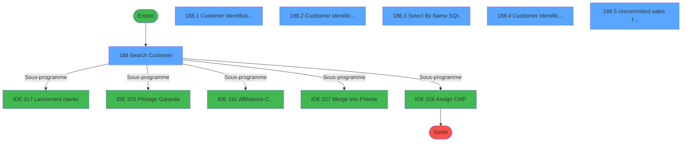
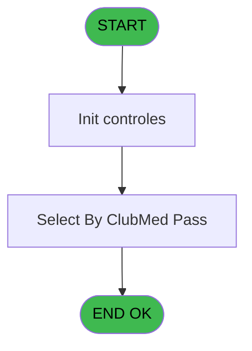
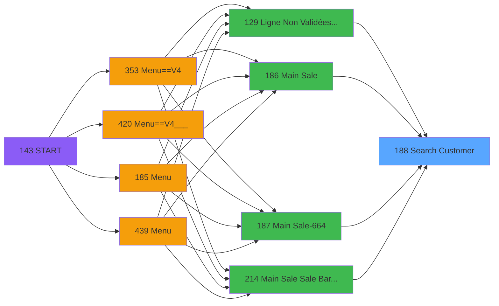
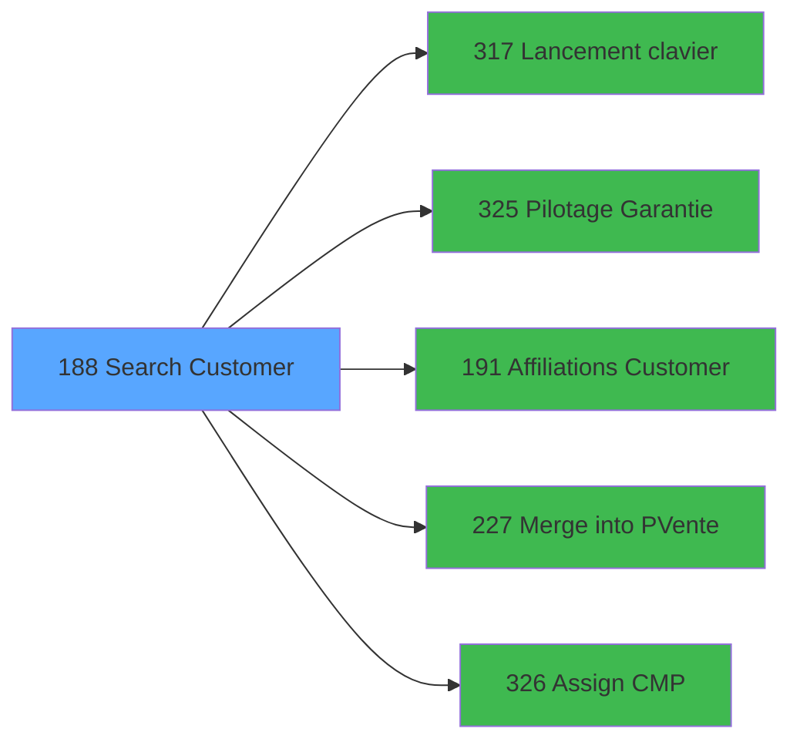

# PVE IDE 188 - Search Customer

> **Analyse**: Phases 1-4 2026-02-03 18:46 -> 18:46 (18s) | Assemblage 18:47
> **Pipeline**: V7.2 Enrichi
> **Structure**: 4 onglets (Resume | Ecrans | Donnees | Connexions)

<!-- TAB:Resume -->

## 1. FICHE D'IDENTITE

| Attribut | Valeur |
|----------|--------|
| Projet | PVE |
| IDE Position | 188 |
| Nom Programme | Search Customer |
| Fichier source | `Prg_188.xml` |
| Dossier IDE | Mobile |
| Taches | 8 (6 ecrans visibles) |
| Tables modifiees | 0 |
| Programmes appeles | 5 |

## 2. DESCRIPTION FONCTIONNELLE

**Search Customer** assure la gestion complete de ce processus, accessible depuis [Main Sale ===V4 (IDE 0)](PVE-IDE-0.md), [Ligne Non Validées & Edit Book (IDE 129)](PVE-IDE-129.md), [Main Sale (IDE 186)](PVE-IDE-186.md), [Main Sale-664 (IDE 187)](PVE-IDE-187.md), [Main Sale Sale Bar Code (IDE 214)](PVE-IDE-214.md), [Payments - select (IDE 225)](PVE-IDE-225.md), [Main Sale (IDE 363)](PVE-IDE-363.md), [Main Sale-664 (IDE 364)](PVE-IDE-364.md), [Main Sale ===V4 (IDE 409)](PVE-IDE-409.md), [Main Sale ===V4 (IDE 415)](PVE-IDE-415.md), [Main Sale ===V4 Booking ACTUEL (IDE 417)](PVE-IDE-417.md), [Generate Preview OD==LEX Book (IDE 418)](PVE-IDE-418.md), [Main Sale (IDE 440)](PVE-IDE-440.md), [Generate Preview Payments (IDE 441)](PVE-IDE-441.md), [Payments - select (MOB) (IDE 444)](PVE-IDE-444.md).

Le flux de traitement s'organise en **2 blocs fonctionnels** :

- **Traitement** (7 taches) : traitements metier divers
- **Consultation** (1 tache) : ecrans de recherche, selection et consultation

**Logique metier** : 2 regles identifiees couvrant conditions metier.

Detail : phases du traitement

#### Phase 1 : Traitement (7 taches)

- **188** - Search Customer **[[ECRAN]](#ecran-t1)**
- **188.1** - Customer Identification **[[ECRAN]](#ecran-t2)**
- **188.1.1** - Chek Room **[[ECRAN]](#ecran-t3)**
- **188.2** - Custtomer Identification **[[ECRAN]](#ecran-t4)**
- **188.2.1** - Chek Room **[[ECRAN]](#ecran-t5)**
- **188.4** - Custtomer Identification **[[ECRAN]](#ecran-t7)**
- **188.5** - Uncommitted sales filter **[[ECRAN]](#ecran-t8)**

Delegue a : [Lancement clavier (IDE 317)](PVE-IDE-317.md), [Pilotage Garantie (IDE 325)](PVE-IDE-325.md), [Affiliations Customer (IDE 191)](PVE-IDE-191.md), [Assign CMP (IDE 326)](PVE-IDE-326.md)

#### Phase 2 : Consultation (1 tache)

- **188.3** - Select By Name SQL **[[ECRAN]](#ecran-t6)**

## 3. BLOCS FONCTIONNELS

### 3.1 Traitement (7 taches)

Traitements internes.

---

#### 188 - Search Customer [[ECRAN]](#ecran-t1)

**Role** : Tache d'orchestration : point d'entree du programme (7 sous-taches). Coordonne l'enchainement des traitements.
**Ecran** : 992 x 432 DLU (MDI) | [Voir mockup](#ecran-t1)

6 sous-taches directes

| Tache | Nom | Bloc |
|-------|-----|------|
| [188.1](#t2) | Customer Identification **[[ECRAN]](#ecran-t2)** | Traitement |
| [188.1.1](#t3) | Chek Room **[[ECRAN]](#ecran-t3)** | Traitement |
| [188.2](#t4) | Custtomer Identification **[[ECRAN]](#ecran-t4)** | Traitement |
| [188.2.1](#t5) | Chek Room **[[ECRAN]](#ecran-t5)** | Traitement |
| [188.4](#t7) | Custtomer Identification **[[ECRAN]](#ecran-t7)** | Traitement |
| [188.5](#t8) | Uncommitted sales filter **[[ECRAN]](#ecran-t8)** | Traitement |

**Variables liees** : G (p.Customer_Id), J (p.Lib_Bt_Customer), Q (p.SearchByName?), T (v.SearchName), V (v.Search Room)
**Delegue a** : [Lancement clavier (IDE 317)](PVE-IDE-317.md), [Pilotage Garantie (IDE 325)](PVE-IDE-325.md), [Affiliations Customer (IDE 191)](PVE-IDE-191.md)

---

#### 188.1 - Customer Identification [[ECRAN]](#ecran-t2)

**Role** : Traitement : Customer Identification.
**Ecran** : 427 x 136 DLU (Type6) | [Voir mockup](#ecran-t2)
**Variables liees** : G (p.Customer_Id), J (p.Lib_Bt_Customer)
**Delegue a** : [Lancement clavier (IDE 317)](PVE-IDE-317.md), [Pilotage Garantie (IDE 325)](PVE-IDE-325.md), [Affiliations Customer (IDE 191)](PVE-IDE-191.md)

---

#### 188.1.1 - Chek Room [[ECRAN]](#ecran-t3)

**Role** : Traitement : Chek Room.
**Ecran** : 1043 x 157 DLU (Modal) | [Voir mockup](#ecran-t3)
**Variables liees** : K (p.RoomNumber), V (v.Search Room)
**Delegue a** : [Lancement clavier (IDE 317)](PVE-IDE-317.md), [Pilotage Garantie (IDE 325)](PVE-IDE-325.md), [Affiliations Customer (IDE 191)](PVE-IDE-191.md)

---

#### 188.2 - Custtomer Identification [[ECRAN]](#ecran-t4)

**Role** : Traitement : Custtomer Identification.
**Ecran** : 554 x 196 DLU (Type6) | [Voir mockup](#ecran-t4)
**Delegue a** : [Lancement clavier (IDE 317)](PVE-IDE-317.md), [Pilotage Garantie (IDE 325)](PVE-IDE-325.md), [Affiliations Customer (IDE 191)](PVE-IDE-191.md)

---

#### 188.2.1 - Chek Room [[ECRAN]](#ecran-t5)

**Role** : Traitement : Chek Room.
**Ecran** : 1043 x 157 DLU (Modal) | [Voir mockup](#ecran-t5)
**Variables liees** : K (p.RoomNumber), V (v.Search Room)
**Delegue a** : [Lancement clavier (IDE 317)](PVE-IDE-317.md), [Pilotage Garantie (IDE 325)](PVE-IDE-325.md), [Affiliations Customer (IDE 191)](PVE-IDE-191.md)

---

#### 188.4 - Custtomer Identification [[ECRAN]](#ecran-t7)

**Role** : Traitement : Custtomer Identification.
**Ecran** : 554 x 196 DLU (Type6) | [Voir mockup](#ecran-t7)
**Delegue a** : [Lancement clavier (IDE 317)](PVE-IDE-317.md), [Pilotage Garantie (IDE 325)](PVE-IDE-325.md), [Affiliations Customer (IDE 191)](PVE-IDE-191.md)

---

#### 188.5 - Uncommitted sales filter [[ECRAN]](#ecran-t8)

**Role** : Traitement : Uncommitted sales filter.
**Ecran** : 263 x 102 DLU (Type6) | [Voir mockup](#ecran-t8)
**Variables liees** : P (P.uncommitedFilter), BE (uncommitedSalesFilter)
**Delegue a** : [Lancement clavier (IDE 317)](PVE-IDE-317.md), [Pilotage Garantie (IDE 325)](PVE-IDE-325.md), [Affiliations Customer (IDE 191)](PVE-IDE-191.md)

### 3.2 Consultation (1 tache)

Ecrans de recherche et consultation.

---

#### 188.3 - Select By Name SQL [[ECRAN]](#ecran-t6)

**Role** : Traitement : Select By Name SQL.
**Ecran** : 734 x 370 DLU | [Voir mockup](#ecran-t6)
**Variables liees** : Q (p.SearchByName?), T (v.SearchName), W (v.SearchName + '*'), BA (CHG_REASON_v.SearchName), BB (CHG_PRV_v.SearchName)

## 5. REGLES METIER

2 regles identifiees:

### Autres (2 regles)

#### [RM-001] Traitement si Trim(p.Lib_Bt_Customer [J]) est renseigne

| Element | Detail |
|---------|--------|
| **Condition** | `Trim(p.Lib_Bt_Customer [J])<>''` |
| **Si vrai** | MID(Trim(p.Lib_Bt_Customer [J]) |
| **Si faux** | 0,3),'') |
| **Variables** | J (p.Lib_Bt_Customer) |
| **Expression source** | Expression 3 : `IF(Trim(p.Lib_Bt_Customer [J])<>'',MID(Trim(p.Lib_Bt_Custome` |
| **Exemple** | Si Trim(p.Lib_Bt_Customer [J])<>'' → MID(Trim(p.Lib_Bt_Customer [J]). Sinon → 0,3),'') |
| **Impact** | [188.1 - Customer Identification](#t2) |

#### [RM-002] Si VG41 alors 'p.V.PmsFiliation_From_... [C]'FORM sinon 'p.V.PmsAccount_From_Card [B]'FORM)

| Element | Detail |
|---------|--------|
| **Condition** | `VG41` |
| **Si vrai** | 'p.V.PmsFiliation_From_... [C]'FORM |
| **Si faux** | 'p.V.PmsAccount_From_Card [B]'FORM) |
| **Variables** | B (p.V.PmsAccount_From_Card) |
| **Expression source** | Expression 13 : `IF(VG41,'p.V.PmsFiliation_From_... [C]'FORM,'p.V.PmsAccount_` |
| **Exemple** | Si VG41 → 'p.V.PmsFiliation_From_... [C]'FORM. Sinon → 'p.V.PmsAccount_From_Card [B]'FORM) |

## 6. CONTEXTE

- **Appele par**: [Main Sale ===V4 (IDE 0)](PVE-IDE-0.md), [Ligne Non Validées & Edit Book (IDE 129)](PVE-IDE-129.md), [Main Sale (IDE 186)](PVE-IDE-186.md), [Main Sale-664 (IDE 187)](PVE-IDE-187.md), [Main Sale Sale Bar Code (IDE 214)](PVE-IDE-214.md), [Payments - select (IDE 225)](PVE-IDE-225.md), [Main Sale (IDE 363)](PVE-IDE-363.md), [Main Sale-664 (IDE 364)](PVE-IDE-364.md), [Main Sale ===V4 (IDE 409)](PVE-IDE-409.md), [Main Sale ===V4 (IDE 415)](PVE-IDE-415.md), [Main Sale ===V4 Booking ACTUEL (IDE 417)](PVE-IDE-417.md), [Generate Preview OD==LEX Book (IDE 418)](PVE-IDE-418.md), [Main Sale (IDE 440)](PVE-IDE-440.md), [Generate Preview Payments (IDE 441)](PVE-IDE-441.md), [Payments - select (MOB) (IDE 444)](PVE-IDE-444.md)
- **Appelle**: 5 programmes | **Tables**: 7 (W:0 R:3 L:5) | **Taches**: 8 | **Expressions**: 32

<!-- TAB:Ecrans -->

## 8. ECRANS

### 8.1 Forms visibles (6 / 8)

| # | Position | Tache | Nom | Type | Largeur | Hauteur | Bloc |
|---|----------|-------|-----|------|---------|---------|------|
| 1 | 188 | 188 | Search Customer | MDI | 992 | 432 | Traitement |
| 2 | 188.1 | 188.1 | Customer Identification | Type6 | 427 | 136 | Traitement |
| 3 | 188.2 | 188.2 | Custtomer Identification | Type6 | 554 | 196 | Traitement |
| 4 | 188.3 | 188.3 | Select By Name SQL | Type0 | 734 | 370 | Consultation |
| 5 | 188.4 | 188.4 | Custtomer Identification | Type6 | 554 | 196 | Traitement |
| 6 | 188.5 | 188.5 | Uncommitted sales filter | Type6 | 263 | 102 | Traitement |

### 8.2 Mockups Ecrans

---

#### 188 - Search Customer
**Tache** : [188](#t1) | **Type** : MDI | **Dimensions** : 992 x 432 DLU
**Bloc** : Traitement | **Titre IDE** : Search Customer

<!-- FORM-DATA:
{
    "width":  992,
    "vFactor":  8,
    "type":  "MDI",
    "hFactor":  4,
    "controls":  [
                     {
                         "x":  5,
                         "type":  "label",
                         "var":  "",
                         "y":  4,
                         "w":  984,
                         "fmt":  "",
                         "name":  "",
                         "h":  42,
                         "color":  "182",
                         "text":  "",
                         "parent":  null
                     },
                     {
                         "x":  13,
                         "type":  "label",
                         "var":  "",
                         "y":  17,
                         "w":  512,
                         "fmt":  "",
                         "name":  "",
                         "h":  14,
                         "color":  "186",
                         "text":  "List of GM’s staying at Clubmed select them to merge them into the point of sale system",
                         "parent":  1
                     },
                     {
                         "x":  5,
                         "type":  "label",
                         "var":  "",
                         "y":  57,
                         "w":  240,
                         "fmt":  "",
                         "name":  "",
                         "h":  372,
                         "color":  "182",
                         "text":  "",
                         "parent":  null
                     },
                     {
                         "x":  11,
                         "type":  "label",
                         "var":  "",
                         "y":  84,
                         "w":  61,
                         "fmt":  "",
                         "name":  "",
                         "h":  20,
                         "color":  "182",
                         "text":  "Search Name",
                         "parent":  4
                     },
                     {
                         "x":  938,
                         "type":  "image",
                         "var":  "",
                         "y":  10,
                         "w":  48,
                         "fmt":  "",
                         "name":  "",
                         "h":  36,
                         "color":  "",
                         "text":  "",
                         "parent":  3
                     },
                     {
                         "x":  250,
                         "type":  "subform",
                         "var":  "",
                         "y":  57,
                         "w":  737,
                         "fmt":  "",
                         "name":  "Customer",
                         "h":  372,
                         "color":  "",
                         "text":  "",
                         "parent":  null
                     },
                     {
                         "x":  77,
                         "type":  "edit",
                         "var":  "",
                         "y":  84,
                         "w":  161,
                         "fmt":  "U30A",
                         "name":  "v.SearchName",
                         "h":  20,
                         "color":  "",
                         "text":  "",
                         "parent":  4
                     },
                     {
                         "x":  27,
                         "type":  "checkbox",
                         "var":  "",
                         "y":  109,
                         "w":  187,
                         "fmt":  "",
                         "name":  "v.Curretnly staying ?",
                         "h":  17,
                         "color":  "182",
                         "text":  "Curently staying ?",
                         "parent":  null
                     },
                     {
                         "x":  22,
                         "type":  "button",
                         "var":  "",
                         "y":  145,
                         "w":  207,
                         "fmt":  "Search Room",
                         "name":  "ROOM",
                         "h":  24,
                         "color":  "",
                         "text":  "",
                         "parent":  4
                     },
                     {
                         "x":  22,
                         "type":  "button",
                         "var":  "",
                         "y":  184,
                         "w":  207,
                         "fmt":  "Search Clubmed Pass",
                         "name":  "PASS",
                         "h":  24,
                         "color":  "",
                         "text":  "",
                         "parent":  4
                     },
                     {
                         "x":  22,
                         "type":  "button",
                         "var":  "",
                         "y":  223,
                         "w":  207,
                         "fmt":  "Search Uncommitted Sales",
                         "name":  "INVALIDE",
                         "h":  24,
                         "color":  "",
                         "text":  "",
                         "parent":  null
                     },
                     {
                         "x":  22,
                         "type":  "button",
                         "var":  "",
                         "y":  262,
                         "w":  207,
                         "fmt":  "Search Equipment",
                         "name":  "Equip",
                         "h":  24,
                         "color":  "",
                         "text":  "",
                         "parent":  null
                     },
                     {
                         "x":  22,
                         "type":  "button",
                         "var":  "",
                         "y":  301,
                         "w":  207,
                         "fmt":  "Keyboard",
                         "name":  "KBD",
                         "h":  24,
                         "color":  "",
                         "text":  "",
                         "parent":  4
                     }
                 ],
    "taskId":  "188",
    "height":  432
}
-->

<strong>Champs : 2 champs</strong>

| Pos (x,y) | Nom | Variable | Type |
|-----------|-----|----------|------|
| 77,84 | v.SearchName | - | edit |
| 27,109 | v.Curretnly staying ? | - | checkbox |

<strong>Boutons : 5 boutons</strong>

| Bouton | Pos (x,y) | Action |
|--------|-----------|--------|
| Search Room | 22,145 | Ouvre la selection |
| Search Clubmed Pass | 22,184 | Ouvre la selection |
| Search Uncommitted Sales | 22,223 | Ouvre la selection |
| Search Equipment | 22,262 | Ouvre la selection |
| Keyboard | 22,301 | Bouton fonctionnel |

---

#### 188.1 - Customer Identification
**Tache** : [188.1](#t2) | **Type** : Type6 | **Dimensions** : 427 x 136 DLU
**Bloc** : Traitement | **Titre IDE** : Customer Identification

<!-- FORM-DATA:
{
    "width":  427,
    "vFactor":  8,
    "type":  "Type6",
    "hFactor":  4,
    "controls":  [
                     {
                         "x":  147,
                         "type":  "label",
                         "var":  "",
                         "y":  43,
                         "w":  250,
                         "fmt":  "",
                         "name":  "",
                         "h":  15,
                         "color":  "6",
                         "text":  "Scan Clubmed Pass",
                         "parent":  null
                     },
                     {
                         "x":  12,
                         "type":  "image",
                         "var":  "",
                         "y":  23,
                         "w":  103,
                         "fmt":  "",
                         "name":  "",
                         "h":  79,
                         "color":  "",
                         "text":  "",
                         "parent":  null
                     },
                     {
                         "x":  147,
                         "type":  "edit",
                         "var":  "",
                         "y":  59,
                         "w":  250,
                         "fmt":  "10A",
                         "name":  "v.ClubMedPass",
                         "h":  15,
                         "color":  "",
                         "text":  "",
                         "parent":  null
                     },
                     {
                         "x":  147,
                         "type":  "edit",
                         "var":  "",
                         "y":  86,
                         "w":  250,
                         "fmt":  "",
                         "name":  "gm_nom",
                         "h":  12,
                         "color":  "6",
                         "text":  "",
                         "parent":  null
                     },
                     {
                         "x":  268,
                         "type":  "button",
                         "var":  "",
                         "y":  105,
                         "w":  129,
                         "fmt":  "\u0026Cancel",
                         "name":  "CANCEL",
                         "h":  24,
                         "color":  "",
                         "text":  "",
                         "parent":  null
                     }
                 ],
    "taskId":  "188.1",
    "height":  136
}
-->

<strong>Champs : 2 champs</strong>

| Pos (x,y) | Nom | Variable | Type |
|-----------|-----|----------|------|
| 147,59 | v.ClubMedPass | - | edit |
| 147,86 | gm_nom | - | edit |

<strong>Boutons : 1 boutons</strong>

| Bouton | Pos (x,y) | Action |
|--------|-----------|--------|
| Cancel | 268,105 | Annule et retour au menu |

---

#### 188.2 - Custtomer Identification
**Tache** : [188.2](#t4) | **Type** : Type6 | **Dimensions** : 554 x 196 DLU
**Bloc** : Traitement | **Titre IDE** : Custtomer Identification

<!-- FORM-DATA:
{
    "width":  554,
    "vFactor":  8,
    "type":  "Type6",
    "hFactor":  4,
    "controls":  [
                     {
                         "x":  0,
                         "type":  "label",
                         "var":  "",
                         "y":  0,
                         "w":  552,
                         "fmt":  "",
                         "name":  "",
                         "h":  41,
                         "color":  "189",
                         "text":  "",
                         "parent":  null
                     },
                     {
                         "x":  19,
                         "type":  "label",
                         "var":  "",
                         "y":  12,
                         "w":  248,
                         "fmt":  "",
                         "name":  "",
                         "h":  16,
                         "color":  "186",
                         "text":  "Customer according to this room #",
                         "parent":  null
                     },
                     {
                         "x":  155,
                         "type":  "label",
                         "var":  "",
                         "y":  63,
                         "w":  171,
                         "fmt":  "",
                         "name":  "",
                         "h":  15,
                         "color":  "6",
                         "text":  "Type the room number",
                         "parent":  null
                     },
                     {
                         "x":  0,
                         "type":  "label",
                         "var":  "",
                         "y":  160,
                         "w":  552,
                         "fmt":  "",
                         "name":  "",
                         "h":  35,
                         "color":  "189",
                         "text":  "",
                         "parent":  null
                     },
                     {
                         "x":  499,
                         "type":  "image",
                         "var":  "",
                         "y":  3,
                         "w":  49,
                         "fmt":  "",
                         "name":  "",
                         "h":  35,
                         "color":  "",
                         "text":  "",
                         "parent":  null
                     },
                     {
                         "x":  20,
                         "type":  "image",
                         "var":  "",
                         "y":  54,
                         "w":  80,
                         "fmt":  "",
                         "name":  "",
                         "h":  62,
                         "color":  "",
                         "text":  "",
                         "parent":  null
                     },
                     {
                         "x":  155,
                         "type":  "edit",
                         "var":  "",
                         "y":  82,
                         "w":  111,
                         "fmt":  "U6A",
                         "name":  "Room_Number",
                         "h":  16,
                         "color":  "",
                         "text":  "",
                         "parent":  null
                     },
                     {
                         "x":  8,
                         "type":  "button",
                         "var":  "",
                         "y":  165,
                         "w":  100,
                         "fmt":  "\u0026Keyboard",
                         "name":  "KEYBOARD",
                         "h":  24,
                         "color":  "",
                         "text":  "",
                         "parent":  null
                     },
                     {
                         "x":  336,
                         "type":  "button",
                         "var":  "",
                         "y":  165,
                         "w":  100,
                         "fmt":  "\u0026Cancel",
                         "name":  "CANCEL",
                         "h":  24,
                         "color":  "",
                         "text":  "",
                         "parent":  null
                     },
                     {
                         "x":  445,
                         "type":  "button",
                         "var":  "",
                         "y":  165,
                         "w":  100,
                         "fmt":  "\u0026Search",
                         "name":  "CHECK",
                         "h":  24,
                         "color":  "",
                         "text":  "",
                         "parent":  null
                     }
                 ],
    "taskId":  "188.2",
    "height":  196
}
-->

<strong>Champs : 1 champs</strong>

| Pos (x,y) | Nom | Variable | Type |
|-----------|-----|----------|------|
| 155,82 | Room_Number | - | edit |

<strong>Boutons : 3 boutons</strong>

| Bouton | Pos (x,y) | Action |
|--------|-----------|--------|
| Keyboard | 8,165 | Bouton fonctionnel |
| Cancel | 336,165 | Annule et retour au menu |
| Search | 445,165 | Ouvre la selection |

---

#### 188.3 - Select By Name SQL
**Tache** : [188.3](#t6) | **Type** : Type0 | **Dimensions** : 734 x 370 DLU
**Bloc** : Consultation | **Titre IDE** : Select By Name SQL

<!-- FORM-DATA:
{
    "width":  734,
    "vFactor":  8,
    "type":  "Type0",
    "hFactor":  4,
    "controls":  [
                     {
                         "x":  6,
                         "type":  "label",
                         "var":  "",
                         "y":  2,
                         "w":  140,
                         "fmt":  "",
                         "name":  "",
                         "h":  10,
                         "color":  "181",
                         "text":  "Last Name",
                         "parent":  null
                     },
                     {
                         "x":  183,
                         "type":  "label",
                         "var":  "",
                         "y":  2,
                         "w":  94,
                         "fmt":  "",
                         "name":  "",
                         "h":  10,
                         "color":  "181",
                         "text":  "First Name",
                         "parent":  null
                     },
                     {
                         "x":  299,
                         "type":  "label",
                         "var":  "",
                         "y":  2,
                         "w":  21,
                         "fmt":  "",
                         "name":  "",
                         "h":  10,
                         "color":  "181",
                         "text":  "Sex",
                         "parent":  null
                     },
                     {
                         "x":  329,
                         "type":  "label",
                         "var":  "",
                         "y":  2,
                         "w":  66,
                         "fmt":  "",
                         "name":  "",
                         "h":  10,
                         "color":  "181",
                         "text":  "Room",
                         "parent":  null
                     },
                     {
                         "x":  412,
                         "type":  "label",
                         "var":  "",
                         "y":  2,
                         "w":  94,
                         "fmt":  "",
                         "name":  "",
                         "h":  10,
                         "color":  "181",
                         "text":  "Information",
                         "parent":  null
                     },
                     {
                         "x":  2,
                         "type":  "label",
                         "var":  "",
                         "y":  329,
                         "w":  730,
                         "fmt":  "",
                         "name":  "",
                         "h":  32,
                         "color":  "189",
                         "text":  "",
                         "parent":  null
                     },
                     {
                         "x":  2,
                         "type":  "table",
                         "var":  "",
                         "name":  "",
                         "titleH":  12,
                         "color":  "6",
                         "w":  680,
                         "y":  13,
                         "fmt":  "",
                         "parent":  null,
                         "text":  "",
                         "rowH":  26,
                         "h":  312,
                         "cols":  [
                                      {
                                          "title":  "Name",
                                          "layer":  1,
                                          "w":  173
                                      },
                                      {
                                          "title":  "First Name",
                                          "layer":  2,
                                          "w":  116
                                      },
                                      {
                                          "title":  "Sex",
                                          "layer":  3,
                                          "w":  30
                                      },
                                      {
                                          "title":  "Room",
                                          "layer":  4,
                                          "w":  77
                                      },
                                      {
                                          "title":  "Information",
                                          "layer":  5,
                                          "w":  219
                                      },
                                      {
                                          "title":  "",
                                          "layer":  6,
                                          "w":  43
                                      }
                                  ],
                         "rows":  6
                     },
                     {
                         "x":  581,
                         "type":  "label",
                         "var":  "",
                         "y":  20,
                         "w":  15,
                         "fmt":  "",
                         "name":  "",
                         "h":  12,
                         "color":  "142",
                         "text":  "m",
                         "parent":  10
                     },
                     {
                         "x":  6,
                         "type":  "edit",
                         "var":  "",
                         "y":  20,
                         "w":  164,
                         "fmt":  "U30",
                         "name":  "gm_nom",
                         "h":  11,
                         "color":  "6",
                         "text":  "",
                         "parent":  10
                     },
                     {
                         "x":  183,
                         "type":  "edit",
                         "var":  "",
                         "y":  20,
                         "w":  105,
                         "fmt":  "",
                         "name":  "gm_prenom",
                         "h":  11,
                         "color":  "6",
                         "text":  "",
                         "parent":  10
                     },
                     {
                         "x":  303,
                         "type":  "edit",
                         "var":  "",
                         "y":  20,
                         "w":  10,
                         "fmt":  "",
                         "name":  "gm_sexe",
                         "h":  11,
                         "color":  "6",
                         "text":  "",
                         "parent":  10
                     },
                     {
                         "x":  329,
                         "type":  "edit",
                         "var":  "",
                         "y":  20,
                         "w":  63,
                         "fmt":  "",
                         "name":  "heb_nom_logement",
                         "h":  11,
                         "color":  "6",
                         "text":  "",
                         "parent":  10
                     },
                     {
                         "x":  406,
                         "type":  "edit",
                         "var":  "",
                         "y":  20,
                         "w":  127,
                         "fmt":  "25",
                         "name":  "",
                         "h":  11,
                         "color":  "6",
                         "text":  "",
                         "parent":  10
                     },
                     {
                         "x":  530,
                         "type":  "image",
                         "var":  "",
                         "y":  20,
                         "w":  15,
                         "fmt":  "",
                         "name":  "v Image Garantie",
                         "h":  12,
                         "color":  "6",
                         "text":  "",
                         "parent":  10
                     },
                     {
                         "x":  547,
                         "type":  "image",
                         "var":  "",
                         "y":  20,
                         "w":  15,
                         "fmt":  "",
                         "name":  "",
                         "h":  11,
                         "color":  "6",
                         "text":  "",
                         "parent":  10
                     },
                     {
                         "x":  565,
                         "type":  "image",
                         "var":  "",
                         "y":  20,
                         "w":  15,
                         "fmt":  "",
                         "name":  "v Image Acheteur",
                         "h":  11,
                         "color":  "6",
                         "text":  "",
                         "parent":  10
                     },
                     {
                         "x":  599,
                         "type":  "image",
                         "var":  "",
                         "y":  20,
                         "w":  15,
                         "fmt":  "",
                         "name":  "v Image Identification CMP",
                         "h":  12,
                         "color":  "6",
                         "text":  "",
                         "parent":  10
                     },
                     {
                         "x":  623,
                         "type":  "button",
                         "var":  "",
                         "y":  15,
                         "w":  35,
                         "fmt":  "F",
                         "name":  "FILIATION",
                         "h":  24,
                         "color":  "",
                         "text":  "",
                         "parent":  10
                     },
                     {
                         "x":  440,
                         "type":  "image",
                         "var":  "",
                         "y":  13,
                         "w":  10,
                         "fmt":  "",
                         "name":  "v Image Garantie",
                         "h":  17,
                         "color":  "6",
                         "text":  "",
                         "parent":  null
                     },
                     {
                         "x":  449,
                         "type":  "image",
                         "var":  "",
                         "y":  13,
                         "w":  10,
                         "fmt":  "",
                         "name":  "",
                         "h":  17,
                         "color":  "6",
                         "text":  "",
                         "parent":  null
                     },
                     {
                         "x":  684,
                         "type":  "button",
                         "var":  "",
                         "y":  13,
                         "w":  48,
                         "fmt":  "ñ",
                         "name":  "UP",
                         "h":  156,
                         "color":  "",
                         "text":  "",
                         "parent":  null
                     },
                     {
                         "x":  456,
                         "type":  "image",
                         "var":  "",
                         "y":  15,
                         "w":  10,
                         "fmt":  "",
                         "name":  "v Image Acheteur",
                         "h":  17,
                         "color":  "6",
                         "text":  "",
                         "parent":  null
                     },
                     {
                         "x":  684,
                         "type":  "button",
                         "var":  "",
                         "y":  169,
                         "w":  48,
                         "fmt":  "ò",
                         "name":  "DOWN",
                         "h":  156,
                         "color":  "",
                         "text":  "",
                         "parent":  null
                     },
                     {
                         "x":  385,
                         "type":  "button",
                         "var":  "",
                         "y":  333,
                         "w":  108,
                         "fmt":  "Guarantee",
                         "name":  "GUARANTEE",
                         "h":  24,
                         "color":  "",
                         "text":  "",
                         "parent":  9
                     },
                     {
                         "x":  505,
                         "type":  "button",
                         "var":  "",
                         "y":  333,
                         "w":  108,
                         "fmt":  "Select",
                         "name":  "SELECT",
                         "h":  24,
                         "color":  "",
                         "text":  "",
                         "parent":  9
                     },
                     {
                         "x":  624,
                         "type":  "button",
                         "var":  "",
                         "y":  333,
                         "w":  104,
                         "fmt":  "Cancel",
                         "name":  "CANCEL",
                         "h":  24,
                         "color":  "",
                         "text":  "",
                         "parent":  9
                     }
                 ],
    "taskId":  "188.3",
    "height":  370
}
-->

<strong>Champs : 5 champs</strong>

| Pos (x,y) | Nom | Variable | Type |
|-----------|-----|----------|------|
| 6,20 | gm_nom | - | edit |
| 183,20 | gm_prenom | - | edit |
| 303,20 | gm_sexe | - | edit |
| 329,20 | heb_nom_logement | - | edit |
| 406,20 | 25 | - | edit |

<strong>Boutons : 6 boutons</strong>

| Bouton | Pos (x,y) | Action |
|--------|-----------|--------|
| F | 623,15 | Bouton fonctionnel |
| ñ | 684,13 | Bouton fonctionnel |
| ò | 684,169 | Bouton fonctionnel |
| Guarantee | 385,333 | Bouton fonctionnel |
| Select | 505,333 | Ouvre la selection |
| Cancel | 624,333 | Annule et retour au menu |

---

#### 188.4 - Custtomer Identification
**Tache** : [188.4](#t7) | **Type** : Type6 | **Dimensions** : 554 x 196 DLU
**Bloc** : Traitement | **Titre IDE** : Custtomer Identification

<!-- FORM-DATA:
{
    "width":  554,
    "vFactor":  8,
    "type":  "Type6",
    "hFactor":  4,
    "controls":  [
                     {
                         "x":  0,
                         "type":  "label",
                         "var":  "",
                         "y":  0,
                         "w":  552,
                         "fmt":  "",
                         "name":  "",
                         "h":  41,
                         "color":  "189",
                         "text":  "",
                         "parent":  null
                     },
                     {
                         "x":  19,
                         "type":  "label",
                         "var":  "",
                         "y":  12,
                         "w":  248,
                         "fmt":  "",
                         "name":  "",
                         "h":  16,
                         "color":  "186",
                         "text":  "Customer according to his equipment",
                         "parent":  null
                     },
                     {
                         "x":  192,
                         "type":  "label",
                         "var":  "",
                         "y":  63,
                         "w":  171,
                         "fmt":  "",
                         "name":  "",
                         "h":  15,
                         "color":  "6",
                         "text":  "Type the Equipment Id",
                         "parent":  null
                     },
                     {
                         "x":  0,
                         "type":  "label",
                         "var":  "",
                         "y":  160,
                         "w":  552,
                         "fmt":  "",
                         "name":  "",
                         "h":  35,
                         "color":  "189",
                         "text":  "",
                         "parent":  null
                     },
                     {
                         "x":  499,
                         "type":  "image",
                         "var":  "",
                         "y":  3,
                         "w":  49,
                         "fmt":  "",
                         "name":  "",
                         "h":  35,
                         "color":  "",
                         "text":  "",
                         "parent":  null
                     },
                     {
                         "x":  20,
                         "type":  "image",
                         "var":  "",
                         "y":  54,
                         "w":  80,
                         "fmt":  "",
                         "name":  "",
                         "h":  62,
                         "color":  "",
                         "text":  "",
                         "parent":  null
                     },
                     {
                         "x":  192,
                         "type":  "edit",
                         "var":  "",
                         "y":  82,
                         "w":  171,
                         "fmt":  "U10",
                         "name":  "Equipment_Id",
                         "h":  16,
                         "color":  "",
                         "text":  "",
                         "parent":  null
                     },
                     {
                         "x":  8,
                         "type":  "button",
                         "var":  "",
                         "y":  165,
                         "w":  100,
                         "fmt":  "\u0026Keyboard",
                         "name":  "KEYBOARD",
                         "h":  24,
                         "color":  "",
                         "text":  "",
                         "parent":  null
                     },
                     {
                         "x":  336,
                         "type":  "button",
                         "var":  "",
                         "y":  165,
                         "w":  100,
                         "fmt":  "\u0026Cancel",
                         "name":  "CANCEL",
                         "h":  24,
                         "color":  "",
                         "text":  "",
                         "parent":  null
                     },
                     {
                         "x":  445,
                         "type":  "button",
                         "var":  "",
                         "y":  165,
                         "w":  100,
                         "fmt":  "\u0026Search",
                         "name":  "CHECK",
                         "h":  24,
                         "color":  "",
                         "text":  "",
                         "parent":  null
                     }
                 ],
    "taskId":  "188.4",
    "height":  196
}
-->

<strong>Champs : 1 champs</strong>

| Pos (x,y) | Nom | Variable | Type |
|-----------|-----|----------|------|
| 192,82 | Equipment_Id | - | edit |

<strong>Boutons : 3 boutons</strong>

| Bouton | Pos (x,y) | Action |
|--------|-----------|--------|
| Keyboard | 8,165 | Bouton fonctionnel |
| Cancel | 336,165 | Annule et retour au menu |
| Search | 445,165 | Ouvre la selection |

---

#### 188.5 - Uncommitted sales filter
**Tache** : [188.5](#t8) | **Type** : Type6 | **Dimensions** : 263 x 102 DLU
**Bloc** : Traitement | **Titre IDE** : Uncommitted sales filter

<!-- FORM-DATA:
{
    "width":  263,
    "vFactor":  8,
    "type":  "Type6",
    "hFactor":  4,
    "controls":  [
                     {
                         "x":  20,
                         "type":  "listbox",
                         "var":  "",
                         "y":  9,
                         "w":  223,
                         "fmt":  "",
                         "name":  "ListBoxFilter",
                         "h":  48,
                         "color":  "",
                         "text":  "1,2,3",
                         "parent":  null
                     },
                     {
                         "x":  20,
                         "type":  "button",
                         "var":  "",
                         "y":  72,
                         "w":  109,
                         "fmt":  "\u0026Cancel",
                         "name":  "CANCEL",
                         "h":  24,
                         "color":  "",
                         "text":  "",
                         "parent":  null
                     },
                     {
                         "x":  134,
                         "type":  "button",
                         "var":  "",
                         "y":  72,
                         "w":  109,
                         "fmt":  "\u0026Select",
                         "name":  "Select",
                         "h":  24,
                         "color":  "",
                         "text":  "",
                         "parent":  null
                     }
                 ],
    "taskId":  "188.5",
    "height":  102
}
-->

<strong>Boutons : 2 boutons</strong>

| Bouton | Pos (x,y) | Action |
|--------|-----------|--------|
| Cancel | 20,72 | Annule et retour au menu |
| Select | 134,72 | Ouvre la selection |

## 9. NAVIGATION

### 9.1 Enchainement des ecrans

**Detail par enchainement :**

| Depuis | Action | Vers | Retour |
|--------|--------|------|--------|
| Search Customer | Sous-programme | [Lancement clavier (IDE 317)](PVE-IDE-317.md) | Retour ecran |
| Search Customer | Sous-programme | [Pilotage Garantie (IDE 325)](PVE-IDE-325.md) | Retour ecran |
| Search Customer | Sous-programme | [Affiliations Customer (IDE 191)](PVE-IDE-191.md) | Retour ecran |
| Search Customer | Sous-programme | [Merge into PVente (IDE 227)](PVE-IDE-227.md) | Retour ecran |
| Search Customer | Sous-programme | [Assign CMP (IDE 326)](PVE-IDE-326.md) | Retour ecran |

### 9.3 Structure hierarchique (8 taches)

| Position | Tache | Type | Dimensions | Bloc |
|----------|-------|------|------------|------|
| **188.1** | [**Search Customer** (188)](#t1) [mockup](#ecran-t1) | MDI | 992x432 | Traitement |
| 188.1.1 | [Customer Identification (188.1)](#t2) [mockup](#ecran-t2) | Type6 | 427x136 | |
| 188.1.2 | [Chek Room (188.1.1)](#t3) [mockup](#ecran-t3) | Modal | 1043x157 | |
| 188.1.3 | [Custtomer Identification (188.2)](#t4) [mockup](#ecran-t4) | Type6 | 554x196 | |
| 188.1.4 | [Chek Room (188.2.1)](#t5) [mockup](#ecran-t5) | Modal | 1043x157 | |
| 188.1.5 | [Custtomer Identification (188.4)](#t7) [mockup](#ecran-t7) | Type6 | 554x196 | |
| 188.1.6 | [Uncommitted sales filter (188.5)](#t8) [mockup](#ecran-t8) | Type6 | 263x102 | |
| **188.2** | [**Select By Name SQL** (188.3)](#t6) [mockup](#ecran-t6) | - | 734x370 | Consultation |

### 9.4 Algorigramme

> **Legende**: Vert = START/END OK | Rouge = END KO | Bleu = Decisions
> *Algorigramme auto-genere. Utiliser `/algorigramme` pour une synthese metier detaillee.*

<!-- TAB:Donnees -->

## 10. TABLES

### Tables utilisees (7)

| ID | Nom | Description | Type | R | W | L | Usages |
|----|-----|-------------|------|---|---|---|--------|
| 30 | gm-recherche_____gmr | Index de recherche | DB | R |   |   | 2 |
| 34 | hebergement______heb | Hebergement (chambres) | DB | R |   | L | 5 |
| 120 | tables_qualites__qua |  | DB |   |   | L | 1 |
| 312 | ez_card |  | DB |   |   | L | 3 |
| 382 | pv_discount_reasons |  | DB |   |   | L | 5 |
| 404 | pv_sellers_by_week |  | DB |   |   | L | 1 |
| 731 | arc_tai_gm |  | DB | R |   |   | 1 |

### Colonnes par table (4 / 3 tables avec colonnes identifiees)

Table 30 - gm-recherche_____gmr (R) - 2 usages

| Lettre | Variable | Acces | Type |
|--------|----------|-------|------|
| A | v.ClubMedPass | R | Unicode |
| B | L.RetourPass | R | Logical |
| C | v.exist in pv_customer | R | Logical |
| D | v.Tronçon suivant existe? | R | Logical |
| E | v.Date_fin_heb | R | Date |
| F | V.Echap ? | R | Logical |

Table 34 - hebergement______heb (R/L) - 5 usages

| Lettre | Variable | Acces | Type |
|--------|----------|-------|------|
| A | e.tronçon? | R | Logical |
| B | v.Date de fin séjour | R | Date |
| C | v.Name | R | Alpha |
| D | v.LHebergement | R | Logical |

Table 731 - arc_tai_gm (R) - 1 usages

| Lettre | Variable | Acces | Type |
|--------|----------|-------|------|
| A | p.VPosPayeur_ID_FromCard | R | Numeric |
| B | p.V.PmsAccount_From_Card | R | Numeric |
| C | p.V.PmsFiliation_From_Card | R | Numeric |
| D | p.Provenance | R | Alpha |
| E | p.V.EZ_Card | R | Unicode |
| F | p.Societe | R | Unicode |
| G | p.Customer_Id | R | Numeric |
| H | p.Compte | R | Numeric |
| I | p.Filiation | R | Numeric |
| J | p.Lib_Bt_Customer | R | Alpha |
| K | p.RoomNumber | R | Alpha |
| L | p.Recherche_ClubMed_Pass | R | Alpha |
| M | p.Deb_Sejour | R | Date |
| N | p.Fin_Sejour | R | Date |
| O | p.Qualite | R | Alpha |
| P | P.uncommitedFilter | R | Numeric |
| Q | p.SearchByName? | R | Logical |
| R | p.Sejours passés uniquement | R | Logical |
| S | p.Location as GM | R | Logical |
| T | v.SearchName | R | Unicode |
| U | v.Currently staying ? | R | Logical |
| V | v.Search Room | R | Unicode |
| W | v.SearchName + '*' | R | Unicode |
| X | v.Fin | R | Logical |
| Y | v.Liste_Visible | R | Logical |
| Z | v.WhereUnvalidatedBook | R | Alpha |
| BA | CHG_REASON_v.SearchName | R | Numeric |
| BB | CHG_PRV_v.SearchName | R | Unicode |
| BC | CHG_REASON_v.Currently staying | R | Numeric |
| BD | CHG_PRV_v.Currently staying ? | R | Logical |
| BE | uncommitedSalesFilter | R | Numeric |
| BF | clauseWhereRetour | R | Alpha |

## 11. VARIABLES

### 11.1 Parametres entrants (19)

Variables recues du programme appelant ([Main Sale ===V4 (IDE 0)](PVE-IDE-0.md)).

| Lettre | Nom | Type | Usage dans |
|--------|-----|------|-----------|
| A | p.VPosPayeur_ID_FromCard | Numeric | - |
| B | p.V.PmsAccount_From_Card | Numeric | 1x parametre entrant |
| C | p.V.PmsFiliation_From_Card | Numeric | - |
| D | p.Provenance | Alpha | - |
| E | p.V.EZ_Card | Unicode | - |
| F | p.Societe | Unicode | - |
| G | p.Customer_Id | Numeric | - |
| H | p.Compte | Numeric | - |
| I | p.Filiation | Numeric | - |
| J | p.Lib_Bt_Customer | Alpha | 1x parametre entrant |
| K | p.RoomNumber | Alpha | - |
| L | p.Recherche_ClubMed_Pass | Alpha | - |
| M | p.Deb_Sejour | Date | - |
| N | p.Fin_Sejour | Date | - |
| O | p.Qualite | Alpha | - |
| P | P.uncommitedFilter | Numeric | 2x parametre entrant |
| Q | p.SearchByName? | Logical | 1x parametre entrant |
| R | p.Sejours passés uniquement | Logical | - |
| S | p.Location as GM | Logical | 1x parametre entrant |

### 11.2 Variables de session (12)

Variables persistantes pendant toute la session.

| Lettre | Nom | Type | Usage dans |
|--------|-----|------|-----------|
| T | v.SearchName | Unicode | 2x session |
| U | v.Currently staying ? | Logical | 1x session |
| V | v.Search Room | Unicode | [188.1.1](#t3), [188.2.1](#t5) |
| W | v.SearchName + '*' | Unicode | 1x session |
| X | v.Fin | Logical | 1x session |
| Y | v.Liste_Visible | Logical | 1x session |
| Z | v.WhereUnvalidatedBook | Alpha | - |
| BG | v.debut sejour | Date | - |
| BH | v.fin sejour | Date | - |
| BI | v.retour confirmation garantie | Numeric | - |
| BJ | v.retour confirmation id cmp | Numeric | - |
| BK | v.garantie ok | Logical | - |

### 11.3 Autres (6)

Variables diverses.

| Lettre | Nom | Type | Usage dans |
|--------|-----|------|-----------|
| BA | CHG_REASON_v.SearchName | Numeric | - |
| BB | CHG_PRV_v.SearchName | Unicode | - |
| BC | CHG_REASON_v.Currently staying | Numeric | - |
| BD | CHG_PRV_v.Currently staying ? | Logical | - |
| BE | uncommitedSalesFilter | Numeric | - |
| BF | clauseWhereRetour | Alpha | - |

Toutes les 37 variables (liste complete)

| Cat | Lettre | Nom Variable | Type |
|-----|--------|--------------|------|
| P0 | **A** | p.VPosPayeur_ID_FromCard | Numeric |
| P0 | **B** | p.V.PmsAccount_From_Card | Numeric |
| P0 | **C** | p.V.PmsFiliation_From_Card | Numeric |
| P0 | **D** | p.Provenance | Alpha |
| P0 | **E** | p.V.EZ_Card | Unicode |
| P0 | **F** | p.Societe | Unicode |
| P0 | **G** | p.Customer_Id | Numeric |
| P0 | **H** | p.Compte | Numeric |
| P0 | **I** | p.Filiation | Numeric |
| P0 | **J** | p.Lib_Bt_Customer | Alpha |
| P0 | **K** | p.RoomNumber | Alpha |
| P0 | **L** | p.Recherche_ClubMed_Pass | Alpha |
| P0 | **M** | p.Deb_Sejour | Date |
| P0 | **N** | p.Fin_Sejour | Date |
| P0 | **O** | p.Qualite | Alpha |
| P0 | **P** | P.uncommitedFilter | Numeric |
| P0 | **Q** | p.SearchByName? | Logical |
| P0 | **R** | p.Sejours passés uniquement | Logical |
| P0 | **S** | p.Location as GM | Logical |
| V. | **T** | v.SearchName | Unicode |
| V. | **U** | v.Currently staying ? | Logical |
| V. | **V** | v.Search Room | Unicode |
| V. | **W** | v.SearchName + '*' | Unicode |
| V. | **X** | v.Fin | Logical |
| V. | **Y** | v.Liste_Visible | Logical |
| V. | **Z** | v.WhereUnvalidatedBook | Alpha |
| V. | **BG** | v.debut sejour | Date |
| V. | **BH** | v.fin sejour | Date |
| V. | **BI** | v.retour confirmation garantie | Numeric |
| V. | **BJ** | v.retour confirmation id cmp | Numeric |
| V. | **BK** | v.garantie ok | Logical |
| Autre | **BA** | CHG_REASON_v.SearchName | Numeric |
| Autre | **BB** | CHG_PRV_v.SearchName | Unicode |
| Autre | **BC** | CHG_REASON_v.Currently staying | Numeric |
| Autre | **BD** | CHG_PRV_v.Currently staying ? | Logical |
| Autre | **BE** | uncommitedSalesFilter | Numeric |
| Autre | **BF** | clauseWhereRetour | Alpha |

## 12. EXPRESSIONS

**32 / 32 expressions decodees (100%)**

### 12.1 Repartition par type

| Type | Expressions | Regles |
|------|-------------|--------|
| CONCATENATION | 4 | 0 |
| CONDITION | 11 | 2 |
| CONSTANTE | 3 | 0 |
| FORMAT | 1 | 0 |
| OTHER | 8 | 0 |
| CAST_LOGIQUE | 2 | 0 |
| REFERENCE_VG | 1 | 0 |
| STRING | 2 | 0 |

### 12.2 Expressions cles par type

#### CONCATENATION (4 expressions)

| Type | IDE | Expression | Regle |
|------|-----|------------|-------|
| CONCATENATION | 20 | `'AND pkg.pv_service='&''''&GetParam('SERVICE')&''''&' AND validated__=0 and xcust_id=pos_id and LTRIM(RTRIM(bo.booking_id)) != '''' '` | - |
| CONCATENATION | 22 | `'AND pkg.pv_service='&''''&GetParam('SERVICE')&''''&' AND validated__=0 and xcust_id=pos_id and bo.cust_id != 0 and LTRIM(RTRIM(bo.booking_id)) = '''''` | - |
| CONCATENATION | 1 | `Trim(p.Location as GM [S])&'*'` | - |
| CONCATENATION | 24 | `'AND pkg.pv_service='&''''&GetParam('SERVICE')&''''&' AND validated__=0 and xcust_id=pos_id AND gmr_acces = ''O'''` | - |

#### CONDITION (11 expressions)

| Type | IDE | Expression | Regle |
|------|-----|------------|-------|
| CONDITION | 13 | `IF(VG41,'p.V.PmsFiliation_From_... [C]'FORM,'p.V.PmsAccount_From_Card [B]'FORM)` | [RM-002](#rm-RM-002) |
| CONDITION | 3 | `IF(Trim(p.Lib_Bt_Customer [J])<>'',MID(Trim(p.Lib_Bt_Customer [J]),0,3),'')` | [RM-001](#rm-RM-001) |
| CONDITION | 30 | `[AB] = 1` | - |
| CONDITION | 25 | `[AG] = 3` | - |
| CONDITION | 32 | `[AB] = 4` | - |
| ... | | *+6 autres* | |

#### CONSTANTE (3 expressions)

| Type | IDE | Expression | Regle |
|------|-----|------------|-------|
| CONSTANTE | 29 | `''` | - |
| CONSTANTE | 12 | `'Customer'` | - |
| CONSTANTE | 11 | `''` | - |

#### FORMAT (1 expressions)

| Type | IDE | Expression | Regle |
|------|-----|------------|-------|
| FORMAT | 18 | `'AND pkg.pv_service='&''''&GetParam('SERVICE')&''''&' AND validated__=0 and heb_statut_sejour='''&'P'&''' and xcust_id=pos_id'&IF(p.Sejours passés uniqu... [R],' AND date__start_<='''&DStr(Date(),'YYYYMMDD')&'''','')&' AND NOT(gmr_debut_sejour > '''&DStr(Date(),'YYYYMMDD')&''''&')'` | - |

#### OTHER (8 expressions)

| Type | IDE | Expression | Regle |
|------|-----|------------|-------|
| OTHER | 14 | `CtrlGoto('v.SearchName',0,0)` | - |
| OTHER | 9 | `GetClauseWhere(P.uncommitedFilter [P])` | - |
| OTHER | 28 | `GetParam ('SERVICE')` | - |
| OTHER | 27 | `NOT(p.SearchByName? [Q])` | - |
| OTHER | 5 | `v.SearchName + '*' [W]` | - |
| ... | | *+3 autres* | |

#### CAST_LOGIQUE (2 expressions)

| Type | IDE | Expression | Regle |
|------|-----|------------|-------|
| CAST_LOGIQUE | 17 | `GetParam ('RENTAL')='TRUE'LOG` | - |
| CAST_LOGIQUE | 7 | `'TRUE'LOG` | - |

#### REFERENCE_VG (1 expressions)

| Type | IDE | Expression | Regle |
|------|-----|------------|-------|
| REFERENCE_VG | 19 | `VG65` | - |

#### STRING (2 expressions)

| Type | IDE | Expression | Regle |
|------|-----|------------|-------|
| STRING | 26 | `Trim([AH])` | - |
| STRING | 4 | `Trim(v.Liste_Visible [Y])` | - |

### 12.3 Toutes les expressions (32)

Voir les 32 expressions

#### CONCATENATION (4)

| IDE | Expression Decodee |
|-----|-------------------|
| 1 | `Trim(p.Location as GM [S])&'*'` |
| 24 | `'AND pkg.pv_service='&''''&GetParam('SERVICE')&''''&' AND validated__=0 and xcust_id=pos_id AND gmr_acces = ''O'''` |
| 20 | `'AND pkg.pv_service='&''''&GetParam('SERVICE')&''''&' AND validated__=0 and xcust_id=pos_id and LTRIM(RTRIM(bo.booking_id)) != '''' '` |
| 22 | `'AND pkg.pv_service='&''''&GetParam('SERVICE')&''''&' AND validated__=0 and xcust_id=pos_id and bo.cust_id != 0 and LTRIM(RTRIM(bo.booking_id)) = '''''` |

#### CONDITION (11)

| IDE | Expression Decodee |
|-----|-------------------|
| 3 | `IF(Trim(p.Lib_Bt_Customer [J])<>'',MID(Trim(p.Lib_Bt_Customer [J]),0,3),'')` |
| 13 | `IF(VG41,'p.V.PmsFiliation_From_... [C]'FORM,'p.V.PmsAccount_From_Card [B]'FORM)` |
| 10 | `P.uncommitedFilter [P] <> 0` |
| 15 | `VG33='TB'` |
| 16 | `VG33<>'TB'` |
| 21 | `[AG] = 1` |
| 23 | `[AG] = 2` |
| 25 | `[AG] = 3` |
| 30 | `[AB] = 1` |
| 31 | `[AB] = 3` |
| 32 | `[AB] = 4` |

#### CONSTANTE (3)

| IDE | Expression Decodee |
|-----|-------------------|
| 11 | `''` |
| 12 | `'Customer'` |
| 29 | `''` |

#### FORMAT (1)

| IDE | Expression Decodee |
|-----|-------------------|
| 18 | `'AND pkg.pv_service='&''''&GetParam('SERVICE')&''''&' AND validated__=0 and heb_statut_sejour='''&'P'&''' and xcust_id=pos_id'&IF(p.Sejours passés uniqu... [R],' AND date__start_<='''&DStr(Date(),'YYYYMMDD')&'''','')&' AND NOT(gmr_debut_sejour > '''&DStr(Date(),'YYYYMMDD')&''''&')'` |

#### OTHER (8)

| IDE | Expression Decodee |
|-----|-------------------|
| 2 | `v.Search Room [V]` |
| 5 | `v.SearchName + '*' [W]` |
| 6 | `v.Fin [X]` |
| 8 | `v.Currently staying ? [U]` |
| 9 | `GetClauseWhere(P.uncommitedFilter [P])` |
| 14 | `CtrlGoto('v.SearchName',0,0)` |
| 27 | `NOT(p.SearchByName? [Q])` |
| 28 | `GetParam ('SERVICE')` |

#### CAST_LOGIQUE (2)

| IDE | Expression Decodee |
|-----|-------------------|
| 7 | `'TRUE'LOG` |
| 17 | `GetParam ('RENTAL')='TRUE'LOG` |

#### REFERENCE_VG (1)

| IDE | Expression Decodee |
|-----|-------------------|
| 19 | `VG65` |

#### STRING (2)

| IDE | Expression Decodee |
|-----|-------------------|
| 4 | `Trim(v.Liste_Visible [Y])` |
| 26 | `Trim([AH])` |

<!-- TAB:Connexions -->

## 13. GRAPHE D'APPELS

### 13.1 Chaine depuis Main (Callers)

Main -> ... -> [Main Sale ===V4 (IDE 0)](PVE-IDE-0.md) -> **Search Customer (IDE 188)**

Main -> ... -> [Ligne Non Validées & Edit Book (IDE 129)](PVE-IDE-129.md) -> **Search Customer (IDE 188)**

Main -> ... -> [Main Sale (IDE 186)](PVE-IDE-186.md) -> **Search Customer (IDE 188)**

Main -> ... -> [Main Sale-664 (IDE 187)](PVE-IDE-187.md) -> **Search Customer (IDE 188)**

Main -> ... -> [Main Sale Sale Bar Code (IDE 214)](PVE-IDE-214.md) -> **Search Customer (IDE 188)**

Main -> ... -> [Payments - select (IDE 225)](PVE-IDE-225.md) -> **Search Customer (IDE 188)**

Main -> ... -> [Main Sale (IDE 363)](PVE-IDE-363.md) -> **Search Customer (IDE 188)**

Main -> ... -> [Main Sale-664 (IDE 364)](PVE-IDE-364.md) -> **Search Customer (IDE 188)**

Main -> ... -> [Main Sale ===V4 (IDE 409)](PVE-IDE-409.md) -> **Search Customer (IDE 188)**

Main -> ... -> [Main Sale ===V4 (IDE 415)](PVE-IDE-415.md) -> **Search Customer (IDE 188)**

Main -> ... -> [Main Sale ===V4 Booking ACTUEL (IDE 417)](PVE-IDE-417.md) -> **Search Customer (IDE 188)**

Main -> ... -> [Generate Preview OD==LEX Book (IDE 418)](PVE-IDE-418.md) -> **Search Customer (IDE 188)**

Main -> ... -> [Main Sale (IDE 440)](PVE-IDE-440.md) -> **Search Customer (IDE 188)**

Main -> ... -> [Generate Preview Payments (IDE 441)](PVE-IDE-441.md) -> **Search Customer (IDE 188)**

Main -> ... -> [Payments - select (MOB) (IDE 444)](PVE-IDE-444.md) -> **Search Customer (IDE 188)**

### 13.2 Callers

| IDE | Nom Programme | Nb Appels |
|-----|---------------|-----------|
| [0](PVE-IDE-0.md) | Main Sale ===V4 | 1 |
| [129](PVE-IDE-129.md) | Ligne Non Validées & Edit Book | 1 |
| [186](PVE-IDE-186.md) | Main Sale | 1 |
| [187](PVE-IDE-187.md) | Main Sale-664 | 1 |
| [214](PVE-IDE-214.md) | Main Sale Sale Bar Code | 1 |
| [225](PVE-IDE-225.md) | Payments - select | 1 |
| [363](PVE-IDE-363.md) | Main Sale | 1 |
| [364](PVE-IDE-364.md) | Main Sale-664 | 1 |
| [409](PVE-IDE-409.md) | Main Sale ===V4 | 1 |
| [415](PVE-IDE-415.md) | Main Sale ===V4 | 1 |
| [417](PVE-IDE-417.md) | Main Sale ===V4 Booking ACTUEL | 1 |
| [418](PVE-IDE-418.md) | Generate Preview OD==LEX Book | 1 |
| [440](PVE-IDE-440.md) | Main Sale | 1 |
| [441](PVE-IDE-441.md) | Generate Preview Payments | 1 |
| [444](PVE-IDE-444.md) | Payments - select (MOB) | 1 |

### 13.3 Callees (programmes appeles)

### 13.4 Detail Callees avec contexte

| IDE | Nom Programme | Appels | Contexte |
|-----|---------------|--------|----------|
| [317](PVE-IDE-317.md) | Lancement clavier | 3 | Sous-programme |
| [325](PVE-IDE-325.md) | Pilotage Garantie | 3 | Sous-programme |
| [191](PVE-IDE-191.md) | Affiliations Customer | 2 | Sous-programme |
| [227](PVE-IDE-227.md) | Merge into PVente | 2 | Sous-programme |
| [326](PVE-IDE-326.md) | Assign CMP | 1 | Sous-programme |

## 14. RECOMMANDATIONS MIGRATION

### 14.1 Profil du programme

| Metrique | Valeur | Impact migration |
|----------|--------|-----------------|
| Lignes de logique | 507 | Programme volumineux |
| Expressions | 32 | Peu de logique |
| Tables WRITE | 0 | Impact faible |
| Sous-programmes | 5 | Peu de dependances |
| Ecrans visibles | 6 | Interface complexe multi-ecrans |
| Code desactive | 1.4% (7 / 507) | Code sain |
| Regles metier | 2 | Quelques regles a preserver |

### 14.2 Plan de migration par bloc

#### Traitement (7 taches: 7 ecrans, 0 traitement)

- **Strategie** : 7 composant(s) UI (Razor/React) avec formulaires et validation.
- 5 sous-programme(s) a migrer ou a reutiliser depuis les services existants.
- Decomposer les taches en services unitaires testables.

#### Consultation (1 tache: 1 ecran, 0 traitement)

- **Strategie** : Composants de recherche/selection en modales.
- 1 ecran : Select By Name SQL

### 14.3 Dependances critiques

| Dependance | Type | Appels | Impact |
|------------|------|--------|--------|
| [Pilotage Garantie (IDE 325)](PVE-IDE-325.md) | Sous-programme | 3x | **CRITIQUE** - Sous-programme |
| [Lancement clavier (IDE 317)](PVE-IDE-317.md) | Sous-programme | 3x | **CRITIQUE** - Sous-programme |
| [Merge into PVente (IDE 227)](PVE-IDE-227.md) | Sous-programme | 2x | Haute - Sous-programme |
| [Affiliations Customer (IDE 191)](PVE-IDE-191.md) | Sous-programme | 2x | Haute - Sous-programme |
| [Assign CMP (IDE 326)](PVE-IDE-326.md) | Sous-programme | 1x | Normale - Sous-programme |

---
*Spec DETAILED generee par Pipeline V7.2 - 2026-02-03 18:47*
