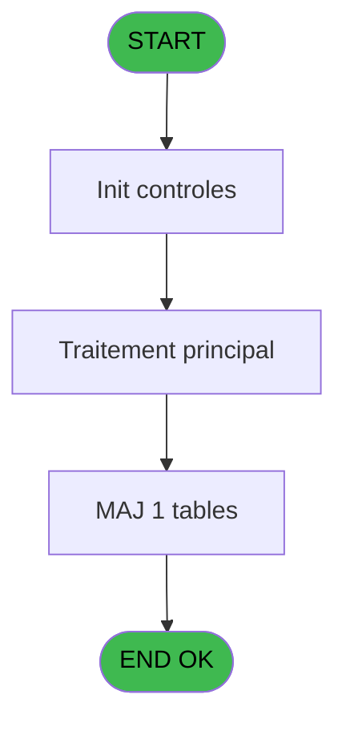

# PVE IDE 19 - Upload CGV Files

> **Analyse**: Phases 1-4 2026-02-03 01:06 -> 01:07 (39s) | Assemblage 01:07
> **Pipeline**: V7.2 Enrichi
> **Structure**: 4 onglets (Resume | Ecrans | Donnees | Connexions)

<!-- TAB:Resume -->

## 1. FICHE D'IDENTITE

| Attribut | Valeur |
|----------|--------|
| Projet | PVE |
| IDE Position | 19 |
| Nom Programme | Upload CGV Files |
| Fichier source | `Prg_19.xml` |
| Domaine metier | General |
| Taches | 2 (1 ecrans visibles) |
| Tables modifiees | 1 |
| Programmes appeles | 0 |
| :warning: Statut | **ORPHELIN_POTENTIEL** |

## 2. DESCRIPTION FONCTIONNELLE

**Upload CGV Files** assure la gestion complete de ce processus.

Le flux de traitement s'organise en **2 blocs fonctionnels** :

- **Consultation** (1 tache) : ecrans de recherche, selection et consultation
- **Traitement** (1 tache) : traitements metier divers

**Donnees modifiees** : 1 tables en ecriture (arc_tai_gm).

Detail : phases du traitement

#### Phase 1 : Traitement (1 tache)

- **19** - Default customer search mode **[[ECRAN]](#ecran-t1)**

#### Phase 2 : Consultation (1 tache)

- **19.1** - Update Mode Recherche

#### Tables impactees

| Table | Operations | Role metier |
|-------|-----------|-------------|
| arc_tai_gm | R/**W** (2 usages) |  |

## 3. BLOCS FONCTIONNELS

### 3.1 Traitement (1 tache)

Traitements internes.

---

#### 19 - Default customer search mode [[ECRAN]](#ecran-t1)

**Role** : Traitement : Default customer search mode.
**Ecran** : 786 x 130 DLU (MDI) | [Voir mockup](#ecran-t1)
**Variables liees** : A (V.ModeRecherche), D (BtnSearchSalesFile), E (BtnSearchRentalsFile)

### 3.2 Consultation (1 tache)

Ecrans de recherche et consultation.

---

#### 19.1 - Update Mode Recherche

**Role** : Traitement : Update Mode Recherche.
**Variables liees** : A (V.ModeRecherche)

## 5. REGLES METIER

*(Aucune regle metier identifiee)*

## 6. CONTEXTE

- **Appele par**: (aucun)
- **Appelle**: 0 programmes | **Tables**: 1 (W:1 R:1 L:0) | **Taches**: 2 | **Expressions**: 3

<!-- TAB:Ecrans -->

## 8. ECRANS

### 8.1 Forms visibles (1 / 2)

| # | Position | Tache | Nom | Type | Largeur | Hauteur | Bloc |
|---|----------|-------|-----|------|---------|---------|------|
| 1 | 19 | 19 | Default customer search mode | MDI | 786 | 130 | Traitement |

### 8.2 Mockups Ecrans

---

#### 19 - Default customer search mode
**Tache** : [19](#t1) | **Type** : MDI | **Dimensions** : 786 x 130 DLU
**Bloc** : Traitement | **Titre IDE** : Default customer search mode

<!-- FORM-DATA:
{
    "width":  786,
    "vFactor":  8,
    "type":  "MDI",
    "hFactor":  8,
    "controls":  [
                     {
                         "x":  52,
                         "type":  "label",
                         "var":  "",
                         "y":  4,
                         "w":  478,
                         "fmt":  "",
                         "name":  "",
                         "h":  28,
                         "color":  "183",
                         "text":  "Sales CGV File",
                         "parent":  null
                     },
                     {
                         "x":  53,
                         "type":  "label",
                         "var":  "",
                         "y":  42,
                         "w":  478,
                         "fmt":  "",
                         "name":  "",
                         "h":  28,
                         "color":  "183",
                         "text":  "Rentals CGV File",
                         "parent":  null
                     },
                     {
                         "x":  3,
                         "type":  "label",
                         "var":  "",
                         "y":  96,
                         "w":  773,
                         "fmt":  "",
                         "name":  "",
                         "h":  31,
                         "color":  "182",
                         "text":  "",
                         "parent":  null
                     },
                     {
                         "x":  11,
                         "type":  "button",
                         "var":  "",
                         "y":  102,
                         "w":  145,
                         "fmt":  "\u0026Exit",
                         "name":  "",
                         "h":  22,
                         "color":  "",
                         "text":  "",
                         "parent":  7
                     },
                     {
                         "x":  618,
                         "type":  "button",
                         "var":  "",
                         "y":  102,
                         "w":  145,
                         "fmt":  "\u0026Valider",
                         "name":  "CHANGE",
                         "h":  22,
                         "color":  "",
                         "text":  "",
                         "parent":  7
                     },
                     {
                         "x":  62,
                         "type":  "edit",
                         "var":  "",
                         "y":  13,
                         "w":  428,
                         "fmt":  "",
                         "name":  "V.Directory export import",
                         "h":  14,
                         "color":  "110",
                         "text":  "",
                         "parent":  1
                     },
                     {
                         "x":  492,
                         "type":  "button",
                         "var":  "",
                         "y":  13,
                         "w":  29,
                         "fmt":  "...",
                         "name":  "BtnSearchSalesFile",
                         "h":  14,
                         "color":  "",
                         "text":  "",
                         "parent":  1
                     },
                     {
                         "x":  63,
                         "type":  "edit",
                         "var":  "",
                         "y":  51,
                         "w":  428,
                         "fmt":  "",
                         "name":  "RentalsFile_0001",
                         "h":  14,
                         "color":  "110",
                         "text":  "",
                         "parent":  4
                     },
                     {
                         "x":  493,
                         "type":  "button",
                         "var":  "",
                         "y":  51,
                         "w":  29,
                         "fmt":  "...",
                         "name":  "BtnSearchRentalsFile",
                         "h":  14,
                         "color":  "",
                         "text":  "",
                         "parent":  4
                     }
                 ],
    "taskId":  "19",
    "height":  130
}
-->

<strong>Champs : 2 champs</strong>

| Pos (x,y) | Nom | Variable | Type |
|-----------|-----|----------|------|
| 62,13 | V.Directory export import | - | edit |
| 63,51 | RentalsFile_0001 | - | edit |

<strong>Boutons : 4 boutons</strong>

| Bouton | Pos (x,y) | Action |
|--------|-----------|--------|
| Exit | 11,102 | Quitte le programme |
| Valider | 618,102 | Valide la saisie et enregistre |
| ... | 492,13 | Bouton fonctionnel |
| ... | 493,51 | Bouton fonctionnel |

## 9. NAVIGATION

Ecran unique: **Default customer search mode**

### 9.3 Structure hierarchique (2 taches)

| Position | Tache | Type | Dimensions | Bloc |
|----------|-------|------|------------|------|
| **19.1** | [**Default customer search mode** (19)](#t1) [mockup](#ecran-t1) | MDI | 786x130 | Traitement |
| **19.2** | [**Update Mode Recherche** (19.1)](#t2) | - | - | Consultation |

### 9.4 Algorigramme

> **Legende**: Vert = START/END OK | Rouge = END KO | Bleu = Decisions
> *Algorigramme auto-genere. Utiliser `/algorigramme` pour une synthese metier detaillee.*

<!-- TAB:Donnees -->

## 10. TABLES

### Tables utilisees (1)

| ID | Nom | Description | Type | R | W | L | Usages |
|----|-----|-------------|------|---|---|---|--------|
| 731 | arc_tai_gm |  | DB | R | **W** |   | 2 |

### Colonnes par table (1 / 1 tables avec colonnes identifiees)

Table 731 - arc_tai_gm (R/**W**) - 2 usages

| Lettre | Variable | Acces | Type |
|--------|----------|-------|------|
| A | V.ModeRecherche | W | Numeric |
| B | SalesFile | W | Unicode |
| C | RentalsFile | W | Unicode |
| D | BtnSearchSalesFile | W | Alpha |
| E | BtnSearchRentalsFile | W | Alpha |

## 11. VARIABLES

### 11.1 Variables de session (1)

Variables persistantes pendant toute la session.

| Lettre | Nom | Type | Usage dans |
|--------|-----|------|-----------|
| A | V.ModeRecherche | Numeric | - |

### 11.2 Autres (4)

Variables diverses.

| Lettre | Nom | Type | Usage dans |
|--------|-----|------|-----------|
| B | SalesFile | Unicode | - |
| C | RentalsFile | Unicode | 1x refs |
| D | BtnSearchSalesFile | Alpha | - |
| E | BtnSearchRentalsFile | Alpha | - |

## 12. EXPRESSIONS

**3 / 3 expressions decodees (100%)**

### 12.1 Repartition par type

| Type | Expressions | Regles |
|------|-------------|--------|
| CONSTANTE | 1 | 0 |
| OTHER | 2 | 0 |

### 12.2 Expressions cles par type

#### CONSTANTE (1 expressions)

| Type | IDE | Expression | Regle |
|------|-----|------------|-------|
| CONSTANTE | 2 | `''` | - |

#### OTHER (2 expressions)

| Type | IDE | Expression | Regle |
|------|-----|------------|-------|
| OTHER | 3 | `RentalsFile [C]` | - |
| OTHER | 1 | `GetParam ('SERVICE')` | - |

<!-- TAB:Connexions -->

## 13. GRAPHE D'APPELS

### 13.1 Chaine depuis Main (Callers)

**Chemin**: (pas de callers directs)

### 13.2 Callers

| IDE | Nom Programme | Nb Appels |
|-----|---------------|-----------|
| - | (aucun) | - |

### 13.3 Callees (programmes appeles)

### 13.4 Detail Callees avec contexte

| IDE | Nom Programme | Appels | Contexte |
|-----|---------------|--------|----------|
| - | (aucun) | - | - |

## 14. RECOMMANDATIONS MIGRATION

### 14.1 Profil du programme

| Metrique | Valeur | Impact migration |
|----------|--------|-----------------|
| Lignes de logique | 28 | Programme compact |
| Expressions | 3 | Peu de logique |
| Tables WRITE | 1 | Impact faible |
| Sous-programmes | 0 | Peu de dependances |
| Ecrans visibles | 1 | Ecran unique ou traitement batch |
| Code desactive | 0% (0 / 28) | Code sain |
| Regles metier | 0 | Pas de regle identifiee |

### 14.2 Plan de migration par bloc

#### Traitement (1 tache: 1 ecran, 0 traitement)

- **Strategie** : 1 composant(s) UI (Razor/React) avec formulaires et validation.
- Decomposer les taches en services unitaires testables.

#### Consultation (1 tache: 0 ecran, 1 traitement)

- **Strategie** : Composants de recherche/selection en modales.

### 14.3 Dependances critiques

| Dependance | Type | Appels | Impact |
|------------|------|--------|--------|
| arc_tai_gm | Table WRITE (Database) | 1x | Schema + repository |

---
*Spec DETAILED generee par Pipeline V7.2 - 2026-02-03 01:07*
