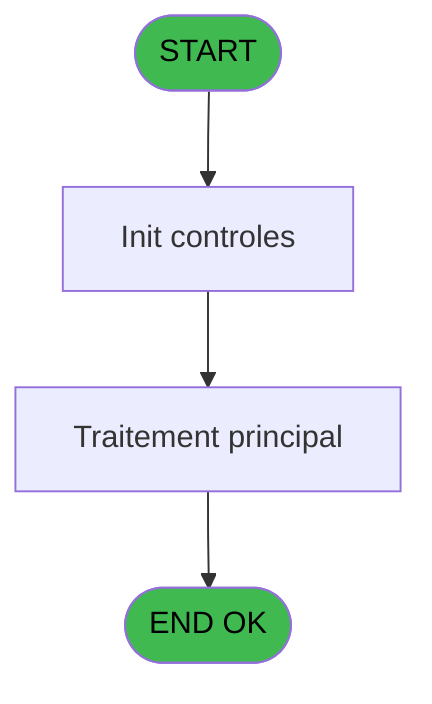
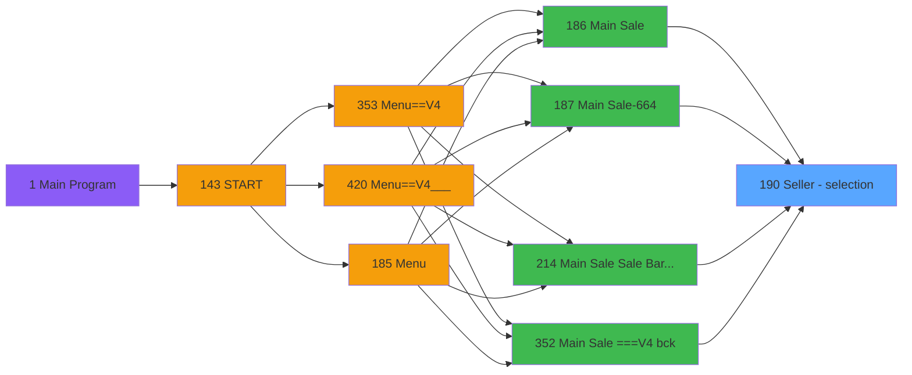

# PVE IDE 190 - Seller - selection

> **Analyse**: Phases 1-4 2026-02-03 18:47 -> 18:48 (20s) | Assemblage 18:48
> **Pipeline**: V7.2 Enrichi
> **Structure**: 4 onglets (Resume | Ecrans | Donnees | Connexions)

<!-- TAB:Resume -->

## 1. FICHE D'IDENTITE

| Attribut | Valeur |
|----------|--------|
| Projet | PVE |
| IDE Position | 190 |
| Nom Programme | Seller - selection |
| Fichier source | `Prg_190.xml` |
| Dossier IDE | Mobile |
| Taches | 1 (1 ecrans visibles) |
| Tables modifiees | 0 |
| Programmes appeles | 0 |

## 2. DESCRIPTION FONCTIONNELLE

**Seller - selection** assure la gestion complete de ce processus, accessible depuis [Main Sale ===V4 (IDE 0)](PVE-IDE-0.md), [Main Sale (IDE 186)](PVE-IDE-186.md), [Main Sale-664 (IDE 187)](PVE-IDE-187.md), [Main Sale Sale Bar Code (IDE 214)](PVE-IDE-214.md), [Main Sale ===V4 bck (IDE 352)](PVE-IDE-352.md), [Main Sale ===V4 (IDE 354)](PVE-IDE-354.md), [Main Sale ===V4 (IDE 359)](PVE-IDE-359.md), [Main Sale (IDE 363)](PVE-IDE-363.md), [Main Sale-664 (IDE 364)](PVE-IDE-364.md), [Main Sale ===V4 (IDE 409)](PVE-IDE-409.md), [Main Sale ===V4 (IDE 415)](PVE-IDE-415.md), [Main Sale ===V4 Booking ACTUEL (IDE 417)](PVE-IDE-417.md), [Main Sale (IDE 440)](PVE-IDE-440.md).

Le flux de traitement s'organise en **1 blocs fonctionnels** :

- **Traitement** (1 tache) : traitements metier divers

## 3. BLOCS FONCTIONNELS

### 3.1 Traitement (1 tache)

Traitements internes.

---

#### 190 - Seller [[ECRAN]](#ecran-t1)

**Role** : Traitement : Seller.
**Ecran** : 992 x 432 DLU (Type6) | [Voir mockup](#ecran-t1)

## 5. REGLES METIER

*(Aucune regle metier identifiee)*

## 6. CONTEXTE

- **Appele par**: [Main Sale ===V4 (IDE 0)](PVE-IDE-0.md), [Main Sale (IDE 186)](PVE-IDE-186.md), [Main Sale-664 (IDE 187)](PVE-IDE-187.md), [Main Sale Sale Bar Code (IDE 214)](PVE-IDE-214.md), [Main Sale ===V4 bck (IDE 352)](PVE-IDE-352.md), [Main Sale ===V4 (IDE 354)](PVE-IDE-354.md), [Main Sale ===V4 (IDE 359)](PVE-IDE-359.md), [Main Sale (IDE 363)](PVE-IDE-363.md), [Main Sale-664 (IDE 364)](PVE-IDE-364.md), [Main Sale ===V4 (IDE 409)](PVE-IDE-409.md), [Main Sale ===V4 (IDE 415)](PVE-IDE-415.md), [Main Sale ===V4 Booking ACTUEL (IDE 417)](PVE-IDE-417.md), [Main Sale (IDE 440)](PVE-IDE-440.md)
- **Appelle**: 0 programmes | **Tables**: 1 (W:0 R:1 L:0) | **Taches**: 1 | **Expressions**: 22

<!-- TAB:Ecrans -->

## 8. ECRANS

### 8.1 Forms visibles (1 / 1)

| # | Position | Tache | Nom | Type | Largeur | Hauteur | Bloc |
|---|----------|-------|-----|------|---------|---------|------|
| 1 | 190 | 190 | Seller | Type6 | 992 | 432 | Traitement |

### 8.2 Mockups Ecrans

---

#### 190 - Seller
**Tache** : [190](#t1) | **Type** : Type6 | **Dimensions** : 992 x 432 DLU
**Bloc** : Traitement | **Titre IDE** : Seller

<!-- FORM-DATA:
{
    "width":  992,
    "vFactor":  8,
    "type":  "Type6",
    "hFactor":  4,
    "controls":  [
                     {
                         "x":  351,
                         "type":  "label",
                         "var":  "",
                         "y":  35,
                         "w":  280,
                         "fmt":  "",
                         "name":  "",
                         "h":  48,
                         "color":  "187",
                         "text":  "Logon",
                         "parent":  null
                     },
                     {
                         "x":  465,
                         "type":  "edit",
                         "var":  "",
                         "y":  52,
                         "w":  157,
                         "fmt":  "",
                         "name":  "v.Seller_Name",
                         "h":  20,
                         "color":  "",
                         "text":  "",
                         "parent":  1
                     },
                     {
                         "x":  360,
                         "type":  "edit",
                         "var":  "",
                         "y":  52,
                         "w":  103,
                         "fmt":  "######A",
                         "name":  "v.Password",
                         "h":  20,
                         "color":  "",
                         "text":  "",
                         "parent":  1
                     },
                     {
                         "x":  351,
                         "type":  "button",
                         "var":  "",
                         "y":  344,
                         "w":  280,
                         "fmt":  "POS",
                         "name":  "POS",
                         "h":  55,
                         "color":  "",
                         "text":  "",
                         "parent":  null
                     },
                     {
                         "x":  351,
                         "type":  "button",
                         "var":  "",
                         "y":  91,
                         "w":  80,
                         "fmt":  "1",
                         "name":  "1",
                         "h":  55,
                         "color":  "",
                         "text":  "",
                         "parent":  null
                     },
                     {
                         "x":  451,
                         "type":  "button",
                         "var":  "",
                         "y":  91,
                         "w":  80,
                         "fmt":  "2",
                         "name":  "2",
                         "h":  55,
                         "color":  "",
                         "text":  "",
                         "parent":  null
                     },
                     {
                         "x":  551,
                         "type":  "button",
                         "var":  "",
                         "y":  91,
                         "w":  80,
                         "fmt":  "3",
                         "name":  "3",
                         "h":  55,
                         "color":  "",
                         "text":  "",
                         "parent":  null
                     },
                     {
                         "x":  351,
                         "type":  "button",
                         "var":  "",
                         "y":  154,
                         "w":  80,
                         "fmt":  "4",
                         "name":  "4",
                         "h":  55,
                         "color":  "",
                         "text":  "",
                         "parent":  null
                     },
                     {
                         "x":  451,
                         "type":  "button",
                         "var":  "",
                         "y":  154,
                         "w":  80,
                         "fmt":  "5",
                         "name":  "5",
                         "h":  55,
                         "color":  "",
                         "text":  "",
                         "parent":  null
                     },
                     {
                         "x":  551,
                         "type":  "button",
                         "var":  "",
                         "y":  154,
                         "w":  80,
                         "fmt":  "6",
                         "name":  "6",
                         "h":  55,
                         "color":  "",
                         "text":  "",
                         "parent":  null
                     },
                     {
                         "x":  351,
                         "type":  "button",
                         "var":  "",
                         "y":  217,
                         "w":  80,
                         "fmt":  "7",
                         "name":  "7",
                         "h":  55,
                         "color":  "",
                         "text":  "",
                         "parent":  null
                     },
                     {
                         "x":  451,
                         "type":  "button",
                         "var":  "",
                         "y":  216,
                         "w":  80,
                         "fmt":  "8",
                         "name":  "8",
                         "h":  55,
                         "color":  "",
                         "text":  "",
                         "parent":  null
                     },
                     {
                         "x":  551,
                         "type":  "button",
                         "var":  "",
                         "y":  216,
                         "w":  80,
                         "fmt":  "9",
                         "name":  "9",
                         "h":  55,
                         "color":  "",
                         "text":  "",
                         "parent":  null
                     },
                     {
                         "x":  351,
                         "type":  "button",
                         "var":  "",
                         "y":  280,
                         "w":  80,
                         "fmt":  "Clear",
                         "name":  "Clear",
                         "h":  55,
                         "color":  "",
                         "text":  "",
                         "parent":  null
                     },
                     {
                         "x":  451,
                         "type":  "button",
                         "var":  "",
                         "y":  278,
                         "w":  80,
                         "fmt":  "0",
                         "name":  "0",
                         "h":  55,
                         "color":  "",
                         "text":  "",
                         "parent":  null
                     },
                     {
                         "x":  551,
                         "type":  "button",
                         "var":  "",
                         "y":  279,
                         "w":  80,
                         "fmt":  "Del",
                         "name":  "Del",
                         "h":  55,
                         "color":  "",
                         "text":  "",
                         "parent":  null
                     }
                 ],
    "taskId":  "190",
    "height":  432
}
-->

<strong>Champs : 2 champs</strong>

| Pos (x,y) | Nom | Variable | Type |
|-----------|-----|----------|------|
| 465,52 | v.Seller_Name | - | edit |
| 360,52 | v.Password | - | edit |

<strong>Boutons : 13 boutons</strong>

| Bouton | Pos (x,y) | Action |
|--------|-----------|--------|
| POS | 351,344 | Bouton fonctionnel |
| 1 | 351,91 | Bouton fonctionnel |
| 2 | 451,91 | Bouton fonctionnel |
| 3 | 551,91 | Bouton fonctionnel |
| 4 | 351,154 | Bouton fonctionnel |
| 5 | 451,154 | Bouton fonctionnel |
| 6 | 551,154 | Bouton fonctionnel |
| 7 | 351,217 | Bouton fonctionnel |
| 8 | 451,216 | Bouton fonctionnel |
| 9 | 551,216 | Bouton fonctionnel |
| Clear | 351,280 | Bouton fonctionnel |
| 0 | 451,278 | Bouton fonctionnel |
| Del | 551,279 | Bouton fonctionnel |

## 9. NAVIGATION

Ecran unique: **Seller**

### 9.3 Structure hierarchique (1 tache)

| Position | Tache | Type | Dimensions | Bloc |
|----------|-------|------|------------|------|
| **190.1** | [**Seller** (190)](#t1) [mockup](#ecran-t1) | Type6 | 992x432 | Traitement |

### 9.4 Algorigramme

> **Legende**: Vert = START/END OK | Rouge = END KO | Bleu = Decisions
> *Algorigramme auto-genere. Utiliser `/algorigramme` pour une synthese metier detaillee.*

<!-- TAB:Donnees -->

## 10. TABLES

### Tables utilisees (1)

| ID | Nom | Description | Type | R | W | L | Usages |
|----|-----|-------------|------|---|---|---|--------|
| 765 | tranche_age |  | DB | R |   |   | 1 |

### Colonnes par table (1 / 1 tables avec colonnes identifiees)

Table 765 - tranche_age (R) - 1 usages

| Lettre | Variable | Acces | Type |
|--------|----------|-------|------|
| A | v.Service | R | Alpha |
| B | v.Password | R | Unicode |
| C | v.L_Vendeur | R | Logical |
| D | V.Nbre d'enregistrement non val | R | Numeric |
| E | v.SoldeCompte | R | Numeric |

## 11. VARIABLES

### 11.1 Variables de session (5)

Variables persistantes pendant toute la session.

| Lettre | Nom | Type | Usage dans |
|--------|-----|------|-----------|
| A | v.Service | Alpha | - |
| B | v.Password | Unicode | 13x session |
| C | v.L_Vendeur | Logical | 2x session |
| D | V.Nbre d'enregistrement non val | Numeric | - |
| E | v.SoldeCompte | Numeric | - |

## 12. EXPRESSIONS

**22 / 22 expressions decodees (100%)**

### 12.1 Repartition par type

| Type | Expressions | Regles |
|------|-------------|--------|
| CONSTANTE | 3 | 0 |
| OTHER | 5 | 0 |
| CONDITION | 1 | 0 |
| STRING | 2 | 0 |
| CONCATENATION | 10 | 0 |
| NEGATION | 1 | 0 |

### 12.2 Expressions cles par type

#### CONSTANTE (3 expressions)

| Type | IDE | Expression | Regle |
|------|-----|------------|-------|
| CONSTANTE | 22 | `'The Password is wrong !'` | - |
| CONSTANTE | 19 | `''` | - |
| CONSTANTE | 5 | `'O'` | - |

#### OTHER (5 expressions)

| Type | IDE | Expression | Regle |
|------|-----|------------|-------|
| OTHER | 6 | `GetParam ('SERVICE')` | - |
| OTHER | 20 | `v.L_Vendeur [C]` | - |
| OTHER | 4 | `[H]` | - |
| OTHER | 1 | `GetParam ('SERVICE')` | - |
| OTHER | 3 | `[G]` | - |

#### CONDITION (1 expressions)

| Type | IDE | Expression | Regle |
|------|-----|------------|-------|
| CONDITION | 2 | `Trim(v.Password [B])<>''` | - |

#### STRING (2 expressions)

| Type | IDE | Expression | Regle |
|------|-----|------------|-------|
| STRING | 18 | `Del (v.Password [B],Len (Trim(v.Password [B])),1)` | - |
| STRING | 7 | `Trim(v.Password [B])` | - |

#### CONCATENATION (10 expressions)

| Type | IDE | Expression | Regle |
|------|-----|------------|-------|
| CONCATENATION | 14 | `Trim(v.Password [B])&'6'` | - |
| CONCATENATION | 13 | `Trim(v.Password [B])&'5'` | - |
| CONCATENATION | 15 | `Trim(v.Password [B])&'7'` | - |
| CONCATENATION | 17 | `Trim(v.Password [B])&'9'` | - |
| CONCATENATION | 16 | `Trim(v.Password [B])&'8'` | - |
| ... | | *+5 autres* | |

#### NEGATION (1 expressions)

| Type | IDE | Expression | Regle |
|------|-----|------------|-------|
| NEGATION | 21 | `NOT v.L_Vendeur [C] AND Trim([J])<>''` | - |

### 12.3 Toutes les expressions (22)

Voir les 22 expressions

#### CONSTANTE (3)

| IDE | Expression Decodee |
|-----|-------------------|
| 5 | `'O'` |
| 19 | `''` |
| 22 | `'The Password is wrong !'` |

#### OTHER (5)

| IDE | Expression Decodee |
|-----|-------------------|
| 1 | `GetParam ('SERVICE')` |
| 3 | `[G]` |
| 4 | `[H]` |
| 6 | `GetParam ('SERVICE')` |
| 20 | `v.L_Vendeur [C]` |

#### CONDITION (1)

| IDE | Expression Decodee |
|-----|-------------------|
| 2 | `Trim(v.Password [B])<>''` |

#### STRING (2)

| IDE | Expression Decodee |
|-----|-------------------|
| 7 | `Trim(v.Password [B])` |
| 18 | `Del (v.Password [B],Len (Trim(v.Password [B])),1)` |

#### CONCATENATION (10)

| IDE | Expression Decodee |
|-----|-------------------|
| 8 | `Trim(v.Password [B])&'0'` |
| 9 | `Trim(v.Password [B])&'1'` |
| 10 | `Trim(v.Password [B])&'2'` |
| 11 | `Trim(v.Password [B])&'3'` |
| 12 | `Trim(v.Password [B])&'4'` |
| 13 | `Trim(v.Password [B])&'5'` |
| 14 | `Trim(v.Password [B])&'6'` |
| 15 | `Trim(v.Password [B])&'7'` |
| 16 | `Trim(v.Password [B])&'8'` |
| 17 | `Trim(v.Password [B])&'9'` |

#### NEGATION (1)

| IDE | Expression Decodee |
|-----|-------------------|
| 21 | `NOT v.L_Vendeur [C] AND Trim([J])<>''` |

<!-- TAB:Connexions -->

## 13. GRAPHE D'APPELS

### 13.1 Chaine depuis Main (Callers)

Main -> ... -> [Main Sale ===V4 (IDE 0)](PVE-IDE-0.md) -> **Seller - selection (IDE 190)**

Main -> ... -> [Main Sale (IDE 186)](PVE-IDE-186.md) -> **Seller - selection (IDE 190)**

Main -> ... -> [Main Sale-664 (IDE 187)](PVE-IDE-187.md) -> **Seller - selection (IDE 190)**

Main -> ... -> [Main Sale Sale Bar Code (IDE 214)](PVE-IDE-214.md) -> **Seller - selection (IDE 190)**

Main -> ... -> [Main Sale ===V4 bck (IDE 352)](PVE-IDE-352.md) -> **Seller - selection (IDE 190)**

Main -> ... -> [Main Sale ===V4 (IDE 354)](PVE-IDE-354.md) -> **Seller - selection (IDE 190)**

Main -> ... -> [Main Sale ===V4 (IDE 359)](PVE-IDE-359.md) -> **Seller - selection (IDE 190)**

Main -> ... -> [Main Sale (IDE 363)](PVE-IDE-363.md) -> **Seller - selection (IDE 190)**

Main -> ... -> [Main Sale-664 (IDE 364)](PVE-IDE-364.md) -> **Seller - selection (IDE 190)**

Main -> ... -> [Main Sale ===V4 (IDE 409)](PVE-IDE-409.md) -> **Seller - selection (IDE 190)**

Main -> ... -> [Main Sale ===V4 (IDE 415)](PVE-IDE-415.md) -> **Seller - selection (IDE 190)**

Main -> ... -> [Main Sale ===V4 Booking ACTUEL (IDE 417)](PVE-IDE-417.md) -> **Seller - selection (IDE 190)**

Main -> ... -> [Main Sale (IDE 440)](PVE-IDE-440.md) -> **Seller - selection (IDE 190)**

### 13.2 Callers

| IDE | Nom Programme | Nb Appels |
|-----|---------------|-----------|
| [0](PVE-IDE-0.md) | Main Sale ===V4 | 1 |
| [186](PVE-IDE-186.md) | Main Sale | 1 |
| [187](PVE-IDE-187.md) | Main Sale-664 | 1 |
| [214](PVE-IDE-214.md) | Main Sale Sale Bar Code | 1 |
| [352](PVE-IDE-352.md) | Main Sale ===V4 bck | 1 |
| [354](PVE-IDE-354.md) | Main Sale ===V4 | 1 |
| [359](PVE-IDE-359.md) | Main Sale ===V4 | 1 |
| [363](PVE-IDE-363.md) | Main Sale | 1 |
| [364](PVE-IDE-364.md) | Main Sale-664 | 1 |
| [409](PVE-IDE-409.md) | Main Sale ===V4 | 1 |
| [415](PVE-IDE-415.md) | Main Sale ===V4 | 1 |
| [417](PVE-IDE-417.md) | Main Sale ===V4 Booking ACTUEL | 1 |
| [440](PVE-IDE-440.md) | Main Sale | 1 |

### 13.3 Callees (programmes appeles)

### 13.4 Detail Callees avec contexte

| IDE | Nom Programme | Appels | Contexte |
|-----|---------------|--------|----------|
| - | (aucun) | - | - |

## 14. RECOMMANDATIONS MIGRATION

### 14.1 Profil du programme

| Metrique | Valeur | Impact migration |
|----------|--------|-----------------|
| Lignes de logique | 40 | Programme compact |
| Expressions | 22 | Peu de logique |
| Tables WRITE | 0 | Impact faible |
| Sous-programmes | 0 | Peu de dependances |
| Ecrans visibles | 1 | Ecran unique ou traitement batch |
| Code desactive | 0% (0 / 40) | Code sain |
| Regles metier | 0 | Pas de regle identifiee |

### 14.2 Plan de migration par bloc

#### Traitement (1 tache: 1 ecran, 0 traitement)

- **Strategie** : 1 composant(s) UI (Razor/React) avec formulaires et validation.
- Decomposer les taches en services unitaires testables.

### 14.3 Dependances critiques

| Dependance | Type | Appels | Impact |
|------------|------|--------|--------|

---
*Spec DETAILED generee par Pipeline V7.2 - 2026-02-03 18:48*
