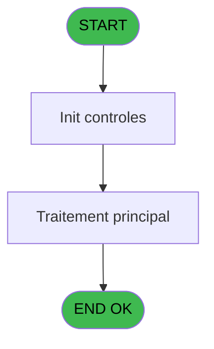
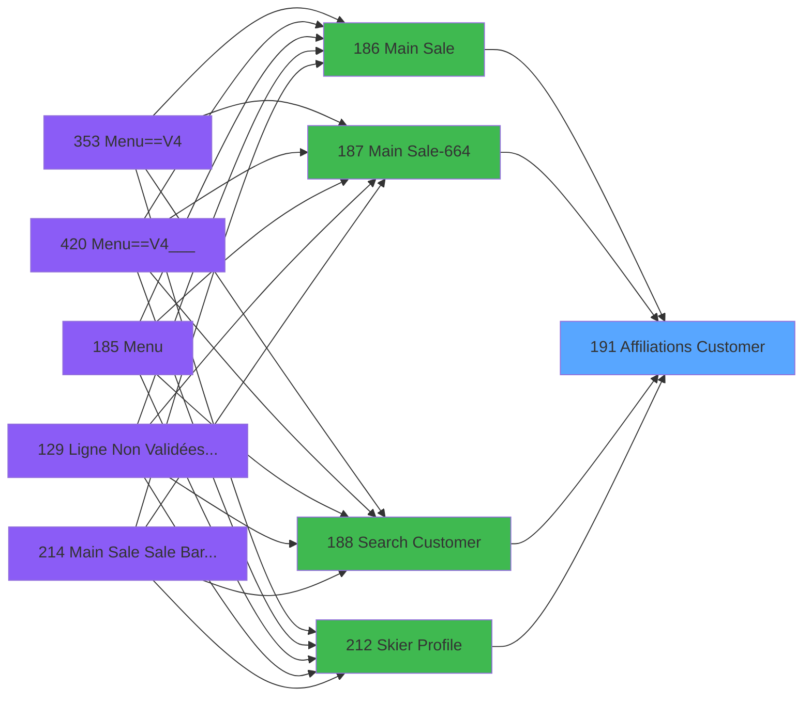

# PVE IDE 191 - Affiliations Customer

> **Analyse**: Phases 1-4 2026-02-03 18:48 -> 18:48 (18s) | Assemblage 18:48
> **Pipeline**: V7.2 Enrichi
> **Structure**: 4 onglets (Resume | Ecrans | Donnees | Connexions)

<!-- TAB:Resume -->

## 1. FICHE D'IDENTITE

| Attribut | Valeur |
|----------|--------|
| Projet | PVE |
| IDE Position | 191 |
| Nom Programme | Affiliations Customer |
| Fichier source | `Prg_191.xml` |
| Dossier IDE | Mobile |
| Taches | 1 (1 ecrans visibles) |
| Tables modifiees | 0 |
| Programmes appeles | 0 |

## 2. DESCRIPTION FONCTIONNELLE

**Affiliations Customer** assure la gestion complete de ce processus, accessible depuis [Search Customer==V4 (IDE 355)](PVE-IDE-355.md), [Search Customer (IDE 188)](PVE-IDE-188.md), [Search Customer==V4 (IDE 412)](PVE-IDE-412.md), [Search Customer==V4 (IDE 425)](PVE-IDE-425.md), [Main Sale ===V4 (IDE 0)](PVE-IDE-0.md), [Main Sale (IDE 186)](PVE-IDE-186.md), [Main Sale-664 (IDE 187)](PVE-IDE-187.md), [Skier Profile (IDE 212)](PVE-IDE-212.md), [Main Sale Sale Bar Code (IDE 214)](PVE-IDE-214.md), [Main Sale ===V4 bck (IDE 352)](PVE-IDE-352.md), [Main Sale ===V4 (IDE 354)](PVE-IDE-354.md), [Main Sale ===V4 (IDE 359)](PVE-IDE-359.md), [Main Sale (IDE 363)](PVE-IDE-363.md), [Main Sale-664 (IDE 364)](PVE-IDE-364.md), [Main Sale ===V4 (IDE 409)](PVE-IDE-409.md), [Main Sale ===V4 (IDE 415)](PVE-IDE-415.md), [Main Sale ===V4 Booking ACTUEL (IDE 417)](PVE-IDE-417.md), [Main Sale (IDE 440)](PVE-IDE-440.md).

Le flux de traitement s'organise en **1 blocs fonctionnels** :

- **Traitement** (1 tache) : traitements metier divers

**Logique metier** : 2 regles identifiees couvrant conditions metier.

## 3. BLOCS FONCTIONNELS

### 3.1 Traitement (1 tache)

Traitements internes.

---

#### 191 - Affiliations Customer [[ECRAN]](#ecran-t1)

**Role** : Traitement : Affiliations Customer.
**Ecran** : 383 x 194 DLU (Type6) | [Voir mockup](#ecran-t1)

## 5. REGLES METIER

2 regles identifiees:

### Autres (2 regles)

#### [RM-001] Si [AP] alors [AK] sinon [AD])

| Element | Detail |
|---------|--------|
| **Condition** | `[AP]` |
| **Si vrai** | [AK] |
| **Si faux** | [AD]) |
| **Expression source** | Expression 19 : `IF([AP],[AK],[AD])` |
| **Exemple** | Si [AP] → [AK]. Sinon → [AD]) |

#### [RM-002] Si VG148 alors 29 sinon 44.5)

| Element | Detail |
|---------|--------|
| **Condition** | `VG148` |
| **Si vrai** | 29 |
| **Si faux** | 44.5) |
| **Expression source** | Expression 21 : `IF(VG148,29,44.5)` |
| **Exemple** | Si VG148 → 29. Sinon → 44.5) |

## 6. CONTEXTE

- **Appele par**: [Search Customer==V4 (IDE 355)](PVE-IDE-355.md), [Search Customer (IDE 188)](PVE-IDE-188.md), [Search Customer==V4 (IDE 412)](PVE-IDE-412.md), [Search Customer==V4 (IDE 425)](PVE-IDE-425.md), [Main Sale ===V4 (IDE 0)](PVE-IDE-0.md), [Main Sale (IDE 186)](PVE-IDE-186.md), [Main Sale-664 (IDE 187)](PVE-IDE-187.md), [Skier Profile (IDE 212)](PVE-IDE-212.md), [Main Sale Sale Bar Code (IDE 214)](PVE-IDE-214.md), [Main Sale ===V4 bck (IDE 352)](PVE-IDE-352.md), [Main Sale ===V4 (IDE 354)](PVE-IDE-354.md), [Main Sale ===V4 (IDE 359)](PVE-IDE-359.md), [Main Sale (IDE 363)](PVE-IDE-363.md), [Main Sale-664 (IDE 364)](PVE-IDE-364.md), [Main Sale ===V4 (IDE 409)](PVE-IDE-409.md), [Main Sale ===V4 (IDE 415)](PVE-IDE-415.md), [Main Sale ===V4 Booking ACTUEL (IDE 417)](PVE-IDE-417.md), [Main Sale (IDE 440)](PVE-IDE-440.md)
- **Appelle**: 0 programmes | **Tables**: 4 (W:0 R:1 L:3) | **Taches**: 1 | **Expressions**: 22

<!-- TAB:Ecrans -->

## 8. ECRANS

### 8.1 Forms visibles (1 / 1)

| # | Position | Tache | Nom | Type | Largeur | Hauteur | Bloc |
|---|----------|-------|-----|------|---------|---------|------|
| 1 | 191 | 191 | Affiliations Customer | Type6 | 383 | 194 | Traitement |

### 8.2 Mockups Ecrans

---

#### 191 - Affiliations Customer
**Tache** : [191](#t1) | **Type** : Type6 | **Dimensions** : 383 x 194 DLU
**Bloc** : Traitement | **Titre IDE** : Affiliations Customer

<!-- FORM-DATA:
{
    "width":  383,
    "vFactor":  8,
    "type":  "Type6",
    "hFactor":  4,
    "controls":  [
                     {
                         "x":  0,
                         "type":  "label",
                         "var":  "",
                         "y":  169,
                         "w":  382,
                         "fmt":  "",
                         "name":  "",
                         "h":  24,
                         "color":  "182",
                         "text":  "",
                         "parent":  null
                     },
                     {
                         "x":  0,
                         "type":  "label",
                         "var":  "",
                         "y":  3,
                         "w":  383,
                         "fmt":  "",
                         "name":  "",
                         "h":  30,
                         "color":  "182",
                         "text":  "",
                         "parent":  null
                     },
                     {
                         "x":  0,
                         "type":  "table",
                         "var":  "",
                         "name":  "",
                         "titleH":  9,
                         "color":  "6",
                         "w":  409,
                         "y":  33,
                         "fmt":  "",
                         "parent":  null,
                         "text":  "",
                         "rowH":  21,
                         "h":  136,
                         "cols":  [
                                      {
                                          "title":  "Name",
                                          "layer":  1,
                                          "w":  178
                                      },
                                      {
                                          "title":  "Phone",
                                          "layer":  2,
                                          "w":  62
                                      },
                                      {
                                          "title":  "Sex",
                                          "layer":  3,
                                          "w":  28
                                      },
                                      {
                                          "title":  "Age",
                                          "layer":  4,
                                          "w":  70
                                      },
                                      {
                                          "title":  "Number",
                                          "layer":  5,
                                          "w":  68
                                      }
                                  ],
                         "rows":  5
                     },
                     {
                         "x":  299,
                         "type":  "label",
                         "var":  "",
                         "y":  43,
                         "w":  19,
                         "fmt":  "",
                         "name":  "",
                         "h":  8,
                         "color":  "6",
                         "text":  "Years",
                         "parent":  6
                     },
                     {
                         "x":  3,
                         "type":  "label",
                         "var":  "",
                         "y":  53,
                         "w":  33,
                         "fmt":  "",
                         "name":  "",
                         "h":  8,
                         "color":  "6",
                         "text":  "Last stay :",
                         "parent":  6
                     },
                     {
                         "x":  34,
                         "type":  "label",
                         "var":  "",
                         "y":  53,
                         "w":  22,
                         "fmt":  "",
                         "name":  "",
                         "h":  8,
                         "color":  "6",
                         "text":  "From :",
                         "parent":  6
                     },
                     {
                         "x":  272,
                         "type":  "label",
                         "var":  "",
                         "y":  53,
                         "w":  14,
                         "fmt":  "",
                         "name":  "",
                         "h":  8,
                         "color":  "6",
                         "text":  "To :",
                         "parent":  6
                     },
                     {
                         "x":  391,
                         "type":  "label",
                         "var":  "",
                         "y":  53,
                         "w":  11,
                         "fmt":  "",
                         "name":  "",
                         "h":  9,
                         "color":  "142",
                         "text":  "m",
                         "parent":  6
                     },
                     {
                         "x":  347,
                         "type":  "image",
                         "var":  "",
                         "y":  6,
                         "w":  34,
                         "fmt":  "",
                         "name":  "",
                         "h":  26,
                         "color":  "",
                         "text":  "",
                         "parent":  2
                     },
                     {
                         "x":  15,
                         "type":  "edit",
                         "var":  "",
                         "y":  13,
                         "w":  66,
                         "fmt":  "########P0",
                         "name":  "",
                         "h":  10,
                         "color":  "186",
                         "text":  "",
                         "parent":  2
                     },
                     {
                         "x":  85,
                         "type":  "edit",
                         "var":  "",
                         "y":  13,
                         "w":  123,
                         "fmt":  "",
                         "name":  "p.Nom",
                         "h":  10,
                         "color":  "186",
                         "text":  "",
                         "parent":  2
                     },
                     {
                         "x":  3,
                         "type":  "edit",
                         "var":  "",
                         "y":  45,
                         "w":  170,
                         "fmt":  "30",
                         "name":  "gmr_nom__30_",
                         "h":  8,
                         "color":  "6",
                         "text":  "",
                         "parent":  6
                     },
                     {
                         "x":  56,
                         "type":  "edit",
                         "var":  "",
                         "y":  53,
                         "w":  44,
                         "fmt":  "",
                         "name":  "gmr_debut_sejour",
                         "h":  8,
                         "color":  "6",
                         "text":  "",
                         "parent":  6
                     },
                     {
                         "x":  180,
                         "type":  "edit",
                         "var":  "",
                         "y":  44,
                         "w":  59,
                         "fmt":  "",
                         "name":  "ema_telephone_portable",
                         "h":  8,
                         "color":  "6",
                         "text":  "",
                         "parent":  6
                     },
                     {
                         "x":  251,
                         "type":  "edit",
                         "var":  "",
                         "y":  45,
                         "w":  10,
                         "fmt":  "",
                         "name":  "gmr_sexe",
                         "h":  8,
                         "color":  "6",
                         "text":  "",
                         "parent":  6
                     },
                     {
                         "x":  285,
                         "type":  "edit",
                         "var":  "",
                         "y":  43,
                         "w":  9,
                         "fmt":  "",
                         "name":  "gmr_age",
                         "h":  9,
                         "color":  "6",
                         "text":  "",
                         "parent":  6
                     },
                     {
                         "x":  289,
                         "type":  "edit",
                         "var":  "",
                         "y":  53,
                         "w":  44,
                         "fmt":  "",
                         "name":  "gmr_fin_sejour",
                         "h":  8,
                         "color":  "6",
                         "text":  "",
                         "parent":  6
                     },
                     {
                         "x":  349,
                         "type":  "edit",
                         "var":  "",
                         "y":  45,
                         "w":  36,
                         "fmt":  "",
                         "name":  "gmr_code_gm",
                         "h":  8,
                         "color":  "6",
                         "text":  "",
                         "parent":  6
                     },
                     {
                         "x":  392,
                         "type":  "edit",
                         "var":  "",
                         "y":  45,
                         "w":  13,
                         "fmt":  "",
                         "name":  "gmr_filiation_villag",
                         "h":  8,
                         "color":  "6",
                         "text":  "",
                         "parent":  6
                     },
                     {
                         "x":  346,
                         "type":  "button",
                         "var":  "",
                         "y":  33,
                         "w":  34,
                         "fmt":  "ñ",
                         "name":  "UP",
                         "h":  68,
                         "color":  "",
                         "text":  "",
                         "parent":  null
                     },
                     {
                         "x":  346,
                         "type":  "button",
                         "var":  "",
                         "y":  101,
                         "w":  34,
                         "fmt":  "ò",
                         "name":  "DOWN",
                         "h":  68,
                         "color":  "",
                         "text":  "",
                         "parent":  null
                     },
                     {
                         "x":  245,
                         "type":  "button",
                         "var":  "",
                         "y":  173,
                         "w":  63,
                         "fmt":  "Select",
                         "name":  "SELECT",
                         "h":  16,
                         "color":  "",
                         "text":  "",
                         "parent":  null
                     },
                     {
                         "x":  315,
                         "type":  "button",
                         "var":  "",
                         "y":  173,
                         "w":  63,
                         "fmt":  "Cancel",
                         "name":  "CANCEL",
                         "h":  16,
                         "color":  "",
                         "text":  "",
                         "parent":  null
                     }
                 ],
    "taskId":  "191",
    "height":  194
}
-->

<strong>Champs : 10 champs</strong>

| Pos (x,y) | Nom | Variable | Type |
|-----------|-----|----------|------|
| 15,13 | ########P0 | - | edit |
| 85,13 | p.Nom | - | edit |
| 3,45 | gmr_nom__30_ | - | edit |
| 56,53 | gmr_debut_sejour | - | edit |
| 180,44 | ema_telephone_portable | - | edit |
| 251,45 | gmr_sexe | - | edit |
| 285,43 | gmr_age | - | edit |
| 289,53 | gmr_fin_sejour | - | edit |
| 349,45 | gmr_code_gm | - | edit |
| 392,45 | gmr_filiation_villag | - | edit |

<strong>Boutons : 4 boutons</strong>

| Bouton | Pos (x,y) | Action |
|--------|-----------|--------|
| ñ | 346,33 | Bouton fonctionnel |
| ò | 346,101 | Bouton fonctionnel |
| Select | 245,173 | Ouvre la selection |
| Cancel | 315,173 | Annule et retour au menu |

## 9. NAVIGATION

Ecran unique: **Affiliations Customer**

### 9.3 Structure hierarchique (1 tache)

| Position | Tache | Type | Dimensions | Bloc |
|----------|-------|------|------------|------|
| **191.1** | [**Affiliations Customer** (191)](#t1) [mockup](#ecran-t1) | Type6 | 383x194 | Traitement |

### 9.4 Algorigramme

> **Legende**: Vert = START/END OK | Rouge = END KO | Bleu = Decisions
> *Algorigramme auto-genere. Utiliser `/algorigramme` pour une synthese metier detaillee.*

<!-- TAB:Donnees -->

## 10. TABLES

### Tables utilisees (4)

| ID | Nom | Description | Type | R | W | L | Usages |
|----|-----|-------------|------|---|---|---|--------|
| 30 | gm-recherche_____gmr | Index de recherche | DB | R |   |   | 1 |
| 34 | hebergement______heb | Hebergement (chambres) | DB |   |   | L | 1 |
| 285 | email |  | DB |   |   | L | 1 |
| 382 | pv_discount_reasons |  | DB |   |   | L | 1 |

### Colonnes par table (1 / 1 tables avec colonnes identifiees)

Table 30 - gm-recherche_____gmr (R) - 1 usages

| Lettre | Variable | Acces | Type |
|--------|----------|-------|------|
| A | p.Societe | R | Unicode |
| B | p.Xcust_Id | R | Numeric |
| C | p.Compte | R | Numeric |
| D | p.Filiation | R | Numeric |
| E | p.Lib.Bt.Custumer | R | Alpha |
| F | p.RoomNumber | R | Alpha |
| G | p.Nom | R | Alpha |
| H | p.Deb_Sejour | R | Date |
| I | p.Fin_Sejour | R | Date |
| J | p.Select | R | Logical |
| K | v.Tronçon consecutif? | R | Logical |
| L | v.fin_de_séjour | R | Date |

## 11. VARIABLES

### 11.1 Parametres entrants (10)

Variables recues du programme appelant ([Search Customer==V4 (IDE 355)](PVE-IDE-355.md)).

| Lettre | Nom | Type | Usage dans |
|--------|-----|------|-----------|
| A | p.Societe | Unicode | 1x parametre entrant |
| B | p.Xcust_Id | Numeric | - |
| C | p.Compte | Numeric | 1x parametre entrant |
| D | p.Filiation | Numeric | - |
| E | p.Lib.Bt.Custumer | Alpha | 1x parametre entrant |
| F | p.RoomNumber | Alpha | - |
| G | p.Nom | Alpha | - |
| H | p.Deb_Sejour | Date | - |
| I | p.Fin_Sejour | Date | - |
| J | p.Select | Logical | - |

### 11.2 Variables de session (2)

Variables persistantes pendant toute la session.

| Lettre | Nom | Type | Usage dans |
|--------|-----|------|-----------|
| K | v.Tronçon consecutif? | Logical | 1x session |
| L | v.fin_de_séjour | Date | 2x session |

## 12. EXPRESSIONS

**22 / 22 expressions decodees (100%)**

### 12.1 Repartition par type

| Type | Expressions | Regles |
|------|-------------|--------|
| CONDITION | 3 | 2 |
| CONSTANTE | 1 | 0 |
| CONCATENATION | 3 | 0 |
| CAST_LOGIQUE | 1 | 0 |
| OTHER | 13 | 0 |
| REFERENCE_VG | 1 | 0 |

### 12.2 Expressions cles par type

#### CONDITION (3 expressions)

| Type | IDE | Expression | Regle |
|------|-----|------------|-------|
| CONDITION | 21 | `IF(VG148,29,44.5)` | [RM-002](#rm-RM-002) |
| CONDITION | 19 | `IF([AP],[AK],[AD])` | [RM-001](#rm-RM-001) |
| CONDITION | 7 | `[M]=0` | - |

#### CONSTANTE (1 expressions)

| Type | IDE | Expression | Regle |
|------|-----|------------|-------|
| CONSTANTE | 6 | `'H'` | - |

#### CONCATENATION (3 expressions)

| Type | IDE | Expression | Regle |
|------|-----|------------|-------|
| CONCATENATION | 12 | `Trim([N])&' '&Trim([O])` | - |
| CONCATENATION | 5 | `Trim([N])&' '&Trim([O])` | - |
| CONCATENATION | 13 | `Trim(p.Lib.Bt.Custumer [E])&' - '&DStr ([AC],'WWWWWWWW, MMMMMMMM DD, YYYY')&' / '&DStr ([AD],'WWWWWWWW, MMMMMMMM DD, YYYY')` | - |

#### CAST_LOGIQUE (1 expressions)

| Type | IDE | Expression | Regle |
|------|-----|------------|-------|
| CAST_LOGIQUE | 1 | `'TRUE'LOG` | - |

#### OTHER (13 expressions)

| Type | IDE | Expression | Regle |
|------|-----|------------|-------|
| OTHER | 16 | `v.fin_de_séjour [L]` | - |
| OTHER | 15 | `[N]` | - |
| OTHER | 14 | `[AF]` | - |
| OTHER | 20 | `[AO]` | - |
| OTHER | 18 | `[AD]` | - |
| ... | | *+8 autres* | |

#### REFERENCE_VG (1 expressions)

| Type | IDE | Expression | Regle |
|------|-----|------------|-------|
| REFERENCE_VG | 22 | `VG148` | - |

### 12.3 Toutes les expressions (22)

Voir les 22 expressions

#### CONDITION (3)

| IDE | Expression Decodee |
|-----|-------------------|
| 19 | `IF([AP],[AK],[AD])` |
| 21 | `IF(VG148,29,44.5)` |
| 7 | `[M]=0` |

#### CONSTANTE (1)

| IDE | Expression Decodee |
|-----|-------------------|
| 6 | `'H'` |

#### CONCATENATION (3)

| IDE | Expression Decodee |
|-----|-------------------|
| 13 | `Trim(p.Lib.Bt.Custumer [E])&' - '&DStr ([AC],'WWWWWWWW, MMMMMMMM DD, YYYY')&' / '&DStr ([AD],'WWWWWWWW, MMMMMMMM DD, YYYY')` |
| 5 | `Trim([N])&' '&Trim([O])` |
| 12 | `Trim([N])&' '&Trim([O])` |

#### CAST_LOGIQUE (1)

| IDE | Expression Decodee |
|-----|-------------------|
| 1 | `'TRUE'LOG` |

#### OTHER (13)

| IDE | Expression Decodee |
|-----|-------------------|
| 2 | `p.Societe [A]` |
| 3 | `p.Compte [C]` |
| 4 | `[M]` |
| 8 | `v.Tronçon consecutif? [K]` |
| 9 | `[Y]` |
| 10 | `v.fin_de_séjour [L]` |
| 11 | `[M]` |
| 14 | `[AF]` |
| 15 | `[N]` |
| 16 | `v.fin_de_séjour [L]` |
| 17 | `[AC]` |
| 18 | `[AD]` |
| 20 | `[AO]` |

#### REFERENCE_VG (1)

| IDE | Expression Decodee |
|-----|-------------------|
| 22 | `VG148` |

<!-- TAB:Connexions -->

## 13. GRAPHE D'APPELS

### 13.1 Chaine depuis Main (Callers)

Main -> ... -> [Search Customer==V4 (IDE 355)](PVE-IDE-355.md) -> **Affiliations Customer (IDE 191)**

Main -> ... -> [Search Customer (IDE 188)](PVE-IDE-188.md) -> **Affiliations Customer (IDE 191)**

Main -> ... -> [Search Customer==V4 (IDE 412)](PVE-IDE-412.md) -> **Affiliations Customer (IDE 191)**

Main -> ... -> [Search Customer==V4 (IDE 425)](PVE-IDE-425.md) -> **Affiliations Customer (IDE 191)**

Main -> ... -> [Main Sale ===V4 (IDE 0)](PVE-IDE-0.md) -> **Affiliations Customer (IDE 191)**

Main -> ... -> [Main Sale (IDE 186)](PVE-IDE-186.md) -> **Affiliations Customer (IDE 191)**

Main -> ... -> [Main Sale-664 (IDE 187)](PVE-IDE-187.md) -> **Affiliations Customer (IDE 191)**

Main -> ... -> [Skier Profile (IDE 212)](PVE-IDE-212.md) -> **Affiliations Customer (IDE 191)**

Main -> ... -> [Main Sale Sale Bar Code (IDE 214)](PVE-IDE-214.md) -> **Affiliations Customer (IDE 191)**

Main -> ... -> [Main Sale ===V4 bck (IDE 352)](PVE-IDE-352.md) -> **Affiliations Customer (IDE 191)**

Main -> ... -> [Main Sale ===V4 (IDE 354)](PVE-IDE-354.md) -> **Affiliations Customer (IDE 191)**

Main -> ... -> [Main Sale ===V4 (IDE 359)](PVE-IDE-359.md) -> **Affiliations Customer (IDE 191)**

Main -> ... -> [Main Sale (IDE 363)](PVE-IDE-363.md) -> **Affiliations Customer (IDE 191)**

Main -> ... -> [Main Sale-664 (IDE 364)](PVE-IDE-364.md) -> **Affiliations Customer (IDE 191)**

Main -> ... -> [Main Sale ===V4 (IDE 409)](PVE-IDE-409.md) -> **Affiliations Customer (IDE 191)**

Main -> ... -> [Main Sale ===V4 (IDE 415)](PVE-IDE-415.md) -> **Affiliations Customer (IDE 191)**

Main -> ... -> [Main Sale ===V4 Booking ACTUEL (IDE 417)](PVE-IDE-417.md) -> **Affiliations Customer (IDE 191)**

Main -> ... -> [Main Sale (IDE 440)](PVE-IDE-440.md) -> **Affiliations Customer (IDE 191)**

### 13.2 Callers

| IDE | Nom Programme | Nb Appels |
|-----|---------------|-----------|
| [355](PVE-IDE-355.md) | Search Customer==V4 | 3 |
| [188](PVE-IDE-188.md) | Search Customer | 2 |
| [412](PVE-IDE-412.md) | Search Customer==V4 | 2 |
| [425](PVE-IDE-425.md) | Search Customer==V4 | 2 |
| [0](PVE-IDE-0.md) | Main Sale ===V4 | 1 |
| [186](PVE-IDE-186.md) | Main Sale | 1 |
| [187](PVE-IDE-187.md) | Main Sale-664 | 1 |
| [212](PVE-IDE-212.md) | Skier Profile | 1 |
| [214](PVE-IDE-214.md) | Main Sale Sale Bar Code | 1 |
| [352](PVE-IDE-352.md) | Main Sale ===V4 bck | 1 |
| [354](PVE-IDE-354.md) | Main Sale ===V4 | 1 |
| [359](PVE-IDE-359.md) | Main Sale ===V4 | 1 |
| [363](PVE-IDE-363.md) | Main Sale | 1 |
| [364](PVE-IDE-364.md) | Main Sale-664 | 1 |
| [409](PVE-IDE-409.md) | Main Sale ===V4 | 1 |
| [415](PVE-IDE-415.md) | Main Sale ===V4 | 1 |
| [417](PVE-IDE-417.md) | Main Sale ===V4 Booking ACTUEL | 1 |
| [440](PVE-IDE-440.md) | Main Sale | 1 |

### 13.3 Callees (programmes appeles)

### 13.4 Detail Callees avec contexte

| IDE | Nom Programme | Appels | Contexte |
|-----|---------------|--------|----------|
| - | (aucun) | - | - |

## 14. RECOMMANDATIONS MIGRATION

### 14.1 Profil du programme

| Metrique | Valeur | Impact migration |
|----------|--------|-----------------|
| Lignes de logique | 67 | Programme compact |
| Expressions | 22 | Peu de logique |
| Tables WRITE | 0 | Impact faible |
| Sous-programmes | 0 | Peu de dependances |
| Ecrans visibles | 1 | Ecran unique ou traitement batch |
| Code desactive | 1.5% (1 / 67) | Code sain |
| Regles metier | 2 | Quelques regles a preserver |

### 14.2 Plan de migration par bloc

#### Traitement (1 tache: 1 ecran, 0 traitement)

- **Strategie** : 1 composant(s) UI (Razor/React) avec formulaires et validation.
- Decomposer les taches en services unitaires testables.

### 14.3 Dependances critiques

| Dependance | Type | Appels | Impact |
|------------|------|--------|--------|

---
*Spec DETAILED generee par Pipeline V7.2 - 2026-02-03 18:48*
