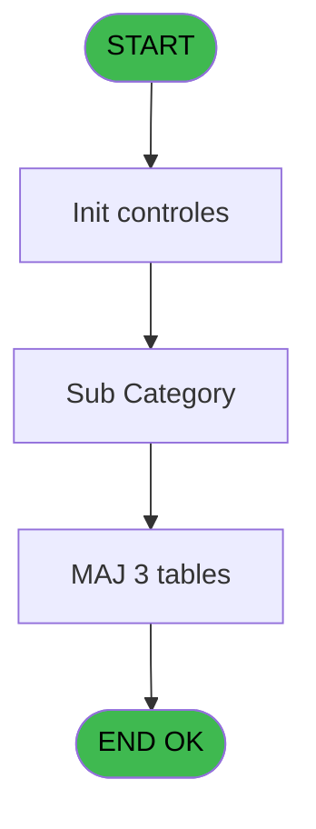
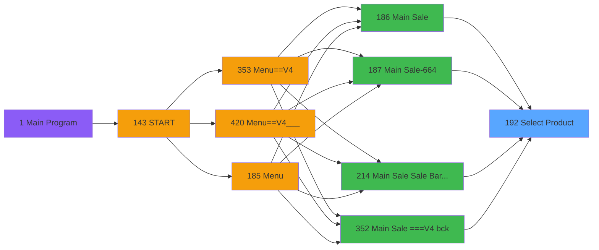
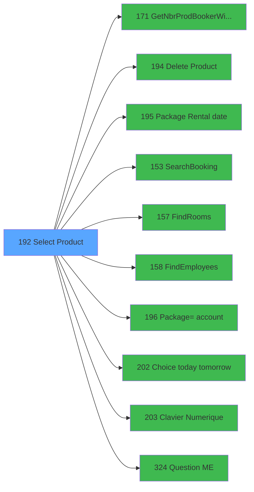

# PVE IDE 192 - Select Product

> **Analyse**: Phases 1-4 2026-02-03 18:48 -> 18:48 (19s) | Assemblage 18:48
> **Pipeline**: V7.2 Enrichi
> **Structure**: 4 onglets (Resume | Ecrans | Donnees | Connexions)

<!-- TAB:Resume -->

## 1. FICHE D'IDENTITE

| Attribut | Valeur |
|----------|--------|
| Projet | PVE |
| IDE Position | 192 |
| Nom Programme | Select Product |
| Fichier source | `Prg_192.xml` |
| Dossier IDE | Mobile |
| Taches | 9 (4 ecrans visibles) |
| Tables modifiees | 3 |
| Programmes appeles | 10 |

## 2. DESCRIPTION FONCTIONNELLE

**Select Product** assure la gestion complete de ce processus, accessible depuis [Main Sale ===V4 (IDE 0)](PVE-IDE-0.md), [Main Sale (IDE 186)](PVE-IDE-186.md), [Main Sale-664 (IDE 187)](PVE-IDE-187.md), [Main Sale Sale Bar Code (IDE 214)](PVE-IDE-214.md), [Main Sale ===V4 bck (IDE 352)](PVE-IDE-352.md), [Main Sale ===V4 (IDE 354)](PVE-IDE-354.md), [Main Sale ===V4 (IDE 359)](PVE-IDE-359.md), [Main Sale (IDE 363)](PVE-IDE-363.md), [Main Sale-664 (IDE 364)](PVE-IDE-364.md), [Main Sale ===V4 (IDE 409)](PVE-IDE-409.md), [Main Sale ===V4 (IDE 415)](PVE-IDE-415.md), [Main Sale ===V4 Booking ACTUEL (IDE 417)](PVE-IDE-417.md), [Main Sale (IDE 440)](PVE-IDE-440.md).

Le flux de traitement s'organise en **3 blocs fonctionnels** :

- **Traitement** (5 taches) : traitements metier divers
- **Impression** (3 taches) : generation de tickets et documents
- **Consultation** (1 tache) : ecrans de recherche, selection et consultation

**Donnees modifiees** : 3 tables en ecriture (pv_cust_rentals, pv_sellers, Table_1539).

**Logique metier** : 3 regles identifiees couvrant conditions metier, valeurs par defaut.

Detail : phases du traitement

#### Phase 1 : Consultation (1 tache)

- **192** - Select Product **[[ECRAN]](#ecran-t1)**

Delegue a : [GetNbrProdBookerWithoutBooking (IDE 171)](PVE-IDE-171.md)

#### Phase 2 : Traitement (5 taches)

- **192.1** - Sub Category **[[ECRAN]](#ecran-t2)**
- **192.1.1** - Product **[[ECRAN]](#ecran-t3)**
- **192.3** - SetBookingID
- **192.4** - Détermine si mineur
- **192.1.1.2** - Mise à jour des produits sémin

Delegue a : [GetNbrProdBookerWithoutBooking (IDE 171)](PVE-IDE-171.md), [Delete Product (IDE 194)](PVE-IDE-194.md), [  Package Rental date (IDE 195)](PVE-IDE-195.md), [SearchBooking (IDE 153)](PVE-IDE-153.md), [FindRooms (IDE 157)](PVE-IDE-157.md), [FindEmployees (IDE 158)](PVE-IDE-158.md), [      Package=> account (IDE 196)](PVE-IDE-196.md), [Choice today tomorrow (IDE 202)](PVE-IDE-202.md), [Clavier Numerique (IDE 203)](PVE-IDE-203.md), [Question M&E (IDE 324)](PVE-IDE-324.md)

#### Phase 3 : Impression (3 taches)

- **192.1.1.1** - Ticket **[[ECRAN]](#ecran-t4)**
- **192.1.1.1.1** - Vidage Ticket
- **192.2** - Vidage Ticket

#### Tables impactees

| Table | Operations | Role metier |
|-------|-----------|-------------|
| pv_sellers | **W**/L (4 usages) |  |
| pv_cust_rentals | **W** (3 usages) |  |
| Table_1539 | **W** (1 usages) |  |

## 3. BLOCS FONCTIONNELS

### 3.1 Consultation (1 tache)

Ecrans de recherche et consultation.

---

#### 192 - Select Product [[ECRAN]](#ecran-t1)

**Role** : Traitement : Select Product.
**Ecran** : 1414 x 308 DLU (Type6) | [Voir mockup](#ecran-t1)
**Variables liees** : BA (v.ProductIdBooker)

### 3.2 Traitement (5 taches)

Traitements internes.

---

#### 192.1 - Sub Category [[ECRAN]](#ecran-t2)

**Role** : Traitement : Sub Category.
**Ecran** : 444 x 218 DLU | [Voir mockup](#ecran-t2)
**Delegue a** : [GetNbrProdBookerWithoutBooking (IDE 171)](PVE-IDE-171.md), [Delete Product (IDE 194)](PVE-IDE-194.md), [  Package Rental date (IDE 195)](PVE-IDE-195.md)

---

#### 192.1.1 - Product [[ECRAN]](#ecran-t3)

**Role** : Traitement : Product.
**Ecran** : 611 x 216 DLU | [Voir mockup](#ecran-t3)
**Variables liees** : BA (v.ProductIdBooker)
**Delegue a** : [GetNbrProdBookerWithoutBooking (IDE 171)](PVE-IDE-171.md), [Delete Product (IDE 194)](PVE-IDE-194.md), [  Package Rental date (IDE 195)](PVE-IDE-195.md)

---

#### 192.3 - SetBookingID

**Role** : Traitement : SetBookingID.
**Delegue a** : [GetNbrProdBookerWithoutBooking (IDE 171)](PVE-IDE-171.md), [Delete Product (IDE 194)](PVE-IDE-194.md), [  Package Rental date (IDE 195)](PVE-IDE-195.md)

---

#### 192.4 - Détermine si mineur

**Role** : Traitement : Détermine si mineur.
**Variables liees** : BC (V.Mineur ?)
**Delegue a** : [GetNbrProdBookerWithoutBooking (IDE 171)](PVE-IDE-171.md), [Delete Product (IDE 194)](PVE-IDE-194.md), [  Package Rental date (IDE 195)](PVE-IDE-195.md)

---

#### 192.1.1.2 - Mise à jour des produits sémin

**Role** : Traitement : Mise à jour des produits sémin.
**Variables liees** : D (P.date debut sejour), F (P.Fin sejour)
**Delegue a** : [GetNbrProdBookerWithoutBooking (IDE 171)](PVE-IDE-171.md), [Delete Product (IDE 194)](PVE-IDE-194.md), [  Package Rental date (IDE 195)](PVE-IDE-195.md)

### 3.3 Impression (3 taches)

Generation des documents et tickets.

---

#### 192.1.1.1 - Ticket [[ECRAN]](#ecran-t4)

**Role** : Generation du document : Ticket.
**Ecran** : 170 x 294 DLU | [Voir mockup](#ecran-t4)
**Variables liees** : N (v.TotalTicket)

---

#### 192.1.1.1.1 - Vidage Ticket

**Role** : Generation du document : Vidage Ticket.
**Variables liees** : N (v.TotalTicket)

---

#### 192.2 - Vidage Ticket

**Role** : Generation du document : Vidage Ticket.
**Variables liees** : N (v.TotalTicket)

## 5. REGLES METIER

3 regles identifiees:

### Autres (3 regles)

#### [RM-001] Valeur par defaut si Trim(v.Stock [H]) est vide

| Element | Detail |
|---------|--------|
| **Condition** | `Trim(v.Stock [H])=''` |
| **Si vrai** | '01' |
| **Si faux** | v.Stock [H]) |
| **Variables** | H (v.Stock) |
| **Expression source** | Expression 1 : `IF(Trim(v.Stock [H])='','01',v.Stock [H])` |
| **Exemple** | Si Trim(v.Stock [H])='' → '01'. Sinon → v.Stock [H]) |

#### [RM-002] Si VG41 alors 'p.V.valid_all [C]'FORM sinon 'p.Masque_Sans_Z [B]'FORM)

| Element | Detail |
|---------|--------|
| **Condition** | `VG41` |
| **Si vrai** | 'p.V.valid_all [C]'FORM |
| **Si faux** | 'p.Masque_Sans_Z [B]'FORM) |
| **Variables** | B (p.Masque_Sans_Z), C (p.V.valid_all) |
| **Expression source** | Expression 5 : `IF(VG41,'p.V.valid_all [C]'FORM,'p.Masque_Sans_Z [B]'FORM)` |
| **Exemple** | Si VG41 → 'p.V.valid_all [C]'FORM. Sinon → 'p.Masque_Sans_Z [B]'FORM) |

#### [RM-003] Si [AM] alors v.NbrProdWithoutBooking [W] AND [AA] sinon v.NbrProdWithoutBooking [W])

| Element | Detail |
|---------|--------|
| **Condition** | `[AM]` |
| **Si vrai** | v.NbrProdWithoutBooking [W] AND [AA] |
| **Si faux** | v.NbrProdWithoutBooking [W]) |
| **Variables** | W (v.NbrProdWithoutBooking) |
| **Expression source** | Expression 12 : `IF([AM],v.NbrProdWithoutBooking [W] AND [AA],v.NbrProdWithou` |
| **Exemple** | Si [AM] → v.NbrProdWithoutBooking [W] AND [AA]. Sinon → v.NbrProdWithoutBooking [W]) |

## 6. CONTEXTE

- **Appele par**: [Main Sale ===V4 (IDE 0)](PVE-IDE-0.md), [Main Sale (IDE 186)](PVE-IDE-186.md), [Main Sale-664 (IDE 187)](PVE-IDE-187.md), [Main Sale Sale Bar Code (IDE 214)](PVE-IDE-214.md), [Main Sale ===V4 bck (IDE 352)](PVE-IDE-352.md), [Main Sale ===V4 (IDE 354)](PVE-IDE-354.md), [Main Sale ===V4 (IDE 359)](PVE-IDE-359.md), [Main Sale (IDE 363)](PVE-IDE-363.md), [Main Sale-664 (IDE 364)](PVE-IDE-364.md), [Main Sale ===V4 (IDE 409)](PVE-IDE-409.md), [Main Sale ===V4 (IDE 415)](PVE-IDE-415.md), [Main Sale ===V4 Booking ACTUEL (IDE 417)](PVE-IDE-417.md), [Main Sale (IDE 440)](PVE-IDE-440.md)
- **Appelle**: 10 programmes | **Tables**: 11 (W:3 R:3 L:7) | **Taches**: 9 | **Expressions**: 58

<!-- TAB:Ecrans -->

## 8. ECRANS

### 8.1 Forms visibles (4 / 9)

| # | Position | Tache | Nom | Type | Largeur | Hauteur | Bloc |
|---|----------|-------|-----|------|---------|---------|------|
| 1 | 192 | 192 | Select Product | Type6 | 1414 | 308 | Consultation |
| 2 | 192.1 | 192.1 | Sub Category | Type0 | 444 | 218 | Traitement |
| 3 | 192.1.1 | 192.1.1 | Product | Type0 | 611 | 216 | Traitement |
| 4 | 192.1.1.1 | 192.1.1.1 | Ticket | Type0 | 170 | 294 | Impression |

### 8.2 Mockups Ecrans

---

#### 192 - Select Product
**Tache** : [192](#t1) | **Type** : Type6 | **Dimensions** : 1414 x 308 DLU
**Bloc** : Consultation | **Titre IDE** : Select Product

<!-- FORM-DATA:
{
    "width":  1414,
    "vFactor":  8,
    "type":  "Type6",
    "hFactor":  8,
    "controls":  [
                     {
                         "x":  0,
                         "type":  "label",
                         "var":  "",
                         "y":  0,
                         "w":  1412,
                         "fmt":  "",
                         "name":  "",
                         "h":  31,
                         "color":  "189",
                         "text":  "",
                         "parent":  null
                     },
                     {
                         "x":  40,
                         "type":  "label",
                         "var":  "",
                         "y":  11,
                         "w":  282,
                         "fmt":  "",
                         "name":  "",
                         "h":  10,
                         "color":  "186",
                         "text":  "Select your product",
                         "parent":  1
                     },
                     {
                         "x":  0,
                         "type":  "label",
                         "var":  "",
                         "y":  31,
                         "w":  246,
                         "fmt":  "",
                         "name":  "",
                         "h":  231,
                         "color":  "183",
                         "text":  "",
                         "parent":  null
                     },
                     {
                         "x":  248,
                         "type":  "label",
                         "var":  "",
                         "y":  31,
                         "w":  1164,
                         "fmt":  "",
                         "name":  "",
                         "h":  231,
                         "color":  "183",
                         "text":  "",
                         "parent":  null
                     },
                     {
                         "x":  254,
                         "type":  "label",
                         "var":  "",
                         "y":  33,
                         "w":  180,
                         "fmt":  "",
                         "name":  "",
                         "h":  7,
                         "color":  "183",
                         "text":  "Category",
                         "parent":  null
                     },
                     {
                         "x":  554,
                         "type":  "label",
                         "var":  "",
                         "y":  33,
                         "w":  142,
                         "fmt":  "",
                         "name":  "",
                         "h":  7,
                         "color":  "183",
                         "text":  "Sub Category",
                         "parent":  null
                     },
                     {
                         "x":  870,
                         "type":  "label",
                         "var":  "",
                         "y":  33,
                         "w":  142,
                         "fmt":  "",
                         "name":  "",
                         "h":  7,
                         "color":  "183",
                         "text":  "Product",
                         "parent":  null
                     },
                     {
                         "x":  1214,
                         "type":  "label",
                         "var":  "",
                         "y":  33,
                         "w":  142,
                         "fmt":  "",
                         "name":  "",
                         "h":  7,
                         "color":  "183",
                         "text":  "Ticket",
                         "parent":  null
                     },
                     {
                         "x":  16,
                         "type":  "label",
                         "var":  "",
                         "y":  40,
                         "w":  70,
                         "fmt":  "",
                         "name":  "",
                         "h":  15,
                         "color":  "187",
                         "text":  "Stock",
                         "parent":  4
                     },
                     {
                         "x":  16,
                         "type":  "label",
                         "var":  "",
                         "y":  61,
                         "w":  70,
                         "fmt":  "",
                         "name":  "",
                         "h":  15,
                         "color":  "187",
                         "text":  "Quantity",
                         "parent":  4
                     },
                     {
                         "x":  16,
                         "type":  "label",
                         "var":  "",
                         "y":  82,
                         "w":  70,
                         "fmt":  "",
                         "name":  "",
                         "h":  15,
                         "color":  "187",
                         "text":  "Price",
                         "parent":  4
                     },
                     {
                         "x":  0,
                         "type":  "label",
                         "var":  "",
                         "y":  282,
                         "w":  1412,
                         "fmt":  "",
                         "name":  "",
                         "h":  26,
                         "color":  "6",
                         "text":  "",
                         "parent":  null
                     },
                     {
                         "x":  250,
                         "type":  "table",
                         "var":  "",
                         "name":  "",
                         "titleH":  12,
                         "color":  "183",
                         "w":  190,
                         "y":  42,
                         "fmt":  "",
                         "parent":  null,
                         "text":  "",
                         "rowH":  24,
                         "h":  218,
                         "cols":  [
                                      {
                                          "title":  "label",
                                          "layer":  1,
                                          "w":  184
                                      }
                                  ],
                         "rows":  1
                     },
                     {
                         "x":  1338,
                         "type":  "image",
                         "var":  "",
                         "y":  2,
                         "w":  70,
                         "fmt":  "",
                         "name":  "",
                         "h":  27,
                         "color":  "",
                         "text":  "",
                         "parent":  1
                     },
                     {
                         "x":  122,
                         "type":  "edit",
                         "var":  "",
                         "y":  40,
                         "w":  108,
                         "fmt":  "",
                         "name":  "v.Stock",
                         "h":  15,
                         "color":  "183",
                         "text":  "",
                         "parent":  4
                     },
                     {
                         "x":  254,
                         "type":  "button",
                         "var":  "",
                         "y":  43,
                         "w":  180,
                         "fmt":  "",
                         "name":  "label",
                         "h":  24,
                         "color":  "",
                         "text":  "",
                         "parent":  19
                     },
                     {
                         "x":  440,
                         "type":  "button",
                         "var":  "",
                         "y":  42,
                         "w":  72,
                         "fmt":  "ñ",
                         "name":  "UP",
                         "h":  108,
                         "color":  "",
                         "text":  "",
                         "parent":  null
                     },
                     {
                         "x":  516,
                         "type":  "subform",
                         "var":  "",
                         "y":  43,
                         "w":  896,
                         "fmt":  "",
                         "name":  "SF_CATEG",
                         "h":  218,
                         "color":  "",
                         "text":  "",
                         "parent":  null
                     },
                     {
                         "x":  122,
                         "type":  "edit",
                         "var":  "",
                         "y":  61,
                         "w":  108,
                         "fmt":  "",
                         "name":  "v.Qté",
                         "h":  15,
                         "color":  "",
                         "text":  "",
                         "parent":  4
                     },
                     {
                         "x":  122,
                         "type":  "edit",
                         "var":  "",
                         "y":  82,
                         "w":  108,
                         "fmt":  "12",
                         "name":  "v.PrixSaisie",
                         "h":  15,
                         "color":  "",
                         "text":  "",
                         "parent":  4
                     },
                     {
                         "x":  8,
                         "type":  "button",
                         "var":  "",
                         "y":  110,
                         "w":  72,
                         "fmt":  "1",
                         "name":  "1",
                         "h":  27,
                         "color":  "",
                         "text":  "",
                         "parent":  4
                     },
                     {
                         "x":  88,
                         "type":  "button",
                         "var":  "",
                         "y":  110,
                         "w":  72,
                         "fmt":  "2",
                         "name":  "2",
                         "h":  27,
                         "color":  "",
                         "text":  "",
                         "parent":  4
                     },
                     {
                         "x":  166,
                         "type":  "button",
                         "var":  "",
                         "y":  110,
                         "w":  72,
                         "fmt":  "3",
                         "name":  "3",
                         "h":  27,
                         "color":  "",
                         "text":  "",
                         "parent":  4
                     },
                     {
                         "x":  8,
                         "type":  "button",
                         "var":  "",
                         "y":  140,
                         "w":  72,
                         "fmt":  "4",
                         "name":  "4",
                         "h":  27,
                         "color":  "",
                         "text":  "",
                         "parent":  4
                     },
                     {
                         "x":  88,
                         "type":  "button",
                         "var":  "",
                         "y":  140,
                         "w":  72,
                         "fmt":  "5",
                         "name":  "5",
                         "h":  27,
                         "color":  "",
                         "text":  "",
                         "parent":  4
                     },
                     {
                         "x":  166,
                         "type":  "button",
                         "var":  "",
                         "y":  140,
                         "w":  72,
                         "fmt":  "6",
                         "name":  "6",
                         "h":  27,
                         "color":  "",
                         "text":  "",
                         "parent":  4
                     },
                     {
                         "x":  440,
                         "type":  "button",
                         "var":  "",
                         "y":  150,
                         "w":  72,
                         "fmt":  "ò",
                         "name":  "DOWN",
                         "h":  110,
                         "color":  "",
                         "text":  "",
                         "parent":  null
                     },
                     {
                         "x":  8,
                         "type":  "button",
                         "var":  "",
                         "y":  170,
                         "w":  72,
                         "fmt":  "7",
                         "name":  "7",
                         "h":  27,
                         "color":  "",
                         "text":  "",
                         "parent":  4
                     },
                     {
                         "x":  88,
                         "type":  "button",
                         "var":  "",
                         "y":  170,
                         "w":  72,
                         "fmt":  "8",
                         "name":  "8",
                         "h":  27,
                         "color":  "",
                         "text":  "",
                         "parent":  4
                     },
                     {
                         "x":  166,
                         "type":  "button",
                         "var":  "",
                         "y":  170,
                         "w":  72,
                         "fmt":  "9",
                         "name":  "9",
                         "h":  27,
                         "color":  "",
                         "text":  "",
                         "parent":  4
                     },
                     {
                         "x":  8,
                         "type":  "button",
                         "var":  "",
                         "y":  200,
                         "w":  72,
                         "fmt":  "Clear",
                         "name":  "Clear",
                         "h":  57,
                         "color":  "",
                         "text":  "",
                         "parent":  4
                     },
                     {
                         "x":  88,
                         "type":  "button",
                         "var":  "",
                         "y":  200,
                         "w":  72,
                         "fmt":  "0",
                         "name":  "0",
                         "h":  27,
                         "color":  "",
                         "text":  "",
                         "parent":  4
                     },
                     {
                         "x":  166,
                         "type":  "button",
                         "var":  "",
                         "y":  200,
                         "w":  72,
                         "fmt":  "Del",
                         "name":  "Del",
                         "h":  57,
                         "color":  "",
                         "text":  "",
                         "parent":  4
                     },
                     {
                         "x":  88,
                         "type":  "button",
                         "var":  "",
                         "y":  230,
                         "w":  72,
                         "fmt":  ".",
                         "name":  "POINT",
                         "h":  27,
                         "color":  "",
                         "text":  "",
                         "parent":  4
                     },
                     {
                         "x":  646,
                         "type":  "edit",
                         "var":  "",
                         "y":  268,
                         "w":  602,
                         "fmt":  "",
                         "name":  "V.Désigantion",
                         "h":  11,
                         "color":  "183",
                         "text":  "",
                         "parent":  null
                     },
                     {
                         "x":  1280,
                         "type":  "edit",
                         "var":  "",
                         "y":  268,
                         "w":  112,
                         "fmt":  "N8.3Z",
                         "name":  "v.TotalTicket",
                         "h":  11,
                         "color":  "183",
                         "text":  "",
                         "parent":  null
                     },
                     {
                         "x":  232,
                         "type":  "button",
                         "var":  "",
                         "y":  286,
                         "w":  382,
                         "fmt":  "Cancel Order",
                         "name":  "CANCEL",
                         "h":  18,
                         "color":  "",
                         "text":  "",
                         "parent":  null
                     },
                     {
                         "x":  628,
                         "type":  "button",
                         "var":  "",
                         "y":  286,
                         "w":  382,
                         "fmt":  "Validate Order",
                         "name":  "VALID",
                         "h":  18,
                         "color":  "",
                         "text":  "",
                         "parent":  null
                     },
                     {
                         "x":  1024,
                         "type":  "button",
                         "var":  "",
                         "y":  286,
                         "w":  382,
                         "fmt":  "Make full payment",
                         "name":  "FULL",
                         "h":  18,
                         "color":  "",
                         "text":  "",
                         "parent":  null
                     }
                 ],
    "taskId":  "192",
    "height":  308
}
-->

<strong>Champs : 5 champs</strong>

| Pos (x,y) | Nom | Variable | Type |
|-----------|-----|----------|------|
| 122,40 | v.Stock | - | edit |
| 122,61 | v.Qté | - | edit |
| 122,82 | v.PrixSaisie | - | edit |
| 646,268 | V.Désigantion | - | edit |
| 1280,268 | v.TotalTicket | - | edit |

<strong>Boutons : 19 boutons</strong>

| Bouton | Pos (x,y) | Action |
|--------|-----------|--------|
| label | 254,43 | Bouton fonctionnel |
| ñ | 440,42 | Bouton fonctionnel |
| 1 | 8,110 | Bouton fonctionnel |
| 2 | 88,110 | Bouton fonctionnel |
| 3 | 166,110 | Bouton fonctionnel |
| 4 | 8,140 | Bouton fonctionnel |
| 5 | 88,140 | Bouton fonctionnel |
| 6 | 166,140 | Bouton fonctionnel |
| ò | 440,150 | Bouton fonctionnel |
| 7 | 8,170 | Bouton fonctionnel |
| 8 | 88,170 | Bouton fonctionnel |
| 9 | 166,170 | Bouton fonctionnel |
| Clear | 8,200 | Bouton fonctionnel |
| 0 | 88,200 | Bouton fonctionnel |
| Del | 166,200 | Appel [Delete Product (IDE 194)](PVE-IDE-194.md) |
| . | 88,230 | Bouton fonctionnel |
| Cancel Order | 232,286 | Annule et retour au menu |
| Validate Order | 628,286 | Valide la saisie et enregistre |
| Make full payment | 1024,286 | Bouton fonctionnel |

---

#### 192.1 - Sub Category
**Tache** : [192.1](#t2) | **Type** : Type0 | **Dimensions** : 444 x 218 DLU
**Bloc** : Traitement | **Titre IDE** : Sub Category

<!-- FORM-DATA:
{
    "width":  444,
    "vFactor":  8,
    "type":  "Type0",
    "hFactor":  4,
    "controls":  [
                     {
                         "x":  0,
                         "type":  "table",
                         "var":  "",
                         "name":  "",
                         "titleH":  12,
                         "color":  "183",
                         "w":  99,
                         "y":  0,
                         "fmt":  "",
                         "parent":  null,
                         "text":  "",
                         "rowH":  24,
                         "h":  216,
                         "cols":  [
                                      {
                                          "title":  "",
                                          "layer":  1,
                                          "w":  96
                                      }
                                  ],
                         "rows":  1
                     },
                     {
                         "x":  2,
                         "type":  "button",
                         "var":  "",
                         "y":  1,
                         "w":  94,
                         "fmt":  "",
                         "name":  "SUB_CAT",
                         "h":  23,
                         "color":  "",
                         "text":  "",
                         "parent":  1
                     },
                     {
                         "x":  99,
                         "type":  "button",
                         "var":  "",
                         "y":  0,
                         "w":  36,
                         "fmt":  "ñ",
                         "name":  "UP",
                         "h":  108,
                         "color":  "",
                         "text":  "",
                         "parent":  null
                     },
                     {
                         "x":  135,
                         "type":  "subform",
                         "var":  "",
                         "y":  0,
                         "w":  306,
                         "fmt":  "",
                         "name":  "SF_Product",
                         "h":  216,
                         "color":  "",
                         "text":  "",
                         "parent":  null
                     },
                     {
                         "x":  99,
                         "type":  "button",
                         "var":  "",
                         "y":  108,
                         "w":  36,
                         "fmt":  "ò",
                         "name":  "DOWN",
                         "h":  108,
                         "color":  "",
                         "text":  "",
                         "parent":  null
                     }
                 ],
    "taskId":  "192.1",
    "height":  218
}
-->

<strong>Boutons : 3 boutons</strong>

| Bouton | Pos (x,y) | Action |
|--------|-----------|--------|
| SUB_CAT | 2,1 | Bouton fonctionnel |
| ñ | 99,0 | Bouton fonctionnel |
| ò | 99,108 | Bouton fonctionnel |

---

#### 192.1.1 - Product
**Tache** : [192.1.1](#t3) | **Type** : Type0 | **Dimensions** : 611 x 216 DLU
**Bloc** : Traitement | **Titre IDE** : Product

<!-- FORM-DATA:
{
    "width":  611,
    "vFactor":  8,
    "type":  "Type0",
    "hFactor":  8,
    "controls":  [
                     {
                         "x":  0,
                         "type":  "table",
                         "var":  "",
                         "name":  "",
                         "titleH":  12,
                         "color":  "183",
                         "w":  291,
                         "y":  0,
                         "fmt":  "",
                         "parent":  null,
                         "text":  "",
                         "rowH":  25,
                         "h":  216,
                         "cols":  [
                                      {
                                          "title":  "",
                                          "layer":  1,
                                          "w":  190
                                      },
                                      {
                                          "title":  "",
                                          "layer":  2,
                                          "w":  94
                                      }
                                  ],
                         "rows":  2
                     },
                     {
                         "x":  5,
                         "type":  "button",
                         "var":  "",
                         "y":  2,
                         "w":  188,
                         "fmt":  "",
                         "name":  "SAVE",
                         "h":  23,
                         "color":  "",
                         "text":  "",
                         "parent":  1
                     },
                     {
                         "x":  196,
                         "type":  "edit",
                         "var":  "",
                         "y":  3,
                         "w":  90,
                         "fmt":  "N12.3C",
                         "name":  "prix_de_vente",
                         "h":  22,
                         "color":  "",
                         "text":  "",
                         "parent":  1
                     },
                     {
                         "x":  290,
                         "type":  "button",
                         "var":  "",
                         "y":  0,
                         "w":  72,
                         "fmt":  "ñ",
                         "name":  "UP",
                         "h":  108,
                         "color":  "",
                         "text":  "",
                         "parent":  null
                     },
                     {
                         "x":  362,
                         "type":  "subform",
                         "var":  "",
                         "y":  1,
                         "w":  249,
                         "fmt":  "",
                         "name":  "SF_Ticket",
                         "h":  214,
                         "color":  "",
                         "text":  "",
                         "parent":  null
                     },
                     {
                         "x":  290,
                         "type":  "button",
                         "var":  "",
                         "y":  108,
                         "w":  72,
                         "fmt":  "ò",
                         "name":  "DOWN",
                         "h":  107,
                         "color":  "",
                         "text":  "",
                         "parent":  null
                     }
                 ],
    "taskId":  "192.1.1",
    "height":  216
}
-->

<strong>Champs : 1 champs</strong>

| Pos (x,y) | Nom | Variable | Type |
|-----------|-----|----------|------|
| 196,3 | prix_de_vente | - | edit |

<strong>Boutons : 3 boutons</strong>

| Bouton | Pos (x,y) | Action |
|--------|-----------|--------|
| SAVE | 5,2 | Bouton fonctionnel |
| ñ | 290,0 | Bouton fonctionnel |
| ò | 290,108 | Bouton fonctionnel |

---

#### 192.1.1.1 - Ticket
**Tache** : [192.1.1.1](#t4) | **Type** : Type0 | **Dimensions** : 170 x 294 DLU
**Bloc** : Impression | **Titre IDE** : Ticket

<!-- FORM-DATA:
{
    "width":  170,
    "vFactor":  8,
    "type":  "Type0",
    "hFactor":  4,
    "controls":  [
                     {
                         "x":  0,
                         "type":  "table",
                         "var":  "",
                         "name":  "",
                         "titleH":  12,
                         "color":  "6",
                         "w":  173,
                         "y":  2,
                         "fmt":  "",
                         "parent":  null,
                         "text":  "",
                         "rowH":  32,
                         "h":  293,
                         "cols":  [
                                      {
                                          "title":  "",
                                          "layer":  1,
                                          "w":  20
                                      },
                                      {
                                          "title":  "",
                                          "layer":  2,
                                          "w":  103
                                      },
                                      {
                                          "title":  "",
                                          "layer":  3,
                                          "w":  46
                                      }
                                  ],
                         "rows":  3
                     },
                     {
                         "x":  3,
                         "type":  "edit",
                         "var":  "",
                         "y":  7,
                         "w":  16,
                         "fmt":  "N9",
                         "name":  "cpk_quantity",
                         "h":  27,
                         "color":  "6",
                         "text":  "",
                         "parent":  1
                     },
                     {
                         "x":  20,
                         "type":  "button",
                         "var":  "",
                         "y":  3,
                         "w":  102,
                         "fmt":  "",
                         "name":  "DELETE",
                         "h":  31,
                         "color":  "",
                         "text":  "",
                         "parent":  1
                     },
                     {
                         "x":  125,
                         "type":  "edit",
                         "var":  "",
                         "y":  7,
                         "w":  45,
                         "fmt":  "N10C",
                         "name":  "price",
                         "h":  27,
                         "color":  "6",
                         "text":  "",
                         "parent":  1
                     }
                 ],
    "taskId":  "192.1.1.1",
    "height":  294
}
-->

<strong>Champs : 2 champs</strong>

| Pos (x,y) | Nom | Variable | Type |
|-----------|-----|----------|------|
| 3,7 | cpk_quantity | - | edit |
| 125,7 | price | - | edit |

<strong>Boutons : 1 boutons</strong>

| Bouton | Pos (x,y) | Action |
|--------|-----------|--------|
| DELETE | 20,3 | Appel [Delete Product (IDE 194)](PVE-IDE-194.md) |

## 9. NAVIGATION

### 9.1 Enchainement des ecrans

```mermaid
flowchart TD
    START([Entree])
    style START fill:#3fb950
    VF1[192 Select Product]
    style VF1 fill:#58a6ff
    VF2[192.1 Sub Category]
    style VF2 fill:#58a6ff
    VF3[192.1.1 Product]
    style VF3 fill:#58a6ff
    VF4[192.1.1.1 Ticket]
    style VF4 fill:#58a6ff
    EXT171[IDE 171 GetNbrProdBook...]
    style EXT171 fill:#3fb950
    EXT194[IDE 194 Delete Product]
    style EXT194 fill:#3fb950
    EXT195[IDE 195 Package Rental...]
    style EXT195 fill:#3fb950
    EXT153[IDE 153 SearchBooking]
    style EXT153 fill:#3fb950
    EXT157[IDE 157 FindRooms]
    style EXT157 fill:#3fb950
    EXT158[IDE 158 FindEmployees]
    style EXT158 fill:#3fb950
    EXT196[IDE 196 Package= account]
    style EXT196 fill:#3fb950
    EXT202[IDE 202 Choice today t...]
    style EXT202 fill:#3fb950
    EXT203[IDE 203 Clavier Numerique]
    style EXT203 fill:#3fb950
    EXT324[IDE 324 Question ME]
    style EXT324 fill:#3fb950
    FIN([Sortie])
    style FIN fill:#f85149
    START --> VF1
    VF1 -->|Recuperation donnees| EXT171
    VF1 -->|Sous-programme| EXT194
    VF1 -->|Sous-programme| EXT195
    VF1 -->|Sous-programme| EXT153
    VF1 -->|Sous-programme| EXT157
    VF1 -->|Sous-programme| EXT158
    VF1 -->|Sous-programme| EXT196
    VF1 -->|Sous-programme| EXT202
    EXT324 --> FIN
```

**Detail par enchainement :**

| Depuis | Action | Vers | Retour |
|--------|--------|------|--------|
| Select Product | Recuperation donnees | [GetNbrProdBookerWithoutBooking (IDE 171)](PVE-IDE-171.md) | Retour ecran |
| Select Product | Sous-programme | [Delete Product (IDE 194)](PVE-IDE-194.md) | Retour ecran |
| Select Product | Sous-programme | [  Package Rental date (IDE 195)](PVE-IDE-195.md) | Retour ecran |
| Select Product | Sous-programme | [SearchBooking (IDE 153)](PVE-IDE-153.md) | Retour ecran |
| Select Product | Sous-programme | [FindRooms (IDE 157)](PVE-IDE-157.md) | Retour ecran |
| Select Product | Sous-programme | [FindEmployees (IDE 158)](PVE-IDE-158.md) | Retour ecran |
| Select Product | Sous-programme | [      Package=> account (IDE 196)](PVE-IDE-196.md) | Retour ecran |
| Select Product | Sous-programme | [Choice today tomorrow (IDE 202)](PVE-IDE-202.md) | Retour ecran |
| Select Product | Sous-programme | [Clavier Numerique (IDE 203)](PVE-IDE-203.md) | Retour ecran |
| Select Product | Sous-programme | [Question M&E (IDE 324)](PVE-IDE-324.md) | Retour ecran |

### 9.3 Structure hierarchique (9 taches)

| Position | Tache | Type | Dimensions | Bloc |
|----------|-------|------|------------|------|
| **192.1** | [**Select Product** (192)](#t1) [mockup](#ecran-t1) | Type6 | 1414x308 | Consultation |
| **192.2** | [**Sub Category** (192.1)](#t2) [mockup](#ecran-t2) | - | 444x218 | Traitement |
| 192.2.1 | [Product (192.1.1)](#t3) [mockup](#ecran-t3) | - | 611x216 | |
| 192.2.2 | [SetBookingID (192.3)](#t7) | - | - | |
| 192.2.3 | [Détermine si mineur (192.4)](#t8) | - | - | |
| 192.2.4 | [Mise à jour des produits sémin (192.1.1.2)](#t12) | - | - | |
| **192.3** | [**Ticket** (192.1.1.1)](#t4) [mockup](#ecran-t4) | - | 170x294 | Impression |
| 192.3.1 | [Vidage Ticket (192.1.1.1.1)](#t5) | - | - | |
| 192.3.2 | [Vidage Ticket (192.2)](#t6) | - | - | |

### 9.4 Algorigramme

> **Legende**: Vert = START/END OK | Rouge = END KO | Bleu = Decisions
> *Algorigramme auto-genere. Utiliser `/algorigramme` pour une synthese metier detaillee.*

<!-- TAB:Donnees -->

## 10. TABLES

### Tables utilisees (11)

| ID | Nom | Description | Type | R | W | L | Usages |
|----|-----|-------------|------|---|---|---|--------|
| 36 | client_gm |  | DB | R |   |   | 1 |
| 77 | articles_________art | Articles et stock | DB | R |   |   | 1 |
| 379 | pv_customer_temp |  | DB |   |   | L | 1 |
| 380 | pv_day_modes |  | DB |   |   | L | 1 |
| 382 | pv_discount_reasons |  | DB | R |   | L | 2 |
| 400 | pv_cust_rentals |  | DB |   | **W** |   | 3 |
| 403 | pv_sellers |  | DB |   | **W** | L | 4 |
| 413 | pv_tva |  | DB |   |   | L | 2 |
| 728 | arc_cc_total |  | DB |   |   | L | 1 |
| 1539 | Table_1539 |  | MEM |   | **W** |   | 1 |
| 1670 | Table_1670 |  | MEM |   |   | L | 1 |

### Colonnes par table (6 / 6 tables avec colonnes identifiees)

Table 36 - client_gm (R) - 1 usages

| Lettre | Variable | Acces | Type |
|--------|----------|-------|------|
| A | p.Customer_Id | R | Numeric |
| B | p.Masque_Sans_Z | R | Alpha |
| C | p.V.valid_all | R | Logical |
| D | P.date debut sejour | R | Date |
| E | P.FocusOngletBooking | R | Logical |
| F | P.Fin sejour | R | Date |
| G | P.is_Seminar? | R | Logical |
| H | v.Stock | R | Numeric |
| I | v.Qté | R | Alpha |
| J | V.Désigantion | R | Alpha |
| K | v.Fin | R | Logical |
| L | v.StopDelete | R | Logical |
| M | RetourQuestion | R | Numeric |
| N | v.TotalTicket | R | Numeric |
| O | v.PrixSaisie | R | Alpha |
| P | v.PrixZero | R | Logical |
| Q | v.Cat | R | Numeric |
| R | v.Sub_Cat | R | Numeric |
| S | v.Prod_ID | R | Numeric |
| T | T S/Catégorie | R | Logical |
| U | v. non alcoolise | R | Logical |
| V | v.TotalAValider | R | Numeric |
| W | v.NbrProdWithoutBooking | R | Numeric |
| X | v.BookingID | R | Unicode |
| Y | v.OrderID | R | Numeric |
| Z | v.PackageID | R | Numeric |
| BA | v.ProductIdBooker | R | Numeric |
| BB | v.BtnQuitSearchClicked | R | Logical |
| BC | V.Mineur ? | R | Logical |

Table 77 - articles_________art (R) - 1 usages

| Lettre | Variable | Acces | Type |
|--------|----------|-------|------|
| A | p.Category | R | Numeric |
| B | v.Start_Rental | R | Date |
| C | v.End_Rental | R | Date |
| D | T Article | R | Logical |
| E | T Product | R | Logical |

Table 382 - pv_discount_reasons (R/L) - 2 usages

*Table utilisee uniquement en Link ou aucune colonne Real identifiee dans le DataView.*

Table 400 - pv_cust_rentals (**W**) - 3 usages

| Lettre | Variable | Acces | Type |
|--------|----------|-------|------|
| A | p.Customer_Id | W | Numeric |

Table 403 - pv_sellers (**W**/L) - 4 usages

| Lettre | Variable | Acces | Type |
|--------|----------|-------|------|
| A | p.Category | W | Numeric |
| B | p.Sub_Category | W | Numeric |
| C | v.Retour Massage | W | Numeric |
| D | v.DbleClick | W | Logical |
| E | V.today ? | W | Logical |
| F | V.start rental date | W | Date |
| G | v.Facturé au M&E? | W | Logical |
| H | v.% de réduction | W | Numeric |
| I | v.prix du produit | W | Numeric |
| J | v.Article sans prix | W | Logical |

Table 1539 - Table_1539 (**W**) - 1 usages

*Table utilisee uniquement en Link ou aucune colonne Real identifiee dans le DataView.*

## 11. VARIABLES

### 11.1 Parametres entrants (7)

Variables recues du programme appelant ([Main Sale ===V4 (IDE 0)](PVE-IDE-0.md)).

| Lettre | Nom | Type | Usage dans |
|--------|-----|------|-----------|
| A | p.Customer_Id | Numeric | 1x parametre entrant |
| B | p.Masque_Sans_Z | Alpha | 2x parametre entrant |
| C | p.V.valid_all | Logical | 1x parametre entrant |
| D | P.date debut sejour | Date | - |
| E | P.FocusOngletBooking | Logical | - |
| F | P.Fin sejour | Date | - |
| G | P.is_Seminar? | Logical | - |

### 11.2 Variables de session (20)

Variables persistantes pendant toute la session.

| Lettre | Nom | Type | Usage dans |
|--------|-----|------|-----------|
| H | v.Stock | Numeric | 14x session |
| I | v.Qté | Alpha | - |
| J | V.Désigantion | Alpha | 1x session |
| K | v.Fin | Logical | - |
| L | v.StopDelete | Logical | 1x session |
| N | v.TotalTicket | Numeric | 12x session |
| O | v.PrixSaisie | Alpha | 2x session |
| P | v.PrixZero | Logical | - |
| Q | v.Cat | Numeric | - |
| R | v.Sub_Cat | Numeric | - |
| S | v.Prod_ID | Numeric | 1x session |
| U | v. non alcoolise | Logical | - |
| V | v.TotalAValider | Numeric | - |
| W | v.NbrProdWithoutBooking | Numeric | 1x session |
| X | v.BookingID | Unicode | - |
| Y | v.OrderID | Numeric | - |
| Z | v.PackageID | Numeric | - |
| BA | v.ProductIdBooker | Numeric | - |
| BB | v.BtnQuitSearchClicked | Logical | - |
| BC | V.Mineur ? | Logical | - |

### 11.3 Autres (2)

Variables diverses.

| Lettre | Nom | Type | Usage dans |
|--------|-----|------|-----------|
| M | RetourQuestion | Numeric | 2x refs |
| T | T S/Catégorie | Logical | - |

Toutes les 29 variables (liste complete)

| Cat | Lettre | Nom Variable | Type |
|-----|--------|--------------|------|
| P0 | **A** | p.Customer_Id | Numeric |
| P0 | **B** | p.Masque_Sans_Z | Alpha |
| P0 | **C** | p.V.valid_all | Logical |
| P0 | **D** | P.date debut sejour | Date |
| P0 | **E** | P.FocusOngletBooking | Logical |
| P0 | **F** | P.Fin sejour | Date |
| P0 | **G** | P.is_Seminar? | Logical |
| V. | **H** | v.Stock | Numeric |
| V. | **I** | v.Qté | Alpha |
| V. | **J** | V.Désigantion | Alpha |
| V. | **K** | v.Fin | Logical |
| V. | **L** | v.StopDelete | Logical |
| V. | **N** | v.TotalTicket | Numeric |
| V. | **O** | v.PrixSaisie | Alpha |
| V. | **P** | v.PrixZero | Logical |
| V. | **Q** | v.Cat | Numeric |
| V. | **R** | v.Sub_Cat | Numeric |
| V. | **S** | v.Prod_ID | Numeric |
| V. | **U** | v. non alcoolise | Logical |
| V. | **V** | v.TotalAValider | Numeric |
| V. | **W** | v.NbrProdWithoutBooking | Numeric |
| V. | **X** | v.BookingID | Unicode |
| V. | **Y** | v.OrderID | Numeric |
| V. | **Z** | v.PackageID | Numeric |
| V. | **BA** | v.ProductIdBooker | Numeric |
| V. | **BB** | v.BtnQuitSearchClicked | Logical |
| V. | **BC** | V.Mineur ? | Logical |
| Autre | **M** | RetourQuestion | Numeric |
| Autre | **T** | T S/Catégorie | Logical |

## 12. EXPRESSIONS

**58 / 58 expressions decodees (100%)**

### 12.1 Repartition par type

| Type | Expressions | Regles |
|------|-------------|--------|
| CONDITION | 13 | 3 |
| CONSTANTE | 2 | 0 |
| CAST_LOGIQUE | 6 | 0 |
| NEGATION | 1 | 0 |
| OTHER | 9 | 0 |
| REFERENCE_VG | 2 | 0 |
| STRING | 3 | 0 |
| CONCATENATION | 22 | 0 |

### 12.2 Expressions cles par type

#### CONDITION (13 expressions)

| Type | IDE | Expression | Regle |
|------|-----|------------|-------|
| CONDITION | 12 | `IF([AM],v.NbrProdWithoutBooking [W] AND [AA],v.NbrProdWithoutBooking [W])` | [RM-003](#rm-RM-003) |
| CONDITION | 5 | `IF(VG41,'p.V.valid_all [C]'FORM,'p.Masque_Sans_Z [B]'FORM)` | [RM-002](#rm-RM-002) |
| CONDITION | 1 | `IF(Trim(v.Stock [H])='','01',v.Stock [H])` | [RM-001](#rm-RM-001) |
| CONDITION | 53 | `[AG] <> 1 OR ([AH] <> '' AND [AG] = 1)` | - |
| CONDITION | 51 | `[AG] > 0` | - |
| ... | | *+8 autres* | |

#### CONSTANTE (2 expressions)

| Type | IDE | Expression | Regle |
|------|-----|------------|-------|
| CONSTANTE | 39 | `''` | - |
| CONSTANTE | 9 | `0` | - |

#### CAST_LOGIQUE (6 expressions)

| Type | IDE | Expression | Regle |
|------|-----|------------|-------|
| CAST_LOGIQUE | 16 | `'FALSE'LOG` | - |
| CAST_LOGIQUE | 43 | `'TRUE'LOG` | - |
| CAST_LOGIQUE | 50 | `'TRUE'LOG` | - |
| CAST_LOGIQUE | 3 | `V.Désigantion [J]='TRUE'LOG` | - |
| CAST_LOGIQUE | 4 | `'TRUE'LOG` | - |
| ... | | *+1 autres* | |

#### NEGATION (1 expressions)

| Type | IDE | Expression | Regle |
|------|-----|------------|-------|
| NEGATION | 6 | `NOT v.PrixSaisie [O]` | - |

#### OTHER (9 expressions)

| Type | IDE | Expression | Regle |
|------|-----|------------|-------|
| OTHER | 56 | `[AU]` | - |
| OTHER | 55 | `p.Customer_Id [A]` | - |
| OTHER | 58 | `[AS]` | - |
| OTHER | 57 | `[AT]` | - |
| OTHER | 47 | `SetCrsr(1)` | - |
| ... | | *+4 autres* | |

#### REFERENCE_VG (2 expressions)

| Type | IDE | Expression | Regle |
|------|-----|------------|-------|
| REFERENCE_VG | 54 | `VG92` | - |
| REFERENCE_VG | 44 | `VG65` | - |

#### STRING (3 expressions)

| Type | IDE | Expression | Regle |
|------|-----|------------|-------|
| STRING | 41 | `Del (v.TotalTicket [N],Len (Trim(v.TotalTicket [N])),1)` | - |
| STRING | 40 | `Del (v.Stock [H],Len (Trim(v.Stock [H])),1)` | - |
| STRING | 15 | `Trim(p.Masque_Sans_Z [B])` | - |

#### CONCATENATION (22 expressions)

| Type | IDE | Expression | Regle |
|------|-----|------------|-------|
| CONCATENATION | 31 | `Trim(v.Stock [H])&'7'` | - |
| CONCATENATION | 32 | `Trim(v.TotalTicket [N])&'7'` | - |
| CONCATENATION | 30 | `Trim(v.TotalTicket [N])&'6'` | - |
| CONCATENATION | 28 | `Trim(v.TotalTicket [N])&'5'` | - |
| CONCATENATION | 29 | `Trim(v.Stock [H])&'6'` | - |
| ... | | *+17 autres* | |

### 12.3 Toutes les expressions (58)

Voir les 58 expressions

#### CONDITION (13)

| IDE | Expression Decodee |
|-----|-------------------|
| 1 | `IF(Trim(v.Stock [H])='','01',v.Stock [H])` |
| 5 | `IF(VG41,'p.V.valid_all [C]'FORM,'p.Masque_Sans_Z [B]'FORM)` |
| 12 | `IF([AM],v.NbrProdWithoutBooking [W] AND [AA],v.NbrProdWithoutBooking [W])` |
| 10 | `RetourQuestion [M]>0` |
| 11 | `RetourQuestion [M]=0` |
| 42 | `v.StopDelete [L]=6` |
| 45 | `[AG] = 1` |
| 49 | `([AF] > 0 AND [AG] <= 1) OR NOT(VG65)` |
| 51 | `[AG] > 0` |
| 53 | `[AG] <> 1 OR ([AH] <> '' AND [AG] = 1)` |
| 2 | `Trim(v.Stock [H])='01'` |
| 48 | `Trim([AH]) <> ''` |
| 52 | `[AG] > 1 OR ([AG] = 1 AND Trim([AH]) = '')` |

#### CONSTANTE (2)

| IDE | Expression Decodee |
|-----|-------------------|
| 9 | `0` |
| 39 | `''` |

#### CAST_LOGIQUE (6)

| IDE | Expression Decodee |
|-----|-------------------|
| 3 | `V.Désigantion [J]='TRUE'LOG` |
| 4 | `'TRUE'LOG` |
| 14 | `'TRUE'LOG` |
| 16 | `'FALSE'LOG` |
| 43 | `'TRUE'LOG` |
| 50 | `'TRUE'LOG` |

#### NEGATION (1)

| IDE | Expression Decodee |
|-----|-------------------|
| 6 | `NOT v.PrixSaisie [O]` |

#### OTHER (9)

| IDE | Expression Decodee |
|-----|-------------------|
| 7 | `v.PrixSaisie [O]` |
| 8 | `v.Prod_ID [S]` |
| 13 | `GetParam ('SERVICE')` |
| 46 | `SetCrsr(2)` |
| 47 | `SetCrsr(1)` |
| 55 | `p.Customer_Id [A]` |
| 56 | `[AU]` |
| 57 | `[AT]` |
| 58 | `[AS]` |

#### REFERENCE_VG (2)

| IDE | Expression Decodee |
|-----|-------------------|
| 44 | `VG65` |
| 54 | `VG92` |

#### STRING (3)

| IDE | Expression Decodee |
|-----|-------------------|
| 15 | `Trim(p.Masque_Sans_Z [B])` |
| 40 | `Del (v.Stock [H],Len (Trim(v.Stock [H])),1)` |
| 41 | `Del (v.TotalTicket [N],Len (Trim(v.TotalTicket [N])),1)` |

#### CONCATENATION (22)

| IDE | Expression Decodee |
|-----|-------------------|
| 17 | `Trim(v.Stock [H])&'0'` |
| 18 | `Trim(v.TotalTicket [N])&'0'` |
| 19 | `Trim(v.Stock [H])&'1'` |
| 20 | `Trim(v.TotalTicket [N])&'1'` |
| 21 | `Trim(v.Stock [H])&'2'` |
| 22 | `Trim(v.TotalTicket [N])&'2'` |
| 23 | `Trim(v.Stock [H])&'3'` |
| 24 | `Trim(v.TotalTicket [N])&'3'` |
| 25 | `Trim(v.Stock [H])&'4'` |
| 26 | `Trim(v.TotalTicket [N])&'4'` |
| 27 | `Trim(v.Stock [H])&'5'` |
| 28 | `Trim(v.TotalTicket [N])&'5'` |
| 29 | `Trim(v.Stock [H])&'6'` |
| 30 | `Trim(v.TotalTicket [N])&'6'` |
| 31 | `Trim(v.Stock [H])&'7'` |
| 32 | `Trim(v.TotalTicket [N])&'7'` |
| 33 | `Trim(v.Stock [H])&'8'` |
| 34 | `Trim(v.TotalTicket [N])&'8'` |
| 35 | `Trim(v.Stock [H])&'9'` |
| 36 | `Trim(v.TotalTicket [N])&'9'` |
| 37 | `Trim(v.Stock [H])&'.'` |
| 38 | `Trim(v.TotalTicket [N])&'.'` |

<!-- TAB:Connexions -->

## 13. GRAPHE D'APPELS

### 13.1 Chaine depuis Main (Callers)

Main -> ... -> [Main Sale ===V4 (IDE 0)](PVE-IDE-0.md) -> **Select Product (IDE 192)**

Main -> ... -> [Main Sale (IDE 186)](PVE-IDE-186.md) -> **Select Product (IDE 192)**

Main -> ... -> [Main Sale-664 (IDE 187)](PVE-IDE-187.md) -> **Select Product (IDE 192)**

Main -> ... -> [Main Sale Sale Bar Code (IDE 214)](PVE-IDE-214.md) -> **Select Product (IDE 192)**

Main -> ... -> [Main Sale ===V4 bck (IDE 352)](PVE-IDE-352.md) -> **Select Product (IDE 192)**

Main -> ... -> [Main Sale ===V4 (IDE 354)](PVE-IDE-354.md) -> **Select Product (IDE 192)**

Main -> ... -> [Main Sale ===V4 (IDE 359)](PVE-IDE-359.md) -> **Select Product (IDE 192)**

Main -> ... -> [Main Sale (IDE 363)](PVE-IDE-363.md) -> **Select Product (IDE 192)**

Main -> ... -> [Main Sale-664 (IDE 364)](PVE-IDE-364.md) -> **Select Product (IDE 192)**

Main -> ... -> [Main Sale ===V4 (IDE 409)](PVE-IDE-409.md) -> **Select Product (IDE 192)**

Main -> ... -> [Main Sale ===V4 (IDE 415)](PVE-IDE-415.md) -> **Select Product (IDE 192)**

Main -> ... -> [Main Sale ===V4 Booking ACTUEL (IDE 417)](PVE-IDE-417.md) -> **Select Product (IDE 192)**

Main -> ... -> [Main Sale (IDE 440)](PVE-IDE-440.md) -> **Select Product (IDE 192)**

### 13.2 Callers

| IDE | Nom Programme | Nb Appels |
|-----|---------------|-----------|
| [0](PVE-IDE-0.md) | Main Sale ===V4 | 1 |
| [186](PVE-IDE-186.md) | Main Sale | 1 |
| [187](PVE-IDE-187.md) | Main Sale-664 | 1 |
| [214](PVE-IDE-214.md) | Main Sale Sale Bar Code | 1 |
| [352](PVE-IDE-352.md) | Main Sale ===V4 bck | 1 |
| [354](PVE-IDE-354.md) | Main Sale ===V4 | 1 |
| [359](PVE-IDE-359.md) | Main Sale ===V4 | 1 |
| [363](PVE-IDE-363.md) | Main Sale | 1 |
| [364](PVE-IDE-364.md) | Main Sale-664 | 1 |
| [409](PVE-IDE-409.md) | Main Sale ===V4 | 1 |
| [415](PVE-IDE-415.md) | Main Sale ===V4 | 1 |
| [417](PVE-IDE-417.md) | Main Sale ===V4 Booking ACTUEL | 1 |
| [440](PVE-IDE-440.md) | Main Sale | 1 |

### 13.3 Callees (programmes appeles)

### 13.4 Detail Callees avec contexte

| IDE | Nom Programme | Appels | Contexte |
|-----|---------------|--------|----------|
| [171](PVE-IDE-171.md) | GetNbrProdBookerWithoutBooking | 2 | Recuperation donnees |
| [194](PVE-IDE-194.md) | Delete Product | 2 | Sous-programme |
| [195](PVE-IDE-195.md) |   Package Rental date | 2 | Sous-programme |
| [153](PVE-IDE-153.md) | SearchBooking | 1 | Sous-programme |
| [157](PVE-IDE-157.md) | FindRooms | 1 | Sous-programme |
| [158](PVE-IDE-158.md) | FindEmployees | 1 | Sous-programme |
| [196](PVE-IDE-196.md) |       Package=> account | 1 | Sous-programme |
| [202](PVE-IDE-202.md) | Choice today tomorrow | 1 | Sous-programme |
| [203](PVE-IDE-203.md) | Clavier Numerique | 1 | Sous-programme |
| [324](PVE-IDE-324.md) | Question M&E | 1 | Sous-programme |

## 14. RECOMMANDATIONS MIGRATION

### 14.1 Profil du programme

| Metrique | Valeur | Impact migration |
|----------|--------|-----------------|
| Lignes de logique | 386 | Taille moyenne |
| Expressions | 58 | Logique moderee |
| Tables WRITE | 3 | Impact modere |
| Sous-programmes | 10 | Dependances moderees |
| Ecrans visibles | 4 | Quelques ecrans |
| Code desactive | 0.8% (3 / 386) | Code sain |
| Regles metier | 3 | Quelques regles a preserver |

### 14.2 Plan de migration par bloc

#### Consultation (1 tache: 1 ecran, 0 traitement)

- **Strategie** : Composants de recherche/selection en modales.
- 1 ecran : Select Product

#### Traitement (5 taches: 2 ecrans, 3 traitements)

- **Strategie** : Orchestrateur avec 2 ecrans (Razor/React) et 3 traitements backend (services).
- Les ecrans deviennent des composants UI, les traitements invisibles deviennent des services injectables.
- 10 sous-programme(s) a migrer ou a reutiliser depuis les services existants.
- Decomposer les taches en services unitaires testables.

#### Impression (3 taches: 1 ecran, 2 traitements)

- **Strategie** : Templates HTML -> PDF via wkhtmltopdf ou Puppeteer.
- `PrintService` injectable avec choix imprimante

### 14.3 Dependances critiques

| Dependance | Type | Appels | Impact |
|------------|------|--------|--------|
| pv_cust_rentals | Table WRITE (Database) | 3x | Schema + repository |
| pv_sellers | Table WRITE (Database) | 2x | Schema + repository |
| Table_1539 | Table WRITE (Memory) | 1x | Schema + repository |
| [  Package Rental date (IDE 195)](PVE-IDE-195.md) | Sous-programme | 2x | Haute - Sous-programme |
| [Delete Product (IDE 194)](PVE-IDE-194.md) | Sous-programme | 2x | Haute - Sous-programme |
| [GetNbrProdBookerWithoutBooking (IDE 171)](PVE-IDE-171.md) | Sous-programme | 2x | Haute - Recuperation donnees |
| [Choice today tomorrow (IDE 202)](PVE-IDE-202.md) | Sous-programme | 1x | Normale - Sous-programme |
| [Clavier Numerique (IDE 203)](PVE-IDE-203.md) | Sous-programme | 1x | Normale - Sous-programme |
| [Question M&E (IDE 324)](PVE-IDE-324.md) | Sous-programme | 1x | Normale - Sous-programme |
| [      Package=> account (IDE 196)](PVE-IDE-196.md) | Sous-programme | 1x | Normale - Sous-programme |
| [SearchBooking (IDE 153)](PVE-IDE-153.md) | Sous-programme | 1x | Normale - Sous-programme |
| [FindRooms (IDE 157)](PVE-IDE-157.md) | Sous-programme | 1x | Normale - Sous-programme |
| [FindEmployees (IDE 158)](PVE-IDE-158.md) | Sous-programme | 1x | Normale - Sous-programme |

---
*Spec DETAILED generee par Pipeline V7.2 - 2026-02-03 18:48*
