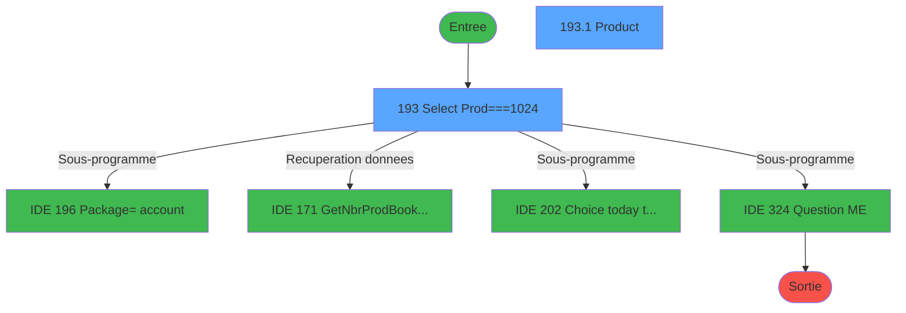
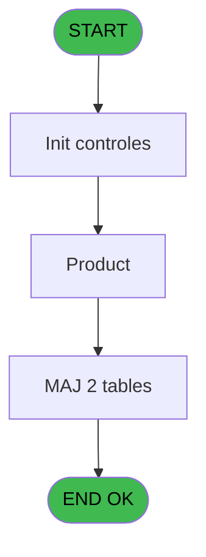
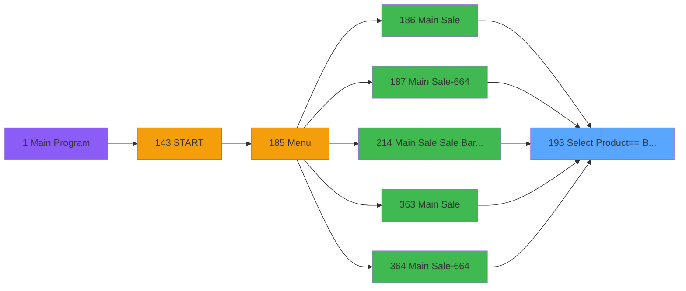
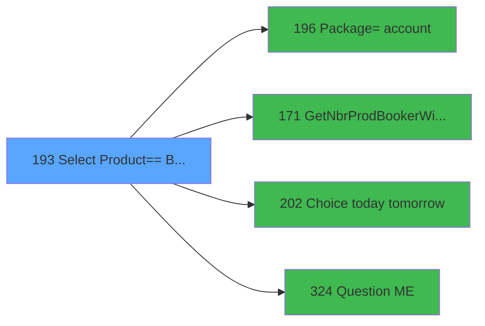

# PVE IDE 193 - Select Product== Best Of

> **Analyse**: Phases 1-4 2026-02-03 18:49 -> 18:49 (20s) | Assemblage 18:49
> **Pipeline**: V7.2 Enrichi
> **Structure**: 4 onglets (Resume | Ecrans | Donnees | Connexions)

<!-- TAB:Resume -->

## 1. FICHE D'IDENTITE

| Attribut | Valeur |
|----------|--------|
| Projet | PVE |
| IDE Position | 193 |
| Nom Programme | Select Product== Best Of |
| Fichier source | `Prg_193.xml` |
| Dossier IDE | Mobile |
| Taches | 4 (2 ecrans visibles) |
| Tables modifiees | 2 |
| Programmes appeles | 4 |

## 2. DESCRIPTION FONCTIONNELLE

**Select Product== Best Of** assure la gestion complete de ce processus, accessible depuis [Main Sale (IDE 186)](PVE-IDE-186.md), [Main Sale-664 (IDE 187)](PVE-IDE-187.md), [Main Sale Sale Bar Code (IDE 214)](PVE-IDE-214.md), [Main Sale (IDE 363)](PVE-IDE-363.md), [Main Sale-664 (IDE 364)](PVE-IDE-364.md), [Main Sale ===V4 Booking ACTUEL (IDE 417)](PVE-IDE-417.md), [Main Sale (IDE 440)](PVE-IDE-440.md).

Le flux de traitement s'organise en **2 blocs fonctionnels** :

- **Traitement** (2 taches) : traitements metier divers
- **Consultation** (2 taches) : ecrans de recherche, selection et consultation

**Donnees modifiees** : 2 tables en ecriture (pv_customer_temp, pv_sellers).

Detail : phases du traitement

#### Phase 1 : Consultation (2 taches)

- **193** - Select Prod===1024 **[[ECRAN]](#ecran-t1)**
- **193.2** - Recherche si Filliation

Delegue a : [GetNbrProdBookerWithoutBooking (IDE 171)](PVE-IDE-171.md)

#### Phase 2 : Traitement (2 taches)

- **193.1** - Product **[[ECRAN]](#ecran-t2)**
- **193.1.1** - Créer Package pour les Filliat

Delegue a : [      Package=> account (IDE 196)](PVE-IDE-196.md), [GetNbrProdBookerWithoutBooking (IDE 171)](PVE-IDE-171.md), [Choice today tomorrow (IDE 202)](PVE-IDE-202.md), [Question M&E (IDE 324)](PVE-IDE-324.md)

#### Tables impactees

| Table | Operations | Role metier |
|-------|-----------|-------------|
| pv_customer_temp | **W** (1 usages) |  |
| pv_sellers | **W** (1 usages) |  |

## 3. BLOCS FONCTIONNELS

### 3.1 Consultation (2 taches)

Ecrans de recherche et consultation.

---

#### 193 - Select Prod===1024 [[ECRAN]](#ecran-t1)

**Role** : Traitement : Select Prod===1024.
**Ecran** : 406 x 306 DLU (Type6) | [Voir mockup](#ecran-t1)

---

#### 193.2 - Recherche si Filliation

**Role** : Traitement : Recherche si Filliation.
**Variables liees** : K (V.Existe Filliation ?)

### 3.2 Traitement (2 taches)

Traitements internes.

---

#### 193.1 - Product [[ECRAN]](#ecran-t2)

**Role** : Traitement : Product.
**Ecran** : 378 x 211 DLU | [Voir mockup](#ecran-t2)
**Variables liees** : R (v.ProductIdBooker)
**Delegue a** : [      Package=> account (IDE 196)](PVE-IDE-196.md), [GetNbrProdBookerWithoutBooking (IDE 171)](PVE-IDE-171.md), [Choice today tomorrow (IDE 202)](PVE-IDE-202.md)

---

#### 193.1.1 - Créer Package pour les Filliat

**Role** : Traitement : Créer Package pour les Filliat.
**Variables liees** : K (V.Existe Filliation ?), Q (v.PackageID)
**Delegue a** : [      Package=> account (IDE 196)](PVE-IDE-196.md), [GetNbrProdBookerWithoutBooking (IDE 171)](PVE-IDE-171.md), [Choice today tomorrow (IDE 202)](PVE-IDE-202.md)

## 5. REGLES METIER

*(Aucune regle metier identifiee)*

## 6. CONTEXTE

- **Appele par**: [Main Sale (IDE 186)](PVE-IDE-186.md), [Main Sale-664 (IDE 187)](PVE-IDE-187.md), [Main Sale Sale Bar Code (IDE 214)](PVE-IDE-214.md), [Main Sale (IDE 363)](PVE-IDE-363.md), [Main Sale-664 (IDE 364)](PVE-IDE-364.md), [Main Sale ===V4 Booking ACTUEL (IDE 417)](PVE-IDE-417.md), [Main Sale (IDE 440)](PVE-IDE-440.md)
- **Appelle**: 4 programmes | **Tables**: 5 (W:2 R:1 L:2) | **Taches**: 4 | **Expressions**: 12

<!-- TAB:Ecrans -->

## 8. ECRANS

### 8.1 Forms visibles (2 / 4)

| # | Position | Tache | Nom | Type | Largeur | Hauteur | Bloc |
|---|----------|-------|-----|------|---------|---------|------|
| 1 | 193 | 193 | Select Prod===1024 | Type6 | 406 | 306 | Consultation |
| 2 | 193.1 | 193.1 | Product | Type0 | 378 | 211 | Traitement |

### 8.2 Mockups Ecrans

---

#### 193 - Select Prod===1024
**Tache** : [193](#t1) | **Type** : Type6 | **Dimensions** : 406 x 306 DLU
**Bloc** : Consultation | **Titre IDE** : Select Prod===1024

<!-- FORM-DATA:
{
    "width":  406,
    "vFactor":  8,
    "type":  "Type6",
    "hFactor":  8,
    "controls":  [
                     {
                         "x":  0,
                         "type":  "label",
                         "var":  "",
                         "y":  0,
                         "w":  395,
                         "fmt":  "",
                         "name":  "",
                         "h":  31,
                         "color":  "189",
                         "text":  "",
                         "parent":  null
                     },
                     {
                         "x":  40,
                         "type":  "label",
                         "var":  "",
                         "y":  11,
                         "w":  282,
                         "fmt":  "",
                         "name":  "",
                         "h":  10,
                         "color":  "186",
                         "text":  "Select your product",
                         "parent":  1
                     },
                     {
                         "x":  1,
                         "type":  "label",
                         "var":  "",
                         "y":  31,
                         "w":  394,
                         "fmt":  "",
                         "name":  "",
                         "h":  246,
                         "color":  "183",
                         "text":  "",
                         "parent":  null
                     },
                     {
                         "x":  7,
                         "type":  "label",
                         "var":  "",
                         "y":  33,
                         "w":  180,
                         "fmt":  "",
                         "name":  "",
                         "h":  7,
                         "color":  "183",
                         "text":  "Category",
                         "parent":  null
                     },
                     {
                         "x":  227,
                         "type":  "label",
                         "var":  "",
                         "y":  33,
                         "w":  142,
                         "fmt":  "",
                         "name":  "",
                         "h":  7,
                         "color":  "183",
                         "text":  "Sub Category",
                         "parent":  null
                     },
                     {
                         "x":  6,
                         "type":  "label",
                         "var":  "",
                         "y":  279,
                         "w":  390,
                         "fmt":  "",
                         "name":  "",
                         "h":  24,
                         "color":  "6",
                         "text":  "",
                         "parent":  null
                     },
                     {
                         "x":  321,
                         "type":  "image",
                         "var":  "",
                         "y":  2,
                         "w":  70,
                         "fmt":  "",
                         "name":  "",
                         "h":  27,
                         "color":  "",
                         "text":  "",
                         "parent":  1
                     },
                     {
                         "x":  14,
                         "type":  "edit",
                         "var":  "",
                         "y":  42,
                         "w":  165,
                         "fmt":  "",
                         "name":  "label",
                         "h":  8,
                         "color":  "",
                         "text":  "",
                         "parent":  null
                     },
                     {
                         "x":  215,
                         "type":  "edit",
                         "var":  "",
                         "y":  42,
                         "w":  165,
                         "fmt":  "",
                         "name":  "label  \u003e\u003e Sub Cat \u003c\u003c",
                         "h":  8,
                         "color":  "",
                         "text":  "",
                         "parent":  null
                     },
                     {
                         "x":  14,
                         "type":  "subform",
                         "var":  "",
                         "y":  63,
                         "w":  374,
                         "fmt":  "",
                         "name":  "SF_CATEG",
                         "h":  212,
                         "color":  "",
                         "text":  "",
                         "parent":  null
                     },
                     {
                         "x":  7,
                         "type":  "button",
                         "var":  "",
                         "y":  279,
                         "w":  387,
                         "fmt":  "Cancel",
                         "name":  "CANCEL",
                         "h":  23,
                         "color":  "",
                         "text":  "",
                         "parent":  null
                     }
                 ],
    "taskId":  "193",
    "height":  306
}
-->

<strong>Champs : 2 champs</strong>

| Pos (x,y) | Nom | Variable | Type |
|-----------|-----|----------|------|
| 14,42 | label | - | edit |
| 215,42 | label  >> Sub Cat << | - | edit |

<strong>Boutons : 1 boutons</strong>

| Bouton | Pos (x,y) | Action |
|--------|-----------|--------|
| Cancel | 7,279 | Annule et retour au menu |

---

#### 193.1 - Product
**Tache** : [193.1](#t2) | **Type** : Type0 | **Dimensions** : 378 x 211 DLU
**Bloc** : Traitement | **Titre IDE** : Product

<!-- FORM-DATA:
{
    "width":  378,
    "vFactor":  8,
    "type":  "Type0",
    "hFactor":  8,
    "controls":  [
                     {
                         "x":  6,
                         "type":  "table",
                         "var":  "",
                         "name":  "",
                         "titleH":  12,
                         "color":  "183",
                         "w":  290,
                         "y":  18,
                         "fmt":  "",
                         "parent":  null,
                         "text":  "",
                         "rowH":  24,
                         "h":  193,
                         "cols":  [
                                      {
                                          "title":  "",
                                          "layer":  1,
                                          "w":  206
                                      },
                                      {
                                          "title":  "",
                                          "layer":  2,
                                          "w":  62
                                      }
                                  ],
                         "rows":  2
                     },
                     {
                         "x":  6,
                         "type":  "checkbox",
                         "var":  "",
                         "y":  2,
                         "w":  363,
                         "fmt":  "",
                         "name":  "V.Toutes les Filliations ?",
                         "h":  14,
                         "color":  "183",
                         "text":  "Sale on all filiations",
                         "parent":  null
                     },
                     {
                         "x":  10,
                         "type":  "button",
                         "var":  "",
                         "y":  19,
                         "w":  204,
                         "fmt":  "",
                         "name":  "SAVE",
                         "h":  23,
                         "color":  "",
                         "text":  "",
                         "parent":  2
                     },
                     {
                         "x":  218,
                         "type":  "edit",
                         "var":  "",
                         "y":  19,
                         "w":  74,
                         "fmt":  "N12.3C",
                         "name":  "prix_de_vente",
                         "h":  23,
                         "color":  "",
                         "text":  "",
                         "parent":  2
                     },
                     {
                         "x":  298,
                         "type":  "button",
                         "var":  "",
                         "y":  18,
                         "w":  72,
                         "fmt":  "ñ",
                         "name":  "UP",
                         "h":  96,
                         "color":  "",
                         "text":  "",
                         "parent":  null
                     },
                     {
                         "x":  298,
                         "type":  "button",
                         "var":  "",
                         "y":  115,
                         "w":  72,
                         "fmt":  "ò",
                         "name":  "DOWN",
                         "h":  96,
                         "color":  "",
                         "text":  "",
                         "parent":  null
                     }
                 ],
    "taskId":  "193.1",
    "height":  211
}
-->

<strong>Champs : 2 champs</strong>

| Pos (x,y) | Nom | Variable | Type |
|-----------|-----|----------|------|
| 6,2 | V.Toutes les Filliations ? | - | checkbox |
| 218,19 | prix_de_vente | - | edit |

<strong>Boutons : 3 boutons</strong>

| Bouton | Pos (x,y) | Action |
|--------|-----------|--------|
| SAVE | 10,19 | Bouton fonctionnel |
| ñ | 298,18 | Bouton fonctionnel |
| ò | 298,115 | Bouton fonctionnel |

## 9. NAVIGATION

### 9.1 Enchainement des ecrans

**Detail par enchainement :**

| Depuis | Action | Vers | Retour |
|--------|--------|------|--------|
| Select Prod===1024 | Sous-programme | [      Package=> account (IDE 196)](PVE-IDE-196.md) | Retour ecran |
| Select Prod===1024 | Recuperation donnees | [GetNbrProdBookerWithoutBooking (IDE 171)](PVE-IDE-171.md) | Retour ecran |
| Select Prod===1024 | Sous-programme | [Choice today tomorrow (IDE 202)](PVE-IDE-202.md) | Retour ecran |
| Select Prod===1024 | Sous-programme | [Question M&E (IDE 324)](PVE-IDE-324.md) | Retour ecran |

### 9.3 Structure hierarchique (4 taches)

| Position | Tache | Type | Dimensions | Bloc |
|----------|-------|------|------------|------|
| **193.1** | [**Select Prod===1024** (193)](#t1) [mockup](#ecran-t1) | Type6 | 406x306 | Consultation |
| 193.1.1 | [Recherche si Filliation (193.2)](#t4) | - | - | |
| **193.2** | [**Product** (193.1)](#t2) [mockup](#ecran-t2) | - | 378x211 | Traitement |
| 193.2.1 | [Créer Package pour les Filliat (193.1.1)](#t3) | - | - | |

### 9.4 Algorigramme

> **Legende**: Vert = START/END OK | Rouge = END KO | Bleu = Decisions
> *Algorigramme auto-genere. Utiliser `/algorigramme` pour une synthese metier detaillee.*

<!-- TAB:Donnees -->

## 10. TABLES

### Tables utilisees (5)

| ID | Nom | Description | Type | R | W | L | Usages |
|----|-----|-------------|------|---|---|---|--------|
| 30 | gm-recherche_____gmr | Index de recherche | DB | R |   |   | 2 |
| 379 | pv_customer_temp |  | DB |   | **W** |   | 1 |
| 382 | pv_discount_reasons |  | DB |   |   | L | 2 |
| 403 | pv_sellers |  | DB |   | **W** |   | 1 |
| 413 | pv_tva |  | DB |   |   | L | 1 |

### Colonnes par table (2 / 3 tables avec colonnes identifiees)

Table 30 - gm-recherche_____gmr (R) - 2 usages

*Table utilisee uniquement en Link ou aucune colonne Real identifiee dans le DataView.*

Table 379 - pv_customer_temp (**W**) - 1 usages

| Lettre | Variable | Acces | Type |
|--------|----------|-------|------|
| A | p.Customer_Id | W | Numeric |
| B | p.Masque_Sans_Z | W | Alpha |
| C | p.V.valid_all | W | Logical |
| D | P.date debut sejour | W | Date |
| E | P.FocusOngletBooking | W | Logical |
| F | Pi.Cat | W | Numeric |
| G | Pi.Sub Cat | W | Numeric |
| H | Pi.Seminar Name | W | Unicode |
| I | v.Fin | W | Logical |
| J | T S/Catégorie | W | Logical |
| K | V.Existe Filliation ? | W | Logical |
| L | V.Sorti avec Cancel | W | Logical |
| M | V.Sav Toutes les filiations ? | W | Logical |
| N | v.TotalAValider | W | Numeric |
| O | v.NbrProdWithoutBooking | W | Numeric |
| P | v.BookingID | W | Unicode |
| Q | v.PackageID | W | Numeric |
| R | v.ProductIdBooker | W | Numeric |

Table 403 - pv_sellers (**W**) - 1 usages

| Lettre | Variable | Acces | Type |
|--------|----------|-------|------|
| A | p.Category | W | Numeric |
| B | p.Sub_Category | W | Numeric |
| C | v.DbleClick | W | Logical |
| D | V.Toutes les Filliations ? | W | Logical |
| E | V.today ? | W | Logical |
| F | V.start rental date | W | Date |
| G | v.Facturé au M&E? | W | Logical |
| H | v.% de réduction | W | Numeric |
| I | v.prix du produit | W | Numeric |

## 11. VARIABLES

### 11.1 Parametres entrants (8)

Variables recues du programme appelant ([Main Sale (IDE 186)](PVE-IDE-186.md)).

| Lettre | Nom | Type | Usage dans |
|--------|-----|------|-----------|
| A | p.Customer_Id | Numeric | 1x parametre entrant |
| B | p.Masque_Sans_Z | Alpha | - |
| C | p.V.valid_all | Logical | - |
| D | P.date debut sejour | Date | - |
| E | P.FocusOngletBooking | Logical | - |
| F | Pi.Cat | Numeric | 1x parametre entrant |
| G | Pi.Sub Cat | Numeric | 1x parametre entrant |
| H | Pi.Seminar Name | Unicode | 1x parametre entrant |

### 11.2 Variables de session (9)

Variables persistantes pendant toute la session.

| Lettre | Nom | Type | Usage dans |
|--------|-----|------|-----------|
| I | v.Fin | Logical | 1x session |
| K | V.Existe Filliation ? | Logical | - |
| L | V.Sorti avec Cancel | Logical | - |
| M | V.Sav Toutes les filiations ? | Logical | - |
| N | v.TotalAValider | Numeric | - |
| O | v.NbrProdWithoutBooking | Numeric | - |
| P | v.BookingID | Unicode | - |
| Q | v.PackageID | Numeric | - |
| R | v.ProductIdBooker | Numeric | - |

### 11.3 Autres (1)

Variables diverses.

| Lettre | Nom | Type | Usage dans |
|--------|-----|------|-----------|
| J | T S/Catégorie | Logical | - |

Toutes les 18 variables (liste complete)

| Cat | Lettre | Nom Variable | Type |
|-----|--------|--------------|------|
| P0 | **A** | p.Customer_Id | Numeric |
| P0 | **B** | p.Masque_Sans_Z | Alpha |
| P0 | **C** | p.V.valid_all | Logical |
| P0 | **D** | P.date debut sejour | Date |
| P0 | **E** | P.FocusOngletBooking | Logical |
| P0 | **F** | Pi.Cat | Numeric |
| P0 | **G** | Pi.Sub Cat | Numeric |
| P0 | **H** | Pi.Seminar Name | Unicode |
| V. | **I** | v.Fin | Logical |
| V. | **K** | V.Existe Filliation ? | Logical |
| V. | **L** | V.Sorti avec Cancel | Logical |
| V. | **M** | V.Sav Toutes les filiations ? | Logical |
| V. | **N** | v.TotalAValider | Numeric |
| V. | **O** | v.NbrProdWithoutBooking | Numeric |
| V. | **P** | v.BookingID | Unicode |
| V. | **Q** | v.PackageID | Numeric |
| V. | **R** | v.ProductIdBooker | Numeric |
| Autre | **J** | T S/Catégorie | Logical |

## 12. EXPRESSIONS

**12 / 12 expressions decodees (100%)**

### 12.1 Repartition par type

| Type | Expressions | Regles |
|------|-------------|--------|
| CAST_LOGIQUE | 3 | 0 |
| OTHER | 6 | 0 |
| REFERENCE_VG | 1 | 0 |
| CONDITION | 1 | 0 |
| NEGATION | 1 | 0 |

### 12.2 Expressions cles par type

#### CAST_LOGIQUE (3 expressions)

| Type | IDE | Expression | Regle |
|------|-----|------------|-------|
| CAST_LOGIQUE | 6 | `'TRUE'LOG` | - |
| CAST_LOGIQUE | 2 | `'TRUE'LOG` | - |
| CAST_LOGIQUE | 1 | `Pi.Seminar Name [H]='TRUE'LOG` | - |

#### OTHER (6 expressions)

| Type | IDE | Expression | Regle |
|------|-----|------------|-------|
| OTHER | 9 | `Pi.Cat [F]` | - |
| OTHER | 10 | `Pi.Sub Cat [G]` | - |
| OTHER | 11 | `p.Customer_Id [A]` | - |
| OTHER | 3 | `v.Fin [I]` | - |
| OTHER | 4 | `V.Sav Toutes les filia... [M]` | - |
| ... | | *+1 autres* | |

#### REFERENCE_VG (1 expressions)

| Type | IDE | Expression | Regle |
|------|-----|------------|-------|
| REFERENCE_VG | 7 | `VG65` | - |

#### CONDITION (1 expressions)

| Type | IDE | Expression | Regle |
|------|-----|------------|-------|
| CONDITION | 8 | `[AA] > 0` | - |

#### NEGATION (1 expressions)

| Type | IDE | Expression | Regle |
|------|-----|------------|-------|
| NEGATION | 12 | `NOT [X]` | - |

<!-- TAB:Connexions -->

## 13. GRAPHE D'APPELS

### 13.1 Chaine depuis Main (Callers)

Main -> ... -> [Main Sale (IDE 186)](PVE-IDE-186.md) -> **Select Product== Best Of (IDE 193)**

Main -> ... -> [Main Sale-664 (IDE 187)](PVE-IDE-187.md) -> **Select Product== Best Of (IDE 193)**

Main -> ... -> [Main Sale Sale Bar Code (IDE 214)](PVE-IDE-214.md) -> **Select Product== Best Of (IDE 193)**

Main -> ... -> [Main Sale (IDE 363)](PVE-IDE-363.md) -> **Select Product== Best Of (IDE 193)**

Main -> ... -> [Main Sale-664 (IDE 364)](PVE-IDE-364.md) -> **Select Product== Best Of (IDE 193)**

Main -> ... -> [Main Sale ===V4 Booking ACTUEL (IDE 417)](PVE-IDE-417.md) -> **Select Product== Best Of (IDE 193)**

Main -> ... -> [Main Sale (IDE 440)](PVE-IDE-440.md) -> **Select Product== Best Of (IDE 193)**

### 13.2 Callers

| IDE | Nom Programme | Nb Appels |
|-----|---------------|-----------|
| [186](PVE-IDE-186.md) | Main Sale | 1 |
| [187](PVE-IDE-187.md) | Main Sale-664 | 1 |
| [214](PVE-IDE-214.md) | Main Sale Sale Bar Code | 1 |
| [363](PVE-IDE-363.md) | Main Sale | 1 |
| [364](PVE-IDE-364.md) | Main Sale-664 | 1 |
| [417](PVE-IDE-417.md) | Main Sale ===V4 Booking ACTUEL | 1 |
| [440](PVE-IDE-440.md) | Main Sale | 1 |

### 13.3 Callees (programmes appeles)

### 13.4 Detail Callees avec contexte

| IDE | Nom Programme | Appels | Contexte |
|-----|---------------|--------|----------|
| [196](PVE-IDE-196.md) |       Package=> account | 2 | Sous-programme |
| [171](PVE-IDE-171.md) | GetNbrProdBookerWithoutBooking | 1 | Recuperation donnees |
| [202](PVE-IDE-202.md) | Choice today tomorrow | 1 | Sous-programme |
| [324](PVE-IDE-324.md) | Question M&E | 1 | Sous-programme |

## 14. RECOMMANDATIONS MIGRATION

### 14.1 Profil du programme

| Metrique | Valeur | Impact migration |
|----------|--------|-----------------|
| Lignes de logique | 123 | Programme compact |
| Expressions | 12 | Peu de logique |
| Tables WRITE | 2 | Impact faible |
| Sous-programmes | 4 | Peu de dependances |
| Ecrans visibles | 2 | Quelques ecrans |
| Code desactive | 0% (0 / 123) | Code sain |
| Regles metier | 0 | Pas de regle identifiee |

### 14.2 Plan de migration par bloc

#### Consultation (2 taches: 1 ecran, 1 traitement)

- **Strategie** : Composants de recherche/selection en modales.
- 1 ecran : Select Prod===1024

#### Traitement (2 taches: 1 ecran, 1 traitement)

- **Strategie** : Orchestrateur avec 1 ecrans (Razor/React) et 1 traitements backend (services).
- Les ecrans deviennent des composants UI, les traitements invisibles deviennent des services injectables.
- 4 sous-programme(s) a migrer ou a reutiliser depuis les services existants.
- Decomposer les taches en services unitaires testables.

### 14.3 Dependances critiques

| Dependance | Type | Appels | Impact |
|------------|------|--------|--------|
| pv_customer_temp | Table WRITE (Database) | 1x | Schema + repository |
| pv_sellers | Table WRITE (Database) | 1x | Schema + repository |
| [      Package=> account (IDE 196)](PVE-IDE-196.md) | Sous-programme | 2x | Haute - Sous-programme |
| [Question M&E (IDE 324)](PVE-IDE-324.md) | Sous-programme | 1x | Normale - Sous-programme |
| [Choice today tomorrow (IDE 202)](PVE-IDE-202.md) | Sous-programme | 1x | Normale - Sous-programme |
| [GetNbrProdBookerWithoutBooking (IDE 171)](PVE-IDE-171.md) | Sous-programme | 1x | Normale - Recuperation donnees |

---
*Spec DETAILED generee par Pipeline V7.2 - 2026-02-03 18:49*
