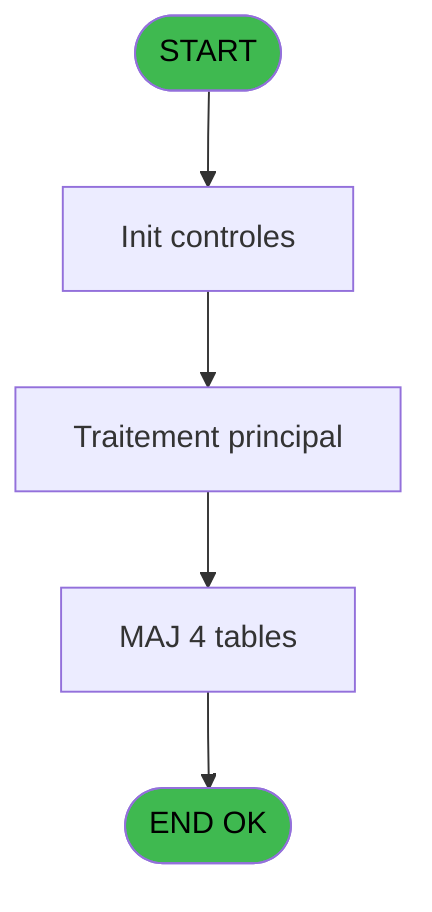
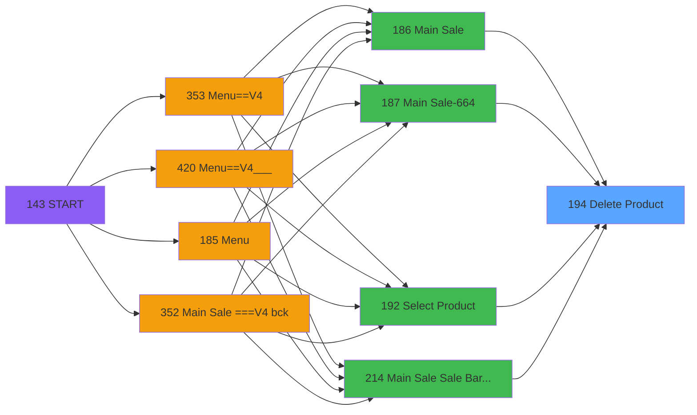

# PVE IDE 194 - Delete Product

> **Analyse**: Phases 1-4 2026-02-03 18:49 -> 18:49 (19s) | Assemblage 18:49
> **Pipeline**: V7.2 Enrichi
> **Structure**: 4 onglets (Resume | Ecrans | Donnees | Connexions)

<!-- TAB:Resume -->

## 1. FICHE D'IDENTITE

| Attribut | Valeur |
|----------|--------|
| Projet | PVE |
| IDE Position | 194 |
| Nom Programme | Delete Product |
| Fichier source | `Prg_194.xml` |
| Dossier IDE | Mobile |
| Taches | 8 (0 ecrans visibles) |
| Tables modifiees | 4 |
| Programmes appeles | 1 |

## 2. DESCRIPTION FONCTIONNELLE

**Delete Product** assure la gestion complete de ce processus, accessible depuis [Main Sale (IDE 186)](PVE-IDE-186.md), [Main Sale-664 (IDE 187)](PVE-IDE-187.md), [Select Product (IDE 192)](PVE-IDE-192.md), [Main Sale Sale Bar Code (IDE 214)](PVE-IDE-214.md), [Select Product==V4 (IDE 356)](PVE-IDE-356.md), [Select Product==V4 (IDE 360)](PVE-IDE-360.md), [Main Sale (IDE 363)](PVE-IDE-363.md), [Main Sale-664 (IDE 364)](PVE-IDE-364.md), [Select Product==V4 (IDE 405)](PVE-IDE-405.md), [Main Sale (IDE 440)](PVE-IDE-440.md), [Main Sale ===V4 (IDE 0)](PVE-IDE-0.md), [Main Sale ===V4 bck (IDE 352)](PVE-IDE-352.md), [Main Sale ===V4 (IDE 354)](PVE-IDE-354.md), [Main Sale ===V4 (IDE 359)](PVE-IDE-359.md), [Main Sale ===V4 (IDE 409)](PVE-IDE-409.md), [Select Product== Best Of (IDE 413)](PVE-IDE-413.md), [Main Sale ===V4 (IDE 415)](PVE-IDE-415.md), [Main Sale ===V4 Booking ACTUEL (IDE 417)](PVE-IDE-417.md).

Le flux de traitement s'organise en **1 blocs fonctionnels** :

- **Traitement** (8 taches) : traitements metier divers

**Donnees modifiees** : 4 tables en ecriture (pv_equipment_inventory, pv_cust_rentals, pv_sellers_by_week, Table_1539).

Detail : phases du traitement

#### Phase 1 : Traitement (8 taches)

- **194** - delete
- **194.1** - authorize del
- **194.2** - del
- **194.2.1** - del
- **194.3** - del
- **194.4** - del
- **194.5** - del
- **194.6** - del

Delegue a : [CancelAppointment (IDE 159)](PVE-IDE-159.md)

#### Tables impactees

| Table | Operations | Role metier |
|-------|-----------|-------------|
| pv_cust_rentals | **W** (3 usages) |  |
| pv_sellers_by_week | R/**W**/L (3 usages) |  |
| Table_1539 | **W** (1 usages) |  |
| pv_equipment_inventory | **W** (1 usages) |  |

## 3. BLOCS FONCTIONNELS

### 3.1 Traitement (8 taches)

Traitements internes.

---

#### 194 - delete

**Role** : Tache d'orchestration : point d'entree du programme (8 sous-taches). Coordonne l'enchainement des traitements.

7 sous-taches directes

| Tache | Nom | Bloc |
|-------|-----|------|
| [194.1](#t2) | authorize del | Traitement |
| [194.2](#t3) | del | Traitement |
| [194.2.1](#t4) | del | Traitement |
| [194.3](#t5) | del | Traitement |
| [194.4](#t6) | del | Traitement |
| [194.5](#t7) | del | Traitement |
| [194.6](#t8) | del | Traitement |

**Variables liees** : A (p.StopDelete)
**Delegue a** : [CancelAppointment (IDE 159)](PVE-IDE-159.md)

---

#### 194.1 - authorize del

**Role** : Traitement : authorize del.
**Delegue a** : [CancelAppointment (IDE 159)](PVE-IDE-159.md)

---

#### 194.2 - del

**Role** : Traitement interne.

---

#### 194.2.1 - del

**Role** : Traitement interne.

---

#### 194.3 - del

**Role** : Traitement interne.

---

#### 194.4 - del

**Role** : Traitement interne.

---

#### 194.5 - del

**Role** : Traitement interne.

---

#### 194.6 - del

**Role** : Traitement interne.

## 5. REGLES METIER

*(Aucune regle metier identifiee)*

## 6. CONTEXTE

- **Appele par**: [Main Sale (IDE 186)](PVE-IDE-186.md), [Main Sale-664 (IDE 187)](PVE-IDE-187.md), [Select Product (IDE 192)](PVE-IDE-192.md), [Main Sale Sale Bar Code (IDE 214)](PVE-IDE-214.md), [Select Product==V4 (IDE 356)](PVE-IDE-356.md), [Select Product==V4 (IDE 360)](PVE-IDE-360.md), [Main Sale (IDE 363)](PVE-IDE-363.md), [Main Sale-664 (IDE 364)](PVE-IDE-364.md), [Select Product==V4 (IDE 405)](PVE-IDE-405.md), [Main Sale (IDE 440)](PVE-IDE-440.md), [Main Sale ===V4 (IDE 0)](PVE-IDE-0.md), [Main Sale ===V4 bck (IDE 352)](PVE-IDE-352.md), [Main Sale ===V4 (IDE 354)](PVE-IDE-354.md), [Main Sale ===V4 (IDE 359)](PVE-IDE-359.md), [Main Sale ===V4 (IDE 409)](PVE-IDE-409.md), [Select Product== Best Of (IDE 413)](PVE-IDE-413.md), [Main Sale ===V4 (IDE 415)](PVE-IDE-415.md), [Main Sale ===V4 Booking ACTUEL (IDE 417)](PVE-IDE-417.md)
- **Appelle**: 1 programmes | **Tables**: 4 (W:4 R:1 L:1) | **Taches**: 8 | **Expressions**: 7

<!-- TAB:Ecrans -->

## 8. ECRANS

*(Programme sans ecran visible)*

## 9. NAVIGATION

### 9.3 Structure hierarchique (8 taches)

| Position | Tache | Type | Dimensions | Bloc |
|----------|-------|------|------------|------|
| **194.1** | [**delete** (194)](#t1) | MDI | - | Traitement |
| 194.1.1 | [authorize del (194.1)](#t2) | MDI | - | |
| 194.1.2 | [del (194.2)](#t3) | MDI | - | |
| 194.1.3 | [del (194.2.1)](#t4) | MDI | - | |
| 194.1.4 | [del (194.3)](#t5) | MDI | - | |
| 194.1.5 | [del (194.4)](#t6) | MDI | - | |
| 194.1.6 | [del (194.5)](#t7) | MDI | - | |
| 194.1.7 | [del (194.6)](#t8) | MDI | - | |

### 9.4 Algorigramme

> **Legende**: Vert = START/END OK | Rouge = END KO | Bleu = Decisions
> *Algorigramme auto-genere. Utiliser `/algorigramme` pour une synthese metier detaillee.*

<!-- TAB:Donnees -->

## 10. TABLES

### Tables utilisees (4)

| ID | Nom | Description | Type | R | W | L | Usages |
|----|-----|-------------|------|---|---|---|--------|
| 389 | pv_equipment_inventory |  | DB |   | **W** |   | 1 |
| 400 | pv_cust_rentals |  | DB |   | **W** |   | 3 |
| 404 | pv_sellers_by_week |  | DB | R | **W** | L | 3 |
| 1539 | Table_1539 |  | MEM |   | **W** |   | 1 |

### Colonnes par table (0 / 4 tables avec colonnes identifiees)

Table 389 - pv_equipment_inventory (**W**) - 1 usages

*Table utilisee uniquement en Link ou aucune colonne Real identifiee dans le DataView.*

Table 400 - pv_cust_rentals (**W**) - 3 usages

*Table utilisee uniquement en Link ou aucune colonne Real identifiee dans le DataView.*

Table 404 - pv_sellers_by_week (R/**W**/L) - 3 usages

*Table utilisee uniquement en Link ou aucune colonne Real identifiee dans le DataView.*

Table 1539 - Table_1539 (**W**) - 1 usages

*Table utilisee uniquement en Link ou aucune colonne Real identifiee dans le DataView.*

## 11. VARIABLES

### 11.1 Parametres entrants (7)

Variables recues du programme appelant ([Main Sale (IDE 186)](PVE-IDE-186.md)).

| Lettre | Nom | Type | Usage dans |
|--------|-----|------|-----------|
| A | p.StopDelete | Logical | 2x parametre entrant |
| B | p.Pos_Id | Numeric | - |
| C | p.Package_Id | Numeric | - |
| D | p.Date Creat | Date | - |
| E | p.Time Creat | Time | - |
| F | p.NotCancelBooking | Logical | - |
| G | p.ActionType | Unicode | 1x parametre entrant |

### 11.2 Variables de session (2)

Variables persistantes pendant toute la session.

| Lettre | Nom | Type | Usage dans |
|--------|-----|------|-----------|
| H | v.EarlyReturn? | Logical | 1x session |
| I | v Gift Pass | Logical | 1x session |

## 12. EXPRESSIONS

**7 / 7 expressions decodees (100%)**

### 12.1 Repartition par type

| Type | Expressions | Regles |
|------|-------------|--------|
| NEGATION | 1 | 0 |
| OTHER | 3 | 0 |
| CAST_LOGIQUE | 1 | 0 |
| REFERENCE_VG | 1 | 0 |
| CONDITION | 1 | 0 |

### 12.2 Expressions cles par type

#### NEGATION (1 expressions)

| Type | IDE | Expression | Regle |
|------|-----|------------|-------|
| NEGATION | 1 | `NOT p.StopDelete [A]` | - |

#### OTHER (3 expressions)

| Type | IDE | Expression | Regle |
|------|-----|------------|-------|
| OTHER | 5 | `v Gift Pass [I]` | - |
| OTHER | 3 | `p.StopDelete [A]` | - |
| OTHER | 2 | `v.EarlyReturn? [H]` | - |

#### CAST_LOGIQUE (1 expressions)

| Type | IDE | Expression | Regle |
|------|-----|------------|-------|
| CAST_LOGIQUE | 4 | `'FALSE'LOG` | - |

#### REFERENCE_VG (1 expressions)

| Type | IDE | Expression | Regle |
|------|-----|------------|-------|
| REFERENCE_VG | 6 | `VG65` | - |

#### CONDITION (1 expressions)

| Type | IDE | Expression | Regle |
|------|-----|------------|-------|
| CONDITION | 7 | `MID(p.ActionType [G],0,6) = 'RETURN'` | - |

<!-- TAB:Connexions -->

## 13. GRAPHE D'APPELS

### 13.1 Chaine depuis Main (Callers)

Main -> ... -> [Main Sale (IDE 186)](PVE-IDE-186.md) -> **Delete Product (IDE 194)**

Main -> ... -> [Main Sale-664 (IDE 187)](PVE-IDE-187.md) -> **Delete Product (IDE 194)**

Main -> ... -> [Select Product (IDE 192)](PVE-IDE-192.md) -> **Delete Product (IDE 194)**

Main -> ... -> [Main Sale Sale Bar Code (IDE 214)](PVE-IDE-214.md) -> **Delete Product (IDE 194)**

Main -> ... -> [Select Product==V4 (IDE 356)](PVE-IDE-356.md) -> **Delete Product (IDE 194)**

Main -> ... -> [Select Product==V4 (IDE 360)](PVE-IDE-360.md) -> **Delete Product (IDE 194)**

Main -> ... -> [Main Sale (IDE 363)](PVE-IDE-363.md) -> **Delete Product (IDE 194)**

Main -> ... -> [Main Sale-664 (IDE 364)](PVE-IDE-364.md) -> **Delete Product (IDE 194)**

Main -> ... -> [Select Product==V4 (IDE 405)](PVE-IDE-405.md) -> **Delete Product (IDE 194)**

Main -> ... -> [Main Sale (IDE 440)](PVE-IDE-440.md) -> **Delete Product (IDE 194)**

Main -> ... -> [Main Sale ===V4 (IDE 0)](PVE-IDE-0.md) -> **Delete Product (IDE 194)**

Main -> ... -> [Main Sale ===V4 bck (IDE 352)](PVE-IDE-352.md) -> **Delete Product (IDE 194)**

Main -> ... -> [Main Sale ===V4 (IDE 354)](PVE-IDE-354.md) -> **Delete Product (IDE 194)**

Main -> ... -> [Main Sale ===V4 (IDE 359)](PVE-IDE-359.md) -> **Delete Product (IDE 194)**

Main -> ... -> [Main Sale ===V4 (IDE 409)](PVE-IDE-409.md) -> **Delete Product (IDE 194)**

Main -> ... -> [Select Product== Best Of (IDE 413)](PVE-IDE-413.md) -> **Delete Product (IDE 194)**

Main -> ... -> [Main Sale ===V4 (IDE 415)](PVE-IDE-415.md) -> **Delete Product (IDE 194)**

Main -> ... -> [Main Sale ===V4 Booking ACTUEL (IDE 417)](PVE-IDE-417.md) -> **Delete Product (IDE 194)**

### 13.2 Callers

| IDE | Nom Programme | Nb Appels |
|-----|---------------|-----------|
| [186](PVE-IDE-186.md) | Main Sale | 2 |
| [187](PVE-IDE-187.md) | Main Sale-664 | 2 |
| [192](PVE-IDE-192.md) | Select Product | 2 |
| [214](PVE-IDE-214.md) | Main Sale Sale Bar Code | 2 |
| [356](PVE-IDE-356.md) | Select Product==V4 | 2 |
| [360](PVE-IDE-360.md) | Select Product==V4 | 2 |
| [363](PVE-IDE-363.md) | Main Sale | 2 |
| [364](PVE-IDE-364.md) | Main Sale-664 | 2 |
| [405](PVE-IDE-405.md) | Select Product==V4 | 2 |
| [440](PVE-IDE-440.md) | Main Sale | 2 |
| [0](PVE-IDE-0.md) | Main Sale ===V4 | 1 |
| [352](PVE-IDE-352.md) | Main Sale ===V4 bck | 1 |
| [354](PVE-IDE-354.md) | Main Sale ===V4 | 1 |
| [359](PVE-IDE-359.md) | Main Sale ===V4 | 1 |
| [409](PVE-IDE-409.md) | Main Sale ===V4 | 1 |
| [413](PVE-IDE-413.md) | Select Product== Best Of | 1 |
| [415](PVE-IDE-415.md) | Main Sale ===V4 | 1 |
| [417](PVE-IDE-417.md) | Main Sale ===V4 Booking ACTUEL | 1 |

### 13.3 Callees (programmes appeles)

### 13.4 Detail Callees avec contexte

| IDE | Nom Programme | Appels | Contexte |
|-----|---------------|--------|----------|
| [159](PVE-IDE-159.md) | CancelAppointment | 1 | Sous-programme |

## 14. RECOMMANDATIONS MIGRATION

### 14.1 Profil du programme

| Metrique | Valeur | Impact migration |
|----------|--------|-----------------|
| Lignes de logique | 93 | Programme compact |
| Expressions | 7 | Peu de logique |
| Tables WRITE | 4 | Impact modere |
| Sous-programmes | 1 | Peu de dependances |
| Ecrans visibles | 0 | Ecran unique ou traitement batch |
| Code desactive | 0% (0 / 93) | Code sain |
| Regles metier | 0 | Pas de regle identifiee |

### 14.2 Plan de migration par bloc

#### Traitement (8 taches: 0 ecran, 8 traitements)

- **Strategie** : 8 service(s) backend injectable(s) (Domain Services).
- 1 sous-programme(s) a migrer ou a reutiliser depuis les services existants.
- Decomposer les taches en services unitaires testables.

### 14.3 Dependances critiques

| Dependance | Type | Appels | Impact |
|------------|------|--------|--------|
| pv_equipment_inventory | Table WRITE (Database) | 1x | Schema + repository |
| pv_cust_rentals | Table WRITE (Database) | 3x | Schema + repository |
| pv_sellers_by_week | Table WRITE (Database) | 1x | Schema + repository |
| Table_1539 | Table WRITE (Memory) | 1x | Schema + repository |
| [CancelAppointment (IDE 159)](PVE-IDE-159.md) | Sous-programme | 1x | Normale - Sous-programme |

---
*Spec DETAILED generee par Pipeline V7.2 - 2026-02-03 18:49*
