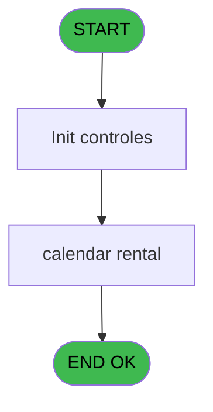
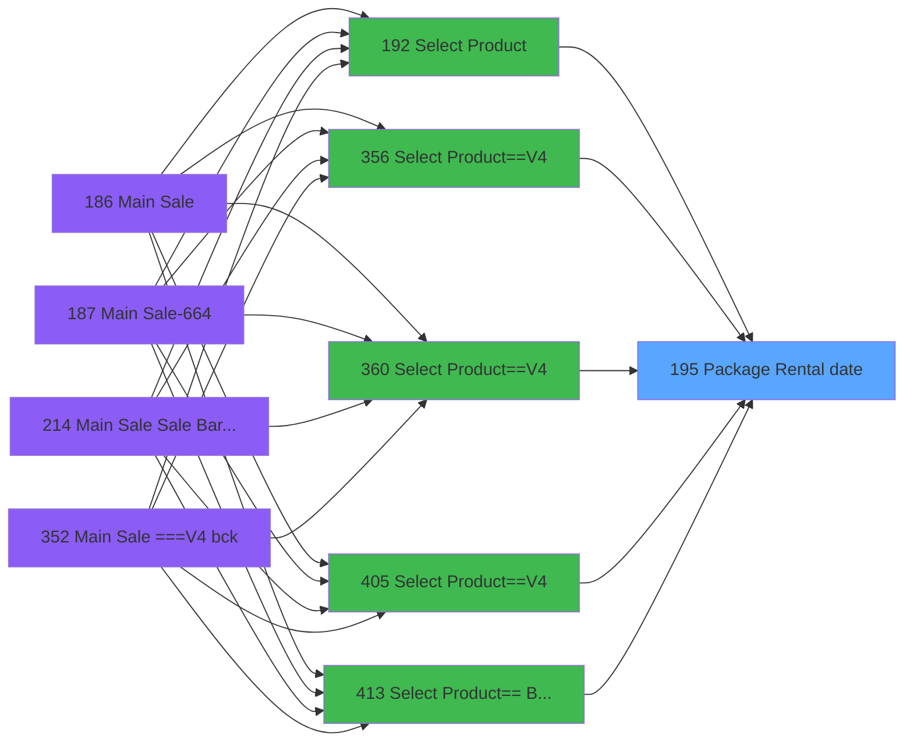

# PVE IDE 195 - Package Rental date

> **Analyse**: Phases 1-4 2026-02-03 18:50 -> 18:50 (19s) | Assemblage 18:50
> **Pipeline**: V7.2 Enrichi
> **Structure**: 4 onglets (Resume | Ecrans | Donnees | Connexions)

<!-- TAB:Resume -->

## 1. FICHE D'IDENTITE

| Attribut | Valeur |
|----------|--------|
| Projet | PVE |
| IDE Position | 195 |
| Nom Programme | Package Rental date |
| Fichier source | `Prg_195.xml` |
| Dossier IDE | Mobile |
| Taches | 2 (1 ecrans visibles) |
| Tables modifiees | 0 |
| Programmes appeles | 0 |

## 2. DESCRIPTION FONCTIONNELLE

**Package Rental date** assure la gestion complete de ce processus, accessible depuis [Select Product (IDE 192)](PVE-IDE-192.md), [Select Product==V4 (IDE 356)](PVE-IDE-356.md), [Select Product==V4 (IDE 360)](PVE-IDE-360.md), [Select Product==V4 (IDE 405)](PVE-IDE-405.md), [Select Product== Best Of (IDE 413)](PVE-IDE-413.md).

Le flux de traitement s'organise en **1 blocs fonctionnels** :

- **Traitement** (2 taches) : traitements metier divers

## 3. BLOCS FONCTIONNELS

### 3.1 Traitement (2 taches)

Traitements internes.

---

#### 195 - Package sales calendar

**Role** : Traitement : Package sales calendar.

---

#### 195.1 - Sale & Rental [[ECRAN]](#ecran-t2)

**Role** : Traitement : Sale & Rental.
**Ecran** : 284 x 339 DLU (MDI) | [Voir mockup](#ecran-t2)

## 5. REGLES METIER

*(Aucune regle metier identifiee)*

## 6. CONTEXTE

- **Appele par**: [Select Product (IDE 192)](PVE-IDE-192.md), [Select Product==V4 (IDE 356)](PVE-IDE-356.md), [Select Product==V4 (IDE 360)](PVE-IDE-360.md), [Select Product==V4 (IDE 405)](PVE-IDE-405.md), [Select Product== Best Of (IDE 413)](PVE-IDE-413.md)
- **Appelle**: 0 programmes | **Tables**: 1 (W:0 R:1 L:0) | **Taches**: 2 | **Expressions**: 8

<!-- TAB:Ecrans -->

## 8. ECRANS

### 8.1 Forms visibles (1 / 2)

| # | Position | Tache | Nom | Type | Largeur | Hauteur | Bloc |
|---|----------|-------|-----|------|---------|---------|------|
| 1 | 195.1 | 195.1 | Sale & Rental | MDI | 284 | 339 | Traitement |

### 8.2 Mockups Ecrans

---

#### 195.1 - Sale & Rental
**Tache** : [195.1](#t2) | **Type** : MDI | **Dimensions** : 284 x 339 DLU
**Bloc** : Traitement | **Titre IDE** : Sale & Rental

<!-- FORM-DATA:
{
    "width":  284,
    "vFactor":  8,
    "type":  "MDI",
    "hFactor":  4,
    "controls":  [
                     {
                         "x":  3,
                         "type":  "label",
                         "var":  "",
                         "y":  282,
                         "w":  104,
                         "fmt":  "",
                         "name":  "",
                         "h":  19,
                         "color":  "189",
                         "text":  "# Days",
                         "parent":  null
                     },
                     {
                         "x":  141,
                         "type":  "label",
                         "var":  "",
                         "y":  282,
                         "w":  87,
                         "fmt":  "",
                         "name":  "",
                         "h":  19,
                         "color":  "189",
                         "text":  "",
                         "parent":  null
                     },
                     {
                         "x":  1,
                         "type":  "label",
                         "var":  "",
                         "y":  0,
                         "w":  281,
                         "fmt":  "",
                         "name":  "",
                         "h":  50,
                         "color":  "182",
                         "text":  "",
                         "parent":  null
                     },
                     {
                         "x":  11,
                         "type":  "label",
                         "var":  "",
                         "y":  7,
                         "w":  207,
                         "fmt":  "",
                         "name":  "",
                         "h":  39,
                         "color":  "186",
                         "text":  "Select the appropriate RENTAL package according to the end of stay or proceed with a regular SALE",
                         "parent":  5
                     },
                     {
                         "x":  3,
                         "type":  "table",
                         "var":  "",
                         "name":  "",
                         "titleH":  12,
                         "color":  "110",
                         "w":  227,
                         "y":  72,
                         "fmt":  "",
                         "parent":  null,
                         "text":  "",
                         "rowH":  26,
                         "h":  208,
                         "cols":  [
                                      {
                                          "title":  "",
                                          "layer":  1,
                                          "w":  224
                                      }
                                  ],
                         "rows":  1
                     },
                     {
                         "x":  1,
                         "type":  "label",
                         "var":  "",
                         "y":  304,
                         "w":  281,
                         "fmt":  "",
                         "name":  "",
                         "h":  33,
                         "color":  "6",
                         "text":  "",
                         "parent":  null
                     },
                     {
                         "x":  11,
                         "type":  "label",
                         "var":  "",
                         "y":  313,
                         "w":  36,
                         "fmt":  "",
                         "name":  "",
                         "h":  18,
                         "color":  "148",
                         "text":  "Today :",
                         "parent":  13
                     },
                     {
                         "x":  6,
                         "type":  "button",
                         "var":  "",
                         "y":  74,
                         "w":  222,
                         "fmt":  "",
                         "name":  "BP. Date",
                         "h":  24,
                         "color":  "",
                         "text":  "",
                         "parent":  8
                     },
                     {
                         "x":  227,
                         "type":  "image",
                         "var":  "",
                         "y":  7,
                         "w":  48,
                         "fmt":  "",
                         "name":  "",
                         "h":  37,
                         "color":  "",
                         "text":  "",
                         "parent":  5
                     },
                     {
                         "x":  3,
                         "type":  "edit",
                         "var":  "",
                         "y":  51,
                         "w":  278,
                         "fmt":  "30",
                         "name":  "",
                         "h":  20,
                         "color":  "190",
                         "text":  "",
                         "parent":  null
                     },
                     {
                         "x":  231,
                         "type":  "button",
                         "var":  "",
                         "y":  73,
                         "w":  48,
                         "fmt":  "ñ",
                         "name":  "",
                         "h":  104,
                         "color":  "",
                         "text":  "",
                         "parent":  null
                     },
                     {
                         "x":  231,
                         "type":  "button",
                         "var":  "",
                         "y":  176,
                         "w":  48,
                         "fmt":  "ò",
                         "name":  "",
                         "h":  104,
                         "color":  "",
                         "text":  "",
                         "parent":  null
                     },
                     {
                         "x":  166,
                         "type":  "edit",
                         "var":  "",
                         "y":  286,
                         "w":  46,
                         "fmt":  "N4",
                         "name":  "",
                         "h":  13,
                         "color":  "192",
                         "text":  "",
                         "parent":  null
                     },
                     {
                         "x":  213,
                         "type":  "button",
                         "var":  "",
                         "y":  311,
                         "w":  68,
                         "fmt":  "\u0026Cancel",
                         "name":  "",
                         "h":  24,
                         "color":  "",
                         "text":  "",
                         "parent":  null
                     },
                     {
                         "x":  49,
                         "type":  "edit",
                         "var":  "",
                         "y":  313,
                         "w":  157,
                         "fmt":  "WWWWWWWWW DDDD (MMMMMMMM YYYY)",
                         "name":  "",
                         "h":  18,
                         "color":  "148",
                         "text":  "",
                         "parent":  13
                     }
                 ],
    "taskId":  "195.1",
    "height":  339
}
-->

<strong>Champs : 3 champs</strong>

| Pos (x,y) | Nom | Variable | Type |
|-----------|-----|----------|------|
| 3,51 | 30 | - | edit |
| 166,286 | N4 | - | edit |
| 49,313 | WWWWWWWWW DDDD (MMMMMMMM YYYY) | - | edit |

<strong>Boutons : 4 boutons</strong>

| Bouton | Pos (x,y) | Action |
|--------|-----------|--------|
| BP. Date | 6,74 | Bouton fonctionnel |
| ñ | 231,73 | Bouton fonctionnel |
| ò | 231,176 | Bouton fonctionnel |
| Cancel | 213,311 | Annule et retour au menu |

## 9. NAVIGATION

Ecran unique: **Sale & Rental**

### 9.3 Structure hierarchique (2 taches)

| Position | Tache | Type | Dimensions | Bloc |
|----------|-------|------|------------|------|
| **195.1** | [**Package sales calendar** (195)](#t1) | Modal | - | Traitement |
| 195.1.1 | [Sale & Rental (195.1)](#t2) [mockup](#ecran-t2) | MDI | 284x339 | |

### 9.4 Algorigramme

> **Legende**: Vert = START/END OK | Rouge = END KO | Bleu = Decisions
> *Algorigramme auto-genere. Utiliser `/algorigramme` pour une synthese metier detaillee.*

<!-- TAB:Donnees -->

## 10. TABLES

### Tables utilisees (1)

| ID | Nom | Description | Type | R | W | L | Usages |
|----|-----|-------------|------|---|---|---|--------|
| 385 | pv_equipment |  | DB | R |   |   | 1 |

### Colonnes par table (0 / 1 tables avec colonnes identifiees)

Table 385 - pv_equipment (R) - 1 usages

*Table utilisee uniquement en Link ou aucune colonne Real identifiee dans le DataView.*

## 11. VARIABLES

### 11.1 Parametres entrants (2)

Variables recues du programme appelant ([Select Product (IDE 192)](PVE-IDE-192.md)).

| Lettre | Nom | Type | Usage dans |
|--------|-----|------|-----------|
| A | p.date start | Date | 5x parametre entrant |
| B | p.date end | Date | - |

## 12. EXPRESSIONS

**8 / 8 expressions decodees (100%)**

### 12.1 Repartition par type

| Type | Expressions | Regles |
|------|-------------|--------|
| CONSTANTE | 1 | 0 |
| DATE | 5 | 0 |
| CONDITION | 1 | 0 |
| OTHER | 1 | 0 |

### 12.2 Expressions cles par type

#### CONSTANTE (1 expressions)

| Type | IDE | Expression | Regle |
|------|-----|------------|-------|
| CONSTANTE | 8 | `'Package end date'` | - |

#### DATE (5 expressions)

| Type | IDE | Expression | Regle |
|------|-----|------------|-------|
| DATE | 5 | `Date ()` | - |
| DATE | 7 | `DStr (p.date start [A],'WWWWWWWWW DDDD (MMMMMMMMM YYYY)T')` | - |
| DATE | 4 | `p.date start [A]-(p.date start [A]-Date ())` | - |
| DATE | 1 | `Date()` | - |
| DATE | 3 | `p.date start [A]-Date ()` | - |

#### CONDITION (1 expressions)

| Type | IDE | Expression | Regle |
|------|-----|------------|-------|
| CONDITION | 6 | `Date ()>p.date start [A]` | - |

#### OTHER (1 expressions)

| Type | IDE | Expression | Regle |
|------|-----|------------|-------|
| OTHER | 2 | `p.date start [A]` | - |

<!-- TAB:Connexions -->

## 13. GRAPHE D'APPELS

### 13.1 Chaine depuis Main (Callers)

Main -> ... -> [Select Product (IDE 192)](PVE-IDE-192.md) -> **Package Rental date (IDE 195)**

Main -> ... -> [Select Product==V4 (IDE 356)](PVE-IDE-356.md) -> **Package Rental date (IDE 195)**

Main -> ... -> [Select Product==V4 (IDE 360)](PVE-IDE-360.md) -> **Package Rental date (IDE 195)**

Main -> ... -> [Select Product==V4 (IDE 405)](PVE-IDE-405.md) -> **Package Rental date (IDE 195)**

Main -> ... -> [Select Product== Best Of (IDE 413)](PVE-IDE-413.md) -> **Package Rental date (IDE 195)**

### 13.2 Callers

| IDE | Nom Programme | Nb Appels |
|-----|---------------|-----------|
| [192](PVE-IDE-192.md) | Select Product | 2 |
| [356](PVE-IDE-356.md) | Select Product==V4 | 2 |
| [360](PVE-IDE-360.md) | Select Product==V4 | 2 |
| [405](PVE-IDE-405.md) | Select Product==V4 | 2 |
| [413](PVE-IDE-413.md) | Select Product== Best Of | 1 |

### 13.3 Callees (programmes appeles)

### 13.4 Detail Callees avec contexte

| IDE | Nom Programme | Appels | Contexte |
|-----|---------------|--------|----------|
| - | (aucun) | - | - |

## 14. RECOMMANDATIONS MIGRATION

### 14.1 Profil du programme

| Metrique | Valeur | Impact migration |
|----------|--------|-----------------|
| Lignes de logique | 16 | Programme compact |
| Expressions | 8 | Peu de logique |
| Tables WRITE | 0 | Impact faible |
| Sous-programmes | 0 | Peu de dependances |
| Ecrans visibles | 1 | Ecran unique ou traitement batch |
| Code desactive | 0% (0 / 16) | Code sain |
| Regles metier | 0 | Pas de regle identifiee |

### 14.2 Plan de migration par bloc

#### Traitement (2 taches: 1 ecran, 1 traitement)

- **Strategie** : Orchestrateur avec 1 ecrans (Razor/React) et 1 traitements backend (services).
- Les ecrans deviennent des composants UI, les traitements invisibles deviennent des services injectables.
- Decomposer les taches en services unitaires testables.

### 14.3 Dependances critiques

| Dependance | Type | Appels | Impact |
|------------|------|--------|--------|

---
*Spec DETAILED generee par Pipeline V7.2 - 2026-02-03 18:50*
