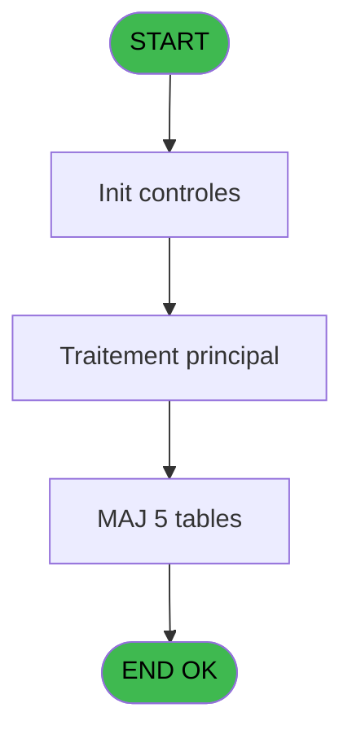
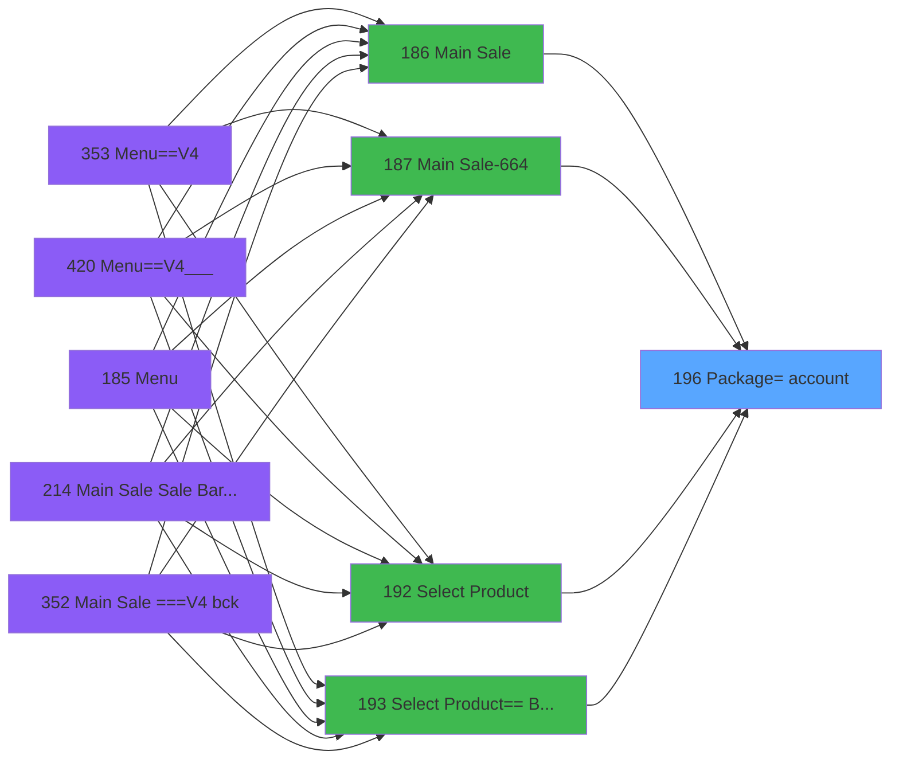

# PVE IDE 196 - Package=> account

> **Analyse**: Phases 1-4 2026-02-03 18:50 -> 18:50 (14s) | Assemblage 18:50
> **Pipeline**: V7.2 Enrichi
> **Structure**: 4 onglets (Resume | Ecrans | Donnees | Connexions)

<!-- TAB:Resume -->

## 1. FICHE D'IDENTITE

| Attribut | Valeur |
|----------|--------|
| Projet | PVE |
| IDE Position | 196 |
| Nom Programme | Package=> account |
| Fichier source | `Prg_196.xml` |
| Dossier IDE | Mobile |
| Taches | 8 (0 ecrans visibles) |
| Tables modifiees | 5 |
| Programmes appeles | 1 |

## 2. DESCRIPTION FONCTIONNELLE

**Package=> account** assure la gestion complete de ce processus, accessible depuis [Main Sale Sale Bar Code (IDE 214)](PVE-IDE-214.md), [Main Sale (IDE 186)](PVE-IDE-186.md), [Main Sale-664 (IDE 187)](PVE-IDE-187.md), [Main Sale (IDE 363)](PVE-IDE-363.md), [Main Sale-664 (IDE 364)](PVE-IDE-364.md), [Main Sale (IDE 440)](PVE-IDE-440.md), [Main Sale ===V4 Booking ACTUEL (IDE 417)](PVE-IDE-417.md), [Select Product== Best Of (IDE 193)](PVE-IDE-193.md), [Main Sale ===V4 (IDE 0)](PVE-IDE-0.md), [Select Product (IDE 192)](PVE-IDE-192.md), [    Package pricing (IDE 218)](PVE-IDE-218.md), [Main Sale ===V4 bck (IDE 352)](PVE-IDE-352.md), [Main Sale ===V4 (IDE 354)](PVE-IDE-354.md), [Select Product==V4 (IDE 356)](PVE-IDE-356.md), [Main Sale ===V4 (IDE 359)](PVE-IDE-359.md), [Select Product==V4 (IDE 360)](PVE-IDE-360.md), [Select Product==V4 (IDE 405)](PVE-IDE-405.md), [Main Sale ===V4 (IDE 409)](PVE-IDE-409.md), [Select Product== Best Of (IDE 413)](PVE-IDE-413.md), [Main Sale ===V4 (IDE 415)](PVE-IDE-415.md).

Le flux de traitement s'organise en **2 blocs fonctionnels** :

- **Creation** (6 taches) : insertion d'enregistrements en base (mouvements, prestations)
- **Traitement** (2 taches) : traitements metier divers

**Donnees modifiees** : 5 tables en ecriture (pv_customer, pv_discount_reasons, pv_cust_rentals, pv_sellers_by_week, Table_1539).

Detail : phases du traitement

#### Phase 1 : Traitement (2 taches)

- **196** - Package=> cust account **[[ECRAN]](#ecran-t1)**
- **196.2** - Get last package id

Delegue a : [  Test imputation OK ? (IDE 211)](PVE-IDE-211.md)

#### Phase 2 : Creation (6 taches)

- **196.1** - create cust package **[[ECRAN]](#ecran-t2)**
- **196.3** - create cust package **[[ECRAN]](#ecran-t7)**
- **196.4** - create cust package **[[ECRAN]](#ecran-t8)**
- **196.5** - Create cust rentals **[[ECRAN]](#ecran-t9)**
- **196.6** - Create Card Type
- **196.7** - create cust package **[[ECRAN]](#ecran-t13)**

#### Tables impactees

| Table | Operations | Role metier |
|-------|-----------|-------------|
| pv_cust_rentals | R/**W**/L (5 usages) |  |
| pv_discount_reasons | **W**/L (2 usages) |  |
| pv_customer | **W**/L (2 usages) |  |
| pv_sellers_by_week | **W** (1 usages) |  |
| Table_1539 | **W** (1 usages) |  |

## 3. BLOCS FONCTIONNELS

### 3.1 Traitement (2 taches)

Traitements internes.

---

#### 196 - Package=> cust account [[ECRAN]](#ecran-t1)

**Role** : Traitement : Package=> cust account.
**Ecran** : 344 x 227 DLU (MDI) | [Voir mockup](#ecran-t1)
**Variables liees** : A (P. Customer)
**Delegue a** : [  Test imputation OK ? (IDE 211)](PVE-IDE-211.md)

---

#### 196.2 - Get last package id

**Role** : Consultation/chargement : Get last package id.
**Variables liees** : B (P. Package Id OUT), V (P. New package id), W (P.Package/Forfait (O/N)), Y (V New package id), BA (V Package Id IN)
**Delegue a** : [  Test imputation OK ? (IDE 211)](PVE-IDE-211.md)

### 3.2 Creation (6 taches)

Insertion de nouveaux enregistrements en base.

---

#### 196.1 - create cust package [[ECRAN]](#ecran-t2)

**Role** : Traitement : create cust package.
**Ecran** : 123 x 85 DLU (MDI) | [Voir mockup](#ecran-t2)
**Variables liees** : A (P. Customer), B (P. Package Id OUT), V (P. New package id), W (P.Package/Forfait (O/N)), Y (V New package id)

---

#### 196.3 - create cust package [[ECRAN]](#ecran-t7)

**Role** : Traitement : create cust package.
**Ecran** : 123 x 85 DLU (MDI) | [Voir mockup](#ecran-t7)
**Variables liees** : A (P. Customer), B (P. Package Id OUT), V (P. New package id), W (P.Package/Forfait (O/N)), Y (V New package id)

---

#### 196.4 - create cust package [[ECRAN]](#ecran-t8)

**Role** : Traitement : create cust package.
**Ecran** : 123 x 85 DLU (MDI) | [Voir mockup](#ecran-t8)
**Variables liees** : A (P. Customer), B (P. Package Id OUT), V (P. New package id), W (P.Package/Forfait (O/N)), Y (V New package id)

---

#### 196.5 - Create cust rentals [[ECRAN]](#ecran-t9)

**Role** : Traitement : Create cust rentals.
**Ecran** : 173 x 115 DLU (MDI) | [Voir mockup](#ecran-t9)
**Variables liees** : A (P. Customer)

---

#### 196.6 - Create Card Type

**Role** : Traitement : Create Card Type.
**Variables liees** : C (P. Action type), H (P. Payment type), BB (T Credit Card)

---

#### 196.7 - create cust package [[ECRAN]](#ecran-t13)

**Role** : Traitement : create cust package.
**Ecran** : 123 x 85 DLU (MDI) | [Voir mockup](#ecran-t13)
**Variables liees** : A (P. Customer), B (P. Package Id OUT), V (P. New package id), W (P.Package/Forfait (O/N)), Y (V New package id)

## 5. REGLES METIER

*(Aucune regle metier identifiee)*

## 6. CONTEXTE

- **Appele par**: [Main Sale Sale Bar Code (IDE 214)](PVE-IDE-214.md), [Main Sale (IDE 186)](PVE-IDE-186.md), [Main Sale-664 (IDE 187)](PVE-IDE-187.md), [Main Sale (IDE 363)](PVE-IDE-363.md), [Main Sale-664 (IDE 364)](PVE-IDE-364.md), [Main Sale (IDE 440)](PVE-IDE-440.md), [Main Sale ===V4 Booking ACTUEL (IDE 417)](PVE-IDE-417.md), [Select Product== Best Of (IDE 193)](PVE-IDE-193.md), [Main Sale ===V4 (IDE 0)](PVE-IDE-0.md), [Select Product (IDE 192)](PVE-IDE-192.md), [    Package pricing (IDE 218)](PVE-IDE-218.md), [Main Sale ===V4 bck (IDE 352)](PVE-IDE-352.md), [Main Sale ===V4 (IDE 354)](PVE-IDE-354.md), [Select Product==V4 (IDE 356)](PVE-IDE-356.md), [Main Sale ===V4 (IDE 359)](PVE-IDE-359.md), [Select Product==V4 (IDE 360)](PVE-IDE-360.md), [Select Product==V4 (IDE 405)](PVE-IDE-405.md), [Main Sale ===V4 (IDE 409)](PVE-IDE-409.md), [Select Product== Best Of (IDE 413)](PVE-IDE-413.md), [Main Sale ===V4 (IDE 415)](PVE-IDE-415.md)
- **Appelle**: 1 programmes | **Tables**: 18 (W:5 R:2 L:15) | **Taches**: 8 | **Expressions**: 36

<!-- TAB:Ecrans -->

## 8. ECRANS

*(Programme sans ecran visible)*

## 9. NAVIGATION

### 9.3 Structure hierarchique (8 taches)

| Position | Tache | Type | Dimensions | Bloc |
|----------|-------|------|------------|------|
| **196.1** | [**Package=> cust account** (196)](#t1) [mockup](#ecran-t1) | MDI | 344x227 | Traitement |
| 196.1.1 | [Get last package id (196.2)](#t3) | MDI | - | |
| **196.2** | [**create cust package** (196.1)](#t2) [mockup](#ecran-t2) | MDI | 123x85 | Creation |
| 196.2.1 | [create cust package (196.3)](#t7) [mockup](#ecran-t7) | MDI | 123x85 | |
| 196.2.2 | [create cust package (196.4)](#t8) [mockup](#ecran-t8) | MDI | 123x85 | |
| 196.2.3 | [Create cust rentals (196.5)](#t9) [mockup](#ecran-t9) | MDI | 173x115 | |
| 196.2.4 | [Create Card Type (196.6)](#t10) | MDI | - | |
| 196.2.5 | [create cust package (196.7)](#t13) [mockup](#ecran-t13) | MDI | 123x85 | |

### 9.4 Algorigramme

> **Legende**: Vert = START/END OK | Rouge = END KO | Bleu = Decisions
> *Algorigramme auto-genere. Utiliser `/algorigramme` pour une synthese metier detaillee.*

<!-- TAB:Donnees -->

## 10. TABLES

### Tables utilisees (18)

| ID | Nom | Description | Type | R | W | L | Usages |
|----|-----|-------------|------|---|---|---|--------|
| 30 | gm-recherche_____gmr | Index de recherche | DB | R |   |   | 1 |
| 34 | hebergement______heb | Hebergement (chambres) | DB |   |   | L | 1 |
| 47 | compte_gm________cgm | Comptes GM (generaux) | DB |   |   | L | 1 |
| 77 | articles_________art | Articles et stock | DB |   |   | L | 1 |
| 79 | gratuites________gra |  | DB |   |   | L | 1 |
| 120 | tables_qualites__qua |  | DB |   |   | L | 1 |
| 378 | pv_customer |  | DB |   | **W** | L | 2 |
| 379 | pv_customer_temp |  | DB |   |   | L | 1 |
| 382 | pv_discount_reasons |  | DB |   | **W** | L | 2 |
| 389 | pv_equipment_inventory |  | DB |   |   | L | 1 |
| 400 | pv_cust_rentals |  | DB | R | **W** | L | 5 |
| 401 | pv_cust_rentals_histo | Historique / journal | DB |   |   | L | 1 |
| 403 | pv_sellers |  | DB |   |   | L | 1 |
| 404 | pv_sellers_by_week |  | DB |   | **W** |   | 1 |
| 413 | pv_tva |  | DB |   |   | L | 1 |
| 418 | pv_years |  | DB |   |   | L | 1 |
| 1488 | Table_1488 |  | MEM |   |   | L | 1 |
| 1539 | Table_1539 |  | MEM |   | **W** |   | 1 |

### Colonnes par table (6 / 6 tables avec colonnes identifiees)

Table 30 - gm-recherche_____gmr (R) - 1 usages

| Lettre | Variable | Acces | Type |
|--------|----------|-------|------|
| A | P. Customer | R | Numeric |
| B | P. Package Id OUT | R | Numeric |
| C | P. Action type | R | Alpha |
| D | P. Date | R | Date |
| E | P. Category | R | Numeric |
| F | P. Sub cat | R | Numeric |
| G | P. Product | R | Numeric |
| H | P. Payment type | R | Alpha |
| I | P. Equipment id | R | Alpha |
| J | P. FlagDate | R | Numeric |
| K | P. Quantity | R | Numeric |
| L | P. ART Quantité en stock | R | Numeric |
| M | P.Prix | R | Numeric |
| N | P.Montant PrePaid | R | Numeric |
| O | P.Service | R | Alpha |
| P | P.Code Fidelisation | R | Alpha |
| Q | P.Start location date | R | Date |
| R | P.Art Prix Libre | R | Logical |
| S | P.BookingID | R | Unicode |
| T | P.BookingOrderID | R | Numeric |
| U | P.without invoicing | R | Logical |
| V | P. New package id | R | Numeric |
| W | P.Package/Forfait (O/N) | R | Logical |
| X | P.M&E ? | R | Logical |
| Y | V New package id | R | Numeric |
| Z | L.Package_Exist | R | Logical |
| BA | V Package Id IN | R | Numeric |
| BB | T Credit Card | R | Logical |
| BC | v Lien Remise Great Members | R | Logical |
| BD | v.Article imputation existe ? | R | Logical |
| BE | v.ImputationGratuite ? | R | Logical |
| BF | e.qualité? | R | Logical |
| BG | V.today | R | Logical |
| BH | V.start date rental | R | Date |
| BI | V.Force Free pour les enfants ? | R | Logical |
| BJ | Condition supp coef=0 | R | Logical |

Table 378 - pv_customer (**W**/L) - 2 usages

| Lettre | Variable | Acces | Type |
|--------|----------|-------|------|
| A | P. Customer | W | Numeric |

Table 382 - pv_discount_reasons (**W**/L) - 2 usages

*Table utilisee uniquement en Link ou aucune colonne Real identifiee dans le DataView.*

Table 400 - pv_cust_rentals (R/**W**/L) - 5 usages

| Lettre | Variable | Acces | Type |
|--------|----------|-------|------|
| A | v.Condition FREE | W | Logical |
| B | v.Condition CLUBMEDPASS | W | Logical |
| C | v.Condition PREPAID | W | Logical |

Table 404 - pv_sellers_by_week (**W**) - 1 usages

*Table utilisee uniquement en Link ou aucune colonne Real identifiee dans le DataView.*

Table 1539 - Table_1539 (**W**) - 1 usages

*Table utilisee uniquement en Link ou aucune colonne Real identifiee dans le DataView.*

## 11. VARIABLES

### 11.1 Parametres entrants (24)

Variables recues du programme appelant ([Main Sale Sale Bar Code (IDE 214)](PVE-IDE-214.md)).

| Lettre | Nom | Type | Usage dans |
|--------|-----|------|-----------|
| A | P. Customer | Numeric | 2x parametre entrant |
| B | P. Package Id OUT | Numeric | [196](#t1), [196.1](#t2), [196.2](#t3) |
| C | P. Action type | Alpha | [196.6](#t10) |
| D | P. Date | Date | - |
| E | P. Category | Numeric | 1x parametre entrant |
| F | P. Sub cat | Numeric | 1x parametre entrant |
| G | P. Product | Numeric | 1x parametre entrant |
| H | P. Payment type | Alpha | - |
| I | P. Equipment id | Alpha | - |
| J | P. FlagDate | Numeric | - |
| K | P. Quantity | Numeric | - |
| L | P. ART Quantité en stock | Numeric | - |
| M | P.Prix | Numeric | - |
| N | P.Montant PrePaid | Numeric | - |
| O | P.Service | Alpha | 1x parametre entrant |
| P | P.Code Fidelisation | Alpha | 1x parametre entrant |
| Q | P.Start location date | Date | - |
| R | P.Art Prix Libre | Logical | 1x parametre entrant |
| S | P.BookingID | Unicode | - |
| T | P.BookingOrderID | Numeric | - |
| U | P.without invoicing | Logical | 1x parametre entrant |
| V | P. New package id | Numeric | - |
| W | P.Package/Forfait (O/N) | Logical | 2x parametre entrant |
| X | P.M&E ? | Logical | - |

### 11.2 Variables de session (8)

Variables persistantes pendant toute la session.

| Lettre | Nom | Type | Usage dans |
|--------|-----|------|-----------|
| Y | V New package id | Numeric | [196](#t1), [196.1](#t2), [196.2](#t3) |
| BA | V Package Id IN | Numeric | - |
| BC | v Lien Remise Great Members | Logical | - |
| BD | v.Article imputation existe ? | Logical | - |
| BE | v.ImputationGratuite ? | Logical | 1x session |
| BG | V.today | Logical | - |
| BH | V.start date rental | Date | - |
| BI | V.Force Free pour les enfants ? | Logical | - |

### 11.3 Autres (4)

Variables diverses.

| Lettre | Nom | Type | Usage dans |
|--------|-----|------|-----------|
| Z | L.Package_Exist | Logical | - |
| BB | T Credit Card | Logical | - |
| BF | e.qualité? | Logical | - |
| BJ | Condition supp coef=0 | Logical | - |

Toutes les 36 variables (liste complete)

| Cat | Lettre | Nom Variable | Type |
|-----|--------|--------------|------|
| P0 | **A** | P. Customer | Numeric |
| P0 | **B** | P. Package Id OUT | Numeric |
| P0 | **C** | P. Action type | Alpha |
| P0 | **D** | P. Date | Date |
| P0 | **E** | P. Category | Numeric |
| P0 | **F** | P. Sub cat | Numeric |
| P0 | **G** | P. Product | Numeric |
| P0 | **H** | P. Payment type | Alpha |
| P0 | **I** | P. Equipment id | Alpha |
| P0 | **J** | P. FlagDate | Numeric |
| P0 | **K** | P. Quantity | Numeric |
| P0 | **L** | P. ART Quantité en stock | Numeric |
| P0 | **M** | P.Prix | Numeric |
| P0 | **N** | P.Montant PrePaid | Numeric |
| P0 | **O** | P.Service | Alpha |
| P0 | **P** | P.Code Fidelisation | Alpha |
| P0 | **Q** | P.Start location date | Date |
| P0 | **R** | P.Art Prix Libre | Logical |
| P0 | **S** | P.BookingID | Unicode |
| P0 | **T** | P.BookingOrderID | Numeric |
| P0 | **U** | P.without invoicing | Logical |
| P0 | **V** | P. New package id | Numeric |
| P0 | **W** | P.Package/Forfait (O/N) | Logical |
| P0 | **X** | P.M&E ? | Logical |
| V. | **Y** | V New package id | Numeric |
| V. | **BA** | V Package Id IN | Numeric |
| V. | **BC** | v Lien Remise Great Members | Logical |
| V. | **BD** | v.Article imputation existe ? | Logical |
| V. | **BE** | v.ImputationGratuite ? | Logical |
| V. | **BG** | V.today | Logical |
| V. | **BH** | V.start date rental | Date |
| V. | **BI** | V.Force Free pour les enfants ? | Logical |
| Autre | **Z** | L.Package_Exist | Logical |
| Autre | **BB** | T Credit Card | Logical |
| Autre | **BF** | e.qualité? | Logical |
| Autre | **BJ** | Condition supp coef=0 | Logical |

## 12. EXPRESSIONS

**36 / 36 expressions decodees (100%)**

### 12.1 Repartition par type

| Type | Expressions | Regles |
|------|-------------|--------|
| CONSTANTE | 2 | 0 |
| DATE | 1 | 0 |
| OTHER | 27 | 0 |
| CAST_LOGIQUE | 1 | 0 |
| CONDITION | 5 | 0 |

### 12.2 Expressions cles par type

#### CONSTANTE (2 expressions)

| Type | IDE | Expression | Regle |
|------|-----|------------|-------|
| CONSTANTE | 22 | `'H'` | - |
| CONSTANTE | 2 | `''` | - |

#### DATE (1 expressions)

| Type | IDE | Expression | Regle |
|------|-----|------------|-------|
| DATE | 21 | `Date ()` | - |

#### OTHER (27 expressions)

| Type | IDE | Expression | Regle |
|------|-----|------------|-------|
| OTHER | 25 | `[CB]` | - |
| OTHER | 26 | `P.Code Fidelisation [P]` | - |
| OTHER | 28 | `[CB]` | - |
| OTHER | 19 | `NOT(P.Package/Forfait (O/N) [W])` | - |
| OTHER | 20 | `V New package id [Y] AND NOT ([AE]) AND VG41 AND NOT(P.Art Prix Libre [R])` | - |
| ... | | *+22 autres* | |

#### CAST_LOGIQUE (1 expressions)

| Type | IDE | Expression | Regle |
|------|-----|------------|-------|
| CAST_LOGIQUE | 9 | `'FALSE'LOG` | - |

#### CONDITION (5 expressions)

| Type | IDE | Expression | Regle |
|------|-----|------------|-------|
| CONDITION | 27 | `VG92 AND [AJ]<>0 AND [AJ] <[CC]` | - |
| CONDITION | 36 | `[CJ]=0 AND P.without invoicing [U]` | - |
| CONDITION | 23 | `VG65 AND [BT] <> 0 AND P. Action type [C]='SALE'` | - |
| CONDITION | 17 | `[CJ]=0` | - |
| CONDITION | 18 | `P. Action type [C]<>'SALE'` | - |

### 12.3 Toutes les expressions (36)

Voir les 36 expressions

#### CONSTANTE (2)

| IDE | Expression Decodee |
|-----|-------------------|
| 2 | `''` |
| 22 | `'H'` |

#### DATE (1)

| IDE | Expression Decodee |
|-----|-------------------|
| 21 | `Date ()` |

#### OTHER (27)

| IDE | Expression Decodee |
|-----|-------------------|
| 1 | `P.Service [O]` |
| 3 | `P. Customer [A]` |
| 4 | `[AG]` |
| 5 | `[AH]` |
| 6 | `P. Category [E]` |
| 7 | `P. Sub cat [F]` |
| 8 | `P. Product [G]` |
| 10 | `P. Package Id OUT [B]` |
| 11 | `[CH]` |
| 12 | `[BK]` |
| 13 | `[BL]` |
| 14 | `P. Action type [C]` |
| 15 | `P. Customer [A]` |
| 16 | `[AS]` |
| 19 | `NOT(P.Package/Forfait (O/N) [W])` |
| 20 | `V New package id [Y] AND NOT ([AE]) AND VG41 AND NOT(P.Art Prix Libre [R])` |
| 24 | `v.ImputationGratuite ? [BE]` |
| 25 | `[CB]` |
| 26 | `P.Code Fidelisation [P]` |
| 28 | `[CB]` |
| 29 | `[AI]` |
| 30 | `[DE]` |
| 31 | `[DF]` |
| 32 | `NOT(P.Package/Forfait (O/N) [W])` |
| 33 | `[CP]` |
| 34 | `[CQ]` |
| 35 | `[DT]` |

#### CAST_LOGIQUE (1)

| IDE | Expression Decodee |
|-----|-------------------|
| 9 | `'FALSE'LOG` |

#### CONDITION (5)

| IDE | Expression Decodee |
|-----|-------------------|
| 17 | `[CJ]=0` |
| 18 | `P. Action type [C]<>'SALE'` |
| 23 | `VG65 AND [BT] <> 0 AND P. Action type [C]='SALE'` |
| 27 | `VG92 AND [AJ]<>0 AND [AJ] <[CC]` |
| 36 | `[CJ]=0 AND P.without invoicing [U]` |

<!-- TAB:Connexions -->

## 13. GRAPHE D'APPELS

### 13.1 Chaine depuis Main (Callers)

Main -> ... -> [Main Sale Sale Bar Code (IDE 214)](PVE-IDE-214.md) -> **Package=> account (IDE 196)**

Main -> ... -> [Main Sale (IDE 186)](PVE-IDE-186.md) -> **Package=> account (IDE 196)**

Main -> ... -> [Main Sale-664 (IDE 187)](PVE-IDE-187.md) -> **Package=> account (IDE 196)**

Main -> ... -> [Main Sale (IDE 363)](PVE-IDE-363.md) -> **Package=> account (IDE 196)**

Main -> ... -> [Main Sale-664 (IDE 364)](PVE-IDE-364.md) -> **Package=> account (IDE 196)**

Main -> ... -> [Main Sale (IDE 440)](PVE-IDE-440.md) -> **Package=> account (IDE 196)**

Main -> ... -> [Main Sale ===V4 Booking ACTUEL (IDE 417)](PVE-IDE-417.md) -> **Package=> account (IDE 196)**

Main -> ... -> [Select Product== Best Of (IDE 193)](PVE-IDE-193.md) -> **Package=> account (IDE 196)**

Main -> ... -> [Main Sale ===V4 (IDE 0)](PVE-IDE-0.md) -> **Package=> account (IDE 196)**

Main -> ... -> [Select Product (IDE 192)](PVE-IDE-192.md) -> **Package=> account (IDE 196)**

Main -> ... -> [    Package pricing (IDE 218)](PVE-IDE-218.md) -> **Package=> account (IDE 196)**

Main -> ... -> [Main Sale ===V4 bck (IDE 352)](PVE-IDE-352.md) -> **Package=> account (IDE 196)**

Main -> ... -> [Main Sale ===V4 (IDE 354)](PVE-IDE-354.md) -> **Package=> account (IDE 196)**

Main -> ... -> [Select Product==V4 (IDE 356)](PVE-IDE-356.md) -> **Package=> account (IDE 196)**

Main -> ... -> [Main Sale ===V4 (IDE 359)](PVE-IDE-359.md) -> **Package=> account (IDE 196)**

Main -> ... -> [Select Product==V4 (IDE 360)](PVE-IDE-360.md) -> **Package=> account (IDE 196)**

Main -> ... -> [Select Product==V4 (IDE 405)](PVE-IDE-405.md) -> **Package=> account (IDE 196)**

Main -> ... -> [Main Sale ===V4 (IDE 409)](PVE-IDE-409.md) -> **Package=> account (IDE 196)**

Main -> ... -> [Select Product== Best Of (IDE 413)](PVE-IDE-413.md) -> **Package=> account (IDE 196)**

Main -> ... -> [Main Sale ===V4 (IDE 415)](PVE-IDE-415.md) -> **Package=> account (IDE 196)**

### 13.2 Callers

| IDE | Nom Programme | Nb Appels |
|-----|---------------|-----------|
| [214](PVE-IDE-214.md) | Main Sale Sale Bar Code | 5 |
| [186](PVE-IDE-186.md) | Main Sale | 4 |
| [187](PVE-IDE-187.md) | Main Sale-664 | 4 |
| [363](PVE-IDE-363.md) | Main Sale | 4 |
| [364](PVE-IDE-364.md) | Main Sale-664 | 4 |
| [440](PVE-IDE-440.md) | Main Sale | 4 |
| [417](PVE-IDE-417.md) | Main Sale ===V4 Booking ACTUEL | 3 |
| [193](PVE-IDE-193.md) | Select Product== Best Of | 2 |
| [0](PVE-IDE-0.md) | Main Sale ===V4 | 1 |
| [192](PVE-IDE-192.md) | Select Product | 1 |
| [218](PVE-IDE-218.md) |     Package pricing | 1 |
| [352](PVE-IDE-352.md) | Main Sale ===V4 bck | 1 |
| [354](PVE-IDE-354.md) | Main Sale ===V4 | 1 |
| [356](PVE-IDE-356.md) | Select Product==V4 | 1 |
| [359](PVE-IDE-359.md) | Main Sale ===V4 | 1 |
| [360](PVE-IDE-360.md) | Select Product==V4 | 1 |
| [405](PVE-IDE-405.md) | Select Product==V4 | 1 |
| [409](PVE-IDE-409.md) | Main Sale ===V4 | 1 |
| [413](PVE-IDE-413.md) | Select Product== Best Of | 1 |
| [415](PVE-IDE-415.md) | Main Sale ===V4 | 1 |

### 13.3 Callees (programmes appeles)

### 13.4 Detail Callees avec contexte

| IDE | Nom Programme | Appels | Contexte |
|-----|---------------|--------|----------|
| [211](PVE-IDE-211.md) |   Test imputation OK ? | 1 | Sous-programme |

## 14. RECOMMANDATIONS MIGRATION

### 14.1 Profil du programme

| Metrique | Valeur | Impact migration |
|----------|--------|-----------------|
| Lignes de logique | 436 | Taille moyenne |
| Expressions | 36 | Peu de logique |
| Tables WRITE | 5 | Impact modere |
| Sous-programmes | 1 | Peu de dependances |
| Ecrans visibles | 0 | Ecran unique ou traitement batch |
| Code desactive | 0.5% (2 / 436) | Code sain |
| Regles metier | 0 | Pas de regle identifiee |

### 14.2 Plan de migration par bloc

#### Traitement (2 taches: 1 ecran, 1 traitement)

- **Strategie** : Orchestrateur avec 1 ecrans (Razor/React) et 1 traitements backend (services).
- Les ecrans deviennent des composants UI, les traitements invisibles deviennent des services injectables.
- 1 sous-programme(s) a migrer ou a reutiliser depuis les services existants.
- Decomposer les taches en services unitaires testables.

#### Creation (6 taches: 5 ecrans, 1 traitement)

- **Strategie** : Repository pattern avec Entity Framework Core.
- Insertion via `IRepository<T>.CreateAsync()`

### 14.3 Dependances critiques

| Dependance | Type | Appels | Impact |
|------------|------|--------|--------|
| pv_customer | Table WRITE (Database) | 1x | Schema + repository |
| pv_discount_reasons | Table WRITE (Database) | 1x | Schema + repository |
| pv_cust_rentals | Table WRITE (Database) | 2x | Schema + repository |
| pv_sellers_by_week | Table WRITE (Database) | 1x | Schema + repository |
| Table_1539 | Table WRITE (Memory) | 1x | Schema + repository |
| [  Test imputation OK ? (IDE 211)](PVE-IDE-211.md) | Sous-programme | 1x | Normale - Sous-programme |

---
*Spec DETAILED generee par Pipeline V7.2 - 2026-02-03 18:50*
